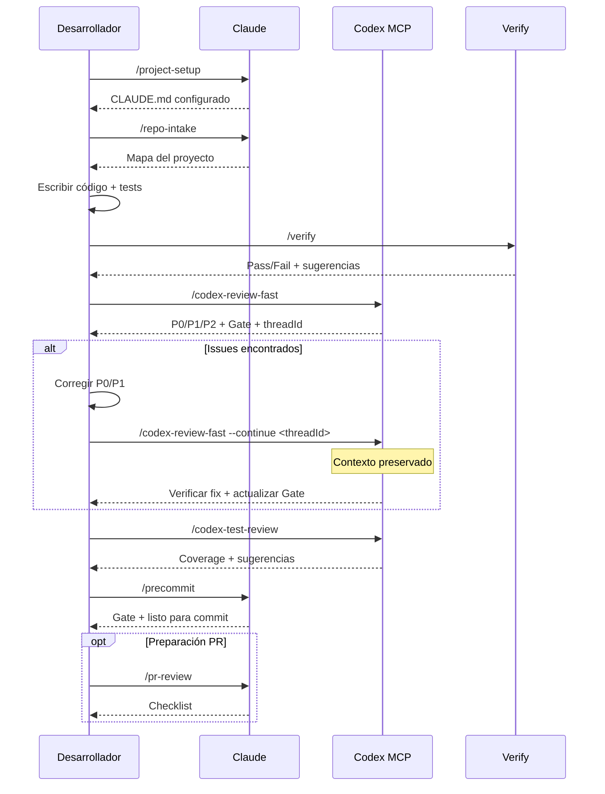

# sd0x-dev-flow

**Idioma**: [English](README.md) | [繁體中文](README.zh-TW.md) | [简体中文](README.zh-CN.md) | [日本語](README.ja.md) | [한국어](README.ko.md) | Español

Plugin de workflow de desarrollo para [Claude Code](https://claude.com/claude-code) con integración opcional de Codex MCP.

Más de 90 herramientas para code review, testing, investigación, auditoría de seguridad y automatización DevOps.

## Requisitos

- Claude Code 2.1+
- [Codex MCP](https://github.com/openai/codex) configurado (para comandos `/codex-*`)

## Instalación

```bash
# Agregar marketplace
/plugin marketplace add sd0xdev/sd0x-dev-flow

# Instalar plugin
/plugin install sd0x-dev-flow@sd0xdev-marketplace
```

## Inicio rápido

Tras instalar, ejecuta `/project-setup` para autodetectar el entorno del proyecto y configurar los placeholders:

```bash
/project-setup
```

Detecta framework, package manager, base de datos, entry points y scripts, y actualiza `CLAUDE.md` automáticamente.

## Contenido

| Categoría | Cantidad | Ejemplos |
|-----------|----------|----------|
| Commands | 36 | `/project-setup`, `/codex-review-fast`, `/verify`, `/bug-fix` |
| Skills | 23 | project-setup, code-explore, code-investigate, codex-brainstorm |
| Agents | 14 | strict-reviewer, verify-app, coverage-analyst |
| Hooks | 5 | auto-format, review state tracking, stop guard |
| Rules | 9 | auto-loop, security, testing, git-workflow |
| Scripts | 3 | precommit runner, verify runner, dep audit |

## Workflow



## Referencia de comandos

### Desarrollo

| Comando | Descripción |
|---------|-------------|
| `/project-setup` | Autodetección y configuración del proyecto |
| `/repo-intake` | Escaneo inicial del proyecto (una sola vez) |
| `/bug-fix` | Workflow de corrección de bugs |
| `/codex-implement` | Codex escribe código |
| `/codex-architect` | Consultoría de arquitectura (tercer cerebro) |
| `/code-explore` | Exploración rápida del codebase |
| `/git-investigate` | Rastreo del historial de código |
| `/issue-analyze` | Análisis profundo de issues |
| `/post-dev-test` | Tests complementarios post-desarrollo |

### Review (Codex MCP)

| Comando | Descripción | Loop support |
|---------|-------------|--------------|
| `/codex-review-fast` | Review rápido (solo diff) | `--continue <threadId>` |
| `/codex-review` | Review completo (lint + build) | `--continue <threadId>` |
| `/codex-review-branch` | Review de branch completo | - |
| `/codex-cli-review` | Review CLI (lectura completa de disco) | - |
| `/codex-review-doc` | Review de documentación | `--continue <threadId>` |
| `/codex-security` | Auditoría OWASP Top 10 | `--continue <threadId>` |
| `/codex-test-gen` | Generar tests unitarios | - |
| `/codex-test-review` | Review de test coverage | `--continue <threadId>` |
| `/codex-explain` | Explicar código complejo | - |

### Verificación

| Comando | Descripción |
|---------|-------------|
| `/verify` | lint -> typecheck -> unit -> integration -> e2e |
| `/precommit` | lint:fix -> build -> test:unit |
| `/precommit-fast` | lint:fix -> test:unit |
| `/dep-audit` | Auditoría de seguridad de dependencias npm |

### Planificación

| Comando | Descripción |
|---------|-------------|
| `/codex-brainstorm` | Brainstorming adversarial (equilibrio de Nash) |
| `/feasibility-study` | Análisis de viabilidad |
| `/tech-spec` | Generar tech spec |
| `/review-spec` | Revisar tech spec |
| `/deep-analyze` | Análisis profundo + roadmap |
| `/project-brief` | Resumen ejecutivo para PM/CTO |

### Documentación y herramientas

| Comando | Descripción |
|---------|-------------|
| `/update-docs` | Sincronizar docs con código |
| `/check-coverage` | Análisis de test coverage |
| `/create-request` | Crear/actualizar docs de requisitos |
| `/doc-refactor` | Simplificar documentación |
| `/simplify` | Simplificar código |
| `/de-ai-flavor` | Eliminar artefactos de IA |
| `/create-skill` | Crear nuevos skills |
| `/pr-review` | Self-review de PR |
| `/zh-tw` | Reescribir en chino tradicional |

## Rules

| Rule | Descripción |
|------|-------------|
| `auto-loop` | Fix -> re-review -> fix -> ... -> Pass (ciclo automático) |
| `fix-all-issues` | Tolerancia cero: corregir todos los issues encontrados |
| `framework` | Convenciones del framework (personalizables) |
| `testing` | Aislamiento Unit/Integration/E2E |
| `security` | Checklist OWASP Top 10 |
| `git-workflow` | Naming de branches, convenciones de commits |
| `docs-writing` | Tablas > párrafos, Mermaid > texto |
| `docs-numbering` | Prefijos de documentos (0-feasibility, 2-spec) |
| `logging` | JSON estructurado, sin secrets |

## Hooks

| Hook | Trigger | Propósito |
|------|---------|-----------|
| `post-edit-format` | Después de Edit/Write | Auto prettier (solo si el proyecto tiene prettier) |
| `post-tool-review-state` | Después de Edit/Bash | Tracking de estado de review |
| `pre-edit-guard` | Antes de Edit/Write | Prevenir edición de .env/.git |
| `stop-guard` | Antes de detener | Advertir si hay reviews incompletos (default: warn) |
| `stop-check` | Antes de detener | Smart check de completitud de tareas |

### Configuración de hooks

Los hooks son seguros por defecto. Variables de entorno para personalizar:

| Variable | Default | Descripción |
|----------|---------|-------------|
| `STOP_GUARD_MODE` | `warn` | Usar `strict` para bloquear stop si faltan pasos de review |
| `HOOK_NO_FORMAT` | (no definido) | `1` para desactivar auto-formateo |
| `HOOK_BYPASS` | (no definido) | `1` para saltar todos los checks de stop-guard |
| `HOOK_DEBUG` | (no definido) | `1` para mostrar info de debug |
| `GUARD_EXTRA_PATTERNS` | (no definido) | Regex para paths protegidos adicionales (ej. `src/locales/.*\.json$`) |

**Dependencias**: Los hooks requieren `jq`. El auto-formateo requiere `prettier` en el proyecto. Si faltan dependencias, los hooks se omiten automáticamente.

## Personalización

Ejecuta `/project-setup` para autodetectar y configurar todos los placeholders, o edita `CLAUDE.md` manualmente:

| Placeholder | Descripción | Ejemplo |
|-------------|-------------|---------|
| `{PROJECT_NAME}` | Nombre del proyecto | my-app |
| `{FRAMEWORK}` | Framework | MidwayJS 3.x, NestJS, Express |
| `{CONFIG_FILE}` | Archivo de config principal | src/configuration.ts |
| `{BOOTSTRAP_FILE}` | Entry de bootstrap | bootstrap.js, main.ts |
| `{DATABASE}` | Base de datos | MongoDB, PostgreSQL |
| `{TEST_COMMAND}` | Comando de tests | yarn test:unit |
| `{LINT_FIX_COMMAND}` | Auto-fix de lint | yarn lint:fix |
| `{BUILD_COMMAND}` | Comando de build | yarn build |
| `{TYPECHECK_COMMAND}` | Type checking | yarn typecheck |

## Arquitectura

```
Command (entrada) -> Skill (capacidad) -> Agent (entorno)
```

- **Commands**: El usuario los ejecuta con `/...`
- **Skills**: Knowledge bases cargadas bajo demanda
- **Agents**: Subagentes aislados con herramientas específicas
- **Hooks**: Guardrails automatizados (formateo, estado de review, stop guard)
- **Rules**: Convenciones siempre activas (carga automática)

## Contribuir

PRs bienvenidos. Por favor:

1. Seguir las convenciones de naming existentes (kebab-case)
2. Incluir `When to Use` / `When NOT to Use` en skills
3. Agregar `disable-model-invocation: true` para operaciones peligrosas
4. Testear con Claude Code antes de enviar

## Licencia

MIT
