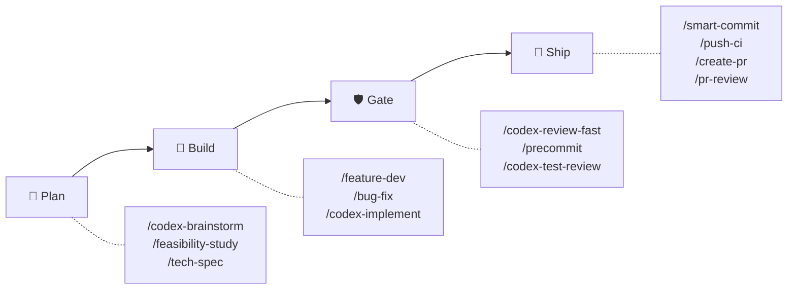
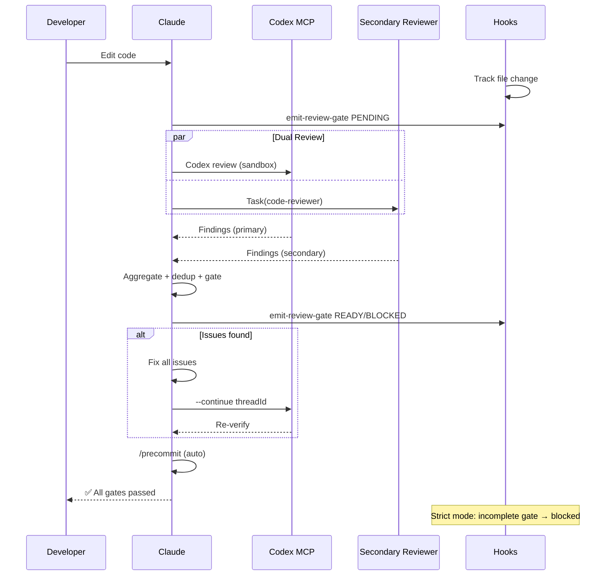

# sd0x-dev-flow


**Idioma**: [English](README.md) | [繁體中文](README.zh-TW.md) | [简体中文](README.zh-CN.md) | [日本語](README.ja.md) | [한국어](README.ko.md) | Español

> La capa harness para Claude Code.

**Gates de calidad que la IA no puede saltarse.** Una reference implementation de AI Agent Harness Engineering para [Claude Code](https://claude.com/claude-code) — dual review forzado por hooks, gates de state-machine que sobreviven a la compactación del contexto y seguridad fail-closed donde importa.

<!-- BEGIN:HERO-COUNT -->
96 bundled · 96 public skills · 15 agents — ~4% de la ventana de context de Claude
<!-- END:HERO-COUNT -->

[](LICENSE) [](https://www.npmjs.com/package/skills)

## Lo que hace este harness

> [Harness engineering](https://martinfowler.com/articles/exploring-gen-ai/harness-engineering.html) es la disciplina de diseñar todo lo que rodea al LLM — tool loops, gestión de contexto, hooks, state machines, capas de seguridad — en lugar de entrenar el modelo en sí. Mitchell Hashimoto acuñó el término en febrero de 2026; [Anthropic engineering](https://www.anthropic.com/engineering/effective-harnesses-for-long-running-agents) y [Martin Fowler](https://martinfowler.com/articles/exploring-gen-ai/harness-engineering.html) han publicado al respecto; [arXiv 2603.05344](https://arxiv.org/html/2603.05344v1) lo formaliza.

sd0x-dev-flow es una reference implementation. Cada fila de la tabla mapea un subproblema canónico de harness a código concreto que puedes estudiar:

| # | Subproblema de harness | Implementación en sd0x-dev-flow | Evidencia de código |
|---|------------------------|--------------------------------|---------------------|
| 1 | **Tool loop control** | Auto-loop `/codex-review-fast` → `/precommit` con transiciones guiadas por sentinels | [`rules/auto-loop.md`](rules/auto-loop.md) + [`hooks/post-tool-review-state.sh`](hooks/post-tool-review-state.sh) |
| 2 | **Sentinel-driven state machine** | Marcadores de gate `✅ Ready` / `⛔ Blocked` / `✅ All Pass` parseados a estado persistente | [`scripts/emit-review-gate.sh`](scripts/emit-review-gate.sh) (productor) + [`hooks/post-tool-review-state.sh`](hooks/post-tool-review-state.sh) (parser) |
| 3 | **Context recovery across compaction** | Inyección por stdout de `[AUTO_LOOP_RESUME]` tras SessionStart(compact) | [`hooks/post-compact-auto-loop.sh`](hooks/post-compact-auto-loop.sh) |
| 4 | **Lifecycle interceptors** | 5 tipos de hook event despachados a 8 scripts: PreToolUse / PostToolUse / Stop / SessionStart / UserPromptSubmit | [`hooks/`](hooks/) (8 scripts) + [`.claude/settings.json`](.claude/settings.json) |
| 5 | **Capability-based tool gating** | Frontmatter de skill `allowed-tools` — p. ej., `/ask` no tiene Edit/Write | 86 de 95 skills públicas declaran `allowed-tools` |
| 6 | **Defense-in-depth safety** | 5 capas: pre-edit-guard → commit-msg-guard → pre-push-gate → stop-guard → sidecar fail-closed marker | [`scripts/pre-push-gate.sh`](scripts/pre-push-gate.sh) + [`scripts/commit-msg-guard.sh`](scripts/commit-msg-guard.sh) + [`hooks/stop-guard.sh`](hooks/stop-guard.sh) |
| 7 | **Generator-evaluator split** | Dual review: Codex (primario) + Claude (secundario) despachados en paralelo en cada ciclo de review | [`rules/codex-invocation.md`](rules/codex-invocation.md) + [`rules/auto-loop.md`](rules/auto-loop.md) (Dual Review Mode) |
| 8 | **Incremental progress tracking** | `iteration_history.current_round` + `max_rounds` + detección de convergence plateau | [`rules/auto-loop.md`](rules/auto-loop.md) (condiciones de salida + strategic reset) |
| 9 | **Human-in-the-loop safety gates** | Confirmación por `/dev/tty` + `AskUserQuestion` para operaciones destructivas | [`scripts/pre-push-gate.sh`](scripts/pre-push-gate.sh) + [`skills/push-ci/SKILL.md`](skills/push-ci/SKILL.md) |
| 10 | **Self-improvement loop** | Corrección → registrar lesson → promover a regla tras 3+ recurrencias | [`rules/self-improvement.md`](rules/self-improvement.md) |

La mayoría de proyectos de harness cubren 2–4 de estos subproblemas. sd0x-dev-flow cubre los 10 — lo que hace el código útil como objeto de estudio, no solo como herramienta.

## ¿Por qué sd0x-dev-flow?

| Sin barreras de seguridad | Con sd0x-dev-flow |
|---|---|
| La IA salta el review cuando el contexto es largo | **Forzado por Hook**: stop-guard bloquea reviews incompletos |
| Un solo reviewer pierde problemas | **Dual dispatch**: Codex + secundario en paralelo |
| "Arreglado" sin re-verificación | **Auto-loop**: fix → re-review → pass → continuar |
| Estado de review perdido tras compact | **Seguimiento de estado**: SessionStart hook re-inyecta |

## Inicio rápido

```bash
# Instalar plugin
/plugin marketplace add sd0xdev/sd0x-dev-flow
/plugin install sd0x-dev-flow@sd0xdev-marketplace

# Configurar tu proyecto
/project-setup
```

Un solo comando autodetecta framework, package manager, base de datos, entry points y scripts. Instala un subconjunto de rules y hooks; el plugin completo incluye 14 rules + 8 hooks.

Usa `--lite` para solo configurar CLAUDE.md (sin rules/hooks).

## Cómo funciona


```mermaid
flowchart LR
    P["🎯 Plan"] --> B["🔨 Build"]
    B --> G["🛡️ Gate"]
    G --> S["🚀 Ship"]

    P -.- P1["/codex-brainstorm<br/>/feasibility-study<br/>/tech-spec"]
    B -.- B1["/feature-dev<br/>/bug-fix<br/>/codex-implement"]
    G -.- G1["/codex-review-fast<br/>/precommit<br/>/codex-test-review"]
    S -.- S1["/smart-commit<br/>/push-ci<br/>/create-pr<br/>/pr-review"]
```

El **motor auto-loop** aplica quality gates automáticamente — tras ediciones de código, el comando de review despacha **dual review** (Codex MCP + reviewer secundario en paralelo) en la misma respuesta. Los hallazgos se deduplican, normalizan por severidad y agregan en un único gate. En modo strict, los hooks aplican semántica fail-closed: si el gate agregado está incompleto, stop-guard bloquea. Ver [docs/hooks.md](docs/hooks.md) para detalles.

<details>
<summary>Detalle: Diagrama de secuencia del dual-review</summary>


```mermaid
sequenceDiagram
    participant D as Developer
    participant C as Claude
    participant X as Codex MCP
    participant T as Secondary Reviewer
    participant H as Hooks

    D->>C: Edit code
    H->>H: Track file change
    C->>H: emit-review-gate PENDING
    par Dual Review
        C->>X: Codex review (sandbox)
    and
        C->>T: Task(code-reviewer)
    end
    X-->>C: Findings (primary)
    T-->>C: Findings (secondary)
    C->>C: Aggregate + dedup + gate
    C->>H: emit-review-gate READY/BLOCKED

    alt Issues found
        C->>C: Fix all issues
        C->>X: --continue threadId
        X-->>C: Re-verify
    end

    C->>C: /precommit (auto)
    C-->>D: ✅ All gates passed

    Note over H: Strict mode: incomplete gate → blocked
```

</details>

## Funcionalidad destacada: Arquitectura Dual-Reviewer

v2.0 despacha dos reviewers independientes en paralelo — Dual-review por defecto con modos de fallback degradado:

| Reviewer | Rol | Fallback |
|----------|-----|----------|
| Codex MCP | Primario (sandbox, diff completo) | Modo single-reviewer si no está disponible |
| Secundario (pr-review-toolkit) | Review con puntuación de confianza | strict-reviewer → modo single |

Los hallazgos se **normalizan por severidad** (P0-Nit), **deduplican** (archivo + clave de issue, tolerancia ±5 líneas) y se **atribuyen por fuente** (`codex` | `toolkit` | `both`).

Gate: `✅ Ready` o `⛔ Blocked` — en modo strict, gate incompleto = bloqueado.

## Comparación

| Capacidad | sd0x-dev-flow | gstack | Prompts genéricos |
|---|---|---|---|
| Gates de review forzados | Hook + capa de comportamiento | Solo sugerencia | Ninguno |
| Dual-reviewer | Codex + secundario (paralelo) | Un solo /review | Ninguno |
| Bucle de auto-fix | Fix → re-review → pass | Manual | Ninguno |
| Investigación multi-agente | /deep-research (3 agentes) | Ninguno | Ninguno |
| Validación adversarial | Debate equilibrio Nash | Ninguno | Ninguno |
| Auto-mejora | Log de lecciones + promoción de reglas | Solo /retro stats | Ninguno |
| Soporte multi-herramienta | Codex/Cursor/Windsurf | Claude/Codex/Gemini/Cursor | N/A |

## Cuándo usar

| Buen ajuste | No ideal |
|-------------|----------|
| Proyectos individuales o de equipos pequeños con Claude Code | Equipos que no usan Claude Code |
| Proyectos que necesitan gates de review automatizados | Scripts únicos sin CI |
| Usuarios de Codex CLI / Cursor / Windsurf (subconjunto de skills) | Proyectos que requieren proveedores de LLM personalizados |
| Repos donde los quality gates previenen regresiones | Repos sin infraestructura de testing |

## Instalación

### Codex CLI / Otros Agentes de IA

```bash
# Instalar skills individuales vía Agent Skills standard
npx skills add sd0xdev/sd0x-dev-flow

# Generar AGENTS.md + instalar hooks (en Claude Code)
/codex-setup init
```

<!-- BEGIN:INSTALL-COVERAGE -->
| Método | Herramientas | Cobertura |
|--------|-------------|-----------|
| Instalar plugin | Claude Code | Completa (96 bundled skills, hooks, rules, auto-loop) |
| `npx skills add` | Codex CLI, Cursor, Windsurf, Aider | Solo Skills (96 public skills) |
| `/codex-setup init` | Codex CLI | AGENTS.md kernel + git hooks |
<!-- END:INSTALL-COVERAGE -->

**Requisitos**: Claude Code 2.1+ | [Codex MCP](https://github.com/openai/codex) (opcional — los skills `/codex-*` lo requieren; sin él, se usa modo single-reviewer)

## Tracks de workflow

| Workflow | Comandos | Gate | Aplicado por |
|----------|----------|------|--------------|
| Funcionalidad | `/feature-dev` → `/verify` → `/codex-review-fast` → `/precommit` | ✅/⛔ | Hook + Comportamiento |
| Bug Fix | `/issue-analyze` → `/bug-fix` → `/verify` → `/precommit` | ✅/⛔ | Hook + Comportamiento |
| Auto-Loop | Edición de código → `/codex-review-fast` → `/precommit` | ✅/⛔ | Hook |
| Doc Review | Edición `.md` → `/codex-review-doc` | ✅/⛔ | Hook |
| Planificación | `/codex-brainstorm` → `/feasibility-study` → `/tech-spec` | — | — |
| Onboarding | `/project-setup` → `/repo-intake` | — | — |

<details>
<summary>Visual: Diagramas de flujo de workflows</summary>


```mermaid
flowchart TD
    subgraph feat ["🔨 Feature Development"]
        F1["/feature-dev"] --> F2["Code + Tests"]
        F2 --> F3["/verify"]
        F3 --> F4["/codex-review-fast"]
        F4 --> F5["/precommit"]
        F5 --> F6["/update-docs"]
    end

    subgraph fix ["🐛 Bug Fix"]
        B1["/issue-analyze"] --> B2["/bug-fix"]
        B2 --> B3["Fix + Regression test"]
        B3 --> B4["/verify"]
        B4 --> B5["/codex-review-fast"]
        B5 --> B6["/precommit"]
    end

    subgraph docs ["📝 Docs Only"]
        D1["Edit .md"] --> D2["/codex-review-doc"]
        D2 --> D3["Done"]
    end

    subgraph plan ["🎯 Planning"]
        P1["/codex-brainstorm"] --> P2["/feasibility-study"]
        P2 --> P3["/tech-spec"]
        P3 --> P4["/codex-architect"]
        P4 --> P5["Implementation ready"]
    end

    subgraph ops ["⚙️ Operations"]
        O1["/project-setup"] --> O2["/repo-intake"]
        O2 --> O3["Develop"]
        O3 --> O4["/project-audit"]
        O3 --> O7["/best-practices"]
        O3 --> O5["/risk-assess"]
        O4 --> O6["/next-step --go"]
        O5 --> O6
        O7 --> O6
    end
```

</details>

## Guía Práctica (Cookbook)

Escenarios reales que muestran qué habilidades combinar y en qué orden.

| Escenario | Flujo | Documentación |
|-----------|-------|------|
| Primer día en un repositorio | `/project-setup` → `/repo-intake` → `/next-step` | [→](docs/cookbook/first-day.md) |
| Implementar una nueva funcionalidad | `/feature-dev` → `/verify` → `/codex-test-review` → `/codex-review-fast` → `/precommit` | [→](docs/cookbook/new-feature.md) |
| Resolver comentarios de review de PR | `/load-pr-review` → corregir → `/codex-review-fast` → `/push-ci` | [→](docs/cookbook/pr-review-comments.md) |
| Revisión de seguridad pre-merge | `/codex-security` → `/dep-audit` → `/risk-assess` → `/pre-pr-audit` | [→](docs/cookbook/security-pre-merge.md) |
| **Destacado:** Validar dirección | `/deep-research` → `/best-practices` → `/feasibility-study` → `/codex-brainstorm` | [→](docs/cookbook/validate-direction.md) |
| **Destacado:** Diseño adversarial | `/codex-brainstorm` (debate de equilibrio de Nash) → `/codex-architect` | [→](docs/cookbook/adversarial-design.md) |

[Los 10 escenarios →](docs/cookbook/)

## Contenido

<!-- BEGIN:WHATS-INCLUDED-COUNT -->
| Categoría | Cantidad | Ejemplos |
|-----------|----------|----------|
| Skills | 96 public (96 bundled) | `/project-setup`, `/codex-review-fast`, `/verify`, `/smart-commit`, `/deep-research` |
| Agents | 15 | strict-reviewer, verify-app, coverage-analyst, architecture-designer |
| Hooks | 8 | pre-edit-guard, auto-format, review state tracking, stop guard, post-compact-auto-loop, post-skill-auto-loop, user-prompt-review-guard, session-init |
| Rules | 14 | auto-loop, auto-loop-project, codex-invocation, security, testing, git-workflow, self-improvement, context-management |
| Scripts | 17 | precommit runner, verify runner, dep audit, namespace hint, skill runner, commit-msg guard, pre-push gate, emit-review-gate, emit-plan-gate, build-codex-artifacts, resolve-feature (CLI + shell), classify-docs, detect-scope, migration-audit, security-redact, readme-catalog |
<!-- END:WHATS-INCLUDED-COUNT -->

### Mínimo consumo de context

~4% de la ventana de 200k tokens de Claude — el 96% queda disponible para tu código.

| Componente | Tokens | % de 200k |
|------------|--------|-----------|
| Rules (carga permanente) | 5.1k | 2.6% |
| Skills (bajo demanda) | 1.9k | 1.0% |
| Agents | 791 | 0.4% |
| **Total** | **~8k** | **~4%** |

Los skills se cargan bajo demanda. Los skills inactivos no consumen tokens.

## Referencia de Skills

<!-- BEGIN:ESSENTIAL-SKILLS -->
| Skill | Cuándo usar |
|-------|-------------|
| `/project-setup` | Configuración inicial del proyecto |
| `/bug-fix` | Corregir bugs y resolver issues |
| `/feature-dev` | Implementar funcionalidades de principio a fin |
| `/smart-commit` | Hacer commit con agrupación inteligente |
| `/push-ci` | Push de código y monitoreo de CI |
| `/create-pr` | Crear pull requests en GitHub |
| `/codex-review-fast` | Review rápido de código (solo diff) |
| `/codex-review-doc` | Revisar cambios en documentación |
| `/codex-security` | Auditoría de seguridad OWASP Top 10 |
| `/verify` | Ejecutar la cadena de verificación completa |
| `/precommit` | Quality gate pre-commit (lint + build + test) |
| `/precommit-fast` | precommit rápido (lint + test, sin build) |
| `/codex-brainstorm` | Brainstorming adversarial (equilibrio de Nash) |
| `/tech-spec` | Escribir especificaciones técnicas |
| `/pr-review` | Self-review de PR antes de merge |
<!-- END:ESSENTIAL-SKILLS -->

<!-- BEGIN:FULL-CATALOG -->
<details>
<summary>Las 96 public skills</summary>

### Desarrollo (33)

| Skill | Descripción |
|-------|-------------|
| `/ask` | Q&A con reconocimiento de contexto. Recopila automáticamente información contextual. |
| `/bug-fix` | Bug fix workflow. |
| `/bump-version` | Bump package and plugin version in sync. |
| `/code-explore` | Pure Claude code investigation. |
| `/code-investigate` | Dual-perspective code investigation. |
| `/codex-architect` | Codex architecture consulting. |
| `/codex-implement` | Implement features via Codex MCP. |
| `/codex-setup` | Initialize sd0x-dev-flow infrastructure for Codex CLI and other non-Claude agents. |
| `/create-pr` | Create or update GitHub PR with gh CLI. |
| `/debug` | Interactive debugging workflow with hypothesis-driven probe loop. |
| `/deep-explore` | Multi-wave parallel code exploration orchestrator. |
| `/epic-merge` | Squash-merge secuencial de cadenas de PRs apiladas en una epic branch. |
| `/feature-dev` | Feature development workflow. |
| `/feature-verify` | Feature verification (READ-ONLY, P0-P5). |
| `/git-investigate` | Git history investigation. |
| `/git-profile` | Git identity and GPG signing profile manager. |
| `/install-hooks` | Install plugin hooks into project .claude/ for persistent use without plugin loaded |
| `/install-rules` | Install plugin rules into project .claude/rules/ for persistent use without plugin loaded |
| `/install-scripts` | Install plugin runner scripts into project .claude/scripts/ for persistent use without plugin loaded |
| `/issue-analyze` | GitHub Issue and PR review thread deep analysis with Codex blind verdict. |
| `/jira` | Jira integration — view issues, generate branches, create tickets, transition status. |
| `/load-pr-review` | Load GitHub PR review comments into AI session — analyze, triage, plan. |
| `/merge-prep` | Pre-merge analysis and preparation. |
| `/next-step` | Change-aware next step advisor. |
| `/post-dev-test` | Post-development test completion. |
| `/pr-comment` | Post friendly review comments to a GitHub PR — prepare locally, preview, then submit as atomic review. |
| `/project-setup` | Project configuration initialization. |
| `/push-ci` | Push to remote and monitor CI. |
| `/remind` | Lightweight model correction with context-aware rule loading. |
| `/repo-intake` | Project initialization inventory (one-time). |
| `/smart-commit` | Smart batch commit. |
| `/smart-rebase` | Smart partial rebase for squash-merge repositories. |
| `/watch-ci` | Monitor GitHub Actions CI runs until completion. |

### Revisión (Codex MCP) (14)

| Skill | Descripción | Soporte de loop |
|-------|-------------|-----------------|
| `/codex-cli-review` | Code review via Codex CLI with full disk access. | - |
| `/codex-code-review` | Code review using Codex MCP. | - |
| `/codex-explain` | Explain complex code via Codex MCP. | - |
| `/codex-review` | Full second-opinion using Codex MCP (with lint:fix + build). | `--continue <threadId>` |
| `/codex-review-branch` | Fully automated review of an entire feature branch using Codex MCP | - |
| `/codex-review-doc` | Review documents using Codex MCP. | `--continue <threadId>` |
| `/codex-review-fast` | Quick second-opinion using Codex MCP (diff only, no tests). | `--continue <threadId>` |
| `/codex-security` | OWASP Top 10 security review using Codex MCP. | `--continue <threadId>` |
| `/codex-test-gen` | Generate unit tests for specified functions using Codex MCP | - |
| `/codex-test-review` | Review test case sufficiency using Codex MCP, suggest additional edge cases. | `--continue <threadId>` |
| `/doc-review` | Document review via Codex MCP. | - |
| `/security-review` | Security review via Codex MCP. | - |
| `/seek-verdict` | Independent second-opinion verification for any finding. | - |
| `/test-review` | Test coverage review via Codex MCP. | - |

### Verificación (13)

| Skill | Descripción |
|-------|-------------|
| `/best-practices` | Industry best practices conformance audit with mandatory adversarial debate. |
| `/check-coverage` | Comprehensive assessment of Unit / Integration / E2E three-layer test coverage, identify gaps and provide actionable ... |
| `/dep-audit` | Audit dependency security risks |
| `/dev-security-audit` | Comprehensive developer workstation security audit — scans for exposed credentials, compromised application data, per... |
| `/necessity-audit` | Necessity audit for over-designed spec elements. |
| `/pre-pr-audit` | Pre-PR confidence audit with 5-dimension scoring. |
| `/precommit` | Pre-commit checks — lint:fix -> build -> test |
| `/precommit-fast` | Quick pre-commit checks — lint:fix -> test |
| `/project-audit` | Project health audit with deterministic scoring. |
| `/risk-assess` | Uncommitted code risk assessment with breaking change detection, blast radius analysis, and scope metrics. |
| `/test-deep` | Context-aware test orchestration. |
| `/test-health` | Holistic test coverage measurement. |
| `/verify` | Verification loop — lint -> typecheck -> unit -> integration -> e2e |

### Planificación (16)

| Skill | Descripción |
|-------|-------------|
| `/architecture` | Architecture design and documentation. |
| `/codex-brainstorm` | Adversarial brainstorming via Claude+Codex debate. |
| `/deep-analyze` | Deep-dive analysis of an initial proposal — research code implementation, produce an actionable roadmap and alternatives |
| `/deep-research` | Universal multi-source research orchestration. |
| `/feasibility-study` | Feasibility analysis from first principles. |
| `/fp-brief` | First-principles briefing from technical documents. |
| `/post-dev-recap` | Guided post-dev recap wrapper — scope detection + doc generation + Q&A. |
| `/project-brief` | Convert a technical spec into a PM/CTO-readable executive summary. |
| `/recap-ask` | Recap-bounded Q&A follow-up over an existing briefing-recap. |
| `/recap-doc` | Post-development recap document generator with blind-spot detection. |
| `/req-analyze` | Requirements analysis — problem decomposition, stakeholder scan, requirement structuring. |
| `/request-tracking` | Request tracking knowledge base. |
| `/review-spec` | Review technical spec documents from completeness, feasibility, risk, and code consistency perspectives. |
| `/tech-brief` | Technical briefing for developer sharing. |
| `/tech-spec` | Tech spec generation and review. |
| `/ui-first-principles` | First-principles UI/IA reasoning: turns a `<scenario>` + API field set into JTBD analysis, principle-anchored field-p... |

### Documentación y Herramientas (20)

| Skill | Descripción |
|-------|-------------|
| `/claude-health` | Claude Code config health check + plugin sync. |
| `/contract-decode` | EVM contract error and calldata decoder. |
| `/create-request` | Create, update, or scan per-task request tickets for progress tracking. |
| `/de-ai-flavor` | Remove AI artifacts from documents. |
| `/doc-refactor` | Refactor documents — simplify without losing information, visualize flows with sequenceDiagram. |
| `/generate-runner` | Generate a customized precommit runner for any ecosystem. |
| `/obsidian-cli` | Obsidian vault integration via official CLI. |
| `/op-session` | Initialize 1Password CLI session for Claude Code. |
| `/portfolio` | Portfolio system knowledge base. |
| `/pr-review` | PR self-review — review changes, produce checklist, update rules |
| `/pr-summary` | List open PRs, filter automation PRs, group by ticket ID, format as Markdown. |
| `/refactor` | Multi-target refactoring orchestrator. |
| `/runbook` | Generate/update feature release runbook |
| `/safe-remove` | Safely remove plugin assets (skill/agent/rule/script/hook) with dependency detection and reference cleanup. |
| `/sharingan` | Replicate knowledge from any source as sd0x-dev-flow skill definition. |
| `/simplify` | Wrap-up refactoring — simplify code, eliminate duplication, preserve behavior |
| `/skill-health-check` | Validate skill quality against routing, progressive loading, and verification criteria. |
| `/statusline-config` | Customize Claude Code statusline. |
| `/update-docs` | Research current code state then update corresponding docs, ensuring docs stay in sync with code. |
| `/zh-tw` | Rewrite the previous reply in Traditional Chinese |

</details>
<!-- END:FULL-CATALOG -->

## Reglas & Hooks

14 reglas (convenciones siempre cargadas) + 8 hooks (guardrails automatizados).

> **Personalización**: Edita `auto-loop-project.md` para sobrescribir el comportamiento de auto-loop por proyecto. Las actualizaciones del plugin no conflictuarán — ver [Rule Override Pattern](docs/features/rule-override-pattern/2-tech-spec.md).

Para la referencia completa de reglas, hooks y variables de entorno, consulta [docs/rules.md](docs/rules.md) y [docs/hooks.md](docs/hooks.md).

## Personalización

Ejecuta `/project-setup` para autodetectar y configurar todos los placeholders, o edita `.claude/CLAUDE.md` manualmente:

| Placeholder | Descripción | Ejemplo |
|-------------|-------------|---------|
| `{PROJECT_NAME}` | Nombre del proyecto | my-app |
| `{FRAMEWORK}` | Framework | MidwayJS 3.x, NestJS, Express |
| `{CONFIG_FILE}` | Archivo de config principal | src/configuration.ts |
| `{BOOTSTRAP_FILE}` | Entry de bootstrap | bootstrap.js, main.ts |
| `{DATABASE}` | Base de datos | MongoDB, PostgreSQL |
| `{TEST_COMMAND}` | Comando de tests | yarn test:unit |
| `{LINT_FIX_COMMAND}` | Auto-fix de lint | yarn lint:fix |
| `{BUILD_COMMAND}` | Comando de build | yarn build |
| `{TYPECHECK_COMMAND}` | Type checking | yarn typecheck |

## Demostración: Investigación Multi-Agente

Ejecuta `/deep-research` para orquestar 2-3 agentes de investigación en paralelo a través de fuentes web, codebase y conocimiento de la comunidad — con síntesis de claim registry y debate adversarial condicional.

| Característica | Detalles |
|----------------|----------|
| Agentes | 2-3 en paralelo (web + code + community) |
| Síntesis | Claim registry con detección de consenso |
| Validación | Debate condicional /codex-brainstorm |
| Scoring | Modelo de completitud de 4 señales |

[Documentación completa](docs/features/deep-research/)

## Arquitectura

```
Command (entrada) → Skill (capacidad) → Agent (entorno)
```

- **Commands**: El usuario los ejecuta con `/...`
- **Skills**: Knowledge bases cargadas bajo demanda
- **Agents**: Subagentes aislados con herramientas específicas
- **Hooks**: Guardrails automatizados (formateo, estado de review, stop guard)
- **Rules**: Convenciones siempre activas (carga automática)

Para detalles avanzados de arquitectura (agentic control stack, teoría de bucle de control, reglas de sandbox), consulta [docs/architecture.md](docs/architecture.md).

## Contribuir

PRs bienvenidos. Por favor:

1. Seguir las convenciones de naming existentes (kebab-case)
2. Incluir `When to Use` / `When NOT to Use` en skills
3. Agregar `disable-model-invocation: true` para operaciones peligrosas
4. Testear con Claude Code antes de enviar

## Licencia

MIT

## Star History

<a href="https://www.star-history.com/?repos=sd0xdev%2Fsd0x-dev-flow&type=date&legend=top-left">
 <picture>
   <source media="(prefers-color-scheme: dark)" srcset="https://api.star-history.com/image?repos=sd0xdev/sd0x-dev-flow&type=date&theme=dark&legend=top-left" />
   <source media="(prefers-color-scheme: light)" srcset="https://api.star-history.com/image?repos=sd0xdev/sd0x-dev-flow&type=date&legend=top-left" />
   
 </picture>
</a>
