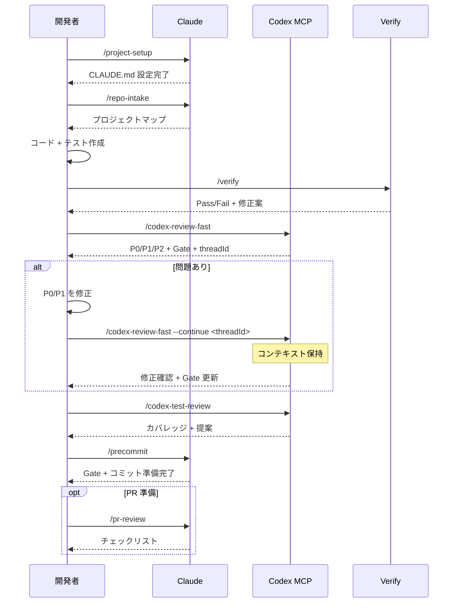

# sd0x-dev-flow

**言語**: [English](README.md) | [繁體中文](README.zh-TW.md) | [简体中文](README.zh-CN.md) | 日本語 | [한국어](README.ko.md) | [Español](README.es.md)

[Claude Code](https://claude.com/claude-code) 向け開発ワークフロープラグイン。Codex MCP 連携はオプションです。

90以上のツールでコードレビュー、テスト、調査、セキュリティ監査、DevOps 自動化をカバー。

## 必要環境

- Claude Code 2.1+
- [Codex MCP](https://github.com/openai/codex) 設定済み（`/codex-*` コマンド用）

## インストール

```bash
# marketplace を追加
/plugin marketplace add sd0xdev/sd0x-dev-flow

# プラグインをインストール
/plugin install sd0x-dev-flow@sd0xdev-marketplace
```

## クイックスタート

インストール後、`/project-setup` を実行してプロジェクト環境を自動検出し、プレースホルダーを設定します：

```bash
/project-setup
```

フレームワーク、パッケージマネージャー、データベース、エントリポイント、スクリプトコマンドを検出し、`CLAUDE.md` を更新します。

## 同梱内容

| カテゴリ | 数 | 例 |
|----------|-----|-----|
| コマンド | 36 | `/project-setup`, `/codex-review-fast`, `/verify`, `/bug-fix` |
| スキル | 23 | project-setup, code-explore, code-investigate, codex-brainstorm |
| エージェント | 14 | strict-reviewer, verify-app, coverage-analyst |
| フック | 5 | auto-format, review state tracking, stop guard |
| ルール | 9 | auto-loop, security, testing, git-workflow |
| スクリプト | 3 | precommit runner, verify runner, dep audit |

## ワークフロー



## コマンドリファレンス

### 開発

| コマンド | 説明 |
|----------|------|
| `/project-setup` | プロジェクトの自動検出・設定 |
| `/repo-intake` | プロジェクト初回スキャン（1回のみ） |
| `/bug-fix` | バグ/Issue 修正ワークフロー |
| `/codex-implement` | Codex がコードを書く |
| `/codex-architect` | アーキテクチャ相談（第三の頭脳） |
| `/code-explore` | コードベースの高速探索 |
| `/git-investigate` | コード変更履歴の追跡 |
| `/issue-analyze` | Issue の深堀り分析 |
| `/post-dev-test` | 開発後のテスト補完 |

### レビュー（Codex MCP）

| コマンド | 説明 | ループ対応 |
|----------|------|------------|
| `/codex-review-fast` | クイックレビュー（diff のみ） | `--continue <threadId>` |
| `/codex-review` | フルレビュー（lint + build） | `--continue <threadId>` |
| `/codex-review-branch` | ブランチ全体のレビュー | - |
| `/codex-cli-review` | CLI レビュー（ディスク全読み取り） | - |
| `/codex-review-doc` | ドキュメントレビュー | `--continue <threadId>` |
| `/codex-security` | OWASP Top 10 監査 | `--continue <threadId>` |
| `/codex-test-gen` | ユニットテスト生成 | - |
| `/codex-test-review` | テストカバレッジレビュー | `--continue <threadId>` |
| `/codex-explain` | 複雑なコードの解説 | - |

### 検証

| コマンド | 説明 |
|----------|------|
| `/verify` | lint -> typecheck -> unit -> integration -> e2e |
| `/precommit` | lint:fix -> build -> test:unit |
| `/precommit-fast` | lint:fix -> test:unit |
| `/dep-audit` | npm 依存パッケージのセキュリティ監査 |

### プランニング

| コマンド | 説明 |
|----------|------|
| `/codex-brainstorm` | 対立型ブレスト（ナッシュ均衡まで議論） |
| `/feasibility-study` | フィージビリティ分析 |
| `/tech-spec` | 技術仕様書の作成 |
| `/review-spec` | 技術仕様書のレビュー |
| `/deep-analyze` | 深堀り分析 + ロードマップ |
| `/project-brief` | PM/CTO 向けエグゼクティブサマリー |

### ドキュメント・ツール

| コマンド | 説明 |
|----------|------|
| `/update-docs` | ドキュメントとコードの同期 |
| `/check-coverage` | テストカバレッジ分析 |
| `/create-request` | 要件ドキュメントの作成/更新 |
| `/doc-refactor` | ドキュメントの簡素化 |
| `/simplify` | コードの簡素化 |
| `/de-ai-flavor` | AI 生成の痕跡を除去 |
| `/create-skill` | 新しいスキルの作成 |
| `/pr-review` | PR セルフレビュー |
| `/zh-tw` | 繁体字中国語に書き換え |

## ルール

| ルール | 説明 |
|--------|------|
| `auto-loop` | 修正 -> 再レビュー -> 修正 -> ... -> Pass（自動サイクル） |
| `fix-all-issues` | ゼロトレランス：見つけた問題はすべて修正 |
| `framework` | フレームワーク固有の規約（カスタマイズ可） |
| `testing` | Unit/Integration/E2E の分離 |
| `security` | OWASP Top 10 チェックリスト |
| `git-workflow` | ブランチ命名・コミット規約 |
| `docs-writing` | テーブル > 段落、Mermaid > テキスト |
| `docs-numbering` | ドキュメント接頭辞規約（0-feasibility, 2-spec） |
| `logging` | 構造化 JSON、シークレット禁止 |

## フック

| フック | トリガー | 用途 |
|--------|----------|------|
| `post-edit-format` | Edit/Write 後 | 自動 prettier（prettier 導入済みプロジェクトのみ） |
| `post-tool-review-state` | Edit/Bash 後 | レビュー状態の追跡 |
| `pre-edit-guard` | Edit/Write 前 | .env/.git の編集を防止 |
| `stop-guard` | 停止前 | 未完了レビュー時に警告（デフォルト：warn） |
| `stop-check` | 停止前 | タスク完了状況のスマートチェック |

### フック設定

フックはデフォルトで安全です。環境変数で挙動をカスタマイズ：

| 変数 | デフォルト | 説明 |
|------|------------|------|
| `STOP_GUARD_MODE` | `warn` | `strict` にするとレビュー手順不足時に停止をブロック |
| `HOOK_NO_FORMAT` | （未設定） | `1` で自動フォーマットを無効化 |
| `HOOK_BYPASS` | （未設定） | `1` で stop-guard チェックをすべてスキップ |
| `HOOK_DEBUG` | （未設定） | `1` でデバッグ情報を出力 |
| `GUARD_EXTRA_PATTERNS` | （未設定） | 追加で保護するパスの正規表現（例：`src/locales/.*\.json$`） |

**依存関係**：フックには `jq` が必要です。自動フォーマットにはプロジェクトに `prettier` が必要です。未導入の場合は自動的にスキップされます。

## カスタマイズ

`/project-setup` ですべてのプレースホルダーを自動検出・設定するか、`CLAUDE.md` を直接編集：

| プレースホルダー | 説明 | 例 |
|------------------|------|----|
| `{PROJECT_NAME}` | プロジェクト名 | my-app |
| `{FRAMEWORK}` | フレームワーク | MidwayJS 3.x, NestJS, Express |
| `{CONFIG_FILE}` | メイン設定ファイル | src/configuration.ts |
| `{BOOTSTRAP_FILE}` | ブートストラップエントリ | bootstrap.js, main.ts |
| `{DATABASE}` | データベース | MongoDB, PostgreSQL |
| `{TEST_COMMAND}` | テストコマンド | yarn test:unit |
| `{LINT_FIX_COMMAND}` | Lint 自動修正 | yarn lint:fix |
| `{BUILD_COMMAND}` | ビルドコマンド | yarn build |
| `{TYPECHECK_COMMAND}` | 型チェック | yarn typecheck |

## アーキテクチャ

```
コマンド（入口）-> スキル（機能）-> エージェント（実行環境）
```

- **コマンド**：ユーザーが `/...` で起動
- **スキル**：オンデマンドで読み込まれるナレッジベース
- **エージェント**：専用ツールを持つ隔離されたサブエージェント
- **フック**：自動ガードレール（フォーマット、レビュー状態、ストップガード）
- **ルール**：常時有効な規約（自動読み込み）

## コントリビュート

PR 歓迎です。お願い事項：

1. 既存の命名規約に従う（kebab-case）
2. スキルに `When to Use` / `When NOT to Use` を含める
3. 危険な操作には `disable-model-invocation: true` を付与
4. 提出前に Claude Code でテスト

## ライセンス

MIT
