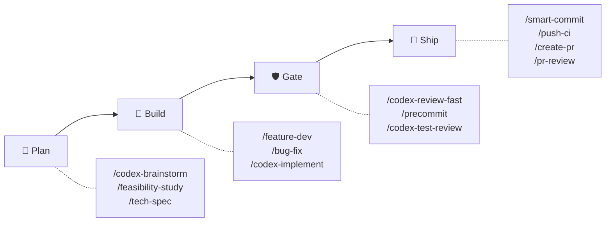
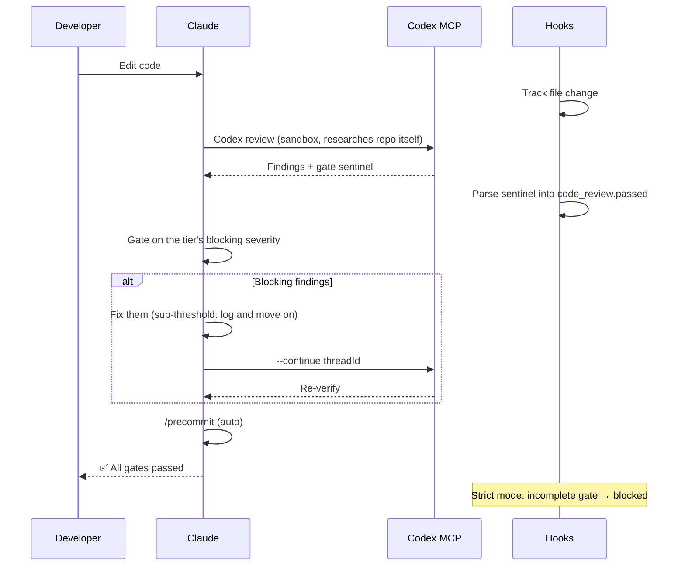

# sd0x-dev-flow


**言語**: [English](README.md) | [繁體中文](README.zh-TW.md) | [简体中文](README.zh-CN.md) | 日本語 | [한국어](README.ko.md) | [Español](README.es.md)

> Claude Code のための harness レイヤー。

**AI がスキップできない品質ゲート。** [Claude Code](https://claude.com/claude-code) のための AI Agent Harness Engineering の reference implementation — Hook 強制のレビューゲート、context compaction を乗り越える state machine ゲート、そして本当に必要な箇所での fail-closed な安全性。

<!-- BEGIN:HERO-COUNT -->
96 bundled · 96 public skills · 15 agents — Claude の context window のわずか ~4%
<!-- END:HERO-COUNT -->

[](LICENSE) [](https://www.npmjs.com/package/skills)

## この harness は何をするのか

> [Harness engineering](https://martinfowler.com/articles/exploring-gen-ai/harness-engineering.html) とは、モデル自体を学習させるのではなく、LLM の周辺にあるすべて（tool loop、context management、hooks、state machine、safety layer）を工学的に構築する分野です。Mitchell Hashimoto が 2026 年 2 月にこの用語を提唱し、[Anthropic engineering](https://www.anthropic.com/engineering/effective-harnesses-for-long-running-agents) と [Martin Fowler](https://martinfowler.com/articles/exploring-gen-ai/harness-engineering.html) が論考を発表、[arXiv 2603.05344](https://arxiv.org/html/2603.05344v1) が形式化しています。

sd0x-dev-flow は reference implementation です。以下の各行は、harness の典型的なサブ問題を実際に読める具体的なコードに対応づけています:

| # | Harness のサブ問題 | sd0x-dev-flow の実装 | コード証拠 |
|---|---------------------|------------------------------|---------------|
| 1 | **Tool loop control** | `/codex-review-fast` → `/precommit` の auto-loop、sentinel 駆動で状態遷移 | [`rules/auto-loop.md`](rules/auto-loop.md) + [`hooks/post-tool-review-state.sh`](hooks/post-tool-review-state.sh) |
| 2 | **Sentinel-driven state machine** | `✅ Ready` / `⛔ Blocked` / `✅ All Pass` のゲートマーカーを永続状態へパース | [`scripts/emit-review-gate.sh`](scripts/emit-review-gate.sh) (producer) + [`hooks/post-tool-review-state.sh`](hooks/post-tool-review-state.sh) (parser) |
| 3 | **Context recovery across compaction** | SessionStart(compact) 後に `[AUTO_LOOP_RESUME]` を stdout へ注入 | [`hooks/post-compact-auto-loop.sh`](hooks/post-compact-auto-loop.sh) |
| 4 | **Lifecycle interceptors** | 5 種類の hook event を 8 本のスクリプトへディスパッチ: PreToolUse / PostToolUse / Stop / SessionStart / UserPromptSubmit | [`hooks/`](hooks/) (8 scripts) + [`.claude/settings.json`](.claude/settings.json) |
| 5 | **Capability-based tool gating** | Skill frontmatter の `allowed-tools` — 例: `/ask` には Edit/Write が無い | 95 個の公開 skill のうち 86 個が `allowed-tools` を宣言 |
| 6 | **Defense-in-depth safety** | 5 層構成: pre-edit-guard → commit-msg-guard → pre-push-gate → stop-guard → sidecar fail-closed marker | [`scripts/pre-push-gate.sh`](scripts/pre-push-gate.sh) + [`scripts/commit-msg-guard.sh`](scripts/commit-msg-guard.sh) + [`hooks/stop-guard.sh`](hooks/stop-guard.sh) |
| 7 | **Generator-evaluator split** | Codex が Claude の書いたコードをレビュー。リポジトリを自力で調査し、結論を渡されて追認することはない | [`rules/codex-invocation.md`](rules/codex-invocation.md) + [`rules/auto-loop.md`](rules/auto-loop.md) (Review Dispatch) |
| 8 | **Incremental progress tracking** | `iteration_history.current_round` + `max_rounds` + 収束プラトー検出 | [`rules/auto-loop.md`](rules/auto-loop.md) (exit conditions + strategic reset) |
| 9 | **Human-in-the-loop safety gates** | 破壊的操作に対する `/dev/tty` 確認 + `AskUserQuestion` | [`scripts/pre-push-gate.sh`](scripts/pre-push-gate.sh) + [`skills/push-ci/SKILL.md`](skills/push-ci/SKILL.md) |
| 10 | **Self-improvement loop** | 是正 → lesson として記録 → 3 回以上の再発で rule に昇格 | [`rules/self-improvement.md`](rules/self-improvement.md) |

多くの harness プロジェクトはこれらのうち 2〜4 個しかカバーしません。sd0x-dev-flow は 10 個すべてをカバーしており、単なるツールではなく学習対象として読めるコードになっています。

## なぜ sd0x-dev-flow？

| ガードレールなし | sd0x-dev-flow あり |
|---|---|
| コンテキストが長いと AI がレビューをスキップ | **Hook 強制**: stop-guard が未完了レビューをブロック |
| 自己レビューは追認にしかならない | **独立レビューアー**: Codex がリポジトリを自力で調査。深く見たいときだけ `--dual` をオプトイン |
| 「修正済み」なのに再検証なし | **Auto-loop**: 修正 → 再レビュー → パス → 続行 |
| compact 後にレビュー状態が消失 | **状態追跡**: SessionStart hook が再注入 |

## クイックスタート

```bash
# プラグインをインストール
/plugin marketplace add sd0xdev/sd0x-dev-flow
/plugin install sd0x-dev-flow@sd0xdev-marketplace

# プロジェクトを設定
/project-setup
```

1つのコマンドでフレームワーク、パッケージマネージャー、データベース、エントリポイント、スクリプトを自動検出します。ルールとフックのサブセットをインストールします。完全なプラグインには14ルール + 8フックが含まれます。

`--lite` で CLAUDE.md のみ設定（ルール/フックをスキップ）。

## 仕組み


```mermaid
flowchart LR
    P["🎯 Plan"] --> B["🔨 Build"]
    B --> G["🛡️ Gate"]
    G --> S["🚀 Ship"]

    P -.- P1["/codex-brainstorm<br/>/feasibility-study<br/>/tech-spec"]
    B -.- B1["/feature-dev<br/>/bug-fix<br/>/codex-implement"]
    G -.- G1["/codex-review-fast<br/>/precommit<br/>/codex-test-review"]
    S -.- S1["/smart-commit<br/>/push-ci<br/>/create-pr<br/>/pr-review"]
```

**Auto-Loop エンジン**が品質ゲートを自動的に実行します。コード編集後、レビューコマンドが同じ応答内で **Codex** をディスパッチします。何が blocking かは tier が決めます（`fast` P0 · `standard` P0/P1 · `thorough` P0/P1/P2）。その閾値を下回る Findings は記録するだけで、ループは次に進み、追加のラウンドは開きません。strict モードでは、Hooks が fail-closed を強制：ゲートが未完了なら stop-guard がブロックします。2 人目のレビューアーは `/codex-review-branch --dual` から利用でき、デフォルトでは無効です。詳細は [docs/hooks.md](docs/hooks.md) を参照。

<details>
<summary>詳細：レビューループ シーケンス図</summary>


```mermaid
sequenceDiagram
    participant D as Developer
    participant C as Claude
    participant X as Codex MCP
    participant H as Hooks

    D->>C: Edit code
    H->>H: Track file change
    C->>X: Codex review (sandbox, researches repo itself)
    X-->>C: Findings + gate sentinel
    H->>H: Parse sentinel into code_review.passed
    C->>C: Gate on the tier's blocking severity

    alt Blocking findings
        C->>C: Fix them (sub-threshold: log and move on)
        C->>X: --continue threadId
        X-->>C: Re-verify
    end

    C->>C: /precommit (auto)
    C-->>D: ✅ All gates passed

    Note over H: Strict mode: incomplete gate → blocked
```

</details>

## 機能スポットライト：ティア別レビュー

レビューアーはデフォルトで Codex 1 人だけです。**tier** が、その変更にどれだけの厳格さを与えるか、そして findings がどれだけ重ければループを再開するかを決めます：

| Tier | 対象 | Blocking | ラウンド上限 |
|------|------|----------|-------------|
| `fast` | ドキュメント、設定、低リスクな小変更 | P0 | 3 |
| `standard` **（デフォルト）** | 通常の機能開発とバグ修正 | P0、P1 | 5 |
| `thorough` | セキュリティ、データ整合性、リリース、公開 API | P0、P1、P2 | 10 |

**80 点で合格です。** tier の blocking 閾値を下回る findings は記録され（`[NIT_DEFERRED]`。TTL 付きで永続化されるため、次のセッションで蒸し返されません）、ループはそのまま `/precommit` へ進みます — 追加の修正パスも、追加のレビューラウンドもありません。これらは次に `/codex-review-branch` で深くレビューする際に拾われます。

2 人目のレビューアーは `/codex-review-branch --dual` から利用でき、**フラグを渡さない限り無効**です — 1 ラウンドあたりのトークンと実時間のコストが倍になるため、リリースやセキュリティレビューには見合っても、通常の修正には見合いません。`--dual` 使用時、findings は重要度正規化、重複排除（ファイル + issue キー、±5 行許容）、ソース帰属が行われます。

ゲート：`✅ Ready` または `⛔ Blocked` — strict モードでは、未完了ゲート = ブロック。

## 比較表

| 機能 | sd0x-dev-flow | gstack | 汎用プロンプト |
|---|---|---|---|
| 強制レビューゲート | Hook + 動作レイヤー | 提案のみ | なし |
| 独立レビューアー | Codex が自力で調査。`--dual` はオプトイン | 単一 /review | なし |
| 自動修正ループ | 修正 → 再レビュー → パス | 手動 | なし |
| マルチエージェントリサーチ | /deep-research（3 エージェント） | なし | なし |
| 敵対的検証 | ナッシュ均衡ディベート | なし | なし |
| 自己改善 | 教訓ログ + ルール昇格 | /retro 統計のみ | なし |
| クロスツールサポート | Codex/Cursor/Windsurf | Claude/Codex/Gemini/Cursor | N/A |

## 使用に適したケース

| 適している | 不向き |
|-----------|--------|
| Claude Code を使う個人・小規模チームのプロジェクト | Claude Code を全く使わないチーム |
| 自動レビューゲートが必要なプロジェクト | CI のないワンオフスクリプト |
| Codex CLI / Cursor / Windsurf ユーザー（skills サブセット） | カスタム LLM プロバイダーが必要なプロジェクト |
| 品質ゲートでリグレッションを防ぐリポジトリ | テストインフラがないリポジトリ |

## インストール

### Codex CLI / その他の AI エージェント

```bash
# Agent Skills 標準で個別スキルをインストール
npx skills add sd0xdev/sd0x-dev-flow

# AGENTS.md を生成 + フックをインストール（Claude Code 内で実行）
/codex-setup init
```

<!-- BEGIN:INSTALL-COVERAGE -->
| 方法 | 対応ツール | カバー範囲 |
|------|-----------|-----------|
| プラグインインストール | Claude Code | フル（96 bundled skills、フック、ルール、auto-loop） |
| `npx skills add` | Codex CLI、Cursor、Windsurf、Aider | スキルのみ（96 public skills） |
| `/codex-setup init` | Codex CLI | AGENTS.md カーネル + git フック |
<!-- END:INSTALL-COVERAGE -->

**必要環境**: Claude Code 2.1+ | [Codex MCP](https://github.com/openai/codex)（プラグインのインストール自体は不要ですが、`/codex-*` のレビューゲートには必須です — Codex がその唯一のレビューアーなので、未インストール時はフォールバックせず `⛔ Blocked` + `⚠️ Need Human` を出します）

## ワークフロートラック

| ワークフロー | コマンド | ゲート | 実行レイヤー |
|-------------|----------|------|-------------|
| 機能開発 | `/feature-dev` → `/verify` → `/codex-review-fast` → `/precommit` | ✅/⛔ | Hook + 動作レイヤー |
| バグ修正 | `/issue-analyze` → `/bug-fix` → `/verify` → `/precommit` | ✅/⛔ | Hook + 動作レイヤー |
| Auto-Loop | コード編集 → `/codex-review-fast` → `/precommit` | ✅/⛔ | Hook |
| ドキュメントレビュー | `.md` 編集 → `/codex-review-doc` | ✅/⛔ | Hook |
| プランニング | `/codex-brainstorm` → `/feasibility-study` → `/tech-spec` | — | — |
| オンボーディング | `/project-setup` → `/repo-intake` | — | — |

<details>
<summary>ビジュアル：ワークフロー フローチャート</summary>


```mermaid
flowchart TD
    subgraph feat ["🔨 Feature Development"]
        F1["/feature-dev"] --> F2["Code + Tests"]
        F2 --> F3["/verify"]
        F3 --> F4["/codex-review-fast"]
        F4 --> F5["/precommit"]
        F5 --> F6["/update-docs"]
    end

    subgraph fix ["🐛 Bug Fix"]
        B1["/issue-analyze"] --> B2["/bug-fix"]
        B2 --> B3["Fix + Regression test"]
        B3 --> B4["/verify"]
        B4 --> B5["/codex-review-fast"]
        B5 --> B6["/precommit"]
    end

    subgraph docs ["📝 Docs Only"]
        D1["Edit .md"] --> D2["/codex-review-doc"]
        D2 --> D3["Done"]
    end

    subgraph plan ["🎯 Planning"]
        P1["/codex-brainstorm"] --> P2["/feasibility-study"]
        P2 --> P3["/tech-spec"]
        P3 --> P4["/codex-architect"]
        P4 --> P5["Implementation ready"]
    end

    subgraph ops ["⚙️ Operations"]
        O1["/project-setup"] --> O2["/repo-intake"]
        O2 --> O3["Develop"]
        O3 --> O4["/project-audit"]
        O3 --> O7["/best-practices"]
        O3 --> O5["/risk-assess"]
        O4 --> O6["/next-step --go"]
        O5 --> O6
        O7 --> O6
    end
```

</details>

## クックブック

どのスキルをどの順番で組み合わせるかを示す、実践的なシナリオ集です。

| シナリオ | フロー | ドキュメント |
|----------|--------|------------|
| リポジトリ初日 | `/project-setup` → `/repo-intake` → `/next-step` | [→](docs/cookbook/first-day.md) |
| 新機能の実装 | `/feature-dev` → `/verify` → `/codex-test-review` → `/codex-review-fast` → `/precommit` | [→](docs/cookbook/new-feature.md) |
| PR レビューコメントの対応 | `/load-pr-review` → 修正 → `/codex-review-fast` → `/push-ci` | [→](docs/cookbook/pr-review-comments.md) |
| マージ前のセキュリティチェック | `/codex-security` → `/dep-audit` → `/risk-assess` → `/pre-pr-audit` | [→](docs/cookbook/security-pre-merge.md) |
| **注目コンボ：** 方向性の検証 | `/deep-research` → `/best-practices` → `/feasibility-study` → `/codex-brainstorm` | [→](docs/cookbook/validate-direction.md) |
| **注目コンボ：** 敵対的設計 | `/codex-brainstorm`（ナッシュ均衡ディベート）→ `/codex-architect` | [→](docs/cookbook/adversarial-design.md) |

[全 10 シナリオを見る →](docs/cookbook/)

## 同梱内容

<!-- BEGIN:WHATS-INCLUDED-COUNT -->
| カテゴリ | 数 | 例 |
|----------|-----|-----|
| スキル | 96 public (96 bundled) | `/project-setup`, `/codex-review-fast`, `/verify`, `/smart-commit`, `/deep-research` |
| エージェント | 15 | strict-reviewer, verify-app, coverage-analyst, architecture-designer |
| フック | 8 | pre-edit-guard, auto-format, review state tracking, stop guard, post-compact-auto-loop, post-skill-auto-loop, user-prompt-review-guard, session-init |
| ルール | 14 | auto-loop, auto-loop-project, codex-invocation, security, testing, git-workflow, self-improvement, context-management |
| スクリプト | 17 | precommit runner, verify runner, dep audit, namespace hint, skill runner, commit-msg guard, pre-push gate, emit-review-gate, emit-plan-gate, build-codex-artifacts, resolve-feature (CLI + shell), classify-docs, detect-scope, migration-audit, security-redact, readme-catalog |
<!-- END:WHATS-INCLUDED-COUNT -->

### 極小の Context 使用量

Claude の 200k context window のわずか ~4% — 96% はコードに使えます。

| コンポーネント | トークン数 | 200k に対する割合 |
|---------------|-----------|-----------------|
| ルール（常時読み込み） | 5.1k | 2.6% |
| スキル（オンデマンド） | 1.9k | 1.0% |
| エージェント | 791 | 0.4% |
| **合計** | **~8k** | **~4%** |

スキルはオンデマンドで読み込まれます。未使用のスキルはトークンを消費しません。

## スキルリファレンス

<!-- BEGIN:ESSENTIAL-SKILLS -->
| Skill | 使用場面 |
|-------|----------|
| `/project-setup` | プロジェクトの初回設定 |
| `/bug-fix` | バグ修正・Issue 解決 |
| `/feature-dev` | 機能のエンドツーエンド実装 |
| `/smart-commit` | スマートグループ化でコミット |
| `/push-ci` | プッシュ + CI モニタリング |
| `/create-pr` | GitHub PR を作成 |
| `/codex-review-fast` | クイックコードレビュー（diff のみ） |
| `/codex-review-doc` | ドキュメント変更のレビュー |
| `/codex-security` | OWASP Top 10 セキュリティ監査 |
| `/verify` | フル検証チェーンの実行 |
| `/precommit` | precommit 品質ゲート（lint + build + test） |
| `/precommit-fast` | 高速 precommit（lint + test、build なし） |
| `/codex-brainstorm` | 対立型ブレスト（ナッシュ均衡） |
| `/tech-spec` | 技術仕様書の作成 |
| `/pr-review` | マージ前の PR セルフレビュー |
<!-- END:ESSENTIAL-SKILLS -->

<!-- BEGIN:FULL-CATALOG -->
<details>
<summary>全 96 public skills</summary>

### 開発 (33)

| Skill | Description |
|-------|-------------|
| `/ask` | コンテキスト認識型 Q&A。自動的にコンテキスト情報を収集します。 |
| `/bug-fix` | Bug fix workflow. |
| `/bump-version` | Bump package and plugin version in sync. |
| `/code-explore` | Pure Claude code investigation. |
| `/code-investigate` | Dual-perspective code investigation. |
| `/codex-architect` | Codex architecture consulting. |
| `/codex-implement` | Implement features via Codex MCP. |
| `/codex-setup` | Initialize sd0x-dev-flow infrastructure for Codex CLI and other non-Claude agents. |
| `/create-pr` | Create or update GitHub PR with gh CLI. |
| `/debug` | Interactive debugging workflow with hypothesis-driven probe loop. |
| `/deep-explore` | Multi-wave parallel code exploration orchestrator. |
| `/epic-merge` | スタックされた PR チェーンをエピックブランチへ順次スカッシュマージします。 |
| `/feature-dev` | Feature development workflow. |
| `/feature-verify` | Feature verification (READ-ONLY, P0-P5). |
| `/git-investigate` | Git history investigation. |
| `/git-profile` | Git identity and GPG signing profile manager. |
| `/install-hooks` | Install plugin hooks into project .claude/ for persistent use without plugin loaded |
| `/install-rules` | Install plugin rules into project .claude/rules/ for persistent use without plugin loaded |
| `/install-scripts` | Install plugin runner scripts into project .claude/scripts/ for persistent use without plugin loaded |
| `/issue-analyze` | GitHub Issue and PR review thread deep analysis with Codex blind verdict. |
| `/jira` | Jira integration — view issues, generate branches, create tickets, transition status. |
| `/load-pr-review` | Load GitHub PR review comments into AI session — analyze, triage, plan. |
| `/merge-prep` | Pre-merge analysis and preparation. |
| `/next-step` | Change-aware next step advisor. |
| `/post-dev-test` | Post-development test completion. |
| `/pr-comment` | Post friendly review comments to a GitHub PR — prepare locally, preview, then submit as atomic review. |
| `/project-setup` | Project configuration initialization. |
| `/push-ci` | Push to remote and monitor CI. |
| `/remind` | Lightweight model correction with context-aware rule loading. |
| `/repo-intake` | Project initialization inventory (one-time). |
| `/smart-commit` | Smart batch commit. |
| `/smart-rebase` | Smart partial rebase for squash-merge repositories. |
| `/watch-ci` | Monitor GitHub Actions CI runs until completion. |

### レビュー (Codex MCP) (14)

| Skill | Description | ループサポート |
|-------|-------------|--------------|
| `/codex-cli-review` | Code review via Codex CLI with full disk access. | - |
| `/codex-code-review` | Code review using Codex MCP. | - |
| `/codex-explain` | Explain complex code via Codex MCP. | - |
| `/codex-review` | Full second-opinion using Codex MCP (with lint:fix + build). | `--continue <threadId>` |
| `/codex-review-branch` | Fully automated review of an entire feature branch using Codex MCP | - |
| `/codex-review-doc` | Review documents using Codex MCP. | `--continue <threadId>` |
| `/codex-review-fast` | Quick second-opinion using Codex MCP (diff only, no tests). | `--continue <threadId>` |
| `/codex-security` | OWASP Top 10 security review using Codex MCP. | `--continue <threadId>` |
| `/codex-test-gen` | Generate unit tests for specified functions using Codex MCP | - |
| `/codex-test-review` | Review test case sufficiency using Codex MCP, suggest additional edge cases. | `--continue <threadId>` |
| `/doc-review` | Document review via Codex MCP. | - |
| `/security-review` | Security review via Codex MCP. | - |
| `/seek-verdict` | Independent second-opinion verification for any finding. | - |
| `/test-review` | Test coverage review via Codex MCP. | - |

### 検証 (13)

| Skill | Description |
|-------|-------------|
| `/best-practices` | Industry best practices conformance audit with mandatory adversarial debate. |
| `/check-coverage` | Comprehensive assessment of Unit / Integration / E2E three-layer test coverage, identify gaps and provide actionable ... |
| `/dep-audit` | Audit dependency security risks |
| `/dev-security-audit` | Comprehensive developer workstation security audit — scans for exposed credentials, compromised application data, per... |
| `/necessity-audit` | Necessity audit for over-designed spec elements. |
| `/pre-pr-audit` | Pre-PR confidence audit with 5-dimension scoring. |
| `/precommit` | Pre-commit checks — lint:fix -> build -> test |
| `/precommit-fast` | Quick pre-commit checks — lint:fix -> test |
| `/project-audit` | Project health audit with deterministic scoring. |
| `/risk-assess` | Uncommitted code risk assessment with breaking change detection, blast radius analysis, and scope metrics. |
| `/test-deep` | Context-aware test orchestration. |
| `/test-health` | Holistic test coverage measurement. |
| `/verify` | Verification loop — lint -> typecheck -> unit -> integration -> e2e |

### 計画 (16)

| Skill | Description |
|-------|-------------|
| `/architecture` | Architecture design and documentation. |
| `/codex-brainstorm` | Adversarial brainstorming via Claude+Codex debate. |
| `/deep-analyze` | Deep-dive analysis of an initial proposal — research code implementation, produce an actionable roadmap and alternatives |
| `/deep-research` | Universal multi-source research orchestration. |
| `/feasibility-study` | Feasibility analysis from first principles. |
| `/fp-brief` | First-principles briefing from technical documents. |
| `/post-dev-recap` | Guided post-dev recap wrapper — scope detection + doc generation + Q&A. |
| `/project-brief` | Convert a technical spec into a PM/CTO-readable executive summary. |
| `/recap-ask` | Recap-bounded Q&A follow-up over an existing briefing-recap. |
| `/recap-doc` | Post-development recap document generator with blind-spot detection. |
| `/req-analyze` | Requirements analysis — problem decomposition, stakeholder scan, requirement structuring. |
| `/request-tracking` | Request tracking knowledge base. |
| `/review-spec` | Review technical spec documents from completeness, feasibility, risk, and code consistency perspectives. |
| `/tech-brief` | Technical briefing for developer sharing. |
| `/tech-spec` | Tech spec generation and review. |
| `/ui-first-principles` | First-principles UI/IA reasoning: turns a `<scenario>` + API field set into JTBD analysis, principle-anchored field-p... |

### ドキュメント＆ツール (20)

| Skill | Description |
|-------|-------------|
| `/claude-health` | Claude Code config health check + plugin sync. |
| `/contract-decode` | EVM contract error and calldata decoder. |
| `/create-request` | Create, update, or scan per-task request tickets for progress tracking. |
| `/de-ai-flavor` | Remove AI artifacts from documents. |
| `/doc-refactor` | Refactor documents — simplify without losing information, visualize flows with sequenceDiagram. |
| `/generate-runner` | Generate a customized precommit runner for any ecosystem. |
| `/obsidian-cli` | Obsidian vault integration via official CLI. |
| `/op-session` | Initialize 1Password CLI session for Claude Code. |
| `/portfolio` | Portfolio system knowledge base. |
| `/pr-review` | PR self-review — review changes, produce checklist, update rules |
| `/pr-summary` | List open PRs, filter automation PRs, group by ticket ID, format as Markdown. |
| `/refactor` | Multi-target refactoring orchestrator. |
| `/runbook` | Generate/update feature release runbook |
| `/safe-remove` | Safely remove plugin assets (skill/agent/rule/script/hook) with dependency detection and reference cleanup. |
| `/sharingan` | Replicate knowledge from any source as sd0x-dev-flow skill definition. |
| `/simplify` | Wrap-up refactoring — simplify code, eliminate duplication, preserve behavior |
| `/skill-health-check` | Validate skill quality against routing, progressive loading, and verification criteria. |
| `/statusline-config` | Customize Claude Code statusline. |
| `/update-docs` | Research current code state then update corresponding docs, ensuring docs stay in sync with code. |
| `/zh-tw` | Rewrite the previous reply in Traditional Chinese |

</details>
<!-- END:FULL-CATALOG -->

## ルール & フック

14 ルール（常時読み込みの規約）+ 8 フック（自動ガードレール）。

> **カスタマイズ**：`auto-loop-project.md` を編集してプロジェクトの auto-loop 動作をオーバーライドできます。プラグイン更新と競合しません — [Rule Override Pattern](docs/features/rule-override-pattern/2-tech-spec.md) 参照。

ルール、フック、環境変数の完全なリファレンスは [docs/rules.md](docs/rules.md) と [docs/hooks.md](docs/hooks.md) をご覧ください。

## カスタマイズ

`/project-setup` ですべてのプレースホルダーを自動検出・設定するか、`.claude/CLAUDE.md` を直接編集してください：

| プレースホルダー | 説明 | 例 |
|------------------|------|----|
| `{PROJECT_NAME}` | プロジェクト名 | my-app |
| `{FRAMEWORK}` | フレームワーク | MidwayJS 3.x, NestJS, Express |
| `{CONFIG_FILE}` | メイン設定ファイル | src/configuration.ts |
| `{BOOTSTRAP_FILE}` | ブートストラップエントリ | bootstrap.js, main.ts |
| `{DATABASE}` | データベース | MongoDB, PostgreSQL |
| `{TEST_COMMAND}` | テストコマンド | yarn test:unit |
| `{LINT_FIX_COMMAND}` | Lint 自動修正 | yarn lint:fix |
| `{BUILD_COMMAND}` | ビルドコマンド | yarn build |
| `{TYPECHECK_COMMAND}` | 型チェック | yarn typecheck |

## ショーケース：マルチエージェントリサーチ

`/deep-research` を実行すると、2-3 の並列リサーチエージェントが Web ソース、コードベース、コミュニティ知識を横断して調査します — claim registry による統合と条件付き敵対的ディベートを備えています。

| 特徴 | 内容 |
|------|------|
| エージェント | 2-3 並列（web + code + community） |
| 統合 | Claim registry による合意検出 |
| 検証 | 条件付き /codex-brainstorm ディベート |
| スコアリング | 4 シグナル完全性モデル |

[詳細ドキュメント](docs/features/deep-research/)

## アーキテクチャ

```
Command (entry) → Skill (capability) → Agent (environment)
```

- **コマンド**：ユーザーが `/...` で起動
- **スキル**：オンデマンドで読み込まれるナレッジベース
- **エージェント**：専用ツールを持つ隔離されたサブエージェント
- **フック**：自動ガードレール（フォーマット、レビュー状態、ストップガード）
- **ルール**：常時有効な規約（自動読み込み）

高度なアーキテクチャの詳細（agentic control stack、制御ループ理論、サンドボックスルール）については [docs/architecture.md](docs/architecture.md) を参照してください。

## コントリビュート

PR を歓迎します。お願い事項：

1. 既存の命名規約に従う（kebab-case）
2. スキルに `When to Use` / `When NOT to Use` を含める
3. 危険な操作には `disable-model-invocation: true` を付与
4. 提出前に Claude Code でテスト

## ライセンス

MIT

## Star History

<a href="https://www.star-history.com/?repos=sd0xdev%2Fsd0x-dev-flow&type=date&legend=top-left">
 <picture>
   <source media="(prefers-color-scheme: dark)" srcset="https://api.star-history.com/image?repos=sd0xdev/sd0x-dev-flow&type=date&theme=dark&legend=top-left" />
   <source media="(prefers-color-scheme: light)" srcset="https://api.star-history.com/image?repos=sd0xdev/sd0x-dev-flow&type=date&legend=top-left" />
   
 </picture>
</a>
