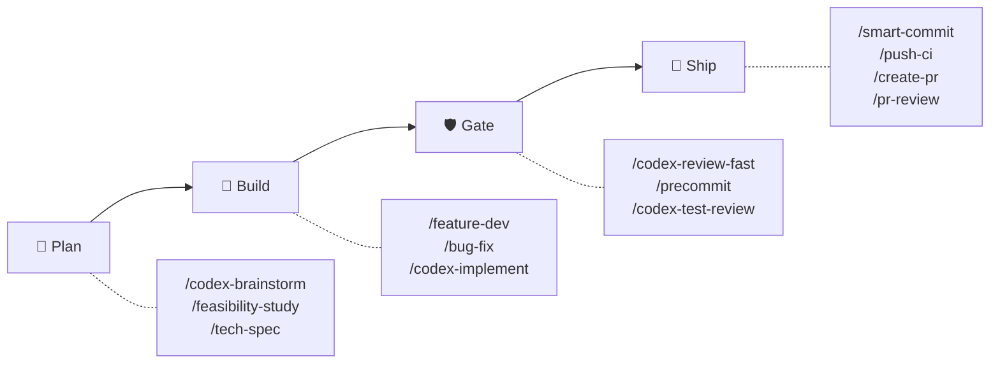
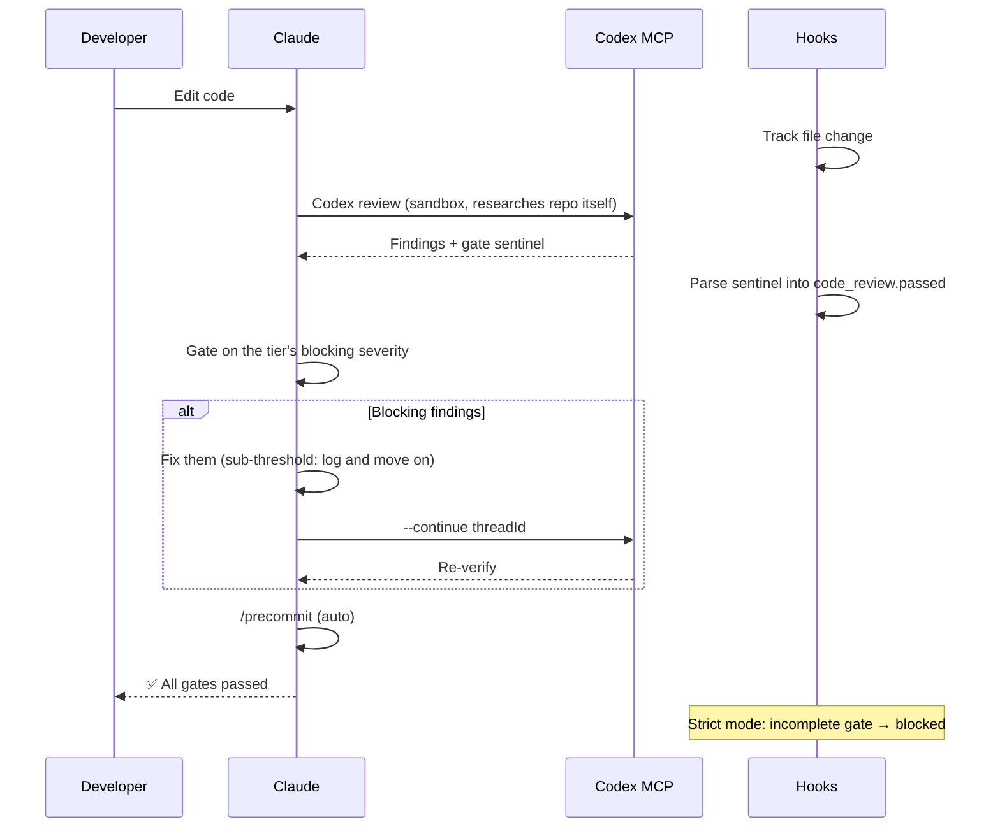

# sd0x-dev-flow


**언어**: [English](README.md) | [繁體中文](README.zh-TW.md) | [简体中文](README.zh-CN.md) | [日本語](README.ja.md) | 한국어 | [Español](README.es.md)

> Claude Code를 위한 harness 레이어.

**AI가 건너뛸 수 없는 품질 게이트.** [Claude Code](https://claude.com/claude-code)를 위한 AI Agent Harness Engineering의 reference implementation — hook 강제 리뷰 게이트, context 압축 이후에도 유지되는 state machine 게이트, 그리고 정말 중요한 지점의 fail-closed 안전장치.

<!-- BEGIN:HERO-COUNT -->
96 bundled · 96 public skills · 15 agents — Claude context window의 ~4%만 사용
<!-- END:HERO-COUNT -->

[](LICENSE) [](https://www.npmjs.com/package/skills)

## 이 harness가 하는 일

> [Harness engineering](https://martinfowler.com/articles/exploring-gen-ai/harness-engineering.html)은 LLM 모델 자체를 학습시키는 것이 아니라, LLM 주변의 모든 것 — tool loop, context 관리, hook, 상태 머신, 안전 레이어 — 을 엔지니어링하는 분야입니다. Mitchell Hashimoto가 2026년 2월에 이 용어를 만들었고, [Anthropic engineering](https://www.anthropic.com/engineering/effective-harnesses-for-long-running-agents)과 [Martin Fowler](https://martinfowler.com/articles/exploring-gen-ai/harness-engineering.html)가 이를 주제로 글을 발표했으며, [arXiv 2603.05344](https://arxiv.org/html/2603.05344v1)가 이를 형식화합니다.

sd0x-dev-flow는 그 reference implementation입니다. 아래 각 행은 harness의 표준 하위 문제를 실제로 연구할 수 있는 코드에 매핑합니다:

| # | Harness 하위 문제 | sd0x-dev-flow 구현 | 코드 근거 |
|---|-------------------|---------------------|-----------|
| 1 | **Tool loop 제어** | sentinel 기반 전이를 사용하는 `/codex-review-fast` → `/precommit` auto-loop | [`rules/auto-loop.md`](rules/auto-loop.md) + [`hooks/post-tool-review-state.sh`](hooks/post-tool-review-state.sh) |
| 2 | **Sentinel 기반 state machine** | `✅ Ready` / `⛔ Blocked` / `✅ All Pass` 게이트 마커를 지속 가능한 상태로 파싱 | [`scripts/emit-review-gate.sh`](scripts/emit-review-gate.sh) (producer) + [`hooks/post-tool-review-state.sh`](hooks/post-tool-review-state.sh) (parser) |
| 3 | **Context 압축 후 복구** | SessionStart(compact) 이후 `[AUTO_LOOP_RESUME]` stdout 재주입 | [`hooks/post-compact-auto-loop.sh`](hooks/post-compact-auto-loop.sh) |
| 4 | **Lifecycle interceptor** | 5가지 hook event type을 8개 스크립트로 디스패치: PreToolUse / PostToolUse / Stop / SessionStart / UserPromptSubmit | [`hooks/`](hooks/) (8개 스크립트) + [`.claude/settings.json`](.claude/settings.json) |
| 5 | **Capability 기반 tool gating** | Skill frontmatter의 `allowed-tools` — 예: `/ask`는 Edit/Write 없음 | 공개된 95개 skill 중 86개가 `allowed-tools`를 선언 |
| 6 | **Defense-in-depth 안전장치** | 5개 레이어: pre-edit-guard → commit-msg-guard → pre-push-gate → stop-guard → sidecar fail-closed 마커 | [`scripts/pre-push-gate.sh`](scripts/pre-push-gate.sh) + [`scripts/commit-msg-guard.sh`](scripts/commit-msg-guard.sh) + [`hooks/stop-guard.sh`](hooks/stop-guard.sh) |
| 7 | **Generator-evaluator 분리** | Codex가 Claude의 결과물을 리뷰하며 저장소를 직접 조사 — 결론을 건네받아 승인만 하는 일은 없음 | [`rules/codex-invocation.md`](rules/codex-invocation.md) + [`rules/auto-loop.md`](rules/auto-loop.md) (Review Dispatch) |
| 8 | **점진적 진행 추적** | `iteration_history.current_round` + `max_rounds` + 수렴 plateau 감지 | [`rules/auto-loop.md`](rules/auto-loop.md) (exit conditions + strategic reset) |
| 9 | **Human-in-the-loop 안전 게이트** | 파괴적 작업에 대한 `/dev/tty` 확인 + `AskUserQuestion` | [`scripts/pre-push-gate.sh`](scripts/pre-push-gate.sh) + [`skills/push-ci/SKILL.md`](skills/push-ci/SKILL.md) |
| 10 | **자기 개선 루프** | 지적 → lesson 기록 → 3회 이상 재발 시 rule로 승격 | [`rules/self-improvement.md`](rules/self-improvement.md) |

대부분의 harness 프로젝트는 이 중 2~4개만 다룹니다. sd0x-dev-flow는 10개 모두를 다루므로, 단순한 도구가 아니라 연구 대상으로서의 코드로 활용할 수 있습니다.

## 왜 sd0x-dev-flow인가?

| 가드레일 없을 때 | sd0x-dev-flow 사용 시 |
|---|---|
| 컨텍스트가 길면 AI가 리뷰를 건너뜀 | **Hook 강제**: stop-guard가 미완료 리뷰를 차단 |
| 자체 리뷰는 거수기가 됨 | **독립 리뷰어**: Codex가 저장소를 직접 조사, 깊이가 필요할 때만 `--dual` 옵트인 |
| "수정 완료"인데 재검증 없음 | **Auto-loop**: 수정 → 재리뷰 → 통과 → 계속 |
| compact 후 리뷰 상태 소실 | **상태 추적**: SessionStart hook이 재주입 |

## 빠른 시작

```bash
# 플러그인 설치
/plugin marketplace add sd0xdev/sd0x-dev-flow
/plugin install sd0x-dev-flow@sd0xdev-marketplace

# 프로젝트 설정
/project-setup
```

하나의 명령어로 프레임워크, 패키지 매니저, 데이터베이스, 엔트리포인트, 스크립트를 자동 감지합니다. Rules와 Hooks의 서브셋을 설치합니다. 전체 플러그인에는 14개 Rules + 8개 Hooks가 포함됩니다.

`--lite`로 CLAUDE.md만 설정 (Rules/Hooks 스킵).

## 작동 원리



**Auto-Loop 엔진**이 품질 Gate를 자동으로 적용합니다. 코드 편집 후 리뷰 명령어가 같은 응답 안에서 **Codex**를 디스패치합니다. 무엇이 blocking인지는 tier가 결정합니다(`fast` P0 · `standard` P0/P1 · `thorough` P0/P1/P2). 그 기준 아래의 findings는 기록만 하고 루프는 그대로 진행하며, 라운드를 새로 열지 않습니다. strict 모드에서 Hooks는 fail-closed를 강제합니다: gate가 미완료이면 stop-guard가 차단합니다. 두 번째 리뷰어는 `/codex-review-branch --dual`로 쓸 수 있고 기본값은 비활성입니다. 자세한 내용은 [docs/hooks.md](docs/hooks.md) 참조.

<details>
<summary>상세: 리뷰 루프 시퀀스 다이어그램</summary>



</details>

## 기능 하이라이트: 티어별 리뷰

기본 리뷰어는 Codex 하나뿐입니다. **tier**가 해당 변경에 얼마만큼의 엄격함을 적용할지, 그리고 finding이 얼마나 심각해야 루프를 다시 여는지를 결정합니다:

| Tier | 대상 | Blocking | 라운드 상한 |
|------|------|----------|------------|
| `fast` | 문서, 설정, 위험이 낮은 소규모 편집 | P0 | 3 |
| `standard` **(기본값)** | 일반적인 기능 개발과 버그 수정 | P0, P1 | 5 |
| `thorough` | 보안, 데이터 무결성, 릴리스, 공개 API | P0, P1, P2 | 10 |

**80점이면 합격입니다.** tier의 blocking 기준 아래 findings는 기록되고(`[NIT_DEFERRED]` — TTL과 함께 저장되어 다음 세션에서 다시 제기되지 않습니다) 루프는 곧바로 `/precommit`으로 진행합니다. 추가 수정 패스도, 추가 리뷰 라운드도 없습니다. 이 항목들은 다음에 `/codex-review-branch`로 깊이 리뷰할 때 다시 다뤄집니다.

두 번째 리뷰어는 `/codex-review-branch --dual`로 쓸 수 있고 **플래그를 넘기지 않으면 비활성**입니다 — 라운드당 토큰과 실제 소요 시간이 두 배가 되므로 릴리스나 보안 리뷰에는 값어치를 하지만 일상적인 수정에는 그렇지 않습니다. `--dual`에서는 findings에 심각도 정규화, 중복 제거(파일 + 이슈 키, ±5줄 허용), 소스 귀속이 적용됩니다.

Gate: `✅ Ready` 또는 `⛔ Blocked` — strict 모드에서, 미완료 gate = blocked.

## 비교표

| 기능 | sd0x-dev-flow | gstack | 일반 프롬프트 |
|---|---|---|---|
| 강제 리뷰 게이트 | Hook + 동작 레이어 | 제안만 | 없음 |
| 독립 리뷰어 | Codex가 직접 조사; `--dual` 옵트인 | 단일 /review | 없음 |
| 자동 수정 루프 | 수정 → 재리뷰 → 통과 | 수동 | 없음 |
| 멀티 에이전트 리서치 | /deep-research (3 에이전트) | 없음 | 없음 |
| 적대적 검증 | 내시 균형 디베이트 | 없음 | 없음 |
| 자기 개선 | 교훈 로그 + 규칙 승격 | /retro 통계만 | 없음 |
| 크로스 툴 지원 | Codex/Cursor/Windsurf | Claude/Codex/Gemini/Cursor | N/A |

## 사용 시나리오

| 적합 | 부적합 |
|------|--------|
| Claude Code를 사용하는 개인/소규모 팀 프로젝트 | Claude Code를 전혀 사용하지 않는 팀 |
| 자동화된 리뷰 게이트가 필요한 프로젝트 | CI가 없는 일회성 스크립트 |
| Codex CLI / Cursor / Windsurf 사용자 (skills 서브셋) | 커스텀 LLM 프로바이더가 필요한 프로젝트 |
| 품질 게이트로 리그레션을 방지하는 리포지토리 | 테스트 인프라가 없는 리포지토리 |

## 설치

### Codex CLI / 기타 AI 에이전트

```bash
# Agent Skills 표준으로 개별 스킬 설치
npx skills add sd0xdev/sd0x-dev-flow

# AGENTS.md 생성 + hooks 설치 (Claude Code 내에서 실행)
/codex-setup init
```

<!-- BEGIN:INSTALL-COVERAGE -->
| 방법 | 지원 도구 | 커버리지 |
|------|----------|---------|
| 플러그인 설치 | Claude Code | 전체 (96 bundled skills, hooks, rules, auto-loop) |
| `npx skills add` | Codex CLI, Cursor, Windsurf, Aider | Skills만 (96 public skills) |
| `/codex-setup init` | Codex CLI | AGENTS.md 커널 + git hooks |
<!-- END:INSTALL-COVERAGE -->

**요구 사항**: Claude Code 2.1+ | [Codex MCP](https://github.com/openai/codex)(플러그인 설치 자체에는 선택이지만 `/codex-*` 리뷰 게이트에는 필수 — Codex가 바로 그 유일한 리뷰어이므로, 미설치 시 폴백하지 않고 `⛔ Blocked` + `⚠️ Need Human`을 냅니다)

## 워크플로 트랙

| 워크플로 | 명령어 | Gate | 적용 방식 |
|----------|--------|------|-----------|
| 기능 개발 | `/feature-dev` → `/verify` → `/codex-review-fast` → `/precommit` | ✅/⛔ | Hook + Behavior |
| 버그 수정 | `/issue-analyze` → `/bug-fix` → `/verify` → `/precommit` | ✅/⛔ | Hook + Behavior |
| Auto-Loop | 코드 편집 → `/codex-review-fast` → `/precommit` | ✅/⛔ | Hook |
| 문서 리뷰 | `.md` 편집 → `/codex-review-doc` | ✅/⛔ | Hook |
| 기획 | `/codex-brainstorm` → `/feasibility-study` → `/tech-spec` | — | — |
| 온보딩 | `/project-setup` → `/repo-intake` | — | — |

```mermaid
flowchart TD
    subgraph feat ["🔨 Feature Development"]
        F1["/feature-dev"] --> F2["Code + Tests"]
        F2 --> F3["/verify"]
        F3 --> F4["/codex-review-fast"]
        F4 --> F5["/precommit"]
        F5 --> F6["/update-docs"]
    end

    subgraph fix ["🐛 Bug Fix"]
        B1["/issue-analyze"] --> B2["/bug-fix"]
        B2 --> B3["Fix + Regression test"]
        B3 --> B4["/verify"]
        B4 --> B5["/codex-review-fast"]
        B5 --> B6["/precommit"]
    end

    subgraph docs ["📝 Docs Only"]
        D1["Edit .md"] --> D2["/codex-review-doc"]
        D2 --> D3["Done"]
    end

    subgraph plan ["🎯 Planning"]
        P1["/codex-brainstorm"] --> P2["/feasibility-study"]
        P2 --> P3["/tech-spec"]
        P3 --> P4["/codex-architect"]
        P4 --> P5["Implementation ready"]
    end

    subgraph ops ["⚙️ Operations"]
        O1["/project-setup"] --> O2["/repo-intake"]
        O2 --> O3["Develop"]
        O3 --> O4["/project-audit"]
        O3 --> O7["/best-practices"]
        O3 --> O5["/risk-assess"]
        O4 --> O6["/next-step --go"]
        O5 --> O6
        O7 --> O6
    end
```

<details>
<summary>시각화: 워크플로 플로차트</summary>



</details>

## 쿡북

어떤 스킬을 어떤 순서로 조합하면 좋은지 보여주는 실전 시나리오입니다.

| 시나리오 | 흐름 | 문서 |
|----------|------|------|
| 레포지토리 온보딩 첫날 | `/project-setup` → `/repo-intake` → `/next-step` | [→](docs/cookbook/first-day.md) |
| 새 기능 구현 | `/feature-dev` → `/verify` → `/codex-test-review` → `/codex-review-fast` → `/precommit` | [→](docs/cookbook/new-feature.md) |
| PR 리뷰 코멘트 반영 | `/load-pr-review` → 수정 → `/codex-review-fast` → `/push-ci` | [→](docs/cookbook/pr-review-comments.md) |
| 머지 전 보안 점검 | `/codex-security` → `/dep-audit` → `/risk-assess` → `/pre-pr-audit` | [→](docs/cookbook/security-pre-merge.md) |
| **주요 콤보:** 방향성 검증 | `/deep-research` → `/best-practices` → `/feasibility-study` → `/codex-brainstorm` | [→](docs/cookbook/validate-direction.md) |
| **주요 콤보:** 적대적 설계 | `/codex-brainstorm` (내쉬 균형 토론) → `/codex-architect` | [→](docs/cookbook/adversarial-design.md) |

[전체 10개 시나리오 →](docs/cookbook/)

## 포함 내용

<!-- BEGIN:WHATS-INCLUDED-COUNT -->
| 카테고리 | 수량 | 예시 |
|----------|------|------|
| Skills | 96 public (96 bundled) | `/project-setup`, `/codex-review-fast`, `/verify`, `/smart-commit`, `/deep-research` |
| Agents | 15 | strict-reviewer, verify-app, coverage-analyst, architecture-designer |
| Hooks | 8 | pre-edit-guard, auto-format, review state tracking, stop guard, post-compact-auto-loop, post-skill-auto-loop, user-prompt-review-guard, session-init |
| Rules | 14 | auto-loop, auto-loop-project, codex-invocation, security, testing, git-workflow, self-improvement, context-management |
| Scripts | 17 | precommit runner, verify runner, dep audit, namespace hint, skill runner, commit-msg guard, pre-push gate, emit-review-gate, emit-plan-gate, build-codex-artifacts, resolve-feature (CLI + shell), classify-docs, detect-scope, migration-audit, security-redact, readme-catalog |
<!-- END:WHATS-INCLUDED-COUNT -->

### 최소한의 Context 사용량

Claude의 200k context window 중 ~4%만 사용합니다. 나머지 96%는 코드에 활용할 수 있습니다.

| 구성 요소 | 토큰 수 | 200k 대비 비율 |
|-----------|---------|---------------|
| Rules (상시 로드) | 5.1k | 2.6% |
| Skills (온디맨드) | 1.9k | 1.0% |
| Agents | 791 | 0.4% |
| **합계** | **~8k** | **~4%** |

Skills는 온디맨드로 로드됩니다. 미사용 Skills는 토큰을 소비하지 않습니다.

## 스킬 레퍼런스

<!-- BEGIN:ESSENTIAL-SKILLS -->
| Skill | 사용 시기 |
|-------|----------|
| `/project-setup` | 프로젝트 최초 설정 시 |
| `/bug-fix` | 버그 수정 및 이슈 해결 시 |
| `/feature-dev` | 기능을 처음부터 끝까지 구현할 때 |
| `/smart-commit` | 스마트 그룹핑으로 커밋할 때 |
| `/push-ci` | 코드 푸시 및 CI 모니터링 시 |
| `/create-pr` | GitHub Pull Request 생성 시 |
| `/codex-review-fast` | 빠른 코드 리뷰 (diff만) |
| `/codex-review-doc` | 문서 변경 리뷰 시 |
| `/codex-security` | OWASP Top 10 보안 감사 시 |
| `/verify` | 전체 테스트 검증 체인 실행 시 |
| `/precommit` | Pre-commit 품질 게이트 (lint + build + test) |
| `/precommit-fast` | 빠른 pre-commit (lint + test, 빌드 제외) |
| `/codex-brainstorm` | 대립형 브레인스토밍 (내시 균형) |
| `/tech-spec` | 기술 스펙 작성 시 |
| `/pr-review` | 머지 전 PR 셀프 리뷰 시 |
<!-- END:ESSENTIAL-SKILLS -->

<!-- BEGIN:FULL-CATALOG -->
<details>
<summary>전체 96개 public skills</summary>

### 개발 (33)

| Skill | Description |
|-------|-------------|
| `/ask` | 컨텍스트 인식 Q&A. 자동으로 컨텍스트 정보를 수집합니다. |
| `/bug-fix` | Bug fix workflow. |
| `/bump-version` | Bump package and plugin version in sync. |
| `/code-explore` | Pure Claude code investigation. |
| `/code-investigate` | Dual-perspective code investigation. |
| `/codex-architect` | Codex architecture consulting. |
| `/codex-implement` | Implement features via Codex MCP. |
| `/codex-setup` | Initialize sd0x-dev-flow infrastructure for Codex CLI and other non-Claude agents. |
| `/create-pr` | Create or update GitHub PR with gh CLI. |
| `/debug` | Interactive debugging workflow with hypothesis-driven probe loop. |
| `/deep-explore` | Multi-wave parallel code exploration orchestrator. |
| `/epic-merge` | stacked PR chain을 epic branch로 순차 squash-merge합니다. |
| `/feature-dev` | Feature development workflow. |
| `/feature-verify` | Feature verification (READ-ONLY, P0-P5). |
| `/git-investigate` | Git history investigation. |
| `/git-profile` | Git identity and GPG signing profile manager. |
| `/install-hooks` | Install plugin hooks into project .claude/ for persistent use without plugin loaded |
| `/install-rules` | Install plugin rules into project .claude/rules/ for persistent use without plugin loaded |
| `/install-scripts` | Install plugin runner scripts into project .claude/scripts/ for persistent use without plugin loaded |
| `/issue-analyze` | GitHub Issue and PR review thread deep analysis with Codex blind verdict. |
| `/jira` | Jira integration — view issues, generate branches, create tickets, transition status. |
| `/load-pr-review` | Load GitHub PR review comments into AI session — analyze, triage, plan. |
| `/merge-prep` | Pre-merge analysis and preparation. |
| `/next-step` | Change-aware next step advisor. |
| `/post-dev-test` | Post-development test completion. |
| `/pr-comment` | Post friendly review comments to a GitHub PR — prepare locally, preview, then submit as atomic review. |
| `/project-setup` | Project configuration initialization. |
| `/push-ci` | Push to remote and monitor CI. |
| `/remind` | Lightweight model correction with context-aware rule loading. |
| `/repo-intake` | Project initialization inventory (one-time). |
| `/smart-commit` | Smart batch commit. |
| `/smart-rebase` | Smart partial rebase for squash-merge repositories. |
| `/watch-ci` | Monitor GitHub Actions CI runs until completion. |

### 리뷰 (Codex MCP) (14)

| Skill | Description | 루프 지원 |
|-------|-------------|----------|
| `/codex-cli-review` | Code review via Codex CLI with full disk access. | - |
| `/codex-code-review` | Code review using Codex MCP. | - |
| `/codex-explain` | Explain complex code via Codex MCP. | - |
| `/codex-review` | Full second-opinion using Codex MCP (with lint:fix + build). | `--continue <threadId>` |
| `/codex-review-branch` | Fully automated review of an entire feature branch using Codex MCP | - |
| `/codex-review-doc` | Review documents using Codex MCP. | `--continue <threadId>` |
| `/codex-review-fast` | Quick second-opinion using Codex MCP (diff only, no tests). | `--continue <threadId>` |
| `/codex-security` | OWASP Top 10 security review using Codex MCP. | `--continue <threadId>` |
| `/codex-test-gen` | Generate unit tests for specified functions using Codex MCP | - |
| `/codex-test-review` | Review test case sufficiency using Codex MCP, suggest additional edge cases. | `--continue <threadId>` |
| `/doc-review` | Document review via Codex MCP. | - |
| `/security-review` | Security review via Codex MCP. | - |
| `/seek-verdict` | Independent second-opinion verification for any finding. | - |
| `/test-review` | Test coverage review via Codex MCP. | - |

### 검증 (13)

| Skill | Description |
|-------|-------------|
| `/best-practices` | Industry best practices conformance audit with mandatory adversarial debate. |
| `/check-coverage` | Comprehensive assessment of Unit / Integration / E2E three-layer test coverage, identify gaps and provide actionable ... |
| `/dep-audit` | Audit dependency security risks |
| `/dev-security-audit` | Comprehensive developer workstation security audit — scans for exposed credentials, compromised application data, per... |
| `/necessity-audit` | Necessity audit for over-designed spec elements. |
| `/pre-pr-audit` | Pre-PR confidence audit with 5-dimension scoring. |
| `/precommit` | Pre-commit checks — lint:fix -> build -> test |
| `/precommit-fast` | Quick pre-commit checks — lint:fix -> test |
| `/project-audit` | Project health audit with deterministic scoring. |
| `/risk-assess` | Uncommitted code risk assessment with breaking change detection, blast radius analysis, and scope metrics. |
| `/test-deep` | Context-aware test orchestration. |
| `/test-health` | Holistic test coverage measurement. |
| `/verify` | Verification loop — lint -> typecheck -> unit -> integration -> e2e |

### 기획 (16)

| Skill | Description |
|-------|-------------|
| `/architecture` | Architecture design and documentation. |
| `/codex-brainstorm` | Adversarial brainstorming via Claude+Codex debate. |
| `/deep-analyze` | Deep-dive analysis of an initial proposal — research code implementation, produce an actionable roadmap and alternatives |
| `/deep-research` | Universal multi-source research orchestration. |
| `/feasibility-study` | Feasibility analysis from first principles. |
| `/fp-brief` | First-principles briefing from technical documents. |
| `/post-dev-recap` | Guided post-dev recap wrapper — scope detection + doc generation + Q&A. |
| `/project-brief` | Convert a technical spec into a PM/CTO-readable executive summary. |
| `/recap-ask` | Recap-bounded Q&A follow-up over an existing briefing-recap. |
| `/recap-doc` | Post-development recap document generator with blind-spot detection. |
| `/req-analyze` | Requirements analysis — problem decomposition, stakeholder scan, requirement structuring. |
| `/request-tracking` | Request tracking knowledge base. |
| `/review-spec` | Review technical spec documents from completeness, feasibility, risk, and code consistency perspectives. |
| `/tech-brief` | Technical briefing for developer sharing. |
| `/tech-spec` | Tech spec generation and review. |
| `/ui-first-principles` | First-principles UI/IA reasoning: turns a `<scenario>` + API field set into JTBD analysis, principle-anchored field-p... |

### 문서 및 도구 (20)

| Skill | Description |
|-------|-------------|
| `/claude-health` | Claude Code config health check + plugin sync. |
| `/contract-decode` | EVM contract error and calldata decoder. |
| `/create-request` | Create, update, or scan per-task request tickets for progress tracking. |
| `/de-ai-flavor` | Remove AI artifacts from documents. |
| `/doc-refactor` | Refactor documents — simplify without losing information, visualize flows with sequenceDiagram. |
| `/generate-runner` | Generate a customized precommit runner for any ecosystem. |
| `/obsidian-cli` | Obsidian vault integration via official CLI. |
| `/op-session` | Initialize 1Password CLI session for Claude Code. |
| `/portfolio` | Portfolio system knowledge base. |
| `/pr-review` | PR self-review — review changes, produce checklist, update rules |
| `/pr-summary` | List open PRs, filter automation PRs, group by ticket ID, format as Markdown. |
| `/refactor` | Multi-target refactoring orchestrator. |
| `/runbook` | Generate/update feature release runbook |
| `/safe-remove` | Safely remove plugin assets (skill/agent/rule/script/hook) with dependency detection and reference cleanup. |
| `/sharingan` | Replicate knowledge from any source as sd0x-dev-flow skill definition. |
| `/simplify` | Wrap-up refactoring — simplify code, eliminate duplication, preserve behavior |
| `/skill-health-check` | Validate skill quality against routing, progressive loading, and verification criteria. |
| `/statusline-config` | Customize Claude Code statusline. |
| `/update-docs` | Research current code state then update corresponding docs, ensuring docs stay in sync with code. |
| `/zh-tw` | Rewrite the previous reply in Traditional Chinese |

</details>
<!-- END:FULL-CATALOG -->

## 규칙 & Hook

14개 규칙 (상시 로드 컨벤션) + 8개 Hook (자동 가드레일).

> **커스터마이징**: `auto-loop-project.md`를 편집하여 프로젝트별 auto-loop 동작을 오버라이드할 수 있습니다. 플러그인 업데이트와 충돌하지 않습니다 — [Rule Override Pattern](docs/features/rule-override-pattern/2-tech-spec.md) 참조.

전체 규칙, Hook, 환경 변수 레퍼런스는 [docs/rules.md](docs/rules.md)와 [docs/hooks.md](docs/hooks.md)를 참조하세요.

## 커스터마이즈

`/project-setup`으로 모든 placeholder를 자동 감지/설정하거나, `.claude/CLAUDE.md`를 직접 편집하세요:

| Placeholder | 설명 | 예시 |
|-------------|------|------|
| `{PROJECT_NAME}` | 프로젝트 이름 | my-app |
| `{FRAMEWORK}` | 프레임워크 | MidwayJS 3.x, NestJS, Express |
| `{CONFIG_FILE}` | 메인 설정 파일 | src/configuration.ts |
| `{BOOTSTRAP_FILE}` | 부트스트랩 엔트리 | bootstrap.js, main.ts |
| `{DATABASE}` | 데이터베이스 | MongoDB, PostgreSQL |
| `{TEST_COMMAND}` | 테스트 명령어 | yarn test:unit |
| `{LINT_FIX_COMMAND}` | Lint 자동 수정 | yarn lint:fix |
| `{BUILD_COMMAND}` | 빌드 명령어 | yarn build |
| `{TYPECHECK_COMMAND}` | 타입 체크 | yarn typecheck |

## 쇼케이스: 멀티 에이전트 리서치

`/deep-research`를 실행하면 2-3개의 병렬 리서치 에이전트가 웹 소스, 코드베이스, 커뮤니티 지식을 횡단 조사합니다 — claim registry 통합과 조건부 적대적 디베이트를 지원합니다.

| 특징 | 내용 |
|------|------|
| 에이전트 | 2-3 병렬 (web + code + community) |
| 통합 | Claim registry 합의 탐지 |
| 검증 | 조건부 /codex-brainstorm 디베이트 |
| 스코어링 | 4-시그널 완전성 모델 |

[전체 문서](docs/features/deep-research/)

## 아키텍처

```
Command (진입점) → Skill (기능) → Agent (실행 환경)
```

- **Commands**: 사용자가 `/...`로 실행
- **Skills**: 요청 시 로드되는 지식 베이스
- **Agents**: 전용 도구를 가진 격리된 서브에이전트
- **Hooks**: 자동화 가드레일 (포맷팅, 리뷰 상태, 스톱 가드)
- **Rules**: 항상 활성화된 컨벤션 (자동 로드)

고급 아키텍처에 대한 자세한 내용(agentic control stack, 제어 루프 이론, 샌드박스 규칙)은 [docs/architecture.md](docs/architecture.md)를 참고하세요.

## 기여

PR 환영합니다. 다음 사항을 지켜주세요:

1. 기존 네이밍 컨벤션 준수 (kebab-case)
2. 스킬에 `When to Use` / `When NOT to Use` 포함
3. 위험한 작업에는 `disable-model-invocation: true` 추가
4. 제출 전 Claude Code로 테스트

## 라이선스

MIT

## Star History

<a href="https://www.star-history.com/?repos=sd0xdev%2Fsd0x-dev-flow&type=date&legend=top-left">
 <picture>
   <source media="(prefers-color-scheme: dark)" srcset="https://api.star-history.com/image?repos=sd0xdev/sd0x-dev-flow&type=date&theme=dark&legend=top-left" />
   <source media="(prefers-color-scheme: light)" srcset="https://api.star-history.com/image?repos=sd0xdev/sd0x-dev-flow&type=date&legend=top-left" />
   
 </picture>
</a>
