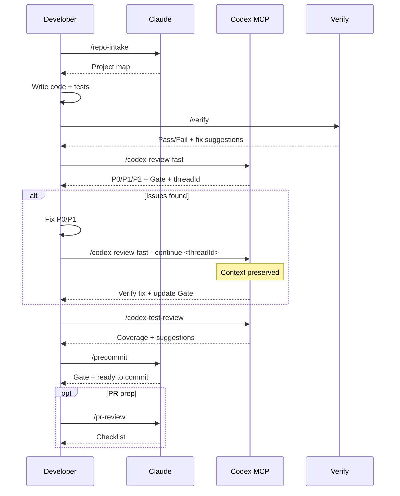

# claude-codex-flow

Claude + Codex collaborative development workflow plugin for [Claude Code](https://claude.com/claude-code).

83 tools covering code review, testing, investigation, security audit, and DevOps automation.

## Requirements

- Claude Code 2.1+
- [Codex MCP](https://github.com/openai/codex) configured (for `/codex-*` commands)

## Install

```bash
# Add marketplace
/plugin marketplace add sd0xdev/claude-codex-flow

# Install plugin
/plugin install claude-codex-flow@sd0xdev-marketplace
```

## What's Included

| Category | Count | Examples |
|----------|-------|---------|
| Commands | 35 | `/codex-review-fast`, `/verify`, `/bug-fix` |
| Skills | 22 | code-explore, code-investigate, codex-brainstorm |
| Agents | 14 | strict-reviewer, verify-app, coverage-analyst |
| Hooks | 5 | auto-format, review state tracking, stop guard |
| Rules | 8 | auto-loop, security, testing, git-workflow |
| Scripts | 3 | precommit runner, verify runner, dep audit |

## Workflow



## Commands Reference

### Development

| Command | Description |
|---------|-------------|
| `/repo-intake` | One-time project intake scan |
| `/bug-fix` | Bug/Issue fix workflow |
| `/codex-implement` | Codex writes code |
| `/codex-architect` | Architecture advice (third brain) |
| `/code-explore` | Fast codebase exploration |
| `/git-investigate` | Track code history |
| `/issue-analyze` | Deep issue analysis |
| `/post-dev-test` | Post-dev test completion |

### Review (Codex MCP)

| Command | Description | Loop Support |
|---------|-------------|--------------|
| `/codex-review-fast` | Quick review (diff only) | `--continue <threadId>` |
| `/codex-review` | Full review (lint + build) | `--continue <threadId>` |
| `/codex-review-branch` | Full branch review | - |
| `/codex-cli-review` | CLI review (full disk read) | - |
| `/codex-review-doc` | Document review | `--continue <threadId>` |
| `/codex-security` | OWASP Top 10 audit | `--continue <threadId>` |
| `/codex-test-gen` | Generate unit tests | - |
| `/codex-test-review` | Review test coverage | `--continue <threadId>` |
| `/codex-explain` | Explain complex code | - |

### Verification

| Command | Description |
|---------|-------------|
| `/verify` | lint -> typecheck -> unit -> integration -> e2e |
| `/precommit` | lint:fix -> build -> test:unit |
| `/precommit-fast` | lint:fix -> test:unit |
| `/dep-audit` | npm dependency security audit |

### Planning

| Command | Description |
|---------|-------------|
| `/codex-brainstorm` | Adversarial brainstorm (Nash equilibrium) |
| `/feasibility-study` | Feasibility analysis |
| `/tech-spec` | Generate tech spec |
| `/review-spec` | Review tech spec |
| `/deep-analyze` | Deep analysis + roadmap |
| `/project-brief` | PM/CTO executive summary |

### Documentation & Tooling

| Command | Description |
|---------|-------------|
| `/update-docs` | Sync docs with code |
| `/check-coverage` | Test coverage analysis |
| `/create-request` | Create/update request docs |
| `/doc-refactor` | Simplify documents |
| `/simplify` | Code simplification |
| `/de-ai-flavor` | Remove AI artifacts |
| `/create-skill` | Create new skills |
| `/pr-review` | PR self-review |
| `/zh-tw` | Rewrite in Traditional Chinese |

## Rules

| Rule | Description |
|------|-------------|
| `auto-loop` | Fix -> re-review -> fix -> ... -> Pass (auto cycle) |
| `fix-all-issues` | Zero tolerance: fix every issue found |
| `framework` | Framework-specific conventions (customizable) |
| `testing` | Unit/Integration/E2E isolation |
| `security` | OWASP Top 10 checklist |
| `git-workflow` | Branch naming, commit conventions |
| `docs-writing` | Tables > paragraphs, Mermaid > text |
| `logging` | Structured JSON, no secrets |

## Hooks

| Hook | Trigger | Purpose |
|------|---------|---------|
| `post-edit-format` | After Edit/Write | Auto prettier |
| `post-tool-review-state` | After Edit/Bash | Track review state |
| `pre-edit-guard` | Before Edit/Write | Prevent editing .env/.git |
| `stop-guard` | Before stop | Block incomplete reviews |
| `stop-check` | Before stop | Smart task completion check |

## Customization

After installing, customize placeholders in your project:

| Placeholder | Description | Example |
|-------------|-------------|---------|
| `{FRAMEWORK}` | Your framework | MidwayJS 3.x, NestJS, Express |
| `{CONFIG_FILE}` | Main config file | src/configuration.ts |
| `{BOOTSTRAP_FILE}` | Bootstrap entry | bootstrap.js, main.ts |
| `{DATABASE}` | Database | MongoDB, PostgreSQL |
| `{TEST_COMMAND}` | Test command | yarn test:unit |
| `{FRAMEWORK_MOCK_LIB}` | Test mock library | @midwayjs/mock, @nestjs/testing |
| `{PRIMARY_PROVIDER}` | External data provider | Your API provider |

## Architecture

```
Command (entry) -> Skill (capability) -> Agent (environment)
```

- **Commands**: User-triggered via `/...`
- **Skills**: Knowledge bases loaded on demand
- **Agents**: Isolated subagents with specific tools
- **Hooks**: Automated guardrails (format, review state, stop guard)
- **Rules**: Always-on conventions (auto-loaded)

## Contributing

PRs welcome. Please:

1. Follow existing naming conventions (kebab-case)
2. Include `When to Use` / `When NOT to Use` in skills
3. Add `disable-model-invocation: true` for dangerous operations
4. Test with Claude Code before submitting

## License

MIT
