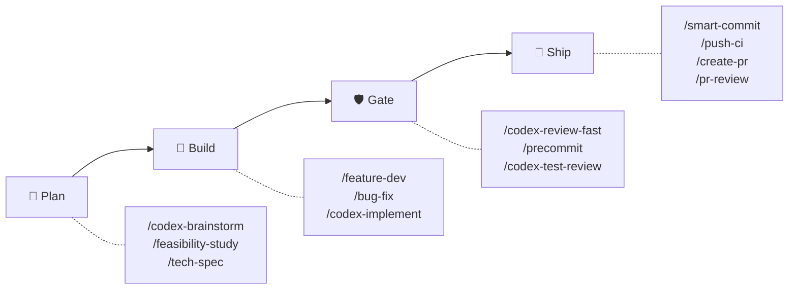
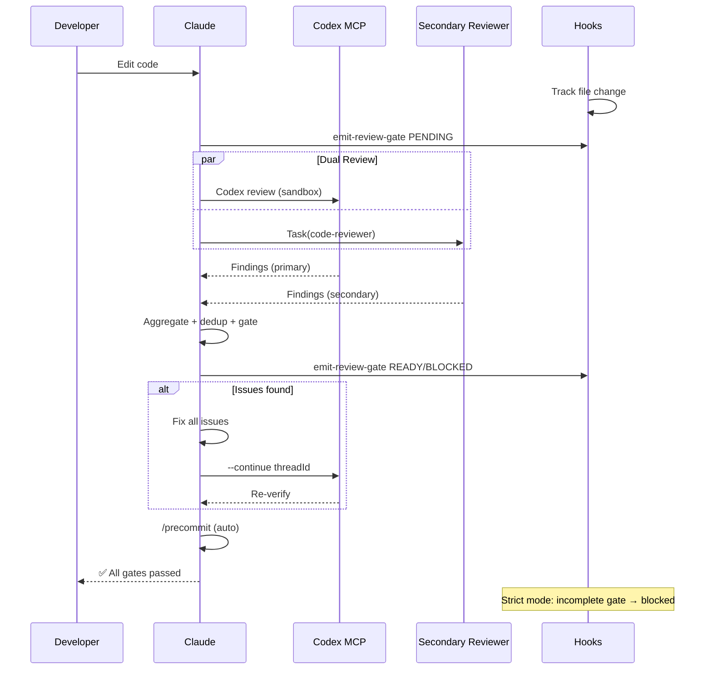

# sd0x-dev-flow


**Language**: English | [繁體中文](README.zh-TW.md) | [简体中文](README.zh-CN.md) | [日本語](README.ja.md) | [한국어](README.ko.md) | [Español](README.es.md)

> The harness layer for Claude Code.

**Quality gates that AI can't skip.** A reference implementation of AI Agent Harness Engineering for [Claude Code](https://claude.com/claude-code) — hook-enforced dual review, state-machine gates that survive context compaction, and fail-closed safety where it counts.

<!-- BEGIN:HERO-COUNT -->
98 bundled · 98 public skills · 15 agents — ~4% of Claude's context window
<!-- END:HERO-COUNT -->

[](LICENSE) [](https://www.npmjs.com/package/skills)

## What This Harness Does

> [Harness engineering](https://martinfowler.com/articles/exploring-gen-ai/harness-engineering.html) is the discipline of engineering everything around the LLM — tool loops, context management, hooks, state machines, safety layers — as opposed to training the model itself. Mitchell Hashimoto coined the term in Feb 2026; [Anthropic engineering](https://www.anthropic.com/engineering/effective-harnesses-for-long-running-agents) and [Martin Fowler](https://martinfowler.com/articles/exploring-gen-ai/harness-engineering.html) have published on it; [arXiv 2603.05344](https://arxiv.org/html/2603.05344v1) formalizes it.

sd0x-dev-flow is a reference implementation. Each row below maps a canonical harness sub-problem to concrete code you can study:

| # | Harness sub-problem | sd0x-dev-flow implementation | Code evidence |
|---|---------------------|------------------------------|---------------|
| 1 | **Tool loop control** | `/codex-review-fast` → `/precommit` auto-loop with sentinel-driven transitions | [`rules/auto-loop.md`](rules/auto-loop.md) + [`hooks/post-tool-review-state.sh`](hooks/post-tool-review-state.sh) |
| 2 | **Sentinel-driven state machine** | `✅ Ready` / `⛔ Blocked` / `✅ All Pass` gate markers parsed into durable state | [`scripts/emit-review-gate.sh`](scripts/emit-review-gate.sh) (producer) + [`hooks/post-tool-review-state.sh`](hooks/post-tool-review-state.sh) (parser) |
| 3 | **Context recovery across compaction** | `[AUTO_LOOP_RESUME]` stdout injection after SessionStart(compact) | [`hooks/post-compact-auto-loop.sh`](hooks/post-compact-auto-loop.sh) |
| 4 | **Lifecycle interceptors** | 5 hook event types dispatched to 8 scripts: PreToolUse / PostToolUse / Stop / SessionStart / UserPromptSubmit | [`hooks/`](hooks/) (8 scripts) + [`.claude/settings.json`](.claude/settings.json) |
| 5 | **Capability-based tool gating** | Skill frontmatter `allowed-tools` — e.g., `/ask` has no Edit/Write | 89 of 98 public skills declare `allowed-tools` |
| 6 | **Defense-in-depth safety** | 5 layers: pre-edit-guard → commit-msg-guard → pre-push-gate → stop-guard → sidecar fail-closed marker | [`scripts/pre-push-gate.sh`](scripts/pre-push-gate.sh) + [`scripts/commit-msg-guard.sh`](scripts/commit-msg-guard.sh) + [`hooks/stop-guard.sh`](hooks/stop-guard.sh) |
| 7 | **Generator-evaluator split** | Dual review: Codex (primary) + Claude (secondary) dispatched in parallel on every review cycle | [`rules/codex-invocation.md`](rules/codex-invocation.md) + [`rules/auto-loop.md`](rules/auto-loop.md) (Dual Review Mode) |
| 8 | **Incremental progress tracking** | `iteration_history.current_round` + `max_rounds` + convergence plateau detection | [`rules/auto-loop.md`](rules/auto-loop.md) (exit conditions + strategic reset) |
| 9 | **Human-in-the-loop safety gates** | `/dev/tty` confirmation + `AskUserQuestion` for destructive ops | [`scripts/pre-push-gate.sh`](scripts/pre-push-gate.sh) + [`skills/push-ci/SKILL.md`](skills/push-ci/SKILL.md) |
| 10 | **Self-improvement loop** | Correction → record lesson → promote to rule after 3+ recurrences | [`rules/self-improvement.md`](rules/self-improvement.md) |

Most harness projects cover 2–4 of these. sd0x-dev-flow covers all 10 — which makes the code useful as a study target, not just a tool.

## Why sd0x-dev-flow?

| Without guardrails | With sd0x-dev-flow |
|---|---|
| AI skips review when context is long | **Hook-enforced**: stop-guard blocks incomplete reviews |
| Single reviewer misses issues | **Dual dispatch**: Codex + secondary in parallel |
| "Fixed it" without re-verification | **Auto-loop**: fix → re-review → pass → continue |
| Review state lost after compact | **State tracking**: SessionStart hook re-injects |

## Quick Start

```bash
# Install plugin
/plugin marketplace add sd0xdev/sd0x-dev-flow
/plugin install sd0x-dev-flow@sd0xdev-marketplace

# Configure your project
/project-setup
```

One command auto-detects framework, package manager, database, entrypoints, and scripts. Installs a subset of rules and hooks; the full plugin bundles 14 rules + 8 hooks.

Use `--lite` to only configure CLAUDE.md (skip rules/hooks).

## How It Works


```mermaid
flowchart LR
    P["🎯 Plan"] --> B["🔨 Build"]
    B --> G["🛡️ Gate"]
    G --> S["🚀 Ship"]

    P -.- P1["/codex-brainstorm<br/>/feasibility-study<br/>/tech-spec"]
    B -.- B1["/feature-dev<br/>/bug-fix<br/>/codex-implement"]
    G -.- G1["/codex-review-fast<br/>/precommit<br/>/codex-test-review"]
    S -.- S1["/smart-commit<br/>/push-ci<br/>/create-pr<br/>/pr-review"]
```

The **auto-loop engine** enforces quality gates automatically — after code edits, the review command dispatches **dual review** (Codex MCP + secondary reviewer in parallel) in the same reply. Findings are deduplicated, severity-normalized, and aggregated into a single gate. In strict mode, hooks enforce fail-closed semantics: if the aggregate gate is incomplete, stop-guard blocks. See [docs/hooks.md](docs/hooks.md) for mode and dependency details.

<details>
<summary>Detailed: Dual-Review Sequence Diagram</summary>


```mermaid
sequenceDiagram
    participant D as Developer
    participant C as Claude
    participant X as Codex MCP
    participant T as Secondary Reviewer
    participant H as Hooks

    D->>C: Edit code
    H->>H: Track file change
    C->>H: emit-review-gate PENDING
    par Dual Review
        C->>X: Codex review (sandbox)
    and
        C->>T: Task(code-reviewer)
    end
    X-->>C: Findings (primary)
    T-->>C: Findings (secondary)
    C->>C: Aggregate + dedup + gate
    C->>H: emit-review-gate READY/BLOCKED

    alt Issues found
        C->>C: Fix all issues
        C->>X: --continue threadId
        X-->>C: Re-verify
    end

    C->>C: /precommit (auto)
    C-->>D: ✅ All gates passed

    Note over H: Strict mode: incomplete gate → blocked
```

</details>

## Feature Spotlight: Dual-Reviewer Architecture

v2.0 dispatches two independent reviewers in parallel — dual-review by default with degraded fallback modes:

| Reviewer | Role | Fallback |
|----------|------|----------|
| Codex MCP | Primary (sandbox, full diff) | Single-reviewer mode if unavailable |
| Secondary (pr-review-toolkit) | Confidence-scored review | strict-reviewer → single mode |

Findings are **severity-normalized** (P0-Nit), **deduplicated** (file + issue key, ±5 line tolerance), and **source-attributed** (`codex` | `toolkit` | `both`).

Gate: `✅ Ready` or `⛔ Blocked` — in strict mode, incomplete gate = blocked.

## How We Compare

| Capability | sd0x-dev-flow | gstack | Generic prompts |
|---|---|---|---|
| Enforced review gates | Hook + behavior layer | Suggestion only | None |
| Dual-reviewer | Codex + secondary (parallel) | Single /review | None |
| Auto-fix loop | Fix → re-review → pass | Manual | None |
| Multi-agent research | /deep-research (3 agents) | None | None |
| Adversarial validation | Nash equilibrium debate | None | None |
| Self-improvement | Lesson log + rule promotion | /retro stats only | None |
| Cross-tool support | Codex/Cursor/Windsurf | Claude/Codex/Gemini/Cursor | N/A |

## When to Use

| Good Fit | Not Ideal |
|----------|-----------|
| Solo or small-team projects with Claude Code | Teams not using Claude Code |
| Projects needing automated review gates | One-off scripts with no CI |
| Codex CLI / Cursor / Windsurf users (skills subset) | Projects requiring custom LLM providers |
| Repos where quality gates prevent regressions | Repos with no test infrastructure |

## Install

### Codex CLI / Other AI Agents

```bash
# Install individual skills via Agent Skills standard
npx skills add sd0xdev/sd0x-dev-flow

# Generate AGENTS.md + install hooks (in Claude Code)
/codex-setup init
```

<!-- BEGIN:INSTALL-COVERAGE -->
| Method | Tools | Coverage |
|--------|-------|----------|
| Plugin install | Claude Code | Full (98 bundled skills, hooks, rules, auto-loop) |
| `npx skills add` | Codex CLI, Cursor, Windsurf, Aider | Skills only (98 public skills) |
| `/codex-setup init` | Codex CLI | AGENTS.md kernel + git hooks |
<!-- END:INSTALL-COVERAGE -->

**Requirements**: Claude Code 2.1+ | [Codex MCP](https://github.com/openai/codex) (optional — `/codex-*` skills require it; without it, review falls back to single-reviewer mode)

## Workflow Tracks

| Workflow | Commands | Gate | Enforced By |
|----------|----------|------|-------------|
| Feature | `/feature-dev` → `/verify` → `/codex-review-fast` → `/precommit` | ✅/⛔ | Hook + Behavior |
| Bug Fix | `/issue-analyze` → `/bug-fix` → `/verify` → `/precommit` | ✅/⛔ | Hook + Behavior |
| Auto-Loop | Code edit → `/codex-review-fast` → `/precommit` | ✅/⛔ | Hook |
| Doc Review | `.md` edit → `/codex-review-doc` | ✅/⛔ | Hook |
| Planning | `/codex-brainstorm` → `/feasibility-study` → `/tech-spec` | — | — |
| Onboarding | `/project-setup` → `/repo-intake` | — | — |

<details>
<summary>Visual: Workflow Flowcharts</summary>


```mermaid
flowchart TD
    subgraph feat ["🔨 Feature Development"]
        F1["/feature-dev"] --> F2["Code + Tests"]
        F2 --> F3["/verify"]
        F3 --> F4["/codex-review-fast"]
        F4 --> F5["/precommit"]
        F5 --> F6["/update-docs"]
    end

    subgraph fix ["🐛 Bug Fix"]
        B1["/issue-analyze"] --> B2["/bug-fix"]
        B2 --> B3["Fix + Regression test"]
        B3 --> B4["/verify"]
        B4 --> B5["/codex-review-fast"]
        B5 --> B6["/precommit"]
    end

    subgraph docs ["📝 Docs Only"]
        D1["Edit .md"] --> D2["/codex-review-doc"]
        D2 --> D3["Done"]
    end

    subgraph plan ["🎯 Planning"]
        P1["/codex-brainstorm"] --> P2["/feasibility-study"]
        P2 --> P3["/tech-spec"]
        P3 --> P4["/codex-architect"]
        P4 --> P5["Implementation ready"]
    end

    subgraph ops ["⚙️ Operations"]
        O1["/project-setup"] --> O2["/repo-intake"]
        O2 --> O3["Develop"]
        O3 --> O4["/project-audit"]
        O3 --> O7["/best-practices"]
        O3 --> O5["/risk-assess"]
        O4 --> O6["/next-step --go"]
        O5 --> O6
        O7 --> O6
    end
```

</details>

## Cookbook

Real-world scenarios showing which skills to combine and in what order.

| Scenario | Flow | Docs |
|----------|------|------|
| First day in a repo | `/project-setup` → `/repo-intake` → `/next-step` | [→](docs/cookbook/first-day.md) |
| Implement a new feature | `/feature-dev` → `/verify` → `/codex-test-review` → `/codex-review-fast` → `/precommit` | [→](docs/cookbook/new-feature.md) |
| Resolve PR review comments | `/load-pr-review` → fix → `/codex-review-fast` → `/push-ci` | [→](docs/cookbook/pr-review-comments.md) |
| Security pre-merge pass | `/codex-security` → `/dep-audit` → `/risk-assess` → `/pre-pr-audit` | [→](docs/cookbook/security-pre-merge.md) |
| **Showcase:** Validate direction | `/deep-research` → `/best-practices` → `/feasibility-study` → `/codex-brainstorm` | [→](docs/cookbook/validate-direction.md) |
| **Showcase:** Adversarial design | `/codex-brainstorm` (Nash equilibrium debate) → `/codex-architect` | [→](docs/cookbook/adversarial-design.md) |

[All 10 scenarios →](docs/cookbook/)

## What's Included

<!-- BEGIN:WHATS-INCLUDED-COUNT -->
| Category | Count | Examples |
|----------|-------|---------|
| Skills | 98 public (98 bundled) | `/project-setup`, `/codex-review-fast`, `/verify`, `/smart-commit`, `/deep-research` |
| Agents | 15 | strict-reviewer, verify-app, coverage-analyst, architecture-designer |
| Hooks | 8 | pre-edit-guard, auto-format, review state tracking, stop guard, post-compact-auto-loop, post-skill-auto-loop, user-prompt-review-guard, session-init |
| Rules | 14 | auto-loop, auto-loop-project, codex-invocation, security, testing, git-workflow, self-improvement, context-management |
| Scripts | 17 | precommit runner, verify runner, dep audit, namespace hint, skill runner, commit-msg guard, pre-push gate, emit-review-gate, emit-plan-gate, build-codex-artifacts, resolve-feature (CLI + shell), classify-docs, detect-scope, migration-audit, security-redact, readme-catalog |
<!-- END:WHATS-INCLUDED-COUNT -->

### Minimal Context Footprint

~4% of Claude's 200k context window — 96% remains for your code.

| Component | Tokens | % of 200k |
|-----------|--------|-----------|
| Rules (always loaded) | 5.1k | 2.6% |
| Skills (on-demand) | 1.9k | 1.0% |
| Agents | 791 | 0.4% |
| **Total** | **~8k** | **~4%** |

Skills load on-demand. Idle skills cost zero tokens.

## Skill Reference

<!-- BEGIN:ESSENTIAL-SKILLS -->
| Skill | Use when |
|-------|----------|
| `/project-setup` | First-time project configuration |
| `/bug-fix` | Fixing bugs and resolving issues |
| `/feature-dev` | Implementing new features end-to-end |
| `/smart-commit` | Committing changes with smart grouping |
| `/push-ci` | Pushing code and monitoring CI |
| `/create-pr` | Creating GitHub pull requests |
| `/codex-review-fast` | Quick code review (diff only) |
| `/codex-review-doc` | Reviewing documentation changes |
| `/codex-security` | OWASP Top 10 security audit |
| `/verify` | Running full test verification chain |
| `/precommit` | Pre-commit quality gate (lint + build + test) |
| `/precommit-fast` | Quick pre-commit (lint + test, no build) |
| `/codex-brainstorm` | Adversarial brainstorming (Nash equilibrium) |
| `/tech-spec` | Writing technical specifications |
| `/pr-review` | PR self-review before merge |
<!-- END:ESSENTIAL-SKILLS -->

<!-- BEGIN:FULL-CATALOG -->
<details>
<summary>All 98 public skills</summary>

### Development (33)

| Skill | Description |
|-------|-------------|
| `/ask` | Context-aware Q&A with auto context gathering. |
| `/bug-fix` | Bug fix workflow. |
| `/bump-version` | Bump package and plugin version in sync. |
| `/code-explore` | Pure Claude code investigation. |
| `/code-investigate` | Dual-perspective code investigation. |
| `/codex-architect` | Codex architecture consulting. |
| `/codex-implement` | Implement features via Codex MCP. |
| `/codex-setup` | Initialize sd0x-dev-flow infrastructure for Codex CLI and other non-Claude agents. |
| `/create-pr` | Create or update GitHub PR with gh CLI. |
| `/debug` | Interactive debugging workflow with hypothesis-driven probe loop. |
| `/deep-explore` | Multi-wave parallel code exploration orchestrator. |
| `/epic-merge` | Sequential squash-merge of stacked PR chains into an epic branch. |
| `/feature-dev` | Feature development workflow. |
| `/feature-verify` | Feature verification (READ-ONLY, P0-P5). |
| `/git-investigate` | Git history investigation. |
| `/git-profile` | Git identity and GPG signing profile manager. |
| `/install-hooks` | Install plugin hooks into project .claude/ for persistent use without plugin loaded |
| `/install-rules` | Install plugin rules into project .claude/rules/ for persistent use without plugin loaded |
| `/install-scripts` | Install plugin runner scripts into project .claude/scripts/ for persistent use without plugin loaded |
| `/issue-analyze` | GitHub Issue and PR review thread deep analysis with Codex blind verdict. |
| `/jira` | Jira integration — view issues, generate branches, create tickets, transition status. |
| `/load-pr-review` | Load GitHub PR review comments into AI session — analyze, triage, plan. |
| `/merge-prep` | Pre-merge analysis and preparation. |
| `/next-step` | Change-aware next step advisor. |
| `/post-dev-test` | Post-development test completion. |
| `/pr-comment` | Post friendly review comments to a GitHub PR — prepare locally, preview, then submit as atomic review. |
| `/project-setup` | Project configuration initialization. |
| `/push-ci` | Push to remote and monitor CI. |
| `/remind` | Lightweight model correction with context-aware rule loading. |
| `/repo-intake` | Project initialization inventory (one-time). |
| `/smart-commit` | Smart batch commit. |
| `/smart-rebase` | Smart partial rebase for squash-merge repositories. |
| `/watch-ci` | Monitor GitHub Actions CI runs until completion. |

### Review (Codex MCP) (15)

| Skill | Description | Loop Support |
|-------|-------------|--------------|
| `/codex-cli-review` | Code review via Codex CLI with full disk access. | - |
| `/codex-code-review` | Code review using Codex MCP. | - |
| `/codex-explain` | Explain complex code via Codex MCP. | - |
| `/codex-review` | Full second-opinion using Codex MCP (with lint:fix + build). | `--continue <threadId>` |
| `/codex-review-branch` | Fully automated review of an entire feature branch using Codex MCP | - |
| `/codex-review-doc` | Review documents using Codex MCP. | `--continue <threadId>` |
| `/codex-review-fast` | Quick second-opinion using Codex MCP (diff only, no tests). | `--continue <threadId>` |
| `/codex-security` | OWASP Top 10 security review using Codex MCP. | `--continue <threadId>` |
| `/codex-test-gen` | Generate unit tests for specified functions using Codex MCP | - |
| `/codex-test-review` | Review test case sufficiency using Codex MCP, suggest additional edge cases. | `--continue <threadId>` |
| `/doc-review` | Document review via Codex MCP. | - |
| `/plan-review` | Pre-ExitPlanMode adversarial plan review loop via Codex MCP. | - |
| `/security-review` | Security review via Codex MCP. | - |
| `/seek-verdict` | Independent second-opinion verification for any finding. | - |
| `/test-review` | Test coverage review via Codex MCP. | - |

### Verification (13)

| Skill | Description |
|-------|-------------|
| `/best-practices` | Industry best practices conformance audit with mandatory adversarial debate. |
| `/check-coverage` | Comprehensive assessment of Unit / Integration / E2E three-layer test coverage, identify gaps and provide actionable ... |
| `/dep-audit` | Audit dependency security risks |
| `/dev-security-audit` | Comprehensive developer workstation security audit — scans for exposed credentials, compromised application data, per... |
| `/necessity-audit` | Necessity audit for over-designed spec elements. |
| `/pre-pr-audit` | Pre-PR confidence audit with 5-dimension scoring. |
| `/precommit` | Pre-commit checks — lint:fix -> build -> test |
| `/precommit-fast` | Quick pre-commit checks — lint:fix -> test |
| `/project-audit` | Project health audit with deterministic scoring. |
| `/risk-assess` | Uncommitted code risk assessment with breaking change detection, blast radius analysis, and scope metrics. |
| `/test-deep` | Context-aware test orchestration. |
| `/test-health` | Holistic test coverage measurement. |
| `/verify` | Verification loop — lint -> typecheck -> unit -> integration -> e2e |

### Planning (17)

| Skill | Description |
|-------|-------------|
| `/architecture` | Architecture design and documentation. |
| `/codex-brainstorm` | Adversarial brainstorming via Claude+Codex debate. |
| `/deep-analyze` | Deep-dive analysis of an initial proposal — research code implementation, produce an actionable roadmap and alternatives |
| `/deep-research` | Universal multi-source research orchestration. |
| `/feasibility-study` | Feasibility analysis from first principles. |
| `/fp-brief` | First-principles briefing from technical documents. |
| `/orchestrate` | Agent-driven workflow orchestration (v1 report-only). |
| `/post-dev-recap` | Post-development recap wrapper. |
| `/project-brief` | Convert a technical spec into a PM/CTO-readable executive summary. |
| `/recap-ask` | Interactive Q&A over an existing recap document. |
| `/recap-doc` | Post-development recap document generator. |
| `/req-analyze` | Requirements analysis — problem decomposition, stakeholder scan, requirement structuring. |
| `/request-tracking` | Request tracking knowledge base. |
| `/review-spec` | Review technical spec documents from completeness, feasibility, risk, and code consistency perspectives. |
| `/tech-brief` | Technical briefing for developer sharing. |
| `/tech-spec` | Tech spec generation and review. |
| `/ui-first-principles` | First-principles UI/IA reasoning: turns a `<scenario>` + API field set into JTBD analysis, principle-anchored field-p... |

### Documentation & Tooling (20)

| Skill | Description |
|-------|-------------|
| `/claude-health` | Claude Code config health check + plugin sync. |
| `/contract-decode` | EVM contract error and calldata decoder. |
| `/create-request` | Create, update, or scan per-task request tickets for progress tracking. |
| `/de-ai-flavor` | Remove AI artifacts from documents. |
| `/doc-refactor` | Refactor documents — simplify without losing information, visualize flows with sequenceDiagram. |
| `/generate-runner` | Generate a customized precommit runner for any ecosystem. |
| `/obsidian-cli` | Obsidian vault integration via official CLI. |
| `/op-session` | Initialize 1Password CLI session for Claude Code. |
| `/portfolio` | Portfolio system knowledge base. |
| `/pr-review` | PR self-review — review changes, produce checklist, update rules |
| `/pr-summary` | List open PRs, filter automation PRs, group by ticket ID, format as Markdown. |
| `/refactor` | Multi-target refactoring orchestrator. |
| `/runbook` | Generate/update feature release runbook |
| `/safe-remove` | Safely remove plugin assets (skill/agent/rule/script/hook) with dependency detection and reference cleanup. |
| `/sharingan` | Replicate knowledge from any source as sd0x-dev-flow skill definition. |
| `/simplify` | Wrap-up refactoring — simplify code, eliminate duplication, preserve behavior |
| `/skill-health-check` | Validate skill quality against routing, progressive loading, and verification criteria. |
| `/statusline-config` | Customize Claude Code statusline. |
| `/update-docs` | Research current code state then update corresponding docs, ensuring docs stay in sync with code. |
| `/zh-tw` | Rewrite the previous reply in Traditional Chinese |

</details>
<!-- END:FULL-CATALOG -->

## Rules & Hooks

14 rules (always-loaded conventions) + 8 hooks (automated guardrails).

> **Customization**: Edit `auto-loop-project.md` to override auto-loop behavior per project. Plugin updates won't conflict — see [Rule Override Pattern](docs/features/rule-override-pattern/2-tech-spec.md).

For full rules, hooks, and environment variable reference, see [docs/rules.md](docs/rules.md) and [docs/hooks.md](docs/hooks.md).

## Customization

Run `/project-setup` to auto-detect and configure all placeholders, or manually edit `.claude/CLAUDE.md`:

| Placeholder | Description | Example |
|-------------|-------------|---------|
| `{PROJECT_NAME}` | Your project name | my-app |
| `{FRAMEWORK}` | Your framework | MidwayJS 3.x, NestJS, Express |
| `{CONFIG_FILE}` | Main config file | src/configuration.ts |
| `{BOOTSTRAP_FILE}` | Bootstrap entry | bootstrap.js, main.ts |
| `{DATABASE}` | Database | MongoDB, PostgreSQL |
| `{TEST_COMMAND}` | Test command | yarn test:unit |
| `{LINT_FIX_COMMAND}` | Lint auto-fix | yarn lint:fix |
| `{BUILD_COMMAND}` | Build command | yarn build |
| `{TYPECHECK_COMMAND}` | Type checking | yarn typecheck |

## Showcase: Multi-Agent Research

Run `/deep-research` to orchestrate 2-3 parallel researcher agents across web sources, codebase, and community knowledge — with claim registry synthesis and conditional adversarial debate.

| Feature | Details |
|---------|---------|
| Agents | 2-3 parallel (web + code + community) |
| Synthesis | Claim registry with consensus detection |
| Validation | Conditional /codex-brainstorm debate |
| Scoring | 4-signal completeness model |

[Full documentation](docs/features/deep-research/)

## Architecture

```
Command (entry) → Skill (capability) → Agent (environment)
```

- **Commands**: User-triggered via `/...`
- **Skills**: Knowledge bases loaded on demand
- **Agents**: Isolated subagents with specific tools
- **Hooks**: Automated guardrails (format, review state, stop guard)
- **Rules**: Always-on conventions (auto-loaded)

For advanced architecture details (agentic control stack, control loop theory, sandbox rules), see [docs/architecture.md](docs/architecture.md).

## Contributing

PRs welcome. Please:

1. Follow existing naming conventions (kebab-case)
2. Include `When to Use` / `When NOT to Use` in skills
3. Add `disable-model-invocation: true` for dangerous operations
4. Test with Claude Code before submitting

## License

MIT

## Star History

<a href="https://www.star-history.com/?repos=sd0xdev%2Fsd0x-dev-flow&type=date&legend=top-left">
 <picture>
   <source media="(prefers-color-scheme: dark)" srcset="https://api.star-history.com/image?repos=sd0xdev/sd0x-dev-flow&type=date&theme=dark&legend=top-left" />
   <source media="(prefers-color-scheme: light)" srcset="https://api.star-history.com/image?repos=sd0xdev/sd0x-dev-flow&type=date&legend=top-left" />
   
 </picture>
</a>
