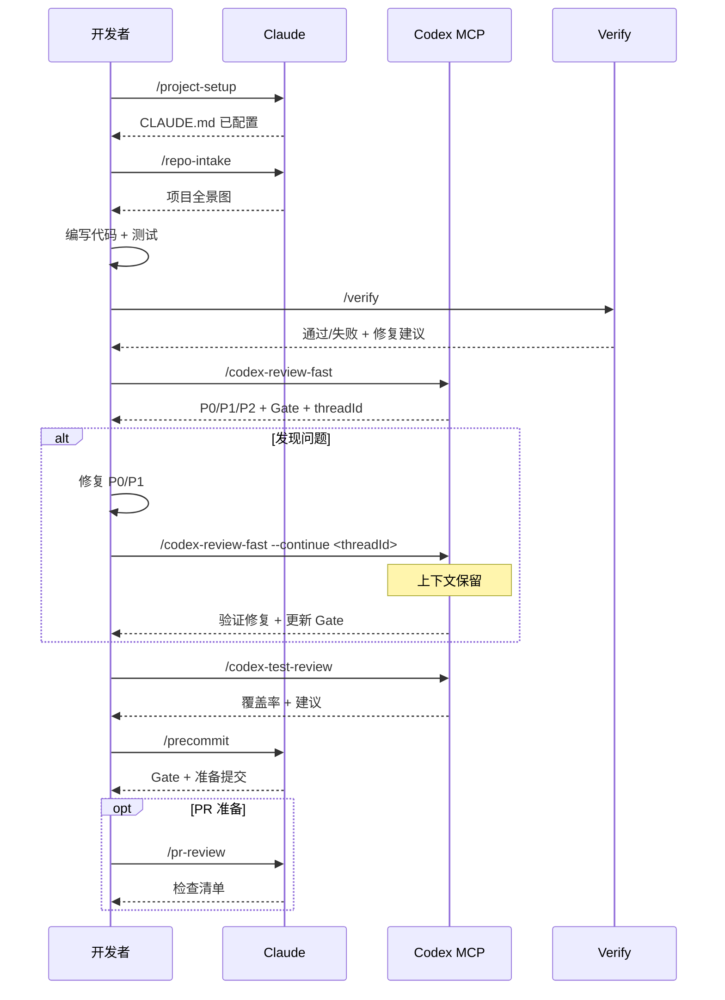

# sd0x-dev-flow

**语言**: [English](README.md) | [繁體中文](README.zh-TW.md) | 简体中文 | [日本語](README.ja.md) | [한국어](README.ko.md) | [Español](README.es.md)

[Claude Code](https://claude.com/claude-code) 开发工作流插件，可选集成 Codex MCP。

90+ 个工具，覆盖代码审查、测试、问题排查、安全审计与 DevOps 自动化。

## 环境要求

- Claude Code 2.1+
- [Codex MCP](https://github.com/openai/codex) 已配置（用于 `/codex-*` 命令）

## 安装

```bash
# 添加 marketplace
/plugin marketplace add sd0xdev/sd0x-dev-flow

# 安装插件
/plugin install sd0x-dev-flow@sd0xdev-marketplace
```

## 快速开始

安装完成后，运行 `/project-setup` 自动检测项目环境并配置所有占位符：

```bash
/project-setup
```

会自动检测框架、包管理器、数据库、入口文件和脚本命令，然后更新 `CLAUDE.md`。

## 包含内容

| 类别 | 数量 | 示例 |
|------|------|------|
| 命令 | 36 | `/project-setup`, `/codex-review-fast`, `/verify`, `/bug-fix` |
| 技能 | 23 | project-setup, code-explore, code-investigate, codex-brainstorm |
| 代理 | 14 | strict-reviewer, verify-app, coverage-analyst |
| 钩子 | 5 | auto-format, review state tracking, stop guard |
| 规则 | 9 | auto-loop, security, testing, git-workflow |
| 脚本 | 3 | precommit runner, verify runner, dep audit |

## 工作流



## 命令参考

### 开发

| 命令 | 说明 |
|------|------|
| `/project-setup` | 自动检测并配置项目 |
| `/repo-intake` | 一次性项目盘点扫描 |
| `/bug-fix` | 缺陷修复工作流 |
| `/codex-implement` | Codex 编写代码 |
| `/codex-architect` | 架构建议（第三大脑） |
| `/code-explore` | 快速代码探索 |
| `/git-investigate` | 追踪代码历史 |
| `/issue-analyze` | 深度问题分析 |
| `/post-dev-test` | 开发后补充测试 |

### 审查（Codex MCP）

| 命令 | 说明 | 循环支持 |
|------|------|----------|
| `/codex-review-fast` | 快速审查（仅 diff） | `--continue <threadId>` |
| `/codex-review` | 完整审查（lint + build） | `--continue <threadId>` |
| `/codex-review-branch` | 完整分支审查 | - |
| `/codex-cli-review` | CLI 审查（全盘读取） | - |
| `/codex-review-doc` | 文档审查 | `--continue <threadId>` |
| `/codex-security` | OWASP Top 10 审计 | `--continue <threadId>` |
| `/codex-test-gen` | 生成单元测试 | - |
| `/codex-test-review` | 审查测试覆盖率 | `--continue <threadId>` |
| `/codex-explain` | 解释复杂代码 | - |

### 验证

| 命令 | 说明 |
|------|------|
| `/verify` | lint -> typecheck -> unit -> integration -> e2e |
| `/precommit` | lint:fix -> build -> test:unit |
| `/precommit-fast` | lint:fix -> test:unit |
| `/dep-audit` | npm 依赖安全审计 |

### 规划

| 命令 | 说明 |
|------|------|
| `/codex-brainstorm` | 对抗式头脑风暴（纳什均衡） |
| `/feasibility-study` | 可行性分析 |
| `/tech-spec` | 生成技术规格书 |
| `/review-spec` | 审查技术规格书 |
| `/deep-analyze` | 深度分析 + 路线图 |
| `/project-brief` | PM/CTO 执行摘要 |

### 文档与工具

| 命令 | 说明 |
|------|------|
| `/update-docs` | 同步文档与代码 |
| `/check-coverage` | 测试覆盖率分析 |
| `/create-request` | 创建/更新需求文档 |
| `/doc-refactor` | 精简文档 |
| `/simplify` | 代码精简 |
| `/de-ai-flavor` | 去除 AI 痕迹 |
| `/create-skill` | 创建新技能 |
| `/pr-review` | PR 自查 |
| `/zh-tw` | 改写为繁体中文 |

## 规则

| 规则 | 说明 |
|------|------|
| `auto-loop` | 修复 -> 重新审查 -> 修复 -> ... -> 通过（自动循环） |
| `fix-all-issues` | 零容忍：修复所有发现的问题 |
| `framework` | 框架专属规范（可自定义） |
| `testing` | 单元/集成/端到端测试隔离 |
| `security` | OWASP Top 10 检查清单 |
| `git-workflow` | 分支命名、提交规范 |
| `docs-writing` | 表格 > 段落，Mermaid > 文字 |
| `docs-numbering` | 文档前缀规范（0-feasibility, 2-spec） |
| `logging` | 结构化 JSON，禁止泄露敏感信息 |

## 钩子

| 钩子 | 触发时机 | 用途 |
|------|----------|------|
| `post-edit-format` | 编辑/写入之后 | 自动格式化（仅限项目已装 prettier） |
| `post-tool-review-state` | 编辑/命令之后 | 追踪审查状态 |
| `pre-edit-guard` | 编辑/写入之前 | 禁止编辑 .env/.git |
| `stop-guard` | 停止之前 | 未完成审查时告警（默认：warn） |
| `stop-check` | 停止之前 | 智能任务完成度检查 |

### 钩子配置

钩子默认安全。通过环境变量自定义行为：

| 变量 | 默认值 | 说明 |
|------|--------|------|
| `STOP_GUARD_MODE` | `warn` | 设为 `strict` 可在缺少审查步骤时阻止停止 |
| `HOOK_NO_FORMAT` | （未设置） | 设为 `1` 禁用自动格式化 |
| `HOOK_BYPASS` | （未设置） | 设为 `1` 跳过所有停止守卫检查 |
| `HOOK_DEBUG` | （未设置） | 设为 `1` 输出调试信息 |
| `GUARD_EXTRA_PATTERNS` | （未设置） | 额外保护路径的正则表达式（例如 `src/locales/.*\.json$`） |

**依赖**：钩子需要 `jq`。自动格式化需要项目已装 `prettier`。缺少依赖时会自动跳过。

## 自定义配置

运行 `/project-setup` 自动检测并配置所有占位符，或手动编辑 `CLAUDE.md`：

| 占位符 | 说明 | 示例 |
|--------|------|------|
| `{PROJECT_NAME}` | 项目名称 | my-app |
| `{FRAMEWORK}` | 框架 | MidwayJS 3.x, NestJS, Express |
| `{CONFIG_FILE}` | 主配置文件 | src/configuration.ts |
| `{BOOTSTRAP_FILE}` | 启动入口 | bootstrap.js, main.ts |
| `{DATABASE}` | 数据库 | MongoDB, PostgreSQL |
| `{TEST_COMMAND}` | 测试命令 | yarn test:unit |
| `{LINT_FIX_COMMAND}` | Lint 自动修复 | yarn lint:fix |
| `{BUILD_COMMAND}` | 构建命令 | yarn build |
| `{TYPECHECK_COMMAND}` | 类型检查 | yarn typecheck |

## 架构

```
命令（入口）-> 技能（能力）-> 代理（环境）
```

- **命令**：用户通过 `/...` 触发
- **技能**：按需加载的知识库
- **代理**：拥有特定工具的隔离子代理
- **钩子**：自动化防护栏（格式化、审查状态、停止守卫）
- **规则**：始终生效的规范（自动加载）

## 贡献

欢迎 PR。请：

1. 遵循现有命名规范（kebab-case）
2. 在技能中包含 `When to Use` / `When NOT to Use`
3. 对危险操作添加 `disable-model-invocation: true`
4. 提交前用 Claude Code 测试

## 许可证

MIT
