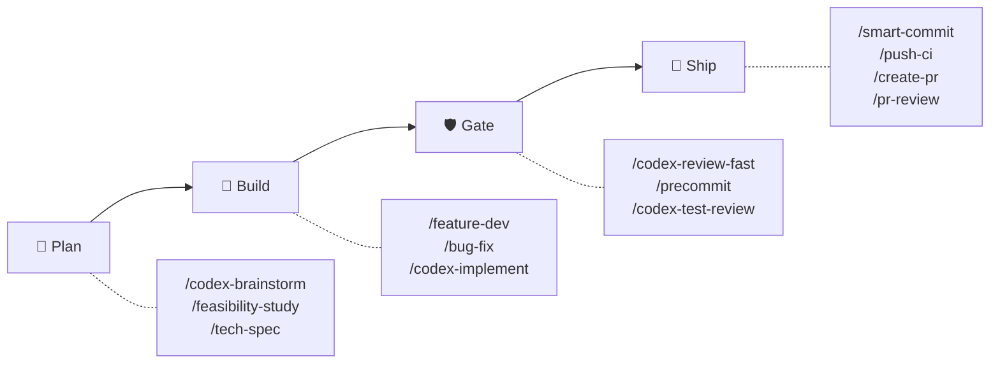
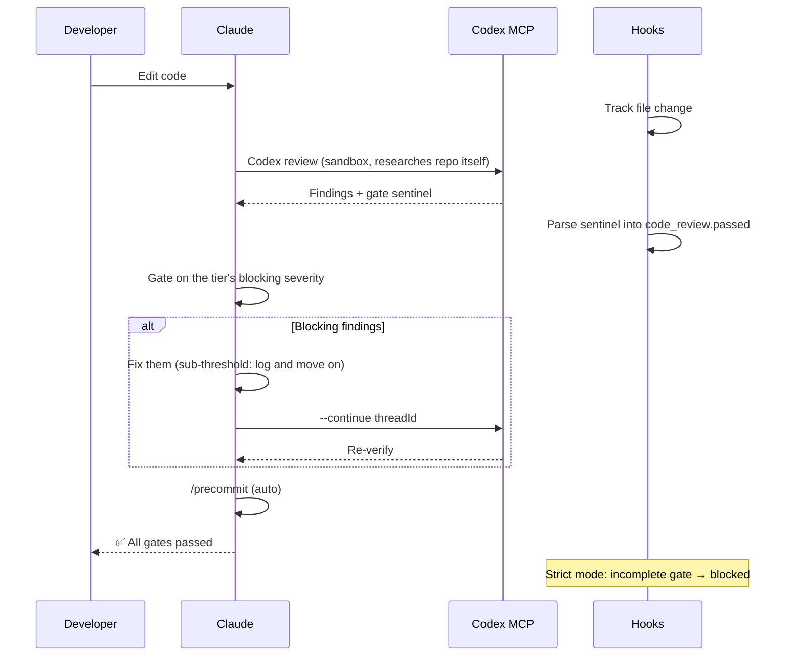

# sd0x-dev-flow


**语言**: [English](README.md) | [繁體中文](README.zh-TW.md) | 简体中文 | [日本語](README.ja.md) | [한국어](README.ko.md) | [Español](README.es.md)

> 给 Claude Code 的 harness 层。

**AI 跳不过的质量关卡。** 一个面向 [Claude Code](https://claude.com/claude-code) 的 AI Agent Harness Engineering reference implementation — 具备 hook 强制的 review gate、可跨 context compaction 存活的 state-machine gates，以及在关键环节 fail-closed 的安全机制。

<!-- BEGIN:HERO-COUNT -->
96 bundled · 96 public skills · 15 agents — 仅占 Claude context window 的 ~4%
<!-- END:HERO-COUNT -->

[](LICENSE) [](https://www.npmjs.com/package/skills)

## 这个 harness 做了什么

> [Harness engineering](https://martinfowler.com/articles/exploring-gen-ai/harness-engineering.html) 是一门专注于工程化 LLM 周边一切的学科 — tool loops、context management、hooks、state machines、safety layers — 而不是训练模型本身。Mitchell Hashimoto 在 2026 年 2 月首次提出这个词；[Anthropic engineering](https://www.anthropic.com/engineering/effective-harnesses-for-long-running-agents) 与 [Martin Fowler](https://martinfowler.com/articles/exploring-gen-ai/harness-engineering.html) 都已发表相关文章；[arXiv 2603.05344](https://arxiv.org/html/2603.05344v1) 则对其做了形式化定义。

sd0x-dev-flow 是一个 reference implementation。下表的每一行都把一个典型的 harness 子问题映射到可供研究的具体代码：

| # | Harness 子问题 | sd0x-dev-flow 实现 | 代码证据 |
|---|----------------|---------------------|----------|
| 1 | **Tool loop control** | `/codex-review-fast` → `/precommit` 的 auto-loop，由 sentinel 驱动状态转移 | [`rules/auto-loop.md`](rules/auto-loop.md) + [`hooks/post-tool-review-state.sh`](hooks/post-tool-review-state.sh) |
| 2 | **Sentinel-driven state machine** | `✅ Ready` / `⛔ Blocked` / `✅ All Pass` 这些 gate 标记被解析为持久化状态 | [`scripts/emit-review-gate.sh`](scripts/emit-review-gate.sh) (producer) + [`hooks/post-tool-review-state.sh`](hooks/post-tool-review-state.sh) (parser) |
| 3 | **Context recovery across compaction** | SessionStart(compact) 之后通过 stdout 注入 `[AUTO_LOOP_RESUME]` | [`hooks/post-compact-auto-loop.sh`](hooks/post-compact-auto-loop.sh) |
| 4 | **Lifecycle interceptors** | 5 类 hook 事件分派到 8 个脚本：PreToolUse / PostToolUse / Stop / SessionStart / UserPromptSubmit | [`hooks/`](hooks/) (8 个脚本) + [`.claude/settings.json`](.claude/settings.json) |
| 5 | **Capability-based tool gating** | Skill frontmatter 的 `allowed-tools` — 例如 `/ask` 不具备 Edit/Write 权限 | 95 个公开 skills 中有 86 个声明了 `allowed-tools` |
| 6 | **Defense-in-depth safety** | 5 层防护：pre-edit-guard → commit-msg-guard → pre-push-gate → stop-guard → sidecar fail-closed 标记 | [`scripts/pre-push-gate.sh`](scripts/pre-push-gate.sh) + [`scripts/commit-msg-guard.sh`](scripts/commit-msg-guard.sh) + [`hooks/stop-guard.sh`](hooks/stop-guard.sh) |
| 7 | **Generator-evaluator split** | Codex 审查 Claude 写的东西，自行研究 repo——绝不喂结论让它确认 | [`rules/codex-invocation.md`](rules/codex-invocation.md) + [`rules/auto-loop.md`](rules/auto-loop.md) (Review Dispatch) |
| 8 | **Incremental progress tracking** | `iteration_history.current_round` + `max_rounds` + 收敛停滞侦测 | [`rules/auto-loop.md`](rules/auto-loop.md) (exit conditions + strategic reset) |
| 9 | **Human-in-the-loop safety gates** | 针对破坏性操作使用 `/dev/tty` 确认 + `AskUserQuestion` | [`scripts/pre-push-gate.sh`](scripts/pre-push-gate.sh) + [`skills/push-ci/SKILL.md`](skills/push-ci/SKILL.md) |
| 10 | **Self-improvement loop** | 纠正 → 记录 lesson → 累计 3 次以上后晋升为 rule | [`rules/self-improvement.md`](rules/self-improvement.md) |

多数 harness 项目只覆盖其中 2 – 4 项。sd0x-dev-flow 覆盖全部 10 项 — 这让它的代码不只是工具，更是值得研读的学习素材。

## 为什么选择 sd0x-dev-flow？

| 没有防护时 | 有 sd0x-dev-flow |
|---|---|
| Context 过长时 AI 跳过审查 | **Hook 强制**：stop-guard 阻止未完成的审查 |
| 自我审查等于盖橡皮图章 | **独立 reviewer**：Codex 自行研究 repo，需要深度时再 opt-in `--dual` |
| 「已修复」却没有重新验证 | **Auto-loop**：修复 → 重新审查 → 通过 → 继续 |
| 审查状态在 compact 后丢失 | **状态追踪**：SessionStart hook 重新注入 |

## 快速开始

```bash
# 安装插件
/plugin marketplace add sd0xdev/sd0x-dev-flow
/plugin install sd0x-dev-flow@sd0xdev-marketplace

# 配置项目
/project-setup
```

一个命令自动检测框架、包管理器、数据库、入口文件和脚本命令。安装部分 rules 和 hooks；完整插件包含 14 条 rules + 8 个 hooks。

使用 `--lite` 仅配置 CLAUDE.md（跳过 rules/hooks）。

## 工作原理


```mermaid
flowchart LR
    P["🎯 Plan"] --> B["🔨 Build"]
    B --> G["🛡️ Gate"]
    G --> S["🚀 Ship"]

    P -.- P1["/codex-brainstorm<br/>/feasibility-study<br/>/tech-spec"]
    B -.- B1["/feature-dev<br/>/bug-fix<br/>/codex-implement"]
    G -.- G1["/codex-review-fast<br/>/precommit<br/>/codex-test-review"]
    S -.- S1["/smart-commit<br/>/push-ci<br/>/create-pr<br/>/pr-review"]
```

**Auto-Loop 引擎**自动执行质量关卡——代码编辑后，review 命令会在同一条回复内分派 **Codex**。什么算 blocking 由 tier 决定（`fast` P0 · `standard` P0/P1 · `thorough` P0/P1/P2）；低于该门槛的 findings 只记录下来，loop 继续往前，不再多开一轮。在 strict 模式下，Hooks 强制 fail-closed 语义：gate 未完成时，stop-guard 会阻止停止。第二位 reviewer 走 `/codex-review-branch --dual`，默认不启用。详见 [docs/hooks.md](docs/hooks.md)。

<details>
<summary>详细：Review Loop 时序图</summary>


```mermaid
sequenceDiagram
    participant D as Developer
    participant C as Claude
    participant X as Codex MCP
    participant H as Hooks

    D->>C: Edit code
    H->>H: Track file change
    C->>X: Codex review (sandbox, researches repo itself)
    X-->>C: Findings + gate sentinel
    H->>H: Parse sentinel into code_review.passed
    C->>C: Gate on the tier's blocking severity

    alt Blocking findings
        C->>C: Fix them (sub-threshold: log and move on)
        C->>X: --continue threadId
        X-->>C: Re-verify
    end

    C->>C: /precommit (auto)
    C-->>D: ✅ All gates passed

    Note over H: Strict mode: incomplete gate → blocked
```

</details>

## 功能亮点：分档 Review

默认只有一位 reviewer——Codex。**tier** 决定一项改动要多严格，以及一个 finding 要多严重才会重开 loop：

| Tier | 适用 | Blocking | 轮次上限 |
|------|------|----------|----------|
| `fast` | 文档、配置、低风险小改 | P0 | 3 |
| `standard` **（默认）** | 一般功能与 bug fix | P0、P1 | 5 |
| `thorough` | 安全性、数据完整性、release、public API | P0、P1、P2 | 10 |

**80 分就是及格。** 低于该 tier blocking 门槛的 findings 会被记录（`[NIT_DEFERRED]`，带 TTL 持久化，下次 session 不会重复被提），loop 直接进 `/precommit`——不多一次修正、不多一轮 review。这些项目会在 `/codex-review-branch` 做深度审查时被捡回来。

第二位 reviewer 走 `/codex-review-branch --dual`，**不加标志就不启用**——它让每轮的 token 与时间成本翻倍，值得花在 release 或安全审查上，不值得花在日常修正。启用 `--dual` 时，findings 会做严重度正规化、去重（file + issue key，±5 行容差）与来源标记。

Gate：`✅ Ready` 或 `⛔ Blocked` — strict 模式下，未完成 gate = blocked。

## 如何比较

| 能力 | sd0x-dev-flow | gstack | 通用 prompts |
|---|---|---|---|
| 强制审查关卡 | Hook + 行为层 | 仅建议 | 无 |
| 独立 reviewer | Codex 自行研究；`--dual` opt-in | 单一 /review | 无 |
| 自动修复循环 | 修复 → 重新审查 → 通过 | 手动 | 无 |
| 多 Agent 研究 | /deep-research（3 agents） | 无 | 无 |
| 对抗式验证 | 纳什均衡辩论 | 无 | 无 |
| 自我改进 | 教训记录 + 规则提升 | 仅 /retro 统计 | 无 |
| 跨工具支持 | Codex/Cursor/Windsurf | Claude/Codex/Gemini/Cursor | N/A |

## 适用场景

| 适合 | 不太适合 |
|------|----------|
| 使用 Claude Code 的个人或小团队项目 | 完全不使用 Claude Code 的团队 |
| 需要自动化审查关卡的项目 | 没有 CI 的一次性脚本 |
| Codex CLI / Cursor / Windsurf 用户（skills 子集） | 需要自定义 LLM provider 的项目 |
| 质量关卡可防止 regression 的仓库 | 没有测试基础设施的仓库 |

## 安装

### Codex CLI / 其他 AI Agent

```bash
# 通过 Agent Skills 标准安装单个 skill
npx skills add sd0xdev/sd0x-dev-flow

# 生成 AGENTS.md + 安装 hooks（在 Claude Code 中执行）
/codex-setup init
```

<!-- BEGIN:INSTALL-COVERAGE -->
| 方式 | 适用工具 | 覆盖范围 |
|------|---------|---------|
| 插件安装 | Claude Code | 完整（96 bundled skills、hooks、rules、auto-loop） |
| `npx skills add` | Codex CLI、Cursor、Windsurf、Aider | 仅 Skills（96 public skills） |
| `/codex-setup init` | Codex CLI | AGENTS.md kernel + git hooks |
<!-- END:INSTALL-COVERAGE -->

**环境要求**：Claude Code 2.1+ | [Codex MCP](https://github.com/openai/codex)（安装 plugin 可不装，但 `/codex-*` review gate 必须有——Codex 本身就是那位唯一的 reviewer，未安装时 review 会直接输出 `⛔ Blocked` + `⚠️ Need Human`，没有可降级的对象）

## 工作流路径

| 工作流 | 命令 | Gate | 执行层 |
|--------|------|------|--------|
| 功能开发 | `/feature-dev` → `/verify` → `/codex-review-fast` → `/precommit` | ✅/⛔ | Hook + 行为层 |
| 缺陷修复 | `/issue-analyze` → `/bug-fix` → `/verify` → `/precommit` | ✅/⛔ | Hook + 行为层 |
| Auto-Loop | 代码编辑 → `/codex-review-fast` → `/precommit` | ✅/⛔ | Hook |
| 文档审查 | `.md` 编辑 → `/codex-review-doc` | ✅/⛔ | Hook |
| 规划 | `/codex-brainstorm` → `/feasibility-study` → `/tech-spec` | — | — |
| 入门引导 | `/project-setup` → `/repo-intake` | — | — |

<details>
<summary>可视化：工作流程图</summary>


```mermaid
flowchart TD
    subgraph feat ["🔨 Feature Development"]
        F1["/feature-dev"] --> F2["Code + Tests"]
        F2 --> F3["/verify"]
        F3 --> F4["/codex-review-fast"]
        F4 --> F5["/precommit"]
        F5 --> F6["/update-docs"]
    end

    subgraph fix ["🐛 Bug Fix"]
        B1["/issue-analyze"] --> B2["/bug-fix"]
        B2 --> B3["Fix + Regression test"]
        B3 --> B4["/verify"]
        B4 --> B5["/codex-review-fast"]
        B5 --> B6["/precommit"]
    end

    subgraph docs ["📝 Docs Only"]
        D1["Edit .md"] --> D2["/codex-review-doc"]
        D2 --> D3["Done"]
    end

    subgraph plan ["🎯 Planning"]
        P1["/codex-brainstorm"] --> P2["/feasibility-study"]
        P2 --> P3["/tech-spec"]
        P3 --> P4["/codex-architect"]
        P4 --> P5["Implementation ready"]
    end

    subgraph ops ["⚙️ Operations"]
        O1["/project-setup"] --> O2["/repo-intake"]
        O2 --> O3["Develop"]
        O3 --> O4["/project-audit"]
        O3 --> O7["/best-practices"]
        O3 --> O5["/risk-assess"]
        O4 --> O6["/next-step --go"]
        O5 --> O6
        O7 --> O6
    end
```

</details>

## 实战指南（Cookbook）

展示真实场景下如何组合使用各技能及其执行顺序。

| 场景 | 流程 | 文档 |
|------|------|------|
| 第一天上手新仓库 | `/project-setup` → `/repo-intake` → `/next-step` | [→](docs/cookbook/first-day.md) |
| 实现新功能 | `/feature-dev` → `/verify` → `/codex-test-review` → `/codex-review-fast` → `/precommit` | [→](docs/cookbook/new-feature.md) |
| 处理 PR 审查意见 | `/load-pr-review` → 修复 → `/codex-review-fast` → `/push-ci` | [→](docs/cookbook/pr-review-comments.md) |
| 合并前安全检查 | `/codex-security` → `/dep-audit` → `/risk-assess` → `/pre-pr-audit` | [→](docs/cookbook/security-pre-merge.md) |
| **精选组合：** 验证方向 | `/deep-research` → `/best-practices` → `/feasibility-study` → `/codex-brainstorm` | [→](docs/cookbook/validate-direction.md) |
| **精选组合：** 对抗式设计 | `/codex-brainstorm`（纳什均衡式辩论）→ `/codex-architect` | [→](docs/cookbook/adversarial-design.md) |

[全部 10 个场景 →](docs/cookbook/)

## 包含内容

<!-- BEGIN:WHATS-INCLUDED-COUNT -->
| 类别 | 数量 | 示例 |
|------|------|------|
| Skills | 96 public (96 bundled) | `/project-setup`, `/codex-review-fast`, `/verify`, `/smart-commit`, `/deep-research` |
| 代理 | 15 | strict-reviewer, verify-app, coverage-analyst, architecture-designer |
| 钩子 | 8 | pre-edit-guard, auto-format, review state tracking, stop guard, post-compact-auto-loop, post-skill-auto-loop, user-prompt-review-guard, session-init |
| 规则 | 14 | auto-loop, auto-loop-project, codex-invocation, security, testing, git-workflow, self-improvement, context-management |
| 脚本 | 17 | precommit runner, verify runner, dep audit, namespace hint, skill runner, commit-msg guard, pre-push gate, emit-review-gate, emit-plan-gate, build-codex-artifacts, resolve-feature (CLI + shell), classify-docs, detect-scope, migration-audit, security-redact, readme-catalog |
<!-- END:WHATS-INCLUDED-COUNT -->

### 极小的 Context 占用

~4% 的 Claude 200k context window——96% 留给你的代码。

| 组件 | Tokens | 占 200k 比例 |
|------|--------|-------------|
| Rules（常驻加载） | 5.1k | 2.6% |
| Skills（按需加载） | 1.9k | 1.0% |
| Agents | 791 | 0.4% |
| **合计** | **~8k** | **~4%** |

Skills 按需加载。闲置 Skill 不占用任何 Token。

## 技能参考

<!-- BEGIN:ESSENTIAL-SKILLS -->
| Skill | 使用场景 |
|-------|----------|
| `/project-setup` | 首次项目配置 |
| `/bug-fix` | 修复缺陷与解决问题 |
| `/feature-dev` | 端到端实现新功能 |
| `/smart-commit` | 智能分组提交变更 |
| `/push-ci` | 推送代码并监控 CI |
| `/create-pr` | 创建 GitHub Pull Request |
| `/codex-review-fast` | 快速代码审查（仅 diff） |
| `/codex-review-doc` | 审查文档变更 |
| `/codex-security` | OWASP Top 10 安全审计 |
| `/verify` | 运行完整验证链 |
| `/precommit` | 提交前质量关卡（lint + build + test） |
| `/precommit-fast` | 快速提交前检查（lint + test，跳过 build） |
| `/codex-brainstorm` | 对抗式头脑风暴（纳什均衡） |
| `/tech-spec` | 编写技术规格书 |
| `/pr-review` | 合并前 PR 自查 |
<!-- END:ESSENTIAL-SKILLS -->

<!-- BEGIN:FULL-CATALOG -->
<details>
<summary>全部 96 个 public skills</summary>

### 开发 (33)

| Skill | Description |
|-------|-------------|
| `/ask` | 具备上下文感知的 Q&A，自动收集上下文信息。 |
| `/bug-fix` | Bug fix workflow. |
| `/bump-version` | Bump package and plugin version in sync. |
| `/code-explore` | Pure Claude code investigation. |
| `/code-investigate` | Dual-perspective code investigation. |
| `/codex-architect` | Codex architecture consulting. |
| `/codex-implement` | Implement features via Codex MCP. |
| `/codex-setup` | Initialize sd0x-dev-flow infrastructure for Codex CLI and other non-Claude agents. |
| `/create-pr` | Create or update GitHub PR with gh CLI. |
| `/debug` | Interactive debugging workflow with hypothesis-driven probe loop. |
| `/deep-explore` | Multi-wave parallel code exploration orchestrator. |
| `/epic-merge` | 将堆叠的 PR 链顺序 squash-merge 合并到 epic 分支。 |
| `/feature-dev` | Feature development workflow. |
| `/feature-verify` | Feature verification (READ-ONLY, P0-P5). |
| `/git-investigate` | Git history investigation. |
| `/git-profile` | Git identity and GPG signing profile manager. |
| `/install-hooks` | Install plugin hooks into project .claude/ for persistent use without plugin loaded |
| `/install-rules` | Install plugin rules into project .claude/rules/ for persistent use without plugin loaded |
| `/install-scripts` | Install plugin runner scripts into project .claude/scripts/ for persistent use without plugin loaded |
| `/issue-analyze` | GitHub Issue and PR review thread deep analysis with Codex blind verdict. |
| `/jira` | Jira integration — view issues, generate branches, create tickets, transition status. |
| `/load-pr-review` | Load GitHub PR review comments into AI session — analyze, triage, plan. |
| `/merge-prep` | Pre-merge analysis and preparation. |
| `/next-step` | Change-aware next step advisor. |
| `/post-dev-test` | Post-development test completion. |
| `/pr-comment` | Post friendly review comments to a GitHub PR — prepare locally, preview, then submit as atomic review. |
| `/project-setup` | Project configuration initialization. |
| `/push-ci` | Push to remote and monitor CI. |
| `/remind` | Lightweight model correction with context-aware rule loading. |
| `/repo-intake` | Project initialization inventory (one-time). |
| `/smart-commit` | Smart batch commit. |
| `/smart-rebase` | Smart partial rebase for squash-merge repositories. |
| `/watch-ci` | Monitor GitHub Actions CI runs until completion. |

### 审查 (Codex MCP) (14)

| Skill | Description | 循环支持 |
|-------|-------------|----------|
| `/codex-cli-review` | Code review via Codex CLI with full disk access. | - |
| `/codex-code-review` | Code review using Codex MCP. | - |
| `/codex-explain` | Explain complex code via Codex MCP. | - |
| `/codex-review` | Full second-opinion using Codex MCP (with lint:fix + build). | `--continue <threadId>` |
| `/codex-review-branch` | Fully automated review of an entire feature branch using Codex MCP | - |
| `/codex-review-doc` | Review documents using Codex MCP. | `--continue <threadId>` |
| `/codex-review-fast` | Quick second-opinion using Codex MCP (diff only, no tests). | `--continue <threadId>` |
| `/codex-security` | OWASP Top 10 security review using Codex MCP. | `--continue <threadId>` |
| `/codex-test-gen` | Generate unit tests for specified functions using Codex MCP | - |
| `/codex-test-review` | Review test case sufficiency using Codex MCP, suggest additional edge cases. | `--continue <threadId>` |
| `/doc-review` | Document review via Codex MCP. | - |
| `/security-review` | Security review via Codex MCP. | - |
| `/seek-verdict` | Independent second-opinion verification for any finding. | - |
| `/test-review` | Test coverage review via Codex MCP. | - |

### 验证 (13)

| Skill | Description |
|-------|-------------|
| `/best-practices` | Industry best practices conformance audit with mandatory adversarial debate. |
| `/check-coverage` | Comprehensive assessment of Unit / Integration / E2E three-layer test coverage, identify gaps and provide actionable ... |
| `/dep-audit` | Audit dependency security risks |
| `/dev-security-audit` | Comprehensive developer workstation security audit — scans for exposed credentials, compromised application data, per... |
| `/necessity-audit` | Necessity audit for over-designed spec elements. |
| `/pre-pr-audit` | Pre-PR confidence audit with 5-dimension scoring. |
| `/precommit` | Pre-commit checks — lint:fix -> build -> test |
| `/precommit-fast` | Quick pre-commit checks — lint:fix -> test |
| `/project-audit` | Project health audit with deterministic scoring. |
| `/risk-assess` | Uncommitted code risk assessment with breaking change detection, blast radius analysis, and scope metrics. |
| `/test-deep` | Context-aware test orchestration. |
| `/test-health` | Holistic test coverage measurement. |
| `/verify` | Verification loop — lint -> typecheck -> unit -> integration -> e2e |

### 规划 (16)

| Skill | Description |
|-------|-------------|
| `/architecture` | Architecture design and documentation. |
| `/codex-brainstorm` | Adversarial brainstorming via Claude+Codex debate. |
| `/deep-analyze` | Deep-dive analysis of an initial proposal — research code implementation, produce an actionable roadmap and alternatives |
| `/deep-research` | Universal multi-source research orchestration. |
| `/feasibility-study` | Feasibility analysis from first principles. |
| `/fp-brief` | First-principles briefing from technical documents. |
| `/post-dev-recap` | Guided post-dev recap wrapper — scope detection + doc generation + Q&A. |
| `/project-brief` | Convert a technical spec into a PM/CTO-readable executive summary. |
| `/recap-ask` | Recap-bounded Q&A follow-up over an existing briefing-recap. |
| `/recap-doc` | Post-development recap document generator with blind-spot detection. |
| `/req-analyze` | Requirements analysis — problem decomposition, stakeholder scan, requirement structuring. |
| `/request-tracking` | Request tracking knowledge base. |
| `/review-spec` | Review technical spec documents from completeness, feasibility, risk, and code consistency perspectives. |
| `/tech-brief` | Technical briefing for developer sharing. |
| `/tech-spec` | Tech spec generation and review. |
| `/ui-first-principles` | First-principles UI/IA reasoning: turns a `<scenario>` + API field set into JTBD analysis, principle-anchored field-p... |

### 文档与工具 (20)

| Skill | Description |
|-------|-------------|
| `/claude-health` | Claude Code config health check + plugin sync. |
| `/contract-decode` | EVM contract error and calldata decoder. |
| `/create-request` | Create, update, or scan per-task request tickets for progress tracking. |
| `/de-ai-flavor` | Remove AI artifacts from documents. |
| `/doc-refactor` | Refactor documents — simplify without losing information, visualize flows with sequenceDiagram. |
| `/generate-runner` | Generate a customized precommit runner for any ecosystem. |
| `/obsidian-cli` | Obsidian vault integration via official CLI. |
| `/op-session` | Initialize 1Password CLI session for Claude Code. |
| `/portfolio` | Portfolio system knowledge base. |
| `/pr-review` | PR self-review — review changes, produce checklist, update rules |
| `/pr-summary` | List open PRs, filter automation PRs, group by ticket ID, format as Markdown. |
| `/refactor` | Multi-target refactoring orchestrator. |
| `/runbook` | Generate/update feature release runbook |
| `/safe-remove` | Safely remove plugin assets (skill/agent/rule/script/hook) with dependency detection and reference cleanup. |
| `/sharingan` | Replicate knowledge from any source as sd0x-dev-flow skill definition. |
| `/simplify` | Wrap-up refactoring — simplify code, eliminate duplication, preserve behavior |
| `/skill-health-check` | Validate skill quality against routing, progressive loading, and verification criteria. |
| `/statusline-config` | Customize Claude Code statusline. |
| `/update-docs` | Research current code state then update corresponding docs, ensuring docs stay in sync with code. |
| `/zh-tw` | Rewrite the previous reply in Traditional Chinese |

</details>
<!-- END:FULL-CATALOG -->

## 规则与钩子

14 条规则（常驻加载的规范）+ 8 个钩子（自动化防护栏）。

> **定制化**：编辑 `auto-loop-project.md` 可覆写项目的 auto-loop 行为。插件更新不会冲突 — 详见 [Rule Override Pattern](docs/features/rule-override-pattern/2-tech-spec.md)。

完整的规则、钩子与环境变量参考，请见 [docs/rules.md](docs/rules.md) 与 [docs/hooks.md](docs/hooks.md)。

## 自定义配置

运行 `/project-setup` 自动检测并配置所有占位符，或手动编辑 `.claude/CLAUDE.md`：

| 占位符 | 说明 | 示例 |
|--------|------|------|
| `{PROJECT_NAME}` | 项目名称 | my-app |
| `{FRAMEWORK}` | 框架 | MidwayJS 3.x, NestJS, Express |
| `{CONFIG_FILE}` | 主配置文件 | src/configuration.ts |
| `{BOOTSTRAP_FILE}` | 启动入口 | bootstrap.js, main.ts |
| `{DATABASE}` | 数据库 | MongoDB, PostgreSQL |
| `{TEST_COMMAND}` | 测试命令 | yarn test:unit |
| `{LINT_FIX_COMMAND}` | Lint 自动修复 | yarn lint:fix |
| `{BUILD_COMMAND}` | 构建命令 | yarn build |
| `{TYPECHECK_COMMAND}` | 类型检查 | yarn typecheck |

## 展示：多 Agent 研究

执行 `/deep-research` 可调度 2-3 个并行研究 agent，跨越网络来源、代码库与社区知识 — 搭配 claim registry 综合与条件式对抗辩论。

| 特性 | 内容 |
|------|------|
| Agents | 2-3 个并行（web + code + community） |
| 综合 | Claim registry 共识检测 |
| 验证 | 条件式 /codex-brainstorm 辩论 |
| 评分 | 4 信号完整度模型 |

[完整文档](docs/features/deep-research/)

## 架构

```
Command (entry) → Skill (capability) → Agent (environment)
```

- **Commands**：用户通过 `/...` 触发
- **Skills**：按需加载的知识库
- **Agents**：拥有特定工具的隔离子代理
- **Hooks**：自动化防护栏（格式化、审查状态、停止守卫）
- **Rules**：始终生效的规范（自动加载）

高级架构详情（agentic control stack、控制回路理论、沙箱规则）参见 [docs/architecture.md](docs/architecture.md)。

## 贡献

欢迎 PR。请：

1. 遵循现有命名规范（kebab-case）
2. 在技能中包含 `When to Use` / `When NOT to Use`
3. 对危险操作添加 `disable-model-invocation: true`
4. 提交前用 Claude Code 测试

## 许可证

MIT

## Star History

<a href="https://www.star-history.com/?repos=sd0xdev%2Fsd0x-dev-flow&type=date&legend=top-left">
 <picture>
   <source media="(prefers-color-scheme: dark)" srcset="https://api.star-history.com/image?repos=sd0xdev/sd0x-dev-flow&type=date&theme=dark&legend=top-left" />
   <source media="(prefers-color-scheme: light)" srcset="https://api.star-history.com/image?repos=sd0xdev/sd0x-dev-flow&type=date&legend=top-left" />
   
 </picture>
</a>
