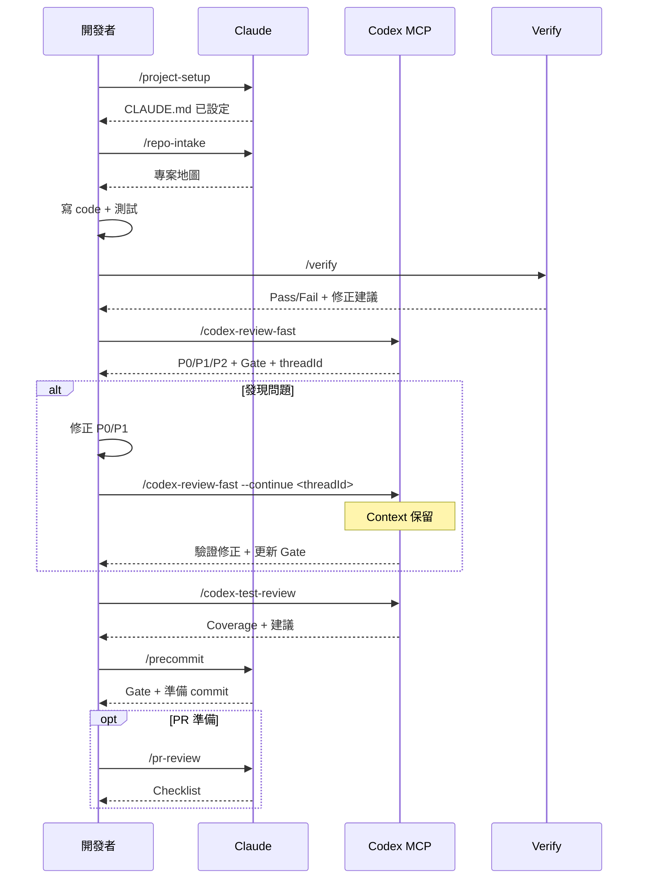

# sd0x-dev-flow

**語言**: [English](README.md) | 繁體中文 | [简体中文](README.zh-CN.md) | [日本語](README.ja.md) | [한국어](README.ko.md) | [Español](README.es.md)

[Claude Code](https://claude.com/claude-code) 的開發 Workflow Plugin，可選整合 Codex MCP。

90+ 個工具，涵蓋 Code Review、測試、調查、安全稽核與 DevOps 自動化。

## 需求

- Claude Code 2.1+
- [Codex MCP](https://github.com/openai/codex) 已設定（用於 `/codex-*` 指令）

## 安裝

```bash
# 新增 marketplace
/plugin marketplace add sd0xdev/sd0x-dev-flow

# 安裝 plugin
/plugin install sd0x-dev-flow@sd0xdev-marketplace
```

## 快速開始

安裝完成後，執行 `/project-setup` 自動偵測專案環境並設定所有 placeholder：

```bash
/project-setup
```

這會偵測你的 framework、package manager、資料庫、entry point 和 script 指令，然後相應更新 `CLAUDE.md`。

## 包含內容

| 類別 | 數量 | 範例 |
|------|------|------|
| Commands | 36 | `/project-setup`, `/codex-review-fast`, `/verify`, `/bug-fix` |
| Skills | 23 | project-setup, code-explore, code-investigate, codex-brainstorm |
| Agents | 14 | strict-reviewer, verify-app, coverage-analyst |
| Hooks | 5 | auto-format, review state tracking, stop guard |
| Rules | 9 | auto-loop, security, testing, git-workflow |
| Scripts | 3 | precommit runner, verify runner, dep audit |

## Workflow



## 指令參考

### 開發

| 指令 | 說明 |
|------|------|
| `/project-setup` | 自動偵測並設定專案 |
| `/repo-intake` | 一次性專案盤點掃描 |
| `/bug-fix` | Bug/Issue 修正 workflow |
| `/codex-implement` | Codex 寫 code |
| `/codex-architect` | 架構建議（第三大腦） |
| `/code-explore` | 快速 codebase 探索 |
| `/git-investigate` | 追蹤 code 歷史 |
| `/issue-analyze` | 深度 Issue 分析 |
| `/post-dev-test` | 開發後測試補全 |

### Review（Codex MCP）

| 指令 | 說明 | Loop 支援 |
|------|------|-----------|
| `/codex-review-fast` | 快速 review（僅 diff） | `--continue <threadId>` |
| `/codex-review` | 完整 review（lint + build） | `--continue <threadId>` |
| `/codex-review-branch` | 完整 branch review | - |
| `/codex-cli-review` | CLI review（完整磁碟讀取） | - |
| `/codex-review-doc` | 文件 review | `--continue <threadId>` |
| `/codex-security` | OWASP Top 10 audit | `--continue <threadId>` |
| `/codex-test-gen` | 產生 unit test | - |
| `/codex-test-review` | Review test coverage | `--continue <threadId>` |
| `/codex-explain` | 解釋複雜 code | - |

### 驗證

| 指令 | 說明 |
|------|------|
| `/verify` | lint -> typecheck -> unit -> integration -> e2e |
| `/precommit` | lint:fix -> build -> test:unit |
| `/precommit-fast` | lint:fix -> test:unit |
| `/dep-audit` | npm dependency 安全稽核 |

### 規劃

| 指令 | 說明 |
|------|------|
| `/codex-brainstorm` | 對抗式 brainstorming（Nash 均衡） |
| `/feasibility-study` | 可行性分析 |
| `/tech-spec` | 產生 tech spec |
| `/review-spec` | Review tech spec |
| `/deep-analyze` | 深度分析 + roadmap |
| `/project-brief` | PM/CTO 執行摘要 |

### 文件與工具

| 指令 | 說明 |
|------|------|
| `/update-docs` | 同步文件與 code |
| `/check-coverage` | Test coverage 分析 |
| `/create-request` | 建立/更新需求文件 |
| `/doc-refactor` | 簡化文件 |
| `/simplify` | Code 簡化 |
| `/de-ai-flavor` | 移除 AI 痕跡 |
| `/create-skill` | 建立新 skill |
| `/pr-review` | PR self-review |
| `/zh-tw` | 以繁體中文改寫 |

## Rules

| Rule | 說明 |
|------|------|
| `auto-loop` | 修正 -> 重新 review -> 修正 -> ... -> Pass（自動循環） |
| `fix-all-issues` | 零容忍：修正所有發現的問題 |
| `framework` | Framework 專屬慣例（可自訂） |
| `testing` | Unit/Integration/E2E 隔離 |
| `security` | OWASP Top 10 checklist |
| `git-workflow` | Branch 命名、commit 慣例 |
| `docs-writing` | 表格 > 段落，Mermaid > 文字 |
| `docs-numbering` | 文件前綴慣例（0-feasibility, 2-spec） |
| `logging` | 結構化 JSON，禁止 secrets |

## Hooks

| Hook | 觸發時機 | 用途 |
|------|----------|------|
| `post-edit-format` | Edit/Write 之後 | 自動 prettier（僅限專案已安裝 prettier） |
| `post-tool-review-state` | Edit/Bash 之後 | 追蹤 review 狀態 |
| `pre-edit-guard` | Edit/Write 之前 | 防止編輯 .env/.git |
| `stop-guard` | 停止之前 | 未完成 review 時警告（預設：warn） |
| `stop-check` | 停止之前 | 智慧 task 完成度檢查 |

### Hook 設定

Hook 預設是安全的。使用環境變數自訂行為：

| 變數 | 預設值 | 說明 |
|------|--------|------|
| `STOP_GUARD_MODE` | `warn` | 設為 `strict` 可在缺少 review 步驟時阻止停止 |
| `HOOK_NO_FORMAT` | （未設定） | 設為 `1` 停用自動 format |
| `HOOK_BYPASS` | （未設定） | 設為 `1` 跳過所有 stop-guard 檢查 |
| `HOOK_DEBUG` | （未設定） | 設為 `1` 輸出 debug 資訊 |
| `GUARD_EXTRA_PATTERNS` | （未設定） | 額外保護路徑的 regex（例如 `src/locales/.*\.json$`） |

**Dependencies**：Hook 需要 `jq`。自動 format 需要專案已安裝 `prettier`。缺少 dependency 時會自動略過。

## 自訂設定

執行 `/project-setup` 自動偵測並設定所有 placeholder，或手動編輯 `CLAUDE.md`：

| Placeholder | 說明 | 範例 |
|-------------|------|------|
| `{PROJECT_NAME}` | 你的專案名稱 | my-app |
| `{FRAMEWORK}` | 你的 framework | MidwayJS 3.x, NestJS, Express |
| `{CONFIG_FILE}` | 主設定檔 | src/configuration.ts |
| `{BOOTSTRAP_FILE}` | Bootstrap entry | bootstrap.js, main.ts |
| `{DATABASE}` | 資料庫 | MongoDB, PostgreSQL |
| `{TEST_COMMAND}` | 測試指令 | yarn test:unit |
| `{LINT_FIX_COMMAND}` | Lint 自動修正 | yarn lint:fix |
| `{BUILD_COMMAND}` | Build 指令 | yarn build |
| `{TYPECHECK_COMMAND}` | Type check | yarn typecheck |

## 架構

```
Command（入口）-> Skill（能力）-> Agent（環境）
```

- **Commands**：使用者透過 `/...` 觸發
- **Skills**：按需載入的知識庫
- **Agents**：擁有特定工具的隔離 sub-agent
- **Hooks**：自動化 guardrails（format、review 狀態、stop guard）
- **Rules**：始終啟用的慣例（自動載入）

## 貢獻

歡迎 PR。請：

1. 遵循現有命名慣例（kebab-case）
2. 在 skill 中包含 `When to Use` / `When NOT to Use`
3. 對危險操作加上 `disable-model-invocation: true`
4. 提交前用 Claude Code 測試

## License

MIT
