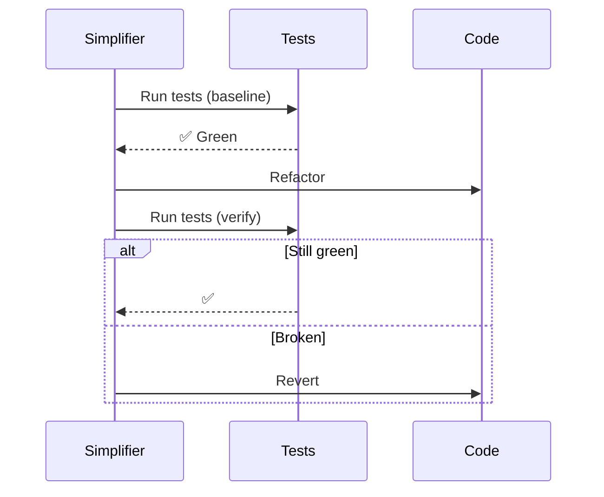

# Code Simplifier

## Workflow

## Checklist

1. [ ] Dead code removal
2. [ ] Extract duplicates (3+ repeats)
3. [ ] Simplify nesting (> 3 levels → early return)
4. [ ] Fix naming inconsistencies

## Constraints

- Do not change business logic
- Do not add new features
- Only fix one type of issue at a time
