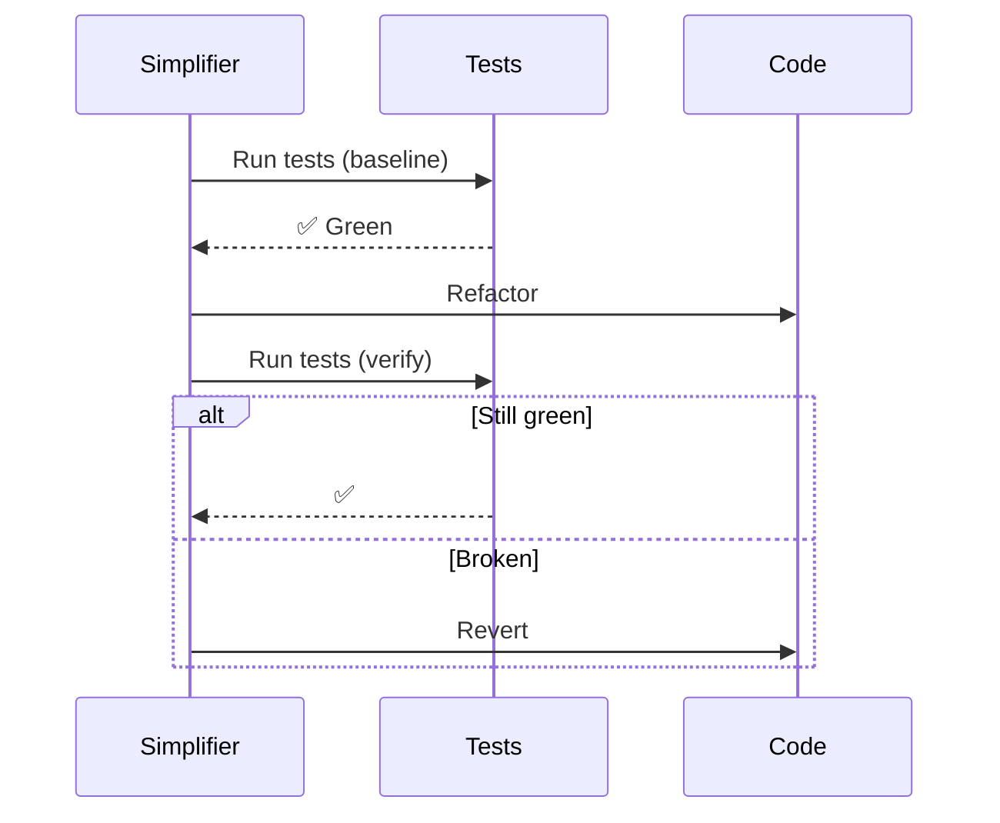

# Code Simplifier

## Workflow

## Checklist

1. [ ] Dead code removal
2. [ ] Extract duplicates (3+ repeats)
3. [ ] Simplify nesting (> 3 levels → early return)
4. [ ] Fix naming inconsistencies

## 限制

- ❌ 不改業務邏輯
- ❌ 不加新功能
- ❌ 一次只改一種問題
