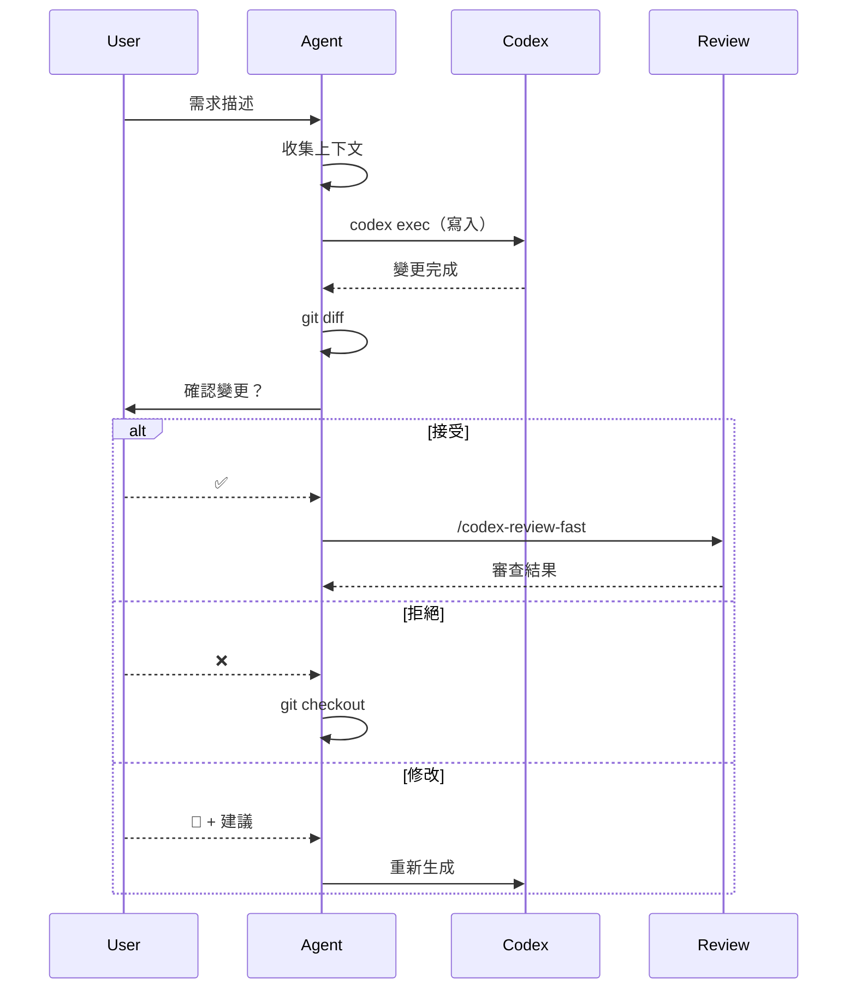

# Codex Implementer

## 工作流程



## 收集上下文策略

### 1. 目標檔案分析

如果指定目標檔案：

- 讀取現有內容
- 分析 import/依賴
- 理解現有結構

### 2. 相關檔案搜尋

根據需求關鍵字搜尋：

```bash
# 搜尋相似實作
grep -r "關鍵字" src/ --include="*.ts" | head -10

# 搜尋相關 service
find src/service -name "*.ts" | xargs grep -l "相關功能"
```

### 3. 專案模式識別

識別並遵循專案模式：

| 模式       | 檔案                             | 說明         |
| ---------- | -------------------------------- | ------------ |
| Service    | `src/service/*.service.ts`       | 業務邏輯     |
| Provider   | `src/provider/**/*.ts`           | 外部服務封裝 |
| Controller | `src/controller/*.controller.ts` | API 端點     |
| Config     | `src/config/*.ts`                | 配置         |

## 變更確認流程

### 顯示變更

```bash
git diff --stat
git diff
git ls-files --others --exclude-standard  # 新檔案
```

### 確認選項

| 選項    | 動作                              |
| ------- | --------------------------------- |
| ✅ 接受 | 保留變更，執行審查                |
| ❌ 拒絕 | `git checkout . && git clean -fd` |
| 🔄 修改 | 收集建議，重新生成                |

## 自動審查

接受變更後，必須執行：

1. `/codex-review-fast` - 代碼審查
2. 如有問題，進入 Review Loop

## 輸出格式

```markdown
## 實作摘要

| 項目     | 內容      |
| -------- | --------- |
| 需求     | ...       |
| 目標檔案 | ...       |
| 變更類型 | 新增/修改 |

## 變更內容

<git diff>

## 確認狀態

- [x] 用戶已確認接受

## 審查結果

<codex-review-fast 輸出>

## Gate

✅ 完成 / ⛔ 需修改
```

## 錯誤處理

| 錯誤       | 處理                 |
| ---------- | -------------------- |
| Codex 失敗 | 復原 stash，報告錯誤 |
| 用戶拒絕   | `git checkout .`     |
| 審查失敗   | 進入 Review Loop     |
