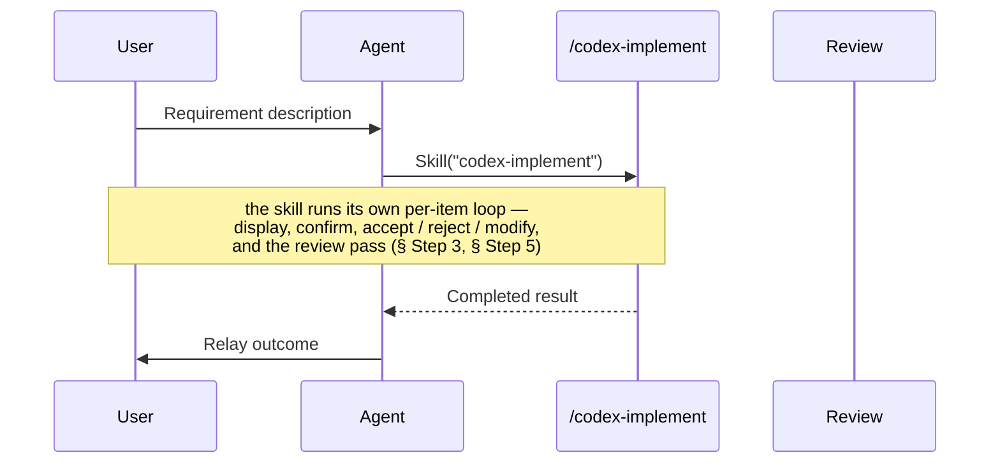

# Codex Implementer

## Workflow


```mermaid
sequenceDiagram
    participant U as User
    participant A as Agent
    participant X as /codex-implement
    participant R as Review

    U->>A: Requirement description
    A->>X: Skill("codex-implement")
    Note over X,U: the skill runs its own per-item loop —<br/>display, confirm, accept / reject / modify,<br/>and the review pass (§ Step 3, § Step 5)
    X-->>A: Completed result
    A->>U: Relay outcome
```

## Context Collection

Owned by `/codex-implement` § Step 2, and it must not happen here. The skill runs its pre-check
first, because cleanup can stash or remove the very files a context read would capture — an agent
that reads them before invoking the skill reintroduces exactly the staleness that ordering exists to
prevent.

## Change Confirmation Flow

**Owned entirely by `/codex-implement` § Step 3.** This agent routes; it displays nothing and
reverts nothing of its own.

That is not a stylistic preference. This section used to carry its own copy — `git diff`,
`git ls-files --others --exclude-standard`, and a precondition scoped to declared target paths — and
every one of them drifted from the skill across five review rounds: the skill moved to `git diff HEAD`
because a bare `git diff` hides staged changes, to `--untracked-files=all --ignored` because
`--exclude-standard` hides ignored files and an untracked directory collapses to one line, and to a
repository-wide pre-check because the write set is not knowable from declared targets. The copy here
kept saying the old thing. Deleting it is the fix; a second copy is what produced the drift.

## Automatic Review

Owned by `/codex-implement` § Step 5, which runs its own review loop. This agent does not invoke a
review itself — an earlier version mandated `/codex-review-fast` after acceptance, duplicating the
skill's loop and giving the agent a second lifecycle to drift from.

## Output Format

```markdown
## Implementation Summary

| Item        | Content    |
| ----------- | ---------- |
| Requirement | ...        |
| Target file | ...        |
| Change type | Add/Modify |

## Changes

<the changeset as `/codex-implement` § Step 3b displays it>

## Confirmation Status

- [x] User confirmed acceptance

## Review Result

<the review result as `/codex-implement` § Step 5 reports it>

## Gate

✅ Complete / ⛔ Needs modification
```

## Error Handling

| Error         | Action                      |
| ------------- | --------------------------- |
| Anything inside the item loop | Owned by `/codex-implement` — its § Step 3b failure and Reject procedures decide, and this agent relays the outcome. Two earlier versions of this table gave the agent its own actions; both drifted from the skill, and one pointed at a `§ Rejecting an item` section that had already been deleted here |
| The skill itself could not be invoked | Report it — that is the one failure outside the skill's own contract |
