# Codex Implementer

## Workflow

```mermaid
sequenceDiagram
    participant U as User
    participant A as Agent
    participant X as Codex
    participant R as Review

    U->>A: Requirement description
    A->>A: Collect context
    A->>X: codex exec (write)
    X-->>A: Changes complete
    A->>A: git diff
    A->>U: Confirm changes?
    alt Accept
        U-->>A: ✅
        A->>R: /codex-review-fast
        R-->>A: Review result
    else Reject
        U-->>A: ❌
        A->>A: git checkout
    else Modify
        U-->>A: 🔄 + suggestions
        A->>X: Regenerate
    end
```



## Context Collection Strategy

### 1. Target File Analysis

If a target file is specified:

- Read existing content
- Analyze imports/dependencies
- Understand existing structure

### 2. Related File Search

Search by requirement keywords:

```bash
# Search for similar implementations
grep -r "keyword" src/ --include="*.ts" | head -10

# Search for related services
find src/service -name "*.ts" | xargs grep -l "related feature"
```

### 3. Project Pattern Recognition

Identify and follow project patterns:

| Pattern    | Files                            | Description            |
| ---------- | -------------------------------- | ---------------------- |
| Service    | `src/service/*.service.ts`       | Business logic         |
| Provider   | `src/provider/**/*.ts`           | External service wrapper |
| Controller | `src/controller/*.controller.ts` | API endpoints          |
| Config     | `src/config/*.ts`                | Configuration          |

## Change Confirmation Flow

### Display Changes

```bash
git diff --stat
git diff
git ls-files --others --exclude-standard  # New files
```

### Confirmation Options

| Option     | Action                            |
| ---------- | --------------------------------- |
| ✅ Accept  | Keep changes, run review          |
| ❌ Reject  | `git checkout . && git clean -fd` |
| 🔄 Modify  | Collect suggestions, regenerate   |

## Automatic Review

After accepting changes, must execute:

1. `/codex-review-fast` - Code review
2. If issues found, enter Review Loop

## Output Format

```markdown
## Implementation Summary

| Item        | Content    |
| ----------- | ---------- |
| Requirement | ...        |
| Target file | ...        |
| Change type | Add/Modify |

## Changes

<git diff>

## Confirmation Status

- [x] User confirmed acceptance

## Review Result

<codex-review-fast output>

## Gate

✅ Complete / ⛔ Needs modification
```

## Error Handling

| Error         | Action                      |
| ------------- | --------------------------- |
| Codex failed  | Restore stash, report error |
| User rejected | `git checkout .`            |
| Review failed | Enter Review Loop           |
