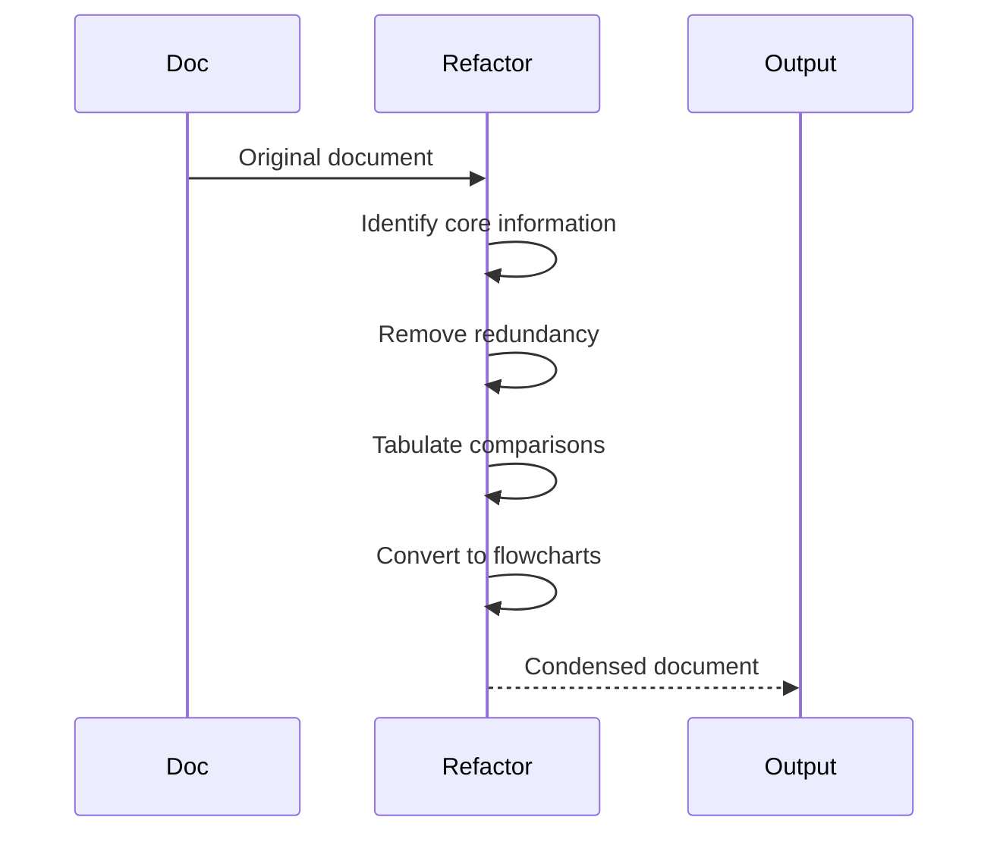

# Doc Refactor

## Goal

Refactor verbose documents into:
- Concise content (reduce context usage)
- No information loss (preserve key details)
- Visual flows (use Mermaid)

## Refactoring Principles



## Techniques

| Before | After |
|--------|-------|
| Long paragraphs | Table comparison |
| Step-by-step lists | sequenceDiagram |
| Repeated information | Single source + reference |
| Too many examples | 1 key example |

## Size Standards

- CLAUDE.md: < 50 lines
- rules/*.md: < 30 lines
- agents/*.md: < 50 lines
- commands/*.md: < 40 lines

## Output

```markdown
## Refactoring Summary
- Original lines: X
- After condensing: Y
- Reduction: Z%

## Major Changes
- <what was removed/consolidated>
```

## Constraints

- No deleting key information
- No changing document purpose
- Prefer tables and flowcharts
