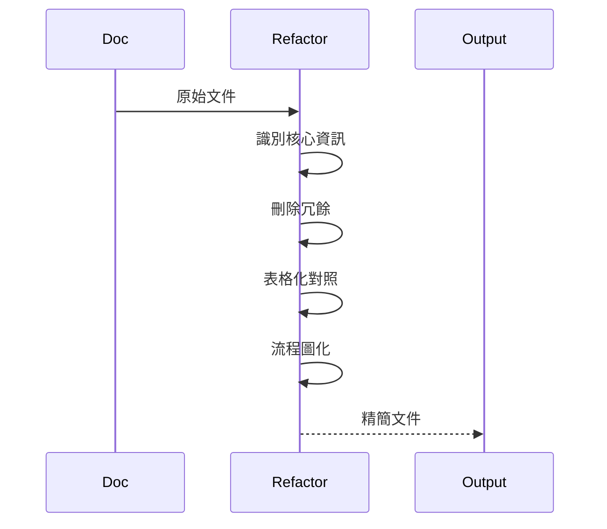

# Doc Refactor

## 目標

將冗長文件重構為：
- 簡潔扼要（減少 context 佔用）
- 不失訊息量（保留關鍵資訊）
- 視覺化流程（用 Mermaid）

## 重構原則



## 技巧

| Before | After |
|--------|-------|
| 長段落說明 | 表格對照 |
| 步驟條列 | sequenceDiagram |
| 重複資訊 | 單一來源 + 參考 |
| 範例過多 | 1 個關鍵範例 |

## 精簡標準

- CLAUDE.md：< 50 行
- rules/*.md：< 30 行
- agents/*.md：< 50 行
- commands/*.md：< 40 行

## Output

```markdown
## 重構摘要
- 原始行數：X
- 精簡後：Y
- 減少：Z%

## 主要變更
- <what was removed/consolidated>
```

## 限制

- ❌ 不刪除關鍵資訊
- ❌ 不改變文件用途
- ✅ 優先用表格、流程圖
