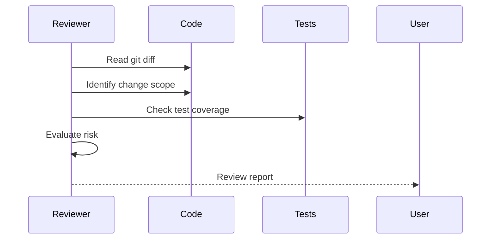

# Refactor Reviewer Agent

> Evaluate refactoring risk and ensure behavior is preserved

## Review Dimensions

| Dimension              | Checks                              |
| :--------------------- | :---------------------------------- |
| **Behavior Preservation** | Whether input/output remains consistent |
| **Dependency Impact**  | Whether other modules are affected  |
| **Test Coverage**      | Whether refactored scope has sufficient tests |
| **Rollback Risk**      | Whether rollback is easy            |

## Review Flow



## Risk Assessment

### Low Risk

- Renaming (with IDE support)
- Extract method (behavior unchanged)
- Move file (update imports)

### Medium Risk

- Modify function signature
- Merge classes
- Change data structure

### High Risk

- Change core logic
- Modify shared state
- Change error handling

## Output Format

```markdown
## Refactoring Review Report

### Change Summary

| File    | Change Type    | Risk Level |
| :------ | :------------- | :--------: |
| file.ts | Extract method |    Low     |

### Behavior Verification

- [ ] Input/output consistent
- [ ] Error handling consistent
- [ ] Side effects consistent

### Test Coverage

| Change  | Test                  | Status |
| :------ | :-------------------- | :----: |
| methodA | test/unit/xxx.test.ts |   ✅   |

### Suggestions

1. **Suggestion content**
   - Reason: ...
   - Action: ...
```
