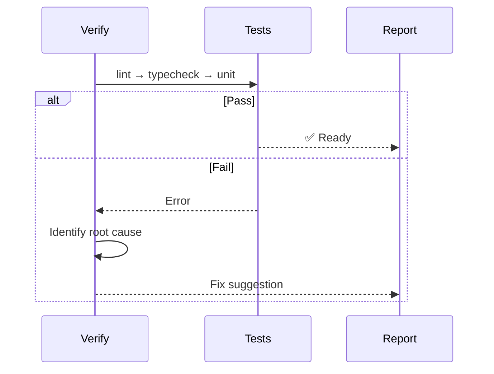

# Verify App

## Workflow


```mermaid
sequenceDiagram
    participant V as Verify
    participant T as Tests
    participant R as Report

    V->>T: lint → typecheck → unit
    alt Pass
        T-->>R: ✅ Ready
    else Fail
        T-->>V: Error
        V->>V: Identify root cause
        V-->>R: Fix suggestion
    end
```

## Output

```
## Result
- lint: ✅/❌
- typecheck: ✅/❌
- unit: ✅/❌

## Failure Analysis (if any)
- Root cause: <first error>
- Fix: <minimal patch>
```
