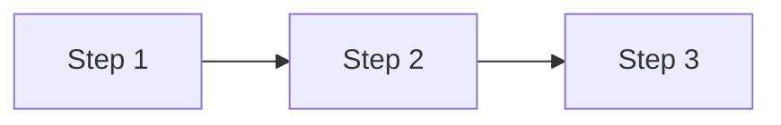

## Context

- Project root: !`git rev-parse --show-toplevel`
- Recent changes: !`git diff --name-only HEAD~5 2>/dev/null | grep -E '^src/' | head -10`

## Task

You are now a `solution-architect` expert. Perform a deep analysis of the following initial proposal:

### Input

```
$ARGUMENTS
```

### Analysis Flow

#### Phase 1: Understand & Validate

1. Extract the core objectives of the initial proposal
2. Identify key assumptions (which may be wrong)
3. List technical points that need verification

#### Phase 2: Code Deep Dive

Research the existing codebase thoroughly:

```bash
# Find related implementations
grep -r "keyword" src/ --include="*.ts" -l | head -10

# Check similar features
ls src/service/ src/provider/

# Analyze specific implementation
cat src/service/similar.service.ts | head -100
```

**Must verify**:

- Naming conventions (camelCase/snake_case? prefixes?)
- DI injection patterns (@Inject/@InjectModel?)
- Error handling patterns (throw/return?)
- Implementation patterns of similar features

#### Phase 3: Roadmap Output

Based on the research, produce:

1. Implementation steps (immediately actionable)
2. Key pseudocode (**only core 1-3 lines, omit if not necessary**)
3. Alternative comparison

## Output

````markdown
# [Proposal Name] Implementation Roadmap

## Proposal Validation

| Assumption | Verification Result | Impact |
| ---------- | ------------------- | ------ |

## Code Research Summary

| Module | Existing Implementation | Reusable |
| ------ | ----------------------- | -------- |

## Implementation Roadmap


````

### Step 1: [Title]

**Objective**: One sentence
**Files**: `src/xxx.ts` (modify/create)

**Pseudocode** (only when necessary, 1-3 lines):

```typescript
// Reference: src/xxx.ts:50
await this.cache.set(key, data, TTL);
```

### Step 2: ...

## Alternatives

### Option B: [Name]

| Dimension  | Option A (Recommended) | Option B |
| ---------- | ---------------------- | -------- |
| Complexity |                        |          |
| Risk       |                        |          |

**Recommendation**: ...

## Risks & Mitigations

| Risk | Probability | Mitigation |
| ---- | ----------- | ---------- |

## Immediate Actions

1. [ ] First task
2. [ ] Second task

````

## Examples

```bash
# Analyze from description
/deep-analyze "Initial idea: use Redis to cache token prices with TTL 5 minutes"

# Analyze from file
/deep-analyze docs/features/xxx/tech-spec.md

# Analyze from request doc
/deep-analyze docs/features/xxx/requests/2026-01-20-xxx.md
````
