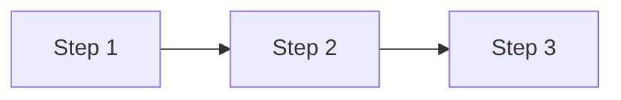

## Context

- Project root: !`git rev-parse --show-toplevel`
- Recent changes: !`git diff --name-only HEAD~5 2>/dev/null | grep -E '^src/' | head -10`

## Task

你現在是 `solution-architect` 專家。請深入分析以下初步方案：

### 輸入

```
$ARGUMENTS
```

### 分析流程

#### Phase 1: 理解與驗證

1. 提取初步方案的核心目標
2. 識別關鍵假設（可能是錯的）
3. 列出需要驗證的技術點

#### Phase 2: 代碼深潛

深入調研現有代碼：

```bash
# 找相關實現
grep -r "關鍵字" src/ --include="*.ts" -l | head -10

# 查看類似功能
ls src/service/ src/provider/

# 分析具體實現
cat src/service/similar.service.ts | head -100
```

**必須確認**：

- 命名慣例（駝峰/底線？前綴？）
- DI 注入模式（@Inject/@InjectModel？）
- 錯誤處理模式（throw/return？）
- 類似功能的實現方式

#### Phase 3: 路線圖產出

根據調研，產出：

1. 實施步驟（可立即執行）
2. 關鍵偽代碼（**僅核心 1-3 行，非必要不放**）
3. 替代方案對比

## Output

````markdown
# [方案名稱] 實施路線圖

## 方案驗證

| 假設 | 驗證結果 | 影響 |
| ---- | -------- | ---- |

## 代碼調研摘要

| 模組 | 現有實現 | 可複用 |
| ---- | -------- | ------ |

## 實施路線圖


````

### Step 1: [標題]

**目標**：一句話
**檔案**：`src/xxx.ts` (修改/新增)

**偽代碼**（僅必要時，1-3 行）：

```typescript
// 參考: src/xxx.ts:50
await this.cache.set(key, data, TTL);
```

### Step 2: ...

## 替代方案

### 方案 B: [名稱]

| 維度   | 方案 A（建議） | 方案 B |
| ------ | -------------- | ------ |
| 複雜度 |                |        |
| 風險   |                |        |

**建議**：...

## 風險與緩解

| 風險 | 機率 | 緩解 |
| ---- | ---- | ---- |

## 立即行動

1. [ ] 第一個任務
2. [ ] 第二個任務

````

## Examples

```bash
# 從描述分析
/deep-analyze "初步想法：用 Redis 快取 token 價格，TTL 5 分鐘"

# 從檔案分析
/deep-analyze docs/features/xxx/tech-spec.md

# 從需求單分析
/deep-analyze docs/features/xxx/requests/2026-01-20-xxx.md
````
