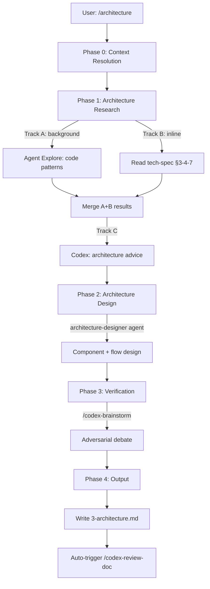

# Architecture Skill Technical Spec

## 1. Requirement Summary

### Problem

`docs-numbering.md` 定義了 Phase 3 (`3-architecture.md`) 作為標準架構文件，指定 `/deep-analyze` 為生成工具。但 `/deep-analyze` 實際產出是 Implementation Roadmap（實作路線圖），而非標準化架構設計文件。多個 tech-spec 存在（截至 2026-03-25），0 個 `3-architecture.md` 存在。

### Goals

| Goal | Metric |
|------|--------|
| G1 | 產出標準化 `3-architecture.md` 架構文件 |
| G2 | 與 `2-tech-spec.md` 互補（tech-spec = what to build, architecture = how it fits） |
| G3 | 利用現有 skill 生態系統（code-explore, codex-architect, codex-brainstorm） |
| G4 | 支援 create + update 模式（context-aware upsert） |

### Scope

| In Scope | Out of Scope |
|----------|-------------|
| 新 `/architecture` skill（SKILL.md + references） | 修改 `/deep-analyze`（保留為 roadmap 工具） |
| Output template for `3-architecture.md` | C4 model / arc42 formal frameworks |
| Feature context resolution（複用 tech-spec 的） | Diagram rendering / export to image |
| Codex 獨立架構驗證 | Auto-generation from code（無 spec 時） |
| `/codex-brainstorm` 架構決策辯論 | Cross-project architecture comparison |

## 2. Existing Code Analysis

### Related Modules

| File | Role | Changes Needed |
|------|------|---------------|
| `skills/codex-architect/SKILL.md` | Architecture consulting (3 modes) | No change (reuse as sub-step) |
| `commands/deep-analyze.md` | Roadmap generation | No change (separate responsibility) |
| `skills/tech-spec/SKILL.md` | Tech spec creation | No change (complementary) |
| `skills/create-request/references/feature-context-resolution.md` | 5-level feature detection | Reuse directly — *successor reference; the procedure recorded below predates doc-review-phasing r2 and still calls `resolve-feature-cli.js` directly, which that reference now says not to do* |
| `rules/docs-numbering.md` | Phase numbering | Update Phase 3 command reference |
| `agents/architecture-designer.md` | Agent definition | **New** — architecture-focused (derived from solution-architect) |

### Reusable Components

| Component | Source | Reuse Type |
|-----------|--------|-----------|
| Feature context resolution | `scripts/lib/feature-resolver.js` | Direct (detect target feature) |
| Architecture designer agent | `agents/architecture-designer.md` | New (derived from solution-architect, architecture-focused output) |
| Codex independent research | `rules/codex-invocation.md` | Pattern (research template) |
| `/codex-brainstorm` debate | `skills/codex-brainstorm/SKILL.md` | Composition (via Skill tool) |
| `/code-explore` analysis | `skills/code-explore/SKILL.md` | Composition (via Skill/Agent) |
| Mermaid diagram conventions | `rules/docs-writing.md` | Convention (follow existing) |

## 3. Technical Solution

### 3.1 Architecture



### 3.2 Skill Definition

```yaml
---
name: architecture
description: "Architecture design and documentation. Produces 3-architecture.md
  with component diagrams, data flow, integration points, and architecture decisions.
  Reads existing tech-spec as input. Use when: designing system architecture,
  documenting component interactions, creating architecture docs, producing
  3-architecture.md, or any request for architecture documentation.
  Not for: tech spec writing (use tech-spec), code implementation (use feature-dev),
  architecture consulting only (use codex-architect)."
allowed-tools: Read, Grep, Glob, Bash(git:*), Bash(node:*), Bash(bash:*), Write,
  Agent, Skill, mcp__codex__codex, mcp__codex__codex-reply
---
```

### 3.3 Workflow Phases

#### Phase 0: Context Resolution

```bash
# Detect feature via 5-level cascade (reuse from tech-spec)
node scripts/resolve-feature-cli.js
```

| State | Action |
|-------|--------|
| `3-architecture.md` exists | Update mode (incremental) |
| `3-architecture.md` absent + `2-tech-spec.md` exists | Create mode (tech-spec-informed) |
| `3-architecture.md` absent + no tech-spec | Create mode (code-only research) |
| Feature not resolved | Gate: Need Human |

#### Phase 1: Architecture Research (parallel)

Launch research tracks in parallel:

| Track | Tool | Input | Output | Parallel | Fallback |
|-------|------|-------|--------|----------|----------|
| A: Code patterns | `Agent(Explore)` | Feature key + codebase | Component list + dependency graph + integration points | Yes (background) | `Agent(general-purpose)` if Explore unavailable |
| B: Tech-spec context | `Read` (inline) | `2-tech-spec.md` §3-4-7 | Architecture constraints, data model, risks | Yes (inline) | Skip if no tech-spec (code-only mode) |
| C: Codex design advice | `mcp__codex__codex` | Feature context + Track A/B results | Independent architecture recommendations | After A+B | Proceed without (degraded) |

**Track A: Code pattern analysis**

```
Agent({
  description: "Analyze existing architecture patterns",
  subagent_type: "Explore",
  run_in_background: true,
  prompt: "Analyze the codebase architecture for feature <key>:
    1. Trace execution paths of related modules
    2. Map component dependencies (imports, calls)
    3. Identify integration points with other features
    4. Read docs/architecture.md for global context
    Output: component list + dependency graph + integration points"
})
```

**Track B: Tech-spec extraction** (if tech-spec exists, inline)
- Read `2-tech-spec.md` Section 3 (Technical Solution)
- Extract: architecture diagram, data model, API design, core logic
- Identify: constraints, risks, open questions from Sections 4 + 7

**Track C: Codex architecture advice** (after A+B complete)
- Use `mcp__codex__codex` with Codex independent research mandate
- Provide feature context metadata (not conclusions) per `codex-invocation.md`
- Codex independently researches and provides architecture recommendations

#### Phase 2: Architecture Design

Dispatch `architecture-designer` agent with architecture-specific template:

```
Agent({
  description: "Design architecture for <feature>",
  subagent_type: "architecture-designer",
  prompt: `Design the architecture for <feature>.

  ## Input Context
  ${TECH_SPEC_SUMMARY}  // from Phase 1 Track B
  ${CODE_ANALYSIS}       // from Phase 1 Track A

  ## Required Output
  1. Component diagram (Mermaid flowchart)
  2. Component responsibility table
  3. Data flow (Mermaid sequence diagram)
  4. Integration points with existing systems
  5. Architecture decisions (context → options → decision → rationale)
  6. Deployment considerations (if applicable)

  ## Constraints
  - Follow docs-writing.md conventions (Mermaid, tables, no long prose)
  - Reference actual code (file:line, not invented)
  - Mark assumptions explicitly
  - Redact any credentials/secrets when citing file:line evidence (per rules/security.md)
  `
})
```

#### Phase 3: Verification

Invoke `/codex-brainstorm` via Skill tool:

```
Topic: "Evaluate the proposed architecture for <feature>"
Constraints:
- Component diagram from Phase 2
- Tech-spec constraints from Phase 1
- Known risks

Focus: scalability, maintainability, integration complexity, testability
```

Must produce threadId + equilibrium conclusion.

#### Phase 4: Output

Write `docs/features/<key>/3-architecture.md` using output template.

Auto-trigger: `/codex-review-doc` (per auto-loop rule).

### 3.4 Output Template

```markdown
# <Feature> Architecture Design

> **Source**: [Tech Spec](./2-tech-spec.md) | **Generated**: <date>

## 1. Architecture Overview

{Mermaid component diagram}

## 2. Component Responsibilities

| Component | Responsibility | Key Files |
|-----------|---------------|-----------|

## 3. Data Flow

{Mermaid sequence diagram — primary flow}

## 4. Integration Points

| Integration | Direction | Protocol | Notes |
|------------|-----------|----------|-------|

## 5. Architecture Decisions

### AD-1: <decision title>

- **Context**: <why this decision was needed>
- **Options**: <what was considered>
- **Decision**: <what was chosen>
- **Rationale**: <why, citing tech-spec constraints or debate conclusion>

## 6. Deployment & Configuration

{Optional — only if applicable}

## 7. Verification

- **Debate threadId**: <from Phase 3>
- **Debate conclusion**: <equilibrium summary>
- **Key consensus**: <what both perspectives agreed on>
- **Open divergences**: <unresolved disagreements>

## 8. Cross-References

- Tech Spec: [2-tech-spec.md](./2-tech-spec.md)
- Request: [requests/YYYY-MM-DD-*.md](./requests/)
```

## 4. Risks and Dependencies

| Risk | Impact | Mitigation |
|------|--------|-----------|
| Tech-spec 不存在時架構品質降低 | 設計可能缺少 context | Phase 1 code-only 研究 fallback + warn user |
| `/codex-brainstorm` 辯論 timeout | Phase 3 不完整 | Graceful degradation: 記錄 timeout，仍輸出文件 |
| 架構過度設計（小功能不需要獨立文件） | 浪費時間 | Phase 0 加入 scope gate：小功能建議留在 tech-spec 3.1 |
| 與 `/deep-analyze` 職責混淆 | 用戶不確定用哪個 | 明確定義：architecture = 結構文件，deep-analyze = 實作路線圖 |

| Dependency | Type | Status |
|-----------|------|--------|
| `scripts/lib/feature-resolver.js` | Code | Exists |
| `agents/architecture-designer.md` | Agent | New (to be created, derived from solution-architect) |
| `/codex-brainstorm` skill | Composition | Exists |
| `/code-explore` skill | Composition | Exists |

## 5. Work Breakdown

| Task | Est. | Depends On | Files |
|------|------|-----------|-------|
| A: SKILL.md 主體 | 1d | — | `skills/architecture/SKILL.md` |
| B: Output template | 0.5d | — | `skills/architecture/references/template.md` |
| C: Codex prompt template | 0.5d | — | `skills/architecture/references/codex-prompt.md` |
| D: Architecture designer agent | 0.5d | — | `agents/architecture-designer.md` |
| E: Command mirror | 0.5d | A | `commands/architecture.md` |
| F: Update docs-numbering.md | 0.5d | A | `rules/docs-numbering.md` |
| G: Tests | 0.5d | A+B+D | `test/commands/architecture.test.js` |

**Total**: ~4 person-days

## 6. Testing Strategy

| Test | Type | File |
|------|------|------|
| SKILL.md structure | Unit | `test/commands/architecture.test.js` |
| Template has required sections | Unit | Same |
| Command mirror consistency | Unit | Same |
| docs-numbering Phase 3 updated | Unit | Same |
| Feature context resolution | Reuse | `test/scripts/feature-resolver.test.js` |

## 7. Open Questions

- [ ] 小功能是否應該跳過 Phase 3 辯論？（scope gate threshold）
- [ ] 是否需要 `--mode` flag（design/review/update）？
- [ ] `/deep-analyze` 是否應該更名或重定位？
