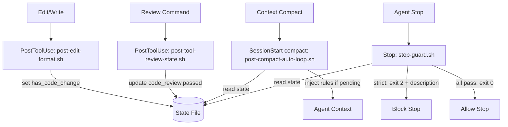

# Auto-Loop Strict Enforcement Technical Spec

> **Request**: [2026-03-20-auto-loop-strict-enforcement](./requests/2026-03-20-auto-loop-strict-enforcement.md)

## 1. Requirement Summary

- **Problem**: 1M context model 下 auto-loop compliance drift。模型問「要繼續嗎？」而非直接執行。`stop-guard.sh` 預設 `warn` 模式無法阻擋。Compact 後核心規則消失加劇 drift。
- **Goals**:
  1. Stop guard 預設改 strict — 模型嘗試停止時 hook 直接 block
  2. SessionStart (compact) re-injection — compact 後自動重新注入 auto-loop 核心規則
  3. Block message 可操作化 — 告訴模型「為什麼被 block」+「要做什麼」
- **Scope**:
  - v1: strict default + SessionStart compact hook + block message 強化
  - Out of scope: prompt-based Stop hook、pending_action state machine、deadlock counter（best-practices debate 已排除）

## 2. Existing Code Analysis

### Related Modules

| Module | Relationship | Reusable |
|--------|-------------|----------|
| `hooks/stop-guard.sh:46-66` | Guard mode resolution（env > settings.local > settings > default） | 核心修改點 |
| `hooks/stop-guard.sh:270-289` | Block/warn output logic | 修改 description 內容 |
| `hooks/post-tool-review-state.sh` | State file update（code_review, doc_review, precommit） | 供 SessionStart compact hook 讀取 |
| `hooks/hooks.json` | Hook event 註冊 | 新增 SessionStart compact entry |
| `hooks/post-edit-format.sh:203-225` | Edit 後設定 has_code/doc_change + invalidate state | 供 SessionStart compact hook 判斷 pending |
| `rules/auto-loop.md` § The Four Anchors | 四條不可協商的 anchor（2026-07-26 前名為 Prohibited Behaviors） | Re-injection 內容來源 |
| `commands/install-hooks.md` | Hook 安裝指令 | 更新以包含 SessionStart compact |

### Key Insight

核心 gap 不是規則不夠，而是 **enforcement 層級錯位**。Auto-loop 規則在 behavior-layer（prompt），1M context 下被稀釋。解法：將關鍵規則提升到 deterministic hook layer。

> "Hooks guarantee behavior; prompts suggest it." — [Dotzlaw](https://www.dotzlaw.com/insights/claude-hooks/)

## 3. Technical Solution

### 3.1 Architecture



### 3.2 P0: Strict Mode Default

**變更**: `.claude/settings.json` 新增 `env.STOP_GUARD_MODE`（`hooks_config` 不是 Claude Code settings schema 合法欄位，改用 `env`）。

```json
{
  "env": {
    "STOP_GUARD_MODE": "strict"
  }
}
```

**影響範圍**:
- `stop-guard.sh:46-60` 的 mode resolution 不需改 — env var 已是最高優先
- `/project-setup` 安裝後也寫入此設定（v1 scope）
- `/install-hooks` 安裝後也寫入此設定（v1 scope）

**行為變化**:

| 場景 | Before (warn) | After (strict) |
|------|---------------|----------------|
| Code 改了沒 review | log 警告，allow stop | **exit 2, block stop** |
| Review 沒 pass | log 警告，allow stop | **exit 2, block stop** |
| 全部通過 | allow stop | allow stop (unchanged) |

### 3.3 P1: SessionStart (compact) Re-injection Hook

**新增檔案**: `hooks/post-compact-auto-loop.sh`

**觸發**: `SessionStart` event with matcher `compact` — compaction 後觸發，stdout 注入 Claude context

**重要設計決策**: 官方文件明確指出只有 `SessionStart` 和 `UserPromptSubmit` 的 stdout 會注入 Claude 的 context。`PostCompact` 雖然是合法 event，但其 stdout 只在 verbose mode (Ctrl+O) 可見，不會被 Claude 看到。因此必須使用 `SessionStart` matcher `compact`。

**邏輯**:

```bash
#!/usr/bin/env bash
# SessionStart (compact) Hook: Re-inject auto-loop rules after context compaction
# stdout is injected into Claude's context (SessionStart stdout injection).

# === Plugin-defers-to-local arbitration (mandatory, same as all plugin hooks) ===
# [Same pattern as stop-guard.sh:13-37]

STATE_FILE=".claude_review_state.json"

# Read state to determine if there are pending steps
if [[ -f "$STATE_FILE" ]] && command -v jq &>/dev/null; then
  HAS_CODE=$(jq -r '.has_code_change // false' "$STATE_FILE")
  HAS_DOC=$(jq -r '.has_doc_change // false' "$STATE_FILE")
  CODE_PASSED=$(jq -r '.code_review.passed // false' "$STATE_FILE")
  DOC_PASSED=$(jq -r '.doc_review.passed // false' "$STATE_FILE")
  PRE_PASSED=$(jq -r '.precommit.passed // false' "$STATE_FILE")

  # Derive next required command
  NEXT=""
  if [[ "$HAS_CODE" == "true" && "$CODE_PASSED" != "true" ]]; then
    NEXT="/codex-review-fast"
  elif [[ "$HAS_CODE" == "true" && "$CODE_PASSED" == "true" && "$PRE_PASSED" != "true" ]]; then
    NEXT="/precommit-fast"
  elif [[ "$HAS_DOC" == "true" && "$DOC_PASSED" != "true" ]]; then
    NEXT="/codex-review-doc"
  fi

  # Only inject if there is a pending step
  if [[ -n "$NEXT" ]]; then
    cat <<EOF
[AUTO_LOOP_RESUME]
Context was compacted. Auto-loop state is still active.
Required next step: ${NEXT}
Core rules (re-injected):
1) Declaring != Executing: saying "need to run X" without invoking the tool is a violation
2) Summary != Completion: outputting a summary then stopping is a violation
3) Execute review in same reply after edit — do not stop, do not ask
Do not ask "should I continue" — execute ${NEXT} now.
EOF
  fi
fi

exit 0  # Always non-blocking
```

**hooks.json 註冊**（加入現有 SessionStart array）:

```json
"SessionStart": [
  {
    "matcher": "startup|compact",
    "hooks": [{"type": "command", "command": "${CLAUDE_PLUGIN_ROOT}/scripts/namespace-hint.sh"}]
  },
  {
    "matcher": "compact",
    "hooks": [{"type": "command", "command": "${CLAUDE_PLUGIN_ROOT}/hooks/post-compact-auto-loop.sh"}]
  }
]
```

### 3.4 P2: Stop Guard Block Message 強化

**變更位置**: `hooks/stop-guard.sh:271-274`

**Before**:

```bash
printf '{"ok":false,"reason":"Missing required steps","description":"Execute immediately:%s, do not ask user"}\n' "${MISSING}"
```

**After**:

```bash
printf '{"ok":false,"reason":"Missing required steps","description":"Execute immediately:%s. RULES: Declaring!=Executing (saying need-to-run is not running). Summary!=Completion (outputting a table then stopping is a violation). Execute in same reply, do not ask."}\n' "${MISSING}"
```

同樣修改 `BLOCKED_REASON` 路徑（line 282-284）。

## 4. Risks and Dependencies

| Risk | Probability | Mitigation |
|------|-------------|------------|
| Strict mode 導致 infinite block loop | Low | 已有 `HOOK_BYPASS=1` escape hatch + behavior-layer 3-round rule |
| SessionStart compact hook 輸出太多造成 context 污染 | Low | 僅在有 pending 步驟時注入（~5 行），且 exit 0 non-blocking |
| State file 不存在時 SessionStart compact 無效 | Medium | Graceful degradation：無 state file = 無輸出 = 無影響 |
| 新 clone 沒有 strict 設定 | Low | `.claude/settings.json` is tracked；`/project-setup` 也會設定 |
| Block message 過長被截斷 | Low | 控制在 200 字元內 |

## 5. Work Breakdown

| # | Task | Effort | Output |
|---|------|--------|--------|
| 1 | `.claude/settings.json` 加 `env.STOP_GUARD_MODE: "strict"` | S | 設定檔 |
| 2 | 新建 `hooks/post-compact-auto-loop.sh` | M | SessionStart compact hook |
| 3 | `hooks/hooks.json` 註冊 SessionStart compact entry | S | Hook 註冊 |
| 4 | `hooks/stop-guard.sh` block message 強化 | S | 改善 description |
| 5 | 更新 `commands/install-hooks.md` 包含 SessionStart compact | S | 安裝指令更新 |
| 6 | 更新 `skills/project-setup/SKILL.md` hook mapping 包含 SessionStart compact | S | Onboarding 路徑 |
| 7 | SessionStart compact hook 包含 plugin-defers-to-local arbitration | S | 一致性 |
| 8 | 新增 `test/hooks/post-compact-auto-loop.test.js` | M | 測試 |
| 9 | 更新既有 `test/hooks/stop-guard.test.js`（如存在） | S | 測試 |

## 6. Testing Strategy

| Type | Test | File |
|------|------|------|
| Unit | SessionStart compact hook: pending code review → 輸出包含 `/codex-review-fast` | `test/hooks/post-compact-auto-loop.test.js` |
| Unit | SessionStart compact hook: pending precommit → 輸出包含 `/precommit-fast`（canonical per auto-loop） | `test/hooks/post-compact-auto-loop.test.js` |
| Unit | SessionStart compact hook: pending doc review → 輸出包含 `/codex-review-doc` | `test/hooks/post-compact-auto-loop.test.js` |
| Unit | SessionStart compact hook: all passed → 無輸出 | `test/hooks/post-compact-auto-loop.test.js` |
| Unit | SessionStart compact hook: no state file → 無輸出 | `test/hooks/post-compact-auto-loop.test.js` |
| Schema | hooks.json 包含 SessionStart compact entry | `test/hooks/hooks-json-registry.test.js` |
| Content | settings.json 包含 strict mode | Inline assertion |

## 7. Open Questions

| # | Question | Impact | Recommendation |
|---|----------|--------|----------------|
| 1 | SessionStart compact re-injection 是否需要 i18n（中/英）？ | Low | v1 英文即可 — 模型能理解 |

**已決定（非 open）**:
- ~~Q: 是否需要 PreCompact hook 做 snapshot？~~ 不需要 — SessionStart compact 直接讀 state file 即可
- ~~Q: 為何不用 PostCompact？~~ PostCompact stdout 不注入 Claude context（只有 SessionStart 和 UserPromptSubmit 的 stdout 會注入）
- SessionStart compact hook 必須包含 plugin-defers-to-local arbitration（與所有 plugin hooks 一致）
- `/project-setup` v1 scope 內同步更新 hook mapping
