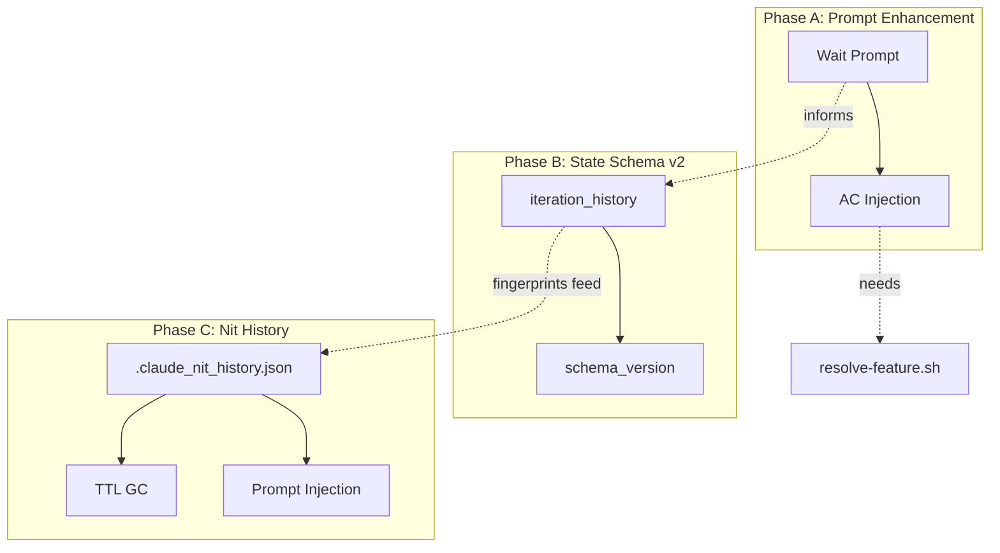
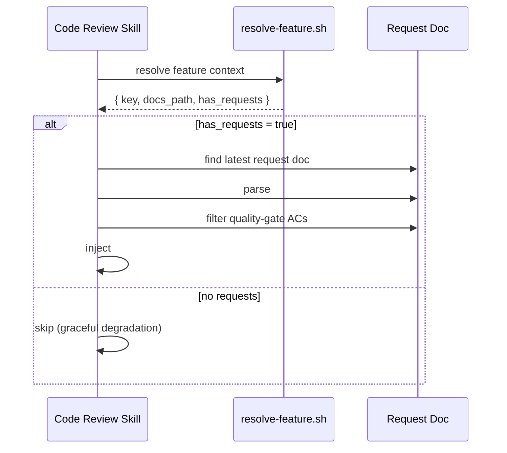

# Auto-Loop Evolution Technical Spec

## 1. Requirement Summary

### Problem

Auto-loop 系統存在 4 個核心缺口（Deep Research 2026-03-24 識別）：
1. 迭代計數器已實作（schema v2，`auto-loop.md:86` hard cap 10 rounds）但缺少收斂偵測（fingerprint overlap）
2. Review 存在 64.5% 自我修正盲點（Self-Correction Bench, arXiv 2507.02778）
3. Code review 不引用 spec — 從 diff 反推意圖（"archaeological review"）
4. P2/Nit deferred findings 不跨 session 持久化 — alert fatigue

### Goals

| Goal | Metric | Target |
|------|--------|--------|
| G1 | 同一 issue 最大迭代次數 | <= 10 rounds (hard cap, configurable via `auto-loop-project.md`) |
| G2 | Review false positive rate | 降低 >= 50%（Wait prompt baseline: 89.3%） |
| G3 | AC coverage visibility | 每次 review 輸出 AC mapping（有 spec 時） |
| G4 | Nit 跨 session 去重率 | 不重複嘗試已 deferred 的 finding |

### Scope

| In Scope | Out of Scope |
|----------|-------------|
| State schema v2 (iteration + deferred) | Formal verification (Batch 4, separate spec) |
| Wait prompt injection | CriticGPT-style dedicated critic model |
| AC injection into code review | AC auto-generation from code |
| Nit history file | Cross-project finding sharing |
| Convergence detection heuristic | ML-based predictive stop model |

## 2. Existing Code Analysis

### Related Modules

| File | Role | Changes Needed |
|------|------|---------------|
| `hooks/post-tool-review-state.sh` | State tracking | Add iteration counter + nit extraction |
| `hooks/stop-guard.sh` | Stop prevention | Read iteration counter, apply hard cap |
| `hooks/post-compact-auto-loop.sh` | Compact recovery | Inject iteration + deferred state |
| `scripts/emit-review-gate.sh` | Dual gate emission (stateless sentinel emitter) | No direct state write (state mutation via `post-tool-review-state.sh`) |
| `hooks/post-edit-format.sh` | Post-edit state reset | Add schema migration (unified with `post-tool-review-state.sh`) |
| `skills/codex-code-review/references/codex-prompt-fast.md` | Review prompt | Add deliberation block + AC checklist |
| `skills/codex-code-review/references/review-common.md` | Common patterns | Add convergence sentinel |
| `scripts/resolve-feature.sh` | Feature detection | No change (reuse) |
| `skills/test-review/SKILL.md` | AC parsing | No change (reuse pattern) |

### Reusable Components

| Component | Source | Reuse Type |
|-----------|--------|-----------|
| Finding key: `file + canonical_issue_text` | `review-common.md:165` (Deduplication Algorithm § Key) | Direct (fingerprint base) |
| Severity parsing: `[P0]/[P1]/[P2]/[Nit]` | `review-common.md:64` | Direct (extraction regex) |
| `_lock/_unlock` pattern | `post-tool-review-state.sh:36-68` | Direct (state file writes) |
| Stale-state git reconciliation | `stop-guard.sh:150-187` | Pattern (extend to iteration) |
| Feature resolution 5-level | `scripts/lib/feature-resolver.js` | Direct (AC detection) |
| AC parsing `- [ ]` under `## Acceptance Criteria` | `test-review/SKILL.md:77-80` | Pattern (adapt for code review) |

## 3. Technical Solution

### 3.1 Architecture



### 3.2 Data Model

#### State Schema v2 (`.claude_review_state.json`)

```json
{
  "schema_version": 2,
  "session_id": "abc123",
  "updated_at": "2026-03-24T10:00:00Z",
  "review_mode": "dual",
  "has_code_change": true,
  "has_doc_change": false,
  "code_review": { "executed": true, "passed": true, "last_run": "" },
  "doc_review": { "executed": false, "passed": false, "last_run": "" },
  "precommit": { "executed": false, "passed": false, "last_run": "" },
  "aggregate_gate": { "executed": false, "gate": null, "source": null, "reason": null, "last_run": "" },

  "iteration_history": {
    "current_round": 2,
    "max_rounds": 10,
    "total_rounds_session": 5,
    "strategic_reset_fired": false,
    "findings_by_round": [
      { "round": 1, "total": 4, "p0": 0, "p1": 1, "p2": 2, "nit": 1, "fingerprints": ["a1b2c3d4e5f6g7h8"] },
      { "round": 2, "total": 1, "p0": 0, "p1": 0, "p2": 1, "nit": 0, "fingerprints": ["d4e5f6g7h8i9j0k1"] }
    ]
  }
}
```

**Migration**: Hook 讀取 `schema_version`；缺失時視為 v1（向後相容）。新欄位全部 optional，舊 hook 忽略。

**Rule alignment**: `max_rounds` 由 `rules/auto-loop.md` § Tiers 決定（`fast` 3 / `standard` 5 / `thorough` 10，未設定即 `standard`；`auto-loop-project.md` 的 `## Max Rounds` 可覆寫），state file 追蹤 `current_round`。本節原文寫「預設 10」，那是 2026-07-26 導入 tier 之前的單一預設值。本 spec 擴展既有邏輯加入 convergence detection（fingerprint overlap），不修改 max_rounds 數值。

#### Nit History File (`.claude_nit_history.json`)

```json
{
  "schema_version": 1,
  "deferred": [
    {
      "hash": "a1b2c3d4e5f6g7h8",
      "file": "src/service.ts",
      "severity": "Nit",
      "canonical_issue": "naming convention violation",
      "first_seen": "2026-03-20T10:00:00Z",
      "last_seen": "2026-03-24T10:00:00Z",
      "defer_count": 2,
      "reason": "possible-false-positive",
      "ttl_days": 14
    }
  ],
  "dismissed_via_verdict": [
    {
      "hash": "b2c3d4e5f6g7h8i9",
      "file": "src/util.ts",
      "verdict": "DISMISS_VERIFIED",
      "confidence": 0.85,
      "timestamp": "2026-03-22T10:00:00Z",
      "ttl_days": 30
    }
  ]
}
```

**Data Minimization**: hash key only + file path + canonical issue text (no raw code snippets, no secrets per `rules/security.md`).

**TTL**: Deferred = 14 days default, dismissed = 30 days default. Expired entries cleaned on next hook write.

### 3.3 Core Logic

#### T2: Wait Prompt (Phase A-1)

**Location**: `skills/codex-code-review/references/codex-prompt-fast.md` (and `-full.md`, `-branch.md`)

**Insertion point**: Between `## Review Dimensions` table and `## Severity Level Definitions`.

```markdown
## Before Finalizing: Deliberate

Wait. Before assigning severity levels, independently verify each finding:

1. **Evidence check**: For each issue, what specific code proves it's real? (file:line quote)
2. **Context check**: Did you read enough surrounding code to understand intent?
3. **False positive check**: Could this be intentional design? Check for comments, tests, or docs.
4. **Severity check**: Could any finding be more severe than your initial assessment?
5. **Gap check**: What related issues might you have overlooked?

Only report findings that survive all 5 checks.
```

**Token impact**: ~95 tokens. Measured against current prompt size (~800 tokens for fast variant); acceptable overhead.

**Apply to**: All review variants (fast, full, branch) + secondary reviewer prompt.

#### T3: AC Injection (Phase A-2)

**Detection flow** (behavior-layer, in code review skill):



**Prompt injection template**:

```markdown
## Specification Checklist

The following acceptance criteria are defined for this feature (from ${REQUEST_DOC_PATH}):

${AC_LIST}

Verify each AC against the code changes:
1. Is the AC satisfied by the implementation?
2. Are there code patterns that contradict the spec?
3. Are there untested edge cases for any AC?

Include an AC Coverage section in your output.
```

**Output extension** (add to review output format):

```markdown
## AC Coverage

| AC | Status | Evidence |
|----|--------|----------|
| AC-1: description | ✅ Implemented / ⚠️ Partial / ❌ Missing / N/A | file:line |
```

#### T1: Iteration Counter (Phase B-1)

**Fingerprint algorithm**:

```javascript
function canonicalizeIssue(issue) {
  return issue.toLowerCase()
    .replace(/\s+/g, ' ')
    .replace(/line \d+/gi, '')
    .replace(/\d+/g, 'N')
    .trim();
}

function computeFindingHash(file, issue) {
  const key = `${file}|${canonicalizeIssue(issue)}`;
  return crypto.createHash('sha256').update(key).digest('hex').substring(0, 16);
}
```

**Hook update** (`post-tool-review-state.sh`):

```bash
# After existing code_review update block (line ~243)
# All variables properly scoped within update_state() or equivalent function
_update_iteration() {
  local tool_output="$1"
  local state_file="$2"
  local p0_count p1_count p2_count nit_count total now tmp

  p0_count=$(echo "$tool_output" | grep -c '^\- \[P0\]' || echo 0)
  p1_count=$(echo "$tool_output" | grep -c '^\- \[P1\]' || echo 0)
  p2_count=$(echo "$tool_output" | grep -c '^\- \[P2\]' || echo 0)
  nit_count=$(echo "$tool_output" | grep -c '^\- \[Nit\]' || echo 0)
  total=$((p0_count + p1_count + p2_count + nit_count))

  now=$(date -u +"%Y-%m-%dT%H:%M:%SZ")
  tmp=$(mktemp)
  jq --argjson total "$total" --argjson p0 "$p0_count" \
     --argjson p1 "$p1_count" --argjson p2 "$p2_count" \
     --argjson nit "$nit_count" \
     '.iteration_history.current_round += 1 |
      .iteration_history.findings_by_round += [{"round": .iteration_history.current_round, "total": $total, "p0": $p0, "p1": $p1, "p2": $p2, "nit": $nit}]' \
     "$state_file" > "$tmp" && mv "$tmp" "$state_file"
}

# Called when review sentinel (Blocked/Ready) detected
if echo "$TOOL_OUTPUT" | grep -qE '(Blocked|Ready)'; then
  _update_iteration "$TOOL_OUTPUT" "$STATE_FILE"
fi
```

**Convergence detection** (behavior-layer, in auto-loop logic):

| Condition | Action |
|-----------|--------|
| `current_round >= max_rounds` | Exit: `Need Human` (hard cap) |
| `findings_by_round[n].total == 0` | Exit: proceed to precommit |
| `findings_by_round[n].total >= findings_by_round[n-1].total` AND fingerprint overlap >= 50% (n >= 3) | Exit: `Need Human` (same issues recurring) |
| `findings_by_round[n].total >= findings_by_round[n-1].total` AND fingerprint overlap < 50% (n >= 3) | Continue (new issues, not plateau) |
| `findings_by_round[n].total < findings_by_round[n-1].total` | Continue (converging) |
| `findings_by_round[n].total == null` (parse failure) | Continue (non-computable, rely on hard cap) |

**Fingerprint overlap** = `intersection(round[n].fingerprints, round[n-1].fingerprints).size / round[n-1].fingerprints.size`. This distinguishes true plateau (same issues persist) from new-issue discovery (different issues, same count).

**New sentinel** for compact hook:

```
[ITERATION_STATE] round=2/10 | findings=[4,1] | trend=converging
```

#### T5: Nit History (Phase C)

**Write path** (`post-tool-review-state.sh`):

```bash
# Parse [NIT_DEFERRED] sentinels from review output
NIT_DEFERRED=$(echo "$TOOL_OUTPUT" | grep '^\[NIT_DEFERRED\]' || true)
if [[ -n "$NIT_DEFERRED" ]]; then
  # Extract file, issue, reason from each [NIT_DEFERRED] line
  # Compute hash, upsert into .claude_nit_history.json
  # Increment defer_count if hash exists, insert if new
fi
```

**Read path** (injected into review prompt by behavior-layer):

```markdown
## Previously Deferred Issues (do not re-report without new evidence)
${DEFERRED_LIST}
```

**Sanitization contract** (applied before storage AND before prompt re-injection):

| Rule | Description |
|------|-------------|
| Max length | `canonical_issue` <= 120 chars (truncate) |
| Strip markdown | Remove `**`, backticks, `#`, `>`, pipe control chars |
| Strip code | No raw code snippets; only file:line references |
| Strip secrets | Per `rules/security.md`: no tokens, keys, passwords, PII |
| Escape injection | Wrap re-injected text in `<deferred_context>` XML tags to prevent prompt manipulation |

**Re-injection format** (XML-escaped for prompt safety):

```markdown
<deferred_context>
Previously deferred (do not re-report without new evidence):
- [Nit] src/service.ts | naming convention (deferred 2x)
</deferred_context>
```

**TTL GC** (on every write to nit history):

```bash
_gc_nit_history() {
  local nit_file="${1:-.claude_nit_history.json}"
  [[ ! -f "$nit_file" ]] && return 0
  local now tmp
  now=$(date -u +"%Y-%m-%dT%H:%M:%SZ")
  tmp=$(mktemp)
  jq --arg now "$now" \
     '.deferred |= [.[] | select(
       (($now | fromdateiso8601) - (.last_seen | fromdateiso8601)) < (.ttl_days * 86400)
     )]' "$nit_file" > "$tmp" && mv "$tmp" "$nit_file"
}
```

### 3.4 Schema Migration (Unified)

**Current state**: Migration function `_migrate_state_v2` 已定義在 `post-tool-review-state.sh`，呼叫點在 `_update_iteration()` 內。`post-edit-format.sh` 有定義但未呼叫。

**Target state**（B-0 task scope）: 兩個 state writer 都需呼叫 migration：

| Writer | Current | Target |
|--------|---------|--------|
| `post-tool-review-state.sh` `_update_iteration()` | ✅ Calls `_migrate_state_v2` at `:209` | 維持 |
| `post-edit-format.sh` state reset | ❌ Defined but not called | 新增呼叫點 at `:160` |

Shared function:

```bash
_migrate_state_v2() {
  local state_file="${1:-.claude_review_state.json}"
  [[ ! -f "$state_file" ]] && return 0
  local ver
  ver=$(jq -r '.schema_version // 1' "$state_file" 2>/dev/null || echo 1)
  if [[ "$ver" -lt 2 ]]; then
    local now tmp
    now=$(date -u +"%Y-%m-%dT%H:%M:%SZ")
    tmp=$(mktemp)
    jq '.schema_version = 2
      | .iteration_history //= {"current_round": 0, "max_rounds": 10, "total_rounds_session": 0, "strategic_reset_fired": false, "findings_by_round": []}' \
      "$state_file" > "$tmp" && mv "$tmp" "$state_file"
  fi
}
```

**Backward compatibility**: `//=` (jq alternative assignment) only adds fields if absent. Hooks reading v1 state ignore unknown fields.

## 4. Risks and Dependencies

| Risk | Impact | Mitigation |
|------|--------|-----------|
| Sentinel parsing 不穩定（review output 格式變化） | Iteration counter 不準確 | Fallback: 無法 parse 時 increment round 但 total=null；convergence logic treats null as non-computable → continue |
| Wait prompt 增加 reviewer latency | Review 變慢 ~5-10% | ~95 tokens 影響極小；監測 review completion time |
| AC parsing 失敗（malformed markdown） | Spec injection 靜默跳過 | Graceful degradation: parse error → skip AC section |
| Nit history file corruption | Dedup 失效 | Atomic write (tmp + mv); corrupted → delete + recreate |
| State file 頻繁寫入導致 lock contention | Hook 互相阻塞 | 現有 mkdir lock + TTL 已處理；monitoring via `[LOCK_CONTENTION]` log |

| Dependency | Type | Status |
|-----------|------|--------|
| `jq` CLI | Runtime | Required (graceful degradation if absent) |
| `scripts/lib/feature-resolver.js` | Code | Exists (no change needed) |
| `scripts/resolve-feature.sh` | Code | Exists (no change needed) |
| Codex MCP | External | Required for review |

## 5. Work Breakdown

### Phase A: Prompt Enhancement (0.5-3d)

| Task | Est. | Depends On | Files |
|------|------|-----------|-------|
| A-1: Add deliberation block to all review prompts | 0.5d | — | `codex-prompt-fast.md`, `codex-prompt-full.md`, `codex-prompt-branch.md` |
| A-2: AC injection into code review | 3d | — | `skills/codex-code-review/SKILL.md`, prompt templates |

### Phase B: State Schema v2 (2.5d)

| Task | Est. | Depends On | Files |
|------|------|-----------|-------|
| B-0: Schema migration logic | 0.5d | — | `post-tool-review-state.sh`, `post-edit-format.sh` |
| B-1: Iteration counter + finding extraction + convergence | 2d | B-0 | `post-tool-review-state.sh`, `stop-guard.sh`, `post-compact-auto-loop.sh` |

### Phase C: Nit History (3d)

| Task | Est. | Depends On | Files |
|------|------|-----------|-------|
| C-1: Nit history file schema + write path | 1.5d | B-1 (fingerprint algo) | `post-tool-review-state.sh`, new `.claude_nit_history.json` |
| C-2: Nit history read path + prompt injection | 1d | C-1 | `skills/codex-code-review/SKILL.md` |
| C-3: TTL GC + dismissed-via-verdict tracking | 0.5d | C-1 | `post-tool-review-state.sh` |

### Total: ~9 person-days

```
Week 1: A-1 (0.5d) → B-0 (0.5d) → B-1 (2d) = 3d
Week 2: A-2 (3d) + C-1 (1.5d) + C-2 (1d) + C-3 (0.5d) = 6d
Grand total: 9d
```

## 6. Testing Strategy

| Task | Test Type | Test File |
|------|-----------|-----------|
| A-1: Wait prompt | Manual A/B test (5 PRs) | N/A (measure FP rate delta) |
| A-2: AC injection | Unit | `test/skills/codex-code-review-ac.test.js` |
| B-0: Schema migration | Unit | `test/hooks/schema-migration.test.js` |
| B-1: Iteration counter | Unit + Integration | `test/hooks/iteration-counter.test.js` |
| C-1: Nit history write | Unit | `test/hooks/nit-history.test.js` |
| C-2: Nit history read | Unit | `test/hooks/nit-history.test.js` |
| C-3: TTL GC | Unit | `test/hooks/nit-history-gc.test.js` |
| Regression: existing hooks | Update existing | `test/hooks/post-tool-review-state.test.js`, `test/hooks/stop-guard.test.js` |

### Key Test Cases

**B-1 Iteration Counter**:
- Happy path: findings decrease over 3 rounds → converging
- Hard cap: 10 rounds reached → exit with `Need Human`
- True plateau: findings[3] >= findings[2] AND fingerprint overlap >= 50% → exit
- New issues: findings[3] >= findings[2] AND fingerprint overlap < 50% → continue
- Null total: parse failure → continue (rely on hard cap)
- Zero findings: round 2 has 0 → proceed to precommit
- Compact recovery: iteration state survives compact

**C-1 Nit History**:
- New nit → insert with hash
- Same nit → increment defer_count
- TTL expired → removed on next write
- Corrupted file → delete + recreate

## Phase D: Hook Hardening（Deep Research 2026-03-31 識別）

> 來源：`/deep-research` codex-plugin-cc 可借鑑做法 + 現有 auto-loop 24-finding 缺口分析

### D-1: `stop_hook_active` Recursion Guard（P0）

**Problem**: Strict mode `exit 2` → Claude 回應 → 再 stop → 再 `exit 2` → infinite loop。

**Solution**: 在 `stop-guard.sh` 頂部檢查 stdin JSON 的 `stop_hook_active` flag：

```bash
# Near top of stop-guard.sh, after reading INPUT
STOP_HOOK_ACTIVE=$(echo "$INPUT" | jq -r '.stop_hook_active // false' 2>/dev/null)
if [[ "$STOP_HOOK_ACTIVE" == "true" ]]; then
  exit 0  # Prevent infinite recursion
fi
```

**Files**: `hooks/stop-guard.sh`（3 行）
**Source**: claudefa.st + community patterns

### D-2: Session Lifecycle Reset（P1）

**Problem**: `.claude_review_state.json` 跨 session 持久化，`session_id` 為空 → 上次 session 未完成的 review state 影響新 session。

**Solution**: 新增 SessionStart hook，初始化 state file：

```bash
#!/usr/bin/env bash
# hooks/session-init.sh — SessionStart hook
STATE_FILE=".claude_review_state.json"
INPUT=$(cat)
NEW_SESSION_ID=$(echo "$INPUT" | jq -r '.session_id // empty' 2>/dev/null)

if [[ -z "$NEW_SESSION_ID" ]]; then exit 0; fi

if [[ -f "$STATE_FILE" ]]; then
  OLD_SESSION_ID=$(jq -r '.session_id // empty' "$STATE_FILE" 2>/dev/null)
  if [[ "$OLD_SESSION_ID" != "$NEW_SESSION_ID" && -n "$OLD_SESSION_ID" ]]; then
    # New session — reset review state, preserve iteration_history.total_rounds_session
    jq --arg sid "$NEW_SESSION_ID" --arg now "$(date -u +%Y-%m-%dT%H:%M:%SZ)" \
      '.session_id = $sid | .updated_at = $now |
       .has_code_change = false | .has_doc_change = false |
       .code_review = {"executed":false,"passed":false} |
       .doc_review = {"executed":false,"passed":false} |
       .precommit = {"executed":false,"passed":false} |
       .aggregate_gate = {"executed":false} |
       .iteration_history.current_round = 0 |
       .iteration_history.findings_by_round = []' \
      "$STATE_FILE" > "${STATE_FILE}.tmp" && mv "${STATE_FILE}.tmp" "$STATE_FILE"
  fi
else
  # First session — create minimal state
  echo "{\"schema_version\":2,\"session_id\":\"$NEW_SESSION_ID\"}" > "$STATE_FILE"
fi
```

**hooks.json 變更**（additive — append to existing SessionStart array，不取代 namespace-hint 和 compact hooks）:

```json
// Append this entry to the existing "SessionStart" array in hooks.json
{
  "matcher": "startup",
  "hooks": [{
    "type": "command",
    "command": "bash ${CLAUDE_PLUGIN_ROOT}/hooks/session-init.sh",
    "timeout": 5
  }]
}
```

> **Note**: hooks.json 已有 SessionStart entries（namespace-hint、compact reinjection）。此 entry 需 append 而非 replace。確保符合 `hooks-json-registry.test.js` 的 matcher 約束。

**Files**: 新增 `hooks/session-init.sh` + 更新 `hooks/hooks.json`
**Source**: codex-plugin-cc `session-lifecycle-hook.mjs`

### D-3: `changed_files` 陣列追蹤（P1）

**Problem**: State file 只記錄 `has_code_change` boolean，不知道哪些 files 變了 → stop-guard 無法判斷 review 是否覆蓋所有已變更檔案。

**Solution**: 在 `post-edit-format.sh` 追蹤 changed files，review pass 後 reset：

```bash
# In post-edit-format.sh, after setting has_code_change/has_doc_change
_track_changed_file() {
  local file_path="$1" state_file="$2" tmp
  tmp=$(mktemp)
  jq --arg f "$file_path" \
    'if .changed_files_since_review then
       .changed_files_since_review |= (. + [$f] | unique)
     else
       .changed_files_since_review = [$f]
     end' "$state_file" > "$tmp" && mv "$tmp" "$state_file"
}

# In post-tool-review-state.sh, when code_review passes
_reset_changed_files() {
  local state_file="$1" tmp
  tmp=$(mktemp)
  jq '.changed_files_since_review = []' "$state_file" > "$tmp" && mv "$tmp" "$state_file"
}
```

**State schema v2 additive field** (backward compatible via jq `// []` fallback — existing v2 state files without `changed_files_since_review` continue to work without migration):

```json
{
  "changed_files_since_review": ["scripts/lib/utils.js", "skills/next-step/scripts/analyze.js"]
}
```

**Files**: `hooks/post-edit-format.sh` + `hooks/post-tool-review-state.sh`
**Source**: O'Reilly "Auto-Reviewing Claude's Code"

### D-4: Review Phase State（P2）

**Problem**: State file 只追蹤 review 是否執行過，不追蹤當前所處階段 → stop-guard 無法區分「尚未開始 review」和「review 正在進行中」。

**Solution**: 新增 `review_phase` 欄位：

```json
{
  "review_phase": "idle" | "pending_review" | "addressing_findings" | "precommit_pending"
}
```

| Event | Phase 轉換 |
|-------|-----------|
| 程式碼編輯 | → `pending_review` |
| Emit PENDING gate | → `pending_review` |
| Emit READY gate | → `precommit_pending` |
| Emit BLOCKED gate | → `addressing_findings` |
| Precommit pass | → `idle` |

**stop-guard.sh 增強**:

```bash
case "$REVIEW_PHASE" in
  pending_review)
    MISSING="$MISSING /codex-review-fast" ;;
  addressing_findings)
    MISSING="$MISSING fix-P0P1-then-re-review" ;;
  precommit_pending)
    MISSING="$MISSING /precommit-fast" ;;
  idle)
    ;; # No pending obligations
esac
```

**Files**: `hooks/post-tool-review-state.sh` + `hooks/post-edit-format.sh` + `hooks/stop-guard.sh`
**Source**: hamelsmu/claude-review-loop two-phase state machine

### D-5: Structured Output Schema（P2，incremental）

**Problem**: Sentinel parsing（`✅ Ready`、`## Gate: ✅`）用 regex，Codex 輸出格式變化時靜默失敗。

**Solution**: 保持 text sentinel 為 primary gate，新增 optional JSON structured output 作為 secondary enrichment。

**在 review prompt 末尾新增**:

```markdown
## Structured Output (optional, after text report)

If possible, also output a JSON block at the end of your review:

\`\`\`json
{
  "gate": "READY" | "BLOCKED",
  "findings_count": { "p0": N, "p1": N, "p2": N, "nit": N },
  "top_finding": { "severity": "P1", "file": "path", "line": N, "issue": "..." }
}
\`\`\`
```

**post-tool-review-state.sh 增強**:

```bash
# Try structured JSON first, fallback to text sentinel
_parse_review_gate() {
  local output="$1" json_gate
  # Try JSON block
  json_gate=$(echo "$output" | sed -n '/^```json$/,/^```$/p' | sed '1d;$d' | jq -r '.gate // empty' 2>/dev/null)
  if [[ -n "$json_gate" ]]; then
    echo "$json_gate"
    return
  fi
  # Fallback to text sentinel
  if echo "$output" | grep -q '✅ Ready'; then echo "READY"
  elif echo "$output" | grep -q '⛔ Blocked'; then echo "BLOCKED"
  else echo "UNKNOWN"
  fi
}
```

**Files**: `codex-prompt-fast.md` + `post-tool-review-state.sh`
**Source**: codex-plugin-cc `review-output.schema.json`

---

## Phase D Work Breakdown

| Task | Est. | Priority | Dependency | Files |
|------|------|----------|------------|-------|
| D-1: Recursion guard | 0.25d | P0 | — | `hooks/stop-guard.sh` |
| D-2: Session lifecycle | 1d | P1 | — | New `hooks/session-init.sh` + `hooks/hooks.json` |
| D-3: changed_files tracking | 1d | P1 | D-2 | `hooks/post-edit-format.sh` + `hooks/post-tool-review-state.sh` |
| D-4: Review phase state | 1.5d | P2 | D-3 | `hooks/post-tool-review-state.sh` + `hooks/stop-guard.sh` |
| D-5: Structured output | 1d | P2 | — | `codex-prompt-*.md` + `hooks/post-tool-review-state.sh` |
| D-T: Tests for D-1~D-5 | 1.5d | P1 | D-1~D-5 | `test/hooks/stop-guard.test.js` + new test files |

**Phase D total**: ~6.25 人天
**Grand total (Phase A+B+C+D)**: ~15.25 人天

## Phase D Testing Strategy

| Task | Test Type | Test File |
|------|-----------|-----------|
| D-1 | Unit | `test/hooks/stop-guard.test.js`（新增 recursion guard case） |
| D-2 | Unit | `test/hooks/session-init.test.js` |
| D-3 | Unit | `test/hooks/changed-files.test.js` |
| D-4 | Unit + Integration | `test/hooks/review-phase.test.js` |
| D-5 | Unit | `test/hooks/structured-output-parse.test.js` |

## 7. Open Questions

- [x] `max_rounds` per-project 可配置 → 放在 `auto-loop-project.md`（已決定，預設 10）
- [ ] AC injection 的 token budget 上限（10 ACs? 20 ACs? truncate?）
- [x] Nit history 已在 `.gitignore`（local-only），若需 team-shared 則移除 .gitignore entry
- [ ] 收斂 sentinel `[ITERATION_STATE]` 是否需要被 stop-guard hook 解析？
- [ ] D-2 Session reset 是否需保留 `total_rounds_session`？（目前設計為保留，因 strategic reset 依賴它）
- [ ] D-5 Codex 是否能穩定輸出 JSON block？需 A/B test 驗證 compliance rate
