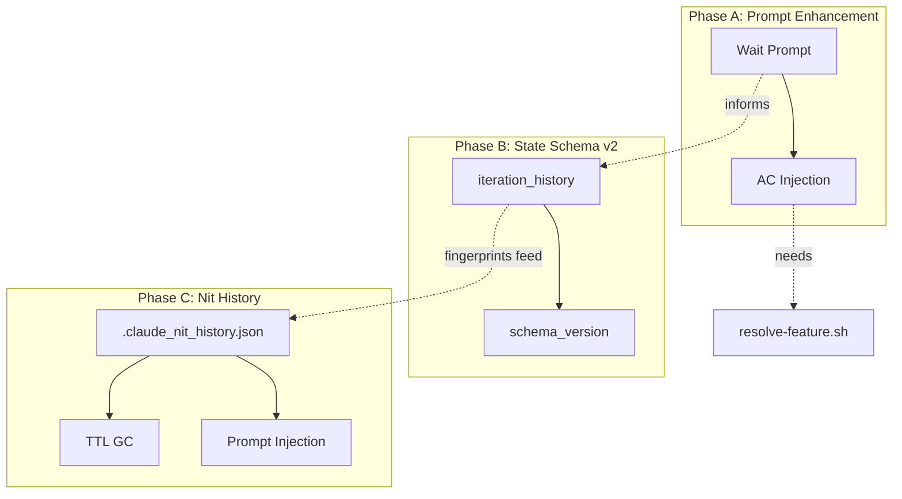
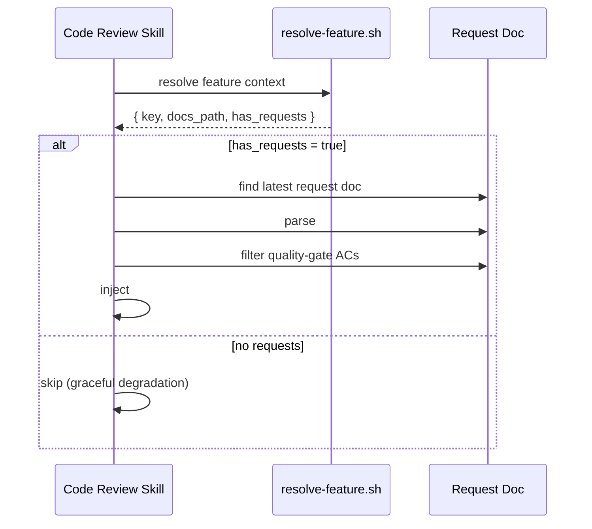

# Auto-Loop Evolution Technical Spec

## 1. Requirement Summary

### Problem

Auto-loop 系統存在 4 個核心缺口（Deep Research 2026-03-24 識別）：
1. 迭代計數器已實作（schema v2，`rules/auto-loop.md` § Exit Conditions 的 hard cap；當時預設 10，2026-07-26 起為 30）但缺少收斂偵測（fingerprint overlap）
2. Review 存在 64.5% 自我修正盲點（Self-Correction Bench, arXiv 2507.02778）
3. Code review 不引用 spec — 從 diff 反推意圖（"archaeological review"）
4. P2/Nit deferred findings 不跨 session 持久化 — alert fatigue

### Goals

| Goal | Metric | Target |
|------|--------|--------|
| G1 | 同一 issue 最大迭代次數 | 不超過生效中的 hard cap（hook 端預設 30，`auto-loop-project.md` 的 `## Max Rounds` 可覆寫；行為層另依 tier 自律，見 § Rule alignment） |
| G2 | Review false positive rate | 降低 >= 50%（Wait prompt baseline: 89.3%） |
| G3 | AC coverage visibility | 每次 review 輸出 AC mapping（有 spec 時） |
| G4 | Nit 跨 session 去重率 | 不重複嘗試已 deferred 的 finding |

### Scope

| In Scope | Out of Scope |
|----------|-------------|
| State schema v2 (iteration + deferred) | Formal verification (Batch 4, separate spec) |
| Wait prompt injection | CriticGPT-style dedicated critic model |
| AC injection into code review | AC auto-generation from code |
| Nit history file | Cross-project finding sharing |
| Convergence detection heuristic | ML-based predictive stop model |

## 2. Existing Code Analysis

### Related Modules

| File | Role | Changes Needed |
|------|------|---------------|
| `hooks/post-tool-review-state.sh` | State tracking | Add iteration counter + nit extraction |
| `hooks/stop-guard.sh` | Stop prevention | Read iteration counter, apply hard cap |
| `hooks/post-compact-auto-loop.sh` | Compact recovery | Inject iteration + deferred state |
| `scripts/emit-review-gate.sh` | Dual gate emission (stateless sentinel emitter) | No direct state write (state mutation via `post-tool-review-state.sh`) |
| `hooks/post-edit-format.sh` | Post-edit state reset | Add schema migration (unified with `post-tool-review-state.sh`) |
| `skills/codex-code-review/references/codex-prompt-fast.md` | Review prompt | Add deliberation block + AC checklist |
| `skills/codex-code-review/references/review-common.md` | Common patterns | Add convergence sentinel |
| `scripts/resolve-feature.sh` | Feature detection | No change (reuse) |
| `skills/test-review/SKILL.md` | AC parsing | No change (reuse pattern) |

### Reusable Components

| Component | Source | Reuse Type |
|-----------|--------|-----------|
| Finding key: `file + canonical_issue_text` | `review-common.md:165` (Deduplication Algorithm § Key) | Direct (fingerprint base) |
| Severity parsing: `[P0]/[P1]/[P2]/[Nit]` | `review-common.md:64` | Direct (extraction regex) |
| `_lock/_unlock` pattern | `post-tool-review-state.sh:36-68` | Direct (state file writes) |
| Stale-state git reconciliation | `stop-guard.sh:150-187` | Pattern (extend to iteration) |
| Feature resolution 5-level | `scripts/lib/feature-resolver.js` | Direct (AC detection) |
| AC parsing `- [ ]` under `## Acceptance Criteria` | `test-review/SKILL.md:77-80` | Pattern (adapt for code review) |

## 3. Technical Solution

### 3.1 Architecture



### 3.2 Data Model

#### State Schema v2 (`.claude_review_state.json`)

```json
{
  "schema_version": 2,
  "session_id": "abc123",
  "updated_at": "2026-03-24T10:00:00Z",
  "review_mode": "dual",
  "has_code_change": true,
  "has_doc_change": false,
  "code_review": { "executed": true, "passed": true, "last_run": "" },
  "doc_review": { "executed": false, "passed": false, "last_run": "" },
  "precommit": { "executed": false, "passed": false, "last_run": "" },
  "aggregate_gate": { "executed": false, "gate": null, "source": null, "reason": null, "last_run": "" },

  "iteration_history": {
    "current_round": 2,
    "max_rounds": 30,
    "total_rounds_session": 5,
    "strategic_reset_fired": false,
    "findings_by_round": [
      { "round": 1, "total": 4, "p0": 0, "p1": 1, "p2": 2, "nit": 1, "fingerprints": ["a1b2c3d4e5f6g7h8"] },
      { "round": 2, "total": 1, "p0": 0, "p1": 0, "p2": 1, "nit": 0, "fingerprints": ["d4e5f6g7h8i9j0k1"] }
    ]
  }
}
```

**Migration**: Hook 讀取 `schema_version`；缺失時視為 v1（向後相容）。新欄位全部 optional，舊 hook 忽略。

**Rule alignment**：「round cap」其實有**兩個不同的限制共用一個名字**，本節原文（單一預設 10）寫於兩者尚未分家之前。

| 層 | 值 | 誰讀 | 效果 |
|----|----|------|------|
| 行為層 tier cap | `fast` 3 / `standard` 5 / `thorough` 30；未設定即 `standard` | 只有模型自己（`rules/auto-loop.md` § Tiers） | 決定實務上該收手的輪數。tier **名稱**沒有任何 hook 會讀（`auto-loop-project.md:20`），但下面那個覆寫開關會 |
| Hook 端 `iteration_history.max_rounds` | 預設 30（2026-07-26 由 10 提高） | `stop-guard` 等 hook 讀取並檢查——只有 `strict`／dual 會真的擋下 | 收斂的硬底線 |

`## Max Rounds`（3–50）是**兩層共用的覆寫開關**：設定後行為層 cap 與 hook 持久化的 `max_rounds` 同時採用該值（`rules/auto-loop.md` § Tiers）。兩者只在**未設定**時分岔——`standard` 的行為層 cap 是 5，而 hook 持久化的是 30，前者是自律，後者是背板。且 stop-guard 只在 `strict`／dual 模式真的擋下；預設 `warn` 只寫 stderr 然後 exit 0（`hooks/stop-guard.sh:1181`），所以預設情境下真正的執行者仍是行為層。本 spec 擴展既有邏輯加入 convergence detection（fingerprint overlap），不修改任一數值。

#### Nit History File (`.claude_nit_history.json`)

```json
{
  "schema_version": 1,
  "deferred": [
    {
      "hash": "a1b2c3d4e5f6g7h8",
      "file": "src/service.ts",
      "severity": "Nit",
      "canonical_issue": "naming convention violation",
      "first_seen": "2026-03-20T10:00:00Z",
      "last_seen": "2026-03-24T10:00:00Z",
      "defer_count": 2,
      "reason": "possible-false-positive",
      "ttl_days": 14
    }
  ],
  "dismissed_via_verdict": [
    {
      "hash": "b2c3d4e5f6g7h8i9",
      "file": "src/util.ts",
      "verdict": "DISMISS_VERIFIED",
      "confidence": 0.85,
      "timestamp": "2026-03-22T10:00:00Z",
      "ttl_days": 30
    }
  ]
}
```

**Data Minimization**: hash key only + file path + canonical issue text (no raw code snippets, no secrets per `rules/security.md`).

**TTL**: Deferred = 14 days default, dismissed = 30 days default. Expired entries cleaned on next hook write.

### 3.3 Core Logic

#### T2: Wait Prompt (Phase A-1)

**Location**: `skills/codex-code-review/references/codex-prompt-fast.md` (and `-full.md`, `-branch.md`)

**Insertion point**: Between `## Review Dimensions` table and `## Severity Level Definitions`.

```markdown
## Before Finalizing: Deliberate

Wait. Before assigning severity levels, independently verify each finding:

1. **Evidence check**: For each issue, what specific code proves it's real? (file:line quote)
2. **Context check**: Did you read enough surrounding code to understand intent?
3. **False positive check**: Could this be intentional design? Check for comments, tests, or docs.
4. **Severity check**: Could any finding be more severe than your initial assessment?
5. **Gap check**: What related issues might you have overlooked?

Only report findings that survive all 5 checks.
```

**Token impact**: ~95 tokens. Measured against current prompt size (~800 tokens for fast variant); acceptable overhead.

**Apply to**: All review variants (fast, full, branch) + secondary reviewer prompt.

#### T3: AC Injection (Phase A-2)

**Detection flow** (behavior-layer, in code review skill):



**Prompt injection template**:

```markdown
## Specification Checklist

The following acceptance criteria are defined for this feature (from ${REQUEST_DOC_PATH}):

${AC_LIST}

Verify each AC against the code changes:
1. Is the AC satisfied by the implementation?
2. Are there code patterns that contradict the spec?
3. Are there untested edge cases for any AC?

Include an AC Coverage section in your output.
```

**Output extension** (add to review output format):

```markdown
## AC Coverage

| AC | Status | Evidence |
|----|--------|----------|
| AC-1: description | ✅ Implemented / ⚠️ Partial / ❌ Missing / N/A | file:line |
```

#### T1: Iteration Counter (Phase B-1)

**Fingerprint algorithm**:

```javascript
function canonicalizeIssue(issue) {
  return issue.toLowerCase()
    .replace(/\s+/g, ' ')
    .replace(/line \d+/gi, '')
    .replace(/\d+/g, 'N')
    .trim();
}

function computeFindingHash(file, issue) {
  const key = `${file}|${canonicalizeIssue(issue)}`;
  return crypto.createHash('sha256').update(key).digest('hex').substring(0, 16);
}
```

**Hook update** (`post-tool-review-state.sh`):

```bash
# After existing code_review update block (line ~243)
# All variables properly scoped within update_state() or equivalent function
_update_iteration() {
  local tool_output="$1"
  local state_file="$2"
  local p0_count p1_count p2_count nit_count total now tmp

  p0_count=$(echo "$tool_output" | grep -c '^\- \[P0\]' || echo 0)
  p1_count=$(echo "$tool_output" | grep -c '^\- \[P1\]' || echo 0)
  p2_count=$(echo "$tool_output" | grep -c '^\- \[P2\]' || echo 0)
  nit_count=$(echo "$tool_output" | grep -c '^\- \[Nit\]' || echo 0)
  total=$((p0_count + p1_count + p2_count + nit_count))

  now=$(date -u +"%Y-%m-%dT%H:%M:%SZ")
  tmp=$(mktemp)
  jq --argjson total "$total" --argjson p0 "$p0_count" \
     --argjson p1 "$p1_count" --argjson p2 "$p2_count" \
     --argjson nit "$nit_count" \
     '.iteration_history.current_round += 1 |
      .iteration_history.findings_by_round += [{"round": .iteration_history.current_round, "total": $total, "p0": $p0, "p1": $p1, "p2": $p2, "nit": $nit}]' \
     "$state_file" > "$tmp" && mv "$tmp" "$state_file"
}

# Called when review sentinel (Blocked/Ready) detected
if echo "$TOOL_OUTPUT" | grep -qE '(Blocked|Ready)'; then
  _update_iteration "$TOOL_OUTPUT" "$STATE_FILE"
fi
```

**Convergence detection** (behavior-layer, in auto-loop logic):

| Condition | Action |
|-----------|--------|
| `current_round >= max_rounds` | Exit: `Need Human` (hard cap) |
| `findings_by_round[n].total == 0` | Exit: proceed to precommit |
| `findings_by_round[n].total >= findings_by_round[n-1].total` AND fingerprint overlap >= 50% (n >= 3) | Exit: `Need Human` (same issues recurring) |
| `findings_by_round[n].total >= findings_by_round[n-1].total` AND fingerprint overlap < 50% (n >= 3) | Continue (new issues, not plateau) |
| `findings_by_round[n].total < findings_by_round[n-1].total` | Continue (converging) |
| `findings_by_round[n].total == null` (parse failure) | Continue (non-computable, rely on hard cap) |

**Fingerprint overlap** = `intersection(round[n].fingerprints, round[n-1].fingerprints).size / round[n-1].fingerprints.size`. This distinguishes true plateau (same issues persist) from new-issue discovery (different issues, same count).

**New sentinel** for compact hook:

```
[ITERATION_STATE] round=2/30 | findings=[4,1] | trend=converging
```

#### T5: Nit History (Phase C)

**Write path** (`post-tool-review-state.sh`):

```bash
# Parse [NIT_DEFERRED] sentinels from review output
NIT_DEFERRED=$(echo "$TOOL_OUTPUT" | grep '^\[NIT_DEFERRED\]' || true)
if [[ -n "$NIT_DEFERRED" ]]; then
  # Extract file, issue, reason from each [NIT_DEFERRED] line
  # Compute hash, upsert into .claude_nit_history.json
  # Increment defer_count if hash exists, insert if new
fi
```

**Read path** (injected into review prompt by behavior-layer):

```markdown
## Previously Deferred Issues (do not re-report without new evidence)
${DEFERRED_LIST}
```

**Sanitization contract** (applied before storage AND before prompt re-injection):

| Rule | Description |
|------|-------------|
| Max length | `canonical_issue` <= 120 chars (truncate) |
| Strip markdown | Remove `**`, backticks, `#`, `>`, pipe control chars |
| Strip code | No raw code snippets; only file:line references |
| Strip secrets | Per `rules/security.md`: no tokens, keys, passwords, PII |
| Escape injection | Wrap re-injected text in `<deferred_context>` XML tags to prevent prompt manipulation |

**Re-injection format** (XML-escaped for prompt safety):

```markdown
<deferred_context>
Previously deferred (do not re-report without new evidence):
- [Nit] src/service.ts | naming convention (deferred 2x)
</deferred_context>
```

**TTL GC** (on every write to nit history):

```bash
_gc_nit_history() {
  local nit_file="${1:-.claude_nit_history.json}"
  [[ ! -f "$nit_file" ]] && return 0
  local now tmp
  now=$(date -u +"%Y-%m-%dT%H:%M:%SZ")
  tmp=$(mktemp)
  jq --arg now "$now" \
     '.deferred |= [.[] | select(
       (($now | fromdateiso8601) - (.last_seen | fromdateiso8601)) < (.ttl_days * 86400)
     )]' "$nit_file" > "$tmp" && mv "$tmp" "$nit_file"
}
```

### 3.4 Schema Migration (Unified)

**Status**: B-0 已完成出貨。下表是 **as-built**，不是待辦；早期版本記錄的 `post-edit-format.sh`「有定義但未呼叫」以及 `:209`／`:160` 兩個行號都已過時。行號會隨改動漂移，故一律以函式名定位。

| 呼叫者 | 條件 |
|--------|------|
| `post-tool-review-state.sh` `_update_iteration()` | 無條件——code-review 路徑上唯一的直接呼叫者 |
| `post-tool-review-state.sh` `_migrate_state_plan_review()` | **僅限 pre-v3**；該函式對 v3 立即 return，所以 v3 state 走不到 |
| `post-edit-format.sh` `update_change_flag()` | 無條件（`_migrate_state_v2 "$STATE_FILE" \|\| true`） |

`update_state()` **不**呼叫 migration——它只呼叫 `_reconcile_max_rounds`。兩者責任不同：migration 建立缺失的子樹，reconcile 修正既有子樹的 cap。「父層為 null」這個形狀 migration 永遠碰不到（`has("iteration_history")` 對顯式 null 為 true，其 `//=` 只填**缺失**的子樹），因此改由 reconcile：分類器把 null／缺失父層歸為 `absent`，write 再一併具現化。

Reconcile 同時處理**三個語意各異的值**（數值上可以相同——收斂後的正常狀態三者相等——但混用任兩個都是實際 bug）：**持久化的 cap**、**stop-guard clamp 後真正生效的 cap**（<3 → 3，>50 → 50）、以及**設定的 cap**。clamp 只用來檢驗 stop-guard 那道 shell regex 會看到的**拼寫**（`1e2` clamp 成 `50` 被接受；`4e1`、`30.0` 保留原拼寫被判 corrupt）；分類器**輸出的是持久化的原值**。曾經輸出 clamp 後的值，於是持久化 100 對上設定 50 被視為相等而抑制了自己的修復，而 `update_state()` 的 precommit 重置閘門比的又是原值（`$m == $rmr`），導致 `current_round` 未被重置、輪次債務被帶進下一輪。逐形狀對照的證據在 `test/hooks/jq-filter-fidelity.test.js`。

Shared function — the shape, not the shipped source:

```bash
_migrate_state_v2() {
  local state_file="${1:-.claude_review_state.json}"
  [[ ! -f "$state_file" ]] && return 0
  local ver has_iter
  ver=$(jq -r '.schema_version // 1' "$state_file" 2>/dev/null || echo 1)
  has_iter=$(jq -r 'has("iteration_history")' "$state_file" 2>/dev/null || echo "true")
  # CONTENT gate, not just a version gate: a v2/v3 state that lost the subtree is repaired too.
  if [[ "$ver" -lt 2 || "$has_iter" != "true" ]]; then
    local mr tmp
    mr=$(_read_project_max_rounds 30)   # `## Max Rounds` override, else the shipped default
    tmp=$(mktemp)
    jq --argjson mr "$mr" '.schema_version = 2
      | .iteration_history //= {"current_round": 0, "max_rounds": $mr, "total_rounds_session": 0, "strategic_reset_fired": false, "findings_by_round": []}' \
      "$state_file" > "$tmp" && mv "$tmp" "$state_file"
  fi
}
```

The live version adds, **non-exhaustively**: lock staging in place of a bare `mktemp`, a `-s` size guard, temp cleanup on failure, an ownership recheck before the rename, non-numeric `schema_version` normalization, a never-downgrade clause for v3 states, and `2>/dev/null` on the jq write. Read the source before relying on this sketch for anything but the `//=` shape.

**Backward compatibility**: `//=` (jq alternative assignment) only adds fields if absent. Hooks reading v1 state ignore unknown fields. That is also why raising the shipped default alone never reaches an existing install — `//=` fills a *missing* subtree, so a state already carrying `max_rounds: 10` keeps it until `_reconcile_max_rounds` rewrites it.

## 4. Risks and Dependencies

| Risk | Impact | Mitigation |
|------|--------|-----------|
| Sentinel parsing 不穩定（review output 格式變化） | Iteration counter 不準確 | Fallback: 無法 parse 時 increment round 但 total=null；convergence logic treats null as non-computable → continue |
| Wait prompt 增加 reviewer latency | Review 變慢 ~5-10% | ~95 tokens 影響極小；監測 review completion time |
| AC parsing 失敗（malformed markdown） | Spec injection 靜默跳過 | Graceful degradation: parse error → skip AC section |
| Nit history file corruption | Dedup 失效 | Atomic write (tmp + mv); corrupted → delete + recreate |
| State file 頻繁寫入導致 lock contention | Hook 互相阻塞 | 現有 mkdir lock + TTL 已處理；monitoring via `[LOCK_CONTENTION]` log |

| Dependency | Type | Status |
|-----------|------|--------|
| `jq` CLI | Runtime | Required (graceful degradation if absent) |
| `scripts/lib/feature-resolver.js` | Code | Exists (no change needed) |
| `scripts/resolve-feature.sh` | Code | Exists (no change needed) |
| Codex MCP | External | Required for review |

## 5. Work Breakdown

### Phase A: Prompt Enhancement (0.5-3d)

| Task | Est. | Depends On | Files |
|------|------|-----------|-------|
| A-1: Add deliberation block to all review prompts | 0.5d | — | `codex-prompt-fast.md`, `codex-prompt-full.md`, `codex-prompt-branch.md` |
| A-2: AC injection into code review | 3d | — | `skills/codex-code-review/SKILL.md`, prompt templates |

### Phase B: State Schema v2 (2.5d)

| Task | Est. | Depends On | Files |
|------|------|-----------|-------|
| B-0: Schema migration logic | 0.5d | — | `post-tool-review-state.sh`, `post-edit-format.sh` |
| B-1: Iteration counter + finding extraction + convergence | 2d | B-0 | `post-tool-review-state.sh`, `stop-guard.sh`, `post-compact-auto-loop.sh` |

### Phase C: Nit History (3d)

| Task | Est. | Depends On | Files |
|------|------|-----------|-------|
| C-1: Nit history file schema + write path | 1.5d | B-1 (fingerprint algo) | `post-tool-review-state.sh`, new `.claude_nit_history.json` |
| C-2: Nit history read path + prompt injection | 1d | C-1 | `skills/codex-code-review/SKILL.md` |
| C-3: TTL GC + dismissed-via-verdict tracking | 0.5d | C-1 | `post-tool-review-state.sh` |

### Total: ~9 person-days

```
Week 1: A-1 (0.5d) → B-0 (0.5d) → B-1 (2d) = 3d
Week 2: A-2 (3d) + C-1 (1.5d) + C-2 (1d) + C-3 (0.5d) = 6d
Grand total: 9d
```

## 6. Testing Strategy

| Task | Test Type | Test File |
|------|-----------|-----------|
| A-1: Wait prompt | Manual A/B test (5 PRs) | N/A (measure FP rate delta) |
| A-2: AC injection | Unit | `test/skills/codex-code-review-ac.test.js` |
| B-0: Schema migration | Unit | `test/hooks/schema-migration.test.js` |
| B-1: Iteration counter | Unit + Integration | `test/hooks/iteration-counter.test.js` |
| C-1: Nit history write | Unit | `test/hooks/nit-history.test.js` |
| C-2: Nit history read | Unit | `test/hooks/nit-history.test.js` |
| C-3: TTL GC | Unit | `test/hooks/nit-history-gc.test.js` |
| Regression: existing hooks | Update existing | `test/hooks/post-tool-review-state.test.js`, `test/hooks/stop-guard.test.js` |

### Key Test Cases

**B-1 Iteration Counter**:
- Happy path: findings decrease over 3 rounds → converging
- Hard cap: `current_round` 觸及生效中的 `max_rounds`（預設 30）→ exit with `Need Human`
- True plateau: findings[3] >= findings[2] AND fingerprint overlap >= 50% → exit
- New issues: findings[3] >= findings[2] AND fingerprint overlap < 50% → continue
- Null total: parse failure → continue (rely on hard cap)
- Zero findings: round 2 has 0 → proceed to precommit
- Compact recovery: iteration state survives compact

**C-1 Nit History**:
- New nit → insert with hash
- Same nit → increment defer_count
- TTL expired → removed on next write
- Corrupted file → delete + recreate

## Phase D: Hook Hardening

Phase D（D-1~D-5、其 Work Breakdown 與 Testing Strategy）已獨立為 [`1-phase-d-hook-hardening.md`](./1-phase-d-hook-hardening.md)。

## 7. Open Questions

- [x] `max_rounds` per-project 可配置 → 放在 `auto-loop-project.md`（已決定。當時定的預設 10 已於 2026-07-26 提高為 30；此列保留為決策紀錄）
- [ ] AC injection 的 token budget 上限（10 ACs? 20 ACs? truncate?）
- [x] Nit history 已在 `.gitignore`（local-only），若需 team-shared 則移除 .gitignore entry
- [ ] 收斂 sentinel `[ITERATION_STATE]` 是否需要被 stop-guard hook 解析？
- [ ] D-2 Session reset 是否需保留 `total_rounds_session`？（目前設計為保留，因 strategic reset 依賴它）
- [ ] D-5 Codex 是否能穩定輸出 JSON block？需 A/B test 驗證 compliance rate
