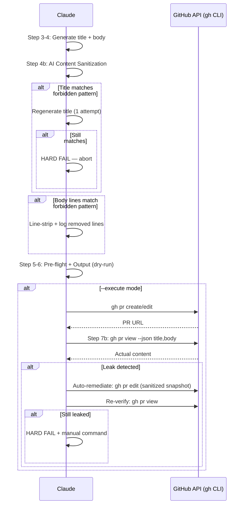

# Create PR AI Sanitization — Technical Spec

## 1. Requirement Summary

- **Problem**: `/create-pr` 僅靠一行文字規則（SKILL.md:84 "No AI-generated tags"）阻止 AI 署名洩漏。PR title/body 經常出現 "Generated with Claude"、"Co-Authored-By: Claude" 等標記，破壞開發者所有權歸屬。
- **Goals**: 為 `/create-pr` 加入 3 層程式化 AI 內容過濾：forbidden pattern table → pre-output sanitization → post-creation verification。
- **Scope**: 修改 `skills/create-pr/SKILL.md`；更新 `CLAUDE.md` Development Rules；不新增 scripts（複用 canonical source `commit-msg-guard.sh`）。
- **Origin**: Best Practices Audit（Debate threadId: `019d2d36-e3f0-7592-b09e-052b09b14fd6`）

## 2. Existing Code Analysis

### Related Modules

| Module | 可復用部分 |
| ------ | ---------- |
| `scripts/commit-msg-guard.sh` | Canonical forbidden patterns（3 組 ERE + `\b` 字界） |
| `skills/smart-commit/SKILL.md`（AI Attribution Sanitization 節） | AI trailer sanitization flow、`--ai-co-author` narrow whitelist |
| `skills/smart-commit/references/execute-mode.md` | `validate_msg()` 實作、post-commit detection |
| `skills/create-pr/SKILL.md` | 現有 PR 建立/更新 workflow（Step 1-7） |

### Canonical Forbidden Patterns

來源：`scripts/commit-msg-guard.sh`（ERE, case-insensitive — 僅 `AI` 加 `\b` 字界，避免在 `-i` 下誤中 "maintainer"、"domain" 等一般字詞；`GPT`/`OpenAI` 刻意不加字界，以匹配 `ChatGPT`/`GPT-4`）

| Pattern Category | Regex |
|-----------------|-------|
| Co-Authored-By AI | `Co-Authored-By:.*(Claude\|Anthropic\|\bAI\b\|GPT\|OpenAI\|Copilot\|Codex\|Gemini\|noreply@anthropic)` |
| Generated-by tag | `Generated (by\|with).*(Claude\|\bAI\b\|GPT\|OpenAI\|Copilot)` |
| Emoji robot tag | `🤖.*(Claude\|\bAI\b\|GPT\|OpenAI)` |

### Files Requiring Changes

| File | Action | Description |
| ---- | ------ | ----------- |
| `skills/create-pr/SKILL.md` | Modify | 新增 forbidden pattern table + Step 4b + Step 7b |
| `CLAUDE.md` | Modify | Development Rules #3 擴展至 PR 規則 |
| `.claude/CLAUDE.md` | Modify | 同步 Development Rules #3 |

## 3. Technical Solution

### 3.1 Architecture Design



### 3.2 Layer Model

| Layer | 位置 | 適用模式 | 對應 smart-commit |
|-------|------|---------|------------------|
| 1. Forbidden Pattern Table | SKILL.md:84 後 | 行為定義 | Step 5b pattern table |
| 2. Pre-output Sanitization | 新增 Step 4b | dry-run + execute, create + update | Step 5b sanitize |
| 3. Post-creation Verify | 新增 Step 7b | execute only | Post-commit detection |

### 3.3 Sanitization Rules

| 目標 | 策略 | 原因 |
|------|------|------|
| **Title** | Regenerate/fail（非 strip） | Silent strip 可能產生空 title（如 `fix:` 後無內容） |
| **Body** | Line-strip + log removed | 單行移除不影響結構完整性；輸出 `[AI_STRIPPED] <removed line>` 供開發者確認 |
| **`--title` override** | 同 title 規則 | 使用者提供的 override 也需掃描 |

### 3.4 Post-creation Verify Details（execute-only）

```bash
# 1. Fetch actual published content
gh pr view <number> --json title,body --template '{{.title}}{{"\n"}}{{.body}}'

# 2. Scan for forbidden patterns (same 3 ERE + \b patterns from commit-msg-guard.sh)

# 3. If leak detected — auto-remediate (single attempt):
#    Title (safe escaping via printf):
gh pr edit <number> --title "$(printf '%s' '<pre-sanitized-title>')"
#    Body (safe escaping via --body-file + heredoc):
gh pr edit <number> --body-file /dev/stdin <<'EOF'
<pre-sanitized-body-snapshot>
EOF

# 4. Re-verify
gh pr view <number> --json title,body --template '{{.title}}{{"\n"}}{{.body}}'
# If still leaked → HARD FAIL + output manual remediation command
```

**Auto-remediate 安全性**：PR edit 是非破壞性操作（與 git commit --amend 不同），且使用者已透過 `--execute` 同意自動化操作。

**Guardrails**（from debate equilibrium）：
1. 單次 remediation 嘗試 only
2. 使用 pre-sanitized snapshot（不重新 generate）
3. 立即 re-verify
4. 失敗後 hard fail + manual command

### 3.5 Coverage Matrix

| 場景 | Pattern Table | Pre-output Sanitize | Post-verify |
|------|:---:|:---:|:---:|
| dry-run create | ✅ | ✅ | N/A |
| dry-run update | ✅ | ✅ | N/A |
| execute create | ✅ | ✅ | ✅ |
| execute update | ✅ | ✅ | ✅ |
| `--title` override (execute) | ✅ | ✅ | ✅ |
| `--title` override (dry-run) | ✅ | ✅ | N/A |

### 3.6 不實作項目

| 項目 | 原因 |
|------|------|
| `--ai-co-author` flag | PR 無合理 AI 署名用例 |
| Git hook 整合 | PR 走 GitHub API，不經 git hooks |
| 獨立 script 檔案 | 複用 canonical source，不新增 script |

## 4. Risks and Dependencies

| Risk | Probability | Impact | Mitigation |
|------|------------|--------|------------|
| False positive（regex 誤刪合法行） | Low | Medium | Line-level 移除 + `[AI_STRIPPED]` log 供開發者確認 |
| Policy drift（pattern 與 commit-msg-guard.sh 不同步） | Medium | High | 明確引用 canonical source，加入 sync check test |
| Title regenerate 後仍含 AI 標記 | Very Low | Low | Hard fail — 不輸出不合規的 PR |
| `gh` CLI escaping 邊界案例 | Low | Medium | Post-verify 層偵測並 auto-remediate |
| Auto-remediate 失敗（GitHub API 錯誤） | Very Low | Medium | 單次嘗試 + hard fail + manual command |
| GitHub API rate limit / transient error | Low | Medium | Fail-fast（不 retry），輸出錯誤訊息 + manual command |

### Dependencies

| Dependency | Status |
|-----------|--------|
| `scripts/commit-msg-guard.sh` 的 3 組 ERE + `\b` pattern | 已存在，穩定 |
| `gh` CLI 安裝 | `/create-pr` 已假設存在 |
| SKILL.md 現有 Step 1-7 workflow | 穩定，僅插入新步驟 |

## 5. Work Breakdown

| # | Task | Effort | Priority |
|---|------|--------|----------|
| 1 | SKILL.md: 在 `### 4. Generate Body` Rules 段落後新增 Forbidden Pattern Table | S | P0 |
| 2 | SKILL.md: 新增 Step 4b (AI Content Sanitization) | M | P0 |
| 3 | SKILL.md: 新增 Step 7b (Post-creation Verify + auto-remediate) | M | P1 |
| 4 | SKILL.md: Step 5a (update mode) 加入 sanitization 引用 | S | P1 |
| 5 | CLAUDE.md + .claude/CLAUDE.md: Development Rules #3 擴展至 PR | S | P2 |
| 6 | 測試: `test/commands/create-pr-sanitization.test.js` | M | P1 |

## 6. Testing Strategy

### Unit Tests

| Test Case | Input | Expected |
|-----------|-------|----------|
| Title 含 "Generated with Claude" | `feat: Add auth Generated with Claude` | Regenerate title（1 attempt）→ 若仍含 pattern → hard fail |
| Body 含 Co-Authored-By 行 | Body with `Co-Authored-By: Claude <noreply@anthropic.com>` | Line removed + `[AI_STRIPPED]` log |
| Body 含 emoji robot tag | Body with `🤖 Generated with AI` | Line removed + `[AI_STRIPPED]` log |
| Title regenerate 仍含 pattern | Edge case | Hard fail |
| Clean title + body | No patterns | Pass through unchanged |
| `--title` override 含 pattern | User provides AI-tagged title | Immediate fail（user-provided override 不 regenerate） |
| Update mode body | Existing PR body with AI content | Sanitized |

### Integration Tests

| Test Case | Verification |
|-----------|-------------|
| Forbidden patterns 與 `commit-msg-guard.sh` 同步 | 讀取 script → 比對 SKILL.md 的 pattern table |
| Dry-run output 不含 forbidden patterns | 掃描 output command block |

### Edge Cases

| Case | Behavior |
|------|----------|
| Body 全部行都被 strip | 輸出空 body → 保留 template structure（Summary / Test plan headers） |
| Title regenerate 後為空或仍不合規 | Hard fail（title 不 strip，只 regenerate/fail） |
| Pattern 在 code block 內 | Line-strip 仍適用（保守策略） |

## 7. Open Questions

| # | Question | Impact | Default if Unresolved |
|---|----------|--------|----------------------|
| 1 | 是否需要為 code block 內的 pattern 設例外？ | Low | 不設例外（保守策略） |
| 2 | 未來是否需要 `--ai-attribution` opt-in for PR？ | Low | 不實作，待需求出現再評估 |
| 3 | 是否需要 GitHub Actions server-side enforcement？ | Medium | 超出 plugin 範圍，文件建議即可 |
