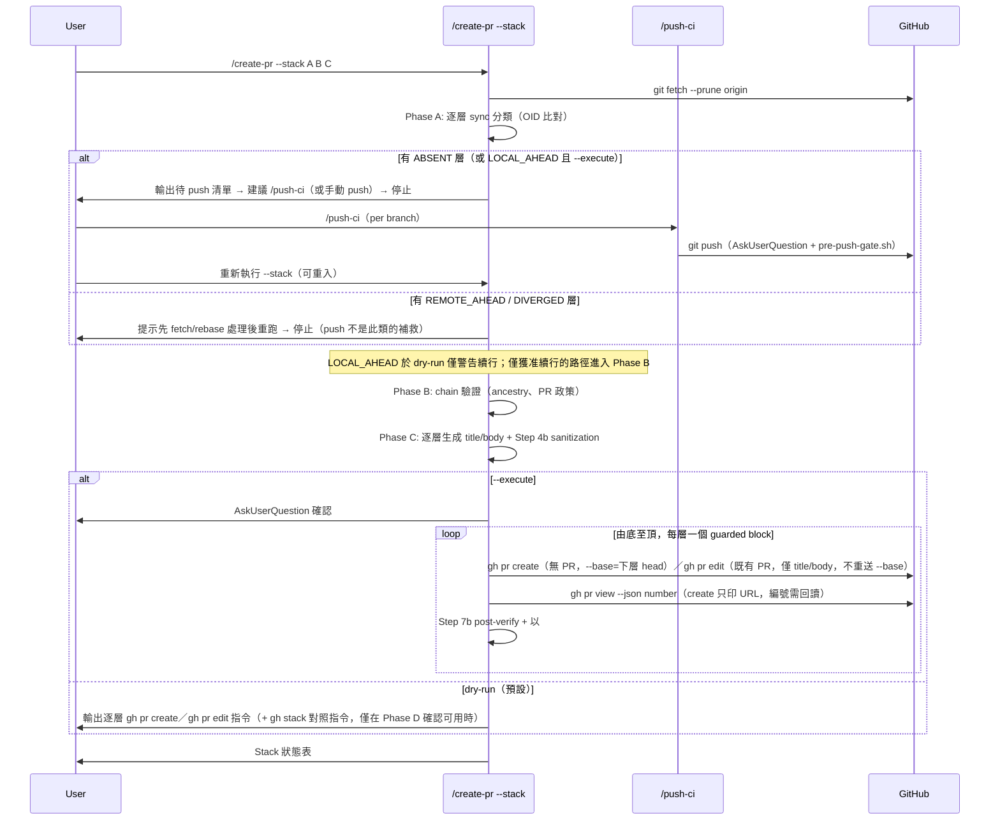

# create-pr Stacked PR Mode Technical Spec

> **Doc class**: Lifecycle — Phase 2 tech spec (per `@rules/docs-numbering.md`)
> **Created**: 2026-07-31
> **Requirements**: [1-requirements.md](./1-requirements.md)

## 1. Requirement Summary

- **Problem**: 多 Agent 開發下大功能需要拆成相依 PR 鏈；現行 `/create-pr` 只有 body 註記 `Stacked on #N` 與 Multi-PR Mode，GitHub 端不理解依賴。GitHub 原生 Stacked PR（2026-07-30 public preview）提供正式建模，但其 CLI（`gh stack submit/rebase/push`）內含 branch push、rebase、force-with-lease——全部落在 Anchor Register #4 禁止清單。
- **Goals**: 在**不修改 Anchor #4 例外清單**的前提下，用既有授權工作流組合出 stacked PR 工作流：branch push → `/push-ci`，PR create/edit → `/create-pr` 既有 `--execute` 契約（SKILL.md Step 5a、Steps 6-7），`gh stack` 系列 → dry-run 輸出由使用者自行執行。
- **Scope**: In — `/create-pr` 新增 `--stack` 模式（chain 驗證、逐層 PR 建立/更新、狀態表、環境偵測與降級）、`/push-ci` 多 branch 支援評估、配套測試。Out — 自動執行任何 `gh stack` 指令、cascading rebase 的自動傳遞、auto-merge/merge queue 整合、cross-fork。

本 spec 同時**裁決** `1-requirements.md` § Open Questions 之首：v1 採組合方案（`/push-ci` + `/create-pr`），不啟動 Anchor-level 變更。

## 2. Existing Code Analysis

| Module | 現況 | 與本功能的關係 |
|--------|------|----------------|
| `skills/create-pr/SKILL.md` | create/update/dry-run/execute 矩陣；Step 4b sanitization、Step 7b post-verify；Multi-PR Mode 與 `Stacked on #N` 註記（§ Stacked PR Mode 一節） | 主要修改點：新增 `--stack` 模式，重用 Steps 2-4（title/body 生成）、4b、5a、7b |
| `skills/push-ci/SKILL.md` | 推**當前 branch**，AskUserQuestion（advisory）+ `pre-push-gate.sh`（每次 push 的 policy gate；`/dev/tty` 終端確認限 protected branches，non-fast-forward 為 policy 阻擋、僅授權的 lease 契約放行）；成功後委派 `/watch-ci` | stack 的 branch push 授權路徑；限制：單次單 branch（§3.4 Phase A、§7） |
| `skills/epic-merge/SKILL.md` | linear chain 驗證（Phase 0）、backup tags、逐 PR squash-merge | chain 驗證邏輯可對齊重用；合併端維持其職責，本功能不重疊 |
| `skills/pr-summary/SKILL.md` § Workflow → 1. Run Script（`Detect` 列） | 以「base 非 main/master/develop」啟發式偵測 stacked PR | 消費端；`--stack` 產生的 chained-base PR 天然可被其偵測 |
| `test/skills/create-pr-sanitization.test.js` | Step 4b/7b 的 regression 測試 | 全數保留；新測試另立 `test/skills/create-pr.test.js` |
| `scripts/commit-msg-guard.sh` | forbidden pattern 唯一來源 | 逐層 PR title/body 沿用 |

**環境事實**（2026-07-31 實測）：`gh` 2.95.0 已安裝；`gh-stack` extension 未安裝；repo 是否被 preview rollout 涵蓋未驗證。

## 3. Technical Solution

### 3.1 Architecture Design

授權分層是本設計的骨架——三類操作、三條既有路徑，皆不觸碰 Anchor #4 例外清單：

| 操作類別 | 執行者 | 授權依據 |
|----------|--------|----------|
| `gh pr create` / `gh pr edit` | `/create-pr --stack --execute` | 既有 Step 5a / Steps 6-7 契約（AskUserQuestion per run） |
| `git push`（各層 branch，非 force） | `/push-ci`（逐 branch 或 §7 的 `--branches` 擴充） | Anchor #4 既有例外：AskUserQuestion + `pre-push-gate.sh` |
| `gh stack init/add/submit/rebase/push/modify` | **使用者本人**（skill 僅輸出指令） | 不在 Claude 執行範圍，無需授權 |



### 3.2 Data Model

Stack chain 為記憶體內的有序結構，不落地任何狀態檔（Phase B 以 GitHub 查詢重建狀態、Phase C 據以可重入分流）。所有欄位在 `git fetch --prune origin` 之後取值（`--prune` 確保已刪除的 remote branch 不會以 stale ref 混入），一律以 **remote refs** 為準：

```
chain := [ layer_1, ..., layer_N ]   # 底層在前；宣告的 base 關係須通過 Phase B ancestry 驗證，非僅列表順序
layer := {
  head:       branch name,
  base:       layer_1 為解析後的 target branch（`--base` → `{TARGET_BRANCH}` → `main`），其餘為 layer_{i-1}.head,
  local_oid:  git rev-parse 'refs/heads/<head>'（本地存在時）,
  remote_oid: git rev-parse 'refs/remotes/origin/<head>'（fetch 後）,
  sync:       NO_SUCH_BRANCH | ABSENT | IN_SYNC | LOCAL_AHEAD | REMOTE_AHEAD | DIVERGED,   # 由兩個 OID + merge-base 分類
  pr:         { number, baseRefName, state } | null,
              # 查詢：gh pr list --head <head> --state all --limit 100 --json number,baseRefName,state
              # （gh pr list 預設僅回 OPEN，必須帶 --state all 才能看到 CLOSED/MERGED 與異 base 的 PR）
  commits:    git log 'refs/remotes/origin/<base>..refs/remotes/origin/<head>' --oneline 計數   # 內容生成一律取自 remote 快照
}
```

### 3.3 CLI Surface

```
/create-pr --stack <branch...>        # 顯式指定 chain（底層在前）；dry-run 預設
/create-pr --stack                    # 自動偵測：從當前 branch 沿 base 關係回溯至解析後的 target branch
/create-pr --stack --execute          # 逐層 gh pr create/edit（AskUserQuestion 確認）
/create-pr --stack --update           # 既有 stack 逐層更新 title/body（重用 Step 5a）
```

與既有旗標的互動：`--base` 僅作用於最底層（未給時依 `{TARGET_BRANCH}` → `main` 解析，非寫死 `main`）；`--title` 在 stack 模式禁用（逐層自動生成，避免同名）；`--head` 與 `--stack` 互斥。

### 3.4 Core Logic

**Phase A — Sync 分類與 push 委派**（最先執行：後續一切驗證與內容生成都依賴 remote refs，remote ref 不存在時 ancestry/commit-range 指令根本無法跑）。先 `git fetch --prune origin`（`--prune` 清除已刪除的 stale remote-tracking refs），逐層以 `local_oid` / `remote_oid` / merge-base 分類 `sync`：

| sync | 意義 | dry-run | `--execute` |
|------|------|---------|-------------|
| `IN_SYNC` | remote 與本地一致；或僅 remote 存在（`REMOTE_ONLY` 視同 IN_SYNC——無本地 branch 時，fetch 後的 remote OID 即權威狀態） | 續行 | 續行 |
| `LOCAL_AHEAD` | 本地有未 push commits（remote ref 存在但落後） | 續行 + 警告（內容取自 remote 快照，可能過時） | 拒絕啟動 |
| `ABSENT` | 本地有、remote ref 不存在（可由 push 補救） | **中止於 PR 規劃前**：輸出待 push 清單後停止（無 remote ref 即無法生成內容） | 拒絕啟動 |
| `NO_SUCH_BRANCH` | 本地與 remote 皆不存在——chain 輸入錯誤，**push 補救不了打錯的名字** | 中止（非 push 清單） | 拒絕啟動 |
| `REMOTE_AHEAD` / `DIVERGED` | remote 較新或分岔 | 中止該層：提示先 fetch/rebase 由使用者處理 | 拒絕啟動 |

待 push 清單輸出兩條路徑供選：(1) 逐 branch `/push-ci`（現行契約，需 checkout 各 branch）；(2) 可複製的 `git push origin -- 'b1' 'b2' 'b3'` 指令由使用者自行執行（`--` 為 option terminator，與 Shell 安全契約一致）。**本 skill 不執行 push**。Push 完成後重新執行 `--stack`（可重入），全層 remote refs 齊備才進入 Phase B。`ls-remote` 只證明 remote branch 存在、不證明同步——這是本 Phase 以 OID 比對取代它的原因；PR 內容（title/body/commit 計數）一律生成自 `refs/remotes/origin/<base>..refs/remotes/origin/<head>`，杜絕「PR body 描述了 GitHub 上不存在的 commits」。

**Phase B — Chain 驗證**（僅在所需 remote refs 齊備後執行；ancestry 檢查為真實拓撲驗證，非列表順序自我比對）：

| 檢查 | 方法 | 失敗處置 |
|------|------|----------|
| 線性 ancestry：**每層（含最底層）皆須源自其宣告的 base**，且每組相鄰層 `refs/remotes/origin/<lower-head>` 是 `refs/remotes/origin/<upper-head>` 的祖先 | `git merge-base --is-ancestor 'refs/remotes/origin/<base>' 'refs/remotes/origin/<head>'`（逐層）＋相鄰對 | 中止：說明 stack 僅支援線性依賴（FR-5 / UC-6）。僅驗相鄰對會漏掉「底層已與 base 分岔」 |
| 每層有 unique commits | `git log 'refs/remotes/origin/<base>..refs/remotes/origin/<head>'` 非空 | 中止：空層無意義 |
| 既有 PR 政策（單一政策）：每層的 PR 必須「OPEN 且 `baseRefName` = chain 宣告的 base」或 ABSENT | `gh pr list --head <head> --state all --limit 100 --json number,baseRefName,state`；多筆符合、CLOSED、MERGED、base 不符 → 皆中止並列明衝突 | 中止：要求人工處理衝突 PR |
| 層數 | 空 chain 且無引數 → 進自動偵測；空 chain 且顯式引數 → 錯誤；單層 → 中止並建議一般 `/create-pr`；2–5 正常；>5 警告不中止 | 依左列 |

**自動偵測（無引數）僅允許權威來源**：由當前 branch 的既有 PR base 關係、或 native stack metadata（可用時）回溯至解析後的 target branch。Git branch 本身不記錄「意圖中的 base」，因此無既有 PR 亦無 native metadata 時 → 要求顯式 chain，模糊即 STOP，不猜測。Dirty working tree **警告不中止**（v1 mutation 全部是遠端 `gh pr` 操作，內容一律取自 fetch 後的 remote refs——本地未提交內容不影響輸出）。

**Shell 安全（輸出與執行雙軌，涵蓋所有動態欄位）**：git 允許 branch 名含 shell metacharacters（`;`、`$( )`、`&`、引號均可通過 `git check-ref-format --branch`；leading `-` 會被其拒絕，但對 CLI 引數仍以 `--` 分隔符防禦 option 誤讀——**限該 CLI 接受 `--` 之處**：`git rev-parse --verify --quiet` 不接受，加上去會讓存在的 ref 回 1，而 1 正是「不存在」的分類值，於是每一層都被誤判為 `NO_SUCH_BRANCH`。shipped 契約見 `skills/create-pr/SKILL.md` § Shell Safety）。契約：

1. 所有**輸出供複製**的指令，動態值（branch、title）一律經 single-quote rendering 呈現——含 apostrophe 時使用 POSIX escape `'\''`。雙引號**不足**：它不抑制 `$( )`。
2. **body 一律走 `--body-file`，heredoc 全面禁用**。實作與本節初版設計分歧於此：初版允許「選用經驗證不存在於 body 內的 delimiter」，實作改為**完全不用 heredoc**——body 是使用者可控內容，任一 body 行等於 delimiter 即提早終止，而「驗證 delimiter 不存在」本身是每次都必須正確執行的動態檢查，弱於結構上不存在該風險。body 檔寫入由 `mktemp -d` 建立的執行目錄（0700），路徑形如 `<PR_BODY_DIR>/pr-body-<N>.md`。
3. `mktemp -d` **必須實際執行建立目錄**，不得以變數假借：每次 Bash 呼叫都是新 shell，`DIR=$(mktemp -d)` 後於他次呼叫使用 `$DIR` 會展開為空。
4. **Phase A 的 fence 每個失敗皆顯式 `|| exit`，不用 `set -e`**：`git fetch --prune origin` 失敗後若仍執行探測，讀到的是**過期**的 remote-tracking refs 而 fence 回報 0——實測確認（未防護：印出 OID、exit 0；shipped 形式：exit 128 且探測未執行）。**不用 `set -e` 是刻意的**：呼叫端一旦測試某指令的狀態，errexit 對該指令即失效，而該脈絡會被 subshell 繼承——這是 POSIX 行為，非特定 shell 的怪癖。實測 `bash`／`sh`／`zsh`／`dash` 皆同：`f || true` 包住 `( set -e; false; echo REACHED )` 一律印出 `REACHED` 且回報 0；以 shipped fence 對不可達 remote 實測，`set -e` 形式在直接呼叫時確實中止（128、無 `end:`），但在呼叫端測試狀態時於三種 shell 全部印出過期 OID 與 `end:` 並回報 0。fence 無從控制呼叫端是否測試它的狀態，因此以 `set -e` 承載政策只是碰運氣。各探測再以 `|| [ "$?" = 1 ] || exit 2` 守衛（缺 ref 是預期答案，其餘一律離開），並以 `local:` / `remote:` / `end:` 標記界定輸出區段——`--quiet` 對缺 ref 不輸出，無標記時 `ABSENT` 與 remote-only 會產生完全相同的觀測，而兩者處置相反。

5. **dry-run 不呼叫 mutating `gh`、不留存任何檔案**：dry-run 是預設模式，遺留物會發生在每一次預覽。但它**必須**建立目錄、寫檔並執行 Step 4b——sanitization 作用於檔案，而 dry-run 輸出的 body 正是使用者會複製去執行的文字，跳過它等於留下唯一一條讓 AI trailer 進入 PR 的路徑。唯讀查詢仍會執行（Phase B `gh pr list` 決定 create/edit 路由、Phase D `gh extension list` 決定輸出形式），被禁的只有 `gh pr create` / `gh pr edit`。因此保證的是**不留存**而非**不動作**：dry-run 於交付報告前以 teardown fence 自行清除該目錄，而不是把清理留在使用者未必會執行的指令內；`--execute` 則額外執行操作並由 guarded block 負責清理。

6. **`gh pr list` 明確指定 `--limit 100`**：預設 30，而既有 PR 政策會拒絕任何衝突項——落在第二頁的衝突 PR 會被讀成「不存在」，整條 chain 便建立在錯誤前提上。

7. **Step 4b/7b 的生命週期只有一個擁有者**：建立目錄 → 寫檔 → sanitize → 操作 → teardown，其中**每一條不走到操作的離開路徑**（寫入失敗、sanitizer exit 2、標題二次失敗、使用者拒絕確認、dry-run 結束）都走同一個 teardown fence，走到操作的則由 guarded block 自行清理。缺了這條，sanitizer 失敗會把已寫出的私有 title/body 留在磁碟上。Step 7b **自行建立一個新的驗證目錄**：單 PR 模式下 Step 4b 的執行目錄在操作的同一道指令內就被移除；`--stack` 下每層 block 只移除自己的 `pr-body-N.md`，目錄本身留到最後一層之後的 teardown fence，而 Step 7b 逐層在兩者之間執行。兩種情形都不得重用——私有 body 不應為了讓後續步驟重用路徑而延長壽命，而 stack 模式的目錄此刻還存著尚未發布層的 body，因此驗證階段以 shipped fence 將 `gh pr view` 導向 `<PR_BODY_DIR>/published.txt`——sanitizer 讀檔，只印到終端機的輸出會讓下一道指令掃描一個不存在的路徑（exit 2，fail-closed 錯誤而非判定）——掃描後無論結果一律 teardown，`<PRIOR_STATUS>` 帶入掃描結果，使清理不能遮蔽判定。

8. 所有帶 body 的操作使用**單一 canonical guarded block**（唯一權威定義於 `skills/create-pr/SKILL.md` § Command Rendering，其餘兩處僅引用）。該 block 是**兩個 fence**：allocator 一個、guarded operation 一個。合併成一個 fence 沒有正確的執行方式——整段執行則 `mktemp -d` 的輸出被丟棄、`gh` 收到未替換的字面 `<PR_BODY_DIR>/…`；先單獨跑 allocator 再「原樣」執行同一 fence 則會多建立一個無人回收的目錄。shell 註解無法讓執行暫停以便 out-of-band 寫入 body，只有 fence 邊界可以；因此每個 allocator fence 與其 operation fence 之間都必須有一段明說「以 Write tool 寫入」的步驟，缺了它 `--body-file` 指向不存在的檔案，此性質由測試對兩份文件全域檢查。**cleanup 的 operand 依情境不同**：單一 PR 清整個 run 目錄，stacked 逐層只清自己的 `pr-body-N.md`，目錄則由獨立的 **teardown fence** 收尾。teardown 之所以自成一個 fence：失敗的層會以非零狀態結束，任何「接在它後面」的指令在呼叫端 `set -e` 下根本不會執行，而正是失敗路徑最需要清理。teardown 以 `set -- <PRIOR_STATUS>` 帶入前一層狀態（全成功時為 `0`），使 cleanup 只能追加失敗、不能取代失敗——這是逐層 block 內同一條「capture, clean, re-raise」規則往上搬一層。`<PRIOR_STATUS>` **與其他動態值一樣加單引號**（`set -- '<PRIOR_STATUS>'`），本 skill 沒有 bare-placeholder 豁免。曾經有過，理由是「算術運算元不該加引號」，兩個方向都錯：`$(( ))` 對加引號的數字字串照常運作，而未加引號的 `set -- <PRIOR_STATUS>` 會在**代換當下**就執行敵意值，算術根本輪不到——豁免本身就是它被推導出來要防的洞。第二層是緊接其後的位數守衛 `case "$1" in ''|*[!0-9]*) set -- 2 ;; esac`：`$(( $1 ? … ))` 會把 `$1` 的內容當算術式再求值，非純數字一律先退為 2。詳見 `skills/create-pr/SKILL.md` § Command Rendering。

   Operation fence 的形狀：subshell 內以 positional parameter 承載狀態、`|| set -- "$?"` 捕獲、cleanup 於其後且**自身亦受保護**、以算術式重拋並讓操作狀態優先。理由依序為：`||` 使 `errexit` 不致跳過 cleanup；狀態不落在呼叫端可見的變數（呼叫端既有 `readonly STATUS` 會使賦值失敗）；`"$?"` 加引號以防呼叫端 `IFS` 對其做欄位切分；cleanup 不得遮蔽操作狀態——**兩個方向都不得**：成功的 `rm` 會讓失敗的 `gh` 報 0，失敗的 `rm` 會取代 `gh` 的狀態（實測 bash/sh/zsh/dash 皆然）；`--` 保護運算元。
   **每一次 update 都是這個 block 的實例化，沒有裸 `gh pr edit`。** 只改 title 的路徑同樣如此：它不帶 `--body-file`，但 Step 4b 早已建立執行目錄並寫入 title/body 檔，因此清理 operand 仍是整個 `<PR_BODY_DIR>`；裸指令在呼叫端 `errexit` 下會停在失敗的 `gh`，清理根本不會執行。SKILL.md 該處以**參數表**（operation 的 flags × cleanup operand）指向唯一權威，而非再抄一份 shape——複製一份就是多一個會漂移的來源，而該節本身就禁止這件事。

9. skill **自身執行**的指令一律以引數陣列傳遞、不經 shell 字串內插。
10. `allowed-tools` 因 body 檔案的 out-of-band 寫入與 run directory 建立需含 `Write`、`Bash(mktemp:*)`，因 canonical guarded block 的 cleanup／teardown 需含 `Bash(rm:*)`，因 Step 4b/7b 呼叫 sanitizer 需含 `Bash(bash:*)`。

11. **兩個政策執行點都先進入 bash privileged mode**（`sanitize-pr-content.sh`、`scripts/commit-msg-guard.sh`，第一行即 `exec /bin/bash -p`）。bash 會在腳本第一行執行**之前**就從環境匯入函式（`BASH_FUNC_grep%%=() { return 1; }`），而匯入的函式優先於 PATH 查找**與同名 builtin**——`set`、`unset`、`command` 均在內，因此「在腳本裡清乾淨」不成立：`unset -f grep` 呼叫到的是攻擊者的 `unset`。實測：敵意 `grep` 函式使 `scan` 對真實 `Co-Authored-By: Claude` 回 exit 0、hook 亦放行。`bash -p` 完全不匯入函式。**判斷依據不是 `$-`**——早先以「`$-` 含 `p`」為憑據並宣稱那是唯一無法偽造的訊號，該宣稱是錯的，見 item 23。`exec` 本身亦可被遮蔽，故其後再以 `${x:?}` 對**本行剛清空的**變數展開作 fail-closed 中止——展開發生在命令查找之前，被遮蔽的 `exit`／`echo`／`:` 攔不到，呼叫端也無法預先設值。此路徑回 1 而非 2，因為中止不得依賴 `exit`。與已移除的 `PLUGIN_ROOT` override 同一類：由環境挑選政策結果，執行時與攻擊無從區分。（**第 46 輪補記——本條以現在式描述的啟動模型已被取代**：三支腳本的第一行不再是 `exec /bin/bash -p`，而是「marker 未設定就無條件 re-exec」的 `case` 區塊，且 `exec` 之後以 `${x:?}` 收尾，因為 `exec` 本身可被匯入函式遮蔽。本條的**核心量測仍然成立**（匯入函式優先於 builtin，因此「在腳本裡清乾淨」不成立），改變的只是它導出的實作。見 items 31、33、38。）

12. **診斷只報位置，不報命中的那一行**。commit message 與 PR body 都是會夾帶貼上輸出的自由文字，命中行可能含 token，而 hook 的 stderr 會進終端機與 CI log（`rules/security.md`、Anchor Register #2）。兩個執行點統一為 `line <n> matched pattern <i> (content withheld)`。同一條政策原本在其中一端外洩、另一端隱蔽。

13. **strip 清單的狀態不得經由 pipeline 洗白**。`matched_lines | cut | sort | paste` 在 `pipefail` 下回報的是**最後一個**非零成分，於是 `cut` 以 1 失敗會蓋掉掃描自身的 2，而 1 在此正是「乾淨」。實測：`cut` 回 1 時敵意 body 原樣輸出、exit 0，同時還記了 `[AI_STRIPPED]`——而該模式正是 `gh pr edit --body-file` 消費的那一個。修法是把掃描的狀態**先單獨捕獲**再做轉換，轉換自成 pipeline，任一 utility 失敗即中止。

14. **政策執行點的呼叫形式本身是控制的一部分**。`-p` 出現在兩個執行點與 `scripts/run-skill.sh` 的 shebang，也出現在 SKILL.md 渲染的每一道 sanitizer 指令，原因是 `$BASH_ENV`：非互動 bash 會在腳本**第一行之前**載入它，內容若是 `exit 0`，整個執行以成功結束而一行都沒跑。腳本內部無法搶先於此——`-p` 不處理 `$BASH_ENV` 是唯一防線。git 以 shebang 執行 hook，故 hook 路徑由 shebang 關閉；skill 路徑由指令模板關閉。**residual 明說**：`bash <script>` 這種略過 shebang 的呼叫形式，配上敵意 `$BASH_ENV` 仍會失效；但那等同於呼叫端根本沒有執行這道檢查，與不呼叫它無法區分。**直譯器必須寫絕對路徑**：`bash -p …` 這種裸寫法，`bash` 這個字是在**呼叫端的 shell** 解析的，發生在 privileged mode 存在之前。實測：`BASH_FUNC_bash%%='() { return 0; }'` 讓文件所寫的 `bash -p scripts/run-skill.sh … scan <違規檔>` 回 exit 0，wrapper 與政策腳本一行都沒跑。因此文件與 wrapper 內部一律寫 `/bin/bash -p`。

15. **wrapper 自身即為政策邊界**。`run-skill.sh` 以 `exec bash "$TARGET"` 派送，匯入的 `exec` 函式會直接回傳成功而不啟動任何東西，於是目標腳本自己的防護一次都沒跑（實測：經 wrapper 回 0，直接呼叫目標回非 0）。wrapper 因此先進 privileged mode 再派送，並以 `/bin/bash -p` 傳遞給目標——目標在此是以引數形式交給 bash，其 shebang 被略過，`$BASH_ENV` 會在它自己的啟動階段生效。wrapper 另需**先實體解析自身的 symlink 鏈**再推導 root：未解析時 `dirname "$BASH_SOURCE"` 指的是 symlink 所在目錄，於是把 wrapper 的 symlink 種在攻擊者的樹裡（`<planted>/scripts/run-skill.sh`），派送到的就是 `<planted>/skills/create-pr/scripts/sanitize-pr-content.sh`——一份只需 `exit 0` 的「政策」，真正的腳本從未被選中，它自己的防護自然一次也沒跑。本 repo 的 `.claude/scripts` 就是指入樹內的 symlink，未解析時 wrapper 實測會瞄準 `.claude/skills` 下的目標。

16. **title 是本工作流自身唯一可能讓「檢查對象」與「發布對象」分歧的欄位**。`--body-file` 指的就是 `body-inplace` 改寫過的那個檔，本工作流不會在判定與送出之間重新渲染 body。但 `gh` 沒有 `--title-file`，若掃描 `pr-title.txt` 之後改用另一份字串渲染 `--title`，判定就落在從未發布的位元組上——而 Step 4b 的「重新產生一次」正是分歧最容易發生的時點。契約：檔案是唯一記錄，重新產生後必須重掃，`--title` 一律由該檔內容渲染。測試以此為據——harness 若改用產生端自己的字串，兩者將依構造相等而永遠測不出分歧。

17. **「同一個路徑」不等於「同一份位元組」，先前的措辭把後者宣稱掉了**。掃描與發布是兩個各自開檔的行程，之間任何**同一個 user** 的行程（另一個 agent、編輯器、任何共用該帳號的東西）都能替換檔案；`0700` 的執行目錄擋不住，因為那正是同一個 user 自己的目錄。sanitizer 內部有同型但較窄的縫：先掃路徑，再重新開啟該路徑輸出。要真正關閉，需要**單一強化行程同時擁有判定與送出**（sanitize 後把那份位元組直接 pipe 進 `gh --body-file -`），而 `gh` 的逐 flag 介面與本 skill 由 agent 驅動的步驟序列目前做不到。因此契約寫成可據以行動的形式：**本工作流自身永不發布未經掃描的位元組；它不防禦並行的同 user 寫入者**。Step 7b 的發布後掃描負責這段 residual，且它是**偵測**而非預防——跑在 `gh` 送出之後，界定曝光範圍而不阻止曝光。測試以一個明示的 TOCTOU 示範測試把這條界線釘住，若哪天它不再成立，代表工作流真的取得了綁定保證，屆時該改的是文件的宣稱。

18. **繼承的環境「值」與匯入的「函式」是兩回事，privileged mode 只擋後者**。實測於本 repo 預設環境：`GREP_OPTIONS=-x` 單獨一項就讓 hook 對真實 `Co-Authored-By: Claude <noreply@anthropic.com>` 回 exit 0、讓 sanitizer `scan` 回 0、讓 `body` 把違規行原樣輸出——BSD grep 至今仍尊重該變數，`-x` 要求整行相符；`-m0` 對 `scan` 同樣有效。`LC_ALL=C` 修的是位元組如何被解讀，對此毫無作用。敵意 `PATH` 則是另一條等價路徑：所有 utility 都以裸名呼叫，換掉 `grep` 就能回答「沒有命中」，換掉抽取用的 `sed` 就能吐出三條永不命中的 pattern 而讓下游每一項計數檢查都滿足。兩個執行點因此把 `PATH`、`GREP_OPTIONS`、`IFS`（sanitizer 另含 `umask`）**釘死而非繼承**；sanitizer 用到的 14 個 utility 在 macOS 與 Linux 上都落在 `/usr/bin` 或 `/bin`。這同時是 GNU/BSD 的覆蓋落差：較新的 GNU grep 忽略 `GREP_OPTIONS`，因此 ubuntu CI 可以全綠而專案文件所寫的 macOS 環境可被繞過——負控制必須先量測前提再斷言，否則在另一種 userland 上是空的。

19. **opt-in 是收窄政策，不是關掉政策**。`rules/discretion.md` § Anchor Register #4 對 attribution anchor 只給**一個**例外，且指名到字面：經 `/smart-commit --ai-co-author` 的那一行 `Co-Authored-By: Claude <noreply@anthropic.com>`。hook 原本在 `ALLOW_AI_COAUTHOR=1` 時直接 `exit 0`、訊息連讀都沒讀，等於讓 `Generated by Claude`、🤖 標記與所有 `Co-Authored-By` 變體都憑一個任何呼叫端都能設的環境變數通過——anchor 的整份例外清單被一個環境變數放寬。現行作法是以 `grep -Fxv` 移除**恰好那一行**（整行相符，不是子字串），其餘部分仍受完整 pattern 集約束。這是對既有例外的執行，不是新增例外：白名單字串未變，`/smart-commit --ai-co-author` 照常通過。

20. **加固措施本身會壓到合法設定，兩處各留了一道出口**。`POSIXLY_CORRECT=1` 是開發者可正當匯出的設定，而 POSIX 模式是**解析期**性質：bash 在**解析當下**就停用 `<(…)`，於是用了 process substitution 的腳本在第一行執行之前就是語法錯誤，檔案內部無從補救——實測一個匯出的變數即讓整條 create-PR sanitization 路徑失效（fail-closed，但是完整的阻斷）。修法有兩層而非一層：三處迴圈改用**換行 IFS 陣列切分**（`IFS=$'\n'` + `set -f` + `SPLIT_LINES=($1)`），`scripts/run-skill.sh` 另行 `unset POSIXLY_CORRECT` 使目標不繼承它——任一層單獨都不成立。here-string（`done <<< "$X"`）曾是候選但被實測否決：bash 3.2（macOS 內建版）為 here-string 開暫存檔，於是 TMPDIR 不可寫時連唯讀的 `title`／`scan` 都失敗；pipeline 則讓迴圈落入 subshell，`die` 與變數都傳不回來。陣列切分另需 `${SPLIT_LINES[@]+"${SPLIT_LINES[@]}"}`——bash 3.2 的 `set -u` 把**空陣列**的 `"${arr[@]}"` 視為未綁定而 exit 1，恰好撞上腳本裡 exit 1 的 privileged-abort 語意。以 `bash --posix -n` **量測**而非以字串比對釘住：`<(` 三個字在說明「為何不用它」的註解裡合法出現，而註解不會造成語法錯誤。同理，`run-skill.sh` 的 PATH 釘死只覆蓋**解析階段**：`readlink`／`dirname` 決定派送哪一份政策腳本，不可交由呼叫端；但把釘死延續到 dispatch 會讓 `/usr/bin/node` 蓋掉開發者刻意選定的 nvm／asdf runtime，於是 `CALLER_PATH` 在 dispatch 前還原。`.sh` 派送寫絕對直譯器，完全不依賴 PATH，因此還原不影響兩個政策執行點。

21. **清理失敗必須說出口**。whitelist 路徑的暫存檔存放的是**整封 commit message**；留在 TMPDIR 卻回報成功，等於默默洩漏這個 hook 存在的目的所在的那段文字。EXIT trap 尾端的 `return 0` **不是**必要的（見 item 26：trap 最後一條命令回非零並不會設定結束碼；真正會重現的是 bare-test 形狀配 `set -e`），但清理的失敗不得被吞掉：失敗時把**路徑**印到 stderr（內容不印，`rules/security.md` Anchor Register #2），且**不改動判定**——清理問題不是拒絕一封合規 commit 的理由。因 PATH 為刻意釘死、`rm` 無法自環境替換，該分支以 mutation 測試涵蓋，並附一條未變異的對照確認警告不是無條件輸出。

22. **`-p` 的適用範圍是政策路徑，不是每一個 wrapper 呼叫端**。`/bin/bash -p` 出現在兩個政策執行點、`scripts/run-skill.sh` 的 shebang，以及 SKILL.md 渲染的每一道 sanitizer 指令。其餘 11 個 skill 的文件仍寫裸 `bash scripts/run-skill.sh`——這些不是政策執行路徑，且 wrapper 的 shebang 與 `$-` 自我 re-exec 已使絕大多數情形進入 privileged mode；殘留僅在敵意 `bash` **函式**遮蔽裸字時，該形式一行都不會跑（等同於呼叫端沒有執行該 skill，與不呼叫無法區分）。全面改寫這 30 餘處橫跨無關 skill，屬本票範圍外，在此明記而非以「所有呼叫端皆已加固」帶過。（**第 47 輪補記**：本條提到的「以 `$-` 自我 re-exec」已不是現行機制——現行是 marker 未設定即無條件 re-exec，`$-` 只用於第二關的事後確認。本條仍成立的是它真正的主張：`-p` 的適用範圍是**政策路徑**，不是每一個 wrapper 呼叫端。見 item 31。）

23. **`$-` 報告的是選項，不是它怎麼被設定的**。早先兩個政策執行點都以「`$-` 含 `p`」作為安全啟動的憑據，並在註解中宣稱匯入的函式無法偽造它。實測推翻：匯出 `SHELLOPTS=privileged` 會讓一個**普通** bash 啟動時 `$-` 已含 `p`，而環境函式**照樣匯入**——敵意 `grep` 函式因此存活，hook 對真實 trailer 回 exit 0；`BASH_ENV` 內含 `set -o privileged` 亦同。可信的是反向觀察：**bash 自己從不匯出 `SHELLOPTS`／`BASHOPTS`／`BASH_ENV`**，這三者出現在匯出環境中即證明是繼承來的——正是偽造向量本身。現行作法：三者任一出現、或 `$-` 缺 `p`，即以 `exec /usr/bin/env -u SHELLOPTS -u BASHOPTS -u BASH_ENV … /bin/bash -p` 重新啟動（`/usr/bin/env` 寫絕對路徑，理由見 item 27——**不是**因為它不可被遮蔽），並以 `SD0X_PRIV_REEXEC` 界定為至多一次以免無限迴圈；該標記可被呼叫端預設，因此預設它得到的是**拒絕**而非略過檢查。`exec` 之後仍以 `${x:?}` fail-closed，因為 `exec` 本身可被遮蔽。合法匯出 `SHELLOPTS` 的開發者只是多一次 exec，不會被拒。（**第 46 輪補記**：本條當時導出的「環境掃描 + 條件式 re-exec」設計已被整個移除——因為那個掃描本身是命令替換，而環境變數的值可以含換行，沒有任何文字錨點能區分真變數與別人資料裡的一行。現行是無條件 re-exec；本條保留的是那個仍然成立的反向觀察（bash 自己從不匯出 `SHELLOPTS`／`BASHOPTS`／`BASH_ENV`），第二關的 `${BASH_ENV+x}` 檢查即出自它。見 item 31。）

24. **`cd` 是 builtin，PATH 釘死對它無效**。`run-skill.sh` 的解析階段以 `cd -P "$(dirname …)"` 推導 root，而 `CDPATH` 只要有一項底下存在名為 `scripts` 的目錄，相對 operand 就會被導向他處，並把 `cd` 印出的路徑污染進命令替換。實測（相對呼叫形式，即文件所寫的形式）：exit 1、`No such file or directory`——是阻斷，而在合適的樹下則是重導。修法為在解析前 `CDPATH=''`（sanitizer 早已在自己的 `cd` 上採 `CDPATH='' cd -P`）。CDPATH 只作用於**相對** operand，因此測試必須以相對路徑呼叫，否則負控制不會紅。

25. **政策樣式集曾比它宣稱執行的規則窄**。實測有五類明顯的 AI 署名通過：`Generated-by: Claude`（連字號——樣式只寫了空格）、`Generated by Anthropic`（`Anthropic` 只存在於 Co-Authored-By 那條）、`🤖 Copilot`（robot 條缺 `Copilot`）、`Co-Authored-By: Codex` 與 `Co-Authored-By: Gemini`。本次變更把這組樣式從 commit hook 提升為**PR title/body 的執行政策**，缺口因而同時成為可發布的內容。三條樣式已補齊（`Generated[ -]`、三條都含 `Anthropic|Copilot|Codex|Gemini`），並同步四份既有複本——`skills/smart-commit/references/execute-mode.md`（`/smart-commit --execute` 的 runtime validator，不同步就會比 hook 更弱）、`skills/smart-commit/SKILL.md`、`skills/create-pr/SKILL.md`、`docs/features/smart-commit-hardening/2-tech-spec.md`。漂移由既有測試偵測到，不是靠人工比對。誤判對照組（`maintainer`／`detailed`／`domain`／「Codex 作為被引用的審查者」／人類 co-author／`generated nightly by cron`）逐條斷言仍為 0。

26. **兩項修法各自把宣稱收窄到實際成立的範圍**。其一：`ALLOW_AI_COAUTHOR` 執行的是例外的**內容**（恰好一行），永遠不是它的**來源**——anchor 寫的是「經 `/smart-commit --ai-co-author`」，而 commit-msg hook 無從得知是哪個工作流呼叫 git，任何呼叫端都能設這個變數。工作流那一半若有執行，是由 `/smart-commit` 自己的 runtime validation 負責。其二：grep 無法作答時原本印出「To allow: ALLOW_AI_COAUTHOR=1」，那是死路——白名單套用於迴圈**之上**，迴圈照跑並再次失敗；訊息已改為指出這是環境問題。其三：`cleanup()` 的 `return 0` 原註解稱其「load-bearing」，實測不成立（trap 最後一條命令回非零並不會設定結束碼，且未取分支的 `if` 本來就回 0）；真正會重現的是 bare-test 形狀配 `set -e`，測試改為釘住那個形狀。

27. **含 `/` 的路徑照樣會被函式遮蔽——item 23 原本的說法是錯的**。bash 允許以 `function /usr/bin/env(){ …; }` 定義名稱含 `/` 的函式，且函式優先於命令查找。實測：`BASH_ENV` 內同時定義 `/usr/bin/env`（回空字串）與 `grep`（回 1），再以 `bash <file>` 啟動，環境讀取得到空字串、信任區塊靜默通過，guard 對整檔違規內容回 **exit 0**。此殘留**無法在腳本內關閉**：所有替代讀法都是同樣可被遮蔽的 builtin，而參數展開無法列舉函式。真正成立的是**入口**：`#!/bin/bash -p` shebang 與文件化的 `/bin/bash -p <file>` 兩條路徑根本不處理 `$BASH_ENV`，實測皆回 exit 1。三支腳本的 preamble 已改寫為陳述此邊界，測試同時釘住兩個方向——兩條入口必須守住，而 `bash <file>` + 遮蔽式 `BASH_ENV` 的未回收狀態亦以斷言記錄，日後若被關閉，該測試會失敗以強迫同步更新宣稱。（**第 46 輪補記**：本條結尾把該殘留稱為「無法關閉、已由測試釘住」——那是**當時**的狀態。無條件 re-exec 之後這條路徑已關閉（實測由 exit 0 變為 exit 1），因為區塊不再讀取環境；現行仍存在的殘留是另一個形狀：marker 已預設**且** privileged mode 已開。本條的核心量測（含 `/` 的路徑照樣可被遮蔽）仍然成立且仍是重要教訓。見 items 31、38。）

28. **環境比對必須行首錨定**。`case "$SD0X_ENV" in *BASH_ENV=*)` 會比對到**其他變數值內部**的同名文字。實測：`NOTE='documentation says BASH_ENV=ignored'` 即讓三支腳本全數回 exit 1「cannot establish bash privileged mode」——一段合法的 CI metadata 或說明文字就構成完整阻斷。改法是把換行併入比對字串（`SD0X_NL` + `*"${SD0X_NL}NAME="*`）。殘餘且刻意接受：值內嵌換行仍可偽造出一行，但結果是**多一次 re-exec 後拒絕**（fail-closed），且能設定環境變數的呼叫端本來就不需要繞過它。（**第 47 輪補記**：本條描述的「環境比對」實作已整個移除——理由見 item 31：環境變數的值可以含換行，任何文字錨點都無法區分真變數與別人資料裡的一行，所以正解是不做比對。本條保留為那個結論的推導過程。）

29. **`Co-Authored-By AI` 這個類別先前抓不到字面上的 `AI`**。三條樣式中只有 `Generated (by|with)` 與 🤖 帶 `\bAI\b`，於是 `Co-Authored-By: AI Assistant <ai@example.com>` 通過所有執行點——類別名稱寫著 AI，樣式卻沒有。已補入第一條。同時記錄兩項**刻意接受的誤判**（皆以測試斷言，使其成為決定而非意外）：字面名為 `Ai` 的真人共同作者、以及 `Generated by Codex Pharmaceuticals` / 名為 `Gemini` 的真人。方向是 fail-closed——被誤擋的 commit 改寫措辭即可，被放行的 AI 署名則無法回收。

30. **`validate_msg()` 是政策的第四份拷貝，三個缺陷都由它而來**。`grep … && return 1` 把 grep 的**狀態 2**（執行錯誤、檔案不存在、`GREP_OPTIONS` 有問題）讀成「乾淨」而 fail-open；白名單以 `grep -Eiv` 剝除，與 hook 逐位元組的 `grep -Fxv` 判定相反；而測試以 JS 生成同一段 shell，等於檢查自己的拷貝，drift 偵測不到。修法不是「更好的拷貝」而是**取消拷貝**：runtime validation 直接執行 `scripts/commit-msg-guard.sh` 本身（privileged mode、PATH 釘死、`LC_ALL=C`、grep 非 0/1 即中止全部沿用），找不到該腳本則 fail-closed 中止。另修 `<<'EOF'` 定界符注入——訊息中出現一行 `EOF` 會提前結束 heredoc，其餘內容落入 shell；`--execute` 改以 Write 工具寫檔（完全無 heredoc），manual mode 改用 `SD0X_MSG_EOF` 並要求發出前檢查。

31. **信任區塊的正解是「不判斷」**。第 40 輪把環境掃描改成行首錨定，第 41 輪量測出它仍會誤判：**環境變數的值可以含換行**（CI metadata、憑證、release notes 都是合法例子），因此沒有任何文字錨點能區分「真的變數」與「別人資料裡的一行」。更根本的是，那個掃描本身是**命令替換**，正是 item 27 那個 `/usr/bin/env` 函式可以回答的構造。當時的作法：marker 不存在就**無條件 re-exec**。當時的關鍵量測是 **`exec` 不做函式查找**（路徑與裸名皆已實測），據此宣稱區塊唯一依賴的構造恰好是匯入函式無法作答的那一個——item 27 的 `BASH_ENV` 遮蔽向量因此**關閉**（實測由 exit 0 變為 exit 1），誤判類別則整個消失（結構上不可能）。代價是每次多一次 exec（實測全程約 15ms 量級）。第二關當時以「純參數展開」檢查 `$-` 含 `p` 與 `${BASH_ENV+x}` 未設；兩者都不會誤擋合法設定，因為我們自己的 re-exec 必然滿足前者並以 `-u` 清除後者。

    **本條的兩個宣稱後來都被推翻，現行實作不是這樣**（第 45 輪補記——本條原文以現在式描述已失效的模型）：(a) `exec` 是 builtin，**可被匯入函式遮蔽**，一支回傳成功卻不啟動任何東西的 `exec` 會讓腳本帶著全部敵意函式往下走；現行實作在 `exec` 之後以 `${x:?}` 收尾（展開期失敗，早於命令查找，攔不住），見 item 33 與腳本 preamble。(b) 「純參數展開」是假的——那兩個判斷當時寫成 `if [ … ]`，而 `[` 是普通命令；現行的兩個第二關判斷都是 `case`（保留字，文法解析）。殘留的正確敘述亦已更新為「marker 已預設**且**privileged mode 已開」兩個條件（實測：環境中的 `SHELLOPTS=privileged` 不會阻止 bash 匯入函式），見 item 38。**剩餘殘留**（以測試釘住）：呼叫端同時預設 `SD0X_PRIV_REEXEC` 與匯出 `SHELLOPTS=privileged` 可跳過 exec 並通過兩關；要關閉它必須讀環境，而那正是本次移除的構造。

32. **政策來源絕不可由環境變數選定**。`/smart-commit --execute` 的 runtime validation 初版以 `${CLAUDE_PLUGIN_ROOT}/scripts/commit-msg-guard.sh` 為第一順位候選，等於讓呼叫端指定 validator——`CLAUDE_PLUGIN_ROOT=/attacker` 配一支兩行的 `exit 0` 腳本即在 pre-commit 與 post-commit 兩處全數放行，且 hook 明文為選配、可能無其他阻擋層。這與 `sanitize-pr-content.sh` 自己寫下的理由相同：「執行期無法區分換掉政策的變數與一次攻擊」。改為僅以 `git rev-parse --show-toplevel` 推導的 repo 相對路徑解析，兩者皆不存在即 fail-closed。相關：訊息暫存檔曾改為固定路徑 `/tmp/smart-commit-msg-1.txt`（為了避開 heredoc 注入），實測更弱——可預測名稱帶來 symlink 預建覆寫、並行同名碰撞、驗證後竄改與內容外洩；已改回 `mktemp`（原子、不可預測、0600），並把 validation 與 `git commit -F` 併入同一區塊縮小視窗，殘留的兩次開檔以文件明述並由 post-commit 掃描承接。`ALLOW_AI_COAUTHOR` 為呼叫端可設，預設分支因此以 `env -u` **清除**而非僅是不設定——guard 與 commit-msg hook 都讀它。
33. **`[` 是命令，不是語法——item 31 的「純參數展開」宣稱因此是假的**。第 41 輪把環境掃描換成無條件 re-exec，理由是「唯一依賴的構造是匯入函式無法作答的 `exec`」。但那個判斷本身寫成 `if [ -z "${SD0X_PRIV_REEXEC:-}" ]`，而 `[` 是一支普通命令：bash 允許 `function [ () { return 1; }`，函式優先於 builtin，於是**分支整個不執行**。實測：搭配一支 `set -o privileged` 並毒化 grep 的 `BASH_ENV` 啟動檔，guard 對含有自家禁止樣式的訊息回傳成功——漏洞沒有被關閉，只是從命令替換搬到了測試命令。真正的修法是改用 `case`：它是**保留字**，由文法解析，函式無法介入（`case "$-" in *p*)` 這一關本來就已正確，錯的是另外兩處）。三支腳本的 marker 分支與 `${BASH_ENV+x}` 檢查皆已改為 `case`，並以「移除信任區塊 / 換回 `[` 分支」兩組負向對照釘住其為載重構造。教訓與 item 27、31 同源且更根本：**「這個構造不可被遮蔽」是一個需要量測的宣稱，不是可以從語感推得的結論**——連續三輪在同一句話上出錯。
34. **behavioural spec 的每個 fence 是獨立 shell，未賦值的變數不是「預設為空」而是「由呼叫端決定」**。`execute-mode.md` 自己寫明各 fence 獨立並因此重新推導 `MSG_FILE`、`AI_CO_AUTHOR`，卻在 `git commit $SIGN_FLAG -F` 用了從未賦值的 `SIGN_FLAG`（說明文字在 fence 之外）。兩種後果：正常情況靜默吞掉使用者要求的 `--sign`；而該展開刻意不加引號（空值必須不貢獻引數），因此繼承來的值會把呼叫端選定的字詞餵給 `git commit`。已在 fence 內賦值。同一輪另修兩處：(a) `git rev-parse --show-toplevel` 仍受 `GIT_DIR` / `GIT_WORK_TREE` 影響，`GIT_WORK_TREE` 指向攻擊者 checkout 時 `--show-toplevel` 回報該樹、而 `git commit` 仍寫入真正的 repo，等於在「沒有環境變數參與」的宣稱下交出對方的 guard——第一版只在該指令加 `env -u GIT_DIR -u GIT_WORK_TREE -u GIT_COMMON_DIR -u GIT_INDEX_FILE -u GIT_OBJECT_DIRECTORY -u GIT_ALTERNATE_OBJECT_DIRECTORIES -u GIT_NAMESPACE -u GIT_CEILING_DIRECTORIES -u GIT_GLOB_PATHSPECS -u GIT_ICASE_PATHSPECS -u GIT_NOGLOB_PATHSPECS -u GIT_LITERAL_PATHSPECS -u GIT_CONFIG -u GIT_CONFIG_PARAMETERS -u GIT_CONFIG_COUNT -u GIT_IMPLICIT_WORK_TREE -u GIT_GRAFT_FILE -u GIT_SHALLOW_FILE -u GIT_PREFIX -u GIT_NO_REPLACE_OBJECTS -u GIT_REPLACE_REF_BASE -u ALLOW_AI_COAUTHOR`，**那本身是另一個缺陷**（item 36）：只剝除 rev-parse 而不剝除 `git commit`／`git log`，等於讓 guard 來自當前目錄所在的 repo、commit 卻寫入 `GIT_*` 選定的另一個 repo。現行作法是把該政策宣告成單一前綴 `GIT_ENV` 並套用到本檔每一個 git 操作；宣稱同步改寫為它實際成立的範圍（`git` 本身仍走呼叫端 PATH，而那是他們對自己 shell 與 `git commit` 本就有的權限）；(b) post-commit 偵測的 `git log -1 --format='%B' > "$LOGFILE"` 未檢查失敗，空檔案對 guard 而言與乾淨訊息無異，於是**未讀到任何內容的 commit 會被報成無洩漏**——改以 `if !` 檢查（避免繼承的 `errexit` 在清理前結束）並加上非空檢查。
35. **加固若讓合法用法失效，就是把防護寫成了阻斷**。無條件 re-exec 以 `SD0X_PRIV_REEXEC=1` 防止無限迴圈，但該 marker 保持匯出：任何後代以一般 `bash <script>` 呼叫這三支腳本時會繼承它、跳過自己的 re-exec、沒有 `p`，於是撞上第二關而中止。修法是在兩關通過後 `unset SD0X_PRIV_REEXEC`。此處曾寫下一個**過寬的推論**：「走到該行代表已是 `-p`，而 `bash -p` 完全不匯入匯出函式，因此不存在能遮蔽 `unset` 的函式」。前半句只在正常路徑成立——通過兩關證明的是「此刻 privileged mode 是開的」，不是「bash 以 `-p` 啟動」；殘留路徑上的 shell 是在啟動之後才開啟 `-p`，它確實匯入了函式，`unset` 於是可被遮蔽（實測）。該路徑本來就已越過信任邊界，因此這是**清理的極限**而非第二個入口，但註解必須照實寫。同樣的一行寫在第二關之前，在任何路徑上都會是不安全的。
36. **同一個問題不能答兩次、給兩個答案**。item 34 為了阻止 `GIT_WORK_TREE` 重指政策來源，只在 `git rev-parse --show-toplevel` 上剝除 `GIT_*`——但 `git commit` 與 `git log` 仍受其影響。結果是把「政策來源被重指」換成「政策來源與被政策保護的對象分屬兩個 repo」：guard 取自當前目錄所在的 repo，commit 寫入 `GIT_*` 選定的另一個。兩種立場（一律尊重／一律剝除）本身都不危險，危險的是同一份文件對「這是哪個 repo」給出兩個答案。修法是把環境政策宣告成單一前綴 `GIT_ENV="env -u GIT_DIR -u GIT_WORK_TREE -u GIT_COMMON_DIR -u GIT_INDEX_FILE -u GIT_OBJECT_DIRECTORY -u GIT_ALTERNATE_OBJECT_DIRECTORIES -u GIT_NAMESPACE -u GIT_CEILING_DIRECTORIES -u GIT_GLOB_PATHSPECS -u GIT_ICASE_PATHSPECS -u GIT_NOGLOB_PATHSPECS -u GIT_LITERAL_PATHSPECS -u GIT_CONFIG -u GIT_CONFIG_PARAMETERS -u GIT_CONFIG_COUNT -u GIT_IMPLICIT_WORK_TREE -u GIT_GRAFT_FILE -u GIT_SHALLOW_FILE -u GIT_PREFIX -u GIT_NO_REPLACE_OBJECTS -u GIT_REPLACE_REF_BASE -u ALLOW_AI_COAUTHOR"`，`execute-mode.md` 每一個 git 操作都掛上它，並把 `--execute` 的作用域明文定義為「當前目錄所在的 repo」。測試以「掃出檔內所有 `git rev-parse|commit|log` 呼叫、逐一要求帶 `$GIT_ENV`」釘住，而非檢查某個字串存在——後者無法偵測「新增一個沒掛前綴的呼叫」。（**第 44 輪補述**：這一版的範圍畫錯了——政策只套到 `execute-mode.md`，而工作流本身的 `git add`、post-commit 的 `git log`、Step 6 的 `git status` 都在 `SKILL.md`、都是裸呼叫。同一個分裂只是換到上一層：規劃與 staging 可能落在一個 repo，驗證與 commit 落在另一個。修法是把政策提升為 `SKILL.md` 的 § Git Environment Policy，明確界定「本 skill 自己執行的」全部掛前綴、「印給使用者在自己 shell 執行的」不掛；F1b 測試掃 `SKILL.md` 非輸出 fence 的每一個 git 呼叫，並額外要求「用了 `$GIT_ENV` 的 fence 必須在同一個 shell 賦值」——後者當場抓到我自己新引入的兩個未賦值 fence。）（**第 47 輪更正**：本條第 44 輪的補述說「印給使用者執行的不掛前綴」——那條界線在第 45–46 輪被推翻。現行是 manual mode 印出的每一條指令都**無條件**帶完整的 `env -u` 前綴、加引號的 `-C <REPO_ROOT>`，以及 root-relative 且加引號的 pathspec，見 item 40／41 與 `skills/smart-commit/references/git-environment.md` § 2。另：`env -u` 的變數集合已從三個擴為八個——`GIT_INDEX_FILE` 不動 `GIT_DIR` 就能讓同一個 repo 暫存另一棵樹，只剝除前三個仍是同一類「答一半」的缺陷。）
37. **繼承來的 `set -e` 會讓裸命令在清理與回報之前結束整個 shell**。post-commit 洩漏偵測原本以裸呼叫執行 guard 再讀 `$?`；guard 回非 0 的時機恰好就是「確實有洩漏」，因此在 `errexit` 下這個最需要被回報的情況會**靜默中止**——不捕捉狀態、不刪除暫存檔、不輸出 amend 指引。`git commit` 兩個分支同形。附帶把數條失敗路徑上遺漏的 `rm -f` 補齊，並讓清理失敗一律出聲（該檔內容是完整的 commit 訊息）。（**第 44 輪更正**：「全部改以 `if` 捕捉」在當時是假的。`git commit` 兩處被放進 `then` 區塊內就當成安全，但 `errexit` 只對**被測試**的命令（`if` 的條件）暫停，對它選中的區塊照常生效——實測該控制流形狀在失敗時 exit 1，捕捉與清理都沒跑。已改為 `if <commit>; then S=0; else S=$?; fi`。同輪另修 post-commit 區塊的**狀態遺失**：`LEAK_STATUS=1` 之後最後一個命令是清理，成功的 `rm` 讓整個區塊以 0 結束，把有洩漏的 run 報成乾淨，而下一個 fence 是另一個 shell、變數不會存活——硬停止必須在**同一個 fence 內**以 `exit` 重新拋出。以及 hardening spec §3.6 的 post-commit fence 未在該 fence 內賦值 `GIT_ENV`：繼承 `nounset` 時會早於清理中止，沒有 `nounset` 則整段不套用剝除政策。）
38. **「文件說了」與「程式做了」是兩個宣稱，殘留的測試必須驗後者**。三支腳本的殘留（marker 已預設 + privileged mode 已開）原本只有兩種測法：`run-skill` 斷言「真實 nonce 不出現」，`sanitize-pr-content` 斷言「preamble 裡有那句話」。兩者都不具鑑別力——前者在「未來改為拒絕任何預設 marker」（即 fail-closed 關閉殘留）時同樣通過，後者根本沒有執行過腳本。改法是**正面證據**：`run-skill` 植入一棵完整的敵意 tree，斷言它的專屬 nonce 出現（證明被遮蔽的 `dirname` 真的決定了解析）；`sanitize-pr-content` 直接量測「真實 trailer 被判為乾淨（exit 0）」，並以同內容、無 marker 的對照組回 exit 4 證明差異來自殘留本身。順帶量測到一件與直覺相反的事：環境中的 `SHELLOPTS=privileged` **不會**阻止 bash 匯入匯出函式，這正是殘留需要「marker + privileged」兩個條件的原因。
39. **註解與斷言相反時，錯的通常是註解，但兩者都得改**。sanitizer 的 `[` 負向對照註解寫「startup 檔會讓 scan 把真 trailer 判為乾淨」，實際斷言是 exit 2 + `file not found`——因為這支腳本自己也用 `[` 檢查檔案存在，存活的函式產生的是 fail-closed 拒絕而非乾淨判定。另一處 POSIX 模式的註解仍描述已被換掉的 here-string 實作。兩者都只是註解，但一份把讀者導向錯誤結論的註解，和一個測錯東西的測試，代價相同。
40. **條件式的安全措施要問「條件在哪個 shell、哪個時刻成立」**。第 45 輪把 manual mode 的修法寫成「若 `GIT_DIR`／`GIT_WORK_TREE`／`GIT_COMMON_DIR` 任一被設定，就在印出的指令上掛前綴」。兩個錯誤：(a) 判斷發生在**產生計畫時**、於 skill 的 shell，而指令是稍後在**使用者的 shell** 執行的——產生時三者皆空不代表貼上時亦然，使用者也可能換到別的目錄；(b) 掛上去的前綴寫成 `$GIT_ENV`，而那個變數只存在於 skill 的 shell，貼過去展開為空。正解是讓印出的指令**自足**：`env -u GIT_DIR -u GIT_WORK_TREE -u GIT_COMMON_DIR -u GIT_INDEX_FILE -u GIT_OBJECT_DIRECTORY -u GIT_ALTERNATE_OBJECT_DIRECTORIES -u GIT_NAMESPACE -u GIT_CEILING_DIRECTORIES -u GIT_GLOB_PATHSPECS -u GIT_ICASE_PATHSPECS -u GIT_NOGLOB_PATHSPECS -u GIT_LITERAL_PATHSPECS -u GIT_CONFIG -u GIT_CONFIG_PARAMETERS -u GIT_CONFIG_COUNT -u GIT_IMPLICIT_WORK_TREE -u GIT_GRAFT_FILE -u GIT_SHALLOW_FILE -u GIT_PREFIX -u GIT_NO_REPLACE_OBJECTS -u GIT_REPLACE_REF_BASE -u ALLOW_AI_COAUTHOR git -C <REPO_ROOT> …`，字面 `env`（不依賴變數）、`-C` 絕對路徑（不依賴 cwd）、`env -u`（不依賴環境），且無條件。兩半缺一不可——`-C` 不會覆寫 `GIT_DIR`。教訓與 items 36／39 同源：**修法的作用域必須與缺陷的作用域相同**，而「條件」本身也是作用域的一部分。
41. **「不依賴環境」的宣稱要跟著實際剝除的清單走**。第 46 輪的自足指令只剝除 `GIT_DIR`／`GIT_WORK_TREE`／`GIT_COMMON_DIR`，卻宣稱「不依賴環境」。`GIT_INDEX_FILE` 不在其中：它不動 repository root，卻讓 `git add`／`git commit` 對**另一個 index** 作業——貼上的指令因此可能提交一棵與計畫完全不同的樹。`GIT_OBJECT_DIRECTORY`／`GIT_ALTERNATE_OBJECT_DIRECTORIES`／`GIT_NAMESPACE`／`GIT_CEILING_DIRECTORIES` 同理。清單已擴為八個，而**宣稱同步收斂**為它實際成立的範圍：「這些變數決定的是**哪一個 repository／tree／index**」，不是「對環境免疫」——`PATH` 與 identity 變數仍然生效，後者由 Step 1c 另行診斷。同輪另修 `-C` 帶來的第二個作用域問題：`git status --short` 印出的是**相對於當前目錄**的路徑，從子目錄收集再交給 `-C <REPO_ROOT>` 會解析到錯的基準；收集端改為 `git -C "$REPO_ROOT" status --short`，並在印出的指令上加單引號與 `--`（含空白或以 `-` 開頭的檔名否則會裂成多個 pathspec 或被當成旗標）。
42. **基準目錄是整條工作流的性質，不是輸出端的性質**。第 47 輪把 pathspec 改成 root-relative（收集端 `git -C "$REPO_ROOT" status --short`）並讓印出的指令帶 `-C '<REPO_ROOT>'`，但**中間的消費者**沒跟上：Step 5a 的 `git diff -- <files>`、`--scope` 的過濾、`--execute` 的 `git add` 全都在 skill 的 cwd 執行，卻吃 root-relative 的路徑。從子目錄跑時，印出去的指令是對的，而 skill 自己讀的 diff 與暫存的檔案是錯的——缺陷從使用者的 shell 搬回 skill 內部而已。同輪的 `--scope` fence 更直接：它用了 `$REPO_ROOT` 卻沒在該 fence 推導（每個 fence 是獨立 shell），`nounset` 下中止、否則 `-C ""` 退回當前目錄。修法是把 `-C "$REPO_ROOT"` 升為與前綴同級的契約：每個 fence 推導一次 root，**每一條** `$GIT_ENV git` 都掛 `-C "$REPO_ROOT"`，唯一例外是推導自身的 `rev-parse --show-toplevel`。F1b 因此改為逐 fence 驗證「完整前綴 + 推導 + 每條指令帶 `-C`」，而不是「檔案裡某處出現過完整清單」——後者讓單一 fence 用短清單也能通過。與 items 36／40／41 同一句話：**修法的作用域必須與缺陷的作用域相同**，而這次「作用域」指的是資料流經過的每一站。
43. **shell 引號與 pathspec 字面性是兩層，互不替代**。單引號決定「一個字是什麼」，pathspec 語法決定「那個字比對到什麼」。`docs/report[1].md` 加了引號依然會比對到 `docs/report1.md`，以 `:` 開頭的檔名依然被讀成 pathspec magic，而繼承的 `GIT_GLOB_PATHSPECS`／`GIT_ICASE_PATHSPECS` 還能改寫語意。修法是兩層都補：前綴改為**設定** `GIT_LITERAL_PATHSPECS=1`（不是剝除）並剝除另外三個 `*_PATHSPECS`；shell 層則明訂路徑中的 `'` 必須寫成 `'\''`（僅包單引號的路徑是壞掉的指令，不是被引起來的指令）。代價是刻意的：`--scope` 只收路徑、不收 glob，已寫進 SKILL.md。順帶把測試的單一來源建立起來——canonical 前綴由 `git-environment.md` **讀出**，其餘檔案必須逐位元組引用它；先前沒有任何測試讀那份參考文件，它自己被改短也不會紅。
44. **把安全措施塞進 `env` 前綴時，`env` 自己的語法就是攻擊面**。第 48 輪把 `GIT_LITERAL_PATHSPECS=1` 加在前綴尾端，而預設分支仍在其後接 `-u ALLOW_AI_COAUTHOR`——`env` 在**第一個賦值處停止解析選項**，其後的 `-u` 被當成要執行的命令，實測 exit 127。也就是說不帶 `--ai-co-author` 的 `--execute` 完全無法 commit，而當輪所有 oracle 都是文字比對，全部保持綠燈。修法有二：(a) 前綴回到**純 `-u`**（把 `-u ALLOW_AI_COAUTHOR` 收進前綴，預設一律剝除；opt-in 改以 `$GIT_ENV ALLOW_AI_COAUTHOR=1 …` 在前綴**之後**賦值，合法且勝出）；(b) 新增 **F1e**——把出貨的前綴字串真的拿去執行（`sh -c "$PREFIX true"`），並以兩個對照證明 opt-in 賦值生效、預設確實剝除。教訓：**只有可執行的 oracle 能抓到語法層的缺陷**，文字斷言在定義上看不見 exit 127。
45. **環境變數會沿著 `git` 傳給它啟動的每一個子行程，包含 repository 自己的 hook**。第 48 輪用匯出 `GIT_LITERAL_PATHSPECS=1` 來取得 pathspec 字面性，成本卻只記了「`--scope` 不收 glob」。真正沒記的是：hook 內一條正當的 `git diff --cached -- '*.js'` 會變成尋找名為 `*.js` 的檔案、靜默跳過檢查——而且貼給使用者的指令也帶著同一個變數。修法是把字面性從**環境層**降到**運算元層**：每個 pathspec 寫成 `':(literal)<path>'`，並剝除四個 `*_PATHSPECS`（含 `GIT_LITERAL_PATHSPECS` 自身，否則 magic 前綴會被當成檔名的一部分）。同一個保護，作用域從「整個行程樹」收斂到「這一個運算元」。與 item 43 是同一題的兩個答案，正確的是後者。
46. **「至少出現一次」不是逐份檢查**。F1d 宣稱 canonical 前綴是單一來源，實作卻只斷言每個檔案**包含**該字串——`execute-mode.md` 有兩份獨立賦值，只改短後者，F1／F1d／git 呼叫掃描全數保持綠。改為列舉檔內**每一個** `GIT_ENV="…"` 逐一比對，並要求每份檔案至少有一個（否則迴圈可以靠「沒東西可比」通過）。同型缺陷在 F1c 的 `--ai-co-author` 斷言上第三次出現：以散文為定位器時匹配到零個 span，迴圈空跑即通過。這次改為**把該變體改成真正的輸出區塊**——它自動落入既有的「每條印出的指令都必須自足」掃描，不再需要一個會過期的獨立 oracle。消除缺陷類別優於再寫一個更嚴的斷言。
47. **先問工具，再自己算**。Step 1e 為了處理 `core.hooksPath` 自行重算 hook 路徑：讀 config、判斷絕對／相對、接上 repo root。實測發現 `git rev-parse --git-path hooks/commit-msg` **本身就已套用** `core.hooksPath`，並且正確展開 `~/hooks` 與 `%(prefix)/hooks`、也處理 linked worktree——手寫的那段既是多餘、也在這兩種展開上是錯的（`$REPO_ROOT/~/hooks/...`）。同時 `--git-path` 的回答**相對於它自己的 cwd**，把結果拿到呼叫端的目錄去 `test -x` 會讓子目錄執行時把已安裝的 hook 誤報為 missing；加 `--path-format=absolute`（git ≥ 2.31，並保留舊版 fallback）才是正解。修完新增 **F1f**：把出貨的 fence 抽出來，在真實臨時 repo 的**子目錄**實跑，涵蓋 missing／not-executable／installed／相對與絕對 `core.hooksPath` 五種狀態。這是繼 F1e 之後第二個「只有可執行的 oracle 抓得到」的缺陷——把該修法還原的變異，在加 F1f 之前整套測試依然全綠。
48. **一個保護只有在資料流的每一站都套用才算套用**（第三次）。`:(literal)` 加在了印出的 `add` 與 `--scope`，卻沒加在 Step 5a 的 `git diff`——skill 會去讀 `report1.md` 的 diff、據以寫 commit message，而實際暫存的是 `report[1].md`：訊息描述一個檔案、提交另一個。§ 5c 的在地契約也還寫著舊的 `-- '<path>'` 與 `GIT_LITERAL_PATHSPECS`，與參考文件矛盾。測試同步補上「掃描 skill 自己執行的每一條指令，`--` 之後的每個運算元都必須帶 `:(literal)`」，而不只檢查印出的那幾條。與 items 36／40／41／42 同一句話，只是這次的「站」是 diff 讀取端。
49. **把註解算進計數的 oracle 會被自己的說明文字滿足**。F4 以「`$GIT_ENV ALLOW_AI_COAUTHOR=1` 至少出現兩次」證明 opt-in 有正確重新加回，但它掃的是含註解的整段文字——拿掉 post-commit guard 的那一次，剩下的註解加兩個實際位置仍然湊得出兩次，測試全綠，而後果是合法的 `--ai-co-author` commit 會被自己的洩漏偵測判為洩漏。改為先濾掉註解行，再**逐一具名**要求三個位置（pre-commit guard／commit／post-commit scan）各自帶有該賦值。計數型斷言在這裡本來就不對——需要的是「每個位置都有」，不是「總共有幾個」。
50. **`git rev-parse` 對未知選項不會失敗——它回顯該選項再照常作答**。第 50 輪為舊版 git 寫的 fallback 以「`--path-format=absolute` 會失敗或回空」為前提，實測（git 2.54 加未知旗標）為 **exit 0**、輸出兩行：先回顯旗標、再給出相對於 cwd 的路徑。於是 `HOOK_FILE` 是非空的多行值，fallback 永不進入，hook 被誤報為 missing。修法是**從答案的形狀判讀版本，不從 exit status**：取最後一行，是絕對路徑就用、否則接上 `REPO_ROOT`。這一版對新舊 git 是同一條路徑，不需要分支。教訓與 item 44 同源——當一個安全或相容性判斷建立在「工具會怎麼失敗」上時，那個假設本身必須被實測。
51. **對照組要真的是對照組**。F1f 在測 `core.hooksPath` 的三個案例時，**預設的 `.git/hooks/commit-msg` 還留著且可執行**——一個把路徑寫死成 `$REPO_ROOT/.git/hooks/commit-msg` 的 mutant 因此通過了全部六個斷言，包括那兩個宣稱在驗證 custom path 的。修法是在進入 custom 案例前刪掉預設 hook，並加一條「控制斷言」證明此時確實回 missing；另補上 `~/hooks`（重導 `HOME`，因為展開是 git 的、不是 shell 的）與一個**模擬舊版 git 的 shim**（回顯未知選項後委派真 git），讓 item 50 的分支本身也在測試覆蓋內。同時檢查 fence 的 exit status 與每個 `git config` 的狀態——沉默失敗的 setup 會讓後續斷言測到錯的狀態。

**Phase C — 逐層 PR create/edit（可重入）**：由底至頂逐層：以 Phase B 已取得的 `pr` 欄位分流 → 存在（OPEN、base 相符）則走 update（Step 5a smart diff），ABSENT 則 create。**例外**：`--stack --update` 有「所有層皆須已存在」的前置條件，該模式下 ABSENT 一律中止，**永不建立**。每層 title/body 走 Steps 2-4 + 4b。**依賴標記契約**（原則：編號已知就用 `#<N>`，未知才用 branch 標記——不輸出無法解析的佔位符）：

| 情境 | body 依賴標記 |
|------|---------------|
| dry-run，下層 PR 已存在（編號已知） | `Stacked on #<N>` |
| dry-run，下層 PR ABSENT（編號不存在） | `` Stacked on `<下層 head branch>` ``（branch 名標記，可直接執行不留佔位符） |
| `--execute`（由底至頂依序建立，下層編號已知） | `Stacked on #<N>` |
| `--stack --update` | 將殘留的 branch 名標記升級為 `#<N>`（此時各層 PR 皆已存在） |

**`--execute` 是逐層各一個 guarded block，不是單一 `&&` 串鏈。** 上層 body 必須帶下層的 PR *編號*，而該編號在下層 `gh pr create` 執行完之前並不存在；單一串鏈中沒有任何時點可以交還控制權去寫下一層的 body，因此只可能發布過期的 branch 標記。串鏈形狀屬於 dry-run——dry-run 的所有標記都不依賴尚不存在的編號。

兩個衍生約束：(a) `gh pr create` 成功時**只印出 PR URL，不印編號**（`gh pr create --help` 明文），編號以 `gh pr view '<head>' --json number --jq '.number'` 明確回讀，不從 URL 刮取；(b) cleanup 逐層進行——每層的 guarded block 只刪自己的 body 檔，執行目錄本身在整個序列結束後（成功與失敗路徑皆然）以獨立的 teardown fence 移除。

失敗即 fail-fast：停止後續層，輸出各層狀態（succeeded / failed / pending）；重跑時已建立的層被 Phase B 偵測為既有 PR 進入 update mode，不重複建立（NFR-2、Signal 7）。

**Phase D — 環境偵測與 native 對照**：以 `gh extension list` 比對 **`github/gh-stack` 完整身分**（不得用寬鬆的 `grep stack` 子字串，否則任何名稱含 stack 的擴充都會誤判）。rollout 偵測待 preview API 確認（§7、r1 Q2）；**在 rollout 未確認前，「已安裝」本身不足以啟用 native 路徑**——保守降級為預設，native 對照指令僅在確認可用時輸出。不可用時輸出說明缺件與安裝指令。兩條路徑產物一致皆為 chained-base PR；native 路徑額外獲得 GitHub stack 物件（單層 diff 檢視、merge 連動）——差異在輸出中明示。

**Update 流程**：使用者自行執行 `gh stack rebase --upstack` + `gh stack push` 後（SHA 改寫），`/create-pr --stack --update` 逐層更新 title/body；CI 監控可另接 `/watch-ci`。

## 4. Risks and Dependencies

| # | 風險/依賴 | 影響 | 緩解 |
|---|-----------|------|------|
| R1 | `/push-ci` 單次僅推當前 branch，N 層 chain 需 N 次 checkout+invoke，體驗差 | 中 | §7 Q1：評估 `--branches` 擴充；v1 先以「輸出手動 push 指令」為主路徑 |
| R2 | `skills/push-ci/SKILL.md` § Authorization 表標 `--force-with-lease` Forbidden，但 Arguments/Phase 2/Examples 均支援——既有文件內部矛盾 | 低（不阻擋本功能；v1 無 force push） | 已記錄；應在 push-ci 的獨立修正中解決，非本 feature 範圍 |
| R3 | Public preview API/CLI 行為變動；rollout 偵測方式未定 | 中 | Phase D 偵測失敗一律降級為非 native 路徑；native 對照輸出標註 preview |
| R4 | 手動 `gh pr create` 產生的 chained-base PR 是否被 GitHub 識別為 native stack 物件——依現有文件推定**否** | 中（使用者期待落差） | 輸出中明示兩條路徑的差異（§3.4 Phase D）；不宣稱 native 等價 |
| R5 | cascading rebase 後多層 force-with-lease push 無授權路徑（`/push-ci` 表禁止、`/epic-merge` 限合併流程） | v1 無影響（rebase 由使用者執行） | v2 若要自動傳遞，屆時才是 Anchor-level 議題 |
| R6 | SKILL.md 行數：實作前 294，實作後 481（`wc -l skills/create-pr/SKILL.md`），。**該上限已於第 54 輪撤除**——`@rules/docs-numbering.md` § Size Limit 明文豁免功能性文件，`test/skills/create-pr.test.js` 的行數斷言（連同其餘 10 個 skill 測試檔的同類斷言）已移除。以下為當時在該上限下的歷程：review 迴圈中一度衝到 507 行被擋下；第 35 輪把 Step 5 重複抄寫的 canonical block 換成參數表後回到 477，第 37 輪補入 scan/publish residual 契約與絕對直譯器說明後為 481 | 中 | stack 模式細節已放 `skills/create-pr/references/stack-mode.md`（351 行），SKILL.md 僅留摘要與入口。當時超標採 `@rules/docs-writing.md` 的第一原則處理——把 Step 7b 的驗證循環與 § Stacked PR Mode 的六段散文改寫為表格，資訊不減而行數下降；可執行 fence 全數留在 SKILL.md，因為全域 fence 掃描與 canonical block 測試以它為輸入 |

## 5. Work Breakdown

| # | 任務 | 產出 | 規模 | 依賴 |
|---|------|------|------|------|
| W1 | `/create-pr` SKILL.md 新增 `--stack` 模式（Phase A-D、CLI surface、與既有旗標互動、降級訊息） | `skills/create-pr/SKILL.md` + `references/stack-mode.md` | M | — |
| W2 | 新測試：chain 驗證、可重入、降級、拒絕、sanitization 逐層套用 | `test/skills/create-pr.test.js`（新） | M | W1 |
| W2a | sanitization 由散文改為可執行實作（Step 4b/7b 共用），樣式仍以 `commit-msg-guard.sh` 為唯一來源 | `skills/create-pr/scripts/sanitize-pr-content.sh`（新）、`test/scripts/sanitize-pr-content.test.js`（新） | S | W2 |
| W3 | `/push-ci --branches` 擴充評估與（若採納）實作 | `skills/push-ci/SKILL.md` + 測試 | S | §7 Q1 裁決 |
| W4 | Doc sync：`1-requirements.md`（Open Question 裁決記錄與需求修訂）、`docs/skill-catalog.yml` create-pr 條目、`README.md` skill catalog 條目 | docs | S | W1 |

## 6. Testing Strategy

依 `@rules/testing.md`（skill 測試慣例同 `test/skills/create-pr-sanitization.test.js`：對 SKILL.md 內容做契約斷言）：

| 層 | 涵蓋 | 案例 |
|----|------|------|
| Unit（SKILL.md 契約） | `--stack` 章節存在性與關鍵契約字串：不執行 push 的聲明、fail-fast + 各層狀態、可重入 update 偵測、`merge-base --is-ancestor` ancestry 驗證、`--state all` PR 查詢、OID sync 分類、single-quote escaping 要求、依賴標記三模式、降級訊息、`--title` 禁用 | happy path + 邊界（空 chain、單層中止、>5 層警告、全新三層 dry-run 用 branch 標記） |
| Unit（契約細節） | PR 政策拒絕案例：CLOSED / MERGED / base 不符 / 多筆符合；sync 案例：`ABSENT` 中止於 PR 規劃前、`LOCAL_AHEAD` dry-run 警告 execute 拒絕、`REMOTE_AHEAD`/`DIVERGED` 中止；自動偵測無權威來源 → STOP；hostile 案例：ref 含 `;`、`$( )`、`&`、引號之 escaping 斷言、CLI 引數 `--` 分隔 | 新增於 `test/skills/create-pr.test.js` |
| Unit（regression） | 既有 sanitization 測試全數通過無刪減 | `create-pr-sanitization.test.js` |
| Unit（sanitization 實作） | sanitization 由 `skills/create-pr/scripts/sanitize-pr-content.sh` **執行**而非以散文描述：`title`（偵測，exit 3，永不改寫）／`body`（剝除結果送 stdout，供預覽）／`body-inplace`（原子寫回檔案本身——`… body file > file` 會在讀取前清空輸入檔，故工作流用的是這個模式）／`scan`（已發布內容偵測，exit 4）。三條樣式於執行期自 `scripts/commit-msg-guard.sh` 讀出，腳本本身不得複製樣式（有測試釘住）。**fail-closed 七路徑各有測試**：樣式來源缺失、讀到 0 條樣式、讀到的條數少於宣告條數（只執行部分政策，從呼叫端看與執行全部政策完全相同）、陣列中出現本 parser 不認得但 bash 合法的條目（`"雙引號"`／`$'ANSI-C'`——只數「認得的行」會讓 parsed 與 declared 一致，而該樣式已悄悄停止生效）、`grep` 回傳 ≥2（無效 ERE／讀取失敗——先前被當成「無匹配」，是 fail-open）、以及 `awk`／`cat`／`mv` 等輔助工具失敗（一律正規化為 2；讓 `set -e` 帶出工具自身的 1 會撞上腳本已賦予意義的狀態碼）、以及**呼叫端 locale 下的位元組失效**（`LC_ALL=C grep`——UTF-8 locale 中 BSD grep 對含無效位元組的行回傳 1，而 1 正是「乾淨」分支；一個 latin-1 位元組即可讓真實 trailer 四種模式全數 exit 0）。另有測試釘住**沒有專為切換樣式來源而設的環境變數**——`AI_PATTERN_SOURCE` 這類旁路已移除。來源解析**不讀任何環境變數**——`PLUGIN_ROOT` 已刻意不再參考（它能讓呼叫者把執行點指向宣告三條永不匹配樣式的 guard），改由本檔案自身位置解析並先走完 symlink chain。殘留邊界是「路徑不等於本檔案真實位置」的呼叫：copy 或 hardlink 進被植入的 tree——shell 拿不到自己的 inode 真相，屬構造上的殘留；正式入口 `scripts/run-skill.sh` 以自身 `BASH_SOURCE` 組出絕對 `TARGET`，該路徑因而封閉，而非本腳本另開的後門 | `test/scripts/sanitize-pr-content.test.js` |
| Unit（診斷不外洩機密） | 診斷只輸出 `line <n> matched pattern <k>`，**不回顯匹配到的整行**：PR body 是可被外部影響的文字，`Generated by GPT-4; token=…` 這類行會把憑證寫進 command／session log（`rules/security.md`、Anchor Register #2）。測試以帶假 token 的 body 斷言 stdout/stderr 皆不含該字串，且仍報出位置 | 同上 |
| Unit（sanitization 逐層行為） | 三層 chain 以**未經處理的敵意 body** 起始，逐層跑 shipped `body-inplace` 後執行 shipped 逐層 block，由 stub `gh` 錄下實際收到的 bytes；敵意標題則斷言 `gh` **完全未被呼叫**；Step 7b 完整循環以 shipped capture fence（`gh pr view … > '<PR_BODY_DIR>/published.txt'`，stub `gh pr view` 供料）產生待掃描檔案後，偵測 → remediate → 重新驗證亦實際執行。**測試不得自行補上 shipped 工作流缺少的步驟**：先前版本由測試 `writeFileSync()` 寫回 sanitized stdout、並自行建立 `published.txt`，於是即使 shipped 路徑根本沒有持久化與擷取步驟，測試依然全綠——兩份 review 各自獨立指出同一根因 | `test/skills/create-pr.test.js` |
| Unit（shell 契約，實作後新增） | heredoc **禁用**斷言（取代初版的 delimiter regression）；canonical guarded block 唯一性與骨架比對；以及**實際執行** shipped block 的 runtime 驗證。各案的 shell 涵蓋範圍不一致，逐案列出以免概括失真：基本 `errexit` block 與呼叫端 `readonly STATUS` 為 `bash`；敵意 `IFS` 為 `bash`/`sh`/`zsh`；cleanup 狀態優先與 teardown 狀態傳遞為 `bash`/`sh`/`zsh`/`dash`；Phase A 兩道 fence 為 `sh`/`bash`/`zsh`，且置於會停用 `errexit` 的 status-tested 呼叫脈絡（POSIX 行為，`bash`／`sh`／`zsh`／`dash` 皆同，非 zsh 特有）。**這些案例需要可寫入的暫存目錄**，在唯讀沙箱中會以 `EPERM` 失敗於 `mkdtemp`，而非顯示為 skip | `test/skills/create-pr.test.js` |
| Unit（授權邊界） | **document-wide sweep**：兩份文件每個 bash fence 的每個指令，皆須命中 exact-form allowlist；可變更操作僅 `gh pr create` / `gh pr edit`，且須通過共用的旗標文法（raw 拼寫比對、canonical literal 值、`--base` 僅限 guarded 形式，且**既有 PR 的 `gh pr edit` 不得帶 `--base`**——Phase B 只放行「已是宣告 base」的 PR，重送唯一能觸及的狀態是有人在驗證與執行之間手動改了 base，重送會靜默還原該變更）。`git push` / `git rebase` / `gh stack *` 一旦成為可執行即測試失敗——Anchor Register #4 的測試化。另有 fence 分類：capture fence（`gh pr view` + 導向固定檔名，唯讀且只寫進驗證目錄）自成一類，導向目標以固定檔名釘住，不得被改指向 body 檔——覆寫輸入正是 `body-inplace` 要避免的截斷風險 | 同上 |
| Manual（`/feature-verify`） | 實際三層 chain dry-run；`gh-stack` 未安裝降級；`--execute` 於測試 repo 逐層建立 + 模擬第二層失敗後重入 | 對應 Signals 1、2、7 |

安全/資料完整性相關 AC（不執行 push/rebase、sanitization 逐層）不設 manual exception（testing.md ❌ Never 列）。

**`@rules/testing.md` 慣例的已知偏離**：部分契約測試以迴圈跑 shell／狀態矩陣（例如同一 teardown fence 跨 `bash`/`sh`/`zsh`/`dash` × 三種狀態組合），單一 `test()` 內的斷言數超過慣例的 ≤7。維持現狀的理由：這些迴圈驗證的是**同一條契約在多個環境下的一致性**，拆成 N 個案例會把「四個 shell 表現一致」這個真正的斷言拆散成四個各自為政的案例，反而更難看出退化；命名亦採敘述句而非 `<unit> <condition> → <expected>` 樣板。此為 Default-tier 慣例的自覺偏離，記錄於此而非默默違反。

## 7. Open Questions

- [ ] **Q1**：`/push-ci --branches b1 b2 b3`（多 branch、非 force、單次 AskUserQuestion 列出全部 + `pre-push-gate.sh` 逐 push 把關）是否屬於 Anchor #4 既有例外「`/push-ci` (push)」的範圍內擴充？本 spec 的讀法是**是**（工作流與雙層 gate 皆未變，僅引數面擴大），但因觸及 Anchor 所指名的工作流，採納前需人工確認。v1 不阻塞於此：主路徑為輸出手動 push 指令。
- [ ] **Q2**：repo 是否已被 preview rollout 涵蓋、rollout 偵測的可靠訊號（API 欄位或 CLI 行為）——待實測。
- [ ] **Q3**：R4 的推定（手動 chained-base PR ≠ native stack 物件）待 rollout 後實測確認。
- [ ] **Q4**：`stack metadata`（`github.event.pull_request.stack.*`）欄位實測後，本 repo CI 是否需要分層策略——延續 `1-requirements.md` 的 open question，不在 v1。

 1. **先問清楚「答案是相對於什麼」，多半整段補償邏輯都可以刪掉**。第 50–51 輪為 `--git-path` 的相對答案疊了三層補償：`--path-format=absolute`（新旗標）、`| tail -n 1`（吃掉舊版 git 回顯的旗標）、再加形狀判讀。實測後發現 `-C "$REPO_ROOT"` 早已把 cwd 釘在 root，**相對答案本來就是 root-relative**——一行 `case` 就夠，七種情境（預設／子目錄／相對 `core.hooksPath`／絕對 `core.hooksPath`／`~`／`%(prefix)`／linked worktree）全對，之後再加測的 submodule 亦然。三層補償一起消失，同時解掉「路徑含換行時 `tail` 會截斷」與「`tail` 是未授權的外部相依」兩個發現。界線要講準：hook 路徑「內部」的換行可存活，`REPO_ROOT` 自身末段的換行不行也無法行——`rev-parse --show-toplevel` 沒有 `-z` 形式，那種路徑在它的輸出裡根本無法表達。補償邏輯堆疊本身就是訊號：它通常代表某個前提沒被量測過。
 2. **手寫清單無法察覺它從未被告知的相依**。F6 以一份寫死的工具清單斷言 frontmatter「已預先授權所需工具」，於是在出貨 resolver 悄悄引入 `tail` 之後，它仍然回報契約完整——互動模式下會多跳一次授權詢問，headless 模式直接失敗。修法不是把 `tail` 補進清單（那只修這一次），而是**從 fence 反推**：掃描 skill 自己執行的每個 bash 區塊，取命令位置的字詞（跳過 `$GIT_ENV` 這類變數前綴與 `VAR=value` 賦值——未授權指令正是藏在前綴後面），扣掉 shell 內建，逐一要求 `allowed-tools` 涵蓋。印給使用者的 ````markdown 區塊依既有政策豁免，因為它們在使用者自己的 shell 執行。與 item 46 同一手法：消除缺陷類別，而不是消除這一個實例。第一版只認行首與少數運算子，`if tail …` 藏在保留字後仍全綠；現在保留字被**消耗**（每個都開啟新的命令位置），引號區段先被剝除，且豁免只認裸名——`/usr/bin/printf` 是相依，`printf` 不是。抽取器本身有六個自檢探針。
 3. **對照組不夠時，補的不是更多案例，而是「唯一正確答案不在預設位置」的案例**。第 51 輪已刪掉預設 hook，但 Codex 指出仍有一個 mutant 存活：手寫處理相對／絕對／`~` 三種 `core.hooksPath`，其餘落回寫死的 `$REPO_ROOT/.git/hooks/commit-msg`。能殺掉它的只有「`$REPO_ROOT/.git` 根本不是答案」的兩個場景——`%(prefix)`（展開到 git 自己的安裝前綴；測試把手寫版會組出的字面目錄 `$REPO_ROOT/%(prefix)/opt/hooks` 真的建出來並裝上 hook，於是正解是 `missing`、只有 mutant 會答 `installed`），以及 **linked worktree**（`.git` 是**檔案**，hook 在 common dir）。實證：把 mutant 逐步補強到能過 `~` 與 `%(prefix)`，仍死在 worktree 那一關；另補一個「只在 submodule 錯」的 mutant，死在 submodule fixture。兩個界線要寫明：`%(prefix)` 的尾段改用 mkdtemp 的唯一目錄名，否則展開目標若在該機器上真的存在，正解會是 `installed` 而測試會為了非缺陷的理由失敗——精確地說這是**抗碰撞**而非 hermetic：mkdtemp 只保證該名稱在暫存父目錄未被使用，不保證它不存在於 git 安裝前綴之下；而「把所有 `%(prefix)` 一律當 missing」的 mutant **殺不掉**——那需要在 git 安裝前綴內放一個可執行 hook，沒有 hermetic 的做法。

 4. **「無法修」必須是關於工具的事實，不是關於成本的判斷**。第 53 輪我把「命令替換剝除尾端換行」記成第三方限制，理由是 `rev-parse --show-toplevel` 沒有 `-z` 形式。前半是事實，結論卻不成立：在命令替換**內部**附加一個非換行 sentinel，再依序移除 sentinel 與**恰好一個**換行，就只刪掉記錄分隔符而保留路徑本身的換行。我當時真正的理由是「要改 19 處太貴」——那是成本判斷，卻被寫成 "cannot"。這正是 `fix-all-issues.md` 所禁的藉口，只是換上了技術外觀。實測：末段含換行的 repo，直接寫法得到不存在的路徑，sentinel 寫法得到真實路徑。19 處全數改寫，並加 **F1g** 以真實 repo 固化，內含「舊寫法在此必須答 missing」的控制斷言以防 fixture 失效後測試變空洞。
 5. **把自己的盲點寫進期望值，等於讓 oracle 為它簽名**。F6b 的探針 `probe('$GIT_ENV FOO=1 sed -n 1p x')` 期望 `['sed']`——但 `$GIT_ENV` 展開成 `env -u …`，每一次呼叫都真的執行了 `env` 這個外部 binary。我在寫探針時把「前綴是無害的、可以剝掉」這個假設當成規格，於是 F6b 漏抓 `env` 而探針永遠綠；真正擋住 frontmatter 缺漏的仍是它本應取代的手寫清單 F6。修法：`$VAR` 命令前綴會去查同 fence 內的字面賦值並計入其首字，查不到就**具名失敗**。教訓與 item 49 同源，但更隱蔽——那次是 oracle 被自己的散文滿足，這次是被自己的探針滿足。
 6. **分析不了的構造，要大聲拒絕，不要安靜略過**。F6b 的目標是消除「未授權相依」這個類別，但正則式看不到 heredoc 內容、`xargs`／`find -exec` 的運算元、陣列元素、alias、以及引號內的 `$( )`。當下的 fence 一個都沒用到——「今天沒有」正是這種 oracle 失效的方式。修法是把不可分析的構造列成一張 `OPAQUE` 表，執行 fence 一旦出現就以具名訊息失敗（「請先擴充 F6b 再使用該構造」），無法解析的 `$VAR` 命令前綴同理。這把未知的漏網轉成大聲的失敗：涵蓋範圍不再是宣稱，而是可執行的邊界。
 7. **一條規則的適用範圍要看它自己的界定句，不看引用它的人怎麼轉述**。`docs-numbering.md` 的 500 行上限第一句就寫明管的是 `docs/features/` 的 feature 文件，但 `docs-writing.md` 的 Bounded 一列把它轉述成通用敘述，於是 11 個 skill 測試檔據此對 `SKILL.md` 設下硬上限，而我在多輪審查中為此壓縮內容。兩個本可及早發現的訊號：`skills/project-setup/SKILL.md` 已 555 行且長期無人抱怨（**存活的違例**），以及 `grep -rn "500" hooks/ scripts/` 找不到任何執行者。規則已改為正面表列範圍＋功能性文件豁免表，並改回由模型判斷個別檔案；11 個行數斷言移除。
 8. **修一個維度時，順手毀掉另一個維度**。第 54 輪為了保住結尾換行，在 substitution 內加上 `printf .` sentinel——用的是 `;`。substitution 回報的是**最後一個命令**的狀態，於是 `printf` 的 exit 0 蓋掉 `git rev-parse` 的失敗：`REPO_ROOT` 靜默變成空字串，之後每個 `git -C ""` 改為對「當下目錄」動作，而 `execute-mode.md` 寫好的 `|| { rm -f "$MSG_FILE"; exit 1; }` 掛在一個不可能失敗的東西上。byte 維度修好了，status 維度壞了，而當輪的 F1g 只驗 byte，所以全綠。改法是 `&&`（失敗即不執行 printf，狀態為 git 的）並把 `||` 從尾端的 parameter strip 移回 substitution——parameter assignment 永遠成功，寫在它後面的守衛永遠不會觸發。教訓：一個修正要問「它動到哪幾個可觀察量」，而回歸測試要對每一個都有 oracle，不是只對當初出事的那一個。
 9. **可分析性的邊界要雙向釘住：既要會失敗，也要不亂失敗**。第 54 輪的 `OPAQUE` 表把不可分析構造轉成具名失敗，但它比對的是**原始 fence 內容**，於是註解裡的「alias」一詞、引號內的 `'xargs is unavailable'`、算術式 `1 << 2` 全都會誤觸；而整張表刪掉後所有 probe 仍然全綠——它從來沒有負向控制。修法是每條規則宣告自己讀哪個 view（heredoc 讀「去註解」，字詞類讀「去註解＋去引號」），並補上兩組對稱的 probe：每個構造都必須具名失敗，同樣的字詞當作散文時都必須不失敗。一個只會漏報的守衛沒有價值；一個會亂叫的守衛會被刪掉。
10. **「剝除」和「不算數」是兩件事**。F6b 把 `exec`／`command`／`builtin`／`time`／`nohup`／`nice` 一律剝除後遺忘。前四個是 shell builtin／keyword，遺忘是對的；`nohup`／`nice` 是實打實的外部二進位檔，於是 `nohup git status` 只靠 git 已被授權就全綠，實際 tool call 的第一個字卻是未授權的 `nohup`。同一個動作（往後看下一個字）不代表同一個結論（自己不算相依）。已拆成 `PREFIXES`（剝除）與 `WRAPPERS`（計入自身並繼續往下解析運算元；第 56 輪由 `EXTERNAL_PREFIXES` 併入，因為「計入」和「不往下看」也是兩件事）。同輪一併釘住的還有作用域：literals map 原本讀整份文件，但每個 fence 是各自獨立的 shell，跨 fence 的賦值不能拿來解釋這裡的 `$TOOL`。
11. **靜態剖析器的正確收斂方向是縮小輸入，不是擴大能力**。F6b 是手刻的 shell 詞法分析器，第 54 至 57 輪每一輪都產出它的新漏洞——每修好一個形狀就浮出下一個（`env` wrapper → `${TOOL:-curl}` 展開 → 算術內的 backtick → 跳脫感知 → `timeout` 的位置參數 → `eval`／`trap` → `<<<` 排除失效 → `case` pattern 誤觸）。這不是修得不夠仔細，是問題本身沒有邊界：判斷「一個字是不是命令」在 shell 裡需要執行期。第 57 輪起改變方向——新出現的每一個漏洞，優先問「能不能把這個形狀直接拒收」而不是「能不能讀懂它」。`eval`／`trap`／變數展開出的 glob 都走這條路。代價是 fence 的可寫範圍變窄，換到的是一個**可陳述且可執行**的保證：`OPAQUE` 列出的構造會大聲失敗。同時把做不到的部分寫進測試註解（行內 glob 與 `case` arm 切段後無法區分、descent 的 `break` 與「這裡沒東西」無法區分），因為一個 oracle 最危險的狀態不是覆蓋不足，是宣稱的覆蓋大於實際。
12. **無聲失效的檢查比從來沒有那道檢查更糟**。第 61 輪的六個 P2 裡有一項與其他五項不同類：`OPAQUE`（列出「看不懂就大聲拒收」的構造）讀的是抹掉引號的原文視圖，於是 `X="$(xargs curl)"` 整段被視圖刪去，強制的 `xargs` 拒收不再觸發。其他五項是「少看到一個命令」，這一項是**一道原本會擋下來的閘門停止運作，而外觀完全沒變**。F6b 的全部價值建立在「無法解析就拒收」上；一道拒收無聲失效之後，它的存在反而讓人相信那個構造被擋住了。實務結論有二：其一，重構一個安全檢查時，「原本會拒收的輸入現在還會不會拒收」必須有自己的正向控制，不能只驗證「該通過的還通過」；其二，凡是宣稱「所有判斷都走同一條路徑」的重構，該宣稱本身要能被機械驗證——第 60 輪我寫下這句話而它是假的，是 Codex 讀程式碼發現的，不是測試發現的。

## References

- [Requirements](./1-requirements.md) — FR/NFR/constraints 編號的定義來源
- `skills/create-pr/SKILL.md`、`skills/push-ci/SKILL.md`、`skills/epic-merge/SKILL.md`
- `rules/discretion.md` § Anchor Register #4
- [GitHub Changelog — Stacked PRs public preview](https://github.blog/changelog/2026-07-30-stacked-pull-requests-are-now-in-public-preview/)
