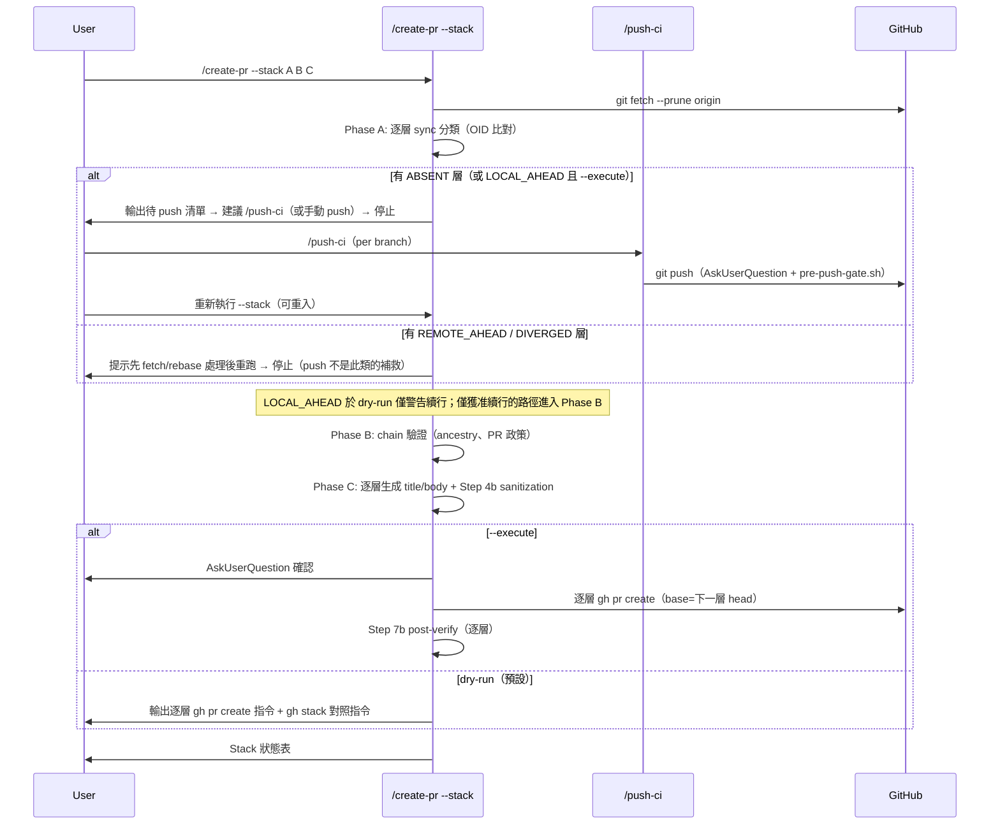

# create-pr Stacked PR Mode Technical Spec

> **Doc class**: Lifecycle — Phase 2 tech spec (per `@rules/docs-numbering.md`)
> **Created**: 2026-07-31
> **Requirements**: [Link](./1-requirements.md)

## 1. Requirement Summary

- **Problem**: 多 Agent 開發下大功能需要拆成相依 PR 鏈；現行 `/create-pr` 只有 body 註記 `Stacked on #N` 與 Multi-PR Mode，GitHub 端不理解依賴。GitHub 原生 Stacked PR（2026-07-30 public preview）提供正式建模，但其 CLI（`gh stack submit/rebase/push`）內含 branch push、rebase、force-with-lease——全部落在 Anchor Register #4 禁止清單。
- **Goals**: 在**不修改 Anchor #4 例外清單**的前提下，用既有授權工作流組合出 stacked PR 工作流：branch push → `/push-ci`，PR create/edit → `/create-pr` 既有 `--execute` 契約（SKILL.md Step 5a、Steps 6-7），`gh stack` 系列 → dry-run 輸出由使用者自行執行。
- **Scope**: In — `/create-pr` 新增 `--stack` 模式（chain 驗證、逐層 PR 建立/更新、狀態表、環境偵測與降級）、`/push-ci` 多 branch 支援評估、配套測試。Out — 自動執行任何 `gh stack` 指令、cascading rebase 的自動傳遞、auto-merge/merge queue 整合、cross-fork。

本 spec 同時**裁決** `1-requirements.md` § Open Questions 之首：v1 採組合方案（`/push-ci` + `/create-pr`），不啟動 Anchor-level 變更。

## 2. Existing Code Analysis

| Module | 現況 | 與本功能的關係 |
|--------|------|----------------|
| `skills/create-pr/SKILL.md`（294 行） | create/update/dry-run/execute 矩陣；Step 4b sanitization、Step 7b post-verify；Multi-PR Mode（`:257`）與 `Stacked on #N` 註記（`:268`） | 主要修改點：新增 `--stack` 模式，重用 Steps 2-4（title/body 生成）、4b、5a、7b |
| `skills/push-ci/SKILL.md` | 推**當前 branch**，AskUserQuestion（advisory）+ `pre-push-gate.sh`（每次 push 的 policy gate；`/dev/tty` 終端確認限 protected branches，non-fast-forward 為 policy 阻擋、僅授權的 lease 契約放行）；成功後委派 `/watch-ci` | stack 的 branch push 授權路徑；限制：單次單 branch（§3.4 Phase A、§7） |
| `skills/epic-merge/SKILL.md` | linear chain 驗證（Phase 0）、backup tags、逐 PR squash-merge | chain 驗證邏輯可對齊重用；合併端維持其職責，本功能不重疊 |
| `skills/pr-summary/SKILL.md:44` | 以「base 非 main/master/develop」啟發式偵測 stacked PR | 消費端；`--stack` 產生的 chained-base PR 天然可被其偵測 |
| `test/skills/create-pr-sanitization.test.js` | Step 4b/7b 的 regression 測試 | 全數保留；新測試另立 `test/skills/create-pr.test.js` |
| `scripts/commit-msg-guard.sh` | forbidden pattern 唯一來源 | 逐層 PR title/body 沿用 |

**環境事實**（2026-07-31 實測）：`gh` 2.95.0 已安裝；`gh-stack` extension 未安裝；repo 是否被 preview rollout 覆蓋未驗證。

## 3. Technical Solution

### 3.1 Architecture Design

授權分層是本設計的骨架——三類操作、三條既有路徑，皆不觸碰 Anchor #4 例外清單：

| 操作類別 | 執行者 | 授權依據 |
|----------|--------|----------|
| `gh pr create` / `gh pr edit` | `/create-pr --stack --execute` | 既有 Step 5a / Steps 6-7 契約（AskUserQuestion per run） |
| `git push`（各層 branch，非 force） | `/push-ci`（逐 branch 或 §7 的 `--branches` 擴充） | Anchor #4 既有例外：AskUserQuestion + `pre-push-gate.sh` |
| `gh stack init/add/submit/rebase/push/modify` | **使用者本人**（skill 僅輸出指令） | 不在 Claude 執行範圍，無需授權 |



### 3.2 Data Model

Stack chain 為記憶體內的有序結構，不落地任何狀態檔（Phase B 以 GitHub 查詢重建狀態、Phase C 據以可重入分流）。所有欄位在 `git fetch --prune origin` 之後取值（`--prune` 確保已刪除的 remote branch 不會以 stale ref 混入），一律以 **remote refs** 為準：

```
chain := [ layer_1, ..., layer_N ]   # 底層在前；宣告的 base 關係須通過 Phase B ancestry 驗證，非僅列表順序
layer := {
  head:       branch name,
  base:       main（layer_1）或 layer_{i-1}.head,
  local_oid:  git rev-parse <head>（本地存在時）,
  remote_oid: git rev-parse origin/<head>（fetch 後）,
  sync:       ABSENT | IN_SYNC | LOCAL_AHEAD | REMOTE_AHEAD | DIVERGED,   # 由兩個 OID + merge-base 分類
  pr:         { number, baseRefName, state } | null,
              # 查詢：gh pr list --head <head> --state all --json number,baseRefName,state
              # （gh pr list 預設僅回 OPEN，必須帶 --state all 才能看到 CLOSED/MERGED 與異 base 的 PR）
  commits:    git log origin/<base>..origin/<head> --oneline 計數   # 內容生成一律取自 remote 快照
}
```

### 3.3 CLI Surface

```
/create-pr --stack <branch...>        # 顯式指定 chain（底層在前）；dry-run 預設
/create-pr --stack                    # 自動偵測：從當前 branch 沿 base 關係回溯至 main
/create-pr --stack --execute          # 逐層 gh pr create/edit（AskUserQuestion 確認）
/create-pr --stack --update           # 既有 stack 逐層刷新 title/body（重用 Step 5a）
```

與既有旗標的互動：`--base` 僅作用於最底層（預設 `main`）；`--title` 在 stack 模式禁用（逐層自動生成，避免同名）；`--head` 與 `--stack` 互斥。

### 3.4 Core Logic

**Phase A — Sync 分類與 push 委派**（最先執行：後續一切驗證與內容生成都依賴 remote refs，remote ref 不存在時 ancestry/commit-range 指令根本無法跑）。先 `git fetch --prune origin`（`--prune` 清除已刪除的 stale remote-tracking refs），逐層以 `local_oid` / `remote_oid` / merge-base 分類 `sync`：

| sync | 意義 | dry-run | `--execute` |
|------|------|---------|-------------|
| `IN_SYNC` | remote 與本地一致；或僅 remote 存在（`REMOTE_ONLY` 視同 IN_SYNC——無本地 branch 時，fetch 後的 remote OID 即權威狀態） | 續行 | 續行 |
| `LOCAL_AHEAD` | 本地有未 push commits（remote ref 存在但落後） | 續行 + 警告（內容取自 remote 快照，可能過時） | 拒絕啟動 |
| `ABSENT` | remote ref 不存在 | **中止於 PR 規劃前**：輸出待 push 清單後停止（無 remote ref 即無法生成內容） | 拒絕啟動 |
| `REMOTE_AHEAD` / `DIVERGED` | remote 較新或分岔 | 中止該層：提示先 fetch/rebase 由使用者處理 | 拒絕啟動 |

待 push 清單輸出兩條路徑供選：(1) 逐 branch `/push-ci`（現行契約，需 checkout 各 branch）；(2) 可複製的 `git push origin -- 'b1' 'b2' 'b3'` 指令由使用者自行執行（`--` 為 option terminator，與 Shell 安全契約一致）。**本 skill 不執行 push**。Push 完成後重新執行 `--stack`（可重入），全層 remote refs 齊備才進入 Phase B。`ls-remote` 只證明 remote branch 存在、不證明同步——這是本 Phase 以 OID 比對取代它的原因；PR 內容（title/body/commit 計數）一律生成自 `origin/<base>..origin/<head>`，杜絕「PR body 描述了 GitHub 上不存在的 commits」。

**Phase B — Chain 驗證**（僅在所需 remote refs 齊備後執行；ancestry 檢查為真實拓撲驗證，非列表順序自我比對）：

| 檢查 | 方法 | 失敗處置 |
|------|------|----------|
| 線性 ancestry：每組相鄰層 `origin/<lower-head>` 是 `origin/<upper-head>` 的祖先 | `git merge-base --is-ancestor origin/<lower> origin/<upper>` | 中止：說明 stack 僅支援線性依賴（FR-5 / UC-6） |
| 每層有 unique commits | `git log origin/<base>..origin/<head>` 非空 | 中止：空層無意義 |
| 既有 PR 政策（單一政策）：每層的 PR 必須「OPEN 且 `baseRefName` = chain 宣告的 base」或 ABSENT | `gh pr list --head <head> --state all --json number,baseRefName,state`；多筆符合、CLOSED、MERGED、base 不符 → 皆中止並列明衝突 | 中止：要求人工處理衝突 PR |
| 層數 | 空 chain 且無引數 → 進自動偵測；空 chain 且顯式引數 → 錯誤；單層 → 中止並建議一般 `/create-pr`；2–5 正常；>5 警告不中止 | 依左列 |

**自動偵測（無引數）僅允許權威來源**：由當前 branch 的既有 PR base 關係、或 native stack metadata（可用時）回溯至 main。Git branch 本身不記錄「意圖中的 base」，因此無既有 PR 亦無 native metadata 時 → 要求顯式 chain，模糊即 STOP，不猜測。Dirty working tree **警告不中止**（v1 mutation 全部是遠端 `gh pr` 操作，內容一律取自 fetch 後的 remote refs——本地未提交內容不影響輸出）。

**Shell 安全（輸出與執行雙軌，涵蓋所有動態欄位）**：git 允許 branch 名含 shell metacharacters（`;`、`$( )`、`&`、引號均可通過 `git check-ref-format --branch`；leading `-` 會被其拒絕，但對 CLI 引數仍以 `--` 分隔符防禦 option 誤讀）。契約：(1) 所有**輸出供複製**的指令，動態值（branch、title）一律經 single-quote shell escaping 呈現；(2) **body 為動態欄位**——沿用 Step 5a/6 的 heredoc 模式時，delimiter 不得固定為 `'EOF'`（body 內含一行 `EOF` 即提早終止、其餘內容被當 shell 輸入），必須選用經驗證不存在於 body 內容的 delimiter，或改以暫存檔 `--body-file <file>` 生成；(3) skill **自身執行**的指令一律以引數陣列傳遞、不經 shell 字串內插；(4) 測試含 hostile 案例：惡意 ref 與「body 內含 delimiter 行 + shell metacharacters」的 regression fixture（§6）。

**Phase C — 逐層 PR create/edit（可重入）**：由底至頂逐層：以 Phase B 已取得的 `pr` 欄位分流 → 存在（OPEN、base 相符）則走 update（Step 5a smart diff），ABSENT 則 create。每層 title/body 走 Steps 2-4 + 4b。**依賴標記契約**（原則：編號已知就用 `#<N>`，未知才用 branch 標記——不輸出無法解析的佔位符）：

| 情境 | body 依賴標記 |
|------|---------------|
| dry-run，下層 PR 已存在（編號已知） | `Stacked on #<N>` |
| dry-run，下層 PR ABSENT（編號不存在） | `` Stacked on `<下層 head branch>` ``（branch 名標記，可直接執行不留佔位符） |
| `--execute`（由底至頂依序建立，下層編號已知） | `Stacked on #<N>` |
| `--stack --update` | 將殘留的 branch 名標記升級為 `#<N>`（此時各層 PR 皆已存在） |

失敗即 fail-fast：停止後續層，輸出各層狀態（succeeded / failed / pending）；重跑時已建立的層被 Phase B 偵測為既有 PR 進入 update mode，不重複建立（NFR-2、Signal 7）。

**Phase D — 環境偵測與 native 對照**：`gh extension list | grep stack` + （rollout 偵測待 preview API 確認，§7）。`gh-stack` 可用時，dry-run 輸出附上等價的 `gh stack` 指令序列（`init/add/submit`）供使用者自行選用 native 路徑；不可用時輸出說明缺件與安裝指令。兩條路徑產物一致皆為 chained-base PR；native 路徑額外獲得 GitHub stack 物件（單層 diff 檢視、merge 連動）——差異在輸出中明示。

**Update 流程**：使用者自行執行 `gh stack rebase --upstack` + `gh stack push` 後（SHA 改寫），`/create-pr --stack --update` 逐層刷新 title/body；CI 監控可另接 `/watch-ci`。

## 4. Risks and Dependencies

| # | 風險/依賴 | 影響 | 緩解 |
|---|-----------|------|------|
| R1 | `/push-ci` 單次僅推當前 branch，N 層 chain 需 N 次 checkout+invoke，體驗差 | 中 | §7 Q1：評估 `--branches` 擴充；v1 先以「輸出手動 push 指令」為主路徑 |
| R2 | `skills/push-ci/SKILL.md` Authorization 表（`:25`）標 `--force-with-lease` Forbidden，但 Arguments/Phase 2/Examples 均支援——既有文件內部矛盾 | 低（不阻擋本功能；v1 無 force push） | 已記錄；應在 push-ci 的獨立修正中解決，非本 feature 範圍 |
| R3 | Public preview API/CLI 行為變動；rollout 偵測方式未定 | 中 | Phase D 偵測失敗一律降級為非 native 路徑；native 對照輸出標註 preview |
| R4 | 手動 `gh pr create` 產生的 chained-base PR 是否被 GitHub 識別為 native stack 物件——依現有文件推定**否** | 中（使用者期待落差） | 輸出中明示兩條路徑的差異（§3.4 Phase D）；不宣稱 native 等價 |
| R5 | cascading rebase 後多層 force-with-lease push 無授權路徑（`/push-ci` 表禁止、`/epic-merge` 限合併流程） | v1 無影響（rebase 由使用者執行） | v2 若要自動傳遞，屆時才是 Anchor-level 議題 |
| R6 | SKILL.md 行數 294 + 新模式可能逼近 500 行上限 | 低 | stack 模式細節放 `skills/create-pr/references/stack-mode.md`，SKILL.md 留摘要與入口 |

## 5. Work Breakdown

| # | 任務 | 產出 | 規模 | 依賴 |
|---|------|------|------|------|
| W1 | `/create-pr` SKILL.md 新增 `--stack` 模式（Phase A-D、CLI surface、與既有旗標互動、降級訊息） | `skills/create-pr/SKILL.md` + `references/stack-mode.md` | M | — |
| W2 | 新測試：chain 驗證、可重入、降級、拒絕、sanitization 逐層套用 | `test/skills/create-pr.test.js`（新） | M | W1 |
| W3 | `/push-ci --branches` 擴充評估與（若採納）實作 | `skills/push-ci/SKILL.md` + 測試 | S | §7 Q1 裁決 |
| W4 | Doc sync：`1-requirements.md` Open Question 裁決記錄、`docs/skill-catalog.yml` create-pr 條目 | docs | S | W1 |

## 6. Testing Strategy

依 `@rules/testing.md`（skill 測試慣例同 `test/skills/create-pr-sanitization.test.js`：對 SKILL.md 內容做契約斷言）：

| 層 | 覆蓋 | 案例 |
|----|------|------|
| Unit（SKILL.md 契約） | `--stack` 章節存在性與關鍵契約字串：不執行 push 的聲明、fail-fast + 各層狀態、可重入 update 偵測、`merge-base --is-ancestor` ancestry 驗證、`--state all` PR 查詢、OID sync 分類、single-quote escaping 要求、依賴標記三模式、降級訊息、`--title` 禁用 | happy path + 邊界（空 chain、單層中止、>5 層警告、全新三層 dry-run 用 branch 標記） |
| Unit（契約細節） | PR 政策拒絕案例：CLOSED / MERGED / base 不符 / 多筆符合；sync 案例：`ABSENT` 中止於 PR 規劃前、`LOCAL_AHEAD` dry-run 警告 execute 拒絕、`REMOTE_AHEAD`/`DIVERGED` 中止；自動偵測無權威來源 → STOP；hostile 案例：ref 含 `;`、`$( )`、`&`、引號之 escaping 斷言、CLI 引數 `--` 分隔、body 內含 delimiter 行 + metacharacters 之 heredoc regression | 新增於 `test/skills/create-pr.test.js` |
| Unit（regression） | 既有 sanitization 測試全數通過無刪減 | `create-pr-sanitization.test.js` |
| Manual（`/feature-verify`） | 實際三層 chain dry-run；`gh-stack` 未安裝降級；`--execute` 於測試 repo 逐層建立 + 模擬第二層失敗後重入 | 對應 Signals 1、2、7 |

安全/資料完整性相關 AC（不執行 push/rebase、sanitization 逐層）不設 manual exception（testing.md ❌ Never 列）。

## 7. Open Questions

- [ ] **Q1**：`/push-ci --branches b1 b2 b3`（多 branch、非 force、單次 AskUserQuestion 列出全部 + `pre-push-gate.sh` 逐 push 把關）是否屬於 Anchor #4 既有例外「`/push-ci` (push)」的範圍內擴充？本 spec 的讀法是**是**（工作流與雙層 gate 皆未變，僅引數面擴大），但因觸及 Anchor 所指名的工作流，採納前需人工確認。v1 不阻塞於此：主路徑為輸出手動 push 指令。
- [ ] **Q2**：repo 是否已被 preview rollout 覆蓋、rollout 偵測的可靠訊號（API 欄位或 CLI 行為）——待實測。
- [ ] **Q3**：R4 的推定（手動 chained-base PR ≠ native stack 物件）待 rollout 後實測確認。
- [ ] **Q4**：`stack metadata`（`github.event.pull_request.stack.*`）欄位實測後，本 repo CI 是否需要分層策略——延續 `1-requirements.md` 的 open question，不在 v1。

## References

- [Requirements](./1-requirements.md) — FR/NFR/constraints 編號的定義來源
- `skills/create-pr/SKILL.md`、`skills/push-ci/SKILL.md`、`skills/epic-merge/SKILL.md`
- `rules/discretion.md` § Anchor Register #4
- [GitHub Changelog — Stacked PRs public preview](https://github.blog/changelog/2026-07-30-stacked-pull-requests-are-now-in-public-preview/)
