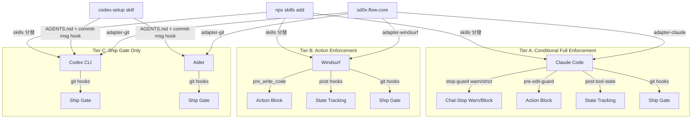
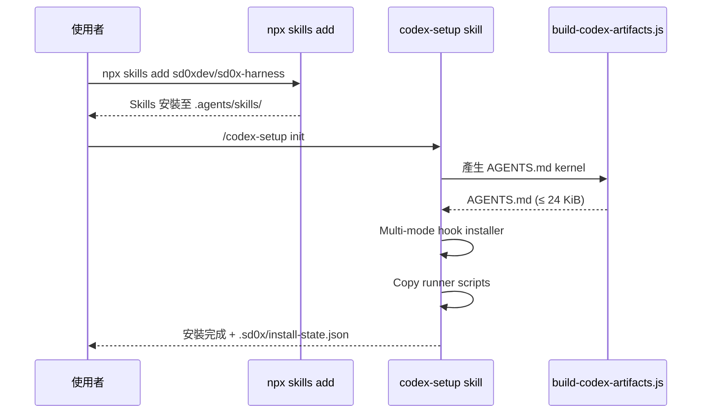
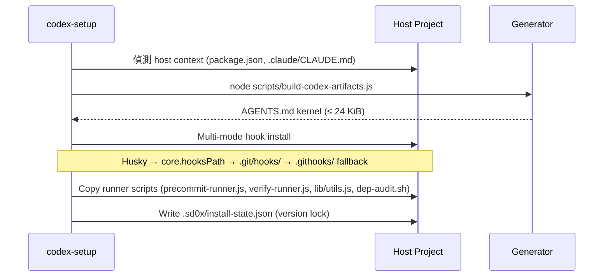
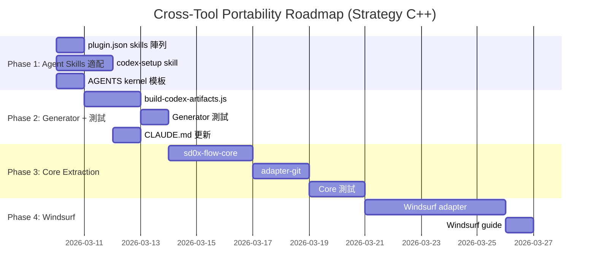

# Cross-Tool Portability Technical Spec

## 1. Requirement Summary

- **Problem**: sd0x-dev-flow 目前僅支援 Claude Code runtime。使用者希望在 OpenAI Codex CLI、Cursor、Windsurf、Aider 等 AI coding tools 上使用相同的開發流程規範。
- **Goals**:
  1. 定義 Tiered Guarantee Model（A/B/C 三級保證）
  2. 適配 Agent Skills 標準（`npx skills add`），啟用跨 37+ 工具的 skill 分發
  3. 建立 `codex-setup` skill 處理 AGENTS.md / git hooks / scripts 基建
  4. AGENTS.md kernel generator（byte-budgeted，≤ 24 KiB）
  5. 為 Windsurf 提供 adapter（Phase 3）
- **Scope**:
  - IN: Agent Skills 標準適配（plugin.json skills 陣列）、codex-setup skill、AGENTS kernel generator、git hook multi-mode installer、Windsurf adapter
  - OUT: 62 commands 全量移植、Cursor adapter（等 hooks 穩定）
- **Strategy**: C++（Nash Equilibrium — debate thread `019cd0e3-aa86-7923-8a79-6bfa10f78596`）
  - `npx skills add` 做 skills 分發（標準生態）
  - `codex-setup` skill 做 AGENTS.md / hooks / scripts 基建
  - Generator 從 `rules/*.md` 單一正本產出 AGENTS kernel

## 2. Existing Code Analysis

### 2.1 Plugin Architecture

```
sd0x-dev-flow/
├── CLAUDE.md              # 專案指令（Claude Code specific）
├── commands/*.md           # 62 slash commands（大多數含 frontmatter + allowed-tools）
├── skills/*/SKILL.md       # 46 skills（context: fork, @refs）
├── rules/*.md              # 11 rules（純 Markdown，可移植）
├── hooks/                  # 4 lifecycle hooks（Claude Code specific）
│   ├── hooks.json
│   ├── post-tool-review-state.sh
│   ├── stop-guard.sh
│   ├── pre-edit-guard.sh
│   └── post-edit-format.sh
├── scripts/                # 7 scripts（獨立可用，top-level）
│   ├── precommit-runner.js
│   ├── verify-runner.js
│   ├── commit-msg-guard.sh
│   └── pre-push-gate.sh
├── agents/*.md             # 14 agent definitions（Claude Code specific）
└── .claude-plugin/         # Plugin manifest（Claude Code specific）
```

### 2.2 可移植性分層

| 元件 | 依賴項 | 可移植性 | Strategy C++ 對策 |
|------|--------|----------|-------------------|
| commands/*.md | 大多數含 `allowed-tools` frontmatter, `@skills/` refs, `!` context checks | 不可移植 | 不移植；提供 prompt recipes |
| skills/*/SKILL.md | `name` + `description` frontmatter | **可移植**（Agent Skills 標準） | `npx skills add` 直接安裝 |
| hooks/*.sh | `hooks.json` 4 lifecycle events (SessionStart, PreToolUse, PostToolUse, Stop) | 不可移植（需 adapter） | Tier B adapter（Phase 3） |
| rules/*.md | 純 Markdown 內容 | 可移植 | Core rules 嵌入 AGENTS kernel；Extended rules 透過 skills 載入 |
| scripts/*.sh/.js | 標準 shell/Node.js | 可移植 | `codex-setup init` 自動複製 |
| Git hooks (commit-msg 預設、pre-push opt-in) | 標準 git hooks | 可移植 | `codex-setup init` multi-mode installer（`pre-push` 需 `--with-push-gate`） |

### 2.3 各工具指令系統對照

| Feature | Claude Code | Codex CLI | Cursor | Windsurf | Aider |
|---------|-------------|-----------|--------|----------|-------|
| Project instructions | CLAUDE.md | AGENTS.md | .cursor/rules/ | .windsurfrules | CONVENTIONS.md |
| Slash commands | commands/*.md | Custom commands | Custom modes | Workflows | /commands |
| Hooks | hooks.json | notify (limited) | Beta hooks | pre/post hooks | -- |
| Rules | rules/*.md | AGENTS.md merged | .cursor/rules/*.mdc | .windsurfrules | CONVENTIONS.md |
| **Skills** | **skills/\*/SKILL.md** | **`.agents/skills/`** | **skills/** | **skills/** | **--** |
| **Skill install** | **Plugin system** | **`npx skills add`** | **`npx skills add`** | **`npx skills add`** | **--** |
| MCP | Native | Native (config.toml) | Native | Native | -- |
| Tool sandboxing | allowed-tools | approval-policy | -- | -- | -- |

### 2.4 Agent Skills 標準相容性分析

sd0x-dev-flow 的 SKILL.md 格式與 Agent Skills 標準（Vercel `skills` CLI）的相容性：

| 項目 | Agent Skills 要求 | sd0x-dev-flow 現狀 | Gap |
|------|-------------------|-------------------|-----|
| SKILL.md frontmatter | `name` + `description` | 已有 `name` + `description` | 無 |
| 目錄結構 | `skills/<name>/SKILL.md` | 完全相符 | 無 |
| plugin.json `skills` 陣列 | 必須列出所有 skills | **缺少** | P0 blocker |
| Skill 安裝目標 | `.agents/skills/`（Codex）/ `.claude/skills/`（Claude） | -- | 由 CLI 處理 |

**結論**：就 Agent Skills 分發相容性而言，唯一 blocker 是 `plugin.json` 缺少 `skills` 陣列。修復後 skill distribution 層即可運作；完整 Day-1 runtime 仍需 `codex-setup` skill 及 kernel generator（見 Phase 1-2）。

## 3. Technical Solution

### 3.1 Architecture: Tiered Guarantee Model

> **Note（撰寫當時）**: Tier A 的 stop-guard 預設為 warn 模式（記錄但允許停止），設定 `STOP_GUARD_MODE=strict` 可啟用 blocking 模式。Tier C 的 git hooks 保證 commit 格式（AI trailer 偵測）、protected branch 確認、以及 non-fast-forward push 阻擋（可透過 `ALLOW_FORCE_WITH_LEASE=1` 豁免 `--force-with-lease` 工作流），review/precommit 品質結果需透過 CI server-side gate 或 pre-commit hook 強制。
>
> **Update（2026-08-13, hook-lightweighting）**: stop-guard 已改為純提醒（列出欠著的 gate、恆 exit 0），無 blocking 模式（`STOP_GUARD_MODE` 已廢止），`post-tool-review-state.sh` 已刪除。下方架構圖為撰寫當時的快照——Tier A 標示的「Conditional Full Enforcement」與 warn/strict 分支已不存在，現行契約見 `docs/features/hook-lightweighting/2-tech-spec.md`。本節其餘內容保留為記錄。



### 3.2 Strategy C++ 三層架構



| 層 | 負責元件 | 解決問題 |
|----|----------|----------|
| **L1: Skill 分發** | `npx skills add`（標準生態） | Skills 跨 37+ 工具安裝 |
| **L2: 基建安裝** | `codex-setup` skill | AGENTS.md kernel + commit-msg hook（pre-push opt-in）+ scripts |
| **L3: Runtime 適配** | sd0x-flow-core adapters | Hook lifecycle 映射（Tier A/B） |

### 3.3 Agent Skills 標準適配（L1）

#### plugin.json skills 陣列

```json
{
  "name": "sd0x-dev-flow",
  "version": "1.8.14",
  "skills": [
    { "name": "best-practices", "path": "skills/best-practices" },
    { "name": "codex-setup", "path": "skills/codex-setup" },
    { "name": "smart-commit", "path": "skills/smart-commit" },
    ...
  ]
}
```

生成方式：遍歷 `skills/*/SKILL.md`，提取 `name` frontmatter，自動產出陣列。

### 3.4 codex-setup Skill（L2）

#### Subcommands

| Command | Purpose |
|---------|---------|
| `init` | 初始安裝：AGENTS.md kernel + commit-msg hook + scripts（pre-push gate 需 `--with-push-gate` 才安裝） |
| `doctor` | 驗證安裝完整性（檔案存在 + hash 比對） |
| `sync` | `npx skills update` 後同步 AGENTS.md + 已安裝的 hooks；`--with-push-gate` 可在此補裝 pre-push gate |

#### init 流程



#### Multi-mode Hook Installer

| 優先序 | 偵測條件 | 安裝方式 |
|--------|----------|----------|
| 1 | `.husky/` 目錄存在 | Chain into Husky hooks（append sourcing） |
| 2 | `core.hooksPath` 已設定 | 安裝至該路徑 |
| 3 | `.git/hooks/` 可寫入 | 直接寫入 |
| 4 | Fallback | 寫入 `.githooks/` + 輸出 `git config` 指令 |

#### Sandbox 適應

| Codex sandbox | 行為 |
|---------------|------|
| `workspace-write` / `danger-full-access` | 自動執行全部 |
| `read-only` | 輸出手動執行命令清單 |

### 3.5 AGENTS.md Kernel Generator（L2）

#### 設計原則

**Single source of truth**：`rules/*.md` 是唯一正本。Generator 從中產出 AGENTS.md kernel，不嵌入全部 rules 全文。

#### Core/Extended Rule 分層

| 分層 | Rules | 處理方式 | 理由 |
|------|-------|----------|------|
| **Core**（~8 KiB） | auto-loop, codex-invocation, fix-all-issues, testing, security, git-workflow | 摘要嵌入 AGENTS kernel | 影響每次 commit 的行為規範 |
| **Extended** | docs-writing, docs-numbering, logging, framework, self-improvement | Skills progressive disclosure | 情境觸發，非每次必要 |

#### Byte Budget

| 元件 | 目標 | Hard Cap |
|------|------|----------|
| AGENTS kernel | ≤ 8 KiB | 24 KiB（留 8 KiB 給 host AGENTS.md 自有內容） |

> **32 KiB 限制實測**：CLAUDE.md（7,650 bytes）+ rules 全文（25,066 bytes）= 32,716 bytes，距限制僅 52 bytes。無法全量嵌入，kernel 摘要是唯一可行方案。

#### Kernel 結構模板

```markdown
# {PROJECT_NAME} — Development Rules (sd0x-dev-flow v{VERSION})

## Core Behavioral Requirements
- 編輯程式碼後必須執行 precommit 檢查再結束
- 發現問題必須修復，不可跳過
- 獨立研究，不接受餵食結論
- Quality workflow: develop → test → verify → precommit

## Available Scripts
| Script | Command | When |
|--------|---------|------|
| Precommit (fast) | node .sd0x/scripts/precommit-runner.js --mode fast | Before commit |
| Precommit (full) | node .sd0x/scripts/precommit-runner.js --mode full | Before PR |
| Verify | node .sd0x/scripts/verify-runner.js --mode full | After changes |

## Test Requirements
{auto-detected from host CLAUDE.md or package.json}

## Development Rules
1. Reference existing code — find similar files first
2. Test command: {TEST_COMMAND}
3. Author attribution: developer's GitHub username, never AI names
4. Git: feat/* | fix/* | docs/* | refactor/* branches; <type>: <subject> commits

## Security Minimums
- No MD5/SHA1 for security
- No direct execution of user input
- No logging of secrets

## Sentinel Vocabulary
| Sentinel | Meaning |
|----------|---------|
| ## Overall: PASS | All precommit checks passed |
| ## Overall: FAIL | Check failed |

## Detailed Rules
For full rule details, see the installed sd0x-dev-flow skills.
```

#### Placeholder 替換

| Placeholder | 來源 |
|-------------|------|
| `{PROJECT_NAME}` | host `package.json` name 或目錄名 |
| `{VERSION}` | `plugin.json` version |
| `{TEST_COMMAND}` | host CLAUDE.md 或 `package.json` scripts.test |

### 3.6 sd0x-flow-core 核心模組（L3）

```
sd0x-flow-core/
├── state.sh              # State model (read/write runtime state)
├── sentinel.sh           # Sentinel parser (✅ Ready, ⛔ Blocked, etc.)
├── gate.sh               # Gate checker (--require code_review,precommit)
└── adapters/
    ├── adapter-claude.sh  # Map to hooks.json lifecycle
    ├── adapter-windsurf.sh # Map to Windsurf pre/post events
    └── adapter-git.sh     # Map to git pre-commit/pre-push
```

#### State 檔案契約

本 spec 涉及兩個不同用途的 state 檔案：

| 檔案 | 用途 | 生命週期 | 現有實作 |
|------|------|----------|----------|
| `.claude_review_state.json` | Runtime review state（session 內 code/doc review + precommit 追蹤） | State-file-aware：不存在時初始化，之後持續更新（無自動 session reset） | hooks/post-tool-review-state.sh、hooks/post-edit-format.sh、hooks/stop-guard.sh |
| `.sd0x/install-state.json` | Install manifest（version lock + drift detection） | 跨 session 持久 | 新建（skills/codex-setup init 產出） |

> **Migration**：現有 `.claude_review_state.json` 維持不變（Tier A runtime 專用）。`.sd0x/install-state.json` 為全新檔案，與 runtime state 不重疊。**舊名稱遷移**：v1.8.15 之前安裝的 host 可能存有 `.sd0x-codex-state.json`；`codex-setup sync` 預計處理自動遷移（Phase 2 backlog，尚未實作）。

#### State Model（Runtime）

```json
{
  "session_id": "string",
  "updated_at": "ISO8601",
  "has_code_change": false,
  "has_doc_change": false,
  "code_review": { "executed": false, "passed": false },
  "doc_review": { "executed": false, "passed": false },
  "precommit": { "executed": false, "passed": false }
}
```

#### Sentinel Vocabulary

Hook parser（`post-tool-review-state.sh`）辨識的完整 sentinel 集合：

| Sentinel | Context | Meaning |
|----------|---------|---------|
| `✅ Ready` | Code review | No P0/P1 |
| `⛔ Blocked` | Code review | Has P0/P1 |
| `✅ Mergeable` | Doc review | No must-fix |
| `⛔ Needs revision` | Doc review | Has must-fix |
| `✅ All Pass` | Precommit | All checks passed |
| `## Overall: ✅ PASS` | Precommit | All checks passed（precommit-runner.js 格式） |
| `## Overall: ⛔ FAIL` / `## Overall: ❌ FAIL` | Precommit | Check failed（precommit-runner.js 格式） |
| `## Gate: ✅` | Generic | 條件性 sentinel — parser 依模式判斷是否辨識，非所有路徑皆觸發 |

### 3.7 Version Lock + Drift Gate

#### `.sd0x/install-state.json`

```json
{
  "sd0x_version": "1.8.14",
  "agents_md_hash": "<sha1>",
  "agents_md_size": 8192,
  "hooks_installed": {
    "commit-msg": { "status": "installed", "hash": "<sha1>", "mode": "direct" },
    "pre-push": { "status": "declined" }
  },
  "scripts_installed": {
    "precommit-runner.js": "<sha1>",
    "verify-runner.js": "<sha1>"
  },
  "generated_at": "ISO8601"
}
```

#### Drift Check

`pre-push-gate.sh` 可選整合：

```bash
# If .sd0x/install-state.json exists, warn on version drift
if [[ -f ".sd0x/install-state.json" ]]; then
  # Compare installed version vs plugin version
  # DRIFT_MODE=strict: block push; default: warn only
fi
```

### 3.8 Codex CLI Day-1 使用者流程

> **Phase 可用性**：此流程在 Phase 1-2 完成後可用。Phase 1-2 完成前，可使用既有的 `/install-hooks`、`/install-scripts`、`/install-rules` 作為 fallback。

```bash
# Step 1: 安裝 skills（標準生態）[Phase 1a 後可用]
npx skills add sd0xdev/sd0x-harness

# Step 2: 在 Codex CLI 中執行基建安裝 [Phase 1b + 2a 後可用]
codex> /codex-setup init

# Step 3: 驗證安裝 [Phase 1b 後可用]
codex> /codex-setup doctor

# 後續更新 [Phase 1b 後可用]
npx skills update sd0xdev/sd0x-harness
codex> /codex-setup sync
```

### 3.9 Windsurf Adapter（Phase 3）

映射 Claude Code hooks → Windsurf hook events：

| Claude Code Hook | Windsurf Event | Adapter 邏輯 |
|------------------|----------------|--------------|
| PostToolUse (Edit) | post_write_code | 更新 state: has_code_change=true |
| PostToolUse (Bash) | post_run_command | Parse sentinel, 更新 review/precommit state |
| Stop | -- | 無等價物，改用 pre_run_command 阻止 git commit |
| pre-edit-guard | pre_write_code | 檢查受保護檔案 |

## 4. Risks and Dependencies

| # | Risk | 影響 | 緩解 |
|---|------|------|------|
| 1 | Codex CLI AGENTS.md 只是被動指令，無法強制行為；commit-msg hook 保證 commit 格式，protected branch 確認與 non-fast-forward 阻擋則**僅在以 `--with-push-gate` 選裝 pre-push gate 後才存在**，且兩者都不驗證 review/precommit 品質結果 | Tier C 保證等級低；未選裝 pre-push gate 的 Tier C 專案**不存在任何 client-side push 防護**——`/push-ci` 的 AskUserQuestion 授權僅存在於 Claude Code（Tier A），commands 不在移植範圍（§ 1 Scope OUT），Tier C 使用者並未安裝它（`rules/git-workflow.md` § Push safety 的 AskUserQuestion 條款是 Tier A 機制） | commit-msg hook 作為格式閘道 + 選裝的 pre-push gate 作為 push 安全閘道 + CI server-side quality gate 作為品質閘道 |
| 2 | Windsurf hooks API 可能變更 | adapter 需持續維護 | Pin 版本 + 相容性測試 |
| 3 | Cursor hooks 為 beta | 不適合立即投入 | 等穩定後再開發 adapter |
| 4 | 32 KiB AGENTS.md 限制 | CLAUDE.md + rules 全文 = 32,716 bytes，僅差 52 bytes 超標 | Core/Extended rule 分層 + kernel 摘要（≤ 8 KiB） |
| 5 | `npx skills add` 為第三方 CLI（Vercel） | 供應鏈依賴 + API 變更風險 | `.sd0x/install-state.json` 記錄安裝狀態 + `codex-setup doctor` 驗證安裝完整性 + **Planned**：Pin `skills` CLI 版本於 `package.json` devDependencies（Phase 1a 追加）+ 提供 manual install fallback 文件（Phase 1b setup guide 包含） |
| 6 | 62 commands 無法自動移植 | 使用者體驗落差大 | 提供 top-20 prompt recipe 文件 |
| 7 | State file 路徑/格式跨工具一致性 | 多工具共用同一 repo 可能衝突 | Runtime state 維持 `.claude_review_state.json`（Tier A 專用）；install manifest 使用 `.sd0x/install-state.json`（跨工具通用） |
| 8 | Version drift（plugin 更新但 AGENTS.md 未同步） | 規則不一致 | `codex-setup sync` + drift gate 偵測 |

## 5. Work Breakdown

| Phase | 任務 | 交付物 | 前置 |
|-------|------|--------|------|
| **1a** | plugin.json skills 陣列（P0 blocker） | `.claude-plugin/plugin.json` 修改 | -- |
| **1b** | codex-setup skill（SKILL.md + scripts） | `skills/codex-setup/` | -- |
| **1c** | AGENTS.md kernel 模板 | `skills/codex-setup/references/agents-kernel.md` | -- |
| **2a** | build-codex-artifacts.js（kernel generator） | `scripts/build-codex-artifacts.js` | 1c |
| **2b** | Generator 測試 | `test/scripts/build-codex-artifacts.test.js` | 2a |
| **2c** | CLAUDE.md × 3 更新 | CLAUDE.md, .claude/CLAUDE.md, CLAUDE.template.md | 1b |
| **3a** | sd0x-flow-core（state + sentinel + gate） | `scripts/core/*.sh` | -- |
| **3b** | adapter-git（pre-commit integration） | `scripts/core/adapters/adapter-git.sh` | 3a |
| **3c** | sd0x-flow-core 測試 | `test/scripts/core/*.test.js` | 3a, 3b |
| **4a** | Windsurf adapter | `scripts/core/adapters/adapter-windsurf.sh` | 3a |
| **4b** | Windsurf setup guide | `docs/guides/windsurf-setup.md` | 4a |



## 6. Testing Strategy

| 層級 | 測試目標 | 方法 |
|------|----------|------|
| Unit | build-codex-artifacts.js kernel 產出 | `test/scripts/build-codex-artifacts.test.js` |
| Unit | Kernel size ≤ 24 KiB | assert bytes ≤ 24576 |
| Unit | Placeholder 替換正確性 | `{PROJECT_NAME}`, `{TEST_COMMAND}` 替換驗證 |
| Unit | plugin.json skills 列舉完整性 | 所有 `skills/*/SKILL.md` 皆列入 |
| Unit | state.sh read/write | `test/scripts/core/state.test.js` |
| Unit | sentinel.sh parsing | `test/scripts/core/sentinel.test.js` |
| Unit | gate.sh decision logic | `test/scripts/core/gate.test.js` |
| Integration | adapter-git + pre-commit flow | `test/scripts/core/adapter-git.test.js` |
| Integration | codex-setup init 端對端 | 建立 temp repo → init → doctor → 驗證產出 |
| Manual | `npx skills add` 跨工具安裝 | Checklist: install → Codex CLI 載入 → skill 可用 |
| Manual | Codex CLI day-1 workflow | Checklist: install → init → edit → review → commit |
| Manual | Windsurf adapter hook events | Checklist: edit → state update → commit block |

## 7. Open Questions

| # | Question | Owner | Status |
|---|----------|-------|--------|
| 1 | Dual verification 在非 Claude 環境用什麼 LLM 作第二意見？ | Architect | Open |
| 2 | ~~AGENTS.md 的 32 KiB 限制是否足夠承載精簡版 rules？~~ | Dev | **Resolved** — 不足（差 52 bytes），改用 kernel 摘要 |
| 3 | Cursor hooks 何時脫離 beta？是否值得提前投入？ | PM | Open — 追蹤 changelog |
| 4 | ~~是否需要 `sd0x-flow` CLI wrapper 統一入口？~~ | Architect | **Resolved** — 不需要，用 `npx skills add` + `codex-setup` skill |
| 5 | Aider 的 `--auto-lint` / `--auto-test` 是否能替代部分 precommit？ | Dev | Open |
| 6 | `npx skills add` 是否支援 private registry / monorepo 安裝？ | Dev | Open — 需驗證 |
| 7 | Extended rules 以 skills 載入時，Codex CLI 能否在 session 中動態引用？ | Dev | Open — 需測試 skill read 行為 |

## Appendix: Brainstorm Evidence

### A.1 Tiered Enforcement Debate

- **Debate Thread ID**: `019ccd93-07ab-7dd2-b88d-0320558a1217`
- **Rounds**: 3（R1: transpiler 可行性攻擊 → R2: tiered guarantees 修正 → R3: day-1 setup 收斂）
- **Result**: Nash Equilibrium — tiered enforcement + manual adapter

### A.2 Installation Strategy Debate（Strategy C++）

- **Debate Thread ID**: `019cd0e3-aa86-7923-8a79-6bfa10f78596`
- **Rounds**: 3（R1: 自建 vs Agent Skills 標準 → R2: 32 KiB budget 攻擊 → R3: Core/Extended 分層收斂）
- **Result**: Nash Equilibrium — `npx skills add` + `codex-setup` skill + kernel generator
- **Key Finding**: CLAUDE.md + rules 全文 = 32,716 bytes（距 32 KiB 限制僅 52 bytes），不可能全量嵌入
