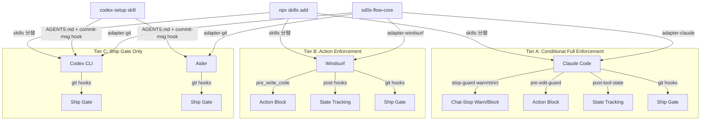
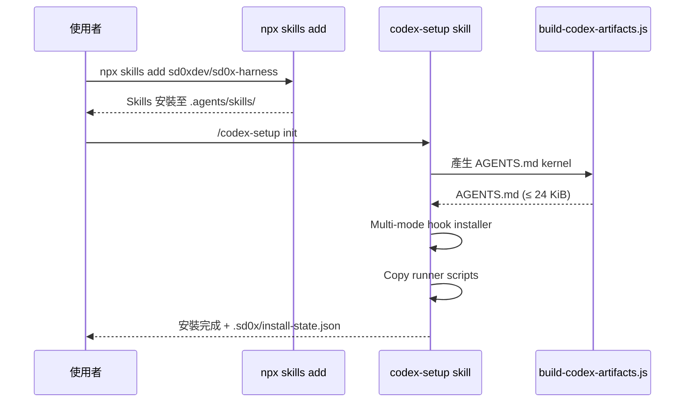
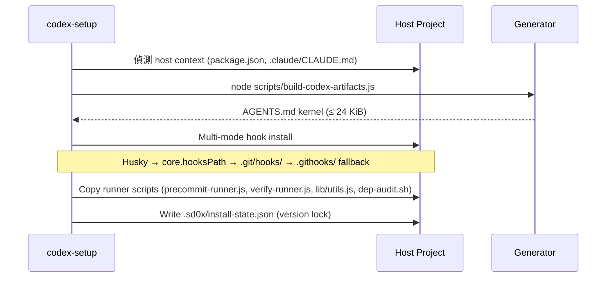
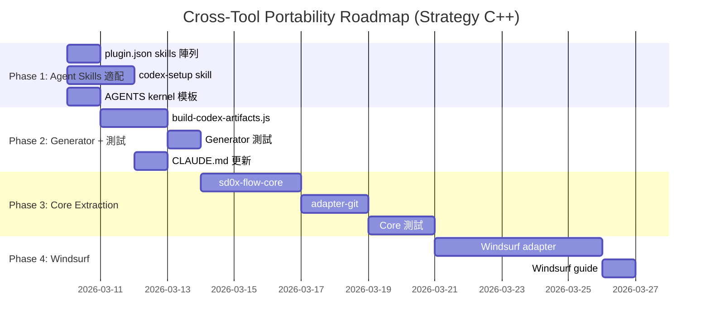

# Cross-Tool Portability Technical Spec

> **這是一份設計記錄（design record），不是現況權威。** 原始決策日 **2026-03-09**（`d04f582`）。它陳述當時決定了什麼；與今日程式碼脫節是記錄正常運作，**不要就地改寫**成現行行為——後續變更一律以帶日期的 `> **Update（…）**` 註記表述，並區分「決議日」與「實際生效日」。現行行為請看 [git-workflow.md](../../../rules/git-workflow.md) § Push safety、[codex-setup](../../../skills/codex-setup/SKILL.md) 與各 feature 的當前權威文件。
>
> **「生效」在本檔的定義（2026-08-20 round 16 補訂）**：下方每一則 `> **Update（…）**` 註記都同時陳述兩件事，**不可互推**——(1) **本 checkout 的工作樹**是否已有該實作：有，則此 checkout 的 `skills/**` 指令面即照新行為執行；(2) **`HEAD` 是否已含該實作**：未含，則凡是從 `HEAD`（或由其產生的 release）取得本 plugin 的安裝，行為仍是舊的。「未提交」只回答第 (2) 題，**不等於「工作樹裡也沒作用」**——指令面是被讀取執行的文件，不是編譯產物。
>
> **既有的就地改寫（2026-08-20 doc review 盤點，於此保存原文以免資訊淨損失）**：
>
> | Commit | 日期 | 就地改寫了什麼 | 原文 |
> |--------|------|----------------|------|
> | `a9f9ce6` | 2026-03-09（原始 commit 後約 4 小時） | install manifest 檔名與 runner script 安裝路徑，共 12 處：sequenceDiagram ×2、runner 指令表 ×3、state 檔案表 ×1、`####` 標題 ×1、bash drift 偵測 ×2、Risk 5／Risk 7 各 ×1，以及 § 3.6 Migration 整段 | **本文一律不還原**（2026-08-21 定案）：記錄只增不刪，把已提交的就地改寫再改回去是**第二次**改寫，不是修復。本文因此保留 `a9f9ce6` 的字句，此表只記錄它是就地改寫。`d04f582` 的改寫前原文以 `git show d04f582:docs/features/cross-tool-portability/2-tech-spec.md` 取回；`a9f9ce6` 的後像以 `git show a9f9ce6 -- docs/features/cross-tool-portability/2-tech-spec.md` 取回 |
> | `3224ba2` | 2026-08-13 | § 3.1 的 `> **Note**:` 標籤就地改為 `> **Note（撰寫當時）**:`（同一 commit 另**追加**了 2026-08-13 hook-lightweighting 的 Update 註記——追加合規，改標籤不合規） | **標籤不還原**（同上）：本文保留 `3224ba2` 寫下的 `> **Note（撰寫當時）**:`；`d04f582` 的原標籤 `> **Note**:` 以 `git show d04f582:docs/features/cross-tool-portability/2-tech-spec.md` 取回。該 commit 追加的 Update 註記**內容未改**，它正是這條 Note 的時態限定 |
> | `2692ede` | 2026-08-16 | **兩類，不只一類**：(a) 三處 `npx skills` 範例中的 repository locator；(b) **六處 push-gate 設計主張**——§2.2 hooks 列、§3.1 架構圖兩條邊、§3.2 L2 列、§3.4 `init`／`sync` 指令表、§3.7 `hooks_installed` JSON、§4 Risk 1 | 兩類皆**不還原**（2026-08-21 定案，全檔一致）：正文即 `2692ede` 之後的字句，改寫前原文以 `git show d04f582:docs/features/cross-tool-portability/2-tech-spec.md` 取回。locator 在 `d04f582` 為 **`sd0xdev/sd0x-dev-flow`**，正文現為 `sd0xdev/sd0x-harness`，與今日正式名稱一致（`.claude-plugin/marketplace.json`）。**注意**：這六處是 `2692ede` **已提交**的改寫，不是未提交的工作樹改動——opt-in 的**實作**才是未提交的 |
>
> **舊佈局確實曾經為真**（2026-08-20 round 15 查證）：`988ba48`（2026-03-09 14:29:52）實作了頂層 `scripts/` 的 runner 與 `.sd0x-codex-state.json`；`d04f582`（14:30:03）記錄了它；`0aecf29`（18:17:35）才改成 `.sd0x/`；`a9f9ce6`（18:18:09）隨即就地改寫記錄。**處置（2026-08-21 定案）：正文一律不還原**——把已提交的就地改寫再改回去是第二次改寫，不是修復。正文因此是 `a9f9ce6` 之後的 `.sd0x/` 佈局；`d04f582` 記錄的舊佈局以 `git show d04f582:docs/features/cross-tool-portability/2-tech-spec.md` 取回，Migration 整段另逐字保存於 § 3.6 下方的日期註記。

> **篇幅處置（2026-08-21 round 25 提出、round 26 重測定案）**：`wc -l` 為 **581** 行，超過
> `@rules/docs-numbering.md` § Size Limit 的 500 行訊號，該節要求「動手，或說明為何這一檔不切比較好讀」。
> 說明如下，並先更正一項會誤導的量法：`grep -c '^## '` 回報 **15**，但其中七個（`## Core Behavioral
> Requirements` 起算）在 § 3 的 kernel 模板 code fence **之內**，不是章節。實際章節 **8** 個
> （`## 1.`–`## 7.` 加 Appendix），§ 3 為 132–469 共 **338** 行（58.2%）。
>
> **（量測紀律）** round 25 這則處置最初寫的是 539 行 —— 那是在同一輪編輯**尚未完成時**量的，
> 隨後追加的兩則更正註記使它立即過期，審查者實測到不同的數字。**編輯結束後才量，不要在中途量**；
> 上列數字是本輪全部編輯落地後重測的。
>
> **判定：維持不切。** 三個補救依序評估——**Prune** 不適用：本檔是 design record（分類器判定，見下段），
> 記錄裡「與今日脫節」的文字正是記錄在運作，刪掉就是唯一一份原文消失；**Merge** 不適用：八個章節各談
> 一件事，無重複段落；**Split** 會落在論證中間：唯一夠大的切點是 § 3，但 § 3 的每一小節都被上方那三張
> 「就地改寫盤點」表以節號引用，切出去之後那些指標全部要重寫，而重寫指向記錄的指標正是本檔一路在避免的
> 二次改寫。下次實質編輯時重新以 `wc -l` 量測；若 § 3 超過約 400 行，自然切點是 § 3.6 Migration 連同其
> 下方的逐字保存註記獨立成子檔。
>
> **對 doc review 的備註（2026-08-21 round 25）**：本檔曾被審查者判為「tech spec 屬 current authority，
> 故不得以日期註記表述、應就地改寫正文」。該前提與本專案的分類器不符，故不採納：
> `node scripts/classify-docs-cli.js --feature cross-tool-portability` 回報本檔
> `role: "Design record"`、`current_authority: []`；`skills/ask/SKILL.md` § Phase 2 亦明載「問現行行為
> 不要讀 tech spec —— 它記的是設計，不是出貨的東西」。本檔的日期註記體例因此是正確處置，不是缺陷。

## 1. Requirement Summary

- **Problem**: sd0x-dev-flow 目前僅支援 Claude Code runtime。使用者希望在 OpenAI Codex CLI、Cursor、Windsurf、Aider 等 AI coding tools 上使用相同的開發流程規範。
- **Goals**:
  1. 定義 Tiered Guarantee Model（A/B/C 三級保證）
  2. 適配 Agent Skills 標準（`npx skills add`），啟用跨 37+ 工具的 skill 分發
  3. 建立 `codex-setup` skill 處理 AGENTS.md / git hooks / scripts 基建
  4. AGENTS.md kernel generator（byte-budgeted，≤ 24 KiB）
  5. 為 Windsurf 提供 adapter（Phase 3）
- **Scope**:
  - IN: Agent Skills 標準適配（plugin.json skills 陣列）、codex-setup skill、AGENTS kernel generator、git hook multi-mode installer、Windsurf adapter
  - OUT: 62 commands 全量移植、Cursor adapter（等 hooks 穩定）
- **Strategy**: C++（Nash Equilibrium — debate thread `019cd0e3-aa86-7923-8a79-6bfa10f78596`）
  - `npx skills add` 做 skills 分發（標準生態）
  - `codex-setup` skill 做 AGENTS.md / hooks / scripts 基建
  - Generator 從 `rules/*.md` 單一正本產出 AGENTS kernel

## 2. Existing Code Analysis

### 2.1 Plugin Architecture

```
sd0x-dev-flow/
├── CLAUDE.md              # 專案指令（Claude Code specific）
├── commands/*.md           # 62 slash commands（大多數含 frontmatter + allowed-tools）
├── skills/*/SKILL.md       # 46 skills（context: fork, @refs）
├── rules/*.md              # 11 rules（純 Markdown，可移植）
├── hooks/                  # 4 lifecycle hooks（Claude Code specific）
│   ├── hooks.json
│   ├── post-tool-review-state.sh
│   ├── stop-guard.sh
│   ├── pre-edit-guard.sh
│   └── post-edit-format.sh
├── scripts/                # 7 scripts（獨立可用，top-level）
│   ├── precommit-runner.js
│   ├── verify-runner.js
│   ├── commit-msg-guard.sh
│   └── pre-push-gate.sh
├── agents/*.md             # 14 agent definitions（Claude Code specific）
└── .claude-plugin/         # Plugin manifest（Claude Code specific）
```

### 2.2 可移植性分層

| 元件 | 依賴項 | 可移植性 | Strategy C++ 對策 |
|------|--------|----------|-------------------|
| commands/*.md | 大多數含 `allowed-tools` frontmatter, `@skills/` refs, `!` context checks | 不可移植 | 不移植；提供 prompt recipes |
| skills/*/SKILL.md | `name` + `description` frontmatter | **可移植**（Agent Skills 標準） | `npx skills add` 直接安裝 |
| hooks/*.sh | `hooks.json` 4 lifecycle events (SessionStart, PreToolUse, PostToolUse, Stop) | 不可移植（需 adapter） | Tier B adapter（Phase 3） |
| rules/*.md | 純 Markdown 內容 | 可移植 | Core rules 嵌入 AGENTS kernel；Extended rules 透過 skills 載入 |
| scripts/*.sh/.js | 標準 shell/Node.js | 可移植 | `codex-setup init` 自動複製 |
| Git hooks (commit-msg 預設、pre-push opt-in) | 標準 git hooks | 可移植 | `codex-setup init` multi-mode installer（`pre-push` 需 `--with-push-gate`） |

> **Update（決議 2026-08-15；實作已在 2026-08-20 的本 checkout 工作樹，**未提交至 `HEAD`**——push-gate-optin r2–r4）**：**這段註記 2026-08-21 round 18 更正**（原文說「上列最後一行仍是舊設計、`HEAD` 亦然、表格保留為記錄」——三句都不成立，量測見下）：上列最後一行**已經是 opt-in 版本**，`git show HEAD:` 該檔亦然，因為 `2692ede` 已把它改寫過。撰寫當時的原始列要往前一個 commit 取：

```text
$ git show 2692ede^:docs/features/cross-tool-portability/2-tech-spec.md | grep 'Git hooks'
| Git hooks (commit-msg, pre-push) | 標準 git hooks | 可移植 | `codex-setup init` multi-mode installer |
```

仍然成立的是**實作**那一半：`HEAD` 的 `skills/codex-setup/SKILL.md` 沒有任何 `--with-push-gate`
（`git show HEAD:skills/codex-setup/SKILL.md | grep -c -- '--with-push-gate'` → 0），所以取自 `HEAD`
或其 release 的安裝**仍是無條件安裝**，opt-in 尚未生效。本 checkout 的工作樹版本已照 opt-in 執行。
介面先於實作發佈這件事本身即 [`../push-gate-optin/2-tech-spec.md`](../push-gate-optin/2-tech-spec.md)
§ 2.4 記的原子發佈集破功。提交日待 r2/r3/r4 同批落地後補記。

### 2.3 各工具指令系統對照

| Feature | Claude Code | Codex CLI | Cursor | Windsurf | Aider |
|---------|-------------|-----------|--------|----------|-------|
| Project instructions | CLAUDE.md | AGENTS.md | .cursor/rules/ | .windsurfrules | CONVENTIONS.md |
| Slash commands | commands/*.md | Custom commands | Custom modes | Workflows | /commands |
| Hooks | hooks.json | notify (limited) | Beta hooks | pre/post hooks | -- |
| Rules | rules/*.md | AGENTS.md merged | .cursor/rules/*.mdc | .windsurfrules | CONVENTIONS.md |
| **Skills** | **skills/\*/SKILL.md** | **`.agents/skills/`** | **skills/** | **skills/** | **--** |
| **Skill install** | **Plugin system** | **`npx skills add`** | **`npx skills add`** | **`npx skills add`** | **--** |
| MCP | Native | Native (config.toml) | Native | Native | -- |
| Tool sandboxing | allowed-tools | approval-policy | -- | -- | -- |

### 2.4 Agent Skills 標準相容性分析

sd0x-dev-flow 的 SKILL.md 格式與 Agent Skills 標準（Vercel `skills` CLI）的相容性：

| 項目 | Agent Skills 要求 | sd0x-dev-flow 現狀 | Gap |
|------|-------------------|-------------------|-----|
| SKILL.md frontmatter | `name` + `description` | 已有 `name` + `description` | 無 |
| 目錄結構 | `skills/<name>/SKILL.md` | 完全相符 | 無 |
| plugin.json `skills` 陣列 | 必須列出所有 skills | **缺少** | P0 blocker |
| Skill 安裝目標 | `.agents/skills/`（Codex）/ `.claude/skills/`（Claude） | -- | 由 CLI 處理 |

**結論**：就 Agent Skills 分發相容性而言，唯一 blocker 是 `plugin.json` 缺少 `skills` 陣列。修復後 skill distribution 層即可運作；完整 Day-1 runtime 仍需 `codex-setup` skill 及 kernel generator（見 Phase 1-2）。

## 3. Technical Solution

### 3.1 Architecture: Tiered Guarantee Model

> **Note（撰寫當時）**: Tier A 的 stop-guard 預設為 warn 模式（記錄但允許停止），設定 `STOP_GUARD_MODE=strict` 可啟用 blocking 模式。Tier C 的 git hooks 保證 commit 格式（AI trailer 偵測）、protected branch 確認、以及 non-fast-forward push 阻擋（可透過 `ALLOW_FORCE_WITH_LEASE=1` 豁免 `--force-with-lease` 工作流），review/precommit 品質結果需透過 CI server-side gate 或 pre-commit hook 強制。
>
> **Update（2026-08-13, hook-lightweighting）**: stop-guard 已改為純提醒（列出欠著的 gate、恆 exit 0），無 blocking 模式（`STOP_GUARD_MODE` 已廢止），`post-tool-review-state.sh` 已刪除。下方架構圖為撰寫當時的快照——Tier A 標示的「Conditional Full Enforcement」與 warn/strict 分支已不存在，現行契約見 `docs/features/hook-lightweighting/2-tech-spec.md`。本節其餘內容保留為記錄。
>
> **更正（2026-08-21 round 27）**：上一則 2026-08-13 註記本文**已還原為 `3224ba2` 的原字句**——先前這一輪曾把它就地改成「下方架構圖的 Tier A 部分為撰寫當時的快照」並以 `<br>` 內嵌更正，那正是本檔開頭宣告不做的事：就地改寫一則既有的日期註記。該改寫尚未提交，還原的是工作樹而非記錄，因此不構成「第二次改寫」。更正內容改置於此：原註記寫「下方架構圖為撰寫當時的快照」，**範圍過寬**——圖中兩條 `SETUP -->` 邊已由 `2692ede` 就地改寫（`AGENTS.md + hooks` → `AGENTS.md + commit-msg hook`），不是撰寫當時的文字，原文見 `2692ede^`。該註記的時態限定實際只涵蓋 Tier A 那半邊。



### 3.2 Strategy C++ 三層架構



| 層 | 負責元件 | 解決問題 |
|----|----------|----------|
| **L1: Skill 分發** | `npx skills add`（標準生態） | Skills 跨 37+ 工具安裝 |
| **L2: 基建安裝** | `codex-setup` skill | AGENTS.md kernel + commit-msg hook（pre-push opt-in）+ scripts |
| **L3: Runtime 適配** | sd0x-flow-core adapters | Hook lifecycle 映射（Tier A/B） |

> **Update（決議 2026-08-15；2026-08-21 更正）**：**上方 L2 那列已經是改寫後的 opt-in 版本**——`2692ede` 就地改寫了它（`AGENTS.md kernel + git hooks + scripts` → 現行文字）。撰寫當時的原文請看 `git show 2692ede^:docs/features/cross-tool-portability/2-tech-spec.md`。前一版註記寫「撰寫當時指兩個都裝，`HEAD` 仍然如此」，對正文與 `HEAD` 都是假的：`HEAD` 這一列與上方逐字相同。**在 `HEAD` 仍為無條件安裝的是實作**（`git show HEAD:skills/codex-setup/SKILL.md` 全檔不含 `--with-push-gate`），不是本文件的敘述——這正是 r2 § Background 預言的原子發佈集破功中間態。見 § 2.2 同批註記。

### 3.3 Agent Skills 標準適配（L1）

#### plugin.json skills 陣列

```json
{
  "name": "sd0x-dev-flow",
  "version": "1.8.14",
  "skills": [
    { "name": "best-practices", "path": "skills/best-practices" },
    { "name": "codex-setup", "path": "skills/codex-setup" },
    { "name": "smart-commit", "path": "skills/smart-commit" },
    ...
  ]
}
```

生成方式：遍歷 `skills/*/SKILL.md`，提取 `name` frontmatter，自動產出陣列。

### 3.4 codex-setup Skill（L2）

#### Subcommands

| Command | Purpose |
|---------|---------|
| `init` | 初始安裝：AGENTS.md kernel + commit-msg hook + scripts（pre-push gate 需 `--with-push-gate` 才安裝） |
| `doctor` | 驗證安裝完整性（檔案存在 + hash 比對） |
| `sync` | `npx skills update` 後同步 AGENTS.md + 已安裝的 hooks；`--with-push-gate` 可在此補裝 pre-push gate |

> **Update（決議 2026-08-15；2026-08-21 更正）**：**上表的 `init` 與 `sync` 兩列已經是改寫後的 opt-in 版本**——同樣由 `2692ede` 就地改寫（原文為 `AGENTS.md kernel + hooks + scripts` 與 `同步 AGENTS.md + hooks`，見 `2692ede^`）。前一版註記說「上表保留為撰寫當時的設計，`HEAD` 的行為仍與上表一致」，兩個子句同時錯：上表不是撰寫當時的設計，而 `HEAD` 的**實作**恰恰與上表**不**一致——`HEAD` 的 `skills/codex-setup/SKILL.md` 仍無條件安裝兩個 hook。上表描述的是工作樹的行為。

#### init 流程



#### Multi-mode Hook Installer

| 優先序 | 偵測條件 | 安裝方式 |
|--------|----------|----------|
| 1 | `.husky/` 目錄存在 | Chain into Husky hooks（append sourcing） |
| 2 | `core.hooksPath` 已設定 | 安裝至該路徑 |
| 3 | `.git/hooks/` 可寫入 | 直接寫入 |
| 4 | Fallback | 寫入 `.githooks/` + 輸出 `git config` 指令 |

#### Sandbox 適應

| Codex sandbox | 行為 |
|---------------|------|
| `workspace-write` / `danger-full-access` | 自動執行全部 |
| `read-only` | 輸出手動執行命令清單 |

### 3.5 AGENTS.md Kernel Generator（L2）

#### 設計原則

**Single source of truth**：`rules/*.md` 是唯一正本。Generator 從中產出 AGENTS.md kernel，不嵌入全部 rules 全文。

#### Core/Extended Rule 分層

| 分層 | Rules | 處理方式 | 理由 |
|------|-------|----------|------|
| **Core**（~8 KiB） | auto-loop, codex-invocation, fix-all-issues, testing, security, git-workflow | 摘要嵌入 AGENTS kernel | 影響每次 commit 的行為規範 |
| **Extended** | docs-writing, docs-numbering, logging, framework, self-improvement | Skills progressive disclosure | 情境觸發，非每次必要 |

#### Byte Budget

| 元件 | 目標 | Hard Cap |
|------|------|----------|
| AGENTS kernel | ≤ 8 KiB | 24 KiB（留 8 KiB 給 host AGENTS.md 自有內容） |

> **32 KiB 限制實測**：CLAUDE.md（7,650 bytes）+ rules 全文（25,066 bytes）= 32,716 bytes，距限制僅 52 bytes。無法全量嵌入，kernel 摘要是唯一可行方案。

#### Kernel 結構模板

```markdown
# {PROJECT_NAME} — Development Rules (sd0x-dev-flow v{VERSION})

## Core Behavioral Requirements
- 編輯程式碼後必須執行 precommit 檢查再結束
- 發現問題必須修復，不可跳過
- 獨立研究，不接受餵食結論
- Quality workflow: develop → test → verify → precommit

## Available Scripts
| Script | Command | When |
|--------|---------|------|
| Precommit (fast) | node .sd0x/scripts/precommit-runner.js --mode fast | Before commit |
| Precommit (full) | node .sd0x/scripts/precommit-runner.js --mode full | Before PR |
| Verify | node .sd0x/scripts/verify-runner.js --mode full | After changes |

## Test Requirements
{auto-detected from host CLAUDE.md or package.json}

## Development Rules
1. Reference existing code — find similar files first
2. Test command: {TEST_COMMAND}
3. Author attribution: developer's GitHub username, never AI names
4. Git: feat/* | fix/* | docs/* | refactor/* branches; <type>: <subject> commits

## Security Minimums
- No MD5/SHA1 for security
- No direct execution of user input
- No logging of secrets

## Sentinel Vocabulary
| Sentinel | Meaning |
|----------|---------|
| ## Overall: PASS | All precommit checks passed |
| ## Overall: FAIL | Check failed |

## Detailed Rules
For full rule details, see the installed sd0x-dev-flow skills.
```

#### Placeholder 替換

| Placeholder | 來源 |
|-------------|------|
| `{PROJECT_NAME}` | host `package.json` name 或目錄名 |
| `{VERSION}` | `plugin.json` version |
| `{TEST_COMMAND}` | host CLAUDE.md 或 `package.json` scripts.test |

### 3.6 sd0x-flow-core 核心模組（L3）

```
sd0x-flow-core/
├── state.sh              # State model (read/write runtime state)
├── sentinel.sh           # Sentinel parser (✅ Ready, ⛔ Blocked, etc.)
├── gate.sh               # Gate checker (--require code_review,precommit)
└── adapters/
    ├── adapter-claude.sh  # Map to hooks.json lifecycle
    ├── adapter-windsurf.sh # Map to Windsurf pre/post events
    └── adapter-git.sh     # Map to git pre-commit/pre-push
```

#### State 檔案契約

本 spec 涉及兩個不同用途的 state 檔案：

| 檔案 | 用途 | 生命週期 | 現有實作 |
|------|------|----------|----------|
| `.claude_review_state.json` | Runtime review state（session 內 code/doc review + precommit 追蹤） | State-file-aware：不存在時初始化，之後持續更新（無自動 session reset） | hooks/post-tool-review-state.sh、hooks/post-edit-format.sh、hooks/stop-guard.sh |
| `.sd0x/install-state.json` | Install manifest（version lock + drift detection） | 跨 session 持久 | 新建（skills/codex-setup init 產出） |

> **Migration**：現有 `.claude_review_state.json` 維持不變（Tier A runtime 專用）。`.sd0x/install-state.json` 為全新檔案，與 runtime state 不重疊。**舊名稱遷移**：v1.8.15 之前安裝的 host 可能存有 `.sd0x-codex-state.json`；`codex-setup sync` 預計處理自動遷移（Phase 2 backlog，尚未實作）。

> **Update（2026-03-09，`a9f9ce6`；註記補於 2026-08-20 doc review round 15）**：上方為 `a9f9ce6`
> 就地改寫後的字句，**未還原**——記錄只增不刪，改回去會是第二次改寫。改寫前的 `d04f582` 原文以
> `git show d04f582:docs/features/cross-tool-portability/2-tech-spec.md` 取回。同日稍晚 `0aecf29`（18:17）把**實作**的版面改掉——runner 由頂層
> `scripts/` 移入 `.sd0x/scripts/`，install manifest 由 `.sd0x-codex-state.json` 改名為
> `.sd0x/install-state.json`——`a9f9ce6`（18:18）隨即把本文件就地改寫成新版面。改寫的**內容**是對的，
> 錯的是**方式**：記錄應以日期註記追加。`a9f9ce6` 當時寫入的字句即上方本文，此處再引一次以便對照：
>
>     > **Migration**：現有 `.claude_review_state.json` 維持不變（Tier A runtime 專用）。`.sd0x/install-state.json` 為全新檔案，與 runtime state 不重疊。**舊名稱遷移**：v1.8.15 之前安裝的 host 可能存有 `.sd0x-codex-state.json`；`codex-setup sync` 預計處理自動遷移（Phase 2 backlog，尚未實作）。
>
> 本段連同本檔其他 11 處 `a9f9ce6` 就地改寫（sequenceDiagram 兩處、runner 指令表三列、state 檔案表一列、
> `####` 標題一處、bash drift 偵測兩行、Risk 5 與 Risk 7 各一列）**一律不還原**，本文即 `a9f9ce6` 之後的
> 字句；改寫前的原文以 `git show d04f582:docs/features/cross-tool-portability/2-tech-spec.md` 取回。

#### State Model（Runtime）

```json
{
  "session_id": "string",
  "updated_at": "ISO8601",
  "has_code_change": false,
  "has_doc_change": false,
  "code_review": { "executed": false, "passed": false },
  "doc_review": { "executed": false, "passed": false },
  "precommit": { "executed": false, "passed": false }
}
```

#### Sentinel Vocabulary

Hook parser（`post-tool-review-state.sh`）辨識的完整 sentinel 集合：

| Sentinel | Context | Meaning |
|----------|---------|---------|
| `✅ Ready` | Code review | No P0/P1 |
| `⛔ Blocked` | Code review | Has P0/P1 |
| `✅ Mergeable` | Doc review | No must-fix |
| `⛔ Needs revision` | Doc review | Has must-fix |
| `✅ All Pass` | Precommit | All checks passed |
| `## Overall: ✅ PASS` | Precommit | All checks passed（precommit-runner.js 格式） |
| `## Overall: ⛔ FAIL` / `## Overall: ❌ FAIL` | Precommit | Check failed（precommit-runner.js 格式） |
| `## Gate: ✅` | Generic | 條件性 sentinel — parser 依模式判斷是否辨識，非所有路徑皆觸發 |

### 3.7 Version Lock + Drift Gate

#### `.sd0x/install-state.json`

```json
{
  "sd0x_version": "1.8.14",
  "agents_md_hash": "<sha1>",
  "agents_md_size": 8192,
  "hooks_installed": {
    "commit-msg": { "status": "installed", "hash": "<sha1>", "mode": "direct" },
    "pre-push": { "status": "declined" }
  },
  "scripts_installed": {
    "precommit-runner.js": "<sha1>",
    "verify-runner.js": "<sha1>"
  },
  "generated_at": "ISO8601"
}
```

> **Update（決議 2026-08-15；2026-08-21 二次更正）**：**上方 `hooks_installed` 已經是加了 `status` 欄的新形狀**——`2692ede` 就地把 `"pre-push": { "hash": …, "mode": … }` 改成 `"pre-push": { "status": "declined" }`。撰寫當時「兩個 hook 都必然安裝、只需記 hash 與 mode」的原形狀在 `2692ede^`。前一版註記說「上方為撰寫當時的形狀」，指的是上方已不存在的文字——這是本輪 review 抓到的第三處同型錯誤，成因相同：`2692ede` 改寫了六處設計主張，而追加註記逐一假設正文未動。<br>設計理由不變：pre-push 改為 opt-in 後「未安裝」成了合法且需區分的狀態（未裝 vs 裝了但漂移），故每個 hook 多一個 `status` 欄（`installed` / `declined` / `pending`），`declined` 時不帶 hash。**未提交至 `HEAD` 的是實作**：`HEAD` 的 `skills/codex-setup/SKILL.md` 仍寫兩個 hook 無條件安裝，故凡是從 `HEAD` 或其 release 取得本 plugin 的安裝，行為仍是舊的——即使本文件在 `HEAD` 已描述新形狀。

#### Drift Check

`pre-push-gate.sh` 可選整合：

```bash
# If .sd0x/install-state.json exists, warn on version drift
if [[ -f ".sd0x/install-state.json" ]]; then
  # Compare installed version vs plugin version
  # DRIFT_MODE=strict: block push; default: warn only
fi
```

### 3.8 Codex CLI Day-1 使用者流程

> **Phase 可用性**：此流程在 Phase 1-2 完成後可用。Phase 1-2 完成前，可使用既有的 `/install-hooks`、`/install-scripts`、`/install-rules` 作為 fallback。

```bash
# Step 1: 安裝 skills（標準生態）[Phase 1a 後可用]
npx skills add sd0xdev/sd0x-harness

# Step 2: 在 Codex CLI 中執行基建安裝 [Phase 1b + 2a 後可用]
codex> /codex-setup init

# Step 3: 驗證安裝 [Phase 1b 後可用]
codex> /codex-setup doctor

# 後續更新 [Phase 1b 後可用]
npx skills update sd0xdev/sd0x-harness
codex> /codex-setup sync
```

### 3.9 Windsurf Adapter（Phase 3）

映射 Claude Code hooks → Windsurf hook events：

| Claude Code Hook | Windsurf Event | Adapter 邏輯 |
|------------------|----------------|--------------|
| PostToolUse (Edit) | post_write_code | 更新 state: has_code_change=true |
| PostToolUse (Bash) | post_run_command | Parse sentinel, 更新 review/precommit state |
| Stop | -- | 無等價物，改用 pre_run_command 阻止 git commit |
| pre-edit-guard | pre_write_code | 檢查受保護檔案 |

## 4. Risks and Dependencies

| # | Risk | 影響 | 緩解 |
|---|------|------|------|
| 1 | Codex CLI AGENTS.md 只是被動指令，無法強制行為；commit-msg hook 保證 commit 格式，protected branch 確認與 non-fast-forward 阻擋則**僅在以 `--with-push-gate` 選裝 pre-push gate 後才存在**，且兩者都不驗證 review/precommit 品質結果 | Tier C 保證等級低；未選裝 pre-push gate 的 Tier C 專案**不存在任何 client-side push 防護**——`/push-ci` 的 AskUserQuestion 授權僅存在於 Claude Code（Tier A），commands 不在移植範圍（§ 1 Scope OUT），Tier C 使用者並未安裝它（`rules/git-workflow.md` § Push safety 的 AskUserQuestion 條款是 Tier A 機制） | commit-msg hook 作為格式閘道 + 選裝的 pre-push gate 作為 push 安全閘道 + CI server-side quality gate 作為品質閘道 |
| 2 | Windsurf hooks API 可能變更 | adapter 需持續維護 | Pin 版本 + 相容性測試 |
| 3 | Cursor hooks 為 beta | 不適合立即投入 | 等穩定後再開發 adapter |
| 4 | 32 KiB AGENTS.md 限制 | CLAUDE.md + rules 全文 = 32,716 bytes，僅差 52 bytes 超標 | Core/Extended rule 分層 + kernel 摘要（≤ 8 KiB） |
| 5 | `npx skills add` 為第三方 CLI（Vercel） | 供應鏈依賴 + API 變更風險 | `.sd0x/install-state.json` 記錄安裝狀態 + `codex-setup doctor` 驗證安裝完整性 + **Planned**：Pin `skills` CLI 版本於 `package.json` devDependencies（Phase 1a 追加）+ 提供 manual install fallback 文件（Phase 1b setup guide 包含） |
| 6 | 62 commands 無法自動移植 | 使用者體驗落差大 | 提供 top-20 prompt recipe 文件 |
| 7 | State file 路徑/格式跨工具一致性 | 多工具共用同一 repo 可能衝突 | Runtime state 維持 `.claude_review_state.json`（Tier A 專用）；install manifest 使用 `.sd0x/install-state.json`（跨工具通用） |
| 8 | Version drift（plugin 更新但 AGENTS.md 未同步） | 規則不一致 | `codex-setup sync` + drift gate 偵測 |

> **Update（決議 2026-08-15；2026-08-21 更正）**：**上表 Risk 1 那列已經是改寫後的條件式版本**——`2692ede` 就地把「git hooks 保證 commit 格式、protected branch 確認、non-fast-forward 阻擋」改成現行的「僅在以 `--with-push-gate` 選裝後才存在」。無條件的原文在 `2692ede^`。前一版註記說「Risk 1 的緩解在撰寫當時成立……`HEAD` 至今仍是如此」，描述的是上方已被取代的文字。**在 `HEAD` 仍是舊行為的是實作，不是這一列。**風險判斷本身不變——pre-push 改為 opt-in 後即**風險等級升高**：`commit-msg` 仍是預設的格式閘道，但 protected branch 確認與 non-fast-forward 阻擋改為**只在磁碟上實際有 sd0x wiring 時才存在**。**這不等於「一律要帶旗標」**：依工作樹 [codex-setup](../../../skills/codex-setup/SKILL.md) 的 lifecycle 矩陣，state 記為 `installed`、或 `unknown` 但磁碟驗出 sd0x wiring 的專案，都會被保留並重新複製，**不需旗標**；真正失去這一層的只有「首次安裝且無 gate 可承接」與「記錄為 `declined`」兩格。所以升級專案（原本無條件裝上的 gate）是被 grandfather 的，風險升高的是**新專案**。且 Tier C **沒有 Tier A 的替代層**——`/push-ci` 的 AskUserQuestion 授權只存在於 Claude Code，commands 不在移植範圍（§ 1 Scope OUT），所以未選裝 pre-push gate 的 Tier C 專案**不存在任何 client-side push 防護**，只剩 CI server-side gate。（[git-workflow.md](../../../rules/git-workflow.md) § Push safety 的 AskUserQuestion 條款是 Tier A 機制，不可讀為 Tier C 的保證。）上表保留為記錄。

> **更正（2026-08-21 round 26）**：上一則註記的最後一段有兩處把**所有**非快轉拒絕都歸給 hook，過寬。
> 依體例不改寫上文，於此追加更正——
>
> 1. 「non-fast-forward 阻擋改為只在磁碟上實際有 sd0x wiring 時才存在」：**只對 force 形式成立**。
>    非快轉推送有兩種拒絕來源，取決於推送**形式**：帶 `--force-with-lease` 時 git 把 ref 交給 hook，
>    由 hook 自己 `exit 1`；**不帶旗標**時 git 早在 hook 之前就自行拒絕（git 會扣住它已經拒絕的 ref，
>    hook 因此收到**空的 ref 清單**，找不到分支、驗不出分歧，`exit 0` 而什麼也沒擋——操作者看到的
>    `[rejected] … (non-fast-forward)` 是 git 的，不是 gate 的）。後者與 hook 是否安裝無關。
> 2. 「未選裝 pre-push gate 的 Tier C 專案**不存在任何 client-side push 防護**」：**不成立**。
>    上述 git 自身的非快轉拒絕就是 client-side 防護，而且是預設的。準確的說法是：未選裝 gate 的
>    Tier C 專案不存在 **sd0x 這一層**的 client-side 防護（protected branch 的 `/dev/tty` 確認，
>    以及 force 形式非快轉的攔截），git 內建的那一層照常運作。
>
> 兩處的**風險方向**不變（升級專案被 grandfather、風險升高的是新專案），改變的是「失去了什麼」的
> 範圍。實測與逐形式對照：[`../push-gate-optin/2-tech-spec.md`](../push-gate-optin/2-tech-spec.md)
> § 2.3 的授權表，以及 `test/scripts/pre-push-gate.test.js` 的 `REFLINES:0` / `REFLINES:1` 兩例。

## 5. Work Breakdown

| Phase | 任務 | 交付物 | 前置 |
|-------|------|--------|------|
| **1a** | plugin.json skills 陣列（P0 blocker） | `.claude-plugin/plugin.json` 修改 | -- |
| **1b** | codex-setup skill（SKILL.md + scripts） | `skills/codex-setup/` | -- |
| **1c** | AGENTS.md kernel 模板 | `skills/codex-setup/references/agents-kernel.md` | -- |
| **2a** | build-codex-artifacts.js（kernel generator） | `scripts/build-codex-artifacts.js` | 1c |
| **2b** | Generator 測試 | `test/scripts/build-codex-artifacts.test.js` | 2a |
| **2c** | CLAUDE.md × 3 更新 | CLAUDE.md, .claude/CLAUDE.md, CLAUDE.template.md | 1b |
| **3a** | sd0x-flow-core（state + sentinel + gate） | `scripts/core/*.sh` | -- |
| **3b** | adapter-git（pre-commit integration） | `scripts/core/adapters/adapter-git.sh` | 3a |
| **3c** | sd0x-flow-core 測試 | `test/scripts/core/*.test.js` | 3a, 3b |
| **4a** | Windsurf adapter | `scripts/core/adapters/adapter-windsurf.sh` | 3a |
| **4b** | Windsurf setup guide | `docs/guides/windsurf-setup.md` | 4a |



## 6. Testing Strategy

| 層級 | 測試目標 | 方法 |
|------|----------|------|
| Unit | build-codex-artifacts.js kernel 產出 | `test/scripts/build-codex-artifacts.test.js` |
| Unit | Kernel size ≤ 24 KiB | assert bytes ≤ 24576 |
| Unit | Placeholder 替換正確性 | `{PROJECT_NAME}`, `{TEST_COMMAND}` 替換驗證 |
| Unit | plugin.json skills 列舉完整性 | 所有 `skills/*/SKILL.md` 皆列入 |
| Unit | state.sh read/write | `test/scripts/core/state.test.js` |
| Unit | sentinel.sh parsing | `test/scripts/core/sentinel.test.js` |
| Unit | gate.sh decision logic | `test/scripts/core/gate.test.js` |
| Integration | adapter-git + pre-commit flow | `test/scripts/core/adapter-git.test.js` |
| Integration | codex-setup init 端對端 | 建立 temp repo → init → doctor → 驗證產出 |
| Manual | `npx skills add` 跨工具安裝 | Checklist: install → Codex CLI 載入 → skill 可用 |
| Manual | Codex CLI day-1 workflow | Checklist: install → init → edit → review → commit |
| Manual | Windsurf adapter hook events | Checklist: edit → state update → commit block |

## 7. Open Questions

| # | Question | Owner | Status |
|---|----------|-------|--------|
| 1 | Dual verification 在非 Claude 環境用什麼 LLM 作第二意見？ | Architect | Open |
| 2 | ~~AGENTS.md 的 32 KiB 限制是否足夠承載精簡版 rules？~~ | Dev | **Resolved** — 不足（差 52 bytes），改用 kernel 摘要 |
| 3 | Cursor hooks 何時脫離 beta？是否值得提前投入？ | PM | Open — 追蹤 changelog |
| 4 | ~~是否需要 `sd0x-flow` CLI wrapper 統一入口？~~ | Architect | **Resolved** — 不需要，用 `npx skills add` + `codex-setup` skill |
| 5 | Aider 的 `--auto-lint` / `--auto-test` 是否能替代部分 precommit？ | Dev | Open |
| 6 | `npx skills add` 是否支援 private registry / monorepo 安裝？ | Dev | Open — 需驗證 |
| 7 | Extended rules 以 skills 載入時，Codex CLI 能否在 session 中動態引用？ | Dev | Open — 需測試 skill read 行為 |

## Appendix: Brainstorm Evidence

### A.1 Tiered Enforcement Debate

- **Debate Thread ID**: `019ccd93-07ab-7dd2-b88d-0320558a1217`
- **Rounds**: 3（R1: transpiler 可行性攻擊 → R2: tiered guarantees 修正 → R3: day-1 setup 收斂）
- **Result**: Nash Equilibrium — tiered enforcement + manual adapter

### A.2 Installation Strategy Debate（Strategy C++）

- **Debate Thread ID**: `019cd0e3-aa86-7923-8a79-6bfa10f78596`
- **Rounds**: 3（R1: 自建 vs Agent Skills 標準 → R2: 32 KiB budget 攻擊 → R3: Core/Extended 分層收斂）
- **Result**: Nash Equilibrium — `npx skills add` + `codex-setup` skill + kernel generator
- **Key Finding**: CLAUDE.md + rules 全文 = 32,716 bytes（距 32 KiB 限制僅 52 bytes），不可能全量嵌入
