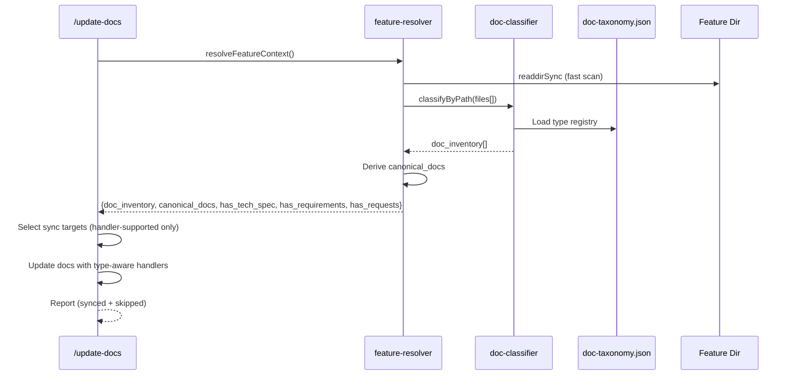

# Document Classification for /update-docs — Technical Spec

> **Feature**: `doc-classification`
> **Status**: Draft
> **Date**: 2026-04-03
> **Source**: `/best-practices` audit — Nash Equilibrium (threadId: `019d51c0-f186-7623-a0a4-9eaf856a8c12`)

## 1. Requirement Summary

- **Problem**: `/update-docs` 只能辨識並同步 `2-tech-spec.md`。`feature-resolver.js` 的 `probe()` 只回傳 `has_tech_spec` boolean。真實使用中已出現跨服務確認清單、設計變體文件等非標準文件，全部塞入 `4+` phase 失去語義。
- **Goals**:
  1. `/update-docs` 可自動辨識 feature docs 目錄中所有文件的語義類型
  2. `probe()` 回傳完整 inventory 而非單一 boolean
  3. 支援 dual namespace（lifecycle numbered + ancillary semantic）
  4. Known types 有專用 sync handler；unknown types detect + skip with warning
- **Scope**: `scripts/lib/`, `scripts/config/`, `commands/update-docs.md`, `rules/docs-numbering.md`
- **Out of Scope**: 文件內容的深度語義分析（NLP/LLM-based）；auto-generation of new doc types

## 2. Existing Code Analysis

### Related Modules

| File | Role | Change Required |
|------|------|----------------|
| `scripts/lib/feature-resolver.js` | Feature context resolution + `probe()` | Expand `probe()` output |
| `scripts/config/file-classification.json` | Code/doc/ignore extension classifier | No change (different concern) |
| `commands/update-docs.md` | `/update-docs` skill definition | Add inventory + handler dispatch |
| `rules/docs-numbering.md` | Naming convention rules | Add dual namespace |
| `skills/create-request/references/feature-context-resolution.md` | Shared resolution algorithm spec — the single canonical copy since doc-review-phasing r2 merged the `/tech-spec` duplicate into it | Update schema |
| `scripts/resolve-feature.sh` | Shell wrapper (output docs) | Update output schema docs |
| `skills/next-step/scripts/analyze.js:255,530` | Hardcoded `2-tech-spec.md` path | Migrate to `canonical_docs` |
| `skills/next-step/SKILL.md:37` | Schema consumer docs | Update schema reference |
| `skills/feature-dev/SKILL.md:141` | Hardcoded "3-level fallback" | Align to shared spec |
| `commands/tech-spec.md` | `/tech-spec` skill | Consume `canonical_docs` |
| `commands/architecture.md` | `/architecture` skill | Consume `canonical_docs` |
| `test/scripts/feature-resolver.test.js` | Existing resolver tests | Extend for new schema |
| `test/scripts/next-step-analyze.test.js` | Next-step tests | Update for `canonical_docs` |

### Reusable Components

- `fp-brief/references/detection-rules.md` — Hybrid path-then-content detection pattern (precedent)
- `scripts/lib/utils.js` — Git operations, slug generation
- `SLUG_RE` validation from `feature-resolver.js`

## 3. Technical Solution

### 3.1 Architecture Design



### 3.2 Data Model

#### `scripts/config/doc-taxonomy.json`

```json
{
  "version": 1,
  "types": [
    {
      "id": "feasibility",
      "namespace": "lifecycle",
      "phase": 0,
      "canonical_filename": "0-feasibility-study.md",
      "canonical_dirname": "0-feasibility-study",
      "variant_pattern": "^0-feasibility",
      "heading_signals": ["Feasibility", "可行性"],
      "sync_handler": "generic"
    },
    {
      "id": "requirements",
      "namespace": "lifecycle",
      "phase": 1,
      "canonical_filename": "1-requirements.md",
      "variant_pattern": "^1-requirements",
      "heading_signals": ["Requirements", "需求"],
      "sync_handler": null
    },
    {
      "id": "tech-spec",
      "namespace": "lifecycle",
      "phase": 2,
      "canonical_filename": "2-tech-spec.md",
      "variant_pattern": "^2-tech-spec",
      "exclude_pattern": "-fp-brief\\.md$",
      "heading_signals": ["Technical Spec", "技術規格"],
      "sync_handler": "tech-spec"
    },
    {
      "id": "architecture",
      "namespace": "lifecycle",
      "phase": 3,
      "canonical_filename": "3-architecture.md",
      "variant_pattern": "^3-architecture",
      "heading_signals": ["Architecture", "架構"],
      "sync_handler": "generic"
    },
    {
      "id": "implementation",
      "namespace": "lifecycle",
      "phase": 4,
      "canonical_filename": "4-implementation.md",
      "variant_pattern": "^4-implementation",
      "heading_signals": ["Implementation", "實作"],
      "sync_handler": "generic"
    },
    {
      "id": "fp-brief",
      "namespace": "ancillary",
      "semantic_pattern": "-fp-brief\\.md$",
      "heading_signals": ["First-Principles Brief", "第一性原理"],
      "sync_handler": null
    },
    {
      "id": "checklist",
      "namespace": "ancillary",
      "semantic_pattern": "^checklist-|確認事項|checklist",
      "heading_signals": ["Checklist", "確認清單", "確認事項"],
      "sync_handler": "generic"
    },
    {
      "id": "runbook",
      "namespace": "ancillary",
      "semantic_pattern": "^runbook-|操作手冊|runbook",
      "heading_signals": ["Runbook", "SOP", "操作手冊"],
      "sync_handler": null
    },
    {
      "id": "adr",
      "namespace": "ancillary",
      "semantic_pattern": "^adr-|decision",
      "heading_signals": ["Decision Record", "ADR", "架構決策"],
      "sync_handler": null
    },
    {
      "id": "handoff",
      "namespace": "ancillary",
      "semantic_pattern": "^handoff-|交接",
      "heading_signals": ["Hand-off", "交接", "Handoff"],
      "sync_handler": null
    },
    {
      "id": "briefing",
      "namespace": "ancillary",
      "semantic_pattern": "^briefing-|brief",
      "heading_signals": ["Briefing", "簡報", "Brief"],
      "sync_handler": null
    }
  ],
  "fallback_type": "appendix",
  "canonical_roles": {
    "tech_spec": "tech-spec",
    "architecture": "architecture",
    "feasibility": "feasibility",
    "requirements": "requirements"
  },
  "precedence": ["override", "exclude", "canonical_filename", "variant_or_semantic_pattern", "lifecycle_prefix_fallback", "heading_signal", "fallback"]
}
```

#### `probe()` 回傳 Schema（Expanded）

```json
{
  "key": "gas-account",
  "source": "branch",
  "confidence": "high",
  "docs_path": "docs/features/gas-account",
  "doc_inventory": [
    { "file": "0-feasibility-study.md", "type": "feasibility", "namespace": "lifecycle", "confidence": "high" },
    { "file": "2-tech-spec.md", "type": "tech-spec", "namespace": "lifecycle", "confidence": "high" },
    { "file": "3-architecture.md", "type": "architecture", "namespace": "lifecycle", "confidence": "high" },
    { "file": "checklist-cross-service.md", "type": "checklist", "namespace": "ancillary", "confidence": "high" }
  ],
  "canonical_docs": {
    "tech_spec": { "file": "2-tech-spec.md", "path": "docs/features/gas-account/2-tech-spec.md" },
    "architecture": { "file": "3-architecture.md", "path": "docs/features/gas-account/3-architecture.md" },
    "feasibility": null,
    "requirements": null
  },
  "has_tech_spec": true,
  "has_requirements": false,
  "has_requests": true
}
```

### 3.3 API Design (Module Interface)

#### `scripts/lib/doc-classifier.js`

```javascript
/**
 * Classify a single filename against the taxonomy.
 * Uses three-tier matching: (1) exclude_pattern rejects derived artifacts,
 * (2) canonical_filename exact match, (3) variant_pattern or semantic_pattern.
 *
 * @param {string} filename - e.g. "2-tech-spec.md", "2-tech-spec-fp-brief.md"
 * @param {object} taxonomy - Loaded doc-taxonomy.json
 * @returns {{ type: string, namespace: string, confidence: string, is_canonical: boolean }}
 */
function classifyByPath(filename, taxonomy) { ... }

/**
 * Scan a feature docs directory and return full inventory.
 * Handles both flat files and folder-backed lifecycle phases.
 *
 * Scan semantics:
 * - Top-level .md files: classified directly
 * - Folder-backed phases (e.g. 0-feasibility-study/): scan recursively,
 *   classify sub-files with parent folder's phase context
 * - `requests/` subdirectory: excluded from inventory (separate concern)
 *
 * @param {string} featureDir - Absolute path to docs/features/<key>/
 * @param {object} taxonomy - Loaded doc-taxonomy.json
 * @param {object} [options]
 * @param {boolean} [options.deep=false] - Read file content for heading signals
 * @param {object} [options.overrides] - filepath → type overrides
 * @returns {{ doc_inventory: Array, canonical_docs: object }}
 */
function scanFeatureDocs(featureDir, taxonomy, options) { ... }

/**
 * Derive canonical document map from inventory.
 * Selection priority:
 *   1. Exact canonical_filename match (is_canonical=true)
 *   2. Higher confidence variant
 *   3. Lexicographically first (tie-breaker only)
 *
 * @param {Array} inventory
 * @param {object} canonicalRoles - From taxonomy.canonical_roles
 * @returns {object} Map of role → { file, path } | null
 */
function pickCanonicalDocs(inventory, canonicalRoles) { ... }
```

#### `scripts/classify-docs-cli.js` (New CLI)

```bash
# List docs with classification
node scripts/classify-docs-cli.js --feature gas-account
# Output: JSON inventory (machine-readable for /update-docs)
```

### 3.4 Core Logic

#### Classification Precedence (per file)

```
1. Override match (doc-taxonomy.json overrides or .sd0x/doc-taxonomy.overrides.json)
2. Exclude check: if filename matches any type's exclude_pattern → skip that type
3. Exact canonical_filename match → type with is_canonical=true, confidence=high
4. variant_pattern or semantic_pattern match → type with is_canonical=false, confidence=medium
5. Lifecycle prefix fallback: if filename matches /^([0-4])-/ and no canonical/variant matched → classify as phase N variant (is_canonical=false, confidence=medium). This catches numbered files like `3-auto-loop-integration.md` that don't match any specific variant_pattern.
6. Heading signal match (deep mode only — read first 20 lines for H1/H2) → confidence=low
7. Fallback to "appendix" type → confidence=low
```

#### Folder-Backed Lifecycle Phases

`docs-numbering.md` permits folder-backed phases (e.g. `0-feasibility-study/`). Scan semantics:

| Entry Type | Handling |
|------------|----------|
| `<N>-<name>.md` (file) | Classify directly |
| `<N>-<name>/` (directory matching lifecycle phase) | Scan recursively; main file = `<N>-<name>.md` inside folder; sub-files classified as `variant` of parent phase |
| `requests/` (directory) | Skip — separate concern handled by `/create-request` |
| Other directories | Skip with warning |

Example: `0-feasibility-study/` containing `0-feasibility-study.md` + `1-state-persistence.md` + `2-review-intelligence.md` produces:

```json
[
  { "file": "0-feasibility-study/0-feasibility-study.md", "type": "feasibility", "is_canonical": true, "confidence": "high" },
  { "file": "0-feasibility-study/1-state-persistence.md", "type": "feasibility", "is_canonical": false, "confidence": "medium" },
  { "file": "0-feasibility-study/2-review-intelligence.md", "type": "feasibility", "is_canonical": false, "confidence": "medium" }
]
```

#### `probe()` Integration (Backward Compatible)

```javascript
// In feature-resolver.js probe()
function probe(docsBase, key, techSpecPattern, options) {
  // ... existing readdir logic ...

  // NEW: classify all .md files (fast mode — path only)
  const taxonomy = loadTaxonomy();
  const { doc_inventory, canonical_docs } = scanFeatureDocs(docsPath, taxonomy);

  // Legacy compat: derive from inventory
  const hasTechSpec = canonical_docs.tech_spec !== null;
  const hasRequirements = canonical_docs.requirements !== null;
  const hasRequests = entries.includes('requests');

  return {
    key,
    docs_path: `docs/features/${key}`,
    doc_inventory,
    canonical_docs,
    has_tech_spec: hasTechSpec,
    has_requirements: hasRequirements,
    has_requests: hasRequests
  };
}
```

#### `/update-docs` Dual Mode

| Mode | Trigger | Behavior |
|------|---------|----------|
| **target=file** | `$ARGUMENTS` is a specific `.md` path | Update only that document (existing behavior). Classify the target file for handler selection, but do not fan out to other docs. |
| **target=feature** | `$ARGUMENTS` is a feature keyword, directory, or empty (auto-detect) | Inventory all docs, dispatch to handlers for each sync-capable document. |

#### Handler Dispatch (target=feature mode)

```
Step 1: Resolve feature (existing 5-level cascade)
Step 2: Inventory docs (NEW — via scanFeatureDocs)
Step 3: Shared research pass — one git diff + code search per /update-docs run
Step 4: For each doc in inventory:
  - If sync_handler exists → dispatch to handler with shared research context
  - If sync_handler is null → skip with "[SKIP] <file>: no handler for type <type>"
  - If type is "appendix" (fallback) → skip with "[UNKNOWN] <file>: unclassified"
Step 5: Report (existing, enhanced with inventory table)
```

**Performance note**: Step 3 performs a single shared repository research pass (git diff, code search). Individual handlers in Step 4 receive the cached research context instead of re-running git operations per document.

### 3.5 Naming Convention Update (docs-numbering.md)

| Category | Format | Rule |
|----------|--------|------|
| Lifecycle canonical | `<N>-<kebab-name>.md` | N=0-4, reflects development phase |
| Ancillary semantic | `<type>-<kebab-name>.md` | `type` from taxonomy registry |
| Requests | `YYYY-MM-DD-<title>.md` | Unchanged |

**New rule**: Ancillary docs are exempt from the "must have numeric prefix" requirement. The `<type>` prefix must match a registered type in `doc-taxonomy.json`.

## 4. Risks and Dependencies

| Risk | Impact | Mitigation |
|------|--------|-----------|
| Breaking `next-step`, `/tech-spec`, `/architecture` on probe() schema change | High | Legacy `has_tech_spec` / `has_requirements` / `has_requests` preserved as derived fields |
| Taxonomy sprawl — too many custom types | Medium | Enforce max types in registry; new types require PR review |
| Misclassification causing `/update-docs` wrong target | Medium | Confidence scoring; unknown type = skip, not auto-edit |
| `probe()` performance regression if loading taxonomy on every call | Low | Lazy-load taxonomy with module-level cache; fast path stays O(readdir) |
| Dual namespace creates ambiguity (numbered `3-checklist.md` vs `checklist-foo.md`) | Medium | Validation rule: lifecycle numbers 0-4 only for lifecycle types; ancillary must use semantic prefix |
| Override file trust boundary unclear | Low | Override paths must be relative to feature dir; override type values must match registered taxonomy IDs; `.sd0x/` should be `.gitignore`d by default (local-only) |

## 5. Work Breakdown

| # | Task | Files | Effort | Dependencies |
|---|------|-------|--------|-------------|
| T1 | Create `scripts/config/doc-taxonomy.json` | New file | S | None |
| T2 | Implement `scripts/lib/doc-classifier.js` | New file | M | T1 |
| T3 | Create `scripts/classify-docs-cli.js` | New file | S | T2 |
| T4 | Expand `probe()` in `feature-resolver.js` | Modify | M | T2 |
| T5 | Update `feature-context-resolution.md` schema | Modify | S | T4 |
| T6 | Update `commands/update-docs.md` with handler dispatch | Modify | M | T4 |
| T7 | Migrate `analyze.js` hardcoded paths to `canonical_docs` | Modify | S | T4 |
| T7b | Sync duplicated resolver spec (`skills/create-request/references/`) | Modify | S | T5 |
| T7c | Update `resolve-feature.sh` output docs | Modify | S | T4 |
| T7d | Update `skills/next-step/SKILL.md` schema reference | Modify | S | T5 |
| T8 | Update `docs-numbering.md` for dual namespace | Modify | S | T1 |
| T9 | Add `.sd0x/doc-taxonomy.overrides.json` support + ensure `.sd0x/` in `.gitignore` | T2 extension | S | T2 |
| T10 | Tests for classifier + expanded probe | New files | M | T2, T4 |
| T10b | Update existing tests (`feature-resolver.test.js`, `next-step-analyze.test.js`) | Modify | S | T4, T7 |

**Suggested phases**: v0 = T1-T5, T10, T10b (foundation); v1 = T6-T8, T7b-T7d (integration); v2 = T9 (override)

## 6. Testing Strategy

| Test | Type | File | Coverage |
|------|------|------|----------|
| `classifyByPath()` lifecycle types | Unit | `test/scripts/doc-classifier.test.js` | Pattern matching for 0-4 canonical types |
| `classifyByPath()` ancillary types | Unit | Same | Semantic prefix detection |
| `classifyByPath()` fallback | Unit | Same | Unknown → "appendix" |
| `scanFeatureDocs()` full inventory | Unit | Same | Directory with mixed lifecycle + ancillary files |
| `pickCanonicalDocs()` selection | Unit | Same | Priority: exact canonical > confidence > lex order |
| `probe()` backward compat | Integration | `test/scripts/feature-resolver.test.js` (extend) | `has_tech_spec` derived correctly from inventory |
| `probe()` with new types | Integration | Same | Inventory includes ancillary docs |
| Deep mode heading detection | Unit | `test/scripts/doc-classifier.test.js` | Multilingual heading signals (zh-TW, en) |
| Derived artifact exclusion | Unit | Same | `2-tech-spec-fp-brief.md` → `fp-brief`, not `tech-spec` |
| Folder-backed phase scan | Unit | Same | `0-feasibility-study/` → recursive inventory with parent context |
| Numbered variant classification | Unit | Same | `3-auto-loop-integration.md` → phase 3 variant, not canonical |
| Override resolution | Unit | Same | Config override takes precedence |
| CLI output format | Integration | `test/scripts/classify-docs-cli.test.js` | JSON output schema validation |

## 7. Open Questions

| # | Question | Owner | Impact |
|---|----------|-------|--------|
| Q1 | 現有 4 個非標準文件（`3-auto-loop-integration.md` 等）是否需要 rename migration？ | User | Low — can classify by content heuristic without rename |
| Q2 | `sync_handler` 除了 `"tech-spec"` 和 `"generic"` 外，是否需要其他專用 handler？ | User | Medium — affects v1 scope |
| Q3 | `.sd0x/` 目錄是否已在 `.gitignore`？Override file 要追蹤還是 local-only？ | User | Low |
| Q4 | 是否需要 `classify-docs-cli.js` 的 `--deep` mode 在 CI 中自動執行？ | User | Low — nice-to-have |
