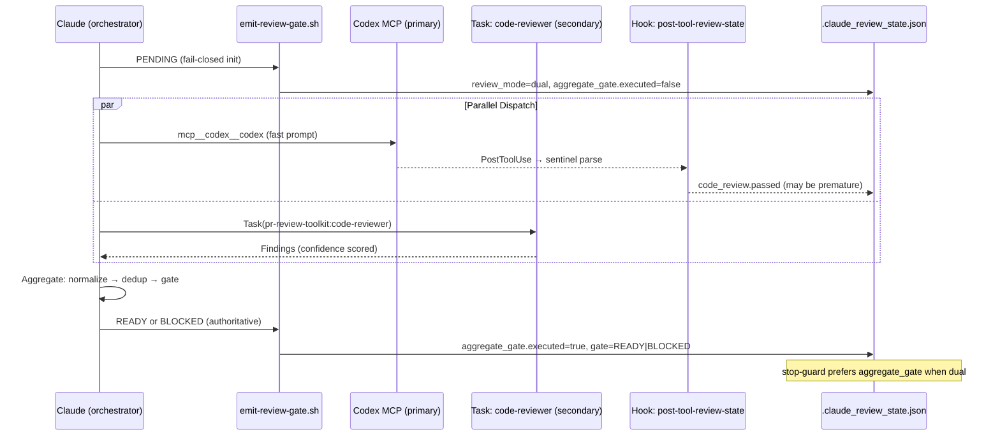

# 雙 Reviewer 並行審查架構 — 技術規格

> **As-built 勘誤（2026-07-27）**：本規格描述的是**當初的設計**。以下三點與實作不符，讀者請勿據以行動；本文其餘內容亦未逐條查核，遇有疑義一律以現行契約為準。
>
> 1. 本文與 [R3 需求單](./requests/2026-03-11-r3-skill-workflow.md) 多處描述「兩個 reviewer 皆不可用時退回 `review_mode=single`」——實作中**不存在**任何 `dual → single` 降級路徑。`review_mode` 僅在 state 檔重建時初始化為 `single`，其後所有模式轉移一律寫 `dual`，且 SessionStart 保留該欄位。
> 2. 預設已改為**單一 reviewer**。dual 是 `/codex-review-branch --dual` 的 opt-in，不再是預設。
> 3. **§3.3.4 降級矩陣的「Codex 失敗 + 次要成功 → `toolkit-only`」該列已被撤銷。** Codex 失敗**永不**降級為通過的 gate：現行行為是 `⛔ Blocked` + `⚠️ Need Human`，次要 reviewer 的 findings 僅供參考，gate source 為 `none`。次要 reviewer 從來不是權威——`--dual` 增加的是第二雙眼睛，不是第二個裁決者。以 [`review-common.md` § Degradation Matrix](../../../skills/codex-code-review/references/review-common.md) 為準。
>
> 現行契約以 [`skills/codex-code-review/SKILL.md`](../../../skills/codex-code-review/SKILL.md) § Step 0 與上述 `review-common.md` 為準；殘留成因與修正範圍見 [R1](../auto-loop-autonomy/requests/2026-07-26-dual-mode-signal-repair-r1.md)。本文其餘內容保留作為歷史紀錄。

## 1. 需求摘要

- **問題**: `/codex-review-fast` 僅依賴單一 Codex MCP reviewer，存在單點失敗、單一視角、無降級機制三大問題
- **目標**: 預設雙 reviewer 並行（Codex MCP + `pr-review-toolkit:code-reviewer`），並加入降級串接與結果彙整
- **範圍**: `codex-code-review` skill 全部三種變體（fast/full/branch）+ hook 基礎建設擴充

## 2. 現有程式碼分析

### 相關模組

| 模組 | 路徑 | 現狀 |
|------|------|------|
| Code review skill | `skills/codex-code-review/SKILL.md` | 單一 Codex MCP 呼叫，`allowed-tools` 無 `Task` |
| Fast command | `commands/codex-review-fast.md` | `allowed-tools` 無 `Task` |
| Full command | `commands/codex-review.md` | 同上 |
| Branch command | `commands/codex-review-branch.md` | 同上 |
| Review common | `skills/codex-code-review/references/review-common.md` | 僅單源 findings 格式 |
| Hook: state update | `hooks/post-tool-review-state.sh` | 僅解析 Bash + MCP tool output |
| Hook: stop guard | `hooks/stop-guard.sh` | 讀取 `code_review`/`doc_review`/`precommit` + `has_*_change`，預設 warn 模式 |
| Hook: edit invalidation | `hooks/post-edit-format.sh` | 僅重置 `code_review`/`doc_review`/`precommit` |
| strict-reviewer agent | `.claude/agents/strict-reviewer.md` | Opus，有 `skills: codex-code-review`（耦合） |
| pr-review-toolkit | `~/.claude/plugins/cache/.../pr-review-toolkit/` | 已安裝，含 6 agents |

### 可重用元件

| 元件 | 描述 |
|------|------|
| `update_state()` in `post-tool-review-state.sh` | State file read-modify-write 函式（需加鎖） |
| `check_passed()` in `post-tool-review-state.sh` | Sentinel 解析函式（需擴充） |
| Severity 定義 in `review-common.md` | P0/P1/P2/Nit 已標準化 |
| Auto-loop 規則 | P2/Nit Quality Sweep 已實作 |

### 需修改檔案

| 檔案 | 修改類型 | 說明 |
|------|----------|------|
| `commands/codex-review-fast.md` | Config | `allowed-tools` 加入 `Task` |
| `commands/codex-review.md` | Config | 同上 |
| `commands/codex-review-branch.md` | Config | 同上 |
| `skills/codex-code-review/SKILL.md` | Skill logic | `allowed-tools` + 雙重分派 + 彙整 |
| `skills/codex-code-review/references/review-common.md` | Reference | 彙整規則 + severity mapping |
| `scripts/emit-review-gate.sh` | New | 閘門發射腳本 |
| `hooks/post-tool-review-state.sh` | Hook | 新解析分支 + `aggregate_gate` + 鎖定 |
| `hooks/stop-guard.sh` | Hook | 雙模式閘門 + fail-closed |
| `hooks/post-edit-format.sh` | Hook | `aggregate_gate` 重置 + 鎖定 |
| `.claude/agents/strict-reviewer.md` | Config | 移除 `skills: codex-code-review` 解耦 |

## 3. 技術方案

### 3.1 架構設計



### 3.2 State 模型

現有 `.claude_review_state.json` 擴充：

```json
{
  "session_id": "abc123",
  "updated_at": "2026-03-11T10:00:00Z",
  "review_mode": "dual",
  "has_code_change": true,
  "has_doc_change": false,
  "code_review": {
    "executed": true,
    "passed": true,
    "last_run": "2026-03-11T10:00:00Z"
  },
  "doc_review": { "executed": false, "passed": false, "last_run": "" },
  "precommit": { "executed": false, "passed": false, "last_run": "" },
  "aggregate_gate": {
    "executed": true,
    "gate": "BLOCKED",
    "source": "codex+toolkit",
    "reason": null,
    "last_run": "2026-03-11T10:00:05Z"
  }
}
```

| 新增欄位 | 類型 | 說明 |
|----------|------|------|
| `review_mode` | `"single"` \| `"dual"` | 當前審查模式 |
| `aggregate_gate.executed` | boolean | 彙整閘門是否已執行 |
| `aggregate_gate.gate` | `"READY"` \| `"BLOCKED"` \| `null` | 最終權威閘門 |
| `aggregate_gate.source` | string | 閘門來源（`codex+toolkit`、`codex-only`、`toolkit-only`） |
| `aggregate_gate.reason` | string \| `null` | 閘門原因（正常時為 `null`；異常時為 `lock_failure`、`both_failed`、`timeout` 等） |

### 3.3 核心邏輯

#### 3.3.1 Reviewer 選擇與降級串接

```
graph TD
    A[開始 review] --> B{pr-review-toolkit:code-reviewer 可用?}
    B -->|是| C[並行: Codex + toolkit:code-reviewer]
    B -->|否| D{strict-reviewer 可用?}
    D -->|是| E[並行: Codex + strict-reviewer]
    D -->|否| F[Codex 單獨審查 review_mode=single]
    C --> G[彙整]
    E --> G
    F --> H[現有邏輯]
```

**可用性偵測**：執行時期嘗試啟動 Task，設定 30 秒 timeout；若啟動失敗或 timeout 則降級至下一層。不使用檔案路徑檢查（plugin cache 可能為孤立目錄）。

#### 3.3.2 Severity Mapping（toolkit → 標準格式）

`pr-review-toolkit:code-reviewer` 使用 confidence scoring（0-100），需對應至 P0-Nit：

| toolkit 輸出 | 預設對應 | 升級條件 |
|--------------|----------|----------|
| Critical (90-100) | P1 | 含 P0 關鍵字（crash, data loss, security vulnerability, injection, auth bypass）→ P0 |
| Important (80-89) | P2 | — |
| < 80 | 不回報 | toolkit 內部已過濾 |

`strict-reviewer` 已使用 P0/P1/P2/Nit 格式，無需對應。

#### 3.3.3 結果彙整演算法

```
1. 收集雙方 findings
2. 正規化至統一格式：[severity] file:line description → fix
3. 去重：key = file + canonical_issue_text（忽略 line number 的微小差異 ±5）
4. 衝突解決：同一 key 的 severity 取最高（P0 > P1 > P2 > Nit）
5. 標記來源：source = codex | toolkit | both
6. 排序：P0 → P1 → P2 → Nit
7. 閘門決定：任一 P0/P1 → BLOCKED；否則 → READY
```

#### 3.3.4 降級結果處理

| 情境 | 行為 | 閘門來源 |
|------|------|----------|
| Codex 成功 + 次要成功 | 聯集彙整 | `codex+toolkit` |
| Codex 成功 + 次要失敗 | Codex-only 結果 + 降級警告 | `codex-only` |
| Codex 失敗 + 次要成功 | 次要-only 結果 + 降級警告 | `toolkit-only` |
| 都失敗 | `⛔ Blocked` + `⚠️ Need Human` | `none` |

#### 3.3.5 閘門發射腳本

`scripts/emit-review-gate.sh`：

```bash
#!/usr/bin/env bash
# Usage: bash scripts/emit-review-gate.sh PENDING|READY|BLOCKED
set -euo pipefail
GATE="${1:?Usage: emit-review-gate.sh PENDING|READY|BLOCKED}"
echo "REVIEW_GATE=$GATE"
```

Hook 解析 `REVIEW_GATE=` 前綴，寫入 `aggregate_gate`：

| GATE 值 | Hook 行為 |
|---------|----------|
| `PENDING` | 設定 `review_mode=dual`、`aggregate_gate.executed=false`、`aggregate_gate.gate=null` |
| `READY` | 設定 `aggregate_gate.executed=true`、`aggregate_gate.gate=READY` |
| `BLOCKED` | 設定 `aggregate_gate.executed=true`、`aggregate_gate.gate=BLOCKED` |

#### 3.3.6 可攜式鎖定機制

macOS 無 `flock`，使用 `mkdir` lockdir：

```bash
LOCKDIR="${STATE_FILE}.lockdir"
LOCK_TIMEOUT=5
LOCK_TTL=30
HAVE_LOCK=0

_lock() {
  local start=$(date +%s)
  while ! mkdir "$LOCKDIR" 2>/dev/null; do
    local now=$(date +%s)
    if [ $((now - start)) -ge $LOCK_TIMEOUT ]; then
      local lock_pid=$(cat "$LOCKDIR/pid" 2>/dev/null || echo 0)
      local lock_ts=$(cat "$LOCKDIR/ts" 2>/dev/null || echo 0)
      if [ $((now - lock_ts)) -ge $LOCK_TTL ] || ! kill -0 "$lock_pid" 2>/dev/null; then
        rm -rf "$LOCKDIR" 2>/dev/null
        mkdir "$LOCKDIR" 2>/dev/null && break
      fi
      return 1  # fail-closed
    fi
    sleep 0.1
  done
  echo "$$" > "$LOCKDIR/pid"
  date +%s > "$LOCKDIR/ts"
  HAVE_LOCK=1
}

_unlock() {
  [ "$HAVE_LOCK" -eq 1 ] && rm -rf "$LOCKDIR" 2>/dev/null
  HAVE_LOCK=0
}
```

| 特性 | 說明 |
|------|------|
| Bounded wait | 5 秒逾時 |
| Stale lock 回收 | TTL 30 秒過期 **或** owner PID 已死亡（任一成立即回收，與程式碼 `\|\|` 一致） |
| 所有權驗證 | `_unlock` 僅在 `HAVE_LOCK=1` 時執行 |
| 鎖定失敗行為 | Fail-closed：寫入 `aggregate_gate.gate=BLOCKED`（reason: `lock_failure`） |

#### 3.3.7 stop-guard 雙模式邏輯

**重要**：現有 stop-guard 預設為 `warn` 模式（警告但不阻擋）。`review_mode=dual` 時必須強制 strict blocking，無視 warn 設定，確保 fail-closed 語義不被 warn 模式繞過。

```
讀取 state file
if review_mode == "dual":
  force_strict_blocking = true  # 無視 warn 模式
  if aggregate_gate.executed == true:
    use aggregate_gate.gate as final gate
  else:
    # 彙整未完成 → fail-closed
    treat as BLOCKED (reason: "aggregation_incomplete")
else:
  # 現有邏輯 (review_mode == "single" 或缺失)
  use code_review.passed (respect warn/strict setting)
```

#### 3.3.8 Review Loop 整合

| Reviewer | Loop 行為 |
|----------|----------|
| Codex MCP | 有狀態 → `mcp__codex__codex-reply(threadId)` 延續先前上下文 |
| 次要 reviewer | 無狀態 → 每輪重新啟動，帶最新 diff |

彙整閘門在每輪 loop 的結尾重新計算並發射。

### 3.4 SKILL.md 工作流變更

現有 Step 1-4 維持，插入新步驟：

| Step | 現有 | 新增 |
|------|------|------|
| 0 | — | **Fail-closed init**: `bash emit-review-gate.sh PENDING` |
| 1 | Collect changes | 不變 |
| 2 | Pre-checks (Full only) | 不變 |
| 3 | Codex review | **並行**：同時啟動次要 reviewer |
| 3.5 | — | **新增**：等待雙方結果 |
| 4 | Consolidate output | **擴充**：正規化 + 去重 + 聯集閘門 |
| 4.5 | — | **新增**：`bash emit-review-gate.sh READY\|BLOCKED` |

### 3.5 Hook 修改摘要

#### `post-tool-review-state.sh`

```diff
+ # === emit-review-gate parse branch ===
+ if [[ "$TOOL_NAME" == "Bash" ]] && echo "$COMMAND" | grep -qE 'emit-review-gate'; then
+   GATE_VALUE=$(echo "$TOOL_OUTPUT" | grep -oE '^REVIEW_GATE=(PENDING|READY|BLOCKED)' | tail -1 | cut -d= -f2)
+   if [[ -n "$GATE_VALUE" ]]; then
+     _lock || { update_aggregate_blocked "lock_failure"; exit 0; }
+     case "$GATE_VALUE" in
+       PENDING)
+         # set review_mode=dual, reset aggregate_gate (executed=false, gate=null, reason=null)
+         ;;
+       READY)
+         # set aggregate_gate.executed=true, gate=READY, reason=null
+         ;;
+       BLOCKED)
+         # set aggregate_gate.executed=true, gate=BLOCKED, reason=null
+         ;;
+     esac
+     _unlock
+   fi
+ fi
```

#### `stop-guard.sh`

```diff
+ # === Dual mode: prefer aggregate_gate + force strict blocking ===
+ REVIEW_MODE=$(echo "$STATE" | jq -r '.review_mode // "single"')
+ if [[ "$REVIEW_MODE" == "dual" ]]; then
+   FORCE_STRICT=true  # dual mode ignores warn setting → override GUARD_MODE to "strict"
+   AGG_EXECUTED=$(echo "$STATE" | jq -r '.aggregate_gate.executed // false')
+   AGG_GATE=$(echo "$STATE" | jq -r '.aggregate_gate.gate // empty')
+   if [[ "$AGG_EXECUTED" == "true" ]]; then
+     CODE_REVIEW_PASSED=$([[ "$AGG_GATE" == "READY" ]] && echo "true" || echo "false")
+   else
+     CODE_REVIEW_PASSED="false"  # fail-closed: aggregation incomplete
+   fi
+ fi
```

#### `post-edit-format.sh`

```diff
+ # Invalidate aggregate_gate on edit
+ .aggregate_gate.executed = false | .aggregate_gate.gate = null | .aggregate_gate.reason = null
```

## 4. 風險與相依性

| 風險 | 機率 | 緩解措施 |
|------|------|----------|
| `pr-review-toolkit` 未安裝或移除 | 低 | 執行時期偵測 → `strict-reviewer` → 單 reviewer 降級 |
| API 成本翻倍（雙 reviewer） | 中 | 次要 reviewer 使用 Agent tool（Claude-native），非額外 MCP 呼叫 |
| Hook state 併發寫入 | 低 | 可攜式 `mkdir` 鎖定 + fail-closed |
| Codex MCP 與次要 reviewer 發現衝突 | 中 | 取最高 severity，去重機制處理 |
| Sentinel 碰撞（中間輸出含多個 sentinel） | 低 | 中間 sentinel 不輸出；僅 `emit-review-gate.sh` 為權威來源 |
| macOS 鎖定相容性 | 無 | `mkdir` 為 POSIX 原子操作，所有平台通用 |

### 前置相依

| Feature | 狀態 | 說明 |
|---------|------|------|
| [review-state-tracking](../review-state-tracking/requests/2026-02-12-fix-hook-state-persistence.md) | 已完成 | Hook MCP 路由、sentinel 解析、edit invalidation |
| [sentinel-hardening-p2](../review-state-tracking/requests/2026-02-12-sentinel-hardening-p2.md) | 已完成 | Sentinel 碰撞防護、git timeout、transcript fallback |
| [p2-quality-sweep](../p2-quality-sweep/requests/2026-03-06-p2-nit-quality-sweep.md) | 已完成 | P2/Nit sweep 邏輯需適配雙源 findings |

## 5. 工作分解

| # | 工作項目 | 預估 | 相依 |
|---|---------|------|------|
| W1 | Command allowed-tools 加入 `Task`（3 files）+ `strict-reviewer.md` 移除 `skills: codex-code-review` 解耦 | S | — |
| W2 | `emit-review-gate.sh` 腳本 + 測試 | S | — |
| W3 | `post-tool-review-state.sh` 新解析分支 + 鎖定 | M | W2 |
| W4 | `stop-guard.sh` 雙模式邏輯 | M | W3 |
| W5 | `post-edit-format.sh` aggregate_gate 重置 + 鎖定 | S | W3 |
| W6 | SKILL.md 雙重分派工作流 | L | W1, W2 |
| W7 | `review-common.md` 彙整規則 + severity mapping | M | W6 |
| W8 | Hook 測試（state update, stop-guard, edit invalidation） | M | W3, W4, W5 |
| W9 | 整合測試（完整 dual-review flow） | M | W6, W7, W8 |

建議實作順序：W1 → W2 → W3 → W4 → W5 → W6 → W7 → W8 → W9

## 6. 測試策略

### Unit Tests

| 測試目標 | 測試案例 |
|----------|----------|
| `emit-review-gate.sh` | PENDING/READY/BLOCKED 輸出格式正確 |
| `post-tool-review-state.sh` | emit-review-gate 解析分支正確寫入 `aggregate_gate` |
| `post-tool-review-state.sh` | 鎖定機制 bounded wait + stale recovery |
| `post-tool-review-state.sh` | 鎖定失敗 → fail-closed（`gate=BLOCKED`） |
| `stop-guard.sh` | `review_mode=dual` + `aggregate_gate.executed=true` + `gate=READY` → 放行 |
| `stop-guard.sh` | `review_mode=dual` + `aggregate_gate.executed=false` → blocked（fail-closed） |
| `stop-guard.sh` | `review_mode` 缺失 → 現有邏輯（向後相容） |
| `post-edit-format.sh` | 編輯後 `aggregate_gate.executed=false` |

### Integration Tests

| 測試目標 | 測試案例 |
|----------|----------|
| Severity mapping | toolkit Critical 90 + "security" → P0 |
| Severity mapping | toolkit Critical 95 (no P0 keyword) → P1 |
| Severity mapping | toolkit Important 85 → P2 |
| 去重 | 同一 file+issue 雙方皆回報 → 合併為 1 項 |
| 降級 | Codex 失敗 + 次要成功 → `source=toolkit-only` |
| 降級 | 次要失敗 + Codex 成功 → `source=codex-only` |

## 7. Open Questions

| # | 問題 | 影響 | 建議 |
|---|------|------|------|
| Q1 | 是否需要 `--single` flag 強制單 reviewer 模式？ | UX | 建議加入，用於 debug 或成本控制 |
| Q2 | ~~`strict-reviewer` 的 `skills: codex-code-review` 耦合是否需立即解耦？~~ **已解決**：納入本次 scope，W1 一併移除 `skills: codex-code-review` 以避免 fallback 時遞迴呼叫風險 | 架構品質 | 本次必做（見 W1 擴充） |
| Q3 | P2/Nit Quality Sweep 是否需要對雙源 findings 做特殊處理？ | Auto-loop | 預計不需要——sweep 在彙整後執行，對統一格式的 findings 操作 |
| Q4 | 是否應同時啟動更多 specialist agents（如 `silent-failure-hunter`）？ | 覆蓋率 vs 成本 | 建議第一版僅 1 secondary，未來可擴充 |
