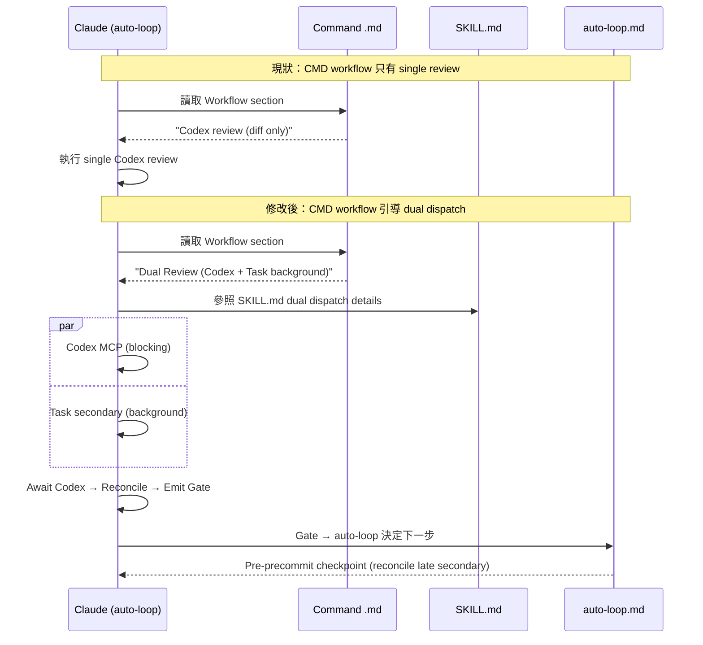
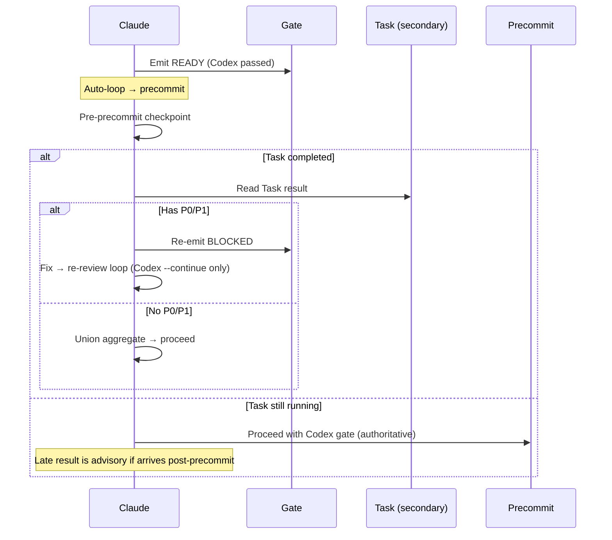

# 雙 Reviewer Auto-Loop 整合 — 技術規格

> **As-built 勘誤（2026-07-27）**：本文屬 dual-reviewer 家族的歷史紀錄，描述的是當初的設計，**未逐條查核，遇有疑義一律以現行契約為準**（`skills/codex-code-review/`）。兩項全家族適用的撤銷：dual 已改為 opt-in，唯一入口是 `/codex-review-branch --dual`，**並非**每次 code review 都觸發；Codex 失敗永不降級為通過的 gate。詳見 [tech spec 勘誤](./2-tech-spec.md)。

## 1. 需求摘要

- **問題**: 雙 reviewer 基礎設施已完成（SKILL.md + hooks + state），但 command `.md` 的 Workflow section 只描述 single Codex review，`auto-loop.md` 也不感知 dual mode，導致 Claude 實際行為中幾乎不觸發 dual dispatch
- **根因**: Instruction proximity bias — Claude 跟著 command workflow（最近的指令）走，忽略 SKILL.md 中更完整的 dual dispatch 流程
- **目標**: 讓 dual dispatch 在每次 code review 時自然觸發，同時不阻塞 auto-loop 效率
- **Scope**: 修改 3 個 review command `.md`、`auto-loop.md`、`SKILL.md` loop behavior

## 2. 現有程式碼分析

### 問題點

| 檔案 | 現狀 | 問題 |
|------|------|------|
| `commands/codex-review-fast.md:40` | `git diff → Codex review (diff only) → Findings + Gate` | 完全沒提到 dual dispatch |
| `commands/codex-review.md:41` | `lint:fix → build → git diff → Codex review (full) → Findings + Gate` | 同上 |
| `commands/codex-review-branch.md` | 類似 single reviewer workflow | 同上 |
| `rules/auto-loop.md` | Gate-driven，不感知 `review_mode` 或 secondary reviewer | 不知道要等 secondary |
| `skills/codex-code-review/SKILL.md:35` | 完整 dual dispatch（Step 0-4.5） | ✅ 正確但不被 command 引導 |
| `skills/codex-code-review/SKILL.md:115` | Case B loop: secondary 每輪重啟 | 效能問題 |

### 已完成的基礎設施（可直接使用）

| 元件 | 狀態 |
|------|------|
| `emit-review-gate.sh` (PENDING/READY/BLOCKED) | ✅ 已實作 |
| `post-tool-review-state.sh` aggregate_gate 解析 | ✅ 已實作 |
| `stop-guard.sh` 雙模式閘門 | ✅ 已實作 |
| `post-edit-format.sh` aggregate_gate 重置 | ✅ 已實作 |
| `review-common.md` severity mapping + dedup | ✅ 已實作 |
| Degradation matrix | ✅ 已定義 |

## 3. 技術方案

### 3.1 架構設計



### 3.2 三層修改策略

#### Layer 1: Command Workflow 修改

所有 3 個 review command 的 Workflow section 改為：

**`codex-review-fast.md`**:

```
emit PENDING → git diff → Dual Review (Codex + Task background) → Await Codex → Reconcile → Emit Gate → Loop if Blocked
```

步驟更新：

```markdown
1. **Emit PENDING**: `bash scripts/emit-review-gate.sh PENDING`
2. **Collect metadata**: `git diff --name-only HEAD` + `git diff --stat HEAD`
3. **Dual Review** (parallel dispatch, single message):
   - 3a. **Codex review** (primary, blocking): `mcp__codex__codex` or `mcp__codex__codex-reply`
   - 3b. **Secondary reviewer** (background, non-blocking): `Task(pr-review-toolkit:code-reviewer)` with `run_in_background: true`
4. **Await Codex result**, then reconcile: if Task completed, aggregate per SKILL.md Step 4
5. **Emit gate**: `bash scripts/emit-review-gate.sh READY|BLOCKED`
6. **Output**: Severity-grouped findings + source attribution + Merge Gate
```

**`codex-review.md`**: 同上，步驟 1 前加 `lint:fix → build`。

**`codex-review-branch.md`**: 同上，步驟 2 加 branch diff + history。

#### Layer 2: `auto-loop.md` Dual Review Mode Section

在 Auto-Trigger table 後加入新 section：

```markdown
### Dual Review Mode

Code review commands dispatch two reviewers in parallel. This section defines the interaction with auto-loop.

| Rule | Description |
|------|-------------|
| First-pass dual | Code review command must dual-dispatch on first pass (Codex + secondary background) |
| Non-blocking secondary | Secondary reviewer runs in background and does not block initial gate emission |
| Late P0/P1 | Within same review session, late secondary P0/P1 re-opens fix→re-review loop |
| Loop re-review | `--continue` loops use Codex stateful re-review only; do not restart secondary |
| Pre-precommit checkpoint | Before `/precommit-fast`, reconcile any pending secondary result; if late P0/P1, re-enter review loop |
```

#### Layer 3: SKILL.md + review-common.md Loop Behavior 修正

`skills/codex-code-review/SKILL.md` Case B (loop review) 修改：

| 現有 | 修改為 |
|------|--------|
| Secondary: 無狀態 → 每輪重新啟動 | `--continue` loops: Codex `codex-reply` only |
| 每輪等待雙方結果 | Loop 只等 Codex，不重啟 secondary |

`skills/codex-code-review/references/review-common.md` Dual Mode loop 定義同步修改，移除「每輪 fresh Task」描述。

新增 pre-precommit reconcile 步驟說明。

### 3.3 Output Template 修正

所有 3 個 review command 的 Output template 加入 `[source:]` tag：

```markdown
#### P0 (Must Fix)
- [file:line] Issue -> Fix recommendation [source: codex|toolkit|both]
```

### 3.4 Late Secondary P0/P1 Handling



## 4. 風險與相依性

| 風險 | 機率 | 緩解措施 |
|------|------|----------|
| 3 個 command 再度 drift | Medium | 考慮 structural test 驗證 3 command workflow 一致性 |
| Late secondary 在 precommit 後才回來 | Low | Pre-precommit checkpoint；post-precommit 視為 advisory |
| Command workflow 變長失去簡潔性 | Low | 只加摘要步驟，細節仍在 SKILL.md |
| Claude 仍跟著舊 workflow 走 | Low | Command workflow 是最近指令，修改後即生效 |

### 前置相依

| Feature | 狀態 | 說明 |
|---------|------|------|
| [dual-reviewer](./2-tech-spec.md) | ✅ Completed | SKILL.md + hooks + state 全部就緒 |

## 5. 工作分解

| # | 工作項目 | 影響檔案 | 預估 |
|---|---------|----------|------|
| W1 | `codex-review-fast.md` Workflow + Output 修改 | `commands/codex-review-fast.md` | S |
| W2 | `codex-review.md` Workflow + Output 修改 | `commands/codex-review.md` | S |
| W3 | `codex-review-branch.md` Workflow + Output 修改 | `commands/codex-review-branch.md` | S |
| W4 | `auto-loop.md` 加入 Dual Review Mode section | `rules/auto-loop.md` + `.claude/rules/auto-loop.md` | S |
| W5 | SKILL.md + review-common.md loop behavior 修正 | `skills/codex-code-review/SKILL.md` + `references/review-common.md` | S |
| W6 | 驗證 + doc review | — | S |

建議順序：W1 → W2 → W3 → W4 → W5 → W6

## 6. 測試策略

### 行為驗證

| 測試目標 | 驗證方式 |
|----------|----------|
| Command workflow 包含 dual dispatch | Structural test：grep command `.md` for "Dual Review" or "Task" |
| Auto-loop 包含 Dual Review Mode section | Structural test：grep `auto-loop.md` for "Dual Review Mode" |
| SKILL.md loop behavior 不重啟 secondary | Manual review |
| Output template 包含 source tag | Structural test：grep command `.md` for "source:" |

### 現有測試不受影響

本次修改僅涉及 `.md` 文件（command + rules + skill），不修改 hook 程式碼或 scripts，現有所有測試應無影響。

## 7. Open Questions

| # | 問題 | 影響 | 建議 |
|---|------|------|------|
| Q1 | 是否需要 structural test 驗證 3 個 command workflow 一致性？ | 防止 drift | 建議加入，但可在後續 iteration |
| Q2 | Pre-precommit checkpoint 是行為層還是 hook 層？ | 實作選擇 | 行為層（command workflow 中明確寫出步驟） |
| Q3 | 是否需要更新 `emit-review-gate.sh` 支援 session/source metadata？ | 可追溯性 | P2 future — 目前 PENDING/READY/BLOCKED 足夠 |

## References

- Best Practices Audit: `/codex-brainstorm` threadId `019ce4ee-b430-7153-9137-8557fcb6a716`（3 輪辯論）
- 根因分析：Instruction proximity bias — [Claude Skills Controllability](https://paddo.dev/blog/claude-skills-controllability-problem/)
- 前置 feature: [dual-reviewer 2-tech-spec](./2-tech-spec.md)（✅ Completed）
