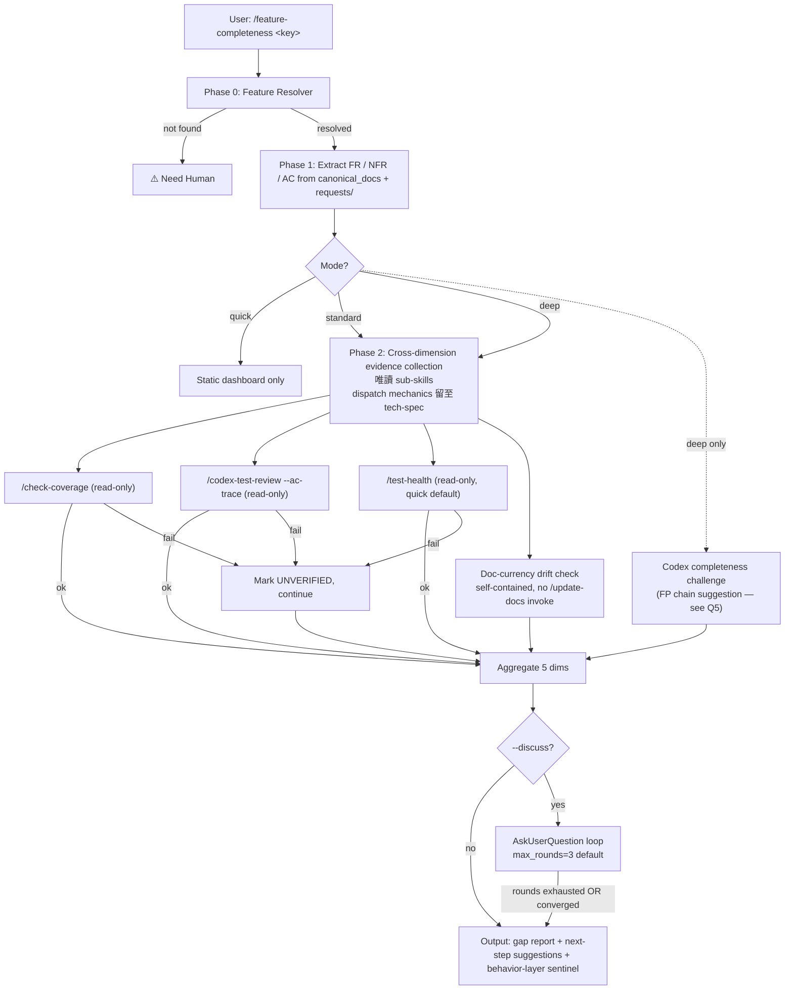

# Requirements: Feature Completeness Check

> **Doc class**: Lifecycle — Phase 1 requirements (per `@rules/docs-numbering.md`). Feature-level problem-space analysis. **Not** a task tracking ticket; for per-task progress tracking see `requests/*.md` (created via `/create-request`).
> **Created**: 2026-04-20
> **Updated**: 2026-04-20
> **Tier**: standard
> **Skill name**: `feature-completeness`（已定案，見 §9 Q1 RESOLVED）

## 1. Problem Statement

現有「完成度」相關 skill 各自切成單一切面，**沒有人回答「這個 feature 整體是否完成」這個跨維度問題**。當開發者宣稱某 feature「做完了」時，缺乏以 feature 為單位、結合 lifecycle docs（requirements / tech-spec / architecture / requests）做整體核對的機制 — 容易出現「測試覆蓋很高但 FR-3 沒實作」、「code 寫完但 doc 過時」、「AC 沒有 evidence」這類局部最佳化盲點。

### 5-Why Trace

1. 表層：使用者要一個完成度檢測 skill，類似 `/test-health` 但檢查「整個功能」而非僅測試
2. Why：現有 skill 只檢查單一切面 — `/test-health` 看測試、`/pre-pr-audit` 看 PR 就緒度、`/project-audit` 看專案層、`/check-coverage` 看「文件對應的測試」、`/codex-test-review --ac-trace` 看單一 request AC
3. Why：Feature 的「完成」涉及多維度 — Spec 是否存在、FR 是否實作、實作是否有測試、AC 是否有 evidence、doc 是否與 code 同步 — 任一維度不完整都會在後期出 issue
4. Why：缺乏跨維度整體視角會導致 local optima — 各切面看似 OK 但合在一起未必完成；目前需要人工 cross-check 多份報告
5. 根因：缺一個以 **feature 為單位**、以 **lifecycle docs 為 source-of-truth**、做**跨維度完整性核對**並與**使用者討論**的 orchestrator skill

## 2. Goals / Non-Goals

| Goals | Non-Goals |
|-------|-----------|
| 以 feature 為單位做跨維度完成度核對（spec / code / test / AC / doc currency） | 取代 `/pre-pr-audit`（PR-centric, code-diff 焦點） |
| 與使用者**討論** — 結合上下文 + lifecycle docs 對話釐清完成度認知 | 取代 `/project-audit`（專案層、與 feature 無關的 12 項 deterministic check） |
| Orchestrate 既有**唯讀** sub-skill（`/check-coverage`、`/test-health`、`/codex-test-review --ac-trace`），避免重複實作；drift 偵測僅做讀取 + `git diff` 比對，**不 invoke 任何 mutating skill** | 自動修補 gap（READ-ONLY，輸出 gap 報告 + 建議命令；`/update-docs` 等修補 skill 僅能在 next-step 建議中列出，由使用者自行決定） |
| 輸出 gap report + 可行動 next steps；gate 以 behavior-layer sentinel 呈現（不擴充 hook 契約，參 `@rules/auto-loop.md`「⚠️ Need Human」等 behavior-layer-only 先例） | 跑測試本身（由 `/verify` 負責） |
| 可在 feature 開發任一階段執行（progress check 或 final check） | 程式碼語意 review（由 `/codex-review-fast` 負責） |
| 與 `/review-spec`（既有 spec 審核）及 planned `/codex-review-spec`（FP 推理挑戰，設計中，見 `docs/features/codex-review-spec/1-requirements.md`）形成互補：那些問「推理是否站得住」，本 skill 問「執行是否完整」 | 跨 feature 的 portfolio 檢視（v1 限單 feature） |

## 3. Stakeholders

| Stakeholder | Role | Key Concern |
|-------------|------|-------------|
| Feature Owner | User | 想在宣稱「做完」前確認整體完整性，避免後期被 reviewer / 測試 / 上線發現缺漏 |
| Tech Lead / Reviewer | User | 在 PR / merge / release 前進行 feature-level audit；補強 PR-level review 的盲區 |
| Downstream consumers (其他 skill / 整合方) | Dependent | 依賴本 feature 的下游需要確認 feature 真的可用 |
| QA / Release Manager | Consumer | 消費 gate verdict 作為 release go/no-go 參考；需要穩定的 verdict schema |
| Auto-loop / Hooks | Operator | 可能將本 skill 接入 release gate（例如 epic-merge 前的 final check）；需辨識 behavior-layer sentinel |
| 既有 skills (`test-health` / `pre-pr-audit` / `project-audit` / `check-coverage` / `codex-test-review`) | Dependent | 本 skill 為 orchestrator — 必須清楚劃界，避免職責重疊；**僅呼叫唯讀 skill** |
| `/review-spec`（existing）、`/codex-review-spec`（planned） | Peer | 兩者皆屬 FP 推理挑戰（縱向）；本 skill 為完成度核對（橫向）。存在 / 設計中狀態差異見 §10 |
| `/update-docs` | Suggested-to-user only | **不被本 skill invoke**（mutating skill）；僅在 next-step 建議中列出，由使用者主動執行 |
| Codex MCP（若採對抗討論模式） | Dependent | 若用 Codex 做完成度挑戰，須遵循 `@rules/codex-invocation.md` 獨立研究原則 |

### 3.1 Orchestration Dispatch & Degradation

## 4. Use Cases

| # | Actor | Action | Expected Outcome |
|---|-------|--------|-----------------|
| UC-1 | Feature Owner | 開發中執行 `/feature-completeness` 檢查 progress | 取得跨維度完整性 dashboard：每個維度的 status + 缺口清單 + 建議下一步命令 |
| UC-2 | Feature Owner | 宣稱「做完」前執行 final completeness check | 取得完成度判定（`✅ Feature-Complete` / `⚠️ Partial` / `⛔ Incomplete`；與 FR-7 / NFR-4 統一用語）+ 可行動 gap list；若 Feature-Complete 才進 `/pre-pr-audit` → `/create-pr` |
| UC-3 | Tech Lead | 對某 feature 執行 `/feature-completeness <feature-key> --discuss` | 進入互動討論模式：skill 提出觀察 → user 確認 / 反駁 → 修正完成度判定 |
| UC-4 | Auto-loop | epic-merge 前自動執行 | 取得 feature 整體完成度 verdict 作為 release gate 之一 |
| UC-5 | Reviewer | 對未文件化的 feature（無 lifecycle docs）執行 | Skill 偵測到無 source-of-truth → 明確失敗或降級為 code-only audit + 建議先跑 `/req-analyze` / `/tech-spec` |

## 5. Functional Requirements

| ID | Requirement | Priority | Rationale |
|----|-------------|----------|-----------|
| FR-1 | 接受 feature key 參數（無參數時自動偵測），採用與 `/req-analyze` / `/tech-spec` 相同的 5-level cascade；消費 resolver 輸出中的 `canonical_docs` 清單作為 lifecycle docs 列舉依據 | Must | 一致性；避免新發明偵測機制；`canonical_docs` 處理 phase gap 與檔名變體 |
| FR-2 | 以 resolver 回傳的 `canonical_docs`（可能含 0-/1-/2-/3-/4- 變體、缺漏 phase、subfolder 形式）加上 `requests/*.md` 為 source-of-truth 提取 FR / NFR / AC 清單；**不硬編檔名**；無 docs 須降級或失敗（見 UC-5） | Must | 使 FR-2 與 `@rules/docs-numbering.md` 的 phase-gap-allowed 規則相容 |
| FR-3 | 對每個 FR / AC 執行**跨維度完成度評估**：**baseline 固定 5 維**（一律執行）：(a) Spec 存在性、(b) Code 實作對應、(c) Test 覆蓋、(d) AC evidence、(e) Doc currency；**opt-in 擴充維度**（僅在 user 明示時納入）：`--include-security`（chain `/codex-security`）、`--include-runtime`（chain `/feature-verify`）、`--include-risk`（chain `/risk-assess`）。擴充維度失敗或未啟用時不影響 baseline verdict | Must | Baseline 確保行為可預期；opt-in 維度避免強制成本（security feature 才需 security review 等）— 對應 §9 Q3 RESOLVED |
| FR-4 | Orchestrate 既有**唯讀** skill — 不重複實作既有功能：(a) `/check-coverage` for feature-doc test mapping、(b) `/codex-test-review --ac-trace <request>` for AC evidence、(c) `/test-health`（預設 quick mode，`--full` 為 deep mode — 遵 `skills/test-health/SKILL.md` 文件介面）引用測試 dashboard。**Doc currency 維度**：本 skill 自行以 read-only 工具比對 doc 與 code 修改時間，細節（具體命令、timestamp 策略）延遲至 tech-spec 展開，**不 invoke mutating `/update-docs`** | Must | 避免 skill ecosystem 重疊；同時維持 READ-ONLY 契約（FR-8）。`/update-docs` 為 mutating skill（`allowed-tools` 含 `Write` / `Edit`） |
| FR-5 | **組合式討論模式**（對應 §9 Q2 RESOLVED = a + c + d）：**default 模式 (a) 報告 + Q&A** — 先輸出完整 dashboard，使用者可針對任一維度提問，skill 以 lifecycle docs 為 bounded context 回答（類似 `/recap-ask` 的受限 Q&A）；**opt-in flag `--challenge` (c) Codex 對抗** — 啟用 Codex 獨立審核每個 FR/AC 的 **completion 判定**（「FR-3 是否真的實作」「AC 是否真的有 evidence」等 horizontal completion 質疑；遵循 `@rules/codex-invocation.md`，不餵結論）；**(d) 組合**：兩者可疊加（`--discuss --challenge`）。互動回合上限 default=3，以 `--max-rounds N`（1 ≤ N ≤ 10）覆蓋（見 NFR-7）。**邊界與 Q5 區分**：`--challenge` 僅挑戰**完成度**（橫向），不挑戰 spec 推理是否站得住（縱向，後者由 §9 Q5 所指 `/review-spec` / planned `/codex-review-spec` 負責）；若 Q5 決定 chain reasoning skill，該呼叫與 `--challenge` 為**不同 prompt** 且可並行，不互相取代 | Must | 對應使用者明示「想根據上下文討論」；Q&A 提供使用者主導、Codex challenge 提供對抗驗證；明示邊界避免與 Q5 推理審核重疊 |
| FR-6 | 輸出 gap report：(a) 每個 FR/AC 的 status table、(b) 缺口清單（按嚴重度）、(c) 可行動 next-step 命令清單（含對 mutating skill 的**建議**如 `/update-docs <path>`，由使用者決定是否執行） | Must | 報告必須直接可執行，避免「分析完還要 user 自己想下一步」 |
| FR-7 | Gate 採**三段 status 模型**（§9 Q4 RESOLVED — 不引入 0-100 分，保持 v1 簡單）：`✅ Feature-Complete`（5 維 baseline 全過）/ `⚠️ Partial`（任一 baseline 維度有缺口或 UNVERIFIED）/ `⛔ Incomplete`（baseline 任一維度為 fail 或 `[NO_SPEC]`）。Per-dimension verdict 作為 status 附屬資訊並列顯示。採 **behavior-layer-only** 策略（對齊 `@rules/auto-loop.md` 中 `⚠️ Need Human` 先例），**獨立 header key `## Completeness Verdict:`**（禁止 `## Gate:` 前綴，因 `hooks/stop-guard.sh:219-220` 通配解析會誤判）。v1 不接入 hook；未來若需 hook 整合，於 follow-up spec 擴充契約 | Must | 三段 status 覆蓋 UC-2 go/no-go 決策需求；score 可作 post-v1 增補；獨立 header 避免 hook 誤匹配 |
| FR-8 | READ-ONLY：不修改 docs、不修改 code、不執行 git add/commit/push；**不 invoke 任何 mutating sub-skill**（`/update-docs` / `/feature-dev` / `/smart-commit` / `/create-pr` 等一律僅能出現在建議文字） | Must | 與 `/feature-verify` / `/pre-pr-audit` 一致；明示 sub-skill 層級約束以呼應 FR-4 |
| FR-9 | `When NOT to Use` 須清楚劃界至少 6 個近鄰 skill：`/test-health`、`/pre-pr-audit`、`/project-audit`、`/check-coverage`、`/codex-test-review`、`/review-spec`（並於 `/codex-review-spec` 實作後補入） | Must | 使用者明示「有別於 PR 的檢查」；防止誤用 |
| FR-10 | 支援多種執行模式：`--quick`（dashboard only）、`--standard`（含 orchestration）、`--deep`（含 Codex 對抗挑戰，見 Q5） | Should | 與 `/req-analyze` / `/test-health` 模式一致；user 可選擇成本 |
| FR-11 | 結果可供 `/pre-pr-audit` / `/epic-merge` 等下游 skill 引用（輸出 JSON 模式） | Could | 整合潛力；MVP 可先輸出 markdown |
| FR-12 | 偵測 doc 與 code 不同步時，在 next-step 建議中列出 `/update-docs <path>`（**不自動執行**） | Could | 提升可用性且保持 READ-ONLY；與 FR-4 / FR-8 一致 |

Priority: Must / Should / Could / Won't (MoSCoW)

## 6. Non-Functional Requirements

| ID | Category | Requirement | Metric |
|----|----------|-------------|--------|
| NFR-1 | Correctness | Source-of-truth 一致性 — 所有 FR/AC 提取自 lifecycle docs，不從 code 反推；若 docs 缺漏需明確標示 `[NO_SPEC]` | Spec 提取 unit test：對 fixture docs 100% 命中 FR-N / AC-N 標記 |
| NFR-2 | Performance | **SLO scope：baseline 5 維（FR-3 baseline）執行時適用**；若啟用 opt-in flag（`--include-security` / `--include-runtime` / `--include-risk`），SLO 額外加總對應 sub-skill 的 p50（如 `/codex-security` 自身 p50），以各 sub-skill 自身文件記錄的 p50 總和作為該次執行的參考上限；`--challenge` 亦視為 opt-in，SLO 同理加計。按 feature size 分級；**feature size = FR 數量 + 被計入的 request doc 數量**（v1 baseline 採 "open requests" 範圍，操作定義：request doc 的 `## Status` 值 ∉ `{Completed, Done, Superseded, Archived}`；無 `## Status` 區塊者視為 open；§9 Q7 僅定義 post-v1 override flag 語意，不影響 v1 baseline）：**Small**（size ≤ 10）p50/p95 `--quick` < 10s/20s、`--standard` < 90s/180s、`--deep` < 5min/8min；**Medium**（10 < size ≤ 30）`--quick` < 30s/60s、`--standard` < 3min/5min、`--deep` < 10min/15min；**Large**（size > 30）`--quick` < 60s/120s、`--standard` < 6min/9min、`--deep` 不設硬上限（標示 slow 並提供 progress）。**拆分原因**：`/test-health --full` 自身文件記錄 2-5min（`skills/test-health/SKILL.md`），orchestration 累積成本需據 size 估算 | 每個 bucket 採樣 5 次取 p50 與 p95 |
| NFR-3 | Maintainability | SKILL.md ≤ 200 行（thin entry 模式），dimension 定義 / orchestration map / output template 置於 `references/` | 行數驗證 + reference 拆分檢查 |
| NFR-4 | Consistency | Gate sentinel 為 **behavior-layer-only**（參 `@rules/auto-loop.md` Gate Sentinels 表中 `⚠️ Need Human` 先例）：**輸出 header 固定採 `## Completeness Verdict:`，禁止 `## Gate:`**（`hooks/stop-guard.sh:219-220` 以通配 prefix 解析，任何 `## Gate: ✅/⛔` 行都會被匹配）；v1 不擴充 hook 契約 | grep 驗證：(a) 輸出**零次** `## Gate:` 字樣、(b) 未複用 `✅ Ready` / `✅ Mergeable` / `✅ All Pass`、(c) 自 sentinel 不在 `stop-guard.sh` parse list |
| NFR-5 | Reliability | 任一 sub-skill 失敗時 graceful degradation — 該維度標記 `[UNVERIFIED]` 並繼續，不整體失敗 | 注入 sub-skill failure 的 integration test |
| NFR-6 | Security | 所有 sub-skill 呼叫遵循各自的 allowed-tools 邊界；本 skill 不額外擴權；READ-ONLY 強制 — **allowed-tools 清單不得含 Write / Edit / `Bash(git add:*)` / `Bash(git commit:*)` / `Bash(git push:*)`**；只 invoke mutation-free skill（FR-4 / FR-8） | allowed-tools 清單審核；無 git add/commit/push 命令；sub-skill mutability 白名單驗證 |
| NFR-7 | Usability | 討論模式（`--discuss`）互動回合數預設上限 `max_rounds=3`，可由 `--max-rounds N`（1 ≤ N ≤ 10）覆蓋；達上限時輸出最終 verdict + 未釐清項清單 | 互動上限 unit test（default=3；override 邊界驗證 1 / 10 / 超界值） |
| NFR-8 | Cross-ecosystem | 不假設特定語言；test mapping / coverage 委派給 `/check-coverage` 處理 ecosystem 差異 | Node / Python / Go 各 1 fixture 跑通 |
| NFR-9 | Security | 輸出（gap report / dashboard / verdict）執行敏感資料 redaction：對 token / API key / 私鑰 / 絕對路徑中的家目錄使用者名採遮蔽策略（`[REDACTED]`） | 輸出 grep 掃描：無 `sk-`、`ghp_`、`-----BEGIN`、`/Users/<name>/`、`/home/<name>/` pattern（`/Users/` / `/home/` 後綴需經 redaction 或替換為 `$HOME`）；對齊 `@rules/security.md` + `@rules/logging.md` |

Categories: Performance, Security, Usability, Maintainability, Reliability, Scalability

## 7. Constraints & Assumptions

| Type | Description | Source |
|------|-------------|--------|
| Constraint | 必須以 lifecycle docs（`docs/features/<key>/`）為 source-of-truth；無 docs 場景須有 fallback（UC-5） | 使用者明示「根據相關技術文件討論」 |
| Constraint | READ-ONLY — 不修改任何檔案；不執行 git mutating 命令 | `@rules/git-workflow.md` + 與 audit-class skill 一致 |
| Constraint | 使用既有 skill orchestration；不重複實作 test count / coverage parsing | 避免 ecosystem 碎片化 |
| Constraint | 與 `/pre-pr-audit` / `/project-audit` / `/test-health` 不重疊 — 必須在 `When NOT to Use` 明確劃界 | 使用者明示「有別於 PR 的檢查」 |
| Assumption | 使用者已有 lifecycle docs（至少有 `2-tech-spec.md`）；無 docs 場景由降級邏輯處理 | `/req-analyze` / `/tech-spec` 已存在 |
| Assumption | 既有**唯讀** sub-skill（`check-coverage` / `codex-test-review --ac-trace` / `test-health` quick mode）的輸出可被 parse 整合；`/update-docs` 為 mutating skill **不在此列**，僅在 gap report 的 next-step 建議中提及由使用者執行 | 既有 skill 已產出結構化輸出；FR-4 / FR-8 READ-ONLY 契約一致 |
| Assumption | AskUserQuestion 在討論模式可運作（user 有 TTY） | 與 `/smart-commit` `--execute` 模式一致 |
| Assumption | Feature 的「完成」可由 lifecycle docs 中的 FR + AC 充分定義；隱性需求（未文件化）視為 out of scope | 若隱性需求多，可由 `--include-runtime` / `--include-security` 等 opt-in 維度（FR-3）補強；v1 不強制涵蓋 |

## 8. Acceptance Signals

- **S-1（FR-1/2）**：對任一已有 lifecycle docs 的 feature 執行 skill，能成功提取 FR/AC 清單（含 ID + 描述）
- **S-2（FR-3/4）**：dashboard 對每個 FR/AC 顯示五個維度的 status；至少有一個維度的數據來自 sub-skill orchestration（非本 skill 自行計算）
- **S-3（FR-5）**：`--discuss` 模式至少觸發一輪 AskUserQuestion；user 回答能影響最終 verdict
- **S-4（FR-6）**：gap report 含可直接執行的 next-step 命令（如 `/codex-test-gen <module>`、`/update-docs <path>`）
- **S-5（FR-7/NFR-4）**：gate sentinel 與既有 review / precommit / doc sentinel 不衝突；獨立命名空間
- **S-6（FR-8/NFR-6）**：執行過程中無任何 mutating 命令（`git add` / `git commit` / `git push` / file write 除 cache 外）
- **S-7（FR-9）**：`When NOT to Use` 表至少含 6 個近鄰 skill 並標註差異
- **S-8（FR-10）**：三種模式效能達 NFR-2 目標
- **S-9（NFR-1）**：FR/AC 提取結果與 fixture 文件 100% 命中
- **S-10（NFR-5）**：注入 sub-skill failure 後本 skill 仍能完成並標記 `[UNVERIFIED]` 維度
- **S-11（NFR-9）**：輸出經 redaction scan 後不含 `sk-` / `ghp_` / `-----BEGIN` / `/Users/<name>/` / `/home/<name>/` 等敏感 pattern

### 8.1 FR ↔ Acceptance Signal Trace

| FR / NFR | Signals |
|----------|---------|
| FR-1, FR-2 | S-1 |
| FR-3, FR-4 | S-2 |
| FR-5, NFR-7 | S-3 |
| FR-6 | S-4 |
| FR-7, NFR-4 | S-5 |
| FR-8, NFR-6 | S-6 |
| FR-9 | S-7 |
| FR-10, NFR-2 | S-8 |
| NFR-1 | S-9 |
| NFR-5 | S-10 |
| NFR-9 | S-11 |
| FR-11, FR-12 | 無 MVP signal（Could 優先級） |
| NFR-3, NFR-8 | 實作期間於 tech-spec 展開驗證標準 |

## 9. Open Questions

### RESOLVED（使用者於 2026-04-20 定案）

- [x] **Q1 — Skill 命名**：**RESOLVED = `feature-completeness`**
  - 使用者於 2026-04-20 定案。語意最直白、不與既有 `*-audit` / `*-health` 命名混淆。source-of-truth 路徑 `skills/feature-completeness/SKILL.md`（installed mirror `.claude/skills/feature-completeness/` 由 install 工具同步）

- [x] **Q2 — 討論模式**：**RESOLVED = (a) + (c) + (d) 組合**
  - Default：(a) 報告 + Q&A（bounded context 回答，類似 `/recap-ask`）
  - Opt-in：`--challenge` flag 啟用 (c) Codex 獨立對抗挑戰（遵循 `@rules/codex-invocation.md`）
  - (d) 兩者可疊加：`--discuss --challenge`
  - 詳細 contract 見 FR-5

- [x] **Q3 — 完成度維度**：**RESOLVED = 5 固定 baseline + opt-in 擴充**
  - Baseline（固定，一律執行）：Spec 存在性、Code 實作、Test 覆蓋、AC evidence、Doc currency
  - Opt-in flag（使用者明示才加）：`--include-security` / `--include-runtime` / `--include-risk`
  - 擴充維度失敗不影響 baseline verdict
  - 詳細 contract 見 FR-3

- [x] **Q4 — Gate 模型**：**RESOLVED = 三段 status**
  - `✅ Feature-Complete` / `⚠️ Partial` / `⛔ Incomplete`
  - 不引入 0-100 分（v1 保持簡單；score 作為 post-v1 增補考量）
  - Per-dimension verdict 作為 status 附屬資訊並列顯示
  - 詳細 contract 見 FR-7

### 仍需決策（較低優先 — 可在 tech-spec 階段定案）

- [ ] **Q5 — 與 `/review-spec` / `/codex-review-spec`（planned）的關係**：三者皆為 feature-level audit：
  - 本 skill 問「**執行**是否完整」（橫向）
  - `/review-spec`（existing, Claude subagent）與 `/codex-review-spec`（planned, Codex）問「**推理**是否站得住」（縱向）
  - **是否在 deep 模式自動 chain 推理審核？還是保持完全獨立？若 chain，選 `/review-spec` 還是等 `/codex-review-spec` 實作後？**

- [ ] **Q6 — 觸發時機與整合**：
  - 開發中（progress check）vs 宣稱完成時（final check）vs 兩者皆可？
  - 是否要將 verdict 接入 `/epic-merge` / `/create-pr` 等 release gate？或保持純 advisory？

- [ ] **Q7 — 多 request 聚合策略 override**（**非 baseline**，baseline 已由 NFR-2 訂為 "open requests"，status ∉ `{Completed, Done, Superseded, Archived}`）：Q7 僅針對 **post-v1 override flag** 的語意：
  - (a) `--scope=latest`：只看最新 request 的 AC（追 active work）
  - (b) `--scope=open`：聚合所有 open status 的 request（**= v1 baseline**）
  - (c) `--scope=all`：聚合全部 request 含 done（feature lifetime completeness）
  - **使用者偏好的 override flag 命名與是否在 v1 即暴露？**

### 屬解決方案空間 — 建議 `/feasibility-study`

- [ ] Solution concern：JSON 輸出 schema（FR-11）— 給下游 skill 消費的具體格式 — suggest `/feasibility-study`
- [ ] Solution concern：sub-skill 並行 vs 串行 dispatch 策略（3 個 sub-skill 並行可能太重）— suggest `/feasibility-study`
- [ ] Solution concern：無 lifecycle docs 場景的降級邏輯細節（UC-5）— suggest `/feasibility-study`
- [ ] Solution concern：discussion mode 的對話狀態管理；上限已在 NFR-7 訂 default=3，細節對話記憶 / resume 策略 — suggest `/feasibility-study`
- [ ] Solution concern：FR-11 / FR-12 / NFR-3 / NFR-8 的驗證 owner 與時程（標 Could / 非 MVP 項目） — suggest `/feasibility-study`

## 10. References

### 生態對照（Gap 分析）

| Skill | Scope | Source-of-Truth | 本 skill 的差異 |
|-------|-------|-----------------|----------------|
| `skills/test-health/SKILL.md` | 測試覆蓋（量化 + 品質） | 測試檔案 + coverage artifacts | 本 skill 含 spec / code / AC / doc 多維度，不限測試 |
| `skills/check-coverage/SKILL.md` | Feature-doc 對應的測試覆蓋 | Feature docs vs source code | 本 skill 包含 check-coverage 為 sub-step，並擴及 spec / AC / doc |
| `skills/pre-pr-audit/SKILL.md` | PR 就緒度（5 dim, 0-100 score） | git diff vs tests | PR-centric vs feature-centric — pre-pr 看 diff，本 skill 看 lifecycle |
| `skills/project-audit/SKILL.md` | 專案層面（12 deterministic checks） | 專案結構 | Project-wide vs feature-wide |
| `skills/codex-test-review/SKILL.md` (`--ac-trace`) | 單一 request 的 AC evidence | 單一 request doc | 本 skill 跨多個 request + spec FR 整合 |
| `skills/feature-verify/SKILL.md` | Runtime 行為驗證（L1-L5） | Live API + log | Runtime vs document/code static check（可選整合） |
| `skills/review-spec/SKILL.md`（existing） | Spec 審核（完整性 / 可行性 / 風險；Claude subagent） | Lifecycle spec docs | 互補 — 那個查 spec 質量，本 skill 查 feature 整體執行完成度 |
| `skills/codex-review-spec/`（**planned — skill 尚未實作**，僅有需求文件於 `docs/features/codex-review-spec/1-requirements.md`） | FP 推理挑戰（縱向，Codex 獨立研究） | Lifecycle spec docs | 互補 — 那個查 reasoning（規劃中），本 skill 查 completeness（橫向）。§5 Q5 討論是否於 deep 模式 chain |
| `skills/req-analyze/SKILL.md` | 需求分析（生成 1-requirements.md） | User 描述 + code research | 本 skill **消費** requirements，不生成 |
| `skills/update-docs/SKILL.md`（**mutating**，`allowed-tools` 含 `Write` / `Edit`） | Doc-vs-code drift 偵測 + 更新 | Doc + git diff | 本 skill **不 invoke**；僅在 next-step 建議中列出；drift 偵測由本 skill 自行以 `git diff` + `stat` 完成（FR-4） |

### 相關規則

- `@rules/auto-loop.md` — Gate sentinel 設計（NFR-4）
- `@rules/codex-invocation.md` — 若 Q5 / Q2 採 Codex 對抗模式，須遵循獨立研究原則
- `@rules/docs-numbering.md` — Lifecycle doc 命名（FR-2 source-of-truth 結構）
- `@rules/testing.md` — Evidence model + AC mapping（FR-3 維度設計依據）
- `@rules/git-workflow.md` — READ-ONLY 約束（FR-8）

### 研究來源

- Code: `skills/test-health/SKILL.md:1-220`（測試完成度的成熟模式 — multi-dimensional dashboard、anti-coverage-theater guardrails）
- Code: `skills/pre-pr-audit/SKILL.md:1-190`（PR-level 完成度的成熟模式 — 5 維度、hard-fail override、confidence index）
- Code: `skills/project-audit/SKILL.md:1-92`（專案層完成度 — deterministic check + status determination）
- Code: `skills/check-coverage/SKILL.md:1-97`（Feature-doc 對應 test 的成熟模式 — 可被本 skill orchestrate）
- Code: `docs/features/codex-review-spec/1-requirements.md`（最近的 spec 審核 skill 設計 — 提供命名 / sentinel / boundary 對照）
- Code: `scripts/lib/feature-resolver.js:24-35`（`canonical_docs` 欄位實作位置 — FR-1 / FR-2 的資料來源；`scripts/resolve-feature-cli.js` 為 pass-through CLI wrapper）
- Code: `hooks/stop-guard.sh:219-220`（gate sentinel 解析邏輯 — FR-7 / NFR-4 避免 `## Gate:` 的依據）

### Resolved from Prior Review

- `/codex-review-spec` 於 2026-04-20 尚未實作 — `ls skills/codex-review-spec` 回 `not-found`；目前僅存需求文件於 `docs/features/codex-review-spec/1-requirements.md`。本文件一律以 "planned" 標註，§5 Q5 提供 chain 路徑待其實作後決定。
- `/test-health` 的 `--quick`/`--full` 介面：quick 為預設（無 flag），full 以 `--full` 觸發（參 `skills/test-health/SKILL.md`）。FR-4 / §3.1 Mermaid 均已對齊。
