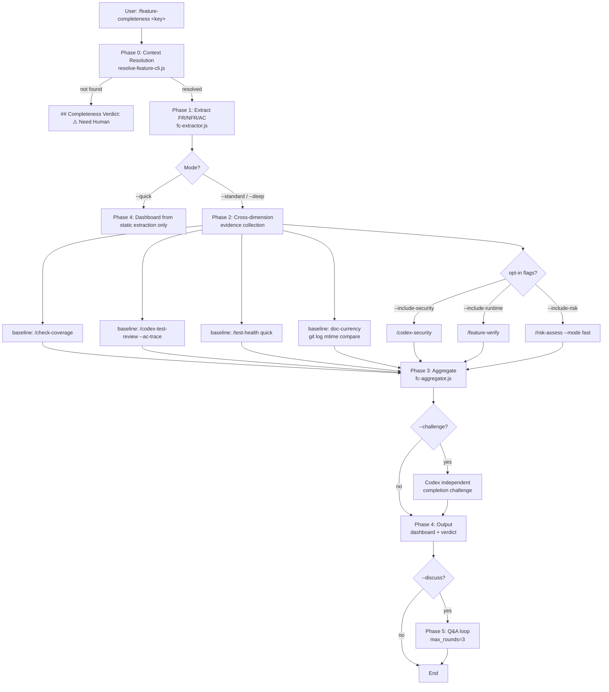

# Feature Completeness — Technical Spec

> **Doc class**: Lifecycle — Phase 2 technical spec (per `@rules/docs-numbering.md`)
> **Created**: 2026-04-20
> **Requirements**: [1-requirements.md](./1-requirements.md)
> **Skill source path**: `skills/feature-completeness/SKILL.md`

## 1. Requirement Summary

- **Problem**: 缺少以 feature 為單位、跨維度（spec / code / test / AC / doc-currency）核對完成度的機制（見 [1-requirements.md §1](./1-requirements.md)）
- **Goals**（FR 全集參 [1-requirements.md §5](./1-requirements.md)）：
  - 5 固定 baseline 維度 + opt-in 擴充（FR-3）
  - 預設 Q&A + `--challenge` Codex 對抗（FR-5）
  - 3-tier verdict，`## Completeness Verdict:` header 避開 hook 誤匹配（FR-7）
  - READ-ONLY，僅 orchestrate 唯讀 sub-skill（FR-4 / FR-8）
- **Scope**（MVP）：FR-1 ~ FR-9 + FR-10（mode 分級）；FR-11（JSON）與 FR-12（currency suggest）視 phase-2 而定
- **Non-goals**：取代 `/pre-pr-audit` / `/project-audit` / `/test-health`；自動修補；跨 feature portfolio

## 2. Existing Code Analysis

### 2.1 Reusable Components

| Component | Path | Reuse For |
|-----------|------|-----------|
| `feature-resolver.js` | `scripts/lib/feature-resolver.js:24-35` | Phase 0 feature context + `canonical_docs` extraction |
| `resolve-feature-cli.js` | `scripts/resolve-feature-cli.js` | CLI wrapper for shell invocation in SKILL.md `!` context blocks |
| `doc-classifier.js` | `scripts/lib/doc-classifier.js` | Doc taxonomy scan — reused by resolver |
| `security-redact.js` | `scripts/security-redact.js`（見 `/recap-ask` 先例） | NFR-9 redaction pipeline |
| Cache convention | `.claude/cache/<skill-name>/<repoKey>/` (參 `skills/test-health/references/trend-schema.md:5-16`) | Phase 3 state/snapshot storage |
| Skill dispatch pattern | `Skill(<name>, <args>)` tool invocation (參 `skills/test-health/SKILL.md:60-77` Phase A dispatch) | FR-4 sub-skill orchestration |

### 2.2 Sub-Skill Interfaces

| Sub-skill | Invocation | Output parsed for |
|-----------|-----------|-------------------|
| `/check-coverage` | `Skill("check-coverage", "<docs_path>")` | Coverage gap table (🔴/🟠/🟡 rows) |
| `/codex-test-review --ac-trace <request>` | `Skill("codex-test-review", "--ac-trace <path>")` | `VALID_EXCEPTION` / `INADEQUATE` verdict per AC |
| `/test-health` (quick default) | `Skill("test-health", "")` | Test inventory + coverage artifacts |
| `/codex-security` | `Skill("codex-security", "")` | OWASP-dimension findings（opt-in, `--include-security`）|
| `/feature-verify` | `Skill("feature-verify", "<key>")` | Runtime L1-L5 verdict（opt-in, `--include-runtime`）|
| `/risk-assess --mode fast` | `Skill("risk-assess", "--mode fast")` | Risk level + top_affected（opt-in, `--include-risk`）|
| `/review-spec`（optional chain） | `Skill("review-spec", "<spec-path>")` | Reasoning-layer review（§7 Q5 決定後啟用）|

### 2.3 Files to Create

| File | Purpose |
|------|---------|
| `skills/feature-completeness/SKILL.md` | Thin entry (≤ 200 lines, per NFR-3) |
| `skills/feature-completeness/references/dimensions.md` | 5 baseline + 3 opt-in 維度定義 + evidence 來源 |
| `skills/feature-completeness/references/orchestration.md` | Sub-skill dispatch map + graceful degradation |
| `skills/feature-completeness/references/output-template.md` | Dashboard / gap report / verdict format |
| `skills/feature-completeness/references/discussion-prompts.md` | Q&A bounded prompt + `--challenge` Codex prompt（無結論餵養） |
| `skills/feature-completeness/references/extraction.md` | FR / NFR / AC 擷取規則與 regex |
| `scripts/lib/fc-extractor.js` | FR / AC 提取純函式（含 unit test 鉤點） |
| `scripts/lib/fc-aggregator.js` | 跨維度結果聚合 + 3-tier verdict mapping |
| `test/scripts/lib/fc-extractor.test.js` | FR-2 / NFR-1 fixture 命中測試 |
| `test/scripts/lib/fc-aggregator.test.js` | FR-7 3-tier mapping + `[UNVERIFIED]` 處理 |
| `test/skills/feature-completeness.test.js` | SKILL.md 結構 + allowed-tools + sentinel header 驗證 |

### 2.4 Request `Status` 讀法的三方分歧（`scripts/lib/request-status.js` 的存在理由）

同一個 `Status` 欄位長出過三種互不相容的讀法，`fc-extractor.js` 是其中之一：

| consumer | window | case | 接受的寫法 |
|---|---|---|---|
| `scripts/lib/fc-extractor.js` | 30 行 | insensitive | blockquote、heading、table |
| `skills/next-step/scripts/analyze.js` | 全文 | sensitive | table、blockquote |
| `skills/create-request/SKILL.md`（散文） | 15 行 | — | — |

分歧不只在剖析，更在**哪些值算「還沒結束」**。`analyze.js` 當時用的是四個值的**正面列表**（`pending`、`in development`、`in progress`、`nearly complete`）。對本 repo 實際存在的 request 量測（**2026-07-26 於 `96786d1` 量得 125 份**；此為當時快照，數字會隨 request 累積而漂移——重新量測用 `node -e 'const{parseRequestStatus}=require("./scripts/lib/request-status.js");…'` 逐一掃 `docs/features/*/requests/*.md`，2026-08-04 重量為 134 份 / `Candidate Complete` 28 份）：該列表漏掉 `Candidate Complete`（當時 20 份，第三常見）與 `Spec Complete`（1 份），而 `In Development` 與 `Nearly Complete` **一份都沒對到**。後果是 `request-stale` 對 21 份未結案 request 完全失明，`feature-complete` 可能在它們仍未結時就通過。

修法不是「補上漏掉的兩個字串」——那只會讓下一個新值以同樣方式被遺忘。`request-status.js` 改以**否定式**定義開放狀態：只有落在一組簡短、窮舉、封閉的**已結案**值裡才算結案，其餘一律開放，包含還沒有人想到的值。未知讀作開放，誤差方向偏向「回報已完成的工作」而非「隱藏未完成的工作」。

`OPEN_REQUEST_STATUS` 是觀察到的開放詞彙，屬文件與測試素材，**不是判準**——沒有任何分支依賴它的成員資格。

## 3. Technical Solution

### 3.1 Architecture



### 3.2 Data Model

#### 3.2.1 Completeness Snapshot

```typescript
// In-memory structure; optionally persisted to .claude/cache/feature-completeness/<repoKey>/
type CompletenessSnapshot = {
  version: 1;
  feature_key: string;
  timestamp: string;        // ISO 8601
  mode: 'quick' | 'standard' | 'deep';
  source_of_truth: {
    canonical_docs: {         // from feature-resolver.js
      requirements: string | null;
      tech_spec: string | null;
      architecture: string | null;
      feasibility: string | null;
    };
    requests_scope: 'open' | 'latest' | 'all';  // v1 hard-coded 'open'
    requests_included: string[];  // relative paths
  };
  items: CompletenessItem[];
  dimensions: DimensionResult[];
  verdict: Verdict;
  redaction_applied: boolean;
};

type CompletenessItem = {
  id: string;               // e.g. 'FR-3' / 'AC-2'
  type: 'FR' | 'NFR' | 'AC';
  source_doc: string;       // relative path
  source_line: number;
  text: string;
  per_dim_status: Record<DimensionName, ItemDimensionStatus>;
  rollup: 'complete' | 'partial' | 'incomplete' | 'unverified';
};

type ItemDimensionStatus = {
  status: 'pass' | 'partial' | 'fail' | 'unverified' | 'na';
  evidence: string[];        // file:line or sub-skill verdict ID
  note?: string;
};

type DimensionName =
  // baseline (always)
  | 'spec_presence'
  | 'code_implementation'
  | 'test_coverage'
  | 'ac_evidence'
  | 'doc_currency'
  // opt-in
  | 'security_review'
  | 'runtime_verification'
  | 'risk_alignment'
  | 'spec_review'            // --include-spec-review (chain /review-spec)
  // meta (populated by --challenge only)
  | 'codex_challenge';       // independent completion challenge summary; not a verdict source itself

type DimensionResult = {
  name: DimensionName;
  enabled: boolean;
  provider: 'self' | `/${string}`;   // e.g. '/check-coverage'
  status: 'pass' | 'partial' | 'fail' | 'unverified' | 'na';
  applicable_items: number;
  summary: string;
};

type Verdict = {
  status: 'Feature-Complete' | 'Partial' | 'Incomplete' | 'Need Human';
  icon: '✅' | '⚠️' | '⛔';
  rationale: string;
  hard_fail_triggers: string[];
};
```

#### 3.2.2 Cache Layout

```
.claude/cache/feature-completeness/<repoKey>/
├── latest.json               # Most recent snapshot (FR-11 JSON precursor)
└── history/
    └── <YYYYMMDD>-<sha>-<feature>.json
```

`<repoKey>` 與 `test-health` 共用格式（`safeSlug(repoBase)--<sha1(remote)>.slice(0,8)`；參 `skills/test-health/references/trend-schema.md:5-16`）。

### 3.3 API Design (Skill Interface)

```
/feature-completeness [<feature-key>] [flags]

Positional:
  <feature-key>       Feature slug (optional; auto-detect via 5-level cascade)

Mode flags (mutually exclusive) — aligned with 1-requirements.md FR-10:
  --quick             Dashboard only (no sub-skill dispatch) — default off
  --standard          Full baseline orchestration (default when no mode flag) — 5 baseline dims via read-only sub-skills
  --deep              --standard + auto-enable --challenge + upgrade test-health to --full
                      — deep ⊃ { standard, --challenge, test-health --full }
                      — Does NOT auto-include /review-spec（Q5 仍為 open decision — 使用者仍須顯式加 `--include-spec-review` opt-in；待 Q5 收斂後若改為 auto，此段同步更新）

Dimension opt-in flags (can combine; each maps to one sub-skill):
  --include-security  Chain /codex-security
  --include-runtime   Chain /feature-verify  ⚠️ sub-skill has broad Bash; see §4 R9 for read-only envelope
  --include-risk      Chain /risk-assess --mode fast  ⚠️ sub-skill lacks allowed-tools declaration; see §4 R9
  --include-spec-review  Chain /review-spec (existing); /codex-review-spec 實作後可升級

Interaction flags:
  --discuss           Enable Q&A after dashboard emission
  --challenge         Enable Codex independent completion challenge (auto-enabled under --deep)
  --max-rounds N      Override NFR-7 default=3 (range 1..10)

Output flags:
  --json              Emit CompletenessSnapshot JSON (FR-11; post-MVP if needed)

Scope override (post-v1, Q7):
  --scope latest|open|all   Override request aggregation; v1 hard-coded 'open'
```

### 3.4 Core Logic

#### 3.4.1 Phase 0 — Context Resolution

```
1. Invoke resolve-feature-cli.js --feature <key> (or no flag)
2. Classify spec state (unified taxonomy — resolves prior Phase 0 vs aggregator hard-fail conflict):
   - unresolved       : feature key itself not found (resolver returns null)
   - no-spec          : feature found BUT both canonical_docs.requirements AND canonical_docs.tech_spec are null
   - partial-spec     : exactly one of requirements / tech_spec present
   - full-spec        : both present
3. Action by state:
   - unresolved → emit "## Completeness Verdict: ⚠️ Need Human — feature not resolved" exit 0
   - no-spec    → emit "## Completeness Verdict: ⛔ Incomplete — no spec source"
                  + per-dim status all fail (`[NO_SPEC]`) + next-step suggest /req-analyze or /tech-spec, exit 0
   - partial-spec → continue Phase 1 with warning; spec_presence dim = `partial`
   - full-spec  → continue Phase 1 normally
4. For all `continue` cases: extract canonical_docs paths + scan requests/ for open status
```

> **Missing-spec taxonomy alignment**: `unresolved` maps to `⚠️ Need Human` (無法判斷 feature 是否存在，需 human intervention); `no-spec` maps to `⛔ Incomplete` (feature 存在但缺 spec — 這是完成度判斷結果，非 Need Human)。與 §3.4.4 hard-fail 一致。

**Open-request filter** (per NFR-2 baseline rule):

```
For each request in docs/features/<key>/requests/*.md:
  Read frontmatter OR first 50 lines
  Match: /^##\s+Status\s*:?\s*(.+)$/m
  If match.group(1) in {Completed, Done, Superseded, Archived} → exclude
  Else (including no match) → include
```

#### 3.4.2 Phase 1 — Extraction (`fc-extractor.js`)

Deterministic regex extraction on `canonical_docs.requirements` + `canonical_docs.tech_spec` + included requests:

| Item | Regex (multiline) | Source |
|------|-------------------|--------|
| FR | `^\|\s*(FR-\d+[a-z]?)\s*\|\s*(.+?)\s*\|\s*(Must\|Should\|Could\|Won't)\s*\|` | `## 5. Functional Requirements` section tables |
| NFR | `^\|\s*(NFR-\d+)\s*\|\s*\w+\s*\|\s*(.+?)\s*\|` | `## 6. Non-Functional Requirements` section tables |
| AC | `^(?:[-*]\s*)?\[\s*[x\s]\s*\]\s+(AC-\d+)\s*[:\-–]?\s*(.+)$` | `## Acceptance Criteria` section lists in request docs |

Each extracted item records `source_doc:source_line` (use `readline` + counter; avoid full-file regex for determinism).

#### 3.4.3 Phase 2 — Evidence Collection (per Dimension)

| Dimension | Provider | Collection strategy |
|-----------|----------|---------------------|
| `spec_presence` | self | Each FR/AC mapped to `source_doc:source_line`. Missing FR table or AC section → dimension `fail` |
| `code_implementation` | self | `grep -rE 'FR-\d+\|AC-\d+' skills/ scripts/ test/`（code traceability markers，若 team 採此 convention）；若無 marker，退回 heuristic：FR 描述關鍵詞出現於 `git diff --name-only <base>..HEAD` 後的檔案 → `partial`；完全無命中 → `fail` |
| `test_coverage` | `/check-coverage` | Parse skill output：Critical/Major gap 映射至 `fail`；Minor/Nice-to-have 映射至 `partial`；full coverage `pass` |
| `ac_evidence` | `/codex-test-review --ac-trace` | 每個 AC 對應的 verdict：`VALID_EXCEPTION`/`ADEQUATE` → `pass`；`INADEQUATE` → `fail` |
| `doc_currency` | self | 對每份 canonical_doc 跑 `git log -1 --format=%ct -- <doc>` 與 `git log -1 --format=%ct -- <related code dir>`；若 code > doc mtime 且差距 > 14 天 → `partial`；已知破壞性變更（function rename 於 doc 未更新）→ `fail`；其他 → `pass` |
| `security_review` (opt-in) | `/codex-security` | 有 P0/P1 finding → `fail`；P2 only → `partial`；clean → `pass` |
| `runtime_verification` (opt-in) | `/feature-verify` | L1/L2 → `partial`；L3+ pass → `pass`；L3+ fail → `fail` |
| `risk_alignment` (opt-in) | `/risk-assess --mode fast` | `risk_level=HIGH` 且零測試覆蓋 → `fail`；其他映射見 aggregator |

**Parallel dispatch**: baseline 4 sub-skills + opt-in N 個。**v1 採 sequential** dispatch（與 `skills/test-health/SKILL.md` full mode Phase A→B→C→D 的 sequential 先例一致 — 目前 repo 無多路 Skill 並發基準可參照）；Parallel 最佳化視實測延遲 > NFR-2 bucket SLO 時於 phase-2 加上。`/check-coverage` 輸出可餵 `/codex-test-review --ac-trace`（語意上 chain，實作以 sequential 串接）。

#### 3.4.4 Phase 3 — Aggregation (`fc-aggregator.js`)

3-tier verdict mapping（FR-7）：

```
Verdict-contributing dims = baseline(5) ∪ opt-in(4: security/runtime/risk/spec-review)
Non-contributing dims     = { 'codex_challenge' }  // summary-only; NEVER enters verdict math
                                                     // Codex challenge findings appear in output §Challenge Summary
                                                     // but do NOT flip a pass dimension to fail

For each DimensionResult d where d.name ∈ VerdictContributing AND d.enabled:
  if d.name ∈ baseline(5):
    if d.status == 'fail' → baseline_has_fail = true
    if d.status in ['partial', 'unverified'] → baseline_has_gap = true
  else (d.name ∈ opt-in):
    if d.status == 'fail' → opt_has_fail = true

Verdict:
  if baseline_has_fail → '⛔ Incomplete'
  else if baseline_has_gap → '⚠️ Partial'
  else if opt_has_fail → '⚠️ Partial'  // opt-in fail downgrades but does not block baseline
  else → '✅ Feature-Complete'

Hard-fail overrides (force ⛔ Incomplete):
  - Phase 0 state == 'no-spec' (spec missing entirely — NOT Need Human; see §3.4.1 unified taxonomy)
  - AC evidence has INADEQUATE in a prohibited-domain AC (security / data-integrity / regression — enumerated per @rules/testing.md; classification by AC text matching — see §3.4.4.1)

Hard-warn (do NOT force ⛔, but surface prominently):
  - Phase 0 state == 'unresolved' → ⚠️ Need Human (exit before aggregation)
```

#### 3.4.4.1 Prohibited-Domain AC Classification (supports hard-fail override)

Deterministic rule for classifying an AC into `security` / `data-integrity` / `regression` domains per `@rules/testing.md`:

| Domain | Match condition (case-insensitive, OR) |
|--------|---------------------------------------|
| security | AC text contains any of: `auth`, `authz`, `password`, `token`, `secret`, `XSS`, `CSRF`, `SSRF`, `injection`, `redaction`, `PII`, `encryption`, `signature verification`, `access control` |
| data-integrity | AC text contains any of: `transaction`, `consistency`, `idempotent`, `migration`, `rollback`, `data loss`, `no duplicate`, `no drop`, `atomic` |
| regression | AC text contains any of: `regression`, `must not break`, `backward compatible`, `existing behavior`, `no regression` |

If an AC matches ≥ 1 domain and its `ac_evidence` status is `fail` or `partial` with `INADEQUATE` verdict → trigger hard-fail.
Ambiguous matches (no domain keyword hit) → classified `other` → follow normal 3-tier rollup.
Extractor stores `domains: string[]` per AC; aggregator reads this array for hard-fail evaluation.

#### 3.4.5 Phase 4 — Output

- Header：`## Completeness Verdict: <icon> <status>`（**禁止 `## Gate:`**，NFR-4）
- Dashboard：per-item status table + per-dimension summary + hard-fail list + actionable next-step commands（含 `/update-docs` 建議於 doc_currency partial 時）
- Redaction：輸出前跑 `security-redact.js`，高信心密鑰 → abort；中信心 → `[REDACTED]`（NFR-9）

#### 3.4.6 Phase 5 — Discussion Loop (opt-in)

```
--discuss:
  Loop (max_rounds=3 default):
    Read user question via AskUserQuestion
    Classify: {recap-scoped | out-of-scope | ambiguous} — 複用 /recap-ask 模式
    If scoped → answer from lifecycle docs bounded context
    If out-of-scope → redirect to /ask
    If ambiguous → AskUserQuestion clarify

--challenge (independent of --discuss, may co-exist):
  Single-shot Codex invocation with independent-research prompt
  Sandbox: read-only, approval-policy: never
  Output: Codex's independent verdict per item + overall challenge summary
  Integrate into DimensionResult with provider='/challenge-codex'
```

## 4. Risks and Dependencies

| # | Risk | Likelihood | Impact | Mitigation |
|---|------|-----------|--------|------------|
| R1 | `code_implementation` 維度無可靠 signal — FR/AC marker 不一定存在 code 中 | High | Medium | 提供兩段式策略（marker → heuristic → `unverified`）；文件化 team convention 建議；此維度加 `unverified` 狀態不強制阻擋 |
| R2 | Sub-skill 輸出格式變動破壞 parser | Medium | High | 每個 sub-skill parser 獨立模組 + 契約測試（fixture input → expected output）；rule：sub-skill parser 命中率 < 90% 視為 `unverified` |
| R3 | Sub-skill dispatch 成本累積超過 NFR-2 bucket SLO | Medium | Medium | v1 採 **sequential** dispatch（§3.4.3，對齊 `test-health` full mode 先例）；若 NFR-2 實測超標，phase-2 才考慮 parallel + cap = 7；opt-in 維度依 CLI flag 順序 dequeue |
| R4 | `## Completeness Verdict:` header 仍被未來 hook 誤匹配 | Low | High | NFR-4 測試：grep `hooks/stop-guard.sh` 無對應解析；CI 新增檢查於 PR 時比對 |
| R5 | `--challenge` Codex 單次往返成本過高（NFR-2 大型 feature） | Medium | Low | `--challenge` 僅在 `--deep` 或顯式 flag 啟用；Codex prompt 送 metadata 不送全文（`@rules/codex-invocation.md`） |
| R6 | `/update-docs` 為 mutating skill — 若 next-step 文案直接列 `/update-docs <path>`，使用者誤以為本 skill 執行 | Low | Medium | 次步建議區塊加顯示「建議手動執行」+ 與本 skill 分開列；FR-8 / FR-12 一致 |
| R7 | `doc_currency` 的 mtime 比對在 monorepo / squash-merge repo 失真 | Medium | Medium | v1 採 `git log -1 --format=%ct` 比對；若 `@rules/auto-loop-project.md Git Memory` 設 squash，改用 commit message grep feature 關鍵詞的時間戳 |
| R8 | Slug 驗證與 path traversal | Low | High | 複用 `feature-resolver.js` `SLUG_RE`；所有 doc read 前 `fs.realpathSync` + **`startsWith(repo_root + path.sep)` 或 `path.relative(repo_root, p)` 不以 `..` 開頭 + `!path.isAbsolute(rel)`**（比純 prefix 強，避免 `/Users/foo-evil/` 誤匹配 `/Users/foo/`；對齊 `skills/recap-ask/SKILL.md:72` 實作）|
| R9 | Opt-in sub-skill 讀寫邊界非對稱：`/feature-verify` `allowed-tools` 含廣義 `Bash`（`skills/feature-verify/SKILL.md:4`），`/risk-assess` 無 `allowed-tools` 宣告 — 若直接 chain 可能破壞 NFR-6 | Medium | High | 三層防禦：(a) 本 skill 文件明示「opt-in 維度 inherits sub-skill trust model」，不再自稱端到端 READ-ONLY — 改稱「baseline READ-ONLY；opt-in 依各 sub-skill 自身契約」；(b) 實作時 Skill tool 呼叫附加 prompt prefix「read-only only — do not mutate」；(c) Backlog 開 follow-up PR 收緊 `/feature-verify` 與 `/risk-assess` 的 `allowed-tools`（非本 feature MVP 範圍） |

### Dependencies

| Dependency | Type | Notes |
|-----------|------|-------|
| `scripts/lib/feature-resolver.js` | Internal | Phase 0 |
| `scripts/lib/doc-classifier.js` | Internal | `canonical_docs` scan |
| `scripts/security-redact.js` | Internal | NFR-9 |
| `/check-coverage` | Skill | baseline |
| `/codex-test-review --ac-trace` | Skill | baseline |
| `/test-health` | Skill | baseline |
| `/codex-security` | Skill | opt-in |
| `/feature-verify` | Skill | opt-in |
| `/risk-assess` | Skill | opt-in |
| Codex MCP (`mcp__codex__codex`) | External | `--challenge` 啟用時 |
| `hooks/stop-guard.sh` | Internal contract | NFR-4 驗證目標 — 確保不被誤匹配 |

## 5. Work Breakdown

| # | Task | Files | Est. LOC | Depends on |
|---|------|-------|----------|-----------|
| T1 | 抽取模組 — regex + fixture 測試 | `scripts/lib/fc-extractor.js` + `test/scripts/lib/fc-extractor.test.js` | ~200 | - |
| T2 | 聚合器 — 3-tier mapping + hard-fail | `scripts/lib/fc-aggregator.js` + `test/scripts/lib/fc-aggregator.test.js` | ~180 | T1 |
| T3 | Sub-skill output parsers（分 6 個） | `scripts/lib/fc-parsers/{check-coverage,test-review,test-health,codex-security,feature-verify,risk-assess}.js` + tests | ~120 × 6 | - |
| T4 | Doc-currency mtime 比對 | `scripts/lib/fc-doc-currency.js` + test | ~80 | - |
| T5 | SKILL.md thin entry | `skills/feature-completeness/SKILL.md` | ~180 | T1-T4 |
| T6 | references/（5 檔） | `dimensions.md` / `orchestration.md` / `output-template.md` / `discussion-prompts.md` / `extraction.md` | ~600 total | T5 |
| T7 | `--discuss` Q&A loop（參 `/recap-ask` 模式） | `scripts/lib/fc-discussion.js` + test | ~150 | T5 |
| T8 | `--challenge` Codex prompt + 獨立研究指令 | `skills/feature-completeness/references/discussion-prompts.md`（challenge 節） | ~100 | T6 |
| T9 | Cache snapshot 寫入（複用 test-health `repoKey`） | Integrate into aggregator | ~40 | T2 |
| T10 | 整合測試（fixture features：happy / missing-spec / partial） | `test/skills/feature-completeness.test.js` | ~250 | T1-T9 |
| T11 | Skill catalog 登錄 + README（含 i18n） | `docs/skill-catalog.yml`、6 locale README | ~80 | T5 |
| T12 | `hooks/stop-guard.sh` 回歸測試（NFR-4 確認 header 不被誤匹配） | 新增 `test/hooks/stop-guard.feature-completeness.test.js` | ~60 | T5 |

Total est.: ~1,960 LOC code + doc，預估 **3-4 日** focused work（含 Codex challenge prompt 調教、6 個 parser fixture、i18n sync；1.5-2 日估算為純 code，未含測試穩定化與 doc review 迭代）。

## 6. Testing Strategy

| Layer | Target | Files |
|-------|--------|-------|
| Unit | `fc-extractor.js` — FR/NFR/AC regex 命中率 | `test/scripts/lib/fc-extractor.test.js` |
| Unit | `fc-aggregator.js` — 3-tier mapping + hard-fail + `[UNVERIFIED]` | `test/scripts/lib/fc-aggregator.test.js` |
| Unit | Per-sub-skill parser — 每個 output format fixture | `test/scripts/lib/fc-parsers/*.test.js` |
| Unit | Doc-currency mtime 比對 | `test/scripts/lib/fc-doc-currency.test.js` |
| Integration | SKILL.md thin entry + allowed-tools contract | `test/skills/feature-completeness.test.js` |
| Integration | End-to-end fixture feature：(a) 完整 spec+code+test → Feature-Complete；(b) 缺 AC evidence → Partial；(c) 缺 spec → Incomplete | Same file，分 describe blocks |
| Integration | `--challenge` Codex prompt 審核（`@rules/codex-invocation.md` checklist 驗證） | `test/skills/feature-completeness.challenge.test.js` |
| Regression | `stop-guard.sh` 不匹配 `## Completeness Verdict:` header | `test/hooks/stop-guard.feature-completeness.test.js` |
| Security | NFR-9 redaction — 含 `sk-` / `ghp_` / `/Users/<name>/` 的 fixture 輸出經 redaction | `test/skills/feature-completeness.redaction.test.js` |

**Test command**（per CLAUDE.md）：`node --test test/**/*.test.js`

**Coverage target**：每個 `scripts/lib/fc-*.js` 模組 ≥ 80% line coverage；SKILL.md integration ≥ 2 happy + 2 error fixture。

## 7. Open Questions

### 可在 implementation 前定案

- [ ] **Q5 from requirements**：`--deep` 模式是否自動 chain `/review-spec`（existing）？候選：
  - (a) 不 chain（完全獨立，使用者另外執行）
  - (b) `--deep` 自動 chain `/review-spec`（reasoning + completion 同步產出）
  - (c) 提供 `--include-spec-review` opt-in flag（一致於其他 opt-in 命名）
  - **建議預設 (c)** — 與 `--include-security/-runtime/-risk` 命名一致，不強制成本
- [ ] **Q6 from requirements**：觸發時機 — 是否接入 `/epic-merge` / `/create-pr` 的 gate？
  - v1 保持 advisory，不接入 hook（與 NFR-4 一致）
  - v2 可由 `/epic-merge` / `/pre-pr-audit` 讀取 `latest.json` 作為 input
- [ ] **Q7 post-v1**：`--scope latest|open|all` flag 是否於 v1 暴露？
  - **建議 v1 暴露但隱藏於 `--help`**：baseline 固定 `open`，flag 僅 debug 用途

### 實作期間可能浮現

- [ ] T3 sub-skill parser 是否抽出共用 base（parsing strategy pattern）？若 6 個 parser 邏輯重複超過 50%，T3 拆出 `fc-parsers/base.js`
- [ ] T7 Q&A loop 若要支援 Codex-backed answer（而非純 Claude），需與 `/recap-ask` 的 `--context` bounded 模式對齊；v1 先用 Claude 直接回答
- [ ] `doc_currency` R7 squash-merge 情境：若用戶 repo 採 squash workflow，v1 可能 false-positive stale doc；實作時檢查 `@rules/auto-loop-project.md Git Memory` 設定

### 需使用者定案

- [ ] **Implementation shape-defining**：`code_implementation` 維度的 signal 策略（R1）
  - (a) 強制 code 加 FR-N / AC-N 註解 marker（cleanest，但改變 team convention）
  - (b) heuristic 比對關鍵詞（容忍度高，但 false-positive 風險）
  - (c) 混合：優先看 marker，fallback heuristic；marker 存在率 < 30% 時將維度結果降為 `unverified`
  - **建議 (c)** — 不強制 convention，但 team 若採 marker 可獲高信度結果
