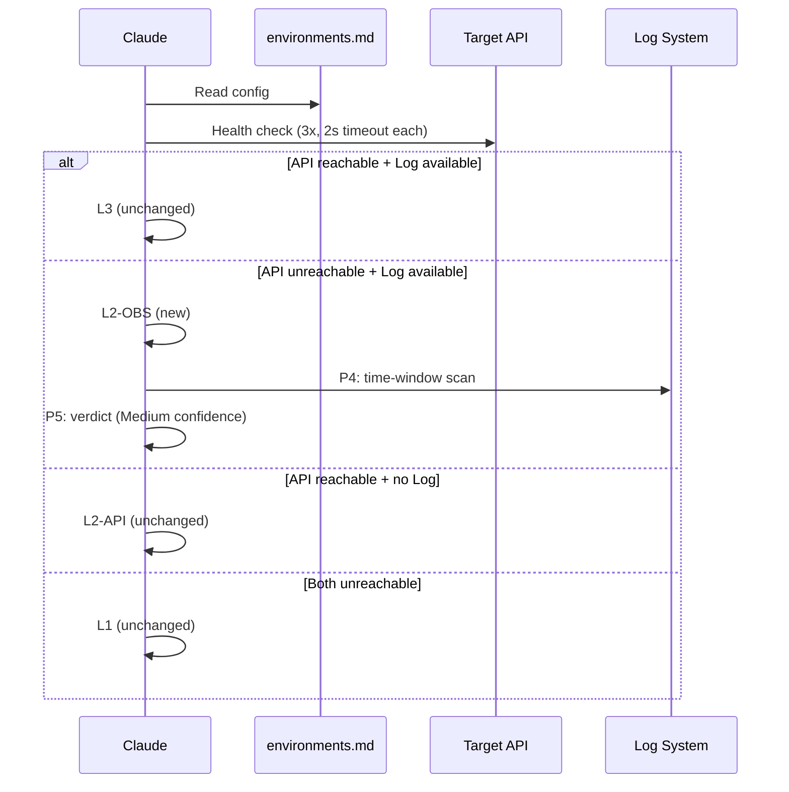

# Feature Verify: Observation-Only Mode

> **Created**: 2026-03-08
> **Status**: In Progress
> **Priority**: P1
> **Tech Spec**: Pending
> **Source**: Best Practices Audit (`019cc761-0825-7b02-8f26-8550ce4f571c`, Round 2-3)

## Background

Plugin 的 degradation matrix 在 API 不可達時直接降至 L1（code-only），跳過了 Log 觀測。onekey/onchain 和 onekey/wallet 的 prod 環境不可直連 API，但 Log 系統可用，需要 observation-only 模式（API + Log / API only / **Log only** / None）。目前 plugin 缺少這個 level。

## Workflow

## Requirements

| Condition | Level | P3 | P4 | Confidence Cap |
|-----------|-------|----|----|----------------|
| API reachable + Log + Metrics | L4 | Full | Log + Metrics | High |
| API reachable + Log | L3 | Full | Log only | High |
| API reachable + no Log | L2-API | Full | Response-only | Medium |
| **API unreachable + Log available** | **L2-OBS** | **Skip** | **Time-window scan** | **Medium** |
| Both unreachable | L1 | Skip | Code review only | Low |

- 在現有 L1-L4 degradation matrix 中加入 observation-only variant
- 採用 L2 雙子型態設計（避免全量重編號）：
  - `L2-API`: API only（現有 L2 語義不變）
  - `L2-OBS`: Observation only（API 不可達，Log/Metrics 可用）
- L2-OBS 模式下：
  - P3 (API Execute) 跳過
  - P4 (Observation Correlate) 改為 time-window scan + background service observation
  - P5 Confidence cap = Medium（與 L2-API 相同）
- 環境偵測邏輯更新：
  - Deterministic detection: health-check endpoint 3 次，每次 2s timeout，全失敗才判定 API unreachable
  - API unreachable + Log config present → L2-OBS（而非直接 L1）
  - API reachable + Log available → L3（不變）
- CLI 擴充：`--level` 支援 `L1 | L2-API | L2-OBS | L3 | L4`（向後相容：`--level L2` 預設為 `L2-API`）

## Scope

| Scope | Description |
| ----- | ----------- |
| In | SKILL.md degradation matrix 更新、environments.md 偵測邏輯更新、blackbox-testing.md P4 flow 更新、output-template.md L2-OBS 格式 |
| Out | Endpoint discovery abstraction（見 endpoint-discovery-spike request）、新增 log backend 整合 |

## Related Files

| File | Action | Description |
| ---- | ------ | ----------- |
| `skills/feature-verify/SKILL.md` | Modify | Degradation matrix 加入 L2-OBS variant |
| `skills/feature-verify/references/environments.md` | Modify | Auto-detection 邏輯新增 API unreachable + Log available path |
| `skills/feature-verify/references/blackbox-testing.md` | Modify | P4 flow 新增 observation-only mode 說明 |
| `skills/feature-verify/references/output-template.md` | Modify | 新增 L2-OBS verdict report 格式 |
| `commands/feature-verify.md` | Modify | argument-hint 更新（如需） |

## Acceptance Criteria

- [x] Degradation matrix 包含 L2-OBS variant（API unreachable + Log available → L2-OBS）
- [x] L2-OBS 模式下 P3 skip、P4 time-window scan 正常運作
- [x] environments.md auto-detection 包含 deterministic algorithm（3x health-check, 2s timeout, 全失敗 = unreachable）
- [x] environments.md 正確分類 L2-API vs L2-OBS（不與 L3 衝突）
- [x] L2-OBS confidence cap = Medium
- [x] 不破壞現有 L1-L4 整數編號（L2 拆為 L2-API / L2-OBS）
- [x] CLI `--level` 支援 `L2-API | L2-OBS`（`--level L2` 向後相容為 L2-API）
- [x] output-template.md 包含 L2-OBS verdict report 格式
- [x] When NOT to Use 不受影響
- [ ] `/codex-review-doc` 通過

## Progress

| Phase | Status | Note |
| ----- | ------ | ---- |
| Analysis | Done | |
| Development | In Progress | L2-OBS shipped in `skills/feature-verify/SKILL.md` plus `references/environments.md` and `references/output-template.md` |
| Testing | - | |
| Acceptance | In Progress | 9/10 AC verified against the repo (batch `--update-all`, 2026-08-15); the `/codex-review-doc` gate has no recorded run |

## References

- Supersedes (partial): [2026-03-03-feature-verify-v2-upgrade.md](./2026-03-03-feature-verify-v2-upgrade.md) AC #2 (degradation matrix)
- Evidence: onekey/onchain `environments.md` (prod API 不可直連)、`SKILL.md` degradation (API + Log )
- Best Practices Audit: `019cc761-0825-7b02-8f26-8550ce4f571c` Round 2 (Codex 實查 log-only 為真需求)
