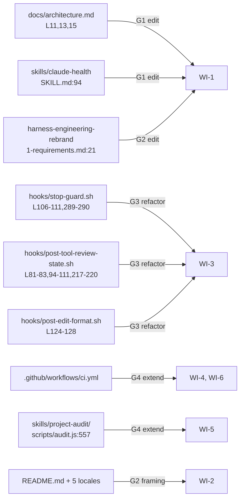
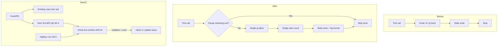
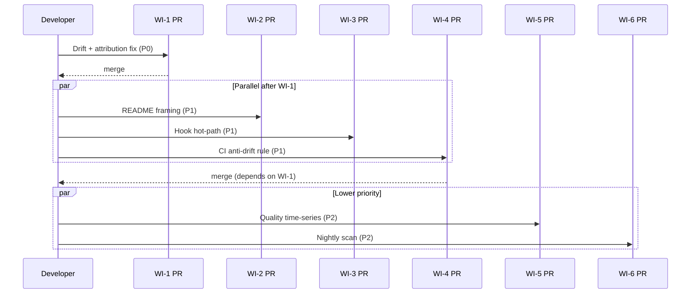
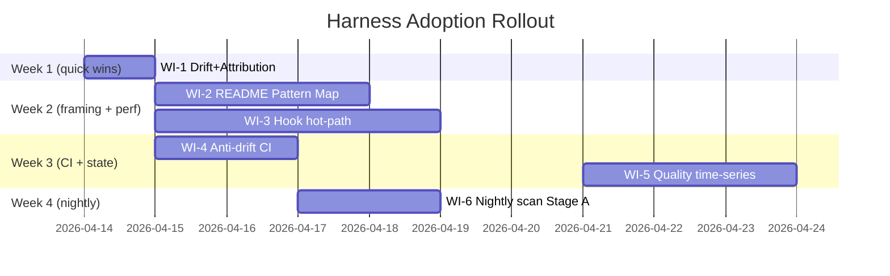

# Tech Spec: Harness Engineering Adoption

> **Phase**: 2 (Technical specification) · **Status**: Draft · **Created**: 2026-04-13
>
> **Parallel feature**: [`harness-engineering-rebrand`](../harness-engineering-rebrand/) — 該 feature 處理 **品牌層定義**；本 feature 處理 **實作層**（程式碼/文件/CI 改動）。兩者**大部分獨立**，但存在 2 處已知耦合：**WI-1 G2 編輯 rebrand 的 `1-requirements.md:21`**（attribution 修正），**WI-2 將 Pattern Map Row 11 插入 rebrand `1-requirements.md §5`** 作為 canonical source。策略：WI-1/WI-2 PR 描述中標示為 rebrand feature 的 co-edit；不引入新 spec 耦合，rebrand feature 的 canonical source 角色不變。
>
> **Phase 1 skipped** (per `rules/docs-numbering.md` "Gap allowed"): Requirements 已在下列上游研究完整捕捉：
> - `/deep-research` — OpenAI harness engineering 文章研究（2026-02-11 Ryan Lopopolo 原文）
> - `/best-practices` — 對照審計 + `/codex-brainstorm` threadId `019d865f-b674-7372-8b10-bdf5e03edcbe`（3 輪 Nash equilibrium）
> - `/deep-research` — A1-A8 對 Claude Code 慣例的適用性驗證
>
> **Upstream artefact trail**: 本 spec 不重述上游研究的證據，僅在必要時以 file:line 引用。

---

## 1. Overview

### 1.1 Problem

OpenAI 於 2026-02-11 發表 harness engineering 方法論（Ryan Lopopolo 作者）。`sd0x-dev-flow` 已具備多數對應能力（dual review / sentinel state machine / post-compact recovery / fail-closed gates），但經對照審計發現 **4 類實作缺口**：

| # | 缺口 | 具體證據 |
|---|---|---|
| G1 | **4 個 stale `commands/` drift 違規** — v3.0.0 已移除 `commands/` 目錄但文件未同步 | `docs/architecture.md:11,13,15`, `skills/claude-health/SKILL.md:94` |
| G2 | **品牌文件 attribution 事實錯誤** — `harness-engineering-rebrand/1-requirements.md:21` 將 harness engineering 歸給 Mitchell Hashimoto，但原文作者為 OpenAI (Ryan Lopopolo) | 該行逐字 |
| G3 | **Hook hot-path 存在重複 `jq` fork 模式**（`stop-guard.sh` 每次 Stop 事件呼叫 `jq` 8+ 次；`post-tool-review-state.sh` 每次 PostToolUse 呼叫 3 次），從靜態分析**推測**接近官方 <100ms 限制 — **尚無可重現 benchmark**（見 Q6，WI-3 實作前需先補） | 靜態分析 hook 原始碼；官方 [hooks docs](https://code.claude.com/docs/en/hooks.md) `SessionStart` warning |
| G4 | **無 anti-drift CI + 無 nightly drift scan + 無 quality time-series** — 所有清理任務皆需手動觸發 | `.github/workflows/ci.yml:3-7` 無 `schedule:`；`/project-audit` 為 snapshot |

### 1.2 Goals

1. 將上游 `/best-practices` 辯論結論中 **經 Claude Code 慣例驗證通過的 6 個 P0/P1 項目** 落地為 PR-ready 工作
2. 保留 sd0x-dev-flow 的差異化哲學（強制 gate、no auto-merge、fail-closed）
3. 將 OpenAI 原文中 **明確不適用於 Claude Code plugin 情境** 的模式（auto-merge / per-worktree observability / 6h autonomous run）明文記錄為 non-goals，避免未來誤採

### 1.3 Non-Goals

| Non-Goal | 來源 | 理由 |
|---|---|---|
| NG-1 | AGENTS.md 作為主要 agent entry point | 官方明文 Claude Code **只讀 CLAUDE.md**（[memory docs](https://code.claude.com/docs/en/memory.md)）；AGENTS.md 生成器保留但僅為 Codex interop 副產品 |
| NG-2 | Near-zero blocking merge gates | 與 `rules/fix-all-issues.md:9` + `rules/auto-loop.md:7` 的 zero tolerance 核心哲學衝突 |
| NG-3 | End-to-end autonomy 含 auto-merge/push | `rules/git-workflow.md:6` 明文禁止 Claude 執行 git add/commit/push |
| NG-4 | Per-worktree application + observability stack（Vector / Victoria / LogQL）| 超出 marketplace plugin 可假設環境 |
| NG-5 | 6h+ autonomous runs | 需要 session durability + rollback policy，超出當前架構 |
| NG-6 | Plugin-native layering structural tests（**deferred**） | Operational definition 複雜，應先做 `/feasibility-study plugin-layering-rules` |
| NG-7 | CLAUDE.md 精簡到 100 行（**deferred**） | 目前 177 行已在官方 <200 上限內；且 `test/skills/claude-md-coverage.test.js:14-19` 程式化解析 `## Command Quick Reference` 段落，搬移需同步改 test。非急事，wait until WI-3 perf work lands |

---

## 2. Existing Code Analysis

### 2.1 Affected Surfaces



### 2.2 Coupling / Constraints

| # | 耦合點 | 影響 |
|---|---|---|
| C1 | `test/skills/claude-md-coverage.test.js:14-19` 以 regex `/^\|\s*`\/([^`]+)`\s*\|/gm` 解析 `## Command Quick Reference` 表格 | 任何 CLAUDE.md 表格搬遷必須同步更新 test；**本 spec 範圍內不做此搬遷**（WI-DEFERRED） |
| C2 | `scripts/build-codex-artifacts.js` 讀取 CLAUDE.md 生成 AGENTS kernel | CLAUDE.md 結構變動可能影響 generator；perf refactor 不影響 |
| C3 | `.github/workflows/ci.yml:3-7` 僅 push/PR triggers，無既有 cron 基礎建設 | WI-6 需新建 workflow 或 augment 既有 |
| C4 | 既有 state files 位於 **project root dotfile**：`.claude_review_state.json`, `.claude_nit_history.json`（非 `.claude/` 內）| WI-5 的 quality history 應採同 convention |
| C5 | 既有 `.claude/sd0x-dev-flow-lessons.md`（lesson log）**卻在 `.claude/` 內** | 與 C4 不一致；**本 spec 不處理此歷史不一致**，捕捉為 Open Question |
| C6 | README i18n：6 locale 檔案由 `/readme-i18n-sync` 同步 | WI-2 若改 README 結構需同步 5 locale |

---

## 3. Technical Solution

### 3.1 Work Item 總表

| WI | 標題 | 對應原 audit 項 | Pri | 預估 diff | Risk |
|----|---|---|---|---|---|
| **WI-1** | Drift + attribution 修正 bundle | A1 + A2 | **P0** | ~10 lines | 零 |
| **WI-2** | README Pattern Map 更新 + Non-Goals 段落 | A5 + A8 | **P1** | ~80 lines × 6 locales | 低 |
| **WI-3** | Hook hot-path jq/grep 優化 | N1（新升級） | **P1** | ~150 lines | 中 |
| **WI-4** | Live-surface anti-drift CI rule | A4 | **P1** | ~40 lines | 低 |
| **WI-5** | Quality score 本地時間序列 | A6（路徑修正） | **P2** | ~60 lines | 低 |
| **WI-6** | Nightly drift scan Stage A | A7 | **P2** | ~50 lines workflow | 低 |
| **WI-DEFER** | CLAUDE.md 精簡 + test migration | A3（降級 SHOULD） | **P3** | ~200 lines | 中 |

### 3.2 WI-1: Drift + Attribution Fix Bundle

**Scope**: 零風險純文字修正，可作為 WI bundle 首 PR。

| 檔案 | 行數 | 現況 | 改後 |
|---|---|---|---|
| `docs/architecture.md` | 11 | `` `hooks/pre-edit-guard.sh`, `commands/precommit.md` `` | `` `hooks/pre-edit-guard.sh`, `skills/precommit/SKILL.md` `` |
| `docs/architecture.md` | 13 | `hooks/` → `commands/` → `rules/` | `hooks/` → `skills/` → `rules/` |
| `docs/architecture.md` | 15 | `` `commands/*.md` frontmatter `` | `` `skills/*/SKILL.md` frontmatter `` |
| `skills/claude-health/SKILL.md` | 94 | `` `ls .claude/commands/ 2>/dev/null \| wc -l` `` | `` `ls .claude/skills/ 2>/dev/null \| wc -l` `` (或依 health check 語意改寫) |
| `docs/features/harness-engineering-rebrand/1-requirements.md` | 21 | `coined by Mitchell Hashimoto in Feb 2026` | `coined by OpenAI (Ryan Lopopolo et al.) in Feb 2026, adopted by Martin Fowler / Birgitta Böckeler (Thoughtworks) in Apr 2026` |

**驗證**: 修正後 `grep -n 'commands/' docs/architecture.md skills/claude-health/SKILL.md` 應為 0 match（對 live-surface 範圍）。

### 3.3 WI-2: README Positioning

**Scope**: 將「agent readability」正式命名為 first-class goal + 明文 non-goals。

**3.3.1 Pattern Map 第 11 列新增**（插入到 `harness-engineering-rebrand/1-requirements.md §5` 作為 canonical source，再由 rebrand 流程傳遞到 README）：

| # | Harness sub-problem | sd0x-dev-flow 實作 | 程式碼證據 |
|---|---|---|---|
| 11 | Agent readability as first-class goal（OpenAI 原文：「What Codex can't see effectively doesn't exist」）| 所有決策版控於 `rules/*.md` + `docs/features/<feature>/{0..3}-*.md` lifecycle + Skill frontmatter `allowed-tools` | `rules/`(14 檔), `docs/features/`(80+ 個 feature)，Skill frontmatter |

**3.3.2 README 新增 "What This Harness Does NOT Do" 段落** — 將 NG-1..NG-5 轉為使用者面向 framing：

```markdown
## What This Harness Does NOT Do

sd0x-dev-flow 有意識地 **不** 做以下事情。這是設計邊界，不是缺陷。

| ❌ Non-goal | 原因 |
|---|---|
| Auto-merge / auto-push PR | Git 操作需要人類授權邊界，`rules/git-workflow.md` 明文保護 |
| Near-zero blocking merge gates | 與「Quality gates that AI can't skip」的品牌承諾直接衝突 |
| Per-worktree application runtime | 超出 Claude Code plugin 可假設的環境 |
| Replace human judgment | Harness 強化判斷力，不取代它 |
```

**3.3.3 i18n 傳遞**: WI-2 完成後執行 `/readme-i18n-sync --full` 同步 5 locale READMEs（per C6）。同步完畢後手動 diff 結構一致性（標題層級 + 表格列數），因 `/readme-i18n-sync` 目前**無** `--verify` CLI flag。

### 3.4 WI-3: Hook Hot-Path Optimization

**Driver**: 官方 docs 警示 `SessionStart` / Stop hooks 必須「keep fast」，社群推測目標 <100ms。**WI-3 啟動前必須先建立可重現 benchmark**（Q6）— 提供固定 fixture JSON + `hyperfine --runs 10` 量測 p50/p95，在 macOS + Linux runner 都跑一次，記錄 before/after 數據。靜態分析顯示當前每次 tool call 觸發 ~8-15 次 `jq` fork（詳見 §3.4.1-§3.4.3），這是重構的必要性假說而非已量測結論。

**3.4.1 post-tool-review-state.sh**

| 問題 | 位置 | Fix |
|---|---|---|
| 每次 PostToolUse 對 `$INPUT` 呼叫 `jq` 3 次（tool_name / tool_input / tool_output） | L81-83, 94-111 | 單一 `jq @tsv` 一次取出全部欄位：`read tn ti to < <(jq -r '[.tool_name, (.tool_input\|tostring), (.tool_output\|tostring)] \| @tsv')` |
| 無 early exit；對所有 tool 類型都進入 jq | 同 | **前置 cheap substring 檢查**：`case "$INPUT" in *Bash*\|*Skill*\|*mcp__codex*) ;; *) exit 0 ;; esac` |
| N+1 grep：4 次 `grep -cE` 掃 tool_output 算 P0/P1/P2/Nit | L217-220 | 單一 `awk` pass，**必須保留原 grep 的錨點 regex（非寬鬆 match）**，且實作前以 fixture replay 驗證 count 與原 grep byte-identical（見 R1 + Q2）。正確語法見下方 code block |

**POSIX-safe awk 範例（alternation 使用未跳脫 `|`，非 `\|`）**：

```awk
# count-findings.awk — portable between gawk / mawk / BSD awk
/^- \[P0\]|^#### P0/   { p0++; next }
/^- \[P1\]|^#### P1/   { p1++; next }
/^- \[P2\]|^#### P2/   { p2++; next }
/^- \[Nit\]|^#### Nit/ { nit++; next }
END { print p0+0, p1+0, p2+0, nit+0 }
```

實作在 `post-tool-review-state.sh` 中以 `awk -f count-findings.awk <<< "$tool_output"` 呼叫，避免 shell inline 引號地獄。**先測試可攜性**：在 gawk + mawk + BSD awk 皆需通過 fixture replay。

**3.4.2 stop-guard.sh**

| 問題 | 位置 | Fix |
|---|---|---|
| 對同一 `$STATE` JSON 重複 `jq` fork 8+ 次 | L106-111, 289-290 | 單一 `jq -r '[...] \| @tsv'` 一次取全部欄位 + bash `read` |
| Transcript 掃描 6+ 次 `grep -E \| tail -1` | L210-211, 214-216, 219-220, 271, 280 | 合併為單一 awk pass 同上 |

**3.4.3 post-edit-format.sh**

| 問題 | 位置 | Fix |
|---|---|---|
| 每次 edit 同步做 prettier 偵測（config 探測 + binary 解析）並同步執行 prettier；npx cold-start 已於先前變更移除（`post-edit-format.sh` 現要求已安裝 binary：`node_modules/.bin/prettier` 或 PATH，config-only repo 不再 fallback 到 `npx prettier`） | `hooks/post-edit-format.sh` 的 prettier 偵測/執行區塊（`prettier_bin` 解析 + 呼叫；以 `grep -n 'prettier_bin' hooks/post-edit-format.sh` 定位） | (a) TMPDIR 快取 prettier 偵測結果 TTL 1h：`$TMPDIR/.claude_prettier_$(pwd_hash)`；(b) prettier 以 `&` 背景執行（state write 不依賴它） |

**Target**: 平均 hook 執行時間 <50ms（預留 50% margin 到 100ms 官方目標）。

### 3.5 WI-4: Live-Surface Anti-Drift CI Rule

**Scope**: 防止 `commands/` 殘留在 live surfaces 再度出現。

**3.5.1 Live-Surface Allowlist（authoritative v1）**

```
# INCLUDED (ban commands/)
README.md
README.*.md           # 5 locales
CLAUDE.md
CLAUDE.template.md
docs/architecture.md
docs/rules.md
docs/hooks.md
docs/cookbook/*.md
skills/*/SKILL.md     # 發佈 entrypoints
.claude-plugin/*.json
package.json

# EXCLUDED (historical evidence)
docs/features/**      # 含 requests/、tech-specs、歷史決策
AGENTS.md             # generated artifact (if present)
```

**3.5.2 實作**: 新增 `scripts/check-live-surface-drift.sh`，並在 `package.json` `scripts` 區塊新增 `"lint:drift": "bash scripts/check-live-surface-drift.sh"`。**WI-4 PR 必須同時修改 `.github/workflows/ci.yml`** 新增 `- run: npm run lint:drift` step（注意：CI 目前**無**任何 lint step，只有 `npm test`；必須新建，不是「掛進既有 lint 自動跑」）。

```bash
#!/usr/bin/env bash
# scripts/check-live-surface-drift.sh
set -euo pipefail

LIVE_SURFACES=(README.md README.*.md CLAUDE.md CLAUDE.template.md
  docs/architecture.md docs/rules.md docs/hooks.md
  docs/cookbook/*.md skills/*/SKILL.md
  .claude-plugin/plugin.json .claude-plugin/marketplace.json package.json)

VIOLATIONS=$(grep -nH 'commands/' "${LIVE_SURFACES[@]}" 2>/dev/null || true)
if [ -n "$VIOLATIONS" ]; then
  echo "⛔ Live-surface drift: 'commands/' found in protected files"
  echo "$VIOLATIONS"
  exit 1
fi
echo "✅ No live-surface drift"
```

**順序依賴**: WI-1 必須先 merge（清掉 4 個現有違規），否則此 rule CI 即刻失敗。

### 3.6 WI-5: Quality Score Time-Series (Local-Only)

**Scope**: 每次 `/project-audit` append 歷史記錄；新增 `--trend 7d` flag 顯示 7 天趨勢。

**3.6.1 檔案位置決策**

| 候選 | Pros | Cons |
|---|---|---|
| `.claude_quality_history.jsonl` (root dotfile) | ✅ 與 `.claude_review_state.json` / `.claude_nit_history.json` 同 convention（C4） | ⚠️ root 目錄新增 dotfile |
| `.claude/sd0x-dev-flow-quality.jsonl` | ✅ 與 `.claude/sd0x-dev-flow-lessons.md` 同目錄（C5）| ⚠️ `.gitignore:9` 整個 `.claude/` 被 ignored |

**本 spec 採納 option 1**（root dotfile）理由：
- C4 的既有 state files pattern 明確（已存在 2 個）
- `.claude/` 內的 lesson log 是歷史個案，非 convention（見 Open Question Q1）
- 若未來 `/feasibility-study state-file-naming` 決定統一到 `.claude/`，遷移成本低

**3.6.2 Schema（JSONL，每行一筆）**

```json
{"ts":"2026-04-13T10:00:00Z","tool":"project-audit","version":"3.0.6","scores":{"docs":85,"tests":92,"skills":88,"hooks":90,"drift":100},"overall":91}
```

**3.6.3 實作點**: 在 `skills/project-audit/scripts/audit.js` 的 `main()` audit 流程**於完整 report 寫入 stdout 之後**新增一次 append（而非在分數聚合函式中）；`--trend 7d` flag 在輸出末尾讀取最新 7 筆計算趨勢。實作 PR 以函式級錨點為準，避免依賴行號（`aggregateScores` 等內部函式位置可能漂移）。

**3.6.4 .gitignore 新增**

```
.claude_quality_history.jsonl
```

**3.6.5 Retention**: 每次 append 後檢查檔案行數，超過 **180 行**（約 6 個月每日 audit）則 truncate 至最新 90 行。避免無限成長。truncate 邏輯封裝在 append 函式內。

### 3.7 WI-6: Nightly Drift Scan Stage A

**Scope**: 新 GitHub Actions workflow 每晚跑 dry-run，發現 drift 即開 issue（不開 PR）。Stage B/C 在本 spec 範圍外。

**3.7.1 新檔案**: `.github/workflows/nightly-drift-scan.yml`

```yaml
name: Nightly Drift Scan
on:
  schedule:
    - cron: '0 18 * * *'  # 02:00 UTC+8 每日
  workflow_dispatch:       # 手動觸發 debug

# 最小權限（least privilege）— 僅需讀 repo + 寫 issue
permissions:
  contents: read
  issues: write

jobs:
  drift-scan:
    runs-on: ubuntu-latest
    steps:
      - uses: actions/checkout@v4
      - uses: actions/setup-node@v4
        with: { node-version: '20' }
      - run: npm ci

      - name: Run anti-drift check
        id: check
        run: bash scripts/check-live-surface-drift.sh > drift-output.txt 2>&1
        continue-on-error: true

      # Dedup: 先查既有 open issue，避免 spam
      - name: Find existing drift issue
        if: steps.check.outcome == 'failure'
        id: existing
        uses: actions/github-script@v7
        with:
          script: |
            const { data } = await github.rest.issues.listForRepo({
              ...context.repo, state: 'open', labels: 'nightly-drift', per_page: 1,
            });
            return data[0]?.number ?? '';

      - name: Open or update drift issue
        if: steps.check.outcome == 'failure'
        uses: actions/github-script@v7
        env:
          EXISTING: ${{ steps.existing.outputs.result }}
        with:
          script: |
            const fs = require('fs');
            const output = fs.readFileSync('drift-output.txt', 'utf8');
            const body = `Nightly drift detected at run #${context.runId}.\n\n\`\`\`\n${output}\n\`\`\``;
            if (process.env.EXISTING) {
              await github.rest.issues.createComment({
                ...context.repo,
                issue_number: Number(process.env.EXISTING),
                body,
              });
            } else {
              await github.rest.issues.create({
                ...context.repo,
                title: 'Nightly drift scan: live-surface violations detected',
                body,
                labels: ['nightly-drift'],
              });
            }
```

**設計重點**:
- **`permissions:` 最小化**：只授 `issues: write` + `contents: read`，避免預設過廣權限
- **Dedup**：先查 `nightly-drift` label 下的 open issue；存在則 comment，不存在才 create — 避免每晚開新 issue
- **`continue-on-error: true`**：drift 檢查失敗不應讓整個 workflow 紅燈，僅觸發開 issue 動作

**3.7.2 Stage B 升級條件**（記錄於 spec，本 feature 不實作）
- 連續 14 次 nightly dry-run 全 clean
- `npm test` + `npm run lint:md` 皆 pass
- Owner explicit toggle

---

## 4. Architecture Impact



**影響範圍**: Hook 行為**語意不變**，僅降低 fork 次數。CI 新增 1 個 shell script + 1 個 workflow。無 breaking change。

---

## 5. Risks & Mitigations

| # | Risk | 可能性 | 影響 | Mitigation |
|---|---|---|---|---|
| R1 | WI-3 hook refactor 改變行為（尤其 awk 算 P0/P1/P2/Nit 與原 grep 邊界條件不同） | 中 | P0 — 可能漏偵測 review finding | (a) 新增 `test/hooks/hot-path.test.js` 覆蓋現有 test vectors；(b) 先跑 fixture replay 確認解析結果與原版 byte-identical |
| R2 | WI-5 檔案位置與 `.claude/sd0x-dev-flow-lessons.md` 不一致，造成未來新 skill 又各自選擇 | 中 | P2 — 技術債累積 | 開 Open Question Q1 追蹤；建議獨立 `/feasibility-study state-file-naming` |
| R3 | WI-6 nightly scan false positive 產生 issue 噪音 | 低 | P2 | Stage A 只開 issue 不 PR，且連續 14 次 clean 才升級；`continue-on-error: true` 避免 CI 全紅 |
| R4 | WI-2 i18n 同步失敗導致 locale drift | 低 | P2 | 執行 `/readme-i18n-sync --full` 後手動 diff 5 locale 結構（標題層級 + 表格列數）；不依賴未存在的 `--verify` flag |
| R5 | WI-1 攻擊面小但 attribution 修正可能觸及既有 supersession note 格式 | 低 | P3 | 僅 edit 單行；supersession note 獨立區塊不受影響 |
| R6 | WI-4 CI rule 先於 WI-1 merge 會導致整個 CI pipeline red | 中 | P1 — 阻塞開發 | **嚴格順序**: WI-1 先於 WI-4 merge；PR 描述註明依賴 |

---

## 6. Work Breakdown (PR Plan)



| PR | WI | 依賴 | 預估 LoC | AC |
|---|---|---|---|---|
| PR1 | WI-1 | — | ~10 | `grep -n 'commands/' docs/architecture.md skills/claude-health/SKILL.md` 0 match；`grep -n 'Mitchell Hashimoto' docs/features/harness-engineering-rebrand/1-requirements.md` 0 match |
| PR2 | WI-2 | PR1 | ~80 × 6 | README 含 Non-Goals 段落；Pattern Map 有 Row 11；5 locale README 經 `/readme-i18n-sync --full` 同步 + 手動結構 diff 一致 |
| PR3 | WI-3 | — | ~150 | `test/hooks/hot-path.test.js` 新增；benchmark script 顯示 avg hook <50ms |
| PR4 | WI-4 | PR1 | ~40 | CI 新 step 在乾淨 branch pass；manual 注入 `commands/` 字串到任一 live surface 應 fail |
| PR5 | WI-5 | — | ~60 | `/project-audit` 後 `.claude_quality_history.jsonl` 有新行；`--trend 7d` 輸出顯示趨勢；test covers append + 7d window |
| PR6 | WI-6 | PR1 + PR4 | ~50 | `.github/workflows/nightly-drift-scan.yml` 存在；`workflow_dispatch` 手動觸發測試 pass |

---

## 7. Testing Strategy

| WI | 測試類型 | 新增檔案 | 覆蓋重點 |
|---|---|---|---|
| WI-1 | 手動 grep 驗證 | — | 字面 diff |
| WI-2 | Doc review via `/codex-review-doc` + i18n verify | — | Gate `✅ Mergeable`；locale 同步 |
| WI-3 | Unit（fixture replay） | `test/hooks/hot-path.test.js` | (a) 所有既有 state transitions 與 refactor 前 byte-identical；(b) early-exit 路徑下不呼叫 `jq`；(c) awk 合併 count 與原 grep 同等 |
| WI-3 | Perf benchmark | `test/hooks/hot-path.bench.sh` | 固定 fixture JSON + `hyperfine --runs 10`；記錄 before/after p50/p95；目標 p95 <50ms；macOS + Linux runner 都需驗證 |
| WI-4 | Integration | `test/scripts/check-live-surface-drift.test.js` | (a) clean tree 返回 0；(b) 注入 violation 返回 1；(c) `docs/features/**` 豁免 |
| WI-5 | Unit | `test/skills/project-audit-trend.test.js` | (a) append 一筆成功；(b) `--trend 7d` 讀 7 筆計算趨勢；(c) 空 history 不崩潰 |
| WI-6 | Manual + `workflow_dispatch` | — | 觸發後 issue 可開；clean tree 不開 issue |

**Pyramid 比例**: Unit 70% / Integration 25% / Manual 5%（符合 `rules/testing.md`）。

---

## 8. Rollout Plan



**Ship gates**: 每個 PR 走標準 `/codex-review-fast` → `/precommit` → `/pr-review` 流程；無特殊 rollout 機制。

---

## 9. Open Questions

| # | Question | Suggested Resolution |
|---|---|---|
| Q1 | `.claude_*` (root dotfile) vs `.claude/sd0x-dev-flow-*` (namespaced in `.claude/`) 哪個是正確 plugin-local state convention？既有 lesson log 用後者，既有 review state 用前者，存在不一致 | 獨立 `/feasibility-study state-file-naming`；本 spec 暫採 root dotfile（與 2 個既有 state files 一致）；若 feasibility 決定統一到 `.claude/`，WI-5 遷移成本 <1h |
| Q2 | WI-3 awk 合併 P0/P1/P2/Nit count 是否可能遺漏既有 grep 的 edge case（多行 match、顏色碼等）？ | 以 fixture replay 逐行比對（R1 mitigation）；若有差異優先保留原 grep 語意 |
| Q3 | WI-DEFER（CLAUDE.md 精簡）何時啟動？ | 等 WI-3 perf 改善落地後評估；若 hook 改善已達 <50ms，CLAUDE.md 精簡 ROI 下降 |
| Q4 | AGENTS.md 生成器（`scripts/build-codex-artifacts.js`）未來定位：保留 / deprecate / mark optional？ | 建議保留但在 `skills/codex-setup/SKILL.md` 明文「Codex interop only, 不影響 Claude Code」 |
| Q5 | WI-6 nightly scan Stage B 升級應寫入 `rules/auto-loop-project.md` 還是新 `rules/nightly-automation.md`？ | Stage B 啟動時再決定；本 spec 範圍內保留 Stage A only |
| Q6 | WI-3 啟動前的 **benchmark baseline** 要什麼樣？fixture JSON 怎麼產生？`hyperfine` 是否為專案預設（現無此依賴）？ | WI-3 PR 前先開一個 micro-spike：產 `test/fixtures/hook-tool-input.json` + 新增 `test/hooks/hot-path.bench.sh`（可無 hyperfine，先用 `time` 或 `date +%s%N`）；記 before 數字再啟動 refactor |
| Q7 | WI-4 CI lint step **新增位置**：在既有 `npm test` 之前 / 之後 / 獨立 job？ | 建議獨立 job（`drift-check`）；失敗不阻擋 `test` job，但列入 required checks 之一。WI-4 PR 內決定 |
| Q8 | `/readme-i18n-sync` 若未來需加入 `--verify` CLI flag，應屬本 feature 還是 `readme-i18n-sync` 自己的 feature？ | 不屬本 feature；若 R4 實際發生 drift，另開 `/feasibility-study readme-i18n-verify` |

---

## 10. Upstream References

- **OpenAI 一手來源**: Ryan Lopopolo, "Harness engineering: leveraging Codex in an agent-first world", 2026-02-11（由 user 提供完整原文）
- **Community interpretation**: Birgitta Böckeler, "Harness engineering for coding agent users", martinfowler.com, 2026-04-02
- **Debate threadId**: `019d865f-b674-7372-8b10-bdf5e03edcbe`（`/codex-brainstorm` 3 輪 Nash equilibrium）
- **Claude Code official docs**:
  - [Memory (CLAUDE.md)](https://code.claude.com/docs/en/memory.md) — CLAUDE.md <200 lines 建議
  - [.claude directory](https://code.claude.com/docs/en/claude-directory.md) — plugin state 位置
  - [Hooks](https://code.claude.com/docs/en/hooks.md) — hot-path 效能警示
  - [Discover plugins](https://code.claude.com/docs/en/discover-plugins) — marketplace description 顯示
- **Parallel feature**: [`harness-engineering-rebrand/1-requirements.md`](../harness-engineering-rebrand/1-requirements.md)（本 spec 的 WI-1 G2 修正針對其 §1.1）

---

> **Next step**: PR1 (WI-1) 可立即執行（零風險純文字修正）。建議先 ship PR1 unblock WI-4。
