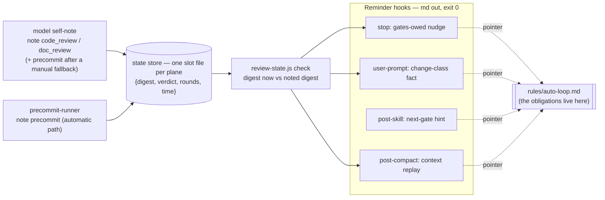

# Tech Spec: Hook Lightweighting — Enforcement to Reminder

> **Doc class**: Lifecycle phase-2 tech spec.
> **Status**: Implemented（2026-08-13，WB1–WB6 全數完成；施工順序 WB1→WB2→WB3→WB4→WB6→WB5）。
> 原始方向記錄如下 — direction set by the user on 2026-08-13, three times: first (enforcement →
> reminder, strict/dual deleted; verdict recording = model self-note CLI), then mid-review
> (reminders are markdown prompts; no strict or signature-grade machinery anywhere;
> zero-or-minimal scripts), then again (「可以有簡單的狀態可以避免重複審核，卡在原地之類的」 —
> simple state is fine when it prevents duplicate reviews and stuck loops). The third decision
> sets the final shape: **single-slot per-plane state + the self-note CLI**, everything heavier
> deleted.

## 1. Requirement Summary

**Problem.** The hook layer was built as an *enforcement* system: verdicts can close gates and
(in `strict`/dual mode) block Stop, so every verdict must be forgery-resistant. That premise
bought ~45k lines of machinery — two-sided provenance, transcript pairing, frontier windows,
activation barriers, 48-hour settlement deadlines — and its newest failure mode proved the cost:
any MCP review outliving the 120s foreground limit delivers its verdict as a task notification
whose transcript shape the settlement parser does not recognize, so the verdict is silently never
recorded (measured 2026-08-13: 8 of 280 notification envelopes in a live 75MB transcript matched
the parser's expected shape; both reviews of that session were lost).

**Direction (user decisions, 2026-08-13).** Model autonomy is high enough that hooks need not
*force* anything:

> 做個提醒就可以了。Hooks 可以寫 md——輕量化 prompt 跟提醒。不要再做嚴格、簽章的重量級 hook。
> 甚至可以不要跑腳本，或者更輕量的腳本，都是好的。可以有簡單的狀態，避免重複審核、卡在原地。

Hooks become **markdown reminders backed by one small per-plane state store**. The conversation carries the
verdict *text*; the state carries just enough to keep the reminder honest — which tree each plane's
last verdict was earned on, so an unchanged reviewed tree is not re-nagged into a duplicate review,
and how many rounds a plane has failed, so a stuck loop is visible as a number instead of a
feeling. Everything beyond that single slot per plane — history, locks, settlement, pairing,
provenance — stays deleted.

**Goals.**

1. Review-layer hooks emit markdown facts and reminders only; no review-layer hook blocks,
   records, or discharges anything. The one exception is deliberate: `hooks/pre-edit-guard.sh`
   is a security guard, not workflow enforcement, and keeps its exit-2 block (§2 component
   table; §6 hook-exit-code row); the
   git-level guards (commit-msg-guard, pre-push-gate) are outside this feature entirely.
2. Delete the transcript-pairing machinery outright (resolves the background-verdict loss by
   removal, not repair).
3. Replace the receipt/ledger core with **single-slot simple state**: one small store — one slot
   file per plane, newest verdict only (`{digest, verdict, rounds, time}`), plain overwrite, no
   locks, no history, no tombstones. Its two jobs are the user's two: no duplicate review of an
   unchanged tree, and a visible round count against stuck loops.
4. Each surviving reminder hook is a minimal script: at most one state check (bounded, with a plain
   `git status` fallback when the checker is missing), a markdown heredoc, `exit 0` on every path.
   No jq in hook-side reminder or state interpretation (`/remind` is a skill and parses json per
   § 3.2; the retained arbitration block keeps its existing optional jq probe), no locks, no
   signatures.
5. Verdict recording is the **model self-note CLI** the user chose first — restored by the third
   decision, writing the simple state instead of a ledger.
6. Consuming projects installed via `/install-hooks` get the same lightweight set, and the upgrade
   removes the obsolete machinery it replaces.

**Non-goals.** Weakening any Anchor (`rules/discretion.md` Register): the terminal completion
invariant, no-auto-commit, attribution, and secret rules are behaviour-layer obligations and stay
binding. Removing their *mechanical backstop* does not remove the obligation. Git-level guards
(`commit-msg-guard.sh`, `pre-push-gate.sh`) are out of scope and stay: they are git hooks defending
against accidents (Anchor #2/#4 territory), not workflow enforcement.

## 2. Existing Code Analysis

Measured 2026-08-13 (`wc -l`):

| Component | Lines | Role today | Disposition |
|---|---:|---|---|
| `hooks/post-tool-review-state.sh` | 3,288 | Two-sided provenance, dispatch pairing, verdict recognition, counters | **Delete** |
| `scripts/lib/dispatch-log.js` | 2,803 | Transcript pairing, settlement, frontier windows, activation barrier | **Delete** |
| `scripts/dispatch-cli.js` | 141 | CLI façade over dispatch-log | **Delete** |
| `hooks/stop-guard.sh` | 1,892 | Derives owed gates; warns; blocks in strict/dual | **Rewrite** — ~40 lines of reminder logic (75–95 as a file, with arbitration; § 3.2) |
| `hooks/session-init.sh` | 702 | State reset, activation append, dispatch-log compaction | **Delete** — all three jobs die with the state |
| `hooks/post-compact-auto-loop.sh` | 649 | Advisory fact replay after compaction | **Rewrite** ~40 lines: git context + gate reminder |
| `hooks/user-prompt-review-guard.sh` | 456 | `[AUTO_LOOP_STATE]` fact line per prompt | **Rewrite** ~30 lines: change-class fact + reminder |
| `hooks/post-skill-auto-loop.sh` | 425 | Advisory next-gate hint after skills | **Rewrite** ~20 lines: static next-gate hint |
| `hooks/post-edit-format.sh` | 1,194 | Formatting on edit — **and** a mirror writer (`STATE_FILE`, jq, lock/sidecar, `changed_files_since_review`, `session_commit_scope`, `aggregate_gate` reset) | **Strip to formatter-only** — keep the formatting behaviour, delete every state/lock/fact path |
| `scripts/emit-review-gate.sh` | — | Emits aggregate/dual markers consumed by the deleted hook; `/codex-review-branch --dual` persists `review_mode=dual`, which forces strict Stop | **Delete** — the dual second opinion is tracked in conversation; no aggregate state survives |
| `hooks/pre-edit-guard.sh` | 114 | Blocks edits to `.env*`/`.git/` | Keep as-is — security guard (Anchor #2), not workflow enforcement |
| `scripts/lib/tree-digest.js` | 484 | Per-plane content digest | **Keep** — the one already-correct piece the simple state needs; rewriting a worse 50-line digest would not be lighter in any way that matters |
| `scripts/lib/gate-derive.js` | 304 | Digest → owed-plane derivation | **Delete** — replaced by `review-state.js check` (~120 lines total for note + check) |
| `scripts/lib/receipt-log.js` | 530 | Append-only verdict ledger, locking, tombstones | **Delete** — replaced by the per-plane single-slot state store, plain overwrite |
| `scripts/review-state.js` | new, ~120 | `note` (self-note a verdict) + `check` (print owed-plane md lines) over the single-slot state | **Add** — § 3.2 |
| `scripts/precommit-runner.js` | — | Runs the precommit checks; also appends receipts, preflights two stores, writes/resolves tombstones | **Keep the runner, strip the old recording** — checks and the `## Overall:` sentinel are its real job; its one surviving side effect is a single `review-state.js note precommit <pass\|fail>` call |
| `scripts/emit-plan-gate.sh` | — | Emits hook-parsed plan markers | **Delete** — the plan loop moves to behaviour layer |
| `.claude_review_state.json` mirror | — | Stored verdict mirror + plan state | **Delete** — no writer survives |
| `test/scripts/dispatch-log.test.js` | 2,888 | Tests the deleted machinery | **Delete** (with every other test of deleted code) |

Net shape: `scripts/lib/` keeps `tree-digest.js` and loses the other three enforcement libraries;
`scripts/` gains `review-state.js` (~120) — libs 3,637 lines → ~600. The four reminder hooks
total ~330 lines including their retained arbitration blocks (§ 3.2) against today's 3,422
(1,892 + 649 + 456 + 425); `pre-edit-guard.sh` is the one untouched hook, and
`post-edit-format.sh` keeps only its formatting half. What the deletion removes with no
replacement owed: the
five-source SessionStart activation gap, the full-transcript settlement scan, the 48-hour pairing
deadline, the `queued_command` carrier-shape dependency, tombstone resolution, ledger retention,
and the golden-fixture maintenance the pairing parser would have needed.

## 3. Technical Solution

### 3.1 Architecture — reminders over single-slot state

The state answers exactly the user's two questions and nothing else. **No duplicate review**: a
plane whose current digest equals its noted digest with `verdict: pass` gets no reminder — an
already-reviewed unchanged tree is left alone; an edit moves the digest and reopens the reminder;
committing the noted tree does not (the digest covers content, not refs). Three slots, two
digests: `tree-digest.js` computes `code` and `doc` plane digests, and **the `precommit` slot
binds the code-plane digest** — precommit is an obligation of the code plane, so a doc-only edit
never reopens it (the same per-plane freshness the invariant already draws) and `check` compares
the precommit slot against the current code digest. **No stuck loops**: `note <plane> fail`
increments the plane's `rounds`, `note <plane> pass` resets it, and `check` prints the count when
it is above zero — 「code_review 已 4 輪未過」 is a fact the model reads, not a cap anything
enforces.

**Single slot means current-tree memory, stated plainly**: noting tree B overwrites the slot that
knew tree A, so reverting to A re-reminds and can cost one redundant review if acted on. That is
the deliberate price of having no ledger, no history and no retention policy. The failure budget
of this design is **advisory and per-plane** — a wrong or missing slot either repeats a false
reminder each firing until the next note, or suppresses one until the digest moves (both
directions in § 3.2), and never becomes a hidden gate or a blocked session.

A hook that cannot run the checker (node or the script missing) falls back to one plain
`git status --porcelain=v1 -z -uall` read (`-z` so spaces, quoting and rename records parse
without heuristics) and reminds on any uncommitted change in the plane — with the honest sentence
「若本輪已完成對應 review gate，忽略此行即可」, because without state it cannot know. The plane
classifier is **`tree-digest.js`'s existing rule, restated for the fallback rather than
redefined**: case-sensitive suffix `.md`/`.mdx` → doc plane, everything else (including `.MD`) →
code plane, and a rename dirties **both** the old and new paths' planes (the union rule its tests
already pin). The spec deliberately matches the retained implementation instead of demanding it
change. Every hook exits 0 unconditionally; a hook that can read neither state nor git prints
nothing and still exits 0.

### 3.2 `review-state.js` and the four reminder hooks

The CLI (~120 lines, replacing gate-derive 304 + receipt-log 530):

| Command | Behaviour |
|---|---|
| `note <plane> <pass\|fail>` | `plane` ∈ {`code_review`, `doc_review`, `precommit`}; anything else exits 1 loudly. Computes the plane's digest now via `tree-digest.js` (`precommit` uses the **code** digest, § 3.1); undigestable tree → `digest: null`, which never matches a check (fail-open to a reminder, never to silence). Overwrites the plane's slot `{digest, verdict, rounds, time}` — `fail` increments `rounds`, `pass` resets it to 0. Prints the written slot so the note is visible in conversation |
| `check [--format=md\|fact\|json]` | **One computation, three renderings.** The **hook wrappers** print `md`/`fact` verbatim and never parse; **`/remind` is the one json consumer** and parses it (with jq, exactly as its Step 1 parses resolver JSON today). `md` (default) prints one reminder line per owed plane (plane, suggested gate, `rounds` when > 0), silent when nothing is owed; `fact` prints the single `[AUTO_LOOP_STATE] change=… reviews=code_review:pass,doc_review:none,… source=state` line the user-prompt hook emits; `json` prints per-plane `{noted, dirty, digest_match, verdict, rounds, passed, owed}`. `noted:true` means **a valid slot was decoded** — a missing file and an unparseable one both read `noted:false`; a slot holding `digest:null` is noted but can never be `digest_match`. A gate counts as passed only as `noted && digest_match && verdict=="pass"` — never as `!owed`; `owed` has its own formula, `dirty && !passed`, so a clean unnoted plane is `owed:false` without having passed anything, and a dirty plane whose current digest carries a noted pass is not owed. Silence is only ever a property of the `md` rendering — `fact` and `json` always answer, so a missing slot, a clean plane and a noted-pass plane stay distinguishable |

**No lock, by layout instead of by luck**: each plane is its own file
(`~/.cache/sd0x-dev-flow/state/<repo-key>/<plane>.json`), so the writers that actually coexist —
the model noting a review, the runner noting precommit — touch different files and cannot lose
each other's update. Within one plane the semantics are **last-writer-wins**: the precommit slot
legitimately has two writer paths (the runner automatically, the model after a manual fallback —
§ 3.3), they run at different times in any real flow, and if they ever race the **last completed
decodable write** wins — plain overwrite guarantees no atomicity, so a torn result of concurrent
writes decodes as `noted:false` and degrades to a reminder, never to a false pass; the cost is a
stale or re-nagging slot until the next note — an advisory, per-plane cost, never a hidden gate. `<repo-key>` keeps the deleted implementation's semantics: canonical real checkout
path plus a short hash of it, so two same-named checkouts, symlinked spellings and worktrees
neither share nor fragment state. Checker invocations from hooks are bounded by the same
`timeout`/`gtimeout`/`perl` ladder the advisory hooks use today — and **where none of the three
exists, the hook skips the checker entirely and takes the git fallback**, because the ladder's
last rung is unbounded and digesting a pathological tree is synchronous (the `/remind` lesson,
applied instead of re-learned).

Who notes what is behaviour-layer, not enforced: the model notes `code_review`/`doc_review` after
reading a reviewer verdict (the self-note the user chose — declared provenance, an attestation the
conversation can audit); `precommit` is normally noted by `precommit-runner.js` itself, and by the
model when the gate ran through the skills' manual ecosystem fallback instead (§ 3.3 — the runner
cannot see a run it did not perform). The cost of a wrong slot
is **advisory and per-plane, not one-shot**: a forgotten note or lost update means that plane's
false reminder repeats on every hook firing until the next note; a forged current-digest pass
suppresses that plane's reminders until the digest moves. Either way it is one plane's advisory
line — nothing downstream decides anything on it, and the conversation still holds the real
verdict text. The state lives
per-user outside the repo (the standing constraint: hook output never pollutes git). The old
receipts directory under `~/.cache/sd0x-dev-flow/receipts/` is abandoned in place and mentioned in
the migration report — § 3.6's candidate set covers installed repo files only and deliberately
does not reach into user caches.

The four hooks:

| Hook | Trigger | Reads | Prints (markdown) |
|---|---|---|---|
| `stop-guard.sh` | Stop | `check --format=md` (fallback: one git read) | `check`'s owed-plane lines — `📋 code 檔有未提交變更且未記錄 review → /codex-review-fast → /precommit`（附 rounds 數與 `rules/auto-loop.md` pointer）. On the git fallback, adds the ignore-if-done sentence (§ 3.1). All planes clean or noted-pass: silent |
| `user-prompt-review-guard.sh` | UserPromptSubmit | `check --format=fact` (fallback: one git read) | The CLI's `[AUTO_LOOP_STATE]` line verbatim — the marker survives for continuity, fields shrink to the slot facts; `source=git_status` on fallback — plus a one-line rule pointer. A fact line, not a nudge: no ignore-if-done sentence, it claims nothing that could be already-done |
| `post-skill-auto-loop.sh` | After any Skill (the matcher is the generic `Skill` tool; the hook protocol does expose the skill name and result on stdin, but this hook **deliberately does not inspect them** — that is the zero-read design, so the wording is unconditional) | **Nothing — the declared zero-read exception** | One static sequence reminder + rule pointer: 「review → precommit → doc-sync 的閘門順序見 rules/auto-loop.md；本行不知道你剛跑了哪個 skill」. No conditional phrasing, no verdict parsing — the model knows where it is |
| `post-compact-auto-loop.sh` | SessionStart:compact | `check --format=md` (fallback: one git read) + branch/file list | Git context (branch, uncommitted file list) + the same gates-owed nudge as stop, so a compacted session re-reads its ground truth |

Line budgets are honest about what stays: each hook keeps the existing **plugin-vs-local
arbitration block** (~55 lines, pinned by `test/hooks/plugin-local-arbitration.test.js` — it is
what prevents double-fire and zero-fire when plugin and installed copies coexist, and deleting it
would trade real duplicate reminders for cosmetic line count). Reminder logic proper is the
~20–40 lines per hook described above; with arbitration the files landed at 72–115 lines each
(measured: stop-guard 110, user-prompt-review-guard 112, post-skill-auto-loop 72,
post-compact-auto-loop 115 — 409 total) against the pre-lightweighting 3,422.

`HOOK_BYPASS` survives as the output switch (read by the four reminder hooks only; any non-empty
value counts). `HOOK_DEBUG`, `STOP_GUARD_MODE` and every mode ladder are deleted. `hooks/hooks.json` drops the `session-init` and inline `dispatch-cli` SessionStart
entries; the namespace-hint entry stays.

### 3.3 What deletes with the state

- **The mirror** (`.claude_review_state.json`): its hook writers die here, but it is **not**
  reader-free — `scripts/detect-scope.js` (third scope layer), `/smart-commit` via
  `scripts/lib/session-scope-resolver.js` (`session_commit_scope`), `skills/next-step`'s
  `analyze.js`, `scripts/skills/necessity-audit/preflight.js`, `/pre-pr-audit` (precommit
  verdict), `/orchestrate` (safety-plane exclusions), and `/claude-health` all consume it today.
  Each is rewritten to its stateless contract in § 3.4 — deleting the file out from under them and
  calling their degraded branches "the design" is not a rewrite. The migration (§ 3.6) then
  removes stale copies in consuming repos.
- **The dual/aggregate machinery**: `scripts/emit-review-gate.sh` exists solely to emit markers
  the deleted hook parses, and `/codex-review-branch --dual` persists `review_mode=dual`, which
  forces strict Stop behaviour — exactly the "strict, signature-grade" shape the user retired.
  The script is deleted; the dual second opinion and its aggregation live in conversation; every
  `aggregate_gate`/`review_mode` sentence leaves the review skills' shared reference.
- **Plan-review state and `emit-plan-gate.sh`**: the `/plan-review` loop becomes fully
  behaviour-layer — the skill counts its own rounds in conversation, reads `## Plan Review Max
  Rounds` from `rules/auto-loop-project.md` directly, and its sentinels (`✅ Plan Ready` etc.) stay
  prose contracts. This is the same treatment § 3.5 gives the code-review stall counters, applied
  consistently: no round counter outlives the recorder.
- **Nit-history persistence**: the deleted hook also owned `.claude_nit_history.json` — the
  parsed-and-persisted `[NIT_DEFERRED]`/`[DISMISS_VERDICT]` store with TTL dedup and locking. It
  goes with its owner, **decided, not forgotten**: the durable record becomes the review report
  and the conversation, where those lines already appear. `[NIT_DEFERRED]` survives as a
  *reporting convention* (reviewers still emit the line, at column 0, same fields — it is
  greppable in reports and transcripts), but nothing parses or persists it. The documents that
  promise mechanical persistence (`rules/auto-loop.md` § Sub-Threshold Findings,
  `rules/fix-all-issues.md`, `skills/doc-review/SKILL.md` and its Codex prompt,
  `skills/codex-code-review/references/*`) are rewritten in WB5 to the convention wording;
  `/codex-review-branch`'s pickup claim already holds without a store — a depth review re-finds
  what is still true by reviewing.
- **Receipts everywhere**: `precommit-runner.js` keeps every check-execution path and the
  `## Overall:` sentinel, and loses `preflightWritable()`, the receipt append, tombstone
  resolution on PASS, and `appendTombstone()` on failure. Its one surviving side effect maps its
  **three** terminal states: `✅ PASS` → `note precommit pass`; `❌ FAIL` → `note precommit fail`;
  `⚠️ NO CHECKS RUN` → **no note** — the slot is untouched, the reminder persists, which is the
  correct reading of "nothing validated". The precommit skills' Step-2 manual fallback closes the
  remaining path behaviourally: after a **conclusive** ecosystem-fallback run the model self-notes
  the outcome — `precommit pass` on success, `precommit fail` on a run whose checks executed and
  failed, so the `rounds` count stays path-independent (a failure is a failure whichever engine
  ran it). An *inconclusive* fallback (the checks could not run) notes nothing, exactly like
  NO CHECKS RUN. This replaces the WB5b-era rule that only the runner could mint the receipt —
  that rule guarded a gate; a reminder needs no guard. A failed note is reported in the runner's
  output and never fails the run — the checks are the job, the note is a courtesy.

### 3.4 Skill-side sync

Skills that consume the deleted machinery are rewritten in the same change, not left to degrade:

| Consumer | Change |
|---|---|
| `/remind` (Step 1) | Swap the `gate-derive --advisory` resolver and mirror reads for `review-state.js check --format=json`, parsed with jq exactly as Step 1 parses resolver JSON today (this is the declared exception to "hooks print verbatim" — /remind is a skill, not a hook wrapper); detection 5's `STATE_FILE_EXISTS` becomes "dirty plane with `noted:false`", **aggregated across planes sharing a dirtiness source** — one dirty code plane with both `code_review` and `precommit` slots absent is one "no state" finding, not two; gate-passed facts project from `noted && digest_match && verdict=="pass"` per § 3.2, never from `!owed`; **keep** the whole-`GIT_*` fence, root anchoring, the one-probe discipline, and the existing bash/zsh parity fixture with its absolute-value pins (the zsh lesson survives the simplification); the degraded path (checker unavailable) is the plain git read, which supports change-class rows + branch row and claims no verdict |
| `/codex-code-review` Step 1.6 | Actively reads `.claude_nit_history.json` today — the read is deleted with the store (§ 3.3); prior deferred findings reach the reviewer through the review itself, not a preload |
| `/plan-review` | Drop marker emission and state reads; loop bookkeeping in conversation per § 3.3 |
| `/codex-code-review`, `/codex-review-branch` | Drop the `emit-review-gate.sh` invocation and the `--dual` aggregate/`review_mode` state; the second opinion is reported in conversation and merged by the model |
| `/precommit`, `/precommit-fast` | Delete the receipt-source sentences (runner-append, WB5b history notes stay in the records, not the skill); Step 2's manual-fallback text gains the behavioural lines § 3.3 defines — after a **conclusive** fallback the model self-notes the outcome, `precommit pass` on success **and `precommit fail` when the checks ran and failed** (rounds stay path-independent); an inconclusive run notes nothing |
| `hooks/stop-check.md` | The stop hook's companion doc still describes transcript parsing, blocking, pass markers and exit 2 — rewritten to the reminder contract in WB1, with the hook it documents |
| `/orchestrate` S1 sentinel isolation (`SKILL.md`, `references/plan-schema.md`, `scripts/validate-plan.js`) | **Retained, rationale reframed**: the rule existed to avoid poisoning the deleted hook parser, but sentinel lines remain behaviour-layer signals the model and reviewers read, so plan output staying free of bare sentinels is still worth a validator — the docs' "hook parser" justification is rewritten, the check itself is untouched |
| `scripts/detect-scope.js` | Remove the mirror-backed third scope layer (`changed_files_since_review`); the two live layers (args, git) remain the whole contract |
| `/smart-commit` + `scripts/lib/session-scope-resolver.js` | Retire `session_commit_scope` consumption; commit grouping works from live git status alone (it already carries that path) |
| `skills/next-step` `analyze.js`, `scripts/skills/necessity-audit/preflight.js`, `/pre-pr-audit` | Decide from live git/tool output; delete the state-file freshness/verdict reads |
| `/orchestrate` | Remove the mirror safety-plane exclusion from its verification contract |
| `/claude-health`, `/project-setup`, `/codex-setup` | Stop inventorying, installing, or requiring the deleted files (libraries, `session-init.sh`, mirror) |
| `/install-hooks`, `/install-scripts` | § 3.6 |
| Prose/doc references (WB5): `skills/doc-review/SKILL.md` + Codex prompt, `skills/codex-code-review/references/*`, `rules/fix-all-issues.md`, `skills/necessity-audit/references/review-loop.md`, `skills/remind/references/detection-rules.md`, `skills/next-step/SKILL.md`, `skills/deep-explore/SKILL.md`, `scripts/generate-readme-catalog.js`, `scripts/config/sensitive-paths.json` | Every sentence promising deleted machinery (nit-history persistence, mirror reads, dispatch pairing, strict mode) is rewritten or the entry removed — they are documentation surfaces, but a stale one is false live documentation and the § 6 sweep fails on them by design |

### 3.5 Behaviour-layer rewrite (doc plane)

| Document | Change |
|---|---|
| `rules/auto-loop.md` — **section-by-section inventory, not just § Enforcement**: § Review Dispatch (producer-recognition and dual-mode sentences), § Tiers ("the hooks persist" the cap), § Sub-Threshold Findings ("hook-parsed at column 0" → reporting convention, § 3.3), § Gate Sentinels (retitle — nothing hook-parses them), § Override Contract (hook-consumer rows), § Enforcement (whole rewrite) | Hooks are reminders; ledger receipts, settlement, strict/dual and the old `source=` vocabulary go; the single-slot state and its `rounds` fact are described in § Enforcement's replacement; the invariant itself is untouched. The § 4 sweep greps additionally for `hook-parsed`, `NIT_DEFERRED`, `hooks persist` |
| `rules/auto-loop.md` § Stall Detection + § Cap Diagnostic Protocol | `[LOOP_PROGRESS]`/`[LOOP_STALL]`/`[STRATEGIC_RESET]`/`[STALL_MEMORY]` emitters die with their recorder. Both sections rewrite to model-side bookkeeping — caps, classes and budgets stay as behaviour-layer guidance, with the state slot's `rounds` count named as the one mechanical fact still available (`check` prints it; the model diagnoses); every other "the hook counts/emits/persists" sentence goes. The markers' **other live surfaces are dispositioned by name, not left to the sweep**: `skills/codex-code-review/SKILL.md`'s "`[LOOP_STALL]` normally fires first" sentence and `rules/auto-loop-project.md`'s commented `[STRATEGIC_RESET]` scaffold text are rewritten to the model-side wording; `test/rules/stall-detection.test.js` reads the deleted hook directly and pins the emitter contract — it is deleted with its subject, and its behaviour-layer assertions (tier caps, budget table) are re-pinned against the rewritten rule text |
| `CLAUDE.md` (+ `.claude/CLAUDE.md`) | "Required Checks (Stop Hook enforced)" → "(Stop Hook reminded)"; drop the `PRECOMMIT_REQUIRE_FULL`/`STOP_GUARD_MODE=strict` callout |
| `rules/context-management.md`, `rules/discretion.md` | Touch only sentences naming strict mode or receipt mechanics; Anchor Register text is not edited (Register #5–#7 speak of obligations, not of hooks) |
| README × 6 locales | Sync the hook-description sections (diff-based, per the established i18n flow) |
| `docs/features/auto-loop-evolution/*`, `auto-loop-autonomy/*` | Records: append an outcome note; never rewritten |

### 3.6 Install-surface sync — obsolete-set cleanup, no signatures

Dropping files from the skeletons is not an upgrade path on its own: `/install-hooks` and
`/install-scripts` merge and copy, and nothing today removes an obsolete managed file or settings
entry. The fix stays as light as the rest of this change — **no signature corpus, no ownership
inventory**. One migration script, invoked by both installer entry points, in this order:

1. **Compute, mutate nothing**: read the manifest (canonical-first: `.sd0x/install-state.json`,
   falling back to legacy `.claude/.sd0x-install-state.json`; both present → canonical wins,
   legacy reported stale) and build the obsolete-file candidate set — files in the old
   inventories (`rules`, `hook_scripts`, `scripts`) absent from the new skeleton. No manifest →
   fall back to the **known obsolete sd0x filename list** shipped with the migration (the § 2
   deletion set) for the settings step, and report rather than delete on the file step.
2. **Deregister first** (`settings.json` **and** `settings.local.json` — `--local` installs write
   the latter): remove hooks entries whose command references a filename in the obsolete set —
   **including entries for modified files that step 3 will preserve**, so a user-edited copy of
   the old enforcement hook stops running rather than surviving registration forever. Scope is the
   obsolete set only: an unrelated dangling entry (a user's own hook whose script is momentarily
   absent) is *reported, never removed* — no provenance signature is needed precisely because the
   removal predicate is the known filename list, not "dangling". Remove `env.STOP_GUARD_MODE` and
   the legacy `hooks_config.stop_guard_mode` key by name. Report every removal.
3. **Delete only after the settings writes succeed**: remove obsolete files whose hash matches the
   manifest record; keep a modified file on disk and report that its registration was disabled. A
   failed settings write aborts before any deletion — the migration must never manufacture the
   half-state it exists to prevent (a still-registered `post-tool-review-state.sh` finding
   `dispatch-cli.js` gone blocks dispatches with its fail-closed `exit 2`).

Both installer skills gain the command permission to invoke this one migration script, so neither
entry point can reproduce the unsafe order by hand.

## 4. Risks and Dependencies

| Risk | Assessment | Mitigation |
|---|---|---|
| Model drift with no mechanical backstop | The accepted trade — the user's explicit decision, made twice. At the default `warn` posture nothing blocked before either; a project that configured `STOP_GUARD_MODE=strict` or dual mode **does lose active blocking** | Reminders still fire on every Stop with changes present; conversation carries the verdict text; git-level guards still catch commit/push accidents. The migration report names the `STOP_GUARD_MODE` removal loudly, so strict-configured consumers see the posture change where it lands |
| Reminder false positives | Main sources: the git fallback (no state to consult), a revert past the single slot (§ 3.1), and a slot that is missing, stale or unparseable — forgotten note, same-plane lost update, malformed write, all of which read as unnoted or non-matching (§ 3.2); cross-plane loss is designed out by the per-plane file layout. A stale slot re-reminds on **every** hook firing until the next note, not once — stated honestly; one re-note ends it, and the reminder line names the gate that would produce that note | The state check silences the common case (unchanged reviewed tree — the user's duplicate-review complaint); the fallback carries the ignore-if-done sentence; wording tested (§ 6) so no line reads as a blocking claim |
| State store wrong or stale (forged note, forgotten note, stale digest) | Advisory impact, scoped to one plane (§ 3.2): a missing/stale slot repeats its false reminder each firing until the next note; a forged current-digest pass suppresses that plane's reminders until the digest moves. Nothing downstream decides on it | `note` prints the written slot into the conversation, so the audit trail is where the user already reads; one re-note ends either failure mode |
| Mid-upgrade half-states in consuming repos | Scripts-new + hooks-old is the dangerous half: old `post-tool-review-state.sh` blocks dispatches with `exit 2` when `dispatch-cli.js` is gone — active breakage, not degradation | § 3.6 ordering: deregister before delete, abort deletion on a failed settings write, one migration invoked by both installer entry points; the settings-failure and modified-file cases tested (§ 6) |
| Stale enforcement claims in docs | A leftover "the hook will block you" sentence misleads readers | Sweep: `grep -rn 'strict\|STOP_GUARD_MODE\|receipt\|settlement\|tombstone\|exit 2\|hook-parsed\|hooks persist\|NIT_DEFERRED\|claude_nit_history\|LOOP_PROGRESS\|LOOP_STALL\|STRATEGIC_RESET\|STALL_MEMORY' rules/ docs/ skills/ scripts/ hooks/ test/ README*` reviewed file-by-file in the doc phase — the live instruction surfaces are in scope, not just prose docs, because that is where rounds 7–8 actually found the stale claims. `NIT_DEFERRED` is swept **contextually** (the term survives as a reporting convention, only persistence claims about it are stale); `digest` is deliberately not on the list — it names the live § 3.2 mechanism now |
| `/remind` loses its resolver | Its degraded path already handles this, but permanently degraded is not a design | § 3.4 rewrites Step 1 onto `review-state.js check`, with the plain git read as its declared degraded branch |

Dependency: none external. The deletion is self-contained; the `codex` CLI alternatives explored in
the 2026-08-13 debate are moot under this direction (recorded in the debate thread, not pursued).

## 5. Work Breakdown

| WB | Scope | Plane | Size |
|---|---|---|---|
| WB1 | Add `review-state.js` + its tests (§ 3.2); rewrite the four reminder hooks; strip `post-edit-format.sh` to formatter-only; delete `session-init.sh`, `emit-plan-gate.sh`, `emit-review-gate.sh`; sync `hooks/hooks.json` | code | M |
| WB2 | Delete `post-tool-review-state.sh`, `dispatch-log.js`, `dispatch-cli.js`, `gate-derive.js`, `receipt-log.js`, their tests, and all call sites; strip `precommit-runner.js` old recording paths and add its `note precommit` call (§ 3.3) | code | L |
| WB3 | Consumer sync (§ 3.4): `/remind` Step 1, `/plan-review`, dual-review paths, precommit skill texts, `detect-scope.js`, `session-scope-resolver.js`/`smart-commit`, `next-step`, `necessity-audit`, `pre-pr-audit`, `orchestrate` | code | L |
| WB4 | Install skeletons + § 3.6 migration and its tests; `/project-setup`, `/codex-setup`, `/claude-health` inventories stop shipping or demanding deleted artifacts | code | M |
| WB5 | Behaviour-layer rewrite (§ 3.5 full section inventory) + nit-history convention rewrite (§ 3.3) + the § 3.4 prose-reference sweep + README i18n sync | doc | L |
| WB6 | Self-install into this repo's `.claude/` and live-verify the reminder loop end to end | ops | S |

Order: WB1 → WB2 → WB3 → WB4 → WB6 → WB5. WB1 first so every hook registration always points at a
file that exists during the deletion; WB6 before WB5 so the docs describe a verified behaviour.

## 6. Testing Strategy

Per `rules/testing.md` (AAA, both-direction guards, realistic data):

| Area | Cases |
|---|---|
| `review-state.js` | `note`: each valid plane writes its slot and prints it; unknown plane / invalid verdict token refused loudly, nothing written; undigestable tree → `digest:null` (never silences a check); `fail` increments `rounds`, `pass` resets; `precommit` binds the code digest — doc-only edit leaves it silent, code edit reopens it. `check`: the content-addressing contract on the single slot — note → derive silent; note → edit → reopens; note → commit → stays silent; note B → revert to A → **re-reminds** (the single-slot price, pinned as expected behaviour, not a bug); `rounds` printed when > 0; the three renderings agree on one fixture (md silent ⇔ fact/json report no owed plane — silence-ambiguity pinned); concurrent notes to two planes both survive (per-plane files); no-bounding-tool environment → hook takes the git fallback, checker never invoked unbounded; json truth table pinned with **expected `{passed, owed}` tuples per row** (passed ⇔ `noted && digest_match && verdict=="pass"`, owed ⇔ `dirty && !passed` — § 3.2): clean/noted-pass → `{true, false}`; clean/unnoted → `{false, false}` (the row where owed diverges from passed); dirty/unnoted → `{false, true}`; dirty/stale-digest → `{false, true}`; dirty/current-digest-fail → `{false, true}`; dirty/current-digest-pass → `{true, false}`; and code_review-pass + precommit-unnoted on one dirty code tree → code_review `{true, false}`, precommit `{false, true}`; decoder boundary pinned separately: missing file → `noted:false`, unparseable or schema-invalid JSON → `noted:false`, valid slot with `digest:null` → `noted:true` and `digest_match:false` |
| Reminder hooks | Each of the four: check-driven lines match the slot fixtures; checker missing → git fallback (`-z` parse) prints the right plane lines with the ignore-if-done sentence; the classifier pinned to the tree-digest rule — `.md`/`.mdx` doc, `.MD` code (case-sensitive, as implemented), rename dirties both planes, deletions and paths with spaces; clean-or-noted-pass tree prints nothing (stop) or the bare fact line (user-prompt); post-skill prints its one unconditional line after an unrelated and after a failed skill alike; git unreadable → silent, exit 0; every path exits 0 (pinned); arbitration tests (`plugin-local-arbitration.test.js`) stay green across the rewrite; identical behaviour under zsh and bash (the `remind` zsh lesson, applied at birth) |
| post-edit-format strip | Formatting still fires on the same edits; the hook creates and mutates **no** file beyond the formatted target (mirror, sidecar, lock absence pinned) |
| Deletion completeness | No file under the runtime and install surfaces (`hooks/`, `scripts/`, `skills/`, `test/`, `hooks/hooks.json`, install skeletons) references `dispatch-cli`, `dispatch-log`, `post-tool-review-state`, `gate-derive`, `receipt-log`, `emit-plan-gate`, `emit-review-gate`, `session-init`, `aggregate_gate`, `review_mode`, `preflightWritable`, `appendTombstone`, `STOP_GUARD_MODE`, or `claude_review_state` (`tree-digest` is off the list — it stays). Records and prior feature docs are out of scope by construction. The grep is the floor, not the proof: each § 3.4 consumer also gets a behaviour test of its new contract, so dead state machinery cannot survive behind a passing sweep |
| precommit-runner strip | Runs its checks and emits the `## Overall:` sentinel unchanged; its only write outside the report is the `note precommit` call, mapped across **all three** terminal states (PASS notes pass, FAIL notes fail, NO CHECKS RUN notes nothing — slot untouched, pinned); a failed note is reported and does not fail the run; a check failure still reads `❌ FAIL` (regression-pinned against the recording removal); skill-side: fallback text instructs the self-note on every conclusive outcome (pass **and** fail — rounds stay path-independent), and no note on an inconclusive run |
| `<repo-key>` | Symlinked spellings of one checkout converge on one store; two same-named checkouts do not collide; separate worktrees stay isolated (the deleted receipt tests' isolation cases, re-pinned on the new path); the hash algorithm/length is explicitly non-contractual — only the three isolation properties are |
| Migration | Both manifest paths (canonical-only, legacy-only, both → canonical wins + stale report, none → settings-by-known-list + file-report-only); unmodified obsolete file deleted, modified one kept on disk **with its registration removed**; obsolete-set entry removed from `settings.json` and `settings.local.json`, an unrelated dangling user entry reported but kept, a live entry untouched; `STOP_GUARD_MODE` and `hooks_config.stop_guard_mode` removed loudly; ordering pinned: a failed settings write aborts before any file deletion |
| Consumer sync | `/remind` Step 1 fixture: check-based run reports slot facts; detection-5 aggregation pinned — one dirty code plane with **both** `code_review` and `precommit` slots absent yields exactly **one** no-state finding, and with only one slot absent that slot alone is reported; degraded (checker gone) run produces change-class rows + branch row and never claims a verdict — the existing bash/zsh parity fixture and its absolute-value pins survive the simplification; `/plan-review` writes no state; `detect-scope.js` two-layer contract; `smart-commit` grouping from live git alone; dual review leaves no `review_mode` state |
| Hook exit codes | Every surviving hook registered in `hooks/hooks.json` except `pre-edit-guard.sh` exits 0 on every path it owns. Git hooks (`commit-msg-guard.sh`, `pre-push-gate.sh`) are outside this contract and stay blocking by design |

Deleted with their subjects: `dispatch-log.test.js` (2,888 lines), the stop-guard strict/dual test
sections, the receipt-log/gate-derive test files, `test/rules/stall-detection.test.js` (reads the
deleted hook and pins its emitter contract; its tier-cap and budget-table assertions are re-pinned
against the rewritten `rules/auto-loop.md` in a new `test/rules/auto-loop-behaviour.test.js` — § 3.5), and the hook-registry tests' state assertions.
**Kept and adapted**: `tree-digest.test.js` (523 lines) — its subject survives as the state
design's digest oracle, and `review-state.js` integration tests are not a substitute for its unit
coverage (partial reads, submodules, rename-union, filters).

## 7. Open Questions

1. **Is `post-skill-auto-loop.sh` worth keeping at all?** A static hint after review skills is the
   weakest of the four reminders; candidate for deletion after the reminder loop has lived a week.

(Resolved since draft 1: hook-side stall counters dropped, replaced by the slot's `rounds` fact —
§ 3.1/§ 3.5; plan loop moved to behaviour layer — § 3.3; the ledger replaced by single-slot state
with the self-note CLI restored — § 1 third user decision; managed uninstall simplified to
obsolete-set cleanup — § 3.6.)
