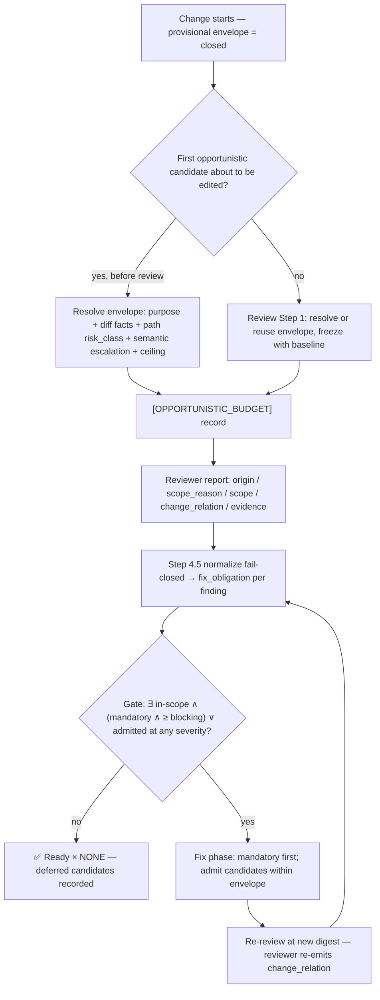

# Opportunistic Fix Envelope Technical Spec

> **Intent**: [intent-opportunistic-fix-envelope.md](./intent-opportunistic-fix-envelope.md) — read before changing scope.
> **Origin**: `/issue-analyze` + `/deep-research` + `/codex-brainstorm`, 2026-09-02. Codex blind
> verdict ACTIONABLE 0.95 (thread `01a06111-f980-7821-8fe1-9b376bb582ca`); Nash equilibrium after
> two rounds (thread `01a06113-dfb1-7441-8093-b37ff36b0a94`). Literature basis and debate record:
> the analysis report at <https://claude.ai/code/artifact/06b997fb-d57b-4e3b-9ea5-8f3cf6a033a8>
> (2026-09-02) — a record, not restated here.
> **Parent axis**: [scope-discipline](../scope-discipline/2-tech-spec.md) owns *whether this task
> owes a fix*; this feature adds *how much opportunistic fixing this change can afford*.

## 1. Requirement Summary

- **Problem**: `rules/fix-all-issues.md` fixes every in-scope blocking finding, and scope is decided
  by where the finding sits (baseline file, one hop, branch-introduced) — never by how risky the
  **primary** change is. A pre-existing P1 in a baseline file, or in one direct caller, is in-scope;
  a single-file fix never trips the circuit breaker; Step 4.5 routes it into the fix loop whether
  the primary change is a README edit or a `scripts/lib` rewrite. Tier escalation makes high-risk
  review *stricter* (P2 blocks under `thorough`), the opposite of a smaller fix budget; the
  `ATTENTION_DIFFUSION` diagnosis is reactive (three stall rounds); `[DEVIATION]` grants
  permission but no lawful `✅ Ready` disposition. The maintainer's request: a domain edit may fix a
  small adjacent defect in passing; an infrastructure edit whose behaviour may shift after rollout
  must not also do fix-all-issues.
- **Literature (record, not restated)**: change risk is diffusion and location, not size (Mockus &
  Weiss 2000; Kamei et al. TSE 2013; Niu et al. 2025 on refactoring confounding size); the measured
  harm of tangling is reviewer precision and attribution, not shipped defects (di Biase et al. 2019,
  Herzig & Zeller MSR 2013) — so the rationale below is attribution and rollback; Google Small CLs
  permits "fixing a local variable name" inside a feature CL while *Software Engineering at Google*
  ch. 9 forbids side fixes in bug fixes; Zhang et al. 2026 (5,000+ Claude Code runs) finds every
  beneficial rule is a negative constraint. No source states a risk-calibrated budget — this design
  is a synthesis.
- **Goals**: (1) a per-change **envelope** `closed | micro | small` latched from the primary change's
  risk before any opportunistic edit; (2) a reviewer field that settles causal independence in every
  report; (3) a disposition-aware gate that lets deferred candidates coexist with `✅ Ready`;
  (4) greppable records and a project ceiling; (5) zero added review rounds.
- **Scope**: the resident guard and scope contract, the review skill's Step 1 / Step 4.5 / loop,
  `review-common.md` and every reviewer prompt surface (the three variant templates, the inline
  secondary prompt in `SKILL.md` § Step 3, the re-review template — fallback carriers reuse the
  variant templates and need no surface of their own), an optional `risk_class` field in
  `sensitive-paths.json`, `fix-all-issues.md`, one
  `auto-loop.md` sentence and override row, the project override scaffold, tests. Out of scope:
  the intent's Non-goals.

## 2. Existing Code Analysis

| Artifact | Relevant behavior (verified 2026-09-02) | Change |
|----------|------------------------------------------|--------|
| `rules/scope-discipline.md` § Resident Guard | Three in-scope conditions; `uncertain` fails closed; records `[OUT_OF_SCOPE_DEFERRED]` / `[USER_SKIPPED]`; six semantics pinned resident | Add the envelope guard (§ 3.6) and three record literals |
| `skills/codex-code-review/references/scope-contract.md` § Scope Determination, § Behavior Table, § Circuit Breaker, § Gate Derivation | Mechanical scope; breaker "stops expansion; never rewrites scope" with 5-file / second-directory thresholds marked provisional; `⛔ Blocked ⇔ in-scope ∧ ≥ blocking ∨ out-of-scope critical`; `gate_reason` four values | Add § Opportunistic Envelope; split the behavior table's first row by obligation; redefine `IN_SCOPE_BLOCKING` as owed-now |
| `skills/codex-code-review/SKILL.md` § Step 1, § Step 1.1, § Step 4.5, § Review Loop | Baseline and `TASK_DESCRIPTION` frozen once; tier resolved from change semantics; routing matrix indexes the derived pair (seven rows); loop re-enters only on `IN_SCOPE_BLOCKING` | Step 1 reuses or creates the envelope record; Step 4.5 derives `fix_obligation` before the pair; loop admits candidates only into an open fix phase |
| `skills/codex-code-review/references/review-common.md` § Merge Gate, § Scope Fields, § Re-review Prompt Template | Four scope fields, fail-closed reading; re-review carries frozen baseline and active dispositions | Fifth field `change_relation`; obligation-aware gate; re-review re-evaluates the field |
| `references/codex-prompt-{fast,full,branch}.md`; inline secondary prompt (`SKILL.md` § Step 3, `--dual`); re-review template (`review-common.md` § Re-review Prompt Template) | Findings format carries `origin / scope_reason / scope / evidence`; `[source: codex\|toolkit\|both]` only under `--dual`; fallback carriers re-dispatch the variant templates (provenance rides on `gate_source`) | Add the neutral `change_relation` request and hunk-evidence rule on all five surfaces; nothing about budget |
| `skills/risk-assess/scripts/risk-analyze.js` | `scoreBlastRadius` greps the repo (12.1 s measured, r4); `computeOverall` ignores the migration flag; the skill disclaims security and correctness | **None** — stays a separate advisory skill; the latch never calls it |
| `scripts/resolve-review-profile.js` — `sensitivityHit` | Segment-anchored, exclude-wins, first-rule-wins; checks `version === 1` and `rules` is an array up front, then validates each rule's `name`, `include` and optional `exclude` **lazily, in order, only until a rule matches** — a malformed rule after the first match is never inspected; `segmentList` accepts empty strings; fields it does not read (such as `risk_class`) pass through untouched (verified) | **None** — the model applies the same *matching* on the code plane, but validates the **whole** file up front and strictly (§ 3.2); no parity with the resolver's lazy checks is claimed |
| `scripts/config/sensitive-paths.json` | Four example rules with `suggested_tier` / `suggested_route`; `_comment` pins "EXAMPLE only, not complete coverage" | Optional `risk_class` per rule; one example `rollout-sensitive` rule |
| `rules/fix-all-issues.md` § Exceptions, § Precedence | Preamble: "pre-existing" is not a reason; seven exceptions each leaving a record | Preamble becomes "every **owed** in-scope blocking issue"; one new exception row |
| `rules/auto-loop.md` § Sub-Threshold Findings, § Override Contract | On-the-spot one-line exception is unconditional; override table lists seven settings; file is 15,200 / 20,000 bytes | Origin-aware wording; one table row |
| `rules/auto-loop-project.md` | Seven settings scaffold | `## Opportunistic Fix Ceiling` |
| `docs/features/auto-loop-autonomy/requests/2026-07-26-sensitive-path-advisory-hints-r4.md` | Nash equilibrium: path rules over score; advisory only; `risk-analyze.js` auto-integration and `--no-blast` rejected | Honoured: the model gathers diff facts with plain git commands — no score, no repo scan, no new script |

## 3. Technical Solution

### 3.1 Decision flow



### 3.2 Envelope inputs and resolution

The latch's state has three parts (INV-002). **Immutable** once the latch first fires: `purpose`,
the base ref and the ceiling. **Recomputed** on every evaluation: the diff-only facts, `path_risk`
and `semantic`, each computed over one named set, the **evaluated set `S`** — at the initial
resolution `S` is the primary diff (the dirty tree against the base); on every ratchet `S` is the
**accumulated** diff, admitted opportunistic edits included. Every predicate in the tables below
reads `S` and nothing else, so a ratchet is pessimistic by construction, which is safe because it
can only shrink. **Monotone**: the effective class, which never rises.

| Input | Source | Values |
|-------|--------|--------|
| `purpose` | Precedence: (1) the invoking skill — `/bug-fix` → `FIX`, `/refactor` → `REFACTOR`, `/feature-dev` → `FEATURE`; (2) the frozen `TASK_DESCRIPTION` — names a bug, error, regression or failing behaviour → `FIX`, a doc-only task → `DOC`, a feature → `FEATURE`; (3) otherwise `OTHER`. A description too ambiguous to place is `FIX` (the conservative value for the closing row). Findings never change it | `FIX \| FEATURE \| REFACTOR \| DOC \| OTHER` |
| Diff-only facts | The model, from `git diff --numstat` / `--name-status` against `HEAD` (fast/full) or the resolved base (branch), and from reading the diff: production files, top-level dirs, added/deleted lines, deletions, renames, removed/renamed exports, changed signatures, removed type fields / config keys, deleted modules, migration/schema presence. **Untracked files** (`git ls-files --others --exclude-standard`) have no diff: each is read as a whole — every line counts as added, and its content is scanned for the same signals; a binary, unreadable or oversized (> 2,000 lines) untracked file is `unknown`. Every fact used is cited in the record's `facts=` (§ 3.4) | counts and named signals; **no score** |
| `path_risk` | The model reads `sensitive-paths.json`, **validates the whole file up front** — every rule, before any matching, stricter than the resolver's lazy per-rule checks — then applies its `_matching` rule (root-relative, segment-anchored, exclude wins, first rule wins) to every path in `S` | matched `risk_class` \| `none` (no rule, or a rule without `risk_class`) \| `unknown` (file unreadable or not JSON, `version` ≠ 1, `rules` not an array, **any** rule missing `name` or `include`, any `include` or present `exclude` that is not a list of non-empty strings, or any `risk_class` value other than `rollout-sensitive` — whether or not an earlier rule would have matched) |
| `semantic` | model judgment citing changed-file roles, interfaces, dependents, rollback | `contained \| shared \| rollout-sensitive \| unknown`; escalate-only above `path_risk` |
| `ceiling` | `auto-loop-project.md ## Opportunistic Fix Ceiling` | `closed \| micro \| small`; unset = `small`; unknown = `closed` |

Resolution — first matching row wins, then `effective = min(derived, ceiling)` on the order
`closed < micro < small`:

| Envelope | Any of | Prohibitions (stated as constraints) |
|----------|--------|--------------------------------------|
| `closed` | not yet resolved; config unreadable or `path_risk=unknown`; any path in `S` hits `risk_class=rollout-sensitive`; migration/schema fact in `S`; diff-local breaking-surface fact in `S`; `S` is a security / data-integrity change; `semantic ∈ {rollout-sensitive, unknown}`; `purpose=FIX` ∧ `semantic=shared` | must not make any opportunistic edit |
| `micro` | `semantic=shared`; or `S` spans > 3 production files, > 1 top-level component, or > 50 changed production lines; or `S` contains a non-breaking rename/refactor that diffuses attention | at most 1 candidate, 1 production file plus its directly paired existing test |
| `small` | no `closed` / `micro` condition and `semantic=contained` | at most 2 candidates, 2 production files, paired tests, one owned component |

Every class forbids an opportunistic fix that adds a dependency or production module, changes a
public or shared contract, touches schema / migration / deployment / runtime config / auth /
security / data integrity / concurrency semantics, needs compatibility propagation, or would create
an opportunistic-only review round (INV-003). Primary size only lowers headroom to `micro`; it never
forces `closed` on its own, and v1 has no per-candidate line cap — the candidate and file counts
are the capacity limits.

**Ratchet**: before admitting a further candidate, set `S` to the accumulated diff, recompute the
three recomputed inputs over it and re-derive; `effective := min(effective, derived)`, so the class
may only shrink (an admitted edit that entered a rollout-sensitive path therefore closes the
envelope for every later candidate). A ratchet re-emits `[OPPORTUNISTIC_BUDGET]` with
`replaces=<prior>` in `facts`.

### 3.3 Reviewer field, obligation and gate

`review-common.md` § Scope Fields gains a fifth field, requested neutrally on every prompt surface
(three variant templates, inline secondary, re-review template):

```
change_relation=<affected|independent|uncertain>   # does the primary diff change this defect's inputs, reachability, contract, error behaviour, state or operational impact?
evidence: independent on an in-scope finding must cite the primary hunk(s) as file:@@-a,b+c,d (and the call site for one-hop); no source snippets
```

Fail-closed normalization (consumer side, extending the existing rule): missing or unknown
`change_relation` → `uncertain`; `origin=in-diff ∧ independent` or `branch-introduced ∧
independent` → contradictory → `uncertain`; `independent` without hunk evidence → `uncertain`.
Orchestration may escalate `independent` to mandatory on stronger evidence, never the reverse
(INV-005). Dual merge: any source `affected` / `uncertain` wins; `independent` survives only when
every source proves it.

**Before the first review** there is no reviewer classification. A candidate the implementer
notices during implementation is classified by the implementer under the **same** evidence
standard (cited primary hunks, and the call site for one-hop) with `source=self`, recorded
`[OPPORTUNISTIC_FIX]` before the edit lands. The first neutral review then sees the admitted edit
as ordinary in-diff content: any defect in it is `origin=in-diff` and mandatory, and the
independence claim stays auditable in the record and is re-found by `/codex-review-branch`. The
envelope for this path must already be resolved from the immutable inputs and facts — the
provisional `closed` admits nothing.

```
opportunistic_candidate(f) ⇔ origin=pre-existing ∧ scope=in-scope ∧ scope_reason ∈ {diff-file, one-hop}
                            ∧ change_relation=independent (with hunks; reviewer-supplied, or self before the first review)
                            ∧ f ∉ {P0, security, data-integrity}
fix_obligation(f) ∈ {mandatory, admitted, deferred}
  mandatory — not a candidate, or evidence missing / contradictory
  admitted  — candidate, envelope capacity and footprint fit, an edit phase is already open
  deferred  — candidate blocked by closed | no-open-fix-phase | footprint | exhausted | breaker
⛔ Blocked ⇔ ∃ f [in-scope ∧ ((obligation=mandatory ∧ severity ≥ tier_blocking) ∨ obligation=admitted)]
           ∨ ∃ f [out-of-scope ∧ critical ∧ ¬valid_USER_SKIPPED]
```

`gate_reason` keeps `NONE | IN_SCOPE_BLOCKING | OUT_OF_SCOPE_CRITICAL | BOTH`; `IN_SCOPE_BLOCKING`
means *owed now*. An admitted finding is owed **whatever its severity**: admission is the model's
own commitment inside an open fix phase, so an admitted P2 under `standard` (or Nit under
`thorough`) blocks until fixed even though the same finding unadmitted would be sub-threshold.
Derived cases the contract pins: sole deferred candidate → `Ready × NONE`; mandatory + deferred →
`Blocked × IN_SCOPE_BLOCKING`, fix the mandatory only; mandatory + admitted → same pair, fix both
in one phase; admitted persisting after the mandatory fix, sub-threshold or not → still Blocked
(INV-004). The Step 4.5 matrix stays seven rows. The breaker keeps its contract: a triggered breaker
sets `reason=breaker` on remaining candidates and E2 semantics for mandatory findings are untouched.
Sub-threshold: a branch-introduced sub-threshold finding keeps the unconditional on-the-spot fix; a
pre-existing one is fixed on the spot only when the envelope admits it and an edit phase is open;
under `closed` even a one-liner is `[NIT_DEFERRED]`. The re-review template adds one fixed sentence
asking the reviewer to re-evaluate `change_relation` against the current primary diff; a carried
deferral whose new relation is `affected` / `uncertain` becomes mandatory.

### 3.4 No new scripts (v1)

The latch is model-resolved, on purpose. What a collector script would buy — counting files and
lines, spotting a removed export or a migration path, matching a path against the JSON — is
reading a diff and applying a stated rule, which is the model's strength, not a regex's; and the
repo's post-hook-lightweighting stance is that hooks remind and the model decides. What a script
would cost is a second implementation of `sensitivityHit`, a byte-identical pin on
`risk-analyze.js`, a fixture suite and a latency backstop — weight the decision does not need.

Three obligations replace the script:

- **Cite, don't assert.** `[OPPORTUNISTIC_BUDGET] facts=` lists every fact the class rests on —
  `files=3,dirs=1,lines=42,breaking=export-removed:scripts/lib/x.js,migration=no,path=hooks` —
  so a reader re-runs the same git commands and checks the derivation. Auditability comes from
  the record, not from who computed it.
- **Fail closed on any gap.** A base that does not resolve, a git command that errors, an
  untracked file that cannot be read, or a `sensitive-paths.json` that fails any of the up-front
  structural checks listed under `path_risk` in § 3.2 — each is `unknown`, and `unknown` is
  `closed`. The latch is deliberately stricter than `sensitivityHit`: that resolver may return a
  first match without ever reading a malformed later rule, which is fine for an advisory doc-review
  depth and wrong for a budget. "I could not establish it" is never `small`.
- **Path rules stay declarative.** `sensitive-paths.json` gains the optional `risk_class` field
  and one example `rollout-sensitive` rule; the file's `_matching` prose is the rule the model
  applies, and `resolve-review-profile.js` is untouched because it already ignores fields it does
  not read.

Reversal condition: if transcript audits show the model mis-counting facts or mis-matching paths
often enough to change classes, a diff-only collector (`git diff --numstat` / `--name-status`, no
repo-wide search, no score) becomes the v2 item — the r4 rejection of `risk-analyze.js` and
`--no-blast` still stands either way.

### 3.5 Records and setting

```
[OPPORTUNISTIC_BUDGET] class=<closed|micro|small> | ceiling=<closed|micro|small> | purpose=<FIX|FEATURE|REFACTOR|DOC|OTHER> | path_risk=<rule|none|unknown> | facts=<csv> | semantic=<contained|shared|rollout-sensitive|unknown> | base=<ref> | <ISO8601>
[OPPORTUNISTIC_FIX] key=<file|canonical_issue> | severity=<P1|P2|Nit> | class=<micro|small> | relation=independent | source=<codex|toolkit|both|fallback:<agent>|self> | hunks=<file:hunk-range[,..]> | used=<findings>/<production-files> | <ISO8601>
[OPPORTUNISTIC_DEFERRED] key=<file|canonical_issue> | severity=<P1|P2|Nit> | class=<closed|micro|small> | reason=<closed|no-open-fix-phase|footprint|exhausted|breaker> | relation=independent | source=<codex|toolkit|both|fallback:<agent>|self> | hunks=<file:hunk-range[,..]> | <ISO8601>
```

Column 0, fixed field order, no secrets, nothing parses them — the `[NIT_DEFERRED]` convention.
`source` names who supplied the causal classification and mirrors the review skill's provenance
values: `codex`, `toolkit` (secondary-only finding under `--dual`), `both`, `fallback:<agent>`
(from `gate_source`), and `self` for the implementer-side pre-review path — on both records, since
a self-classified candidate can be denied by `closed`, footprint or exhaustion before any review.
It is deliberately not `verified`, which belongs to `/seek-verdict`. The setting:

```markdown
## Opportunistic Fix Ceiling
<!-- closed | micro | small. Unset = small. Unknown = closed. Ceiling only: tightens, never raises the derived envelope. -->
```

Override-contract row: Setting — consumed by `scope-contract.md` § Opportunistic Envelope, read
behaviourally, Default tier.

### 3.6 Resident guard (what `rules/scope-discipline.md` carries)

Five sentences: the envelope is provisional `closed` until resolved and resolves before the first
opportunistic edit; only proven candidates (INV-001) are ever deferred; deferral is not dismissal;
no opportunistic-only review round; the three record literals. Mechanics stay in the contract, which
gains "an opportunistic candidate is being admitted or deferred" as a sixth load trigger.

## 4. Risks and Dependencies

| Risk | Mitigation |
|------|------------|
| Reviewer mislabels a P1 `independent` | Hunk evidence required; fail-closed normalization; conservative dual merge; re-review re-emits the field; records greppable; `/codex-review-branch` re-finds. Reversal condition: frequent false-independent P1 in transcripts → `standard` requires dual-source or human confirmation for P1 deferral |
| Path rules over-close (safe rename under an infra dir, fixture path containing `auth`) | Acceptable false positive — the cost is a deferred cleanup, never a skipped review; include/exclude tuning is the correction |
| Dirty-tree union imports another task's migration | Documented conservative behaviour; measure over-closing before adding task-owned state |
| Footprint numbers are initial policy values | Review after ~20–30 recorded changes; the records make the audit possible |
| Model mis-counts a fact or mis-matches a path when resolving the envelope | `facts=` cites every input, so the derivation is re-runnable; a miss that would have closed the envelope is bounded by the reviewer's `change_relation` and the tier's blocking line. Reversal condition: § 3.4 (a diff-only collector as v2) |
| Transcript-only records lost in a poor compact | Consistent with hook-lightweighting; the compact-preservation list carries the latest `[OPPORTUNISTIC_BUDGET]`, the cumulative `used=` count and every active `[OPPORTUNISTIC_FIX]` (admitted debt), so a compact between candidates neither restores capacity nor forgets an admission |
| Byte cap on `rules/auto-loop.md` (15,200 / 20,000) | Only one sentence and one table row land there |
| Test fixtures across six languages of README count rules | No rule-file count changes (no new rule file), so `project-setup` counts and READMEs are untouched |

Dependencies: none new. Builds on scope-discipline (frozen baseline, breaker, E1/E2), the r4
sensitive-path config, and the review-common field contract.

## 5. Work Breakdown

Ordered so the first item alone closes the "always mandatory" hole with contract text only.

| # | Item | Files | Tests |
|---|------|-------|-------|
| 1 | Reviewer field + obligation + gate predicate | `review-common.md` § Scope Fields / § Merge Gate / § Re-review Prompt Template; three `codex-prompt-*.md`; inline secondary prompt (`SKILL.md` § Step 3); `scope-contract.md` § Behavior Table / § Gate Derivation / new § Opportunistic Envelope; `SKILL.md` § Step 4.5 / § Review Loop; `scope-discipline.md` guard; `fix-all-issues.md` preamble + row | `scope-review-contract.test.js` (fifth field on all five surfaces — three templates, inline secondary, re-review; derivation cases; prompts carry no budget), `scope-discipline.test.js` (seven rows; five record literals; guard), `contract-routing.test.js` (`RECORD_LINE`), `seek-verdict` regression |
| 2 | Envelope latch in the skill | `SKILL.md` § Step 1 (reuse or resolve; purpose freeze); `scope-contract.md` § Opportunistic Envelope (inputs, table, ratchet); `auto-loop.md` § Sub-Threshold origin-aware sentence; `context-management.md` compact list | `auto-loop-behaviour.test.js`, `review-dispatch.test.js` byte cap, purpose tests |
| 3 | Path `risk_class` | `sensitive-paths.json` — optional field, one example `rollout-sensitive` rule, `_comment` and `_matching` updated; no script change | `resolve-review-profile.test.js`: a rule carrying `risk_class` still matches, and a malformed rule still reads `unknown` |
| 4 | Project ceiling | `auto-loop-project.md`; `auto-loop.md` § Override Contract row | `override-contract.test.js` heading inventories |
| 5 | Doc sync | `docs/rules.md`, `README*` only if a sentence describes the fix loop; `docs/skill-catalog.yml` unchanged | `/codex-review-doc` |

## 6. Testing Strategy

- **Contract tests (node:test, `test/rules/`, `test/skills/`)** pin the literals: seven behavior
  rows, four `gate_reason` values, seven-row matrix, five resident record formats, the fifth scope
  field on all five prompt surfaces, and a negative assertion that no variant template, inline
  secondary prompt or re-review template mentions envelope, ceiling or a desired disposition.
- **Derivation fixtures**: one-hop independent → candidate; one-hop affected → mandatory;
  `in-diff ∧ independent` → mandatory; sole deferred → `Ready × NONE`; mandatory + admitted →
  Blocked and admitted stays owed; re-review relation change invalidates a carried deferral;
  dual merge with one `uncertain` source → mandatory; a self-classified pre-review candidate
  under `closed` → `[OPPORTUNISTIC_DEFERRED] … source=self`, no edit; a ratchet whose accumulated
  `S` enters a rollout-sensitive path → `closed` for every later candidate; an admitted P2 under
  `standard` persisting after the mandatory fix → still Blocked; an untracked 300-line production
  file → counted as 300 added lines, `micro`; an untracked binary → `unknown` → `closed`; a config
  with `rules` not an array or a non-list `exclude` → `unknown` → `closed`; a valid first rule
  that matches followed by a malformed later rule → the latch reads `unknown` → `closed` even
  though `sensitivityHit` would have returned the first match; an `include` containing `""` →
  `unknown` for the latch, accepted by the resolver — both pinned as the intended divergence.
- **Config**: a `sensitive-paths.json` rule carrying `risk_class` passes `sensitivityHit`
  unchanged; a malformed rule still reads `unknown`; the shipped example rule matches
  `hooks/…` and not `docs/hooks/…`. No script tests — there is no new script.
- **Guard tests** follow `rules/testing.md` § Conventions: the refusal path (deferral refused for
  `in-diff`, `uncertain`, P0, security, data-integrity) and the ordinary-data path (a proven
  candidate under `small` is admitted) exercise the same contract text.
- **Acceptance**: the intent's sketch, run as two `/codex-review-fast` transcripts and checked
  against the records and the noted verdicts.

## 7. Open Questions

1. Should `micro` also close when `purpose=FIX` on a `contained` surface? *Software Engineering at
   Google* ch. 9 argues zero side fixes for bug fixes; the equilibrium kept `contained` bug fixes at
   `small`. Decide after the first ten `FIX` records.
2. Does `rollout-sensitive` need a sibling class (`shared`) in `risk_class`, or is the model's
   escalation enough for shared internal primitives? v1 ships one recognised value.
3. Whether a branch name (`fix/…`) may hint `purpose` or purpose stays strictly task-derived.
   v1: strictly task-derived.
