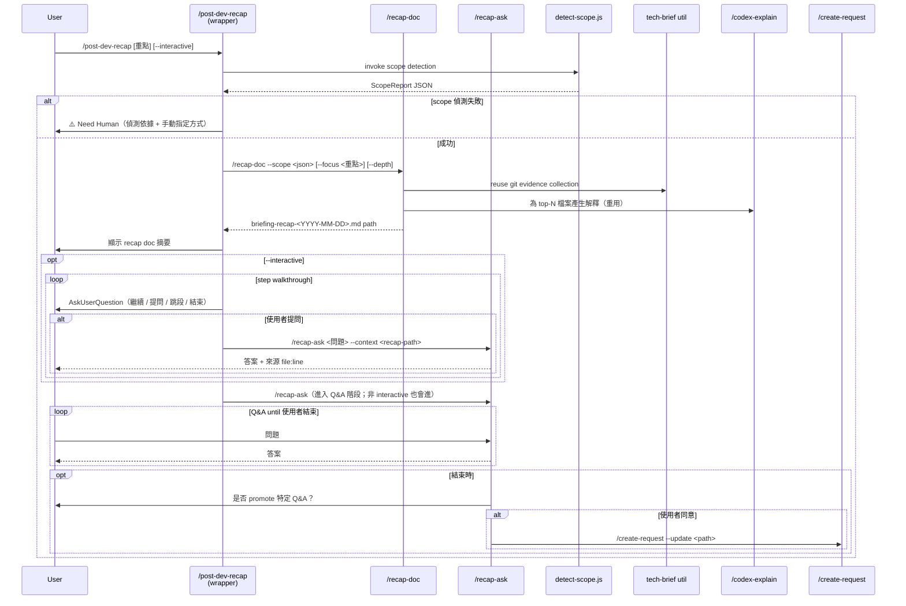

# Technical Spec: Post-Development Recap

> **Doc class**: Lifecycle — Phase 2 technical spec (per `@rules/docs-numbering.md`).
> **Created**: 2026-04-17
> **Feature slug**: `post-dev-recap`
> **Requirements**: [`./1-requirements.md`](./1-requirements.md)
> **Feasibility**: [`./0-feasibility-study.md`](./0-feasibility-study.md)
> **Chosen shape**: Shape B+D Hybrid（`/post-dev-recap` wrapper → `/recap-doc` + `/recap-ask`）

---

## 1. Requirement Summary

| Dimension | Content |
|-----------|---------|
| Problem | AI 代寫完成後使用者對實作細節缺乏掌握度 —「逆向知識傳遞」缺口 |
| Goals | 導覽本輪變更、支援追問、明示與 `/ask`、`/tech-brief` 的邊界 |
| Scope | 新增 3 個 skill（1 wrapper + 2 sub），沿用既有 `briefing-` ancillary doc 命名 |
| Out of scope | 自動觸發（FR-W1）、跨輪彙整（FR-W2）|

FR/NFR/AS 追溯請見 [`1-requirements.md`](./1-requirements.md)；方案選擇理由請見 [`0-feasibility-study.md`](./0-feasibility-study.md) §8。

---

## 2. Existing Code Analysis

### 2.1 Related modules（reuse contract，不得重造）

此表為 [`0-feasibility-study.md` §4.1 Reuse Contract](./0-feasibility-study.md) 的 tech-spec 對應；每項在 review / implementation 階段可核驗是否真的被呼叫。

| 模組 | 用途 | 對應 FR | Reuse mode |
|------|------|---------|------------|
| `scripts/resolve-feature-cli.js` | 5-level cascade 解析 feature context | FR-1, FR-7 | **Reuse**（直接呼叫 CLI） |
| `.claude/skills/tech-brief/references/source-guide.md` L26-46 | Stage 2 git evidence collection | FR-3 | **Reuse**（採同演算法） |
| `.claude/skills/ask/SKILL.md` L76-92（Phase 2 context gathering） | intent 分類 + context 整合 | FR-4 | **Reuse**（採同 pattern） |
| `.claude/skills/git-investigate/SKILL.md` L32-40 | git blame / log --follow | FR-1, FR-7 | **Thin wrap**（封裝到 detect-scope）|
| `.claude/skills/codex-explain/SKILL.md` L29-33 | 程式碼解釋 prompt 模板 | FR-3 | **Reuse**（Skill 呼叫） |
| `.claude/skills/create-request/SKILL.md` L24-34 `--update` mode | promote 寫回 | FR-8 | **Reuse**（Skill 呼叫） |
| `scripts/config/doc-taxonomy.json` L94-99（`briefing-` ancillary） | ancillary 類型 | Q5 | **Reuse**（既有規格） |

**違反偵測**：若 implementation 階段任一「Reuse」欄位的模組未被實際 import / Skill 呼叫，即違反 NFR-5，應阻擋 merge。

### 2.2 Files requiring changes

| Path | Change |
|------|--------|
| `.claude/skills/post-dev-recap/SKILL.md` | **新增**（wrapper skill） |
| `scripts/detect-scope.js` | **新增**（scope detection 共用工具） |
| `.claude/skills/recap-doc/SKILL.md` | **新增**（doc-gen skill） |
| `.claude/skills/recap-doc/references/prompt-template.md` | **新增**（recap 合成 prompt） |
| `.claude/skills/recap-ask/SKILL.md` | **新增**（Q&A skill） |
| `.claude/skills/recap-ask/references/qa-prompt.md` | **新增** |
| `test/skills/post-dev-recap.test.js` | **新增** |
| `test/skills/recap-doc.test.js` | **新增** |
| `test/skills/recap-ask.test.js` | **新增** |
| `test/scripts/detect-scope.test.js` | **新增** |
| `scripts/security-redact.js` | **新增**（NFR-7 共用 redaction util） |
| `test/scripts/security-redact.test.js` | **新增** |
| `docs/features/post-dev-recap/requests/` | **新增**（從本 spec 拆票） |
| `CLAUDE.md` / `.claude/CLAUDE.md` Command Quick Reference | 加入 3 個新 skill |
| `docs/skill-catalog.yml`（若存在） | 登錄 3 個新 skill |

### 2.3 Design patterns 沿用

| Pattern | 出處 | 本 feature 採用 |
|---------|------|-----------------|
| JSON heuristics script 搭配 skill | `next-step/scripts/analyze.js` | `scripts/detect-scope.js` |
| 3-stage 多源收集 | `tech-brief` Stage 1-3 | `/recap-doc` Phase 2 |
| Depth levels（brief/normal/deep） | `tech-brief`, `codex-explain` | `/recap-doc --depth` |
| Sentinel gate 輸出 | `auto-loop.md` `✅ Ready` / `⛔ Blocked` | `/post-dev-recap` 階段回報 |
| `--continue <threadId>` loop | `codex-review-*` skills | `/recap-ask --continue` |

---

## 3. Technical Solution

### 3.1 Architecture Design



### 3.2 Data Model

#### 3.2.1 `ScopeReport` JSON schema（`detect-scope.js` 輸出）

```json
{
  "version": 1,
  "detected_at": "2026-04-17T10:00:00Z",
  "source": "uncommitted | branch | session",
  "confidence": "high | medium | low",
  "base_ref": "HEAD | origin/main | <commit-sha>",
  "files": [
    {
      "path": "string (repo-relative)",
      "change_type": "added | modified | deleted | renamed",
      "lines_changed": { "added": 0, "deleted": 0 },
      "top_function": "string (optional, 若可偵測)"
    }
  ],
  "feature_context": {
    "key": "string | null",
    "docs_path": "string | null",
    "has_tech_spec": false,
    "has_requirements": false
  },
  "focus_hint": "string | null (來自 $ARGUMENTS)",
  "fallback_trace": [
    { "layer": "uncommitted", "outcome": "success | empty | error", "detail": "..." }
  ]
}
```

**Fallback 順序**（Q2 已定）：

1. `uncommitted`：`git diff HEAD` + `git status --porcelain` 若非空 → 使用
2. `branch`：`git merge-base HEAD <base>` + `git diff <base>..HEAD` 若非空 → 使用
3. `session`：掃描當前 Claude session 的 Edit/Write 事件（從 `.claude_review_state.json` 或 PostToolUse hook 紀錄）
4. 全部空 → `⚠️ Need Human`，輸出 `fallback_trace` 提示使用者手動指定

> **`session` 層實作說明**：v1 先以 `git diff` 結果為主；`session edits` 層在 v1 視為 best-effort。**實際消費的欄位是 `changed_files_since_review`**（hook 真正會寫入的欄位，存絕對路徑，code review 通過時清空）；`recent_file_edits` 保留為 legacy fallback，兩者皆接受、live 的優先。原文只寫 `recent_file_edits` 是錯的——本 repo 從未有任何 writer 寫入該欄位，因此這一層一律回傳 null，是**靜默的 no-op 而非 fallback**（見 `scripts/detect-scope.js:190-199`）。路徑正規化：`realpathBestEffort` 解析後丟棄 repo root 之外者，相對路徑原樣交給安全閘。缺失時 fallback 到 ⚠️ Need Human 但輸出 hint。

#### 3.2.2 Recap doc 結構（`briefing-recap-<YYYY-MM-DD>.md`）

```markdown
# Recap: <feature-key or "session">

> **Scope source**: uncommitted | branch | session
> **Detected at**: ISO 8601
> **Focus**: <user hint or "none">
> **Confidence**: high | medium | low

## 1. Overview
<AI 總結本輪變更的意圖與範圍>

## 2. Changed Files
| # | File | Change | Design Intent | Key Code |
|---|------|--------|---------------|----------|
| 1 | path | +10/-3 | <一句設計理由> | `file:line` 引用 |

## 3. Design Decisions
<列出偵測到的關鍵設計決策，若 feature 有 tech-spec 則對照規格>

## 4. Spec vs Implementation Drift（若偵測到 tech-spec）
| Spec Item | Implementation | Match? | Notes |

## 5. Blind Spots（FR-9 Must，一律輸出）
<AI 自判最可能被忽略的細節；若無，明示「本輪未偵測到明顯盲點」+ 推論依據>

## 6. Anticipated Questions（若啟用 FR-11）
- Q1: ... → <可追問 /recap-ask 取得完整答案>

## 7. Evidence
<完整的 file:line 引用清單 + git commit SHA>
```

#### 3.2.3 State file（v1 不引入；規格保留供 v2）

```json
// .claude_recap_state.json (v2 only, not in v1)
{
  "session_id": "string",
  "last_recap_path": "string",
  "qa_history": [
    { "question": "...", "answer_summary": "...", "timestamp": "..." }
  ]
}
```

v1 由 Claude session 本身保存 Q&A 脈絡；v2 再根據實際痛點決定是否需要 persistence。

### 3.3 API Design — Skill Signatures

#### 3.3.1 `/post-dev-recap`（wrapper）

```
/post-dev-recap [<focus>] [--interactive] [--depth brief|normal|deep]
```

| Flag | Default | Description |
|------|---------|-------------|
| `<focus>` | `""` | 自然語言重點（free text） |
| `--interactive` | false | 啟用逐步互動導覽（FR-6） |
| `--depth` | `normal` | recap doc 深度 |

> **Q&A 階段為 FR-4 Must requirement，強制發生**。使用者可隨時輸入「結束」退出；但 wrapper 不提供 `--no-qa` skip flag。若使用者想要單純產文件，應直接呼叫子 skill `/recap-doc`（§3.3.2）。

#### 3.3.2 `/recap-doc`（sub-skill，可獨呼）

```
/recap-doc --scope <json-path-or-inline> [--focus <str>] [--depth brief|normal|deep] [--output <path>]
```

| Flag | Default | Description |
|------|---------|-------------|
| `--scope` | required | ScopeReport JSON 路徑或 inline JSON |
| `--focus` | `""` | 與 wrapper 傳入的 focus 一致 |
| `--depth` | `normal` | 深度控制 |
| `--output` | `docs/features/<key>/briefing-recap-<date>.md` | 可覆寫 |

#### 3.3.3 `/recap-ask`（sub-skill，可獨呼）

```
/recap-ask <question> --context <recap-doc-path> [--continue <threadId>] [--lazy-fetch]
```

| Flag | Default | Description |
|------|---------|-------------|
| `<question>` | required | 使用者自由文字問題 |
| `--context` | required | recap doc 路徑（primary context） |
| `--continue` | null | 沿用先前 Codex threadId |
| `--lazy-fetch` | true | Q&A 過程中可按需 Read 被引用檔案 |

### 3.4 Core Logic

#### 3.4.0 Security enforcement（NFR-7 / NFR-8）

橫跨所有 phase 的安全閘門：

| Layer | 介入位置 | 實作 |
|-------|----------|------|
| Path boundary（NFR-8）| `detect-scope.js` 啟動前、`/recap-doc` 寫檔前、`/recap-ask` lazy-fetch 前 | `git rev-parse --show-toplevel` 取得 repo root；所有路徑 `path.resolve(root, p)` 後檢查 `startsWith(root + "/")`；拒絕 `..` 與外部 symlink |
| Secret redaction（NFR-7）| `/recap-doc` Phase 2 讀檔後、Phase 4 合成前、Phase 5 寫檔前；`/recap-ask` lazy-fetch 後 | 2-tier scan：<br>• 高信心（RSA/EC 私鑰 header、API token 前綴如 `AKIA`、`sk-`, `ghp_`）→ **abort with error**<br>• 中信心（hex 32+ 字元、`password=`, `token:` 後接字串）→ 遮罩 `[REDACTED]` |
| Output sanitization | `/recap-doc` 寫 markdown 前、`/recap-ask` 回覆組裝前 | Apply redaction 同上規則；Q&A 回覆不得直接洩漏 lazy-fetch 內容中的 secret |

**共用工具**：為避免三個 skill 各自實作，抽出 `scripts/security-redact.js`（新增於 T1 ticket 中，sample 規則詳見 `test/scripts/security-redact.test.js`）。

#### 3.4.1 `detect-scope.js`（FR-1）

```
Input: focus (string, optional)
Output: ScopeReport JSON

Algorithm:
1. parse args → focus string（from $ARGUMENTS）
2. Try layer "uncommitted":
   - run `git diff --name-only HEAD`
   - run `git status --porcelain`
   - if union non-empty → assemble files[], source="uncommitted", confidence="high"
3. Else try layer "branch":
   - base = $(git merge-base HEAD origin/main) or HEAD~1 fallback
   - run `git diff --name-only <base>..HEAD`
   - if non-empty → source="branch", confidence="medium"
4. Else try layer "session":
   - read .claude_review_state.json changed_files_since_review (the field hooks write);
     fall back to recent_file_edits (legacy, no writer in this repo)
   - normalize: realpathBestEffort, drop paths outside repo root, pass relative through
   - if present → source="session", confidence="low"
5. Else → output fallback_trace with ⚠️ Need Human
6. For each file, compute lines_changed via `git diff --numstat`
7. Enrich feature_context via `node scripts/resolve-feature-cli.js`
8. Apply focus filter if provided (keyword → file path 或 change detail contains)
9. Emit JSON to stdout (timeout ≤ 5s per NFR-1)
```

#### 3.4.2 `/recap-doc` 合成流程（FR-3, FR-7, FR-9, FR-11）

```
Phase 1: Load scope
  - parse --scope JSON

Phase 2: Evidence collection（重用 tech-brief Stage 2）
  - git log -20 scope.files[].path
  - git diff <base>..HEAD for top-N files (by change magnitude)
  - Read up to 5 changed source files (100 lines each)

Phase 3: Spec cross-reference（FR-7）
  - if feature_context.has_tech_spec → Read tech-spec § related to changed files
  - compute drift table: spec item × implementation presence

Phase 4: AI synthesis
  - 對 top-N 檔案呼叫 /codex-explain 取得設計解釋（重用，not reimplement）
  - 將解釋、drift、focus 合成 recap doc 各區段
  - --depth brief: top-N=5；§5 Blind Spots 簡短化（僅 top-3 項）；省略 §6 Anticipated Questions
  - --depth normal: top-N=10；§5 Blind Spots 完整；§6 Anticipated Questions 完整
  - --depth deep: top-N=15；加 code snippets inline；§5/§6 完整
  - §5 Blind Spots **任何 depth 都必須輸出**（FR-9 Must）；無盲點時明示「本輪未偵測到明顯盲點」

Phase 5: Write
  - 路徑決策：
    - if scope.feature_context.key → docs/features/<key>/briefing-recap-<date>.md
    - else → docs/briefing-recap-<date>.md（repo root）
  - 回傳 path to wrapper
```

#### 3.4.3 `/recap-ask` Q&A 流程（FR-4, FR-5, FR-8）

```
Phase 1: Bind primary context
  - Read --context recap doc 完整內容 → primaryContext
  - Extract all file:line references → evidenceIndex

Phase 2: Classify question
  - intent = { "recap-scoped" | "out-of-scope" | "ambiguous" }
  - recap-scoped: 問題明確關於 recap 中的檔案 / 設計 / 決策
  - out-of-scope: 問題超出 recap（跨 codebase 探索 / 無關 feature）
  - ambiguous: 邊界模糊

Phase 3: Answer or redirect
  - recap-scoped → answer with primaryContext, lazy-fetch cited files
  - out-of-scope → refuse + suggest `/ask` with same question
  - ambiguous → AskUserQuestion 確認

Phase 4: Continue loop until user ends

Phase 5 (optional): Promote
  - if user accepts → call /create-request --update or append to tech-spec
```

#### 3.4.4 `/post-dev-recap` wrapper 互動模式（FR-6）

**決策：使用 `AskUserQuestion` per-step**（harness-native、確定性最高）

```
Phase 0: detect scope (via detect-scope.js)
Phase 1: /recap-doc → return path
Phase 2 (非 interactive): 顯示 doc 摘要 → 進 Phase 3
Phase 2 (interactive):
  - 分段輸出 doc（每檔一段）
  - 每段結束後 AskUserQuestion:
    options: [繼續, 提問這段, 跳段, 結束]
  - 若「提問這段」→ 呼叫 /recap-ask（context 鎖定該段）
Phase 3: 進入 /recap-ask Q&A 自由對話（FR-4 Must，一律發生；使用者可隨時輸入「結束」退出）
Phase 4: 結束時 promote 提示
```

**替代方案**：single-prompt with `continue|ask <q>|skip|end` 指令 — 避免多次 `AskUserQuestion` 開銷，但喪失 harness-native UI。若原型顯示 v1 AskUserQuestion 開銷高，可在 v2 改採此法。

---

## 4. Risks and Dependencies

| # | Risk | Severity | Mitigation |
|---|------|----------|------------|
| R1 | Scope 偵測誤判（feasibility C2）| High | 3-layer fallback + `fallback_trace` 透明化；偵測失敗時不自動猜測，輸出 ⚠️ Need Human |
| R2 | `/recap-ask` 退化為 `/ask`（feasibility C3）| High | Phase 2 intent classification 強制綁 recap；out-of-scope 主動轉介 `/ask` |
| R3 | ScopeReport JSON schema 破壞向前相容性 | Medium | `version` 欄位明示；`detect-scope.js` 升級時維持 v1 schema reader |
| R4 | `briefing-recap-` 與 `briefing-` 既有類型誤判 | Low | `doc-classifier.js` regex 已為 `^briefing-`（[`doc-taxonomy.json:96`](../../../scripts/config/doc-taxonomy.json)）；`recap-` 為合法 suffix |
| R5 | `AskUserQuestion` 多次觸發引發使用者疲勞 | Medium | 預設非 interactive；`--interactive` 為 opt-in；每段選項限 4 個 |
| R6 | Q&A promote 寫回 tech-spec 導致規格漂移 | Medium | promote 只允許寫 request ticket 或 tech-spec `## Open Questions` 區段，禁止改設計章節 |
| R7 | 子 skill 間 JSON 傳遞耦合 | Medium | 用檔案路徑 + JSON schema；unit test 覆蓋 schema 版本 |
| R8 | `/codex-explain` 呼叫頻繁導致 NFR-1/3 超時 | Medium | Phase 4 限 top-N 檔案（N=5 brief / 10 normal / 15 deep）；可並行 |

### Dependencies

| Dep | Source | Required version |
|-----|--------|------------------|
| `scripts/resolve-feature-cli.js` | 既有 | 現行 |
| Node.js + `node:test` | 既有 | 現行 |
| Codex MCP（`mcp__codex__codex`, `mcp__codex__codex-reply`）| 既有 | 現行 |
| `AskUserQuestion` tool | harness | 現行 |

---

## 5. Work Breakdown

> 每 ticket AC ≤ 8（per `@rules/testing.md`）；由 `/create-request` 拆成 tickets。

| # | Ticket | AC Count | Dependencies | Blocked by |
|---|--------|----------|--------------|------------|
| T1 | **scope detector + redaction util**: `scripts/detect-scope.js` + `scripts/security-redact.js` + tests | 8 | resolve-feature-cli.js | — |
| T2 | **`/recap-doc` skill**: SKILL.md + prompt template + test | 8 | tech-brief source-guide, codex-explain | T1 |
| T3 | **`/recap-ask` skill**: SKILL.md + qa-prompt + test（含 intent classification）| 7 | ask Phase 2 pattern | — |
| T4 | **`/post-dev-recap` wrapper**: SKILL.md + interactive flow + test | 6 | all sub-skills | T1, T2, T3 |
| T5 | **Registration**: CLAUDE.md + .claude/CLAUDE.md + skill-catalog.yml + README i18n | 4 | — | T4 |
| T6 | **Status tracking**: 批次更新 post-dev-recap 目錄下的 request tickets 完成狀態 | 4 | — | T5 |

總預估：5-7 person-days（feasibility §5 Shape B+D 估算）

---

## 6. Testing Strategy

### 6.1 Per-skill test pyramid

| Skill | Unit（test/unit or test/scripts） | Integration（test/skills） | E2E |
|-------|------------------------------------|-----------------------------|-----|
| `detect-scope.js` | JSON schema validation / 3-layer fallback / timeout | — | — |
| `/recap-doc` | Prompt template rendering, depth filter | Scope JSON → doc output，含 drift 偵測 | 與真實 git diff + feature context 合跑 |
| `/recap-ask` | Intent classification boundary test | context binding, out-of-scope redirect | 多輪 Q&A loop |
| `/post-dev-recap` | Flag parsing | wrapper → sub-skill 串接 | interactive mode 模擬 |

### 6.2 AC 對應（從 `1-requirements.md`）

| AS | 測試類型 | 檔案 |
|----|----------|------|
| AS-1 | Integration | `test/skills/post-dev-recap.test.js` |
| AS-2 | Integration | `test/skills/recap-doc.test.js` |
| AS-3 | Unit（output schema）| `test/skills/recap-doc.test.js` |
| AS-4 | Integration（自動化可驗 context binding）| `test/skills/recap-ask.test.js` |
| AS-5 | Doc review（`/codex-review-doc`）| `.claude/skills/post-dev-recap/SKILL.md`（檢查 `When NOT to Use` 區塊）|
| AS-6 | Integration（監測無 git 變更）| `test/skills/post-dev-recap.test.js` |
| AS-7 | Integration（interactive flag）| `test/skills/post-dev-recap.test.js` |
| AS-8 | Perf test | `test/performance/recap.test.js`（新增） |
| AS-9 | Security test（secret redaction）| `test/skills/recap-doc.test.js` |
| AS-10 | Integration（drift detection）| `test/skills/recap-doc.test.js` |
| AS-11 | Integration（promote 流程）| `test/skills/recap-ask.test.js` |
| AS-12 | Unit（blind-spot heuristics 規則觸發）| `test/skills/recap-doc.test.js` |
| AS-13 | Integration（depth flag 影響輸出）| `test/skills/recap-doc.test.js` |
| AS-14 | Integration（anticipated questions 區段）| `test/skills/recap-doc.test.js` |

### 6.3 Evidence model（`@rules/testing.md`）

| AC | Evidence type | Note |
|----|---------------|------|
| AS-1, AS-2, AS-3, AS-6, AS-7, AS-10, AS-13, AS-14 | Automated test (priority 1) | `test/skills/*.test.js` |
| AS-4 | Automated integration + Runtime verification | 自動化涵蓋 context binding；人工確認流暢度 |
| AS-11 | Automated integration | promote 流程可自動化（mock `/create-request --update`）|
| AS-12 | Automated unit（heuristics output）+ Runtime verification | 自動化涵蓋 heuristics 規則觸發 |
| AS-5 | Doc review | `/codex-review-doc` pass 為 evidence |
| AS-8 | Runtime verification（perf test）| 實測 p95；自動化 CI 可選 |
| AS-9 | Automated test | `test/scripts/security-redact.test.js` + `test/skills/recap-doc.test.js` |

無 `ENV_UNAVAILABLE` / `UNSAFE_TO_AUTOMATE` 豁免需求。所有 AS 至少有 priority 1 或 priority 2 evidence。

---

## 7. Open Questions

### 7.1 Product decisions（已決議）

| # | Question | Resolution | Decided by / at |
|---|----------|-----------|-----------------|
| Q1 | FR-9 盲點清單優先級 | **Must** —— 任何 depth 都必須輸出；無項目時明示「本輪未偵測到明顯盲點」| User（2026-04-17） |
| Q2 | FR-11 Anticipated questions：是否與 recap doc 同批產出？ | **同批**（`--depth brief` 時省略）| Default adopted（2026-04-17） |
| Q3 | `/recap-ask` 發現問題超出 recap 範圍時的行為？ | **主動轉介 `/ask`**（非嚴格拒答）| Default adopted（2026-04-17） |
| Q4 | `/post-dev-recap --interactive` 預設值？ | **預設關閉**（opt-in）| Default adopted（2026-04-17） |

### 7.2 Technical decisions（可在 implementation 階段定案）

| # | Question | Proposed resolution |
|---|----------|---------------------|
| Q5 | `session` 層 fallback 實作是否需要 PostToolUse hook 配合？ | v1 best-effort 讀 `.claude_review_state.json`；無 hook 即標 confidence=low |
| Q6 | `/codex-explain` top-N 的 N 如何決定？ | depth brief=5 / normal=10 / deep=15（與 §3.4.2 一致）|
| Q7 | JSON schema 版本號管理方式？ | 欄位 `version: 1`；升級時新增 `v2` reader，保留 `v1` 相容 |

### 7.3 v2 backlog

- Cross-session Q&A persistence（`.claude_recap_state.json`）
- 跨 feature recap 彙整
- 匯出成 Slack / Notion snippet

---

## 8. References

- [`1-requirements.md`](./1-requirements.md) — FR/NFR/AS 原始來源
- [`0-feasibility-study.md`](./0-feasibility-study.md) — 架構方案評估與 Reuse Contract
- Reuse anchors:
  - `.claude/skills/tech-brief/references/source-guide.md` L26-46（Stage 2 pattern）
  - `.claude/skills/ask/SKILL.md` L76-92（Phase 2 context gathering）
  - `.claude/skills/next-step/SKILL.md` L16-35（JSON heuristics pattern）
  - `.claude/skills/codex-explain/SKILL.md` L29-33（explain prompt）
  - `.claude/skills/create-request/SKILL.md` L24-34（`--update` mode）
  - `scripts/config/doc-taxonomy.json` L94-99（`briefing-` ancillary）
- Rules:
  - `rules/auto-loop.md` L29-30（`.md` → `/codex-review-doc`）
  - `rules/git-workflow.md` L6（forbidden git ops）
  - `rules/testing.md`（test pyramid + evidence model）
  - `rules/docs-numbering.md` L56-93（ancillary naming）
- Codex brainstorm threadId: `019d99a5-a4f0-7de3-93ab-83ded1a92873`
- Next step: `/review-spec` → `/create-request` 拆 6 個 tickets → `/feature-dev` per ticket
