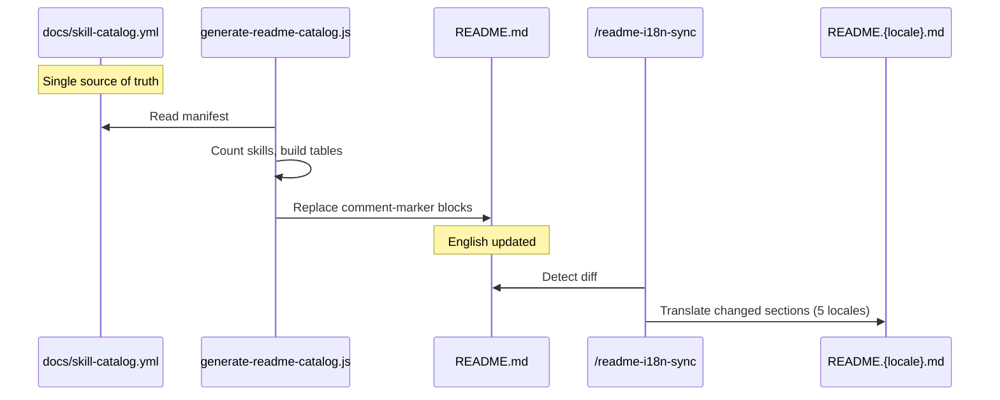

# README Skill Catalog Auto-Sync Technical Spec

> ## ⚠️ 記錄完整性聲明（2026-08-20 doc review round 14）
>
> 本檔經 `scripts/resolve-review-profile.js` 判定為 **Design record**——它記載 **2026-04-07**
> 當時的設計（起始 commit `7ad6cc3`，2026-04-07 20:34:42 +0800；git 史中不存在更早的版本，
> 前一版此處誤寫為「2026-03」），不是「今日行為」的權威來源。記錄的更新方式應為**日期註記追加**，
> 而非就地改寫。但本檔歷史上曾有一次就地改寫，為免該筆原文永久失傳，於此保存。
>
> **（2026-08-21 round 25 補記）** 本檔曾被審查者判為「`2-tech-spec.md` 是 lifecycle 文件，故屬
> current authority，§ Technical Solution 那列 `AGENTS.md kernel + git hooks` 的舊契約應就地改寫」。
> 該前提與本專案的分類器不符，故不採納——`node scripts/classify-docs-cli.js --feature
> readme-catalog-sync` 回報本檔 `role: "Design record"`、`current_authority: []`；
> `skills/ask/SKILL.md` § Phase 2 亦明載「問現行行為不要讀 tech spec」。**「lifecycle」與
> 「current authority」是兩個不同的軸**：`@rules/docs-numbering.md` 分的是編號體例，
> `scripts/lib/doc-metadata.js` 分的是權威角色，把前者讀成後者就會得出「設計記錄必須被改寫成今日行為」
> 這個相反的結論。那列舊契約是刻意保留的 2026-04 原文，判讀依據是緊接其後的日期註記；現行安裝面行為請看
> [`skills/codex-setup/SKILL.md`](../../../skills/codex-setup/SKILL.md)。
>
> **原文以 fenced block 逐字保存**（前一版放在表格儲存格內，行內反引號無法表示，因而**掉了每個
> slash command 與 `npx skills add` 外層的反引號**——那是摘述不是原文）。以下兩段由
> `git show b93e90f^:docs/features/readme-catalog-sync/2-tech-spec.md` 抽出，逐位元組比對：
>
> `b93e90f`（2026-04-08）覆蓋的 § 3.3 `WHATS-INCLUDED-COUNT` 範例：
>
> ~~~markdown
> | Skills | 90 | `/project-setup`, `/codex-review-fast`, `/verify`, `/smart-commit`, `/deep-research` |
> ~~~
>
> 同一 commit 覆蓋的 § 3.3 `INSTALL-COVERAGE` 範例：
>
> ~~~markdown
> | Plugin install | Claude Code | Full (90 skills, hooks, rules, auto-loop) |
> | `npx skills add` | Codex CLI, Cursor, Windsurf, Aider | Skills only (90 skills) |
> ~~~
>
> **為何不還原這兩處**：`b93e90f` 的標題是 “Move README marker blocks to wrap full tables”——
> 它改的不只是文字，而是 marker 的**設計本身**（marker 由包住單列改為包住整張表）。範例改成省略形式
> 是在示範新的 marker 形狀。把舊列還原回去，會讓本節誤述**現行 marker 設計**，那是比就地改寫更嚴重的
> 缺陷。因此處置是**保存原文於此、不還原本文**。
>
> **與 `cross-tool-portability` 的處置相同，理由不同。** 兩檔都不還原正文，都改以追加日期註記讓新舊
> 兩態並存：該檔的正文原樣留著（改寫前原文以 `git show d04f582:docs/features/cross-tool-portability/2-tech-spec.md`
> 取回），本檔的範例也不還原 `b93e90f` 之前的形狀。但**不還原的理由不可互換**——該檔是因為還原已提交
> 的記錄正文本身就是第二次改寫；本檔是因為那兩列示範的 marker 形狀已被推翻，還原會讓本節誤述現行設計。
> 同一個動作、兩種論證，寫明是為了不讓其中一邊被當成另一邊的先例。
>
> 2026-08-20 本輪（push-gate-optin r1–r5）自己造成的就地改寫**已全數還原**，八月行為改以日期註記表述。

## 1. Requirement Summary

- **Problem**: sd0x-dev-flow 有 90 個 skills，但 README 聲稱 87 個，catalog 實際只列出 76 個。14 個 skills 完全未出現在 README 中。每次新增 skill 需手動更新 README + CLAUDE.md + CLAUDE.template.md + 5 locale files = 8+ files，導致 systemic drift。
- **Goals**:
  1. 建立 `docs/skill-catalog.yml` 作為 skill catalog metadata 的 source of truth（category/featured/public；description 衍生自 SKILL.md）
  2. 建立 `scripts/generate-readme-catalog.js` 自動產生 README 的 Skill Reference section
  3. 消除手動同步 skill counts 和 catalog entries 的需求
  4. 保留 Essential Skills 的 editorial curation + 加入 `Use when` 欄位
- **Scope**:
  - **In**: `skill-catalog.yml` manifest、generator script、README comment markers、Essential section 改進
  - **Out**: 直接修改 locale READMEs（由 `/readme-i18n-sync` 處理）、CI auto-trigger（v2）、CLAUDE.md auto-sync（v2）

## 2. Existing Code Analysis

### 2.1 Current README Structure (relevant sections)

| Section | Lines | Content |
|---------|-------|---------|
| Hero count | `README.md:11` | `87 skills · 15 agents` (stale) |
| What's Included table | `README.md:209` | `Skills \| 87 \| ...` (stale) |
| Curated Skills table (to be renamed "Essential Skills") | `README.md:230-246` | 15 curated skills, 2-column (`Skill \| Description`) — currently unlabeled heading |
| `<details>` Full Catalog | `README.md:248-352` | 5 categories, 76 skills (should be 90) |
| `<summary>` | `README.md:249` | `All 87 skills` (stale) |

### 2.2 Missing Skills (14 not in README)

`codex-code-review`, `debug`, `dev-security-audit`, `doc-review`, `portfolio`, `readme-i18n-sync`, `refactor`, `req-analyze`, `request-tracking`, `runbook`, `security-review`, `tech-brief`, `test-health`, `test-review`

### 2.3 Reusable Infrastructure

| Module | Path | Reuse |
|--------|------|-------|
| Existing SKILL.md frontmatter | `skills/*/SKILL.md` | 90/90 have `description` field |
| `/readme-i18n-sync` | `skills/readme-i18n-sync/SKILL.md` | Diff-based parallel locale translation |
| Doc taxonomy config | `scripts/config/doc-taxonomy.json` | Config placement pattern |

### 2.4 Locale Impact

Stale counts appear in **multiple locations** across all 6 README files:

| Location | Line(s) | Content |
|----------|---------|---------|
| Hero count | `:11` | `87 skills · 15 agents` |
| Install coverage | `:141-142` | `Full (87 skills, ...)` / `Skills only (87 skills)` |
| What's Included | `:209` | `Skills \| 87 \| ...` |
| `<summary>` | `:249` | `All 87 skills` |

All 6 files (EN + zh-TW + zh-CN + ja + ko + es) contain the same stale strings. Generator fixes English; `/readme-i18n-sync` propagates to locales.

## 3. Technical Solution

### 3.1 Architecture



### 3.2 `docs/skill-catalog.yml` Schema

```yaml
version: 1

categories:
  - id: development
    label: Development
    order: 1
  - id: review
    label: "Review (Codex MCP)"
    order: 2
  - id: verification
    label: Verification
    order: 3
  - id: planning
    label: Planning
    order: 4
  - id: docs-tooling
    label: "Documentation & Tooling"
    order: 5

skills:
  - command: /feature-dev
    category: development
    featured: true
    use_when: "Implementing new features end-to-end"
    # description omitted → derived from skills/feature-dev/SKILL.md frontmatter
    public: true
  - command: /runbook
    category: docs-tooling
    featured: false
    description: "Generate/update release runbook"  # override: SKILL.md description too long for README
    public: true
  # ... 90 entries total
```

| Field | Required | Purpose |
|-------|----------|---------|
| `command` | Yes | Slash command name (must match `skills/<name>/` directory) |
| `category` | Yes | Category ID from `categories[]` |
| `featured` | Yes | `true` = appears in Essential Skills table |
| `use_when` | Required if `featured: true` | Short "when to use" text for Essential table |
| `description` | Optional | Override for Full Catalog (if omitted, **derived from SKILL.md frontmatter**) |
| `public` | Yes | `true` = appears in public README, `false` = omitted |

**Description derivation**: Generator reads `skills/<name>/SKILL.md` frontmatter `description` field as the default catalog text. The manifest `description` field is an **optional override** for cases where the SKILL.md description is too long or technical for the README. This avoids duplicating 90 descriptions while allowing editorial control where needed.

**Authoritative source**: `SKILL.md` is authoritative for `description`. `skill-catalog.yml` is authoritative for `category`, `featured`, `use_when`, and `public`. No field has two authoritative homes.

### 3.3 Comment Markers in README.md

Generator replaces content between marker pairs:

```markdown
<!-- BEGIN:HERO-COUNT -->
90 skills · 15 agents — ~4% of Claude's context window
<!-- END:HERO-COUNT -->

<!-- BEGIN:WHATS-INCLUDED-COUNT -->
| Category | Count | Examples |
|----------|-------|---------|
| Skills | 90 | ... |
| Agents | 15 | ... |
| ... (full table including header, separator, all rows) |
<!-- END:WHATS-INCLUDED-COUNT -->

<!-- BEGIN:INSTALL-COVERAGE -->
| Method | Tools | Coverage |
|--------|-------|----------|
| Plugin install | Claude Code | Full (90 skills, ...) |
| `npx skills add` | ... | Skills only (90 skills) |
| `/codex-setup init` | ... | AGENTS.md kernel + git hooks |
<!-- END:INSTALL-COVERAGE -->

<!-- BEGIN:ESSENTIAL-SKILLS -->
| Skill | Use when |
|-------|----------|
| `/project-setup` | First-time project configuration |
| `/feature-dev` | Implementing new features end-to-end |
| ... (12-15 featured skills) |
<!-- END:ESSENTIAL-SKILLS -->

<!-- BEGIN:FULL-CATALOG -->
<details>
<summary>All 90 skills</summary>

### Development (30)

| Skill | Description |
|-------|-------------|
| `/feature-dev` | Feature development workflow |
| ...

### Review (Codex MCP) (10)

| Skill | Description | Loop Support |
|-------|-------------|--------------|
| `/codex-review-fast` | Quick review (diff only) | `--continue <threadId>` |
| ...

...
</details>
<!-- END:FULL-CATALOG -->
```

> **Update（決議 2026-08-15；實作僅存在於 2026-08-20 工作樹，**尚未提交**——push-gate-optin r1–r5）**：上方 `INSTALL-COVERAGE` 區塊是撰寫當時的**示意**（`...` 是省略號，不是逐字輸出）。`pre-push` 改為 opt-in 後，該列的實際產出已變。**變更所在**：`buildInstallCoverage()`
> （`scripts/generate-readme-catalog.js`）——該檔在 2026-08-20 的**工作樹**中已改，**尚未提交**，
> `HEAD` 產生的仍是舊字串。工作樹版本逐字為：
>
> ```text
> | `$codex-setup init` | Codex CLI | AGENTS.md kernel + commit-msg hook (pre-push gate opt-in) |
> ```
>
> **三處**與示意不同，其中第三處才是本註記存在的理由：
>
> | # | 欄 | 示意 | 工作樹實際輸出 | 性質 |
> | - | -- | ---- | -------------- | ---- |
> | 1 | Method | `/codex-setup init` | `$codex-setup init` | 排版慣例——README 以 `$` 表示在 Codex CLI 提示字元下輸入（`README.md` § Codex CLI 安裝段的 `text` 區塊） |
> | 2 | Tools | `...` | `Codex CLI` | 示意的省略號被實際值取代，非語意差異 |
> | 3 | **Coverage** | `AGENTS.md kernel + git hooks` | `AGENTS.md kernel + commit-msg hook (pre-push gate opt-in)` | **語意變更**——複數 "git hooks" 曾暗示兩個 hook 皆預設安裝；`pre-push` 改 opt-in 後不再成立 |
>
> 上一版只列了前兩處，把唯一有語意的第三處漏掉了（2026-08-20 doc review round 14 抓到）。
> 上方示意保留為記錄——它示範的是 marker 區塊的形狀，不是逐字內容，所以**不改寫**它。

### 3.4 Generator Script (`scripts/generate-readme-catalog.js`)

**Input**: `docs/skill-catalog.yml`
**Output**: Modified `README.md` with replaced marker blocks

**Algorithm**:

```
1. Read skill-catalog.yml
2. Validate: every skills/<dir> has an entry in manifest (warn if missing)
3. Filter: only `public: true` skills (displayed count = public skills, not total filesystem count)
4. Sort: within each category, alphabetical by command
5. Build blocks:
   a. HERO-COUNT: "{count} skills · 15 agents — ~4% of Claude's context window"
   b. WHATS-INCLUDED-COUNT: Full "What's Included" table (header + separator + Skills row with dynamic count + static Agents/Hooks/Rules/Scripts rows). Markers wrap the entire table to avoid HTML comment breaking table rendering.
   c. INSTALL-COVERAGE: Full install table (header + separator + all 3 rows with dynamic count). Markers wrap the entire table.
   d. ESSENTIAL-SKILLS: featured=true skills as 2-column table (Skill | Use when)
   e. FULL-CATALOG: grouped 2-column tables per category with counts
6. Read README.md
7. Replace each BEGIN/END marker block with generated content
8. Write README.md
9. Report: counts, added/removed skills, warnings
```

**Special handling for Review category**: Keep the 3-column `Loop Support` column (hardcoded in manifest or detected from description).

**Validation warnings**:

| Condition | Warning |
|-----------|---------|
| Directory in `skills/` without manifest entry | `⚠️ Skill not in catalog: {name}` |
| Manifest entry without matching directory | `⚠️ Catalog entry for missing skill: {command}` |
| `featured: true` without `use_when` | `⚠️ Featured skill missing use_when: {command}` |
| `public: false` count > 10 | `⚠️ {N} internal skills hidden — review visibility` |

### 3.5 Essential Skills Selection Criteria

| Criterion | Description |
|-----------|-------------|
| Onboarding | Skills new users need first (`/project-setup`, `/install-*`) |
| Core workflow | Daily development essentials (`/feature-dev`, `/bug-fix`) |
| Quality gates | Required per CLAUDE.md (`/codex-review-fast`, `/precommit`) |
| Differentiation | Unique features (`/codex-brainstorm`, `/deep-research`) |

Target: 12-15 skills. Adding `Use when` column to help new users pick the right skill.

### 3.6 Migration Plan

| Step | Action | Files |
|------|--------|-------|
| 1 | Create `docs/skill-catalog.yml` with 90 entries | 1 new file |
| 2 | Create `scripts/generate-readme-catalog.js` | 1 new file |
| 3 | Add comment markers to `README.md` | 1 modified |
| 4 | Run generator → verify output | Automatic |
| 5 | Run `/readme-i18n-sync` → propagate to 5 locales | 5 modified |

## 4. Risks and Dependencies

| Risk | Impact | Probability | Mitigation |
|------|--------|-------------|------------|
| **Description quality uneven** | Generated catalog may look inconsistent | 中 | Normalize descriptions during initial manifest creation |
| **Generator ordering instability** | Noisy git diffs on each run | 低 | Deterministic sort (alphabetical within category) |
| **New skill without manifest entry** | Skill exists but invisible in README | 中 | Validation warning in generator + CI check (v2) |
| **i18n sync lag** | Locale READMEs temporarily stale after generation | 低 | Generator outputs change summary → trigger `/readme-i18n-sync` |

### Dependencies

| Dependency | Type | Status |
|-----------|------|--------|
| `skills/*/SKILL.md` description field | Content | ✅ 90/90 have it |
| `/readme-i18n-sync` skill | Downstream | ✅ Exists |
| Inline YAML parser (no npm dependency) | Runtime | ✅ Resolved — v1 uses lightweight inline parser |

## 5. Work Breakdown

| # | Task | Files | Effort | Dep |
|---|------|-------|--------|-----|
| 1 | Create `docs/skill-catalog.yml` — 90 skill entries with category/featured/use_when/description/public | `docs/skill-catalog.yml` | M | — |
| 2 | Create `scripts/generate-readme-catalog.js` — parse YAML, build blocks, replace markers | `scripts/generate-readme-catalog.js` | M | #1 |
| 3 | Add comment markers to `README.md` — wrap hero count, what's included, install coverage, essential, full catalog | `README.md` | S | — |
| 4 | Update Essential Skills table — 12-15 skills with `Use when` column | `README.md` (via generator) | S | #1, #2 |
| 5 | Write tests `test/scripts/generate-readme-catalog.test.js` | `test/scripts/generate-readme-catalog.test.js` | M | #2 |
| 6 | Run generator + `/readme-i18n-sync` | All locale READMEs | S | #1-4 |

## 6. Testing Strategy

### Static Contract Tests

| Test | Assertion |
|------|-----------|
| `skill-catalog.yml` valid YAML | Parse without error |
| All `skills/` dirs have manifest entries | Directory scan vs manifest comparison |
| All manifest entries have valid category | `category` matches `categories[].id` |
| `featured: true` entries have `use_when` | Field presence check |
| Generator produces valid markdown | No unclosed tags, valid tables |
| Comment markers preserved | BEGIN/END pairs intact |

### Integration Tests

| Test | Scenario | Expected |
|------|----------|----------|
| Generator idempotent | Run twice, compare output | Identical output |
| Skill count accurate | Count `public: true` entries | Matches hero count |
| All count-bearing strings covered | Scan README for `\d+ skills` outside markers | Zero unmanaged occurrences |
| Missing skill detection | Add skills/ dir without manifest entry | Warning emitted |
| Essential count | Count `featured: true` | 12-15 range |
| Description derivation | Skill with no manifest `description` | Uses SKILL.md frontmatter |
| Description override | Skill with manifest `description` | Uses manifest value |

## 7. Open Questions

| # | Question | Impact | Suggested Resolution |
|---|---------|--------|---------------------|
| 1 | ~~YAML parser~~ **Resolved**: 使用 inline lightweight parser（repo 無 dependencies section，避免引入 npm dependency）。Manifest 結構簡單（flat arrays），正則解析足夠。 | 依賴管理 | v1 inline parser；如需深層 YAML 功能再升級 |
| 2 | Review category 的 `Loop Support` 欄位如何處理？ | 表格結構 | 在 manifest 加 `loop_support: "--continue <threadId>"` optional field |
| 3 | Generator 是否應同時更新 `CLAUDE.md` 和 `CLAUDE.template.md` 的 Command Quick Reference？ | Scope | v1 只更新 README，v2 考慮同步 CLAUDE.md |
| 4 | 是否需要 `--dry-run` mode 預覽 generator 輸出？ | UX | 建議 v1 實作，避免意外覆寫 |
