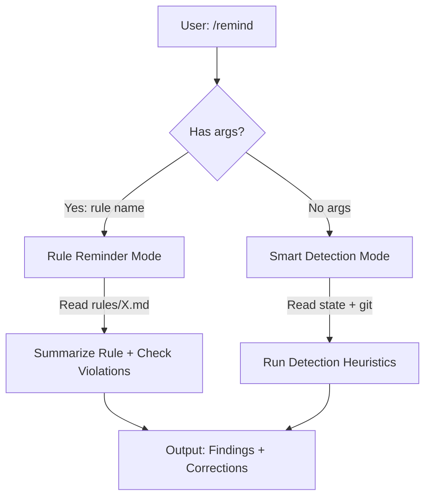

# `/remind` Technical Spec — Lightweight Model Correction

## 1. Requirement Summary

- **Problem**: 模型在長 session 中忘記 behavior-layer rules（auto-loop, doc sync, git workflow）。Hooks enforce completeness 但無法偵測 reasoning-level drift（"Declaring ≠ Executing"）。
- **Goals**:
  1. User-invoked correction（`/remind <rule>`）
  2. Smart detection（`/remind` reads state + git）
  3. Lightweight（< 5s, no research, no agents）
- **Scope**:
  - v1: state-based detection + rule reminder + correction output
  - v2: transcript analysis, auto-execution

## 2. Existing Code Analysis

### Related Modules

| Module | Relationship | Reusable |
|--------|-------------|----------|
| `hooks/stop-guard.sh:94-106` | State file parsing (code_review, doc_review, precommit, has_code/doc_change) | Detection logic |
| `skills/next-step/scripts/analyze.js:393-440` | Gate-missing heuristics (P0 findings) | Detection patterns |
| `hooks/post-tool-review-state.sh` | State file write/update | State source |
| `rules/*.md` | All rule files | Rule reminder content |
| `rules/auto-loop.md` § The Four Anchors | The four non-negotiable anchors (was "Prohibited Behaviors" before 2026-07-26) | Violation detection targets |

### Key Insight

stop-guard 和 next-step/analyze.js 已經實作了大部分 detection logic——`/remind` 不需要重新發明，只需要：
1. **Repackage** existing detection as user-invocable skill
2. **Add** rule reminder mode（lookup rule file + summarize）
3. **Format** as actionable correction output

## 3. Technical Solution

### 3.1 Architecture



### 3.2 Rule Reminder Mode (`/remind <rule>`)

When user provides a rule name:

1. **Resolve rule file**: `rules/<rule>.md` or `rules/<rule>-project.md`
2. **Read and summarize**: Extract key points (prohibited behaviors, required actions)
3. **Check current violations**: Cross-reference rule with state file + git status
4. **Output**: Rule summary + current violation status + correction commands

**Rule name resolution** (dynamic discovery, not hardcoded allowlist):

1. Try `rules/<input>.md`
2. Try `rules/<input>-project.md`
3. If neither exists → list all available rules from `ls rules/*.md`

Examples:

| Input | Resolves to |
|-------|------------|
| `auto-loop` | `rules/auto-loop.md` |
| `git-workflow` | `rules/git-workflow.md` |
| `testing` | `rules/testing.md` (+ `testing-project.md` if exists) |

All `rules/*.md` files are valid targets — the list is **not** an allowlist but a dynamic filesystem lookup.

### 3.3 Smart Detection Mode (`/remind`)

When no args, run heuristics in order:

#### Detection Rules (adapted from stop-guard + next-step)

| # | Check | Source | Detection | Correction |
|---|-------|--------|-----------|------------|
| 1 | Code changed, no review | state file | `has_code_change=true` + `code_review.passed=false` | `/codex-review-fast` |
| 2 | Doc changed, no review | state file | `has_doc_change=true` + `doc_review.passed=false` | `/codex-review-doc` |
| 3 | Review passed, no precommit | state file | `code_review.passed=true` + `precommit.passed=false` | `/precommit-fast` (canonical per auto-loop; `/precommit` for important PRs) |
| 4 | State drift | state + git | state says changes but git clean | Reset `.claude_review_state.json` |
| 5 | Main branch | git | `git branch --show-current` = main/master | 建議建 feature branch |
| 6 | Dirty worktree, no state | git + state | `git status --porcelain` has output + no state file | `/codex-review-fast` (code) or `/codex-review-doc` (docs only) |

**v1 scope note**: Detection reads the 5 primary booleans from state file. Dual-mode aggregate gate, sidecar blocked marker, and stale-state reconciliation are **not** reimplemented — they remain stop-guard's responsibility. `/remind` is advisory; stop-guard is enforcement.

#### Implementation

```bash
# Read state file (subset of stop-guard.sh:94-106, advisory only)
STATE_FILE=".claude_review_state.json"
if [[ -f "$STATE_FILE" ]]; then
  STATE=$(cat "$STATE_FILE")
  HAS_CODE=$(echo "$STATE" | jq -r '.has_code_change // false')
  HAS_DOC=$(echo "$STATE" | jq -r '.has_doc_change // false')
  CODE_REVIEW=$(echo "$STATE" | jq -r '.code_review.passed // false')
  DOC_REVIEW=$(echo "$STATE" | jq -r '.doc_review.passed // false')
  PRECOMMIT=$(echo "$STATE" | jq -r '.precommit.passed // false')
fi

# Git checks
BRANCH=$(git rev-parse --abbrev-ref HEAD 2>/dev/null)
DIRTY=$(git status --porcelain 2>/dev/null)
```

### 3.4 Output Format

```markdown
## Reminder

### Findings

| # | Priority | Rule | Issue | Correction |
|---|----------|------|-------|------------|
| 1 | P0 | auto-loop | Code changed but review not passed | Run `/codex-review-fast` |
| 2 | P1 | git-workflow | Working on main branch | Create feature branch |

### Corrections (copy-pasteable)
1. `/codex-review-fast`
2. `git checkout -b feat/my-feature`

### All Clear ✅
(shown when no findings)
```

### 3.5 Command Interface

**Command**: `/remind`

| Flag | Default | Description |
|------|---------|-------------|
| `<rule>` | — | Specific rule name to remind |
| `--all` | false | Load ALL rules + CLAUDE.md (nuclear mode) |
| (no args) | — | Smart detection mode |

## 4. Risks and Dependencies

| Risk | Impact | Mitigation |
|------|--------|------------|
| jq unavailable | Detection fails | Graceful degradation: skip state checks, only do git checks |
| State file stale | False positives | Reconcile with `git status --porcelain` (same as stop-guard) |
| Rule file renamed | Rule reminder fails | Use `ls rules/*.md` fallback listing |

## 5. Work Breakdown

| # | Task | Effort | Output |
|---|------|--------|--------|
| 1 | Create `skills/remind/SKILL.md` | M | Skill definition |
| 2 | Create `skills/remind/references/detection-rules.md` | S | Detection rule table |
| 3 | Create `commands/remind.md` | S | Command entry point |
| 4 | Create `test/commands/remind.test.js` | S | Tests |
| 5 | Update CLAUDE.md command tables (3 files) | S | +1 line each |

## 6. Testing Strategy

| Type | Test | File |
|------|------|------|
| Schema | SKILL.md frontmatter + references | `test/commands/skills-schema.test.js` |
| Content | Detection rules documented | `test/commands/remind.test.js` |
| Content | Rule reminder mode documented | `test/commands/remind.test.js` |
| Content | Output format specified | `test/commands/remind.test.js` |
| Content | CLAUDE.md entry | `test/commands/remind.test.js` |

## 7. Open Questions

| # | Question | Impact | 建議 |
|---|----------|--------|------|
| 1 | 是否需要 `--go` 自動執行修正？ | UX | v1 只提醒，v2 考慮（用 next-step --go pattern） |
| 2 | 是否整合 SessionStart hook 自動 remind？ | Enforcement | v2 考慮 |
| 3 | 命名 `/remind` vs `/check-rules` vs `/audit`？ | UX | 建議 `/remind`——簡短、直覺、動詞 |
