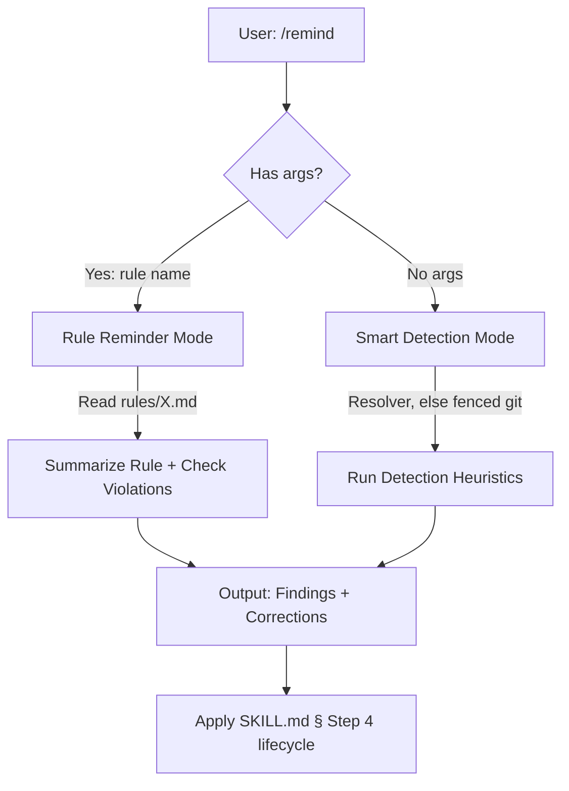

# `/remind` Technical Spec — Lightweight Model Correction

## 1. Requirement Summary

- **Problem**: 模型在長 session 中忘記 behavior-layer rules（auto-loop, doc sync, git workflow）。Hooks enforce completeness 但無法偵測 reasoning-level drift（"Declaring ≠ Executing"）。
- **Goals**:
  1. User-invoked correction（`/remind <rule>`）
  2. Smart detection（`/remind` reads the advisory resolver, falling back to fenced git）
  3. Lightweight *detection*（normally under 5s; no research, no agents）— the corrections it then invokes cost what those reviews cost. **Bounded, not hard-bounded**: `AUTO_LOOP_DERIVE_TIMEOUT` (default 10s) caps the resolver only when `timeout`, `gtimeout` or `perl` is present — with none of them Step 1 runs node directly — and the one `git status` probe carries no timeout at all
- **Scope**:
  - v1: resolver-based detection + rule reminder + correction output *and its execution*
  - v2: transcript analysis
- **Two senses of "automatic", kept apart because v1 shipped one of them**: `/remind` **does execute
  its corrections** — it invokes the correction skill in the same reply rather than proposing it
  (`skills/remind/SKILL.md` § Execute, Don't Report), and no `--go` flag gates that. What it does
  **not** do is block: it is advisory in the sense that stop-guard is the enforcement surface and
  nothing here holds a session open. Question 1 below was answered by shipping, not deferred.

## 2. Existing Code Analysis

### Related Modules

| Module | Relationship | Reusable |
|--------|-------------|----------|
| `scripts/lib/gate-derive.js` (`--advisory`) | The five booleans, derived from tree content rather than stored flags — the same resolver the auto-loop advisory hooks call. WB5c deleted `has_code_change` / `has_doc_change`, so the earlier plan of reusing stop-guard's state-file parsing no longer has fields to parse | Detection input |
| `skills/next-step/scripts/analyze.js:393-440` | Gate-missing heuristics (P0 findings) | Detection patterns |
| `hooks/post-tool-review-state.sh` | State file write/update | State source |
| `rules/*.md` | All rule files | Rule reminder content |
| `rules/auto-loop.md` — "Terminal completion invariant" opening paragraph, `Gate sequence:` inside § Tiers | The live extraction targets for detections 1–3. An earlier § "The Four Anchors" no longer exists; the corollaries it named are now inside the invariant paragraph, and `test/skills/remind.test.js` pins that these targets still resolve | Violation detection targets |

### Key Insight

stop-guard 和 next-step/analyze.js 已經實作了大部分 detection logic——`/remind` 不需要重新發明，只需要：
1. **Repackage** existing detection as user-invocable skill
2. **Add** rule reminder mode（lookup rule file + summarize）
3. **Format** as actionable correction output

## 3. Technical Solution

### 3.1 Architecture



The graph does not end at `O`, and it deliberately stops at `X` without drawing what happens
there. Output is the traceability record; the deliverable is the invocation, and which outcome
terminates a run — the three that end without one, and the degraded run that invokes first and
terminates anyway — is stated once, in `skills/remind/SKILL.md` § Step 4. Redrawing it here is
what round 23 caught: this graph had grown its own lifecycle and diverged from Step 4 within one
round. A picture of the lifecycle is a second copy of the lifecycle.

### 3.2 Rule Reminder Mode (`/remind <rule>`)

When user provides a rule name:

1. **Resolve rule file**: `rules/<rule>.md` or `rules/<rule>-project.md`
2. **Read and summarize**: Extract key points (prohibited behaviors, required actions)
3. **Check current violations**: cross-reference the rule with Step 1's resolved variables — the resolver, or its disclosed git fallback. Not the state file directly: a stored verdict is not bound to the tree that earned it
4. **Output**: Rule summary + current violation status + correction commands
5. **Execute**: hand off to `skills/remind/SKILL.md` § Step 4 — the execution contract governs this
   mode too, so an owed correction is invoked in the same reply rather than printed

**Rule name resolution** (dynamic discovery, not hardcoded allowlist):

1. Try `rules/<input>.md`
2. Try `rules/<input>-project.md`
3. If neither exists → list all available rules via `Glob("rules/*.md")`, the mechanism the executable contract uses

Examples:

| Input | Resolves to |
|-------|------------|
| `auto-loop` | `rules/auto-loop.md` |
| `git-workflow` | `rules/git-workflow.md` |
| `testing` | `rules/testing.md` (+ `testing-project.md` if exists) |

All `rules/*.md` files are valid targets — the list is **not** an allowlist but a dynamic filesystem lookup.

### 3.3 Smart Detection Mode (`/remind`)

When no args, run heuristics in order:

#### Detection Rules (adapted from stop-guard + next-step)

| # | Check | Source | Detection | Correction |
|---|-------|--------|-----------|------------|
| 1 | Code changed, no review | resolver | `has_code_change=true` + `code_review_passed=false` | `/codex-review-fast` |
| 2 | Doc changed, no review | resolver | `has_doc_change=true` + `doc_review_passed=false` | `/codex-review-doc` |
| 3 | Review passed, no precommit | resolver | `code_review_passed=true` + `precommit_passed=false` | `/precommit` |
| 4 | Main branch | git | `BRANCH` = main/master | 建議建 feature branch |
| 5 | Dirty worktree, no state | git + state | `DIRTY` non-empty + no state file | Load `CLAUDE.md` § Required Checks — **rows 1–2 choose the correction, not this row**. With no resolver the fallback never established which plane changed, so a `code`/`docs` choice here would be invented |

**Retired — state drift.** A sixth row once read "state says changes but git clean" and suggested
resetting `.claude_review_state.json`. WB5c deleted the stored `has_code_change`/`has_doc_change`
fields, and nothing computes the "state says changes" half any more: the change flags now come from
the resolver or from git, so by construction they agree with the tree they were read from. The row
was removed rather than reinterpreted — a detection whose condition cannot be evaluated resolves to
whatever the reader invents, and here that would have been "reset a valid state file".

**Degraded runs terminate explicitly.** Without a verdict source, re-reading Step 1 after a
correction returns the same rows, so `/remind` invokes each distinct correction **at most once** and
the run then terminates whether or not a correction fired — a clean tree with no readable verdict
verified nothing, so no clearance is available to it. **Degradation dominates the terminal status**,
which is what keeps the lone-detection-4 exception from swallowing it: detection 4 reads `BRANCH`,
not the resolver, so a degraded clean run on `main` does fire a row and still has no Skill to
invoke, and it terminates the same way. Which outcomes end a run without an invocation is enumerated in
`skills/remind/SKILL.md` § Step 4 and deliberately not repeated here — the same reason § 3.1's
graph stops at the delegation node.

**v1 scope note**: detection reads the five booleans from `scripts/lib/gate-derive.js --advisory`.
Without it there are **no verdicts at all** — the mirror is not read on any degraded run, clean tree
included, because a stored verdict is not bound to the tree in front of it and `git status` cannot
supply that binding (see § Implementation). The change question is still answered from git, so
detections 1, 2 and 5 work and detection 3 cannot fire. Dual-mode aggregate gate,
sidecar blocked marker, and stale-state reconciliation are **not** reimplemented — they remain
stop-guard's responsibility. **Advisory here means "does not block", not "does not act"**: nothing in
`/remind` holds a session open — that is stop-guard's job — while `/remind` itself runs the
correction it found, in the same reply (§ 1, Scope).

#### Implementation

The executable form lives in `skills/remind/SKILL.md` § Step 1 and is not duplicated here — it is the
block the dispatcher actually runs, and a second copy in this document drifted from it once already.
Its shape, and the reason for each part:

| Part | What it does | Why |
|------|--------------|-----|
| `_remind_git()` fence | Unsets the whole `GIT_*` namespace in a subshell, then `git -C "$PWD"` | A named subset leaves `GIT_CEILING_DIRECTORIES`, `GIT_DIR`, `GIT_CONFIG*` able to redirect or blind the read — and a blinded read looks exactly like a clean repository |
| `ROOT` | `rev-parse --show-toplevel`, else `$PWD` | `/remind` runs from wherever the session is; a cwd-relative state file or library path degrades an answerable run in `packages/app/` |
| Resolver call | `gate-derive.js --advisory`, installed copy first, bounded by a timeout ladder **when one of `timeout`/`gtimeout`/`perl` exists** — the last rung runs node unbounded | The stored change flags were deleted in WB5c; reading them would report "no change" on a dirty tree. All five fields or none — a partial answer must not mix two policies |
| Answer provenance | Accepted only when `treeState` is `ok` **and** `mirror_planes` is an empty **array** (the type is checked: jq gives `""` and `{}` length zero too, round 20); anything else is rejected like no answer at all | `resolveAdvisory()` keeps the mirror authoritative outside a repository (`treeState=not-a-repo`), where no digest receipt has a tree to bind to. Those are the same stored verdicts Step 1 refuses to read directly, so accepting them here would readmit a forged state file by a longer route (round 19) |
| The tree probe | **One** whole-tree `status --porcelain=v1 -uall --ignore-submodules=none`, run unconditionally. Anything but a clean, quiet, zero-exit answer sets `DIRTY` — to the captured output whenever that capture is non-empty (the probe runs under `2>&1`, so stdout and stderr arrive merged and `DIRTY` can carry either or both), and to the literal `unverifiable` only when the capture is empty, the nonzero-exit-with-no-output case. It opens **both** planes only on the branch that cannot classify — a rejected or unavailable resolver answer; a derived answer keeps its own per-plane verdict, dirty tree included | It does not classify: an ordinary pathspec is cwd-relative, and a per-plane guess that is wrong hides a gate. It is asked once because two probes can disagree — a concurrent editor, a racy wrapper — and classifying from one while reporting `DIRTY` from the other minted a false clearance over a moved tree (round 17) |
| The verdicts, degraded | Not read from anywhere: `CODE_REVIEW`/`DOC_REVIEW`/`PRECOMMIT` are `false` whenever the resolver did not answer | The state file's contents are never read here — only its existence, for detection 5. A clean tree does not bind a stored verdict to itself, so trusting one there let a commit-A PASS close a gate on commit B (round 18) |
| `BRANCH` | Same fence, `\|\| BRANCH=""` | A different question, so a separate read; a redirected environment must not report a feature branch as `main`, and the guard keeps a `set -e` caller alive to reach the cleanup line |

### 3.4 Output Format

```markdown
## Reminder

### Findings

| # | Priority | Rule | Issue | Correction |
|---|----------|------|-------|------------|
| 1 | P0 | auto-loop | Code changed but review not passed | Run `/codex-review-fast` |
| 2 | P1 | git-workflow | Working on main branch | Create feature branch |

### Corrections (copy-pasteable)
1. `/codex-review-fast`
2. `git checkout -b feat/my-feature`

### All Clear ✅
(the resolver answered **and** there are no findings — never on a degraded run)

### Degraded ⚠️
(the resolver did not answer: nothing was verified, so no clearance is claimed)
```

### 3.5 Command Interface

**Command**: `/remind`

| Flag | Default | Description |
|------|---------|-------------|
| `<rule>` | — | Specific rule name to remind |
| `--all` | false | Load ALL rules + CLAUDE.md (nuclear mode) |
| (no args) | — | Smart detection mode |

## 4. Risks and Dependencies

| Risk | Impact | Mitigation |
|------|--------|------------|
| jq unavailable | Detection degrades, fail-closed | Both jq reads are guarded with `\|\| true` — the field helper and the provenance check — so an absent jq leaves the answer unparsed, `ADV_OK` stays `false`, and the run takes the git fallback with every verdict set to `false` |
| State file stale **or forged** | False negatives — the dangerous direction, since a gate looks closed | The resolver answers from tree content, so a stale mirror cannot survive it. Where the resolver is unavailable the mirror is **not read at all**: a verdict records *that* a gate passed, never *which tree* passed it, and no local check here can supply the binding — a clean `git status` is equally true one checkout later, so a PASS from commit A would read as current on a clean commit B, and a forged entry is indistinguishable from a stale one. All three verdicts stay `false`; the cost is that detection 3 cannot fire on a degraded run |
| Rule file renamed | Rule reminder fails | Fall back to the `Glob("rules/*.md")` listing |

## 5. Work Breakdown

| # | Task | Effort | Output |
|---|------|--------|--------|
| 1 | Create `skills/remind/SKILL.md` | M | Skill definition |
| 2 | Create `skills/remind/references/detection-rules.md` | S | Detection rule table |
| 3 | ~~Create `commands/remind.md`~~ | S | Superseded: `commands/` was removed in v3 and the skill is its own entry point |
| 4 | Create `test/skills/remind.test.js` | S | Tests |
| 5 | Update CLAUDE.md command tables (3 files) | S | +1 line each |

## 6. Testing Strategy

| Type | Test | File |
|------|------|------|
| Schema | SKILL.md frontmatter + references | `test/skills/skills-schema.test.js` |
| Content | Detection rules documented, and the published set matches all three surfaces | `test/skills/remind.test.js` |
| Content | Rule reminder mode documented | `test/skills/remind.test.js` |
| Content | Output format specified | `test/skills/remind.test.js` |
| Behaviour | Step 1 executed in throwaway repositories — fence, root anchoring, resolver parsing, degraded fallback | `test/skills/remind.test.js` |

## 7. Open Questions

| # | Question | Impact | 建議 |
|---|----------|--------|------|
| 1 | 是否需要 `--go` 自動執行修正？ | UX | **Answered by shipping**: no flag. `/remind` invokes the correction skill in the same reply, always — a findings table that stops short of executing was the failure mode the skill exists to correct |
| 2 | 是否整合 SessionStart hook 自動 remind？ | Enforcement | v2 考慮 |
| 3 | 命名 `/remind` vs `/check-rules` vs `/audit`？ | UX | 建議 `/remind`——簡短、直覺、動詞 |
