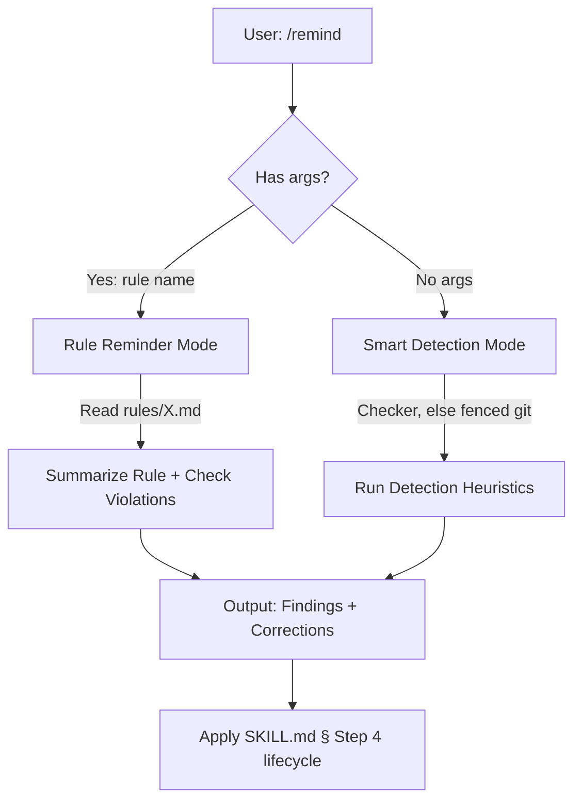

# `/remind` Technical Spec — Lightweight Model Correction

## 1. Requirement Summary

- **Problem**: 模型在長 session 中忘記 behavior-layer rules（auto-loop, doc sync, git workflow）。Hooks 提醒 completeness（自 hook-lightweighting 2026-08-13 起為純提醒層）但無法偵測 reasoning-level drift（"Declaring ≠ Executing"）。
- **Goals**:
  1. User-invoked correction（`/remind <rule>`）
  2. Smart detection（`/remind` reads the reminder-state checker `scripts/review-state.js`, falling back to fenced git）
  3. Lightweight *detection*（normally under 5s; no research, no agents）— the corrections it then invokes cost what those reviews cost. **Bounded, not hard-bounded**: `AUTO_LOOP_DERIVE_TIMEOUT` (default 10s) caps the checker only when `timeout`, `gtimeout` or `perl` is present — with none of them Step 1 runs node directly — and the one `git status` probe carries no timeout at all
- **Scope**:
  - v1: checker-based detection + rule reminder + correction output *and its execution*
  - v2: transcript analysis
- **Two senses of "automatic", kept apart because v1 shipped one of them**: `/remind` **does execute
  its corrections** — it invokes the correction skill in the same reply rather than proposing it
  (`skills/remind/SKILL.md` § Execute, Don't Report), and no `--go` flag gates that. What it does
  **not** do is block: nothing here holds a session open — and since hook-lightweighting
  (2026-08-13) neither do the review-layer reminder hooks (`pre-edit-guard.sh`, a security guard,
  still blocks sensitive-path edits with exit 2); the binding obligation is the behaviour-layer
  terminal completion invariant. Question 1 below was answered by shipping, not deferred.

## 2. Existing Code Analysis

### Related Modules

| Module | Relationship | Reusable |
|--------|-------------|----------|
| `scripts/review-state.js` (`check --format=json`) | Per gate plane `{noted, dirty, digest_match, verdict, rounds, passed, owed}`, derived from the live tree digest against the single-slot reminder state — the same checker the reminder hooks read. `passed` binds the recorded verdict to the current tree digest, so a stale note reads `false` by construction (hook-lightweighting §3.2) | Detection input |
| `skills/next-step/scripts/analyze.js:393-440` | Gate-missing heuristics (P0 findings) | Detection patterns |
| `~/.cache/sd0x-dev-flow/state/<repo-key>/<plane>.json` | The reminder slots the checker reads. Keyed by a non-contractual repo hash, so `/remind` never reads a slot directly — only through the checker (hook-lightweighting §3.1) | State source |
| `rules/*.md` | All rule files | Rule reminder content |
| `rules/auto-loop.md` — "Terminal completion invariant" opening paragraph, `Gate sequence:` inside § Tiers | The live extraction targets for detections 1–3. An earlier § "The Four Anchors" no longer exists; the corollaries it named are now inside the invariant paragraph, and `test/skills/remind.test.js` pins that these targets still resolve | Violation detection targets |

### Key Insight

stop-guard 和 next-step/analyze.js 已經實作了大部分 detection logic——`/remind` 不需要重新發明，只需要：
1. **Repackage** existing detection as user-invocable skill
2. **Add** rule reminder mode（lookup rule file + summarize）
3. **Format** as actionable correction output

## 3. Technical Solution

### 3.1 Architecture



The graph does not end at `O`, and it deliberately stops at `X` without drawing what happens
there. Output is the traceability record; the deliverable is the invocation, and which outcome
terminates a run — the three that end without one, and the degraded run that invokes first and
terminates anyway — is stated once, in `skills/remind/SKILL.md` § Step 4. Redrawing it here is
what round 23 caught: this graph had grown its own lifecycle and diverged from Step 4 within one
round. A picture of the lifecycle is a second copy of the lifecycle.

### 3.2 Rule Reminder Mode (`/remind <rule>`)

When user provides a rule name:

1. **Resolve rule file**: `rules/<rule>.md` or `rules/<rule>-project.md`
2. **Read and summarize**: Extract key points (prohibited behaviors, required actions)
3. **Check current violations**: cross-reference the rule with Step 1's resolved variables — the checker, or its disclosed git fallback. Not the state slot directly: the checker's `passed` is what binds a stored verdict to the current tree digest, and a raw slot carries no such binding
4. **Output**: Rule summary + current violation status + correction commands
5. **Execute**: hand off to `skills/remind/SKILL.md` § Step 4 — the execution contract governs this
   mode too, so an owed correction is invoked in the same reply rather than printed

**Rule name resolution** (dynamic discovery, not hardcoded allowlist):

1. Try `rules/<input>.md`
2. Try `rules/<input>-project.md`
3. If neither exists → list all available rules via `Glob("rules/*.md")`, the mechanism the executable contract uses

Examples:

| Input | Resolves to |
|-------|------------|
| `auto-loop` | `rules/auto-loop.md` |
| `git-workflow` | `rules/git-workflow.md` |
| `testing` | `rules/testing.md` (+ `testing-project.md` if exists) |

All `rules/*.md` files are valid targets — the list is **not** an allowlist but a dynamic filesystem lookup.

### 3.3 Smart Detection Mode (`/remind`)

When no args, run heuristics in order:

#### Detection Rules (adapted from stop-guard + next-step)

| # | Check | Source | Detection | Correction |
|---|-------|--------|-----------|------------|
| 1 | Code changed, no review | checker | `HAS_CODE=true` + `CODE_REVIEW=false` | `/codex-review-fast` |
| 2 | Doc changed, no review | checker | `HAS_DOC=true` + `DOC_REVIEW=false` | `/codex-review-doc` |
| 3 | Review passed, no precommit | checker | `CODE_REVIEW=true` + `PRECOMMIT=false` | `/precommit` |
| 4 | Main branch | git | `BRANCH` = main/master | 建議建 feature branch |
| 5 | Dirty plane, never noted | checker | (`HAS_CODE=true` + `CODE_NOTED=false`) or (`HAS_DOC=true` + `DOC_NOTED=false`) | Load `CLAUDE.md` § Required Checks — **one aggregated finding** naming every never-noted dirty plane, a single row however many planes it names |

**Retired — state drift.** A sixth row once read "state says changes but git clean" and suggested
resetting the repo-local state file. The stored change flags were deleted, and nothing computes the
"state says changes" half any more: the change flags now come from the checker's live tree digest or
from git, so by construction they agree with the tree they were read from. The row was removed
rather than reinterpreted — a detection whose condition cannot be evaluated resolves to whatever the
reader invents. `dirty-no-state` became `dirty-never-noted` in the same move: the repo-local
`.claude_review_state.json` was replaced by out-of-repo reminder slots (hook-lightweighting §3.1),
so "no state file" stopped being observable from the repo and the condition became the checker's
per-plane `noted` flag.

**Degraded runs terminate explicitly.** Without a verdict source, re-reading Step 1 after a
correction returns the same rows, so `/remind` invokes each distinct correction **at most once** and
the run then terminates whether or not a correction fired — a clean tree with no readable verdict
verified nothing, so no clearance is available to it. **Degradation dominates the terminal status**,
which is what keeps the lone-detection-4 exception from swallowing it: detection 4 reads `BRANCH`,
not the checker, so a degraded clean run on `main` does fire a row and still has no Skill to
invoke, and it terminates the same way. Which outcomes end a run without an invocation is enumerated in
`skills/remind/SKILL.md` § Step 4 and deliberately not repeated here — the same reason § 3.1's
graph stops at the delegation node.

**v1 scope note**: detection reads the seven booleans from `scripts/review-state.js check
--format=json` — per plane, `dirty` (the change flags), `passed` (the verdicts) and `noted` (the
never-noted flags). Without the checker there are **no verdicts at all** — the state slot is not
read on any degraded run, clean tree included, because a raw slot records *that* a gate was noted,
never *which tree* earned it, and `git status` cannot supply that binding: a clean tree is equally
clean one checkout later, so a PASS noted on commit A would read as current on an unrelated commit
B (see § Implementation). The change question is still answered from git, so detections 1 and 2
work; detections 3 and 5 cannot fire — 3 triggers on a verdict and 5 on a noted flag, and the
degraded path has neither. **Advisory here means "does not block", not "does not act"**: nothing in
`/remind` holds a session open — the Stop hook's reminder is a separate surface — while `/remind`
itself runs the correction it found, in the same reply (§ 1, Scope).

#### Implementation

The executable form lives in `skills/remind/SKILL.md` § Step 1 and is not duplicated here — it is the
block the dispatcher actually runs, and a second copy in this document drifted from it once already.
Its shape, and the reason for each part:

| Part | What it does | Why |
|------|--------------|-----|
| `_remind_git()` fence | Unsets the whole `GIT_*` namespace in a subshell — enumerated through `env`, never `${!GIT_*}` — then `git -C "$PWD"` | A named subset leaves `GIT_CEILING_DIRECTORIES`, `GIT_DIR`, `GIT_CONFIG*` able to redirect or blind the read — and a blinded read looks exactly like a clean repository |
| `ROOT` | `rev-parse --show-toplevel`, else `$PWD` | `/remind` runs from wherever the session is; a cwd-relative checker path degrades an answerable run in `packages/app/` |
| Checker call | `review-state.js check --format=json`, installed copy first (`.claude/scripts/`), run with `cd "$ROOT"`, bounded by a timeout ladder **when one of `timeout`/`gtimeout`/`perl` exists** — the last rung runs node unbounded | The slot is keyed by a non-contractual repo hash, so only the checker can locate it and bind it to the tree. All seven fields or none — a partial answer must not mix two policies |
| Answer validation | Each field is read with a jq **type check** — only a JSON boolean passes; a missing plane, a string `"true"`, `null` or any other shape empties the read, and one empty field rejects the whole answer like no answer at all | The checker's `passed` already carries the digest binding, so there is no separate provenance field to verify — validation is that the answer has the checker's exact shape. A half-parsed answer would silently mix checker policy with fallback policy |
| The tree probe | **One** whole-tree `status --porcelain=v1 -uall --ignore-submodules=none`, run unconditionally. Anything but a clean, quiet, zero-exit answer sets `DIRTY` — to the captured output whenever that capture is non-empty (the probe runs under `2>&1`, so stdout and stderr arrive merged and `DIRTY` can carry either or both), and to the literal `unverifiable` only when the capture is empty, the nonzero-exit-with-no-output case. It opens **both** planes only on the branch that cannot classify — a rejected or unavailable checker answer; a checker answer keeps its own per-plane verdict, dirty tree included | It does not classify: an ordinary pathspec is cwd-relative, and a per-plane guess that is wrong hides a gate. It is asked once because two probes can disagree — a concurrent editor, a racy wrapper — and classifying from one while reporting `DIRTY` from the other minted a false clearance over a moved tree (round 17) |
| The verdicts, degraded | Not read from anywhere: `CODE_REVIEW`/`DOC_REVIEW`/`PRECOMMIT` are `false` whenever the checker did not answer, and `CODE_NOTED`/`DOC_NOTED` with them | The state slot is never read directly, on any run — it lives outside the repo under a non-contractual key, and a clean tree does not bind a stored verdict to itself: trusting one there let a commit-A PASS close a gate on commit B (round 18) |
| `BRANCH` | Same fence, `\|\| BRANCH=""` | A different question, so a separate read; a redirected environment must not report a feature branch as `main`, and the guard keeps a `set -e` caller alive to reach the cleanup line |

**The block has no shebang, so it does not choose its shell.** It is a fenced snippet the dispatcher
pastes into a Bash tool call, and the shell that runs it is whichever one the session provides —
zsh on the machine this was measured on. Every line must therefore hold in bash *and* zsh, which
rules out more than the obvious extensions:

| Construct | Why it is banned here |
|-----------|----------------------|
| `${!PREFIX*}` and other indirect expansion | Bash-only. zsh answers `bad substitution`, which fails the fence subshell and with it **every** read in the block — a clean tree then reports dirty (the error text arrives through the probe's own `2>&1`), `BRANCH` empties, and detection 4 stops firing entirely |
| `unset` with no operands | bash accepts it silently, zsh rejects it with `unset: not enough arguments`. Reached whenever the environment holds no `GIT_*` name at all — the ordinary case — so the enumeration iterates instead, running zero times rather than calling `unset` empty |
| Unquoted `$var` used for word splitting | zsh does not split parameter expansions by default, so a space-separated list arrives as one word. Command substitution `$(…)` **is** split in both, which is why the fence enumerates through one |
| `${arr[0]}` | Silent, not loud: bash arrays are 0-based and zsh 1-based, so the same line reads a different element rather than failing |

This is a **cross-shell** contract, not a bash-compatibility note, and it needs a control that runs
the block somewhere other than bash: the behaviour harness in `test/skills/remind.test.js` executed
it under `bash` alone, which is precisely how a bash-only fence stayed green while being broken in
the only shell that ever ran it.

### 3.4 Output Format

```markdown
## Reminder

### Findings

| # | Priority | Rule | Issue | Correction |
|---|----------|------|-------|------------|
| 1 | P0 | auto-loop | Code changed but review not passed | Run `/codex-review-fast` |
| 2 | P1 | git-workflow | Working on main branch | Create feature branch |

### Corrections (copy-pasteable)
1. `/codex-review-fast`
2. `git checkout -b feat/my-feature`

### All Clear ✅
(the checker answered **and** there are no findings — never on a degraded run)

### Degraded ⚠️
(the checker did not answer: nothing was verified, so no clearance is claimed)
```

### 3.5 Command Interface

**Command**: `/remind`

| Flag | Default | Description |
|------|---------|-------------|
| `<rule>` | — | Specific rule name to remind |
| `--all` | false | Load ALL rules + CLAUDE.md (nuclear mode) |
| (no args) | — | Smart detection mode |

## 4. Risks and Dependencies

| Risk | Impact | Mitigation |
|------|--------|------------|
| jq unavailable | Detection degrades, fail-closed | The field helper is guarded with `\|\| true`, so an absent jq leaves every field empty, `ADV_OK` stays `false`, and the run takes the git fallback with every verdict set to `false` |
| State slot stale **or forged** | False negatives — the dangerous direction, since a gate looks closed | The checker compares the recorded digest against the live tree digest, so a stale note reads `passed=false` by construction. Where the checker is unavailable the slot is **not read at all**: a slot records *that* a gate was noted, never *which tree* earned it, and no local check here can supply the binding — a clean `git status` is equally true one checkout later, so a PASS from commit A would read as current on a clean commit B, and a forged slot is indistinguishable from a stale one. All three verdicts stay `false`; the cost is that detections 3 and 5 cannot fire on a degraded run |
| Rule file renamed | Rule reminder fails | Fall back to the `Glob("rules/*.md")` listing |

## 5. Work Breakdown

| # | Task | Effort | Output |
|---|------|--------|--------|
| 1 | Create `skills/remind/SKILL.md` | M | Skill definition |
| 2 | Create `skills/remind/references/detection-rules.md` | S | Detection rule table |
| 3 | ~~Create `commands/remind.md`~~ | S | Superseded: `commands/` was removed in v3 and the skill is its own entry point |
| 4 | Create `test/skills/remind.test.js` | S | Tests |
| 5 | Update CLAUDE.md command tables (3 files) | S | +1 line each |

## 6. Testing Strategy

| Type | Test | File |
|------|------|------|
| Schema | SKILL.md frontmatter + references | `test/skills/skills-schema.test.js` |
| Content | Detection rules documented, and the published set matches all three surfaces | `test/skills/remind.test.js` |
| Content | Rule reminder mode documented | `test/skills/remind.test.js` |
| Content | Output format specified | `test/skills/remind.test.js` |
| Behaviour | Step 1 executed in throwaway repositories — fence, root anchoring, checker parsing, degraded fallback | `test/skills/remind.test.js` |
| Cross-shell | The same fixture run under **both** `bash` and `zsh`, asserted to agree *and* pinned absolutely — two broken runs agree with each other, so equality alone would pass a block that fails identically in both | `test/skills/remind.test.js`, skipped only where `zsh` is absent |

## 7. Open Questions

| # | Question | Impact | 建議 |
|---|----------|--------|------|
| 1 | 是否需要 `--go` 自動執行修正？ | UX | **Answered by shipping**: no flag. `/remind` invokes the correction skill in the same reply, always — a findings table that stops short of executing was the failure mode the skill exists to correct |
| 2 | 是否整合 SessionStart hook 自動 remind？ | Enforcement | v2 考慮 |
| 3 | 命名 `/remind` vs `/check-rules` vs `/audit`？ | UX | 建議 `/remind`——簡短、直覺、動詞 |
