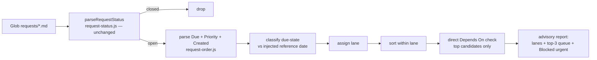

# Request Ordering Technical Spec

> **Intent**: [intent-request-ordering.md](./intent-request-ordering.md) — read before changing scope.
> **Origin**: /codex-brainstorm Nash equilibrium, 2026-08-31 (Claude Position A × Codex Position B,
> 3 rounds; both sides' round-0 designs — mutable `Urgency` token + `--triage` + DAG scheduler on one
> side, plain sort fix on the other — were rejected or absorbed into what follows).

## 1. Requirement Summary

- **Problem**: Under large multi-ticket tasks the model mis-orders work. Three measured causes:
  1. The single-axis `Priority` field conflates importance with time pressure (template defines
     P0 as "Critical / Immediate", P1 as "High / This week") and is inflated — 99 of 151 exact
     tokens are P1, so it carries almost no ordering signal.
  2. Consumers ignore even that signal: `skills/next-step/scripts/analyze.js` picks the first
     open request **in filename order** (oldest first, Priority never read) at two sites — the
     representative-request selection and the `request-stale` suggestion; Scan Mode sorts
     Priority-desc → oldest-first. Both surface stale important-not-urgent tickets first.
  3. Nothing prefers finishing started work: 79 of 97 open tickets are already started
     (39 In Progress + 40 Candidate Complete), and Candidate Complete closures — the cheapest
     completions — rank no higher than new work.
- **Goals**: separate importance (`Priority`) from time pressure (new creation-time `Due`
  field); rank open tickets by lane (emergency → closure → WIP → backlog); emit a compact
  advisory queue so the model loads one ticket body, not dozens.
- **Scope**: `create-request` template + creation prompt + Scan Mode; a new
  `scripts/lib/request-order.js`; the two `next-step` selection sites; one advisory dispatch
  line in CLAUDE.md (decided: CLAUDE.md, not `rules/` — it is dispatch advice, not a rule);
  tests. Out of scope: the Non-goals in the intent (no urgency token, no `--triage`, no DAG,
  no hooks, no migration).

## 2. Existing Code Analysis

| Artifact | Role here | Change |
|----------|-----------|--------|
| `scripts/lib/request-status.js` | Status parsing contract (`parseRequestStatus`, `CLOSED_REQUEST_STATUS`, `HEAD_LINES=30`, blockquote→heading→table precedence) | **None** (INV-001). `request-order.js` calls it, never extends it |
| `skills/create-request/references/template.md` | Ticket template; defines Priority with timeline words; `Depends On` header convention (single blockquote line, markdown links, sometimes prose/`·`-separated) | Add `Due` line; strip timelines from Priority table; external-referent clause |
| `skills/create-request/SKILL.md` | Creation prompt ("P0 (urgent)"); Scan Mode Phase 4 sort (status group → Priority desc → oldest); stale detection (Pending > 30 days → `[stale]`) | Reword prompt; replace Phase 4 ordering with lanes; add top-3 queue + Blocked urgent |
| `skills/next-step/scripts/analyze.js` | Two filename-order selection sites (representative request; `request-stale` target); never reads Priority | Both select via `request-order.js` lane order |
| `scripts/lib/fc-extractor.js` | Reads request metadata through `parseRequestStatus()` | None — untouched consumer, regression-covered |
| `test/skills/create-request-scan.test.js` | Pins scan behavior incl. AC classifier columns | Extend for lane report; existing pins unchanged |
| `CLAUDE.md` | Auto-Loop dispatch guidance surface (behavior layer) | Add one advisory line: urgent-and-ready first, then finish started work |
| Corpus facts (2026-08-31) | 158 tickets: 97 open / 61 closed; P0/P1/P2 = 7/99/45; 44 tickets carry `Depends On`; 6 open P0s of which 4 are > 30 days old (oldest 2026-03-21) | Drives the legacy-fallback and stale-P0 rules |

## 3. Technical Solution

### 3.1 Flow



### 3.2 Data Model — ticket metadata

New template line, placed after `> **Priority**:` (safely inside `HEAD_LINES` but invisible to
the Status regexes — additive, INV-001 holds):

```markdown
> **Priority**: P1
> **Due**: 2026-09-04        <!-- or exactly: none -->
```

- **`Due` contract**: the latest useful completion date known at authoring time — not an
  estimate, not a start date. Bare token: ISO `YYYY-MM-DD` or the literal `none`. `none` is the
  creation-prompt default. A date requires an external referent (release, incident, commitment,
  dependent team) named in Background (INV-006); a dated Due without one is an authoring smell
  for `/codex-review-doc`, not a parse error.
- **`Priority` redefinition (new tickets)**: importance only — P0 critical impact
  (safety/security/data-integrity/release viability), P1 high impact, P2 normal. Timeline
  wording is removed from the template. Historical tickets keep their old semantics untouched.
- **Immutability**: `Due` is written at creation and never changed by `--update`/`--update-all`
  (INV-002). A materially renegotiated deadline on an **open** ticket is a manual authoring
  decision: the author sets its Status to `Superseded` (an ordinary open-ticket status write,
  never an automated `--update` transition) and creates a successor carrying the new Due. This
  applies the **existing meaning** of `Superseded` — "this record is replaced by another" — to
  a new occasion (deadline renegotiation); no lifecycle value, closure semantics, or parser
  behavior changes. It is distinct from create-request Phase 4.5's reopening doctrine, which
  covers *closed* tickets via reference-only successors and stays unchanged.

### 3.3 API — `scripts/lib/request-order.js` (new)

Separate module by design: lifecycle and scheduling are different concerns, and the load-bearing
status parser keeps zero blast radius.

```js
parseRequestDue(source)      // → {state:'valid',date}|{state:'none'}|{state:'absent'}|{state:'invalid'}
                             //   four states, never throws — 'invalid' (malformed date) is flagged and
                             //   excluded from legacy fallback; only 'absent' means legacy-undated
parseRequestPriority(source) // → 'P0'|'P1'|'P2' by leading canonical token; else null
                             //   (annotated legacy values fall back to their leading token)
classifyDue(due, refDate)    // → overdue | due-today | due-soon(≤7d) | scheduled | undated
                             //   'invalid' Due classifies as undated (non-emergency) with an
                             //   'invalid-due' flag, and sorts after all dated states beside
                             //   'none'/'absent'; an annotated Due line (extra prose) is 'invalid'
assignLane(ticket, refDate)  // → emergency | candidate-complete | in-progress | pending | design
orderRequests(tickets, refDate) // → { lanes, queue: top-3 with reasons, blockedUrgent, labels }
```

`refDate` is always injected by the caller (skills pass today; tests pass fixtures) — the module
never reads the machine clock (INV-005).

### 3.4 Core Logic

**Lanes** (first match wins):

Rows are in **rank order**. Membership is decided by predicate, not top-down scan: lane 1 is
checked first; among lanes 2–5 a ticket joins the lane whose enumerated vocabulary names its
Status, and lane 4 is the residual for every open status no row enumerates — the lane set is
total over `isOpenRequestStatus()` by construction (openness is defined negatively in
`request-status.js`, so a future status nobody has thought of yet lands in lane 4, never on
the floor).

| # | Lane | Membership |
|---|------|------------|
| 1 | Emergency | `overdue` or `due-today`; or bare legacy `P0` with no Due whose age satisfies `refDate − Created ≤ 30` calendar days (day 30 inclusive) |
| 2 | Candidate Complete | Status `Candidate Complete` or `Nearly Complete` — closure-grade verification is the cheapest completion |
| 3 | In Progress | `In Progress` / `In Development` / `In Dev` |
| 4 | Pending (residual) | `Pending`, null/`unknown` Status, and **every other open status not enumerated by lanes 2, 3 or 5**; a value outside `OPEN_REQUEST_STATUS`'s observed vocabulary is additionally flagged `unknown-status` |
| 5 | Design | `Design` / `Proposed` / `Spec Complete` — pre-implementation |

**Within-lane sort**: Due ascending (`none`/absent last) → Priority (P0 > P1 > P2 > null) →
Created ascending → path (deterministic tie-break, INV-005).

**Legacy fallback** (INV-004): no P→urgency mapping — undated legacy P1/P2 are labelled
`legacy-undated` and sort by the normal keys. A bare legacy P0 older than 30 days is **not**
emergency: it stays in its status lane flagged `stale-P0 — confirm still emergency via a dated
successor, else it remains high-importance backlog`. Rationale: 4 of 6 open P0s are months old;
an unbounded compatibility rule would install permanent sirens above every real closure. Prose
inside annotated Priority values (`immediate`, …) is never parsed as a scheduling input.

**Preemption boundary**: `overdue`/`due-today` may preempt WIP (that is what the emergency lane
is); `due-soon` only warns — rendered as a `⏰ due-soon` marker on its normal-lane row, never a
lane change. Ordering never touches gate obligations (INV-003).

**Direct dependency check** (top queue candidates only, no recursion):

| `Depends On` state | Effect |
|--------------------|--------|
| Absent, an explicit no-dependency sentinel (`無` / `none`, optionally followed by commentary — the corpus's `無（…）` form), or every markdown-link target resolves to a closed ticket | ready |
| Any target resolves to an open ticket | blocked — skip in queue; if emergency-lane, add a `Blocked urgent` row naming the direct prerequisite and promote that prerequisite into the queue with reason `unblocks <ticket>` |
| Free-form prose without resolvable links, or an unresolvable/dead link | readiness `unknown` — skip in queue with the reason shown; never silently treated as ready |

Link resolution is contained: only normalized repo-relative `.md` paths that stay inside
`docs/features/*/requests/` are read; absolute paths, external URLs, `../` escapes beyond the
corpus, and non-markdown targets classify as `unknown` without being read.

**Report shape** (Scan Mode Phase 4 replacement, console-only, advisory):
lane-grouped tables (existing columns + `Due`, `Flags`), then `## Recommended next (top 3)` with
a one-line reason each, then `## Blocked urgent` when non-empty. The model then loads the full
body of the selected ticket only. `next-step` consumes `orderRequests()` for both selection
sites and reports at most the top entry per feature plus any blocked-urgent chain.

## 4. Risks and Dependencies

| Risk | Mitigation |
|------|------------|
| Due-date inflation replacing Priority inflation | `none` default in creation prompt; external-referent clause; doc review flags dated-Due-without-referent |
| Stale overdue tickets pinned in emergency lane | Deliberate: the clock cannot tell "more urgent now" from "obsolete" — overdue stays visible until a human/status decision (`Superseded`/`Completed`) resolves it; the queue prints the retriage question |
| Free-form `Depends On` misread as ready | Tri-state: unresolvable → `unknown`, never ready; corpus forms (`·`-separated multi-link, prose tails, `無`) pinned in tests |
| A consumer hand-parses Due elsewhere later | Single reader in `request-order.js`; SKILL.md names it as the only contract, mirroring the `parseRequestStatus()` pattern |
| Repo-wide Candidate Complete sweep becomes its own distraction | Ordering operates within the active task/feature scope first; the queue caps at 3; one failed closure attempt → report the blocker, don't loop |

Dependencies: none beyond node:test and the existing libs. No new runtime deps.

## 5. Work Breakdown

| # | Task | Layer | Est |
|---|------|-------|-----|
| 1 | `scripts/lib/request-order.js` + `test/scripts/lib/request-order.test.js` (parsers, due classification with injected dates, lanes, sort, dependency tri-state) | code | M |
| 2 | Template + creation prompt: `Due` line, Priority de-timelined, external-referent clause, `Due` immutability note in Phase 4.5 vicinity | behavior | S |
| 3 | Scan Mode Phase 4 rewrite: lane report + top-3 queue + Blocked urgent; extend `create-request-scan.test.js` | behavior + test | M |
| 4 | `next-step/scripts/analyze.js`: both selection sites via `orderRequests()`; update its tests | code | S |
| 5 | One-line dispatch guidance in CLAUDE.md § Auto-Loop vicinity ("urgent-and-ready first, then finish started work") — behavior layer, advisory | behavior | S |

Suggested ticket split (per request-granularity): #1 alone (code layer); #2+#3 (create-request
behavior layer); #4 (next-step); #5 rides with #2's review.

## 6. Testing Strategy

- **Unit** (`test/scripts/lib/request-order.test.js`): Due parsing four-state (ISO, `none`,
  malformed → `invalid`, absent, annotated); boundary dates (overdue/today/+7d) against
  injected refDate; every lane rule incl. fresh-P0 vs stale-P0 at the 30-day boundary, and
  three distinct vocabulary assertions — `Nearly Complete` → lane 2 (Candidate Complete),
  `Spec Complete` → lane 5 (Design), an unrecognized open status → lane 4 (Pending residual)
  with the `unknown-status` flag;
  sort determinism incl. path tie-break; dependency tri-state over real corpus forms incl. the
  `無（…）` sentinel and containment refusals.
- **Integration** (`create-request-scan.test.js` extension): the intent's acceptance-sketch
  fixture corpus end-to-end → lane report, top-3, Blocked urgent; existing AC-classifier and
  freeze pins untouched and green.
- **Regression**: full `request-status.js` suite passes with zero diff to that file; a fixture
  proving a `Due` line present in all three Status representations changes no Status parse.
- **Guard-path proof** (per `rules/testing.md` Guards row): the stale-P0 rule tested in both
  directions — a 29-day P0 enters emergency, a 31-day P0 does not, against the production
  `assignLane`.

## 7. Open Questions

1. Should `due-soon`'s warn-only window (7 calendar days) be configurable via
   `auto-loop-project.md`-style setting, or is a constant enough for v1? (Recommend: constant.)
2. Reversal trigger recorded from the debate: if triage audits later show honest deadlines are
   rare and external systems (incident/release calendars) drive urgency, revisit a
   session-scoped urgency overlay instead of persisted Due. Not v1.
