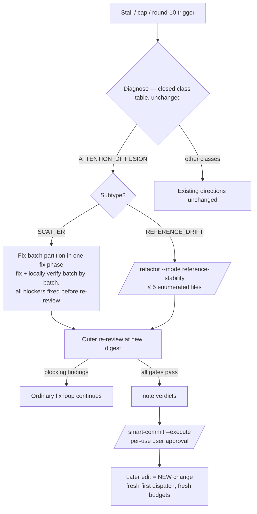

# Review Loop Recovery Technical Spec

> **Intent**: [intent-review-loop-recovery.md](./intent-review-loop-recovery.md) — read before changing scope.
> **Origin**: /codex-brainstorm Nash equilibrium, 2026-09-01 (checkpoint-commit + drift-refactor
> debate, 3 rounds; the pre-pass checkpoint and its `REVIEW_BASE_OID` machinery were deferred to
> v2, the commit-after-pass inversion adopted for v1).
> **Sibling**: [request-ordering](../request-ordering/2-tech-spec.md) picks the right next
> ticket; this feature recovers a single change whose review loop stopped converging.

## 1. Requirement Summary

- **Problem**: On oversized targets the fix→re-review loop can churn for many rounds — the
  "ant death spiral". Two fuels, both measured in this repo:
  1. **Reference drift** — maintained docs/comments cite exact line numbers. Snapshot
     2026-09-01, `grep -rnE '\.(js|sh|md):[0-9]+' rules/ skills/ CLAUDE.md docs/features/ | wc -l`:
     **574** matching lines (558 under `docs/features/`, 15 in `skills/`, 1 in CLAUDE.md, 0 in
     `rules/`). The aggregate over-counts the problem: most `docs/features/` hits sit in
     point-in-time records that INV-005 exempts — the motivating population is the maintained
     surfaces (`skills/`, CLAUDE.md, live specs), where semantic drift is already observed
     (e.g. a `skills/adr` pointer whose cited line now holds different code, the real target
     having moved to the following line). Every edit moves lines, each round re-flags stale
     pointers, each fix moves the digest and re-opens the gate.
  2. **Scatter** — findings spread across a wide surface; rounds close some while new ones
     surface elsewhere: the classic `ATTENTION_DIFFUSION` signature.
  Two structural hazards forbid the naive "commit first, then refactor" remedy: review
  dispatches take their patch from `git diff HEAD`, so a mid-task commit hides committed-but-
  unpassed work from fresh dispatches (thread rotation, fallback carriers); and the reminder
  formula in `scripts/review-state.js` is `owed = dirty && !passed`, so a clean tree silences
  an unpassed gate.
- **Goals**: name the two stall subtypes and their bounded adjustments; give `/refactor` a
  narrow reference-stability mode; fix the drift at its source with a durable-reference
  writing rule; define the safe banking sequence (adjustment → pass → note → approved commit).
- **Scope**: `skills/codex-code-review/references/loop-diagnostics.md` (subtype table +
  sequence), `skills/refactor/SKILL.md` (new mode), `rules/docs-writing.md` (§ Durable
  References), `rules/auto-loop.md` (one summary sentence), tests. Optional separate change:
  the narrow reminder hardening in `scripts/review-state.js`. Out of scope: the intent's
  Non-goals (pre-pass checkpoint, composable verdicts, `owed = !passed`, mass rewrite).

## 2. Existing Code Analysis

| Artifact | Relevant behavior (verified) | Change |
|----------|------------------------------|--------|
| `skills/codex-code-review/references/loop-diagnostics.md` | Closed class table; stall = 3 no-progress rounds; budgets 3 stall / 1 cap diagnoses; `/refactor` already a bounded adjustment for `DOC_TOO_LONG` + `ATTENTION_DIFFUSION` under five constraints (`--target` only, gate re-opens, internal check ≠ loop gate, security excluded, consumes the budget) | Add subtype table + the v1 recovery sequence |
| `skills/refactor/SKILL.md` | Flags today: `--target <path>`, `--auto`, `--max-targets N` (default 10); internal review rounds + precommit-fast; no reference-stability notion | Add `--mode reference-stability` contract |
| `skills/smart-commit/SKILL.md` | `--execute` (AskUserQuestion per-use approval — the Anchor #4 exception), `--scope <path>`, `--strict-preflight` all exist | None — consumed as-is |
| `rules/docs-writing.md` | Comment-block thresholds, locale rules; **no** guidance on positional references | Add § Durable References (Guidance tier) |
| `rules/auto-loop.md` § Stall Detection and Diagnosis | Resident summary that routes to loop-diagnostics.md | One sentence naming the subtypes |
| `scripts/review-state.js` | `owed = dirty && !passed` (the `check` derivation); pinned truth table includes clean/unnoted → not owed | Optional separate hardening (§ 3.5) |
| Review dispatch flow (`review-common.md`, `rules/codex-invocation.md`) | Prompts carry the frozen file list, the patch is `git diff HEAD`; dispatcher-synthesized `FOCUS` is forbidden | **None** — the `SCATTER` split is fix-side only (§ 3.2), so no prompt template or invocation-contract change; the commit-visibility gap is untouched in v1 (it is *why* commit follows pass; frozen base OID documented as v2) |

## 3. Technical Solution

### 3.1 Recovery flow



### 3.2 Stall subtypes (loop-diagnostics.md addition)

Adjustment *directions* under `ATTENTION_DIFFUSION` — not new diagnosis classes (INV-001):

| Subtype | Signal | Bounded adjustment |
|---------|--------|--------------------|
| `SCATTER` | Findings move across a wide file surface; fixes introduce new defects; rounds close some findings, expose others | One declared **fix-batch partition inside a single fix phase** (below). Same tier, review prompts untouched, central loop contract untouched (INV-003). The partition buys convergence probability, not a guarantee; persistent non-convergence follows the existing budgets to their human exits |
| `REFERENCE_DRIFT` | Persistent findings are stale positional references in maintained docs/comments | One reference-stability pass (§ 3.3), declared with targets and measured pointer counts |

**The `SCATTER` partition is fix-side, inside one fix phase — no intermediate re-review.**
It sequences the *orchestrator's fixing work*: partition the outstanding blocking findings
into coherent batches, fix batch A completely and verify it locally (targeted tests/lint on
its files), then batch B, and so on — and only when **every** known blocking finding is fixed
does the ordinary whole-change re-review run. This makes the existing "shrink the batch;
verify each item before merging" direction concrete while changing no central contract:
`review-common.md` § Review Loop's fix-all-blockers-before-re-review sequence and
`rules/fix-all-issues.md` hold as written, and every review dispatch still sees the whole
change (full `CHANGED_FILES`, full `git diff HEAD` patch). Nothing is injected into review
prompts either — `rules/codex-invocation.md` forbids dispatcher-synthesized `FOCUS`, and a
round-scoped focus field would be exactly that pattern. Local per-batch verification is
evidence for the orchestrator, never a review verdict (Fixing ≠ Verifying).

Either subtype consumes the existing diagnosis budget. Each has its own stall-memory
declaration form (batch membership is what must survive rotation/fallback for `SCATTER`):

```
stall adjustment: ATTENTION_DIFFUSION / SCATTER — batches: A=[files…], B=[files…] — active: A — outcome: …
stall adjustment: ATTENTION_DIFFUSION / REFERENCE_DRIFT — targets: <file — N refs, …> — size: K files, M replacements — outcome: …
```

### 3.3 `/refactor --mode reference-stability`

| Contract item | Rule |
|---------------|------|
| Targets | ≤ 5 explicitly enumerated files via repeated `--target` flags; never `--auto`; a directory only after resolving to ≤ 5 named files. A dedicated Phase 0 branch (checked first) bypasses the generic classification pipeline and its v2 type-skip |
| Eligible regions | In code and test files, only **prose comments and doc regions** are conversion candidates — executable strings, assertion expectations, fixtures, snapshots, generated content, ordinary data, and tool-consumed directives/pragmas (lint/type-checker directives, source-map metadata) are never touched. This is what makes skipping the behavioral gate sound |
| Unit | The *file* is the blast-radius unit: each target gets one complete pass over its eligible regions; per-file eligible-pointer count is measured and reported, not capped |
| Transformation | Homogeneous only: replace bare `path:line` pointers with `path § heading` (docs), `path` + symbol/function (code), `path` + named test case (tests), `path` + flag/config key (instruction surfaces). A numeric hint survives only as "around line N" paired with a semantic anchor — never the sole locator |
| Forbidden | Unrelated prose cleanup, restructuring, renaming, de-AI-flavor riding along; a file needing per-pointer factual reinterpretation is not a stabilization pass — reclassify (`DOC_TOO_LONG` / `UNVERIFIED_CLAIM`) or split by section |
| Exemptions | INV-005: records, review evidence, scope proofs, generated report formats keep exact lines |
| Gate | Edits re-open the plane; the mode's per-target reviews and local checks are evidence, never the outer terminal verdict (INV-004). The outer whole-change gate — including required precommit for code — remains owed |
| Handoff | Mode-specific: targets reported as *converted* with counts, outer whole-change gate stated as owed, **no commit suggestion** (the generic "committable + /smart-commit" handoff is for generic refactors only) |
| Recovery point | For a pass the user deems risky, the model may *suggest* they create a stash or WIP branch themselves — advisory prose, never an executed step (INV-006) |

Tier note (implemented in loop-diagnostics' preamble): the new section's four direct Register
hits (Fixing ≠ Verifying → #5; whole-change re-review after edits → #6; the
`/smart-commit --execute` route and the no-mutating-git prohibition → #4) resolve to Anchor at
step 0; the subtype choice, signals, budgets and bounded directions stay Default. The section
is declared as new content, not relocated prose — its tiers are assigned, not inherited.

### 3.4 Banking sequence and change boundary

The v1 sequence is INV-002, verbatim in loop-diagnostics.md: adjustment → **outer gate pass at
the post-adjustment digest** (for code: review Ready **and** required precommit PASS; for
docs: Mergeable) → note → `/smart-commit --execute` with its normal full plan and per-use
approval — no checkpoint-specific wording, no relaxed preflight. Committing the passed digest
does not re-open gates (existing contract). Boundary anti-laundering: a commit alone never
defines a new change; the boundary is pass → note → commit → *later edit*; feature-wide AC
trace and branch/PR integration review are untouched by increment boundaries.

### 3.5 Durable References (docs-writing.md) and optional hardening

New § after Code Comments, Guidance tier: maintained docs and comments identify material by
semantic anchors (path + heading / symbol / named test / flag); exact line numbers are
point-in-time evidence belonging to review findings, diagnostics, generated reports, and
records; numeric hints are explicitly approximate and always paired with an anchor. Existing
references convert on substantive edit or via a declared stabilization pass — never a mass
rewrite.

Optional separate change (own review, not part of this feature's gates):
`owed = (dirty && !passed) || (!dirty && noted && digest_match && verdict === "fail")` — the
clean-tree message must say a failed verdict still applies, not that changes are uncommitted.
`owed = !passed` stays rejected (clean fresh checkouts would owe all gates forever, against
the pinned truth table).

## 4. Risks and Dependencies

| Risk | Mitigation |
|------|------------|
| v1 loses the pre-refactor recovery point the user's commit-first idea provided | Accepted tradeoff, stated in loop-diagnostics: the pass is bounded to ≤ 5 files and one mechanical transformation; a pass too risky for that bound is too broad for this adjustment. The advisory stash suggestion covers the residual |
| "Pass" misread as `/refactor`'s internal pass | Spelled out in both the mode contract and the sequence: outer task gate at the post-adjustment digest |
| Semantic anchors drift too | Headings/symbols drift far less and stay greppable; the pairing rule (anchor + approximate hint) degrades gracefully |
| Stabilization pass itself stalls review | It is an ordinary change under the ordinary loop; a second failed adjustment on the same change follows existing stall-memory rules (never retry a failed adjustment) |
| Budget laundering via micro-increments | § 3.4 boundary rule + untouched feature-wide obligations |

Dependencies: none new; consumes `/smart-commit` and `/refactor` as they exist.

## 5. Work Breakdown

| # | Task | Layer | Est |
|---|------|-------|-----|
| 1 | loop-diagnostics.md: subtype table + fix-side batch rule + v1 sequence + declaration form; auto-loop.md summary sentence | behavior | S |
| 2 | refactor SKILL.md: `--mode reference-stability` contract (§ 3.3) | behavior | M |
| 3 | docs-writing.md § Durable References | behavior | S |
| 4 | Tests: `test/rules/` or `test/skills/` pins for the new sections (see § 6) | test | S |
| 5 | (Separate change, optional) review-state.js hardening + truth-table test rows | code | S |

Ticket split: #1+#3+#4 (behavior + pins); #2 (refactor mode); #5 rides alone when wanted.

## 6. Testing Strategy

- **Behavior pins** (extend the existing rules/skills test pattern): the subtype table names
  exactly `SCATTER` and `REFERENCE_DRIFT` under `ATTENTION_DIFFUSION` and no new top-level
  class; the `SCATTER` text states the split is fix-side and review prompts carry no focus
  field (guarding the codex-invocation boundary); the sequence text contains the
  pass-before-commit ordering; the refactor mode section carries the ≤ 5-file bound, the
  `--auto` prohibition, and the exemption list; docs-writing contains the Durable References
  heading with the record-class exemption.
- **Guard-path proof** (per `rules/testing.md` Guards row): for the docs-writing rule, a
  representative forbidden form (a bare `path:123` as sole locator in a maintained-doc
  example) and the same string as ordinary data in a record-class example — the exemption must
  pass what the rule must flag.
- **If #5 ships**: truth-table rows for the hardening — clean+noted+digest-match+fail → owed
  with the failed-verdict message; clean+unnoted → not owed (unchanged); dirty rows unchanged.

## 7. Open Questions

1. **Decided**: the v1 entry point is `/refactor --mode reference-stability` — one skill, one
   internal switch, no new dispatcher surface. A distinct `/refactor-refs` command was
   considered and rejected (it would duplicate dispatch surface, docs and tests for the same
   contract); revisit only if the mode's flag plumbing proves unworkable in implementation.
2. v2 prerequisites, documented not enabled: frozen inclusive `REVIEW_BASE_OID` carried by
   every dispatch/rotation/fallback; scoped/composable gate coverage; only then a pre-pass
   checkpoint. Reversal trigger: if bounded stabilization passes repeatedly prove too risky
   without a machine recovery point, that is the evidence v2 waits for.
