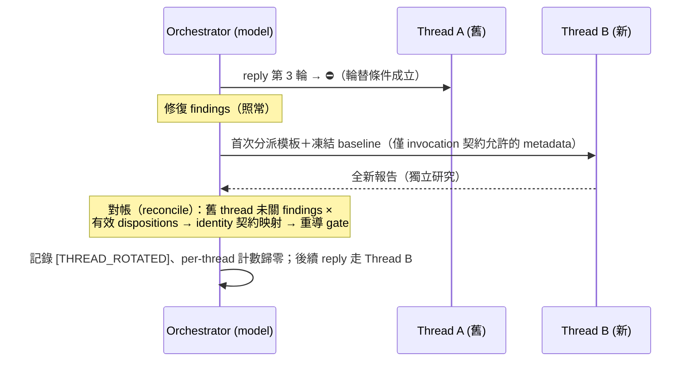

# Tech Spec: Review Loop Resilience

> **Requirements**: [1-requirements](./1-requirements.md)
> **Created**: 2026-08-23 · **Updated**: 2026-08-23
> **Status**: Implemented (2026-08-23 — r1–r4 落地；驗證見 requests/*-r4.md Progress)

## 1. Requirement Summary

| Item | Content |
|------|---------|
| Problem | (a) Review thread 經 3–4 輪 reply 後上下文過長，reviewer 性能衰退但 loop 無感知；(b) Codex 不可用時 loop 停在 `⚠️ Need Human`，內建 reviewer 只能 advisory |
| Goal 1 | Thread 輪替：達輪數門檻或上下文過長 → 新 thread，延續凍結 baseline，dispositions 後置對帳 |
| Goal 2 | Fallback 等效化：Codex 不可用 → 內建 reviewer 以**該 family 自身契約**承載 gate，機制一致 |
| Scope IN | rules（`auto-loop.md`、`codex-invocation.md`）、`CLAUDE.md`（root＋`.claude/`）、`review-common.md`、`codex-code-review/SKILL.md`、family 消費點（§5 T5 清單表——續審模板**與首次分派/不可用分支**）＋受影響 skills 的 `allowed-tools`、新 agent `agents/contract-neutral-reviewer.md`、sentinel validator＋dispatch 決策模組（新 scripts＋harness）、pin 測試同步 |
| Scope OUT | reminder hooks 以外的 hooks、`scripts/review-state.js`（零變更）、`--dual` 的 opt-in／平行分派／成功聚合語意（其 Codex-❌ degradation 列**被取代**，見 §3.2）、**necessity-audit 的輪替與 fallback（v1 皆排除，見 §3.2）**、`seek-verdict` gate 化、`precommit` plane |

適用範圍矩陣（gate × state plane × verdict × fallback 適用性）見 [1-requirements.md §2](./1-requirements.md)。

## 2. Existing Code Analysis

| Surface | 現況 | 與需求的落差 |
|---------|------|------------|
| `rules/auto-loop.md` § Review Dispatch | 「Codex unavailable is not a fallback — it is `⚠️ Need Human`」；內建 reviewer「advisory findings, never a gate verdict」 | 政策反向：fallback 需承載 gate |
| `CLAUDE.md`（root＋`.claude/`）§ Auto-Loop | 「One reviewer — Codex — by default」 | 需補 fallback 的 gate 承載敘述 |
| `review-common.md` § Degradation Matrix（:223-232，屬 § Dual Reviewer Aggregation） | Codex ❌ 兩列 → `⛔ Blocked` + Need Human，`gate_source=none` | 改為 fallback 承載；`--dual` 的聚合語意保留，僅此兩列被取代 |
| `review-common.md` § Review Loop（:60-69、:246-255） | `--continue <threadId>` 同 thread 無限續審，無輪替條件 | 需加輪替條款（中央契約） |
| `codex-code-review/SKILL.md` :202-204 | 單 reviewer 時「nothing to degrade to … do not silently substitute a subagent」 | 需改寫為 fallback 分派 |
| `codex-code-review/SKILL.md` :146-151 | secondary priority table＋Task prompt（frozen SCOPE_BASELINE＋獨立驗證指令） | **僅 code family 可重用**；`strict-reviewer.md:21-35、:69-71` 原生 code 契約，跨 family 會偽造 verdict |
| Family 消費點——**續審模板** | doc：`review-loop-doc.md`；plan：`review-loop-plan.md`；test：`test-review/SKILL.md:52-58、:168-174`＋`codex-prompt-test-review.md:97-116`＋`codex-prompt-ac-trace.md:91-109`（necessity-audit v1 兩機制皆排除，其 loop ref 不動） | 各處加指向中央契約的輪替條款 |
| Family 消費點——**首次分派/不可用分支**（與新政策直接衝突的活條款） | `plan-review/SKILL.md:130-140`（nothing to degrade to → `[PLAN_REVIEW_DEGRADED]`）；`test-review/SKILL.md:92-104`（AC-trace Codex 不可用 → Claude-only inconclusive）；`doc-review/SKILL.md` 分派節；`codex-code-review/SKILL.md:202-204` | 不改就會與新 fallback 規則並存打架——全部納入 T5 清單表 |
| 受影響 skills 的 `allowed-tools` | `plan-review`：已有 `Task`＋`Bash(node:*)`；`doc-review`：兩者皆無（:69 記載刻意省略 node 的理由段）；`test-review`：兩者皆無；`necessity-audit`：v1 輪替與 fallback 皆排除——**不需任何檔案或 frontmatter 變更** | `doc-review`、`test-review` 需 frontmatter 增補 |
| `rules/codex-invocation.md` § Loop review exception | reply 可帶 diff（同 thread 已有 context） | 限縮於**同 thread** reply；輪替後新 thread 首輪回到首次分派契約 |
| `scripts/review-state.js` | `note <plane> pass\|fail`；`rounds` fail 遞增、pass 歸零；**不含 threadId、跨 thread 累計** | **零變更**——`rounds` 只作整 change 簿記，不能當 per-thread 輪替底線 |
| Auto-loop reminder hooks | **三支 state-aware**（`stop-guard.sh`、`user-prompt-review-guard.sh`、`post-compact-auto-loop.sh`）讀 state slot 印提醒；**一支靜態**（`post-skill-auto-loop.sh`——棄置 stdin、不呼叫 `review-state.js`、印無條件固定提醒） | **四支皆零變更**：state-aware 三支對 reviewer 身分與 threadId 無感知；靜態一支與 verdict 無關。`pre-edit-guard.sh`（守衛，exit 2）與 `post-edit-format.sh` 非提醒層，不動 |
| `agents/*` frontmatter pin（`test/agents/frontmatter.test.js`） | 只覆蓋**本 repo `agents/*.md`**（如 `strict-reviewer`）；`general-purpose`（harness 內建）與 `pr-review-toolkit:code-reviewer`（外掛）**不在 pin 範圍** | Depth 保證缺口——見 §3.2 新 agent |
| Pin 測試 | `auto-loop-behaviour.test.js` pin stall/cap；`discretion-tiers.test.js` byte-pin § Efficacy Boundary（與本案無關） | § Review Dispatch unavailable 句未被 pin；仍須全跑 `npm test` |

## 3. Technical Solution

### 3.1 Thread 輪替（rotation）

**輪替條件**（任一成立即輪替，於下一次 re-review 生效）：

| # | 條件 | 量測 | Tier |
|---|------|------|------|
| R-a | 同 thread reply 續審已達 **3 輪**（第 4 次分派起換新 thread） | **行為層 per-thread 計數**：orchestrator 在對話中自數，開新 thread 歸零；`[THREAD_ROTATED]` 行即計數錨點。`review-state.js` 的 `rounds` **不參與**（無 threadId、跨 thread 累計） | Default（門檻可覆寫，§3.5） |
| R-b | 判斷上下文過長（提前輪替） | 模型判斷：batch bytes 超出 `resolve-review-profile.js` budget、報告出現不可比對／退化跡象 | Default——判斷即敘明 |

**輪替程序**（中央契約，寫入 `review-common.md` § Review Loop，各 family 消費點指向）：



- 新 thread 首輪 = **首次分派**：該 family 第一輪模板＋`codex-invocation.md` 完整獨立研究契約；凍結 scope baseline（檔案清單）隨 prompt 進入——invocation 本已允許的 metadata，不需規則例外
- Dispositions（含 issue 文字、非中性）與舊 thread 未關 findings **不進 prompt**；新報告後在 orchestration 側對帳（identity 契約：file＋canonical issue）、依 `scope-discipline.md` § Gate Derivation 重導 gate
- 輪替單位是 **batch 的 thread**（one-thread-per-batch 不變）；stall streak 與 cap 計數不因輪替重置
- 記錄：`[THREAD_ROTATED] plane=<plane> old=<threadId> new=<threadId> reason=<rounds|context> | <ISO8601>`

### 3.2 Fallback 等效化

**偵測與黏著**：每個 **change 的第一次分派**先探測 Codex（直接呼叫，失敗即偵測）；失敗（quota、網路、MCP 不可達、逾時）→ 為**這個 change** 選定 fallback、記錄 `[REVIEWER_FALLBACK]`，同 change 的 re-review 不再探測；下個 change 重新從 Codex 試起。

**分派（contract-aware）**——決策由 `scripts/lib/review-dispatch.js`（§3.2.1）給出：

| Contract | Priority 2 | Priority 3 | 契約載體與 depth 保證 |
|----------|-----------|-----------|---------------------|
| `code` | `strict-reviewer`（Task；**repo 自有，frontmatter pin 覆蓋**） | `pr-review-toolkit:code-reviewer`（Task；外掛 agent，pin 不覆蓋——分派時於 call-site 明示要求 opus/high，best-effort） | 原生 code 契約＋該 variant 模板（含 frozen baseline） |
| `doc`／`plan`／`test:coverage`／`test:ac-trace` | **`contract-neutral-reviewer`**（新 repo agent，見下）＋governing prompt＝該 contract 完整首輪模板原文 | 同左重試一次（新 agent instance） | 模板自帶 output format 與終態；agent frontmatter `model: opus`、`effort: high` 進 `frontmatter.test.js` pin 範圍 |
| `necessity` | **v1 排除**——Codex 辯論（`Skill("codex-brainstorm")`、非空 debate threadId、確定性 consolidation、redaction，`necessity-audit/SKILL.md:11-21,101-158`）是**構成性機制**，非單一 reviewer 模板可替代；sentinel-only 驗證擋不住偽造 audit | — | Codex 不可用 → 維持其**既有** degradation 行為；**輪替亦於 v1 排除**——中央輪替程序要求以「該 family 首輪模板」fresh dispatch，necessity 無此單一模板（首輪即構成性 pipeline），輪替適配器留 v2 |
| （全部耗盡） | — | — | Priority 4，見下 |

**新 agent**：`agents/contract-neutral-reviewer.md`——frontmatter `model: opus`、`effort: high`（自動落入 `frontmatter.test.js` pin）；body 極薄：「依所附模板全文執行 review，模板的 output format 與終態即你的契約；獨立研究、不接受結論餵入」。解掉 depth 保證缺口（`general-purpose` 與外掛 agent 都不受本 repo pin 管轄）。

**Priority 4（該 contract 全部載體耗盡）——不偽造任何 sentinel**：不存在通過驗證的 verdict（載體可能跑過，但沒有任何報告通過家族契約驗證）；gate 保持 open，浮出行為層 `⚠️ Need Human`；family 自有 reviewer-不可用降級形式者用自家的——plan **只發** `[PLAN_REVIEW_DEGRADED]`（`plan-review/SKILL.md:175-176` 現行語意；`⚠️ Plan Needs Human` 保留給 round-cap（:149），兩者絕不並存，terminal marker 恰好一個（:202））；其餘不發任何 gate sentinel。逐 family 分別測試。

**Fail-closed 契約驗證**（機械強制點）：fallback 報告被採認（或 note）前必須通過 `scripts/validate-family-sentinel.js <contract>`（stdin 收報告、exit 0/1）。**驗證對象是分派載體的 raw 報告**；家族若另有 raw→公開 sentinel 的推導（ac-trace），推導後的公開形式由既有 skill 條款產生、契約測試斷言映射：

| Contract | Raw 報告合法終態（恰好一個） | 必拒（例） |
|----------|---------------------------|-----------|
| `code` | `✅ Ready` ／ `⛔ Blocked` | `✅ Mergeable`、`gate: Adequate` |
| `doc` | `✅ Mergeable` ／ `⛔ Needs revision` | `✅ Ready`、`⛔ Blocked` |
| `plan` | `✅ Plan Ready` ／ `⛔ Plan Blocked`（**僅 producer 授權終端**；`⚠️ Plan Needs Human`（round-cap，owning skill）、`[PLAN_REVIEW_DEGRADED]`（P4／secret，dispatcher）、`[PLAN_REVIEW_SKIPPED]`（使用者明示）為 orchestration-owned——仍計入出現次數與跨家族偵測，但 carrier 報告在**未引用散文中任何位置**攜帶其一即拒（owning skill 讀機器標記先於判定記號；fence／blockquote／inline code 先遮罩為資料）） | 裸 `✅ Ready`／`⛔ Blocked`（:193 明文禁止）；兩降級 marker 並存；`✅ Plan Ready` 旁中段夾帶 `status: [PLAN_REVIEW_DEGRADED]` |
| `test:coverage` | `✅ Tests sufficient` ／ `⛔ Tests need supplementation` ／ 既有同契約別名 `✅ Sufficient`／`⛔ Needs additions`（**別名聯集**：四形式歸一 pass/fail 語意，每報告恰好一個終態；不做破壞性正典化——requirements non-goal 保 sentinels 不變） | `gate: Adequate*`（ac-trace raw 終態） |
| `test:ac-trace` | raw：`gate: Adequate` ／ `Adequate_with_exceptions` ／ `Need_Human` ／ `Inadequate`；公開層由 skill 既有推導產生 `✅ Adequate`／`⚠️ Adequate with exceptions`／`⚠️ Need Human`／`⛔ Inadequate`（`test-review/SKILL.md:117-126`），映射由契約測試斷言 | `✅ Tests sufficient`（coverage 終態） |

驗證失敗＝該載體此次分派失敗 → 下一 priority 或 Priority 4；**絕不**跨契約翻譯終態。

**Raw 形狀強制**（round-12 增補）：終態不只要「是哪個字串」，還要「在模板規定的位置」——中段或加標題的判定行是模板禁止的散文，採認它等於讓非判定文字關閘。per-family `shape` 由 `checkShape()` 在出現次數／orchestration 檢查之後強制：`doc`／`test:coverage` 終端須裸置於最後一個非空白行（不得加 heading／bold／尾隨文字）；`test:ac-trace` 最後一行須為未加 bullet 的 `gate: <enum>`（偵測用 regex 保持寬鬆以維持跨家族辨識）；`plan` 裸判定行前最近的非空白行須恰為 `## Plan Review`（可隔空白行）；`code` 刻意無形狀約束（其模板允許 `## Gate` 區段＋gate_reason＋尾隨文字）。形狀檢查對 **CRLF 正規化後的原始報告**逐行精確比對（round-13：不得對去引用散文檢查——判定行之後的 fence／blockquote／縮排內容會被剝除而讓判定偽裝成末行；不修剪尾隨空白，僅跳過真正的空行）。

**工具權限增補**（隨 T5 落地並入測試）：`doc-review` +`Task`+`Bash(node:*)`（同步改寫其 :69「刻意省略 node」段）；`test-review` +`Task`+`Bash(node:*)`。`plan-review` 已具備；`necessity-audit` v1 排除後不需增補。

#### 3.2.1 Dispatch 決策模組（新）

`scripts/lib/review-dispatch.js`——純函式決策表，skills 以 `node` 呼叫、harness 直接單測：

```
decide(state) → action
state  = { contract, probe: codex_ok|codex_fail, sticky: none|fallback, priority, validatorResult, threadRounds, threshold }
action = { kind: dispatch|rotate|terminal, target?, degradedForm?, noteEligible: bool }
```

涵蓋：探測失敗→P2；fallback 路徑 validator 失敗→下一 priority（Codex 健康路徑的 `validatorResult:'fail'` 不推進鏈——仍是 P1 re-dispatch Codex，僅 `noteEligible=false`）；耗盡→per-contract terminal（`noteEligible=false`）；黏著；`threadRounds ≥ threshold`→rotate（`contract=necessity` 不觸發 rotate；rotate 僅裁 R-a——R-b 是行為層先判的脈絡品質判斷，state 無此欄位）；`contract=necessity` 且 `probe=codex_fail`→`kind=terminal`＋既有 degradation 指示。零依賴、無 I/O。

**關係不變量（矛盾態一律 throw，不靜默正規化）**：(a) `probe=codex_ok` 且 `sticky≠fallback` 而 `priority>1`——健康路徑不存在 fallback 位置；(b) `necessity` 且 `priority>1`——無載體可指；(c) fallback 路徑（`probe=codex_fail` 或 `sticky=fallback`）且 `priority=1`（含預設）而 `validatorResult` 非 null——P1 尚無任何載體報告存在，`'pass'` 會為沒人產出的報告偽造 noteEligible，`'fail'` 會跳過必經的 P2 分派（round-12）。另有兩個邊界 throw 同屬 fail-closed 面：(d) `priority` 超出該契約載體範圍（`1 + 載體數 + 1` 的耗盡步之後）——幽靈 priority 不得索引載體表尾外（`review-dispatch.js` assertState）；(e) fallback 路徑 `validatorResult:'pass'` 落在耗盡區間——先 bounds-check 再索引，不存在的載體不得被 note-enable（decide() pass 分支）。

- **Verdict 等效**：state-plane family 照常 `note <plane> pass|fail`；`gate_source=fallback:<agent>`（取代 `none`）
- **Loop under fallback**：agents 無狀態 → 每輪 fresh dispatch，輪替自動滿足；re-review＝新分派＋後置對帳；cycle reset、edit 重開 gate、Register #3 升級照舊
- **記錄**：`[REVIEWER_FALLBACK] plane=<plane> from=codex to=<agent> reason=<quota|timeout|error> | <ISO8601>`
- **`seek-verdict` 除外**：維持非 gate；Codex 不可用時自動 dismiss 路徑關閉，P2/Nit 一律人工確認

### 3.3 規則與文件變更（回答「要改 claude.md & rules and hooks 嗎」）

| Surface | 改？ | 變更內容 |
|---------|------|---------|
| `rules/auto-loop.md` § Review Dispatch | ✅ | 改寫 unavailable 段：contract-aware fallback、黏著、fail-closed 驗證、per-contract Priority 4、necessity 排除、`[REVIEWER_FALLBACK]`；補輪替條款指向 `review-common.md`（指標以完整路徑 `skills/codex-code-review/references/review-common.md` 書寫——2026-08-23 doc review 補正，並由契約測試 pin） |
| `rules/codex-invocation.md` | ✅ | Loop exception 限縮同 thread；輪替後首輪回完整契約 |
| `CLAUDE.md`（root）＋`.claude/CLAUDE.md` | ✅ | 「One reviewer — Codex」句補 fallback 敘述（一行），兩檔同步 |
| `review-common.md` | ✅ | Degradation Matrix 兩列改寫（聚合語意保留）＋`gate_source=fallback:*`＋per-family 載體優先序表（中央權威，對應 `review-dispatch.js` `FALLBACK_CARRIERS`）；§ Review Loop 輪替條款；§ Source Attribution 加 `fallback`；`--dual` 權威句限定 Codex-healthy 路徑，無 `--dual` 的 loop 改寫為 continue／rotate／fallback 三條可執行路徑 |
| `codex-code-review/SKILL.md` | ✅ | :202-204 改寫；code priority table（strict-reviewer 先）；Step 3 分支＋validator/dispatch 步驟 |
| Family 消費點（T5 清單表：續審模板＋首次分派/不可用分支）＋2 skill frontmatter | ✅ | 指向條款——各 family 契約**不變，唯一例外**是 test:coverage 別名聯集條款（語意保持，非正典化）；`plan-review/SKILL.md:130-140` 與 `test-review/SKILL.md:92-104` 等活分支改接新政策；frontmatter 增補（doc/test） |
| `agents/contract-neutral-reviewer.md` | ✅（新） | 薄身、pinned frontmatter（自動入 `frontmatter.test.js`） |
| `scripts/validate-family-sentinel.js`＋`scripts/lib/review-dispatch.js` | ✅（新） | Per-contract 終態表（raw 層）＋決策表；各配 harness |
| `rules/auto-loop.md` § Override Contract＋scaffold | ✅（小） | 新 setting `## Review Thread Rotation`（2–6，預設 3） |
| Hooks（全部）／`review-state.js` | ❌ | §3.4；`rounds` 維持整 change 簿記 |
| `agents/strict-reviewer.md` | ✅（小） | 增「attached template wins」從屬條款：作為 fallback 載體執行 family 模板時，模板的 output format／scope 欄位／tier blocking／`gate_reason` 推導優先於自身固定 gate 規則——刻意的 producer 契約變更（2026-08-23） |
| Pin/行為測試 | ✅ | 同步 `auto-loop-behaviour.test.js`；新增測試（§6） |

### 3.4 Hooks 邊界

零變更範圍＝**四支 auto-loop reminder hooks**，其中**三支 state-aware**（`stop-guard.sh`、`user-prompt-review-guard.sh`、`post-compact-auto-loop.sh`——讀 state slot 印提醒，reviewer 身分與 threadId 不可見）、**一支靜態**（`post-skill-auto-loop.sh`——棄置 stdin、不讀 state、印無條件固定提醒，與 verdict 無涉）。`pre-edit-guard.sh`（路徑守衛，exit 2 阻擋）與 `post-edit-format.sh`（格式化）非提醒層，同樣不動。

### 3.5 設定面

`auto-loop-project.md` 新 setting（Default tier，進 Override Contract heading 表）：

```markdown
## Review Thread Rotation
<!-- 輪數門檻（2–6，預設 3）；unset = 3 -->
```

Fallback 無設定開關：等效化是政策，不是 per-project 選項。

## 4. Risks & Dependencies

| # | Risk | Mitigation |
|---|------|-----------|
| R1 | **獨立性弱化**：內建 reviewer 與作者同為 Claude | 強制獨立研究＋evidence check；`[REVIEWER_FALLBACK]` 可稽核；`seek-verdict` 自動 dismiss 關閉；quota 恢復後 `/codex-review-branch` 以 Codex 深度複審 |
| R2 | **跨契約污染** | Contract-aware 分派＋raw-層 validator fail-closed＋禁譯條款＋per-contract Priority 4 |
| R3 | **Depth 缺口**：非 repo agents 不受 pin | 新 `contract-neutral-reviewer`（pinned）為非 code 主載體；code P2 用 repo 自有 `strict-reviewer`；外掛 agent 降為 P3＋call-site 明示 |
| R4 | **Pin 測試破裂** | 改前 grep pin、同 change 同步；`npm test` 全綠 |
| R5 | **63 檔漂移**＋活分支打架 | 中央契約唯一落點；T5 清單表含首次分派/不可用分支；Signal 6 grep |
| R6 | **對帳錯誤** | identity 契約；映射失敗 fail-closed 回 gate |
| R7 | **Quota flapping** | Per-change 黏著 |
| R8 | 決策模組與行為層脫節 | 分派步驟具名引用模組輸出；契約測試斷言步驟存在 |

Dependencies：兩支零依賴 Node scripts＋一個薄 agent 檔；其餘為 `.md` 契約與測試。

## 5. Work Breakdown

| # | Task | 產出 | 依賴 |
|---|------|------|------|
| T1 | 中央契約：`review-common.md` 輪替條款＋Matrix 改寫＋`gate_source=fallback:*` | review-common.md diff | — |
| T2 | `validate-family-sentinel.js`（raw 層終態表，含 coverage 別名聯集與 ac-trace raw/公開兩層斷言）＋`review-dispatch.js`＋`agents/contract-neutral-reviewer.md`＋harness | 2 scripts＋1 agent＋test 檔 | — |
| T3 | 規則層：`auto-loop.md`（Dispatch＋Override Contract）；`codex-invocation.md`；scaffold heading | 3 檔 diff | T1 |
| T4 | `CLAUDE.md` root＋`.claude/` 同步一行 | 2 檔 diff | T3 |
| T5 | Family 消費點清單表：**續審模板**（`review-loop-doc.md`、`review-loop-plan.md`、`test-review/SKILL.md:52-58,:168-174`、`codex-prompt-test-review.md`、`codex-prompt-ac-trace.md`）＋**首次分派/不可用分支**（`plan-review/SKILL.md:130-140`、`test-review/SKILL.md:92-104`、`doc-review/SKILL.md` 分派節）＋frontmatter 增補與 `doc-review` :69 段改寫＋coverage 別名聯集條款（necessity-audit v1 輪替與 fallback 皆排除，其檔案不動） | 7 檔 diff | T1、T2 |
| T6 | `codex-code-review/SKILL.md`：:202-204 改寫、priority 重排、Step 3 分支＋validator/dispatch 步驟 | SKILL.md diff | T1、T2 |
| T7 | 測試：同步 `auto-loop-behaviour.test.js`；新增 `test/rules/review-loop-resilience.test.js` | test diff | T1–T6 |
| T8 | Request tickets（AC ≤ 8）＋Doc Sync＋失效注入驗證——v1 實際證據為**整合層模擬**（`decide()` 決策序列＋validator 探針＋live 載體分派）；原規劃的可重現手動 E2E 程序（真實 MCP 斷線，`/feature-verify` 執行）**deferred，未執行**，程序文字保留於 r4 | requests/*.md | T1–T7 |

## 6. Testing Strategy

三層：可執行碼走 fixture harness；規則與 skill 文件走契約斷言；失效注入在 v1 以整合層模擬覆蓋（真實 MCP 斷線的手動 E2E 為 deferred）。

| Test | 斷言 | 類型 |
|------|------|------|
| `test/scripts/validate-family-sentinel.test.js`（T2） | 各 contract：合法 raw 終態 → 0；跨契約終態 → 1；雙終態 → 1；缺／空／malformed → 1；coverage 四別名各自過、混用拒；plan 兩降級 marker 並存拒；plan orchestration-owned 三標記（含 `[PLAN_REVIEW_SKIPPED]`）單獨或中段夾帶皆拒、引號／fence 內為資料；形狀強制（headed／非末行／bulleted／缺 `## Plan Review` 判別行 → 1，模板形狀 → 0）；引文同詞不誤判（反向 guard 雙向同 commit） | Unit |
| `test/scripts/lib/review-dispatch.test.js`（T2） | 序列 harness：codex_fail→P2；fallback 路徑 validator 失敗→P3（健康路徑 fail 留 P1）；矛盾態／邊界 throw（不變量 a–c＋幽靈 priority＋耗盡區間 pass）；通過→`noteEligible=true`；耗盡→per-contract terminal（plan=`[PLAN_REVIEW_DEGRADED]`、其餘無 sentinel、`noteEligible=false`）；necessity＋codex_fail→既有 degradation、necessity 永不 rotate；sticky 不再探測；rotate 門檻；逐 contract 覆蓋 | Unit harness（Signal 3/NFR-1 決策層模擬） |
| `test/rules/review-loop-resilience.test.js`（T7） | `auto-loop.md` 無「never a gate verdict」原句、含新政策關鍵句；`review-common.md` Matrix 改寫＋輪替條款＋`[THREAD_ROTATED]`；`codex-invocation.md` 同 thread 限縮；T5 清單表各處含指向條款、活分支（plan :130-140、test :92-104）已接新政策；2 skill frontmatter 含增補；ac-trace raw→公開映射句存在；per-family Priority 4 不含偽造 sentinel | 契約（雙向同 commit） |
| 既有 `auto-loop-behaviour.test.js`／`doc-review` 測試／`frontmatter.test.js` | 受影響斷言同步；one-thread-per-batch 仍在；新 agent 自動入 pin | 回歸 |

**邊界誠實聲明**：harness 覆蓋**決策層**模擬（分派、黏著、輪替、終線、note 資格）；真實 MCP 失效無法在 node:test 注入。v1 實際 evidence＝「決策 harness（type 1）＋整合層失效注入模擬（live 載體分派＋validator 探針，L3，記於 r4 Progress.Note）」——**不含** type-2 手動 E2E：原規劃的 `/feature-verify` 真實斷線程序 deferred 未執行，不宣稱該證據存在；亦不宣稱單元測試等於端到端。Security/data-integrity AC：無（按 `standard`；review 中若被判定升級，依 Register #3 走 `thorough`）。

## 7. Open Questions

- [ ] R-b「上下文過長」是否需要量化指標（bytes 門檻）進中央契約？（v1 維持 Default 判斷＋敘明；量化留待實測）
- [ ] Gate-bearing 無 state plane 的 family fallback verdict 持久記錄是否補強？（v1 維持對話＋報告）
- [ ] `codex-plugin-fallback` 的 L4 是否併入 code priority table？（advisory 時代設計，需對齊後另議；v1 不納入）
- [ ] necessity-audit 的 fallback 與輪替（v2）：非 Codex 辯論源可否構成等效 audit？構成性 pipeline 的輪替適配器如何重跑並保留凍結 metadata？需連動其 SKILL、evidence schema、consolidation 檢核與測試（v1 兩者皆明確排除）
