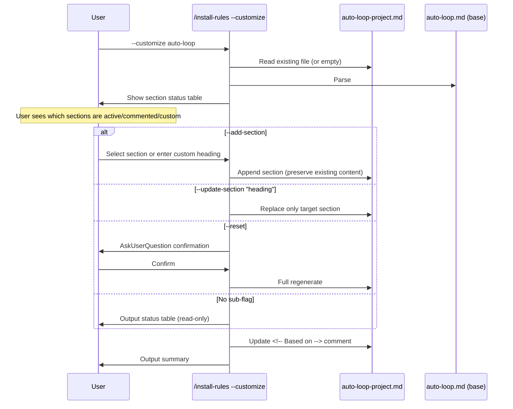

# Rule Override Pattern v2 — Customize Redesign Technical Spec

## 1. Requirement Summary

- **Problem**: v1 `--customize` wizard 只支援 4 個 preset 維度（code review / doc review / precommit / P2 sweep），且為全量覆寫模式。使用者最常見的需求——新增專案特有規則（如「必須執行 integration test」）——無法透過 wizard 完成。實際使用時使用者繞過 wizard 直接手動編輯 template，wizard 反而不如 template 靈活。
- **Goals**:
  1. `--customize` 從 full-generate 轉型為 incremental section operations
  2. 支援 freeform 自訂 section（不限於 4 preset）
  3. 保留 metadata generation（`Based on`、`Generated by`）供 drift detection
  4. 修復 overwrite detection false positive（用 sentinel 取代 heading 偵測）
  5. 統一 hash 語義為 blob hash end-to-end
- **Scope**:
  - v2: 重新設計 `--customize` 操作模式（`--add-section` / `--update-section` / `--reset`）
  - 修復 hash 不一致
  - 新增 within-file MECE health check
- **Non-goals**:
  - 不拆分 base `auto-loop.md` 的 `##` heading（defer to v3）
  - 不擴展到 `codex-invocation-project.md` 等其他 rules（仍 v1 scope）
  - 不修改 smart merge 演算法（base file 的 8-state 不變）
- **Evidence**: `/best-practices` audit（threadId: `019cfa99-3cba-7601-887e-c9b1f9e8adf8`，Helm/Kustomize/ESLint/Tailwind 對比研究 + Claude-Codex adversarial debate，Round 2 達成 Nash Equilibrium）

## 2. Existing Code Analysis

### Related Modules

| File | Purpose | v2 Impact |
|------|---------|-----------|
| `commands/install-rules.md:86-228` | Customize Mode 全段 | **Rewrite** — 替換 4-preset wizard 為三路操作 |
| `rules/auto-loop-project.md` | Template source | **Modify** — 新增 `<!-- Generated by -->` sentinel |
| `.claude/rules/auto-loop-project.md` | Installed copy（user-owned） | Backward-compat（existing files 保持運作） |
| `skills/claude-health/SKILL.md:183-190` | Override safeguard checks | **Extend** — 新增 duplicate heading warning |
| `docs/features/rule-override-pattern/2-tech-spec.md` | v1 tech spec | Reference only（不修改） |

### Reusable Components

- Phase 1 plugin rules directory discovery（`commands/install-rules.md:231-245`）— reuse as-is
- `Based on` hash computation（`commands/install-rules.md:114-118`）— reuse + unify to blob hash
- Phase 4.6 CLAUDE.md backfill（`commands/install-rules.md:411-438`）— reuse as-is

### v1 Open Questions Resolved by v2

| # | v1 Question | v2 Decision |
|---|-------------|-------------|
| 1 | `--customize` 在 `/install-rules` 還是獨立 command？ | 留在 `/install-rules`（sub-flag） |
| 2 | Template 應包含所有 sections as commented-out stubs？ | Yes + `<!-- Generated by -->` sentinel |
| 3 | v2 擴展到其他 rules？ | No（仍只 `auto-loop`，但架構不阻擋未來擴展） |

## 3. Technical Solution

### 3.1 Architecture Design



### 3.2 Three-Mode Operation Design

| Mode | Flag | Behavior | Destructive? |
|------|------|----------|-------------|
| **Status** | `--customize auto-loop` (no sub-flag) | 列出 base 所有 `##` sections + override 狀態（active / commented / missing / custom） | No (read-only) |
| **Add** | `--customize auto-loop --add-section` | Append section stub to override file；可選 base section 或自訂 heading | No |
| **Update** | `--customize auto-loop --update-section "Auto-Trigger"` | Replace only the specified section；preserve all other sections | Partial (target section only) |
| **Reset** | `--customize auto-loop --reset` | Full regenerate with AskUserQuestion confirmation | Yes (with confirmation) |

#### Sub-Flag Mutual Exclusion

`--add-section`, `--update-section`, `--reset` are mutually exclusive. Validation matrix:

| Combination | Result |
|-------------|--------|
| `--add-section` alone | OK |
| `--update-section "X"` alone | OK |
| `--reset` alone | OK |
| `--add-section --update-section` | Error: `--add-section and --update-section are mutually exclusive` |
| `--add-section --reset` | Error: `--add-section and --reset are mutually exclusive` |
| `--update-section --reset` | Error: `--update-section and --reset are mutually exclusive` |
| Any sub-flag + `--all`/`--list`/`--force`/`--dry-run`/`--legacy-strategy`/`rule-names` | Error (inherit v1 Mode Gate) |

### 3.3 Core Logic Changes

#### 3.3.1 Status Mode (default)

```
/install-rules --customize auto-loop
```

1. Locate plugin rules dir (reuse Phase 1)
2. Parse base `auto-loop.md` → extract `##` headings
3. Read existing `auto-loop-project.md` (if exists)
4. Classify each section:

| Classification | Condition | Display |
|---------------|-----------|---------|
| `active` | Override file has uncommented `## <heading>` | `[ACTIVE]` |
| `commented` | Override file has `<!-- ## <heading>` | `[COMMENTED]` |
| `missing` | Section exists in base but not in override | `[BASE ONLY]` |
| `custom` | Section exists in override but not in base | `[CUSTOM]` |

1. Output status table:

```markdown
## Override Status: auto-loop

**Base**: auto-loop.md @ {SHORT_HASH}
**Override**: .claude/rules/auto-loop-project.md

| # | Section | Status | Source |
|---|---------|--------|--------|
| 1 | Auto-Trigger | [COMMENTED] | base |
| 2 | Dual Review Mode | [BASE ONLY] | base |
| 3 | P2/Nit Quality Sweep | [BASE ONLY] | base |
| 4 | Exit Conditions (Only) | [COMMENTED] | base |
| 5 | My Custom Integration Tests | [ACTIVE] | custom |

Use `--add-section` to add a new override, `--update-section "<heading>"` to update existing.
```

#### 3.3.2 Add Section Mode

```
/install-rules --customize auto-loop --add-section
```

1. Show status table (same as 3.3.1)
2. AskUserQuestion:

> Which section to add?

Options (dynamic, based on status):
- Each `[BASE ONLY]` or `[COMMENTED]` section from base → "Override: `## <heading>` (from base)"
- "Custom: Enter your own section heading and content"

3a. **Base section selected**: Copy section content from base `auto-loop.md`, uncomment if needed, append to override file after last section.

3b. **Custom section selected**: AskUserQuestion for heading text (raw text without `##` prefix, e.g. user enters `My Integration Tests` → tool writes `## My Integration Tests`), then generate stub with `<!-- TODO: Add your custom rules here -->`.

**Input validation for custom heading**:

| Check | Rule | Error |
|-------|------|-------|
| Heading level | Must be `##` (not `#`, `###`, etc.) | "Custom sections must use `##` level headings" |
| Length | 3-80 characters (excluding `##` prefix) | "Heading too short/long" |
| Characters | Alphanumeric + spaces + hyphens + parentheses | "Heading contains invalid characters" |
| Duplicate | Must not match existing active heading in override | Redirect to `--update-section` |

1. **Duplicate check**: If `## <heading>` already exists as active section in override → warn and stop:

```
Error: Section "## Auto-Trigger" already exists in override file.
Use `--update-section "Auto-Trigger"` to replace it.
```

1. Update `<!-- Based on -->` hash **only when content was copied from base** (not for custom sections — custom sections have no base origin, so `Based on` remains unchanged to avoid misleading drift signals).

2. Output:

```markdown
## Section Added

**Section**: ## <heading>
**Source**: base / custom
**File**: .claude/rules/auto-loop-project.md

Edit the section content to customize your project's behavior.
```

#### 3.3.3 Update Section Mode

```
/install-rules --customize auto-loop --update-section "Auto-Trigger"
```

1. Read override file, locate target `## <heading>` section
2. If not found → error: `Section "## Auto-Trigger" not found in override file. Use --add-section first.`
3. AskUserQuestion: Show current content, ask for new content or offer to re-copy from base
   - "Re-copy from base (latest version)"
   - "Keep current and edit manually"
4. Replace only the target section, preserve all other content
5. Update `<!-- Based on -->` hash

#### 3.3.4 Reset Mode

```
/install-rules --customize auto-loop --reset
```

1. AskUserQuestion: "This will regenerate `auto-loop-project.md` from the base template, replacing ALL current content. Continue?"
   - "Yes, reset to template"
   - "No, cancel"
2. If confirmed: copy from plugin `rules/auto-loop-project.md` template source
3. Update `<!-- Based on -->` hash + `<!-- Generated by -->` sentinel

#### 3.3.5 Sentinel-Based Content Detection

Replace current heading-based detection (`commands/install-rules.md:205`) with sentinel:

**Current** (v1, problematic):

```
Detection: file has uncommented lines containing `## ` headings
```

**New** (v2):

```
Detection: file has content BELOW the sentinel comments block

Sentinel block = consecutive <!-- ... --> lines at top of file (after # heading)
Active content = any non-empty, non-comment line after sentinel block
```

The sentinel comments are:

```markdown
<!-- Based on: ... -->
<!-- Generated by: /install-rules -->
```

(R8 removed `<!-- Precedence: ... -->` from this list: the precedence declaration is now live text in
the preamble, because HTML comments never reach the model. Active-content detection therefore starts
below the preamble — the live `Precedence:` paragraph is header material, not activation.)

**Canonical sentinel value**: `<!-- Generated by: /install-rules -->` (always this exact form, regardless of which sub-flag was used).

**Tolerant parse regex** (for reading): `/<!-- Generated by: \/install-rules\b/` — matches `<!-- Generated by: /install-rules -->`, `<!-- Generated by: /install-rules --customize auto-loop -->`, or any future variant.

Detection logic (comment-state-aware):

```
has_active_content = false
in_comment = false
for each line in file:
  stripped = line.trim()
  # Track multiline comment state
  if "<!--" in stripped and "-->" in stripped:
    continue  // single-line comment, skip (assumes no mixed content like "text <!-- comment -->"; mixed lines are unsupported)
  if "<!--" in stripped and "-->" not in stripped:
    in_comment = true
    continue
  if in_comment:
    if "-->" in stripped:
      in_comment = false
    continue  // inside multiline comment, skip
  # Outside comments
  if stripped starts with "#": continue  // heading (title or section)
  if stripped is empty: continue
  # Non-empty, non-comment, non-heading line = active content
  has_active_content = true
  break
```

> **Constraint**: Template comments must use standard HTML comment syntax (`<!-- ... -->`). Nested comments (`<!-- <!-- --> -->`) are not supported and will cause parse errors.

### 3.4 MECE Contract

Based on `/best-practices` audit equilibrium:

| Scope | Rule | Enforcement |
|-------|------|-------------|
| Between files (base ↔ override) | Overlap expected — this IS the replacement mechanism | Precedence comment in override file |
| Within override file | One active `##` heading per key | `/claude-health` P2 warning (new) |
| Fallback | If duplicate headings exist, `last-active-wins` | Deterministic but should be fixed |

#### Within-File Duplicate Detection (new `/claude-health` check)

```
# Check 5: Duplicate heading in override
Parse auto-loop-project.md for active ## headings
If any heading appears more than once:
  Report P2: "Duplicate section '## <heading>' in auto-loop-project.md"
  Recommendation: "Keep one, remove duplicates. Last occurrence takes effect."
```

### 3.5 Hash Semantics Unification

**Current inconsistency**:
- `commands/install-rules.md:115` — blob hash (`git hash-object --no-filters`)
- `skills/claude-health/SKILL.md:141` — drift check compares `based_on` hash vs "current base hash"（未明確指定 hash 類型，實務上可能為 commit hash）

**Migration**: v1 的 `Based on` comment 可能已包含 commit-style hash（7 char hex）。v2 統一為 blob hash，但 parse 時需兼容：
1. 讀取：accept any 7-40 char hex string（不區分 blob/commit）
2. 寫入：always emit blob hash via `git hash-object --no-filters`
3. 比較：re-compute blob hash of current base file, compare with stored value

**v2 contract**: All hash references use blob hash.

| Context | Hash Type | Command |
|---------|-----------|---------|
| `Based on` comment in override file | Blob hash (first 7 chars) | `git hash-object --no-filters <file>` |
| `/claude-health` drift check | Blob hash comparison | Same command |
| Manifest `rules[].hash` | Blob hash (full 40 chars) | Same command |

**Backward compatibility**: Parse existing `Based on` comments that may have commit-style hashes — accept any 7+ hex char string. New writes always use blob hash.

### 3.6 Template Source Update

> **Amended by R8, and not canonical.** The precedence declaration below has been rewritten to the
> current shape (live text, Default/Guidance-scoped), so the block is safe to read — but the shipped
> template is the authority, not this snippet: `rules/auto-loop-project.md` for the exact bytes,
> `./2-tech-spec.md` § 3.3 Project Override File Contract for the semantics, and
> `rules/auto-loop.md` § Override Contract for the heading → tier mapping and the setting vs
> section-replacement distinction. The two scaffold headings at the end (`## Auto-Trigger`,
> `## Exit Conditions`) are **pre-R3 examples that no longer exist** in `auto-loop.md`; the shipped
> scaffold's headings are `## Tier`, `## Max Rounds`, `## Plan Review`, `## Plan Review Max Rounds`,
> `## Git Memory`, `## Think Harder`, all of them settings rather than section replacements.

Update `rules/auto-loop-project.md` to include sentinel:

```markdown
# Auto-Loop Project Overrides

Precedence: an active (non-comment) ## section in this file customizes auto-loop.md — for
Default- and Guidance-tier instructions only. Anchor-tier instructions cannot be overridden here.
(Live text, not a comment: HTML comments never reach the model — R8.)

<!-- Based on: auto-loop.md @ {SHORT_HASH} ({DATE}) -->
<!-- Generated by: /install-rules -->

<!--
This file is user-owned and NOT managed by the plugin's smart merge.
Plugin updates to auto-loop.md will not affect this file.

To override a section from auto-loop.md:
1. Copy the exact ## heading from auto-loop.md
2. Restate the FULL section content here
3. Your version wins within the precedence stated above

Or use: /install-rules --customize auto-loop --add-section
-->

<!-- ## Auto-Trigger ... -->
<!-- ## Exit Conditions (Only) ... -->
```

### 3.7 CLAUDE.md auto-loop-project.md MECE Cleanup

Since `auto-loop.md` already has a `## Project Customization` redirect section pointing to `auto-loop-project.md`, and `CLAUDE.md` lists both files in `## Rules`:

```markdown
- @rules/auto-loop.md -- Auto review loop (highest priority)
- @rules/auto-loop-project.md -- Project-specific auto-loop overrides (user-owned)
```

The MECE boundary is clear:
- `auto-loop.md` = base behavior + redirect
- `auto-loop-project.md` = user overrides only

No additional CLAUDE.md changes needed for v2.

## 4. Risks and Dependencies

| Risk | Probability | Impact | Mitigation |
|------|------------|--------|------------|
| Section parsing edge cases (nested headings, fenced code blocks containing `##`) | Medium | Medium | Parse only top-level `##` (not inside code fences); test with existing rules |
| Existing override files lack sentinel → detection regression | Low | Low | Backward-compat: if no sentinel found, fall back to v1 heading detection |
| `--add-section` creates section with wrong heading (typo) | Medium | Low | Status mode shows available sections; fuzzy-match suggestion in v3 |
| Users confused by 3 sub-flags | Low | Low | Default (no sub-flag) is read-only status; progressive disclosure |
| Hash migration causes false drift warnings | Low | Medium | Accept both hash formats during transition |

### Dependencies

| Dependency | Status | Risk |
|-----------|--------|------|
| v1 base + override separation | Implemented | None |
| v1 `/claude-health` 4 safeguards | Implemented | None — extend, not rewrite |
| `git hash-object` availability | Verified (git is always available) | None |
| Section-level `##` parsing | New (v2) | Medium — needs test coverage |

## 5. Work Breakdown

| # | Task | Files | Effort | Depends On |
|---|------|-------|--------|-----------|
| 1 | Rewrite Customize Mode section in `install-rules.md` — replace 4-preset wizard with 3-mode operations | `commands/install-rules.md:86-228` | **M** | — |
| 2 | Add sentinel comment to template source | `rules/auto-loop-project.md` | **S** | — |
| 3 | Update `/claude-health` — add duplicate heading check (#5) | `skills/claude-health/SKILL.md` | **S** | — |
| 4 | Unify hash semantics in install-rules + claude-health | `commands/install-rules.md`, `skills/claude-health/SKILL.md` | **S** | — |
| 5 | Update argument-hint + examples in install-rules | `commands/install-rules.md:3, 495-518` | **S** | 1 |
| 6 | Tests for section parsing + add/update/reset operations | `test/commands/install-rules-customize.test.js` | **M** | 1 |
| 7 | Update README references (if any mention 4-preset wizard) | `README*.md` | **S** | 1 |

**Total estimated effort**: 2M + 5S

## 6. Testing Strategy

| Type | Scope | File |
|------|-------|------|
| Unit | Section parser: extract `##` headings from markdown (skip fenced code) | `test/commands/install-rules-customize.test.js` |
| Unit | Status classification: active / commented / missing / custom | Same |
| Unit | `--add-section`: append without destroying existing content | Same |
| Unit | `--add-section`: duplicate heading detection → error | Same |
| Unit | `--update-section`: replace single section, preserve others | Same |
| Unit | `--reset`: full regenerate preserves sentinel format | Same |
| Unit | Sentinel detection: backward-compat with files lacking sentinel | Same |
| Unit | Hash unification: blob hash computation + backward-compat parse | Same |
| Unit | `/claude-health` duplicate heading warning | `test/scripts/claude-health-override.test.js` |
| Unit | Edge: fenced code block containing `##` not treated as heading | Same |
| Unit | Edge: multiline HTML comment spanning 3+ lines correctly skipped | Same |
| Unit | Edge: file with no sentinel (v1 legacy) falls back to heading detection | Same |
| Unit | Edge: duplicate active headings detected and reported | Same |
| Integration | Full flow: `--add-section` → manual edit → `--update-section` → status | Manual |

## 7. Open Questions

| # | Question | Decision Owner | Notes |
|---|---------|---------------|-------|
| 1 | ~~`--add-section` 的 freeform content 應由 AskUserQuestion 收集還是只生成 stub？~~ | ~~UX decision~~ | **Resolved (v2)**: Stub-only（§3.3.2 Step 3b）。使用者自行編輯更安全。 |
| 2 | `--update-section` 需要 AskUserQuestion 確認嗎？ | UX decision | 建議：只在內容不同時確認 |
| 3 | 未來 v3 是否需要 row-level extend 語義（如 Tailwind `theme.extend`）？ | Based on user demand | 目前 section-level replacement 足夠 |
