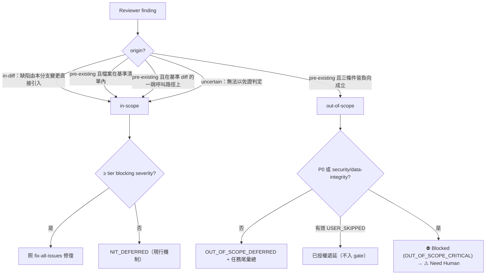

# Scope Discipline Technical Spec

來源：GitHub issue #12（2026-08-14，sd0xdev）＋ `/issue-analyze` 分析（Codex 盲測 ACTIONABLE 0.95，
thread `01a000ac-f548-74b3-a41d-577620950154`）。本規格是 current-authority 文件；issue 與分析
過程是 record，不在此重述。

## 1. 需求摘要

- **問題**：review loop 對「檔案層級 out-of-scope 的 pre-existing 缺陷」沒有標準出口。
  `rules/fix-all-issues.md:23` 的「Beyond current scope」唯一條件是 architecture-level change；
  同檔第 3 行明言 pre-existing 不是理由；reviewer 的 Merge Gate
  （`skills/codex-code-review/references/review-common.md:19-26`）只有 severity 一個軸。三者合起
  來：reviewer 對非本分支引入的缺陷回 `⛔ Blocked` 時，唯一能關 gate 的路徑就是修掉它——實際事故
  即由此把單檔變更擴散成全 repo 掃射。
- **目標**：給 scope 一個與 severity 正交的機械化判定軸，讓 out-of-scope pre-existing 缺陷有
  「記錄並遞延」的標準出口，同時不弱化任何 Anchor（本分支引入的缺陷照舊零容忍）。
- **範圍**：新增 `rules/scope-discipline.md`（含兩個新枚舉 human exit，§3.7）；更新 reviewer
  契約（三份 prompt＋parent skill 的 Step 1 metadata、gate 計算、Review Loop routing、
  late-secondary＋re-review 段）；治理漣漪（discretion.md、根 CLAUDE.md 的 human-exit
  closed-list 句、測試、模板、計數、README）。
- **非目標**：不改 `rules/auto-loop.md`（19,976/20,000 bytes，
  `test/skills/review-dispatch.test.js:165-171` 釘住上限），因此**不擴充 Gate Sentinels 集合**
  （§3.6 用既有 sentinel＋`gate_reason` 欄位表達 routing）；不新增 Anchor Register 項——本規則
  **承接**既有 #1/#2/#3/#6 的命中（§3.7），閉集選項本身是 Default 政策（§3.3）；不做
  consuming-project override 檔（v1 無此需求，出現再加）。

## 2. 既有程式碼分析

| 位置 | 現況 | 本案的關係 |
|------|------|-----------|
| `rules/fix-all-issues.md:23` | 例外表唯一 scope 出口＝architecture-level change | 加一列指向新規則（引用，不承載機制） |
| `references/review-common.md:19-26` | Merge Gate 純 severity 軸 | 改為 severity ∧ scope 雙軸＋`gate_reason`（§3.6） |
| `skills/codex-code-review/SKILL.md:58-68` | Step 1 metadata collection：fast/full 只收 `git diff --name-only HEAD`；branch 另收 `CURRENT_BRANCH`/`BASE_BRANCH`/`COMMIT_COUNT`——無 untracked、無 base 預設解析、無凍結清單 | 基準檔案集的計算與凍結落點（§3.2） |
| `SKILL.md:139-165` | inline secondary prompt（`--dual`） | 接上 scope 欄位契約 |
| `SKILL.md:178-205` | single-reviewer gate（:189）＋dual aggregation gate——只看 severity | 雙 disjunct＋`gate_reason` |
| `SKILL.md:214-255` | Step 4.5／Review Loop：所有 `Blocked → fix → re-review`，無分流 | 依 `gate_reason` 分流（§3.6），否則 critical out-of-scope 仍會被送進修復迴圈 |
| `SKILL.md:266-274` | late-secondary／pre-precommit reopen——只看 severity | 同上接雙軸 |
| `references/codex-prompt-{fast,full,branch}.md` | Findings 格式無 origin/scope 欄位（fast:93-118 等）；branch:13 帶 `${BASE_BRANCH}` 變數（僅變數，非解析契約） | 增欄位＋佐證要求；基準解析契約在 Step 1 補（§3.2） |
| 同三檔 fast:111 / full:140 / branch:159 | 殘留「hook parses and stores with TTL」失效敘述（hook-lightweighting 後無 parser） | 順手校正（同檔同批編輯） |
| `references/review-common.md:87-108` | `--continue` re-review prompt 只帶 New Git Diff | 補帶 scope 基準 snapshot 與有效 disposition 清單（§3.3、§3.6） |
| `rules/discretion.md` § File Baselines | 表格釘死 12 檔；`test/rules/discretion-tiers.test.js:18,87,108,306`（deepEqual 本體 90-103） | 12→13，測試同步（by-design forcing function） |
| 根 `CLAUDE.md:5`（與 `CLAUDE.template.md` 同句） | 「human exits 是 auto-loop.md 的 closed list」 | 改為 auto-loop.md ＋ scope-discipline.md 兩個枚舉來源（§3.7） |
| `skills/project-setup/SKILL.md:48,178,226,522,545` | 「13 managed rules + 2 override templates = 15」共五處 | 14＋2＝16 逐處更新；現無測試釘住此計數（§4 R3） |
| 根 `CLAUDE.md` ## Rules、`CLAUDE.template.md`、`docs/rules.md` | rules 清單 | 各加一列 |
| `README.md:32,460` 及其餘五個語系 README | 公開宣稱「15 rules」「12 plugin-managed rule files」 | 改 16／13（六語系） |
| `.claude/rules` | 指向 `../rules` 的 symlink | 無需同步動作（不列 WB） |
| `[NIT_DEFERRED]`（auto-loop.md § Sub-Threshold Findings） | 純 reporting convention：column 0、欄位順序固定、無 parse 無 persistence | `[OUT_OF_SCOPE_DEFERRED]`、`[USER_SKIPPED]` 完全鏡射此模式 |

## 3. 技術方案

### 3.1 架構：判定與行為流



### 3.2 Scope 判定（機械化，三條件擇一即 in-scope）

**Scope baseline（基準檔案集）是 task 級、不可變的**：在任務的第一個 review round 開始時於
parent skill Step 1（`SKILL.md:58-68`）計算一次並凍結，之後整個 review session（initial
reviewer、inline secondary、`--continue` 與後續同任務 re-dispatch）沿用同一份——任何路徑不得
重算。唯一的更新途徑是 §3.3 閉集選項 1 的明示 scope 擴張，且是**單調精確聯集**：
`baseline := baseline ∪ 使用者明示點名的檔案`（相容性分析另行批准的 direct caller 集合亦逐檔
加入）——**不得重新執行 discovery 命令**：重掃當下 dirty diff 會把先前修復已觸及的檔案一併吸入
新 baseline，把使用者只授權一檔的擴張變成全部 dirty files，重新打開本規則要封住的擴散。round
中的一般 edit 永不回寫 baseline：

| 變體 | 基準檔案集 |
|------|-----------|
| `/codex-review-fast`、`/codex-review`（full） | `git diff --name-only HEAD` ∪ untracked（`git ls-files --others --exclude-standard`） |
| `/codex-review-branch`（含 `--dual`） | `git diff --name-only $(git merge-base ${BASE_BRANCH} HEAD)` ∪ 同上的 uncommitted＋untracked 集合 |

`${BASE_BRANCH}` 解析契約（新增於 Step 1，現況只有變數名）：顯式參數優先（如
`/codex-review-branch origin/develop`，`SKILL.md:301` 範例）；未給時
`git symbolic-ref --short refs/remotes/origin/HEAD`，失敗再退 `origin/main`。每個候選 ref 使用前
以 `git rev-parse --verify` 驗證；**全部候選失敗**（無 origin、未 fetch、非 main/master 慣例）→
branch review 以**參數錯誤中止**並要求顯式 base——不產生 scope-aware verdict、不得以空集合繼續
（空基準會把所有未修改檔案錯判 out-of-scope）、也不是新的 human exit。解析結果與凍結清單一併
寫入 review 報告 metadata。

1. **檔案在基準檔案集內** —— 純集合成員判定。
2. **缺陷位於基準 diff 直接觸及的呼叫路徑上** —— 限定**一跳**：diff 中被修改符號的直接 caller 或
   direct callee。不得傳遞展開（一跳的一跳不算）；判定需具體佐證（呼叫點 file:line）。無法給出
   一跳佐證 → `uncertain`。
3. **缺陷由本分支變更直接引入** —— 以 `git log -L` / `git blame` 佐證引入 commit 在分支上。

`uncertain` 一律 **fail-closed 視同 in-scope**（gate 與修復都照 in-scope 處理）：錯把 pre-existing
當 in-scope 的代價是多修一點、由斷路器（§3.5）封頂；錯把本分支缺陷當 out-of-scope 的代價是缺陷
出貨。方向不對稱，取前者。判定 out-of-scope 需要**完整負向證據**：三條件逐一不成立（不在基準
清單、無一跳呼叫點、非本分支引入），缺任一負向判定 → `uncertain`。

非程式碼檔（`.md`、config、資料檔）無呼叫路徑概念：只適用條件 1 與 3，條件 2 恆為負向。

### 3.3 行為表、`[OUT_OF_SCOPE_DEFERRED]` 與 `[USER_SKIPPED]`

| 分類 | 行為 |
|------|------|
| in-scope ∧ ≥ blocking | 照 `fix-all-issues.md` 修復，零容忍不變 |
| in-scope ∧ sub-threshold | 現行 `[NIT_DEFERRED]` 機制，不變 |
| out-of-scope ∧ 非 P0 非 security/data-integrity | 記 `[OUT_OF_SCOPE_DEFERRED] file:line \| issue \| 建議票名 \| <ISO8601>`，任務結尾一次彙總；**不阻擋 `✅ Ready`** |
| out-of-scope ∧ critical ∧ 無有效 `[USER_SKIPPED]` | gate 收 `⛔ Blocked`＋`gate_reason=OUT_OF_SCOPE_CRITICAL`（§3.6），模型**不進修復迴圈**，走 human exit E1（§3.7）：暫停原任務、通知使用者、呈現閉集選項；**不得記錄 pass** |
| out-of-scope ∧ critical ∧ 有效 `[USER_SKIPPED]` | 已授權遞延：**排除於 gate 第二 disjunct 之外**，列於報告「Out-of-Scope Findings」段並附 disposition |
| 使用者明示「一起修」 | scope 擴張：被點名檔案自此為 in-scope，走完整 review |

兩個記錄都是 **reporting convention**，與 `[NIT_DEFERRED]` 同構：column 0、欄位順序固定、
greppable；**無 TTL、無 hook 解析、無持久化**（hook-lightweighting）。耐久記錄是 review 報告與
對話；同任務內任何 re-review prompt（`--continue` 或重新派發）攜帶現行有效的 disposition 清單
（§3.3、§3.6），`/codex-review-branch` 深度複審時重新發現仍為真的項目。記錄內容受 Anchor Register #2 約束：
不得含 secret／token／密碼。

**Critical 分支的閉集選項（Default-tier 政策）**——預設呈現且僅呈現三個：

1. 擴大 scope 納入修復（該檔成為 in-scope；Register #3 生效：以 `thorough` 審；**該輪 review
   以擴張後的 scope 重跑**）。
2. 把急迫缺陷抽成獨立變更先修（自成 review cycle），原任務暫停；**其落地後原任務以當時 digest
   重新走自己的 review gate**。
3. 中止原任務。

**使用者明示跳過**（不在預設選項內、須使用者自行提出）：記
`[USER_SKIPPED] key=<file|canonical_issue> | authorized_at=<ISO8601> | scope=<task-id>`——identity
契約沿用 `review-common.md:83`（跨輪 finding identity＝file＋canonical issue text，**行號不參與
identity**：修復其他 finding 造成的行號漂移不影響匹配）；serialization precedent 是 :117,123 的
`key=<file|canonical_issue>` 形式。「有效」需同時
成立：finding identity 相同；建立時已通過下述 Anchor-first 檢查；task 相同；欄位完整且值合法
——任一不成立即 fail-closed 為無效（finding 回到 gate）；issue 實質改變（同檔另一缺陷）不沿用
舊授權。同任務內**任何**後續 re-review（`--continue` 或重新派發）都由模型把現行有效 disposition
清單附入 prompt——載體是對話與報告（reporting convention），非持久化狀態。效力限本任務；自此該
finding 依上表第五列排除於 gate 之外。**建立 disposition 不關閉既有 verdict**：先前的
`⛔ Blocked` 報告與 fail note 仍是現行 gate 紀錄（gate verdict is the reviewer's report——
`auto-loop.md` 此權威句不動），模型不得自行把舊 Blocked 改讀為 Ready、也不得逕記 pass；必須以
`--continue`（或明確重新派發）攜帶 disposition 清單**重跑 review**，取得推導為 `Ready×NONE` 的
新 reviewer verdict 後才 note pass。此路徑是 `fix-all-issues.md:22`「User asks to skip」既有
Default 例外的實現，**但受 Anchor-first 限制**：若 finding 內容命中 Anchor Register #1
（`rules/security.md` 的 prohibited 列）或其他 Register 項，Default 例外不能凌駕——依
`discretion.md` 走 proposal channel 回報衝突，不記 `[USER_SKIPPED]`。模型**不得主動提供**「跳過
並照常完成」為選項；不可豁免的始終是：**已做的任何 edit 都要 re-review**（Register #6，§3.6
Anchor 句）——這一點沒有使用者例外。

### 3.4 Helper 擴散禁令（精確版）

禁的是**無受影響證據的全 repo 一致性掃射**：為修 in-scope 缺陷新建的 helper／pattern，只應用到
scope 命中的檔案；「順手把全 repo 同型寫法都換掉」不是修復，是 scope 違規。**不禁**介面相容性
修改：本分支改了某 helper 的簽名或語義時，其**直接 caller** 的相容更新本來就落在 §3.2 條件 2
（一跳、有呼叫點佐證），照常 in-scope。

### 3.5 斷路器（只停擴張，不改寫 scope）

**判定基準是 §3.2 的 immutable scope baseline**＋由它導出的 top-level 目錄集；**計數器是
round 級**——每個 review round 歸零重數，但比對對象始終是 task 級 baseline，round 中的新 edit
不回寫 baseline——否則檔案一經修改就進了 `git diff HEAD`，「非基準檔案」便無從機械判定，且每輪
重凍結會讓斷路器每輪重新取得五檔預算。repo 根層檔案（無第一層目錄者，如 `CLAUDE.md`、
`package.json`）映射到虛擬 bucket `<root>`，算一個目錄、參與第二子系統計數。

觸發條件（以 baseline 判定）：單一 review round 內修復編輯觸及的**基準集以外檔案**超過 **5 個**，
或觸及 baseline 目錄集以外的**第二個 top-level 目錄**。

觸發後的處置——斷路器**只停止繼續擴張**（不再編輯任何基準集以外的新檔案），對既有 finding 的
scope 分類**沒有任何改寫效力**：

| 剩餘 finding | 處置 |
|--------------|------|
| 獨立判定為 out-of-scope（§3.2 完整負向證據） | 記 `[OUT_OF_SCOPE_DEFERRED]`，照 §3.3 |
| in-scope（含 uncertain）∧ ≥ blocking | **不得遞延**：gate 維持 `⛔ Blocked`，走 human exit E2（§3.7）——斷路器觸發本身就是「修復範圍與任務不相稱」的訊號，屬人類決策（常見為 `ARCHITECTURE` 類，但出口立足於 E2 的枚舉，不需先完成 ARCHITECTURE 分類） |
| in-scope ∧ sub-threshold | `[NIT_DEFERRED]`，照現行 |

閾值（5 檔／第二子系統）取 issue 提案值，落地一輪後依實績檢討（§7）。

### 3.6 Reviewer 契約

Finding 格式（三份 prompt＋inline secondary 的 Findings 段）：`scope` 是**推導結果，不是自由
欄位**——由 `origin` 與 `scope_reason` 依 §3.2 推導：

```
origin=<in-diff|pre-existing|uncertain>
scope_reason=<diff-file|one-hop|branch-introduced|pre-existing-outside|uncertain>
scope=<in-scope|out-of-scope>   # out-of-scope ⇔ origin=pre-existing ∧ scope_reason=pre-existing-outside
evidence=<file:line 或 blame/log -L 一行佐證；pre-existing-outside 需含三條件負向判定>
```

Fail-closed 解讀規則（模型讀報告時執行）：缺任一欄位、未知 enum 值、**矛盾組合**（如
`origin=in-diff ∧ scope=out-of-scope`）、或 `pre-existing-outside` 而 evidence 未含完整負向判定
→ 一律視同 `uncertain` → in-scope。reviewer 忘記標注時退回今日行為，永不更寬鬆。

**Dual aggregation 的欄位級合併**（`--dual`；現行 dedupe 只保留最高 severity——
`SKILL.md:193,198`、`review-common.md § Deduplication Algorithm`——會在 normalization 前把
in-scope 判定洗掉）：兩位 reviewer 的 findings **先各自** fail-closed normalize，再依 key
（`review-common.md:83` identity）合併，合併語義保守取向：

| 欄位 | 合併規則 |
|------|---------|
| severity | 任一來源的最高值（現行規則保留） |
| scope | 任一來源為 `in-scope` 或 `uncertain` → aggregate `in-scope`；**僅當所有來源都獨立判定 out-of-scope 且各有完整負向證據**才 aggregate out-of-scope |
| origin／scope_reason | 來源間衝突 → aggregate 降為 `uncertain` |
| security/data-integrity domain | 任一來源命中即保留 critical domain |
| evidence | 全部保留，不隨被選中的 severity 取捨 |

`[USER_SKIPPED]` 在 **aggregate identity 形成後**才套用：aggregate 為 in-scope 時，原本針對
out-of-scope finding 的 disposition 不能排除 gate。Gate 推導（下述）在 conservative aggregate
之後執行。

**Merge Gate（雙軸）**：`⛔ Blocked` ⇔ 存在「≥ tier blocking severity ∧ in-scope」**或**
「P0／security／data-integrity ∧ out-of-scope ∧ 無有效 `[USER_SKIPPED]`」的 finding。sentinel
集合不變；報告 Gate 段**必須**帶 closed-enum 欄位
`gate_reason=<NONE|IN_SCOPE_BLOCKING|OUT_OF_SCOPE_CRITICAL|BOTH>`——`NONE` 是 `✅ Ready` 的唯一
合法配對。**Routing 的依據永遠是推導值，不是宣告值**：模型讀報告時，先對全部 findings 執行本節
的 fail-closed normalization，再由 normalized findings **推導** expected sentinel × `gate_reason`
；reviewer 輸出的 sentinel 與 `gate_reason` 只是**待驗證宣告**——宣告與推導不一致時一律以推導值
routing（宣告 `Ready×NONE` 但 findings 含 in-scope blocking → 依 `Blocked×IN_SCOPE_BLOCKING`
處置，reviewer 無法用合法配對包住真實 blocking finding；宣告 `Blocked` 但無任何 blocking
finding → 依 `Ready×NONE`）。findings 欄位缺失致 normalization 無法完成推導 → 保守視同
`Blocked×BOTH`。矩陣以**推導後**的組合為索引；「斷路器已觸發」是模型自身持有的修復階段狀態
（§3.5），不是 reviewer 欄位，routing 前先查：

| Sentinel × `gate_reason` × breaker | 處置 |
|------------------------------------|------|
| `✅ Ready` × `NONE` | 唯一合法 Ready 組合，進下一 gate |
| `⛔ Blocked` × `IN_SCOPE_BLOCKING` × 未觸發 | 修復迴圈（現行 Step 4.5／Review Loop） |
| `⛔ Blocked` × `IN_SCOPE_BLOCKING` × 已觸發 | **不進修復迴圈**：human exit E2（§3.5、§3.7） |
| `⛔ Blocked` × `OUT_OF_SCOPE_CRITICAL` | `note <plane> fail`；**不修復**；human exit E1（閉集選項） |
| `⛔ Blocked` × `BOTH` × 未觸發 | 先走 E1（使用者決策可能改變 scope）；決策後剩餘 in-scope blocking **照修**——兩類互不抵銷 |
| `⛔ Blocked` × `BOTH` × 已觸發 | E1 與 E2 **合併為單一 Need Human 決策點**：一次通知同時呈現閉集選項與 re-scope 決策 |
| 宣告矛盾（`Ready` × blocking 值、`Blocked` × `NONE`）、缺值、未知值 | 與所有列相同：以推導值為準重新索引本矩陣；findings 不足以推導 → 保守視同 `⛔ Blocked` × `BOTH` |

其餘 out-of-scope finding 不阻擋 `✅ Ready`，集中列在報告獨立段「Out-of-Scope Findings」。

落點（WB4 全數涵蓋）：三份 prompt；`review-common.md` gate 段（:19-26）與 re-review 段
（:87-108，補帶凍結 snapshot＋有效 disposition 清單）；parent `SKILL.md` 的 Step 1 metadata
collection（:58-68，§3.2 解析與凍結契約）、inline secondary prompt（:139-165）、single gate
（:189）與 dual aggregation（:178-205）、**Step 4.5／Review Loop routing（:214-255，依
`gate_reason` 分流——這是防止 critical out-of-scope 被送進修復迴圈的關鍵落點）**、late-secondary
reopen（:266-274）。同批移除 fast:111 / full:140 / branch:159 的失效 TTL 敘述。

**Anchor 相容句（寫入 `rules/scope-discipline.md` 本體，Register #6 命中、resolution step 0 自動
升 Anchor）**：scope 分類只決定「哪些 finding 要求修復」，**永不豁免任何實際 edit 的 re-review**
——凡有 edit，digest 移動、plane 重開、reviewer 重跑；scope 擴張到 security/data-integrity 檔案
即以 `thorough` 審（Register #3）。

### 3.7 治理落點與 human exits

`rules/scope-discipline.md` baseline **Default**（可用 `[DEVIATION]` 偏離，例：斷路器閾值在特定
變更明顯不合理時）；規則本體涵蓋 §3.2–§3.6 的規則化內容。承接的 Anchor 命中（皆為既有 Register
項，resolution step 0 自動生效，非本規則新增）：re-review 句 → **#6**；deferred／skip 記錄禁
secret → **#2**；scope 擴張至 security/data-integrity 的 thorough escalation → **#3**；security
finding 的內容命中 `security.md` 時 → **#1** precedence（§3.3 的 skip carve-out）。discretion.md
File Baselines 表加一列：
`scope-discipline.md | Default | re-review 句 → Anchor（#6）；記錄禁 secret → Anchor（#2）；thorough escalation → Anchor（#3）`。
閉集選項不列為例外（Default，見 §3.3）。

**Human exits（本規則枚舉，二項）**：

- **E1** `OUT_OF_SCOPE_CRITICAL`（含 `BOTH` 的先行決策）：out-of-scope critical finding 待使用者
  在閉集選項中處置。
- **E2** 斷路器觸發且剩餘 in-scope blocking finding：修復範圍與任務不相稱，待使用者決定
  re-scope 或中止。

現行 authority 是根 `CLAUDE.md:5`「human exits 是 `auto-loop.md` 的 closed list」；本案將該句
（根 `CLAUDE.md` 與 `CLAUDE.template.md` 同步）改為「`auto-loop.md` 與 `scope-discipline.md`
兩處枚舉的聯集，仍為 closed list」。這是 closed list 的**治理變更**，隨本規格一併送人類審核——
不藏在規則內文旁路。`auto-loop.md` 本身不動（byte 上限）。

## 4. 風險與依賴

| # | 風險 | 緩解 |
|---|------|------|
| R1 | Codex 不輸出新欄位或輸出矛盾組合 | §3.6 fail-closed 解讀規則：finding 欄位缺失／矛盾 → uncertain → in-scope；gate 欄位矛盾或缺失 → 先依 findings 重算、重算不出保守 `Blocked×BOTH`；prompt 更新後跑一輪實測 |
| R2 | 條件 2 被讀成傳遞展開，重演掃射 | 「一跳＋呼叫點佐證」明文；斷路器封頂；測試釘住規則文字 |
| R3 | 治理計數漣漪漏改 | discretion.md 12→13 由 `discretion-tiers.test.js` 強制（既有）；project-setup 五處計數**現無測試釘住**——WB3 新增 forcing test；六語系 README 計數由 WB6 明列＋doc review 把關 |
| R4 | auto-loop.md 被順手擴寫爆 byte 上限 | 非目標明文；sentinel 集合不擴充；human-exit 授權放在 CLAUDE.md 句與本規則，不動 auto-loop.md |
| R5 | 閉集選項被實作成可批准 Anchor 違反、或反向把 Default 偽裝成 Anchor | §3.3 明文：閉集是 Default、skip 受 Register #1 carve-out、edit re-review 無使用者例外；結構測試釘住（雙向 guard，§6） |
| R6 | 斷路器被當成把 in-scope blocking 洗成可遞延的出口 | §3.5 處置表明文「不得遞延」＋snapshot 凍結＋root bucket；測試釘住 |
| R7 | Review Loop 未分流，critical out-of-scope 仍被修復迴圈吞掉 | `gate_reason` closed enum＋SKILL.md:214-255 routing 明列為 WB4 關鍵落點；§6 對三個 blocking reason＋`NONE` 各測一例，另測宣告≠推導重算四例 |
| 依賴 | 無新 runtime 依賴；純 rules／prompt／skill 文件／測試變更 | — |

## 5. 工作分解

| WB | 內容 | 產出 |
|----|------|------|
| WB1 | `rules/scope-discipline.md` 本體（§3.2–§3.6 規則化＋E1/E2 枚舉＋Anchor 相容句） | 新 rule 檔 |
| WB2 | `rules/discretion.md`：表 12→13、標題「(13 plugin-managed files)」、新 baseline 列 | 規則更新 |
| WB3 | `test/rules/discretion-tiers.test.js` 同步；新 `test/rules/scope-discipline.test.js`；project-setup 計數 forcing test | 測試 |
| WB4 | Reviewer 契約：三份 prompt＋`review-common.md`（gate＋re-review＋§ Deduplication Algorithm 欄位級合併）＋parent `SKILL.md` 六個落點（:58-68 Step 1、:139-165 inline secondary、:178-205 gates、:193,198 dual dedupe、:214-255 Review Loop routing、:266-274 late-secondary）＋TTL 句移除 | prompt／skill 更新 |
| WB5 | Prompt／gate 結構測試：三條 reviewer 路徑（single/dual/late-secondary）雙軸 gate＋`gate_reason` 四值 enum、七列一致性矩陣（推導值優先）；欄位與 fail-closed 規則釘住 | 測試 |
| WB6 | 漣漪：根 `CLAUDE.md`（rules 清單＋human-exit closed-list 句）、`CLAUDE.template.md`（同兩處）、`docs/rules.md`、project-setup 五處計數（14＋2＝16）、六語系 README（15→16、12→13）、fix-all-issues.md 例外表列 | 文件／模板 |
| WB7 | Request doc 記錄（issue #12 → 本規格的決策鏈） | record |

順序：WB1→WB2→WB3 一批（規則面）；WB4→WB5 一批（reviewer 面）；WB6→WB7 收尾。每批依變更類別走
自身的 review gate。

## 6. 測試策略

- **結構測試**（`test/rules/scope-discipline.test.js`）：行為表六列存在；`[OUT_OF_SCOPE_DEFERRED]`
  與 `[USER_SKIPPED]` 欄位順序字面釘住；閉集三選項＋「不得主動提供跳過」句＋Register #1
  carve-out 句＋「edit re-review 無使用者例外」句存在；E1/E2 枚舉存在；斷路器 snapshot 凍結句、
  root bucket 句與「不得遞延」處置列存在；`uncertain` fail-closed 句存在。依 `rules/testing.md`
  § Guards 附雙向控制組。
- **discretion-tiers 同步**：MANAGED_FILES 13 檔 deepEqual、新標題、新 baseline 列格式。
- **gate 路徑測試**：single（:189）、dual aggregation（:178-205）、late-secondary（:266-274）
  三條路徑都含雙 disjunct gate 敘述；Review Loop（:214-255）含一致性矩陣——`Ready×NONE` 唯一
  合法 Ready、三個 blocking 值分流、**breaker 已觸發的 `IN_SCOPE_BLOCKING` 與 `BOTH` 兩例**、
  **宣告≠推導重算四例**（in-scope P1 包在 `Ready×NONE` → `Blocked×IN_SCOPE_BLOCKING`；
  out-of-scope critical 包在 `Ready×NONE` → `Blocked×OUT_OF_SCOPE_CRITICAL`；兩類並存＋單一
  reason → `BOTH`；無 blocking finding 的 `Blocked` 宣告 → `Ready×NONE`）、矛盾與缺值的推導
  ／保守處置；三份 prompt＋inline secondary 均含 origin／scope_reason／scope／evidence／
  gate_reason 定義；**dual 合併三例**（高 severity out-of-scope＋低 severity in-scope → 合併後
  in-scope 且不失 thorough tier 的 blocking 效力；同 severity scope 衝突 → `uncertain` →
  in-scope；兩方皆完整負向證據 → out-of-scope）；**負向案例**：矛盾組合、未知 enum、缺欄位的
  fail-closed 規則字面存在；TTL 句不再出現（負向斷言＋positive control）。
- **`[USER_SKIPPED]` 有效性測試**：行號漂移仍匹配（key 不含行號）、不同 task 不匹配、畸形
  disposition 不生效、命中 Anchor 的 finding 不生效、**skip 後未重跑 review 不得 note pass**
  ——五例字面釘住。
- **計數 forcing test**：project-setup 五處（:48,178,226,522,545 一帶）計數一致且為 14／16。
- **closed-list 句測試**：根 `CLAUDE.md` 與 `CLAUDE.template.md` 的 human-exit 句同時含
  auto-loop.md 與 scope-discipline.md 兩個來源。
- 全部走 `npm test`（node:test）；純 `.md`／測試變更，無 runtime 行為面。

## 7. 開放問題

1. 斷路器閾值（5 檔／第二子系統）為 issue 提案值——落地後第一次實際觸發時檢討是否過緊或過鬆。
2. 條件 2 的「直接 caller/callee」對動態呼叫（事件、DI、字串 dispatch）如何佐證——v1 先要求
   靜態呼叫點，動態情形自然落入 `uncertain`（fail-closed），是否產生過多誤保守待實績。
