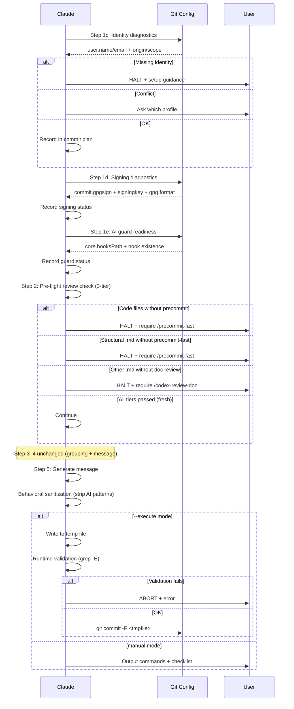

# Smart Commit Hardening — Technical Spec

## 1. Requirement Summary

- **Problem**: `/smart-commit` 存在三個使用者回報的問題：(1) Git identity 未驗證，多 profile 環境下身份混亂；(2) AI attribution 洩漏（Co-Authored-By Claude 殘留）；(3) Commit 簽名設定不一致，混合簽名/未簽名。
- **Goals**: 在 `/smart-commit` workflow 中加入 identity diagnostics、AI runtime validation、signing diagnostics 三項 pre-flight 檢查，消除上述三類問題。
- **Scope**: 修改 `skills/smart-commit/SKILL.md`、`commands/smart-commit.md`、`scripts/commit-msg-guard.sh`；新增測試。
- **Origin**: Best Practices Audit（Debate threadId: `019cb7cb-f464-75b2-ba9b-231ecded04d8`）

## 2. Existing Code Analysis

### Related Modules

| Module | 可復用部分 |
| ------ | ---------- |
| `skills/smart-commit/SKILL.md` | 現有 Step 1–6 workflow、AI trailer sanitization regex（行 147–157） |
| `scripts/commit-msg-guard.sh` | Forbidden pattern regex（**ERE**，`grep -Ei`；早期版本誤記為 BRE）、`ALLOW_AI_COAUTHOR` **narrow opt-in**（移除白名單那一行後其餘樣式照常套用，不是 bypass） |
| `commands/smart-commit.md` | Context block（status/log/branch） |
| `rules/git-workflow.md` | Claude git 操作權限定義 |
| `CLAUDE.md:115` | Author attribution 政策、forbidden patterns |

### Files Requiring Changes

| File | Action | Description |
| ---- | ------ | ----------- |
| `skills/smart-commit/SKILL.md` | Modify | 新增 Step 1c/1d/1e + runtime validation |
| `commands/smart-commit.md` | Modify | Context block 加入 identity/signing 資訊 |
| `scripts/commit-msg-guard.sh` | Modify | Regex 正規化為 ERE + `\b` 字界 |
| `test/scripts/smart-commit.test.js` | New | Identity/AI guard/signing pre-flight 測試 |

## 3. Technical Solution

### 3.1 Architecture Design



### 3.2 Step 1c: Identity Diagnostics（新增）

**位置**: Step 1a/1b 之後，Step 2 之前

**指令**:

```bash
# 讀取有效 identity + 來源。前綴與 -C 的契約見
# skills/smart-commit/references/git-environment.md § 1——診斷與 commit 必須指向同一個 repository
GIT_ENV="env -u GIT_DIR -u GIT_WORK_TREE -u GIT_COMMON_DIR -u GIT_INDEX_FILE -u GIT_OBJECT_DIRECTORY -u GIT_ALTERNATE_OBJECT_DIRECTORIES -u GIT_NAMESPACE -u GIT_CEILING_DIRECTORIES -u GIT_GLOB_PATHSPECS -u GIT_ICASE_PATHSPECS -u GIT_NOGLOB_PATHSPECS -u GIT_LITERAL_PATHSPECS -u GIT_CONFIG -u GIT_CONFIG_PARAMETERS -u GIT_CONFIG_COUNT -u GIT_IMPLICIT_WORK_TREE -u GIT_GRAFT_FILE -u GIT_SHALLOW_FILE -u GIT_PREFIX -u GIT_NO_REPLACE_OBJECTS -u GIT_REPLACE_REF_BASE -u ALLOW_AI_COAUTHOR"
REPO_ROOT=$($GIT_ENV git rev-parse --show-toplevel && printf .) || { echo "⚠️ could not resolve the repository root — aborting" >&2; exit 1; }
REPO_ROOT=${REPO_ROOT%.}; REPO_ROOT=${REPO_ROOT%$'\n'}
$GIT_ENV git -C "$REPO_ROOT" config --show-origin --show-scope --get-all user.name
$GIT_ENV git -C "$REPO_ROOT" config --show-origin --show-scope --get-all user.email
# 檢查環境變數覆寫
printf "GIT_AUTHOR_NAME=%s\nGIT_AUTHOR_EMAIL=%s\nGIT_COMMITTER_NAME=%s\nGIT_COMMITTER_EMAIL=%s\n" \
  "${GIT_AUTHOR_NAME:-}" "${GIT_AUTHOR_EMAIL:-}" \
  "${GIT_COMMITTER_NAME:-}" "${GIT_COMMITTER_EMAIL:-}"
```

**決策邏輯**:

| 情境 | 判定條件 | 行為 |
|------|---------|------|
| 正常 | `user.name` 和 `user.email` 各解析為單一值 | 靜默繼續，commit plan 顯示 identity |
| 缺失 | `git config --get user.name` 無結果 | **HALT**，輸出 `git config --local user.name "..."` 設定指引 |
| 環境變數覆寫 | `GIT_AUTHOR_*` 或 `GIT_COMMITTER_*` 非空 | ⚠️ 告知使用者 env var 將覆寫 config |
| 衝突 | `--get-all` 返回多個值且解析值不同 | **AskUserQuestion**：列出候選 profile，使用者選擇一次 |
| 衝突（CI/headless） | 衝突 + `CI=true` 環境變數 | **HALT**（fail-closed），輸出修復指引，不靜默繼承 |

**設計原則**:
- **診斷式，非覆寫式**：不使用 `git -c user.name=...` 覆寫，尊重 `includeIf` 設定
- **僅異常時中斷**：正常 identity 解析不產生任何提示
- **衝突 ≠ 多來源**：`includeIf` 產生多個 config 來源但解析為同一值 = 正常

### 3.3 Step 1d: Signing Diagnostics（新增）

**位置**: Step 1c 之後

**指令**:

```bash
GIT_ENV="env -u GIT_DIR -u GIT_WORK_TREE -u GIT_COMMON_DIR -u GIT_INDEX_FILE -u GIT_OBJECT_DIRECTORY -u GIT_ALTERNATE_OBJECT_DIRECTORIES -u GIT_NAMESPACE -u GIT_CEILING_DIRECTORIES -u GIT_GLOB_PATHSPECS -u GIT_ICASE_PATHSPECS -u GIT_NOGLOB_PATHSPECS -u GIT_LITERAL_PATHSPECS -u GIT_CONFIG -u GIT_CONFIG_PARAMETERS -u GIT_CONFIG_COUNT -u GIT_IMPLICIT_WORK_TREE -u GIT_GRAFT_FILE -u GIT_SHALLOW_FILE -u GIT_PREFIX -u GIT_NO_REPLACE_OBJECTS -u GIT_REPLACE_REF_BASE -u ALLOW_AI_COAUTHOR"
REPO_ROOT=$($GIT_ENV git rev-parse --show-toplevel && printf .) || { echo "⚠️ could not resolve the repository root — aborting" >&2; exit 1; }
REPO_ROOT=${REPO_ROOT%.}; REPO_ROOT=${REPO_ROOT%$'\n'}
$GIT_ENV git -C "$REPO_ROOT" config --show-origin --get commit.gpgsign 2>/dev/null || echo "unset"
$GIT_ENV git -C "$REPO_ROOT" config --show-origin --get user.signingkey 2>/dev/null || echo "unset"
$GIT_ENV git -C "$REPO_ROOT" config --show-origin --get gpg.format 2>/dev/null || echo "gpg"
```

**決策邏輯**:

| 情境 | 行為 |
|------|------|
| `commit.gpgsign=true` + key 存在 | 顯示 `Signing: enabled (<gpg.format>)` |
| `commit.gpgsign=true` + key 缺失 | ⚠️ 警告：signing 已啟用但 key 未設定 |
| `commit.gpgsign` 未設定 | 顯示 `Signing: not configured (inherit)` |
| `--execute` 模式簽名失敗 | **立即停止**，輸出修復步驟 |

**新增 flags**:

| Flag | 行為 | 預設 |
|------|------|------|
| `--sign` | 本次 batch 強制 `-S` | — |
| `--no-sign` | 本次 batch 強制 `--no-gpg-sign` | — |
| （無 flag） | 繼承現有 git config | ✅ |

**安全措施**: `--sign` / `--no-sign` 使用時需 AskUserQuestion 確認，並警告可能與 branch protection/CI 政策衝突。

**Post-commit 可見性**（`--execute` 模式）:

```bash
GIT_ENV="env -u GIT_DIR -u GIT_WORK_TREE -u GIT_COMMON_DIR -u GIT_INDEX_FILE -u GIT_OBJECT_DIRECTORY -u GIT_ALTERNATE_OBJECT_DIRECTORIES -u GIT_NAMESPACE -u GIT_CEILING_DIRECTORIES -u GIT_GLOB_PATHSPECS -u GIT_ICASE_PATHSPECS -u GIT_NOGLOB_PATHSPECS -u GIT_LITERAL_PATHSPECS -u GIT_CONFIG -u GIT_CONFIG_PARAMETERS -u GIT_CONFIG_COUNT -u GIT_IMPLICIT_WORK_TREE -u GIT_GRAFT_FILE -u GIT_SHALLOW_FILE -u GIT_PREFIX -u GIT_NO_REPLACE_OBJECTS -u GIT_REPLACE_REF_BASE -u ALLOW_AI_COAUTHOR"
REPO_ROOT=$($GIT_ENV git rev-parse --show-toplevel && printf .) || { echo "⚠️ could not resolve the repository root — aborting" >&2; exit 1; }
REPO_ROOT=${REPO_ROOT%.}; REPO_ROOT=${REPO_ROOT%$'\n'}
$GIT_ENV git -C "$REPO_ROOT" log -1 --format='%G?' # N=unsigned, G=good, U=good-untrusted, etc.
```

### 3.4 Step 1e: AI Guard Readiness（新增）

**位置**: Step 1d 之後

**指令**:

```bash
# `--git-path hooks/…` 本身就已套用 core.hooksPath（含 `~`／`%(prefix)` 展開）與 linked
# worktree，因此用問的、不用自己重算。
GIT_ENV="env -u GIT_DIR -u GIT_WORK_TREE -u GIT_COMMON_DIR -u GIT_INDEX_FILE -u GIT_OBJECT_DIRECTORY -u GIT_ALTERNATE_OBJECT_DIRECTORIES -u GIT_NAMESPACE -u GIT_CEILING_DIRECTORIES -u GIT_GLOB_PATHSPECS -u GIT_ICASE_PATHSPECS -u GIT_NOGLOB_PATHSPECS -u GIT_LITERAL_PATHSPECS -u GIT_CONFIG -u GIT_CONFIG_PARAMETERS -u GIT_CONFIG_COUNT -u GIT_IMPLICIT_WORK_TREE -u GIT_GRAFT_FILE -u GIT_SHALLOW_FILE -u GIT_PREFIX -u GIT_NO_REPLACE_OBJECTS -u GIT_REPLACE_REF_BASE -u ALLOW_AI_COAUTHOR"
REPO_ROOT=$($GIT_ENV git rev-parse --show-toplevel && printf .) || { echo "⚠️ could not resolve the repository root — aborting" >&2; exit 1; }
REPO_ROOT=${REPO_ROOT%.}; REPO_ROOT=${REPO_ROOT%$'\n'}
HOOK_FILE=$($GIT_ENV git -C "$REPO_ROOT" rev-parse --git-path hooks/commit-msg 2>/dev/null)
# 回答相對於自己的 cwd，而 -C "$REPO_ROOT" 已把 cwd 釘在 root，故相對答案即 root-relative：
# 不需版本旗標、不需額外行程、不需切行。REPO_ROOT 末段含換行由上方 `printf .` sentinel 保住
# （$( ) 會剝除所有尾端換行，而 --show-toplevel 沒有 -z 形式）；sentinel 以 && 連接而非 `;`，
# 否則 printf 的 exit 0 會蓋掉 git 的失敗狀態。推導與實測：
# skills/smart-commit/references/git-environment.md §1。
case "$HOOK_FILE" in
  ""|/*) ;;
  *) HOOK_FILE="${REPO_ROOT}/${HOOK_FILE}" ;;
esac
# 三態必須可分辨：決策表對「存在但不可執行」另有 chmod 指引
if   [ -x "$HOOK_FILE" ]; then echo "guard:installed"
elif [ -f "$HOOK_FILE" ]; then echo "guard:not-executable"
else                           echo "guard:missing"; fi
```

**決策邏輯**:

| 情境 | 行為 |
|------|------|
| Hook 已安裝 + 可執行 | 顯示 `AI guard: active` |
| Hook 未安裝 | ⚠️ 建議安裝（非阻擋）：`/install-scripts commit-msg-guard` |
| Hook 存在但不可執行 | ⚠️ 建議 `chmod +x` |

**重要**：hook 安裝不是 `--execute` 模式的 blocker。runtime validation 提供獨立防線。

### 3.5 Step 2: Pre-flight Review Check（3-tier 策略）

**位置**: Step 1e 之後、分組/訊息生成之前

**目的**: `/smart-commit` 是 commit 前最後一道關卡，pre-flight 確認所有變更已通過對應的 review/precommit 檢查。

**3-tier 分類**:

| Tier | 檔案類型 | 必須通過的檢查 | 說明 |
|------|---------|---------------|------|
| 1 — Code | 程式碼檔案（`.js`, `.ts`, `.sh` 等） | `/precommit` 或 `/precommit-fast` | 包含 lint + test |
| 2 — Structural `.md` | `skills/**/*.md`, `commands/**/*.md` | `/precommit-fast` | 結構性文件影響 skill 行為 |
| 3 — Other `.md` | 其他 `.md`（docs, README 等） | `/codex-review-doc`（per CLAUDE.md） | 文件品質檢查 |
| — | Comments / trivial | 跳過 | 無需檢查 |

**Freshness 條件**: 檢查必須在**當前 session 中、最後一次編輯之後**通過。過期的檢查結果不計入。

**決策邏輯**:

| 情境 | 行為 |
|------|------|
| 所有 tier 對應檢查皆已通過（fresh） | 靜默繼續 |
| Code 檔案未通過 precommit | **HALT**：要求先執行 `/precommit-fast` |
| Structural `.md` 未通過 precommit-fast | **HALT**：要求先執行 `/precommit-fast` |
| Other `.md` 未通過 doc review | **HALT**：要求先執行 `/codex-review-doc` |
| 混合變更（code + docs） | 各 tier 獨立檢查，全部通過才繼續 |

**Policy note**: 此策略刻意比 `auto-loop.md` baseline 更嚴格。`/smart-commit` 作為 commit 前最後關卡，不允許跳過任何 tier 的檢查。auto-loop 在開發迴圈中容許部分寬鬆（例如 Nit exemption），但 `/smart-commit` 不繼承這些豁免。

### 3.6 Runtime Validation（Execute 模式增強）

**位置**: Step 5c，在 `git commit` 之前

**流程**:

```bash
# 1. 建立 temp file，訊息以 Write 工具寫入（不用 heredoc）
#    固定的 `<<'EOF'` 定界符可被注入：訊息中出現一行 EOF 會提前結束 heredoc，
#    其餘內容落入 shell。/create-pr 對同一構造的禁令出於同一理由。
TMPFILE=$(mktemp "${TMPDIR:-/tmp}/smart-commit-msg.XXXXXX") || exit 1

# 2. Runtime validation：直接執行 canonical 執行點，不再自帶一份 validate_msg()
#    舊版在此重寫政策，衍生三個缺陷：`grep … && return 1` 把狀態 2 讀成乾淨
#    （fail-open）、白名單以 -Eiv 剝除而與 hook 的 -Fxv 判定相反、測試複製同
#    一段 shell 因而偵測不到 drift。guard 本身已具備 privileged mode、PATH
#    釘死、LC_ALL=C 與「grep 非 0/1 即中止」。
# 3. 解析 canonical validator：**只走 repo 相對路徑**。此處曾以
#    `${CLAUDE_PLUGIN_ROOT}/scripts/…` 為第一候選，那等於讓呼叫端指定 validator。
#    `GIT_*` 的剝除寫成**單一前綴**並套用到本檔每一個 git 操作。只對 rev-parse
#    剝除是另一個缺陷：guard 來自當前目錄所在的 repo，commit 卻寫入 GIT_* 選定的
#    另一個 repo——同一個問題答了兩次、兩個答案。`--execute` 因此明確定義為
#    「作用於當前目錄所在的 repo」，要換 repo 的人改變當前目錄。
GIT_ENV="env -u GIT_DIR -u GIT_WORK_TREE -u GIT_COMMON_DIR -u GIT_INDEX_FILE -u GIT_OBJECT_DIRECTORY -u GIT_ALTERNATE_OBJECT_DIRECTORIES -u GIT_NAMESPACE -u GIT_CEILING_DIRECTORIES -u GIT_GLOB_PATHSPECS -u GIT_ICASE_PATHSPECS -u GIT_NOGLOB_PATHSPECS -u GIT_LITERAL_PATHSPECS -u GIT_CONFIG -u GIT_CONFIG_PARAMETERS -u GIT_CONFIG_COUNT -u GIT_IMPLICIT_WORK_TREE -u GIT_GRAFT_FILE -u GIT_SHALLOW_FILE -u GIT_PREFIX -u GIT_NO_REPLACE_OBJECTS -u GIT_REPLACE_REF_BASE -u ALLOW_AI_COAUTHOR"
# `||` 掛在 substitution 上：後面兩個 strip 是 parameter assignment，永遠成功，
# 守衛寫在它們之後就永遠不會觸發（git-environment.md §1）。
REPO_ROOT=$($GIT_ENV git rev-parse --show-toplevel && printf .) || {
  # 先清理、後診斷：繼承的 `set -e` 下，寫 stderr 失敗會就地結束 shell，
  # 其後的清理永遠不會執行——這裡留在磁碟上的是完整的 commit message。
  rm -f "$TMPFILE" || echo "⚠️ 無法刪除 $TMPFILE" >&2
  echo "⚠️ could not resolve the repository root — aborting" >&2
  exit 1; }
REPO_ROOT=${REPO_ROOT%.}; REPO_ROOT=${REPO_ROOT%$'\n'}
GUARD=""
for cand in "$REPO_ROOT/.claude/scripts/commit-msg-guard.sh" \
            "$REPO_ROOT/scripts/commit-msg-guard.sh"; do
  if [ -f "$cand" ]; then GUARD="$cand"; break; fi
done
if [ -z "$GUARD" ]; then
  echo "❌ commit-msg-guard.sh not found — cannot validate" >&2
  rm -f "$TMPFILE"; exit 1     # fail closed：無法驗證即不得提交
fi

# 4. 驗證與 commit 置於同一區塊，中間不插入任何步驟。
#    `ALLOW_AI_COAUTHOR` 為呼叫端可設，預設分支因此以 env -u 清除而非僅是不設定
#    ——guard 與 commit-msg hook 都讀它。SIGN_FLAG 必須在此賦值：behavioural spec
#    的每個 fence 是獨立 shell，未賦值不是「預設為空」而是「由呼叫端決定」。
#    每個狀態都以 `if` 捕捉，不留裸命令——`git commit` 本身也不例外。繼承來的
#    `set -e` 會讓失敗的裸命令在捕捉狀態、刪除訊息檔與輸出中止訊息之前就結束
#    整個 shell；置於 `then` 區塊內並不豁免：errexit 只對被**測試**的命令
#    （`if` 的條件）暫停，對它選中的區塊照常生效。
SIGN_FLAG=''                   # --sign → -S；--no-sign → --no-gpg-sign
# AI_CO_AUTHOR 必須在本 fence 內賦值，理由與 SIGN_FLAG／GIT_ENV 相同：未賦值不是
# 「預設 0」，而是由呼叫端決定——繼承的 AI_CO_AUTHOR=1 會在 `--ai-co-author` 未傳入時
# 選到白名單分支，而真的傳入時反而可能落到預設分支。旗標由 skill 決定，不由環境決定。
AI_CO_AUTHOR=0                 # 傳入 --ai-co-author 時，且僅在此時，由 skill 改為 1
if [ "$AI_CO_AUTHOR" = "1" ]; then
  if $GIT_ENV ALLOW_AI_COAUTHOR=1 /bin/bash -p "$GUARD" "$TMPFILE"; then
    if $GIT_ENV ALLOW_AI_COAUTHOR=1 git -C "$REPO_ROOT" commit $SIGN_FLAG -F "$TMPFILE"
    then COMMIT_STATUS=0; else COMMIT_STATUS=$?; fi
  else
    COMMIT_STATUS=1
    echo "❌ AI content detected after sanitization — aborting commit" >&2
  fi
else
  if $GIT_ENV /bin/bash -p "$GUARD" "$TMPFILE"; then
    if $GIT_ENV git -C "$REPO_ROOT" commit $SIGN_FLAG -F "$TMPFILE"
    then COMMIT_STATUS=0; else COMMIT_STATUS=$?; fi
  else
    COMMIT_STATUS=1
    echo "❌ AI content detected after sanitization — aborting commit" >&2
  fi
fi
rm -f "$TMPFILE" || echo "⚠️ 無法刪除 $TMPFILE，其中仍是完整 commit 訊息" >&2
[ "$COMMIT_STATUS" -eq 0 ] || exit 1
```

> 完整可執行版本以 `skills/smart-commit/references/execute-mode.md` 為準；本節是設計說明，
> 兩者若分歧以該檔為實作契約。

**`--ai-co-author` 窄白名單**:

啟用 `--ai-co-author` 時，僅允許以下精確格式：

```
Co-Authored-By: Claude <noreply@anthropic.com>
```

其他 AI pattern（`Generated by`、`🤖`、其他 AI co-author 變體）仍然被 block。

**Post-commit 洩漏處理**（`--execute` 模式）:

```bash
# 每個 commit 後，用同一支 guard 掃描「實際被記錄下來的內容」。
# 這是**獨立的 shell**，所以 GIT_ENV 必須在此重新賦值：未賦值不是「預設為空」，
# 在繼承的 nounset 下會直接中止（且早於清理），沒有 nounset 則等於整段不套用剝除政策。
# `$GUARD` 同理，須以與上方完全相同的順序重新解析（此處省略，見 execute-mode.md）。
GIT_ENV="env -u GIT_DIR -u GIT_WORK_TREE -u GIT_COMMON_DIR -u GIT_INDEX_FILE -u GIT_OBJECT_DIRECTORY -u GIT_ALTERNATE_OBJECT_DIRECTORIES -u GIT_NAMESPACE -u GIT_CEILING_DIRECTORIES -u GIT_GLOB_PATHSPECS -u GIT_ICASE_PATHSPECS -u GIT_NOGLOB_PATHSPECS -u GIT_LITERAL_PATHSPECS -u GIT_CONFIG -u GIT_CONFIG_PARAMETERS -u GIT_CONFIG_COUNT -u GIT_IMPLICIT_WORK_TREE -u GIT_GRAFT_FILE -u GIT_SHALLOW_FILE -u GIT_PREFIX -u GIT_NO_REPLACE_OBJECTS -u GIT_REPLACE_REF_BASE -u ALLOW_AI_COAUTHOR"
AI_CO_AUTHOR=0                 # 同上：分支選擇不得由繼承的環境決定
LOGFILE=$(mktemp "${TMPDIR:-/tmp}/smart-commit-log.XXXXXX") || exit 1
# 讀取失敗與寫入失敗都會留下空檔案，而空檔案對 guard 而言與乾淨訊息無異
# ——那會把一個從未被讀取的 commit 報成無洩漏。兩者都必須顯式拒絕。
if ! $GIT_ENV git log -1 --format='%B' > "$LOGFILE"; then
  echo "❌ 無法讀回 commit 訊息 — 該 commit 未經驗證，就此停止" >&2
  rm -f "$LOGFILE" || echo "⚠️ 無法刪除 $LOGFILE" >&2
  exit 1
fi
if [ ! -s "$LOGFILE" ]; then
  echo "❌ commit 訊息讀回為空 — 該 commit 未經驗證，就此停止" >&2
  rm -f "$LOGFILE" || echo "⚠️ 無法刪除 $LOGFILE" >&2
  exit 1
fi
# guard 的狀態以 if 捕捉後，清理，然後**在本區塊內重新拋出**：清理是最後一個命令，
# 成功的 rm 會讓整個區塊以 0 結束、把有洩漏的 run 報成乾淨，而下一個 fence 是另一個
# shell，$LEAK_STATUS 不會存活。狀態本身就是硬停止，amend 指引只是要印什麼。
# 分支必須與 commit 前的驗證一致：`--ai-co-author` 之下那一行**恰好是**被允許的內容，
# 無條件以 -u 清除等於把合法的白名單行報成 post-commit 洩漏。
if [ "$AI_CO_AUTHOR" = "1" ]; then
  if $GIT_ENV ALLOW_AI_COAUTHOR=1 /bin/bash -p "$GUARD" "$LOGFILE"; then
    LEAK_STATUS=0; else LEAK_STATUS=1; fi
else
  if $GIT_ENV /bin/bash -p "$GUARD" "$LOGFILE"; then
    LEAK_STATUS=0; else LEAK_STATUS=1; fi
fi
rm -f "$LOGFILE" || echo "⚠️ 無法刪除 $LOGFILE，其中仍是 commit 訊息" >&2
if [ "$LEAK_STATUS" -ne 0 ]; then
  echo "❌ commit 中出現 AI 署名洩漏，剩餘 commit groups 全數中止" >&2
  exit 1     # 立即停止所有剩餘 commit groups，輸出 amend 指引（不自動 amend）
fi
```

### 3.7 Regex 正規化

**現況問題**: `SKILL.md` 用 PCRE-style（`(?:...)`），`commit-msg-guard.sh` 用 BRE-style（`\(...\)`），產生方言不一致。

**統一為 ERE + `\b` 字界**（`grep -E`）:

| Pattern | 舊（混合） | 新（ERE + `\b` 字界, `grep -Ei`） |
|---------|-----------|----------------|
| Co-Authored-By AI | `Co-Authored-By:.*(?:Claude\|Anthropic\|...)` (PCRE) | `Co-Authored-By:.*(Claude\|Anthropic\|\bAI\b\|GPT\|OpenAI\|Copilot\|Codex\|Gemini\|noreply@anthropic)` |
| Generated-by tag | `Generated (?:by\|with).*(?:Claude\|...)` (PCRE) | `Generated[ -](by\|with).*(Claude\|Anthropic\|\bAI\b\|GPT\|OpenAI\|Copilot\|Codex\|Gemini)` |
| Emoji robot tag | `🤖.*\(Claude\|AI\|GPT\)` (BRE) | `🤖.*(Claude\|Anthropic\|\bAI\b\|GPT\|OpenAI\|Copilot\|Codex\|Gemini)` |

**注意**：ERE 中 `|` 和 `()` 不需要反斜線跳脫。上表「新」欄位中的 `\|` 為 Markdown 表格跳脫，實際 regex 為 `|`。所有 pattern 使用 `grep -Ei`（ERE + case-insensitive）。裸 `AI` 在 `-i` 下會誤中 "maintainer"、"domain" 等一般字詞，故僅對 `AI` 加 `\b` 字界（BSD 與 GNU grep 皆支援；POSIX `[[:<:]]` 不可攜）；`GPT`/`OpenAI` 刻意不加字界，以匹配 `ChatGPT`/`GPT-4`（無英文字含 "gpt"）。

**Canonical source**: `scripts/commit-msg-guard.sh` 為正規化後的唯一真實來源，SKILL.md 引用之。

### 3.8 Commit Plan 摘要（增強）

現有 commit plan 格式擴充：

```markdown
## Commit Plan

**Author**: Jane Doe <jane@company.com> (local config)
**Signing**: enabled (GPG, key: ABCD1234)
**AI guard**: active (commit-msg hook installed)

| # | Type | Files | Summary |
|---|------|-------|---------|
| 1 | fix  | 3     | Fix circuit breaker logic |
| 2 | test | 2     | Add RPC client unit tests |
```

## 4. Risks and Dependencies

| Risk | 影響 | 緩解策略 |
|------|------|---------|
| `--show-origin --get-all` 在舊版 Git (<2.8) 不支援 | Pre-flight 失敗 | 偵測 git 版本，fallback 到 `--get` |
| `includeIf` 解析複雜 | 誤判衝突 | 衝突定義 = 解析值不同，而非來源數不同 |
| Runtime validation temp file race condition | 訊息被修改 | `mktemp`（原子建立、名稱不可預測、0600）+ validation 與 `git commit -F` 置於**同一個 bash 區塊**。殘留：guard 與 git 仍各自開檔一次，同使用者行程可在其間換掉內容；post-commit 掃描是它的偵測層。**不得**改用固定路徑（曾短暫改為 `/tmp/smart-commit-msg-1.txt`，引入 symlink 覆寫、同名碰撞與洩漏） |
| `gpg.format=ssh` signing key format 不同 | Key 存在性檢查邏輯不同 | 根據 `gpg.format` 調整 key 驗證邏輯 |
| Headless/CI 環境無法互動 | AskUserQuestion 阻塞 | 偵測 `CI` 環境變數，跳過互動提示 |
| ERE regex 在 macOS/Linux `grep` 行為差異 | 跨平台不一致 | **未緩解**：測試只跑執行主機上的那一份 grep（本 repo 為 BSD grep）。CI 若在 Linux 執行同一套測試即構成另一半覆蓋；在此之前這是已知缺口，不是已完成的驗證 |

## 5. Work Breakdown

| # | Task | 預估 | 依賴 |
|---|------|------|------|
| W1 | 修改 SKILL.md：新增 Step 1c Identity Diagnostics | S | — |
| W2 | 修改 SKILL.md：新增 Step 1d Signing Diagnostics | S | — |
| W3 | 修改 SKILL.md：新增 Step 1e AI Guard Readiness | S | — |
| W4 | 修改 SKILL.md：Step 5c Runtime Validation（temp-file + grep -E） | M | W3 |
| W5 | 修改 SKILL.md：Step 5b `--ai-co-author` 窄白名單 | S | W4 |
| W6 | 修改 SKILL.md：Post-commit 洩漏 hard stop | S | W4 |
| W7 | 修改 SKILL.md：Commit plan 摘要增強 | S | W1, W2, W3 |
| W8 | 正規化 `commit-msg-guard.sh` regex 為 ERE + `\b` 字界 | S | — |
| W9 | 修改 `commands/smart-commit.md` context block | S | W1, W2 |
| W10 | 新增 `--sign` / `--no-sign` flags | S | W2 |
| W11 | 新增 `test/scripts/smart-commit.test.js` | M | W1–W10 |
| W12 | 更新 CLAUDE.md Command Quick Reference | S | W10 |

**Size**: S = ≤30 min, M = 30–60 min

## 6. Testing Strategy

### 6.1 Unit Tests（`test/scripts/smart-commit.test.js`）

| Test Case | 驗證目標 |
|-----------|---------|
| Identity: 正常解析（single source） | 靜默通過，commit plan 含 identity |
| Identity: 缺失 user.name | HALT 輸出 + setup 指引 |
| Identity: 多來源但值相同 | 視為正常（不誤判） |
| Identity: 衝突（不同值） | 觸發 AskUserQuestion |
| Identity: env var 覆寫 | 顯示 warning |
| AI guard: forbidden pattern 偵測 | `Co-Authored-By: Claude` → 被攔截 |
| AI guard: 合法 human Co-Authored-By | `Co-Authored-By: Jane <jane@co.com>` → 通過 |
| AI guard: `--ai-co-author` 白名單 | 僅精確格式通過 |
| AI guard: 其他 AI pattern + `--ai-co-author` | `Generated by Claude` → 仍被 block |
| Signing: enabled + key present | 顯示 enabled 狀態 |
| Signing: enabled + key missing | 顯示 warning |
| Signing: not configured | 顯示 inherit 狀態 |
| Regex: ERE + `\b` 字界（**單一主機**） | 只驗證執行主機的 grep；GNU／BSD 兩者皆驗尚未達成（見 §4） |
| Hook detection: `core.hooksPath` awareness | 非標準 hook 路徑正確偵測 |

### 6.2 Integration Tests

**現況：以下皆為規劃，尚未實作。** `test/scripts/smart-commit.test.js` 驗證的是 guard 本身、
`execute-mode.md` 的**結構性質**（validator 不由環境變數選定、訊息檔以 `mktemp` 配置、預設分支
清除 `ALLOW_AI_COAUTHOR`、frontmatter 已預先授權所需工具），以及 `allowed-tools` 契約。
沒有任何測試實際跑完 `--execute` 行為流程——它需要一個真實 repo 與使用者核准，屬 `/feature-verify`
的範圍。此處列為缺口而非已完成項。

| Test Case | 驗證目標 | 狀態 |
|-----------|---------|------|
| `--execute` 模式 temp-file validation 攔截 AI 內容 | Commit 被 abort | 未實作 |
| `--execute` 模式簽名失敗 | 立即停止 + 修復指引 | 未實作 |
| Post-commit AI 洩漏偵測 → hard stop | 剩餘 groups 不執行 | 未實作 |

## 7. Open Questions

| # | 問題 | 建議 | 決策狀態 |
|---|------|------|---------|
| Q1 | CI/headless 環境 identity 衝突如何處理？ | **Fail-closed**：衝突時 HALT + 輸出修復指引，不靜默繼承錯誤 identity | ✅ 已確認 |
| Q2 | Git 版本最低要求？ | 建議 Git ≥ 2.13（`includeIf` 支援） | 待確認 |
| Q3 | `commit-msg-guard.sh` 是否改為 ERE 後仍向下相容？ | `grep -E` 在所有目標平台可用（需測試驗證） | 待測試驗證 |
| Q4 | 是否需要 `--profile <name>` flag 顯式選擇 profile？ | Phase 2 考慮，Phase 1 先用 diagnostics + AskUserQuestion | 延後 |
